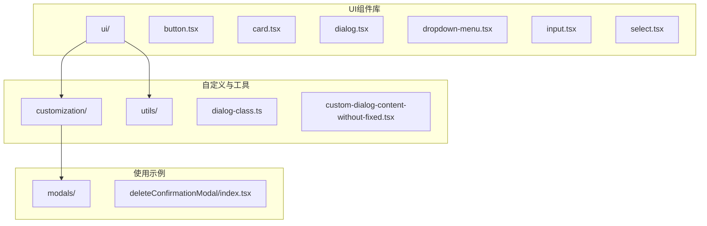
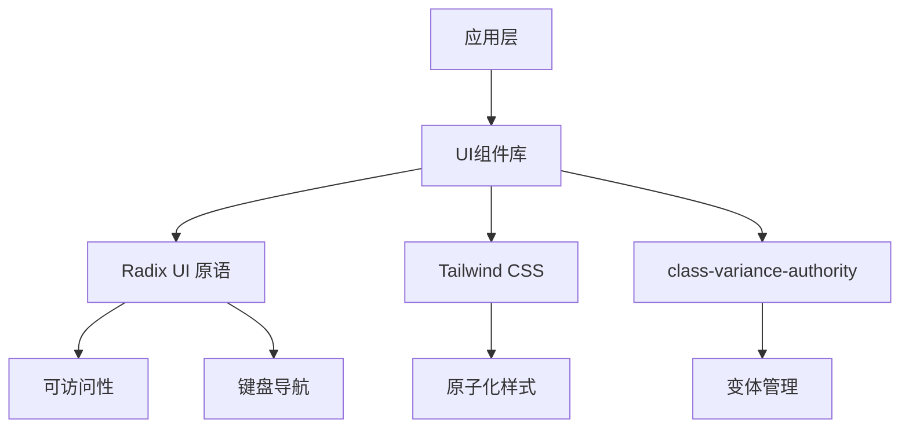
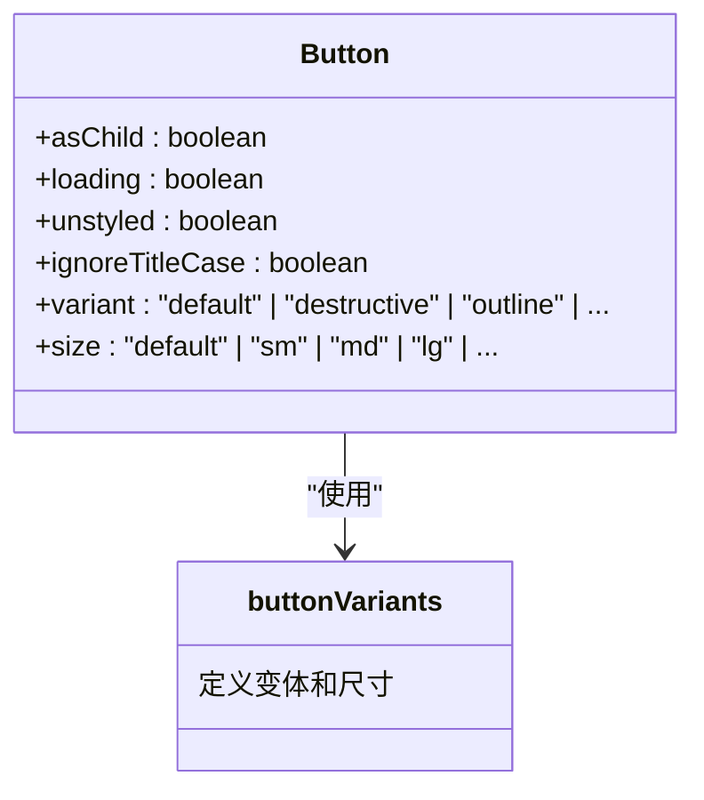
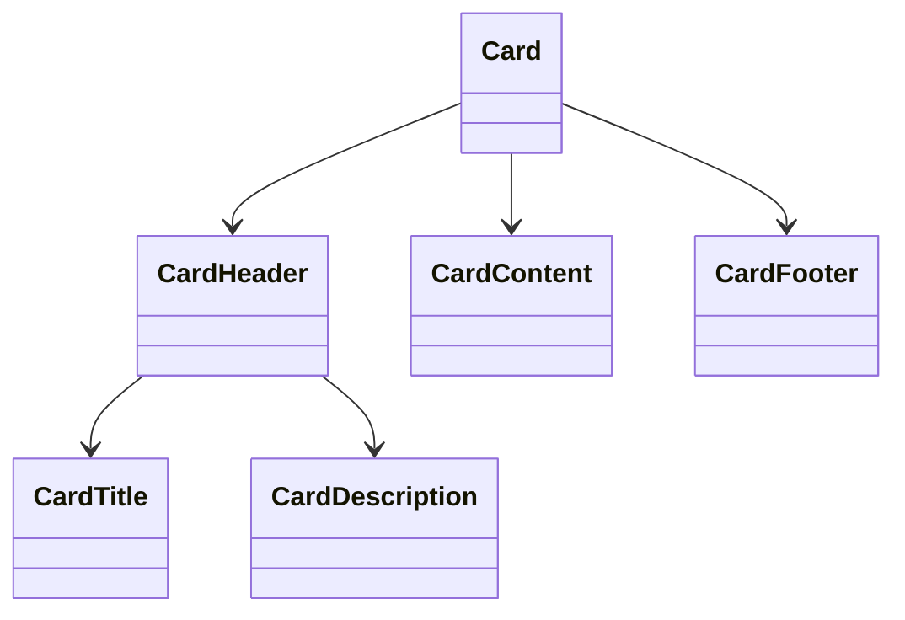
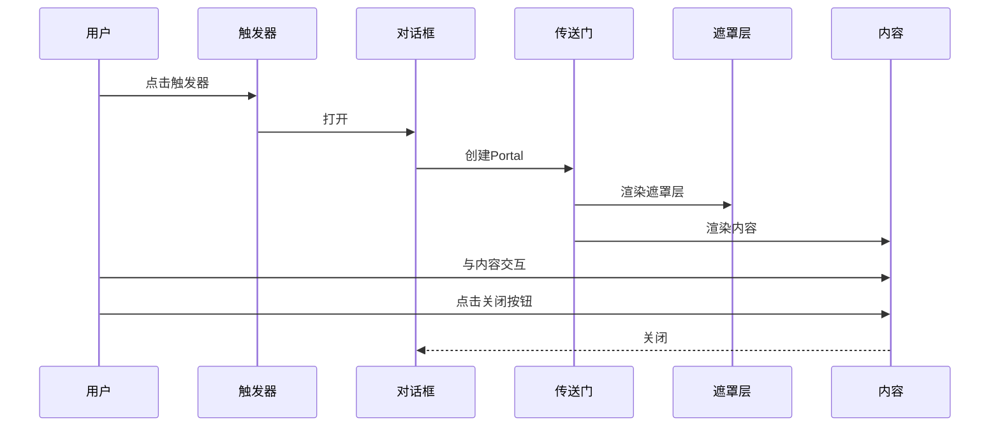
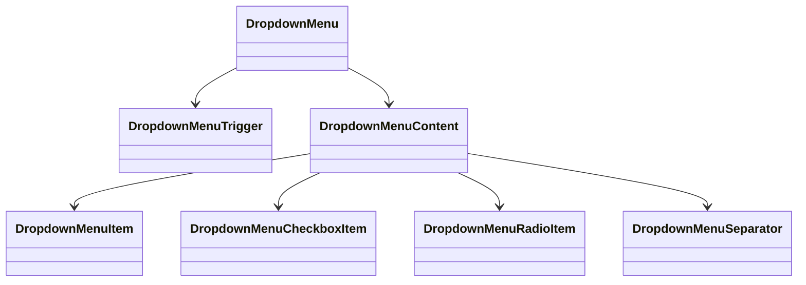
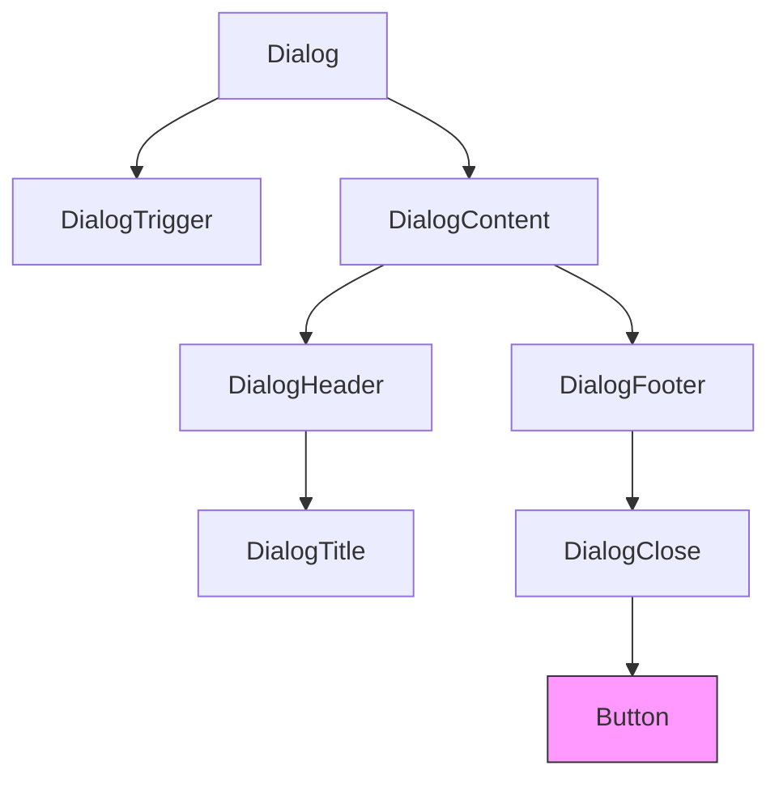
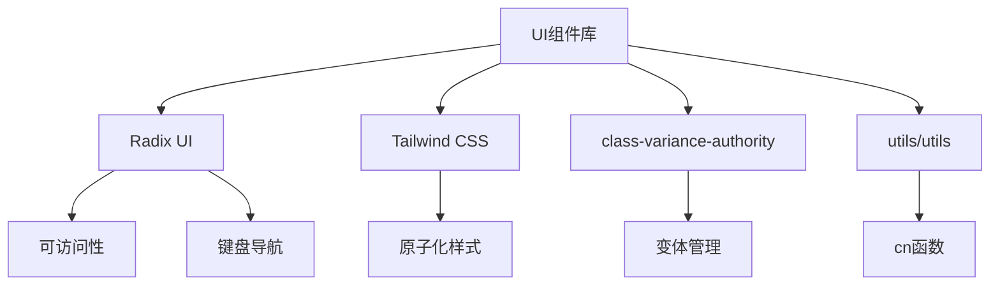

# UI组件库

<cite>
**本文档中引用的文件**  
- [button.tsx](file://vibe_surf/frontend/src/components/ui/button.tsx)
- [card.tsx](file://vibe_surf/frontend/src/components/ui/card.tsx)
- [dialog.tsx](file://vibe_surf/frontend/src/components/ui/dialog.tsx)
- [dropdown-menu.tsx](file://vibe_surf/frontend/src/components/ui/dropdown-menu.tsx)
- [input.tsx](file://vibe_surf/frontend/src/components/ui/input.tsx)
- [select.tsx](file://vibe_surf/frontend/src/components/ui/select.tsx)
- [dialog-class.ts](file://vibe_surf/frontend/src/customization/utils/dialog-class.ts)
- [custom-dialog-content-without-fixed.tsx](file://vibe_surf/frontend/src/customization/components/custom-dialog-content-without-fixed.tsx)
- [deleteConfirmationModal/index.tsx](file://vibe_surf/frontend/src/modals/deleteConfirmationModal/index.tsx)
</cite>

## 目录
1. [简介](#简介)
2. [项目结构](#项目结构)
3. [核心组件](#核心组件)
4. [架构概述](#架构概述)
5. [详细组件分析](#详细组件分析)
6. [依赖分析](#依赖分析)
7. [性能考虑](#性能考虑)
8. [故障排除指南](#故障排除指南)
9. [结论](#结论)

## 简介
本文档全面介绍VibeSurf UI组件库，该组件库基于ShadCN构建，提供了一系列可复用、可访问且主题可定制的React组件。文档涵盖核心组件的API接口、属性配置、使用场景、可访问性实现、键盘导航支持、无障碍设计、组合模式、插槽机制和主题继承等关键方面。通过本指南，开发者可以深入了解如何有效使用和扩展这些UI组件。

## 项目结构
VibeSurf前端的UI组件库位于`vibe_surf/frontend/src/components/ui`目录下，采用模块化设计，每个组件都有独立的文件。组件库基于Radix UI原语构建，确保了高可访问性和健壮性，并使用Tailwind CSS进行样式化。此外，项目包含自定义组件和工具函数，以支持特定的业务需求和设计系统。

**图示来源**
- [button.tsx](file://vibe_surf/frontend/src/components/ui/button.tsx)
- [card.tsx](file://vibe_surf/frontend/src/components/ui/card.tsx)
- [dialog.tsx](file://vibe_surf/frontend/src/components/ui/dialog.tsx)
- [dropdown-menu.tsx](file://vibe_surf/frontend/src/components/ui/dropdown-menu.tsx)
- [input.tsx](file://vibe_surf/frontend/src/components/ui/input.tsx)
- [select.tsx](file://vibe_surf/frontend/src/components/ui/select.tsx)
- [dialog-class.ts](file://vibe_surf/frontend/src/customization/utils/dialog-class.ts)
- [custom-dialog-content-without-fixed.tsx](file://vibe_surf/frontend/src/customization/components/custom-dialog-content-without-fixed.tsx)
- [deleteConfirmationModal/index.tsx](file://vibe_surf/frontend/src/modals/deleteConfirmationModal/index.tsx)

**章节来源**
- [button.tsx](file://vibe_surf/frontend/src/components/ui/button.tsx)
- [card.tsx](file://vibe_surf/frontend/src/components/ui/card.tsx)
- [dialog.tsx](file://vibe_surf/frontend/src/components/ui/dialog.tsx)

## 核心组件
VibeSurf UI组件库的核心组件包括Button（按钮）、Card（卡片）、Dialog（对话框）、Dropdown Menu（下拉菜单）、Input（输入框）和Select（选择器）等。这些组件均基于Radix UI构建，确保了原生级别的可访问性，并通过`class-variance-authority`（CVA）进行变体管理，提供了丰富的样式选项。组件设计遵循组合模式，允许通过插槽（slot）机制进行灵活的内容组合。

**章节来源**
- [button.tsx](file://vibe_surf/frontend/src/components/ui/button.tsx)
- [card.tsx](file://vibe_surf/frontend/src/components/ui/card.tsx)
- [dialog.tsx](file://vibe_surf/frontend/src/components/ui/dialog.tsx)
- [dropdown-menu.tsx](file://vibe_surf/frontend/src/components/ui/dropdown-menu.tsx)
- [input.tsx](file://vibe_surf/frontend/src/components/ui/input.tsx)
- [select.tsx](file://vibe_surf/frontend/src/components/ui/select.tsx)

## 架构概述
VibeSurf UI组件库的架构建立在几个关键库之上：Radix UI提供无样式的、可访问的原语组件；Tailwind CSS负责原子化样式；`class-variance-authority`（CVA）管理组件的变体和状态。这种分层架构确保了组件既具有高度的灵活性，又保持了代码的可维护性和一致性。组件通过导出复合对象（如`Button`和`buttonVariants`）来提供最大的使用灵活性。

**图示来源**
- [button.tsx](file://vibe_surf/frontend/src/components/ui/button.tsx)
- [dialog.tsx](file://vibe_surf/frontend/src/components/ui/dialog.tsx)
- [dropdown-menu.tsx](file://vibe_surf/frontend/src/components/ui/dropdown-menu.tsx)

## 详细组件分析

### 按钮组件分析
按钮组件（Button）是用户交互的基础。它通过`cva`函数定义了多种变体（如`default`、`destructive`、`outline`）和尺寸（如`default`、`sm`、`lg`），并支持加载状态。当`loading`属性为`true`时，组件会显示一个旋转的加载图标，同时隐藏原始文本，提供清晰的视觉反馈。

**图示来源**
- [button.tsx](file://vibe_surf/frontend/src/components/ui/button.tsx)

### 卡片组件分析
卡片组件（Card）提供了一个容器，用于将相关内容分组展示。它由`Card`、`CardHeader`、`CardTitle`、`CardDescription`、`CardContent`和`CardFooter`等多个子组件组成，形成了一个清晰的层次结构。这种组合模式使得开发者可以轻松地构建信息丰富的UI区块。

**图示来源**
- [card.tsx](file://vibe_surf/frontend/src/components/ui/card.tsx)

### 对话框组件分析
对话框组件（Dialog）实现了模态和非模态对话框。它利用Radix UI的`Portal`将对话框内容渲染到DOM树的顶层，确保其始终位于其他内容之上。该组件特别注重可访问性，通过`VisuallyHidden`组件为没有标题的对话框提供屏幕阅读器友好的隐藏标题，并通过`ShadTooltip`为关闭按钮提供额外的文本提示。

**图示来源**
- [dialog.tsx](file://vibe_surf/frontend/src/components/ui/dialog.tsx)
- [custom-dialog-content-without-fixed.tsx](file://vibe_surf/frontend/src/customization/components/custom-dialog-content-without-fixed.tsx)
- [dialog-class.ts](file://vibe_surf/frontend/src/customization/utils/dialog-class.ts)

### 下拉菜单组件分析
下拉菜单组件（DropdownMenu）提供了一个可组合的菜单系统。它支持嵌套子菜单（`DropdownMenuSub`）、复选框项（`DropdownMenuCheckboxItem`）和单选组（`DropdownMenuRadioGroup`）。每个菜单项都通过`data-[disabled]`属性处理禁用状态，确保了良好的视觉反馈和交互一致性。

**图示来源**
- [dropdown-menu.tsx](file://vibe_surf/frontend/src/components/ui/dropdown-menu.tsx)

### 组合与插槽模式
VibeSurf UI组件库广泛使用了组合和插槽模式。例如，在`deleteConfirmationModal`中，`Dialog`组件通过`DialogTrigger`和`DialogContent`等子组件来定义其结构。`asChild`属性允许将任意组件（如`Button`）作为触发器，而不会破坏其原有的样式和行为，这极大地增强了组件的灵活性。

**图示来源**
- [deleteConfirmationModal/index.tsx](file://vibe_surf/frontend/src/modals/deleteConfirmationModal/index.tsx)
- [dialog.tsx](file://vibe_surf/frontend/src/components/ui/dialog.tsx)

**章节来源**
- [deleteConfirmationModal/index.tsx](file://vibe_surf/frontend/src/modals/deleteConfirmationModal/index.tsx)

## 依赖分析
UI组件库的核心依赖是Radix UI，它提供了所有底层的可访问性原语。Tailwind CSS作为样式引擎，通过`cn`工具函数（来自`../../utils/utils`）进行条件类名合并。`class-variance-authority`用于管理按钮等组件的复杂变体逻辑。这些依赖共同确保了组件库的健壮性、可访问性和可定制性。

**图示来源**
- [button.tsx](file://vibe_surf/frontend/src/components/ui/button.tsx)
- [dialog.tsx](file://vibe_surf/frontend/src/components/ui/dialog.tsx)
- [dropdown-menu.tsx](file://vibe_surf/frontend/src/components/ui/dropdown-menu.tsx)

**章节来源**
- [button.tsx](file://vibe_surf/frontend/src/components/ui/button.tsx)
- [utils/utils](file://vibe_surf/frontend/src/utils/utils)

## 性能考虑
组件库在性能方面进行了优化。例如，`Button`组件在加载状态时，通过绝对定位的`span`元素来显示加载图标，避免了DOM结构的频繁变更。`React.forwardRef`的使用确保了引用的正确传递，这对于动画和焦点管理至关重要。此外，通过`React.memo`或`useCallback`等React优化技术，可以在需要时减少不必要的重新渲染。

## 故障排除指南
常见问题包括组件样式不生效或变体未正确应用。这通常是由于`tailwind.config.mjs`中的配置不正确或`cn`工具函数未正确导入导致的。另一个常见问题是对话框无法正确关闭，这可能与`DialogPrimitive.Close`组件的使用或事件冒泡有关。确保在自定义关闭逻辑中调用`e.stopPropagation()`可以防止事件冒泡导致的意外行为。

**章节来源**
- [deleteConfirmationModal/index.tsx](file://vibe_surf/frontend/src/modals/deleteConfirmationModal/index.tsx)
- [button.tsx](file://vibe_surf/frontend/src/components/ui/button.tsx)

## 结论
VibeSurf UI组件库是一个基于ShadCN和Radix UI构建的现代化、可访问的React组件库。它通过清晰的组合模式、强大的变体系统和对可访问性的深度关注，为开发者提供了构建高质量用户界面所需的一切。通过遵循本文档中的指导，开发者可以有效地利用这些组件来创建一致、可靠且用户友好的应用程序。