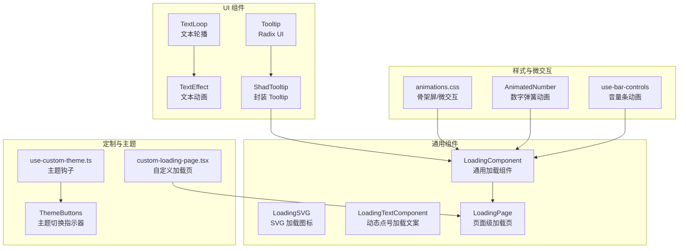
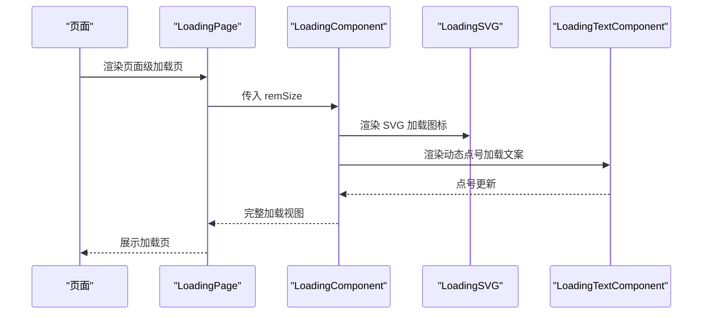
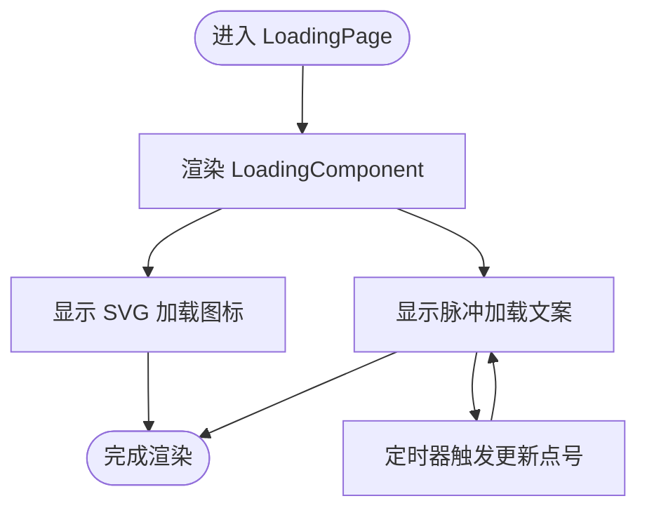
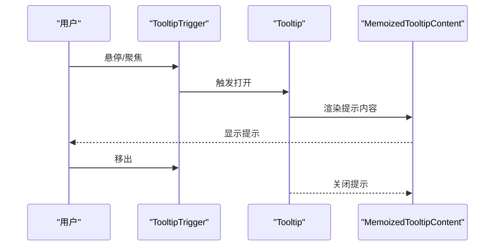
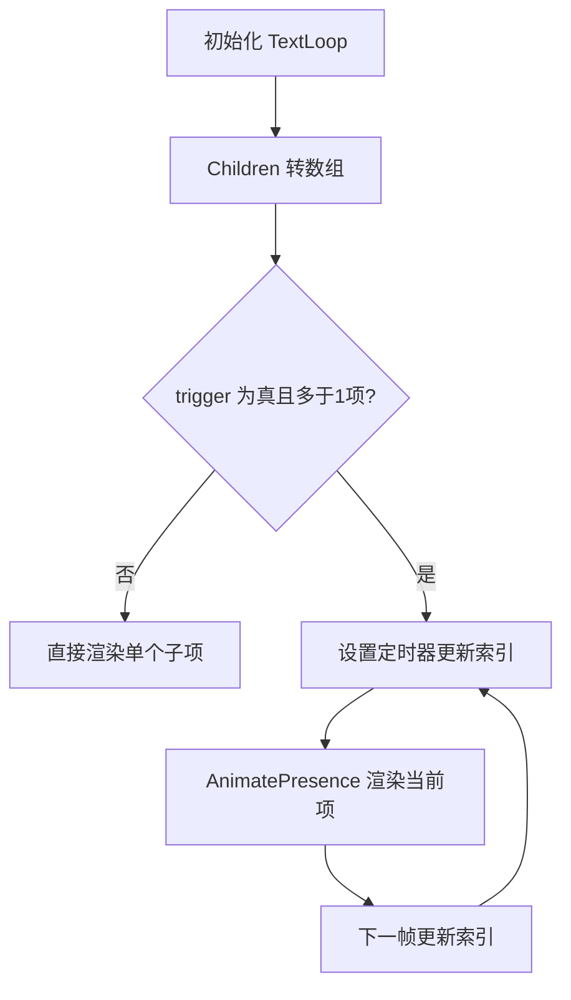
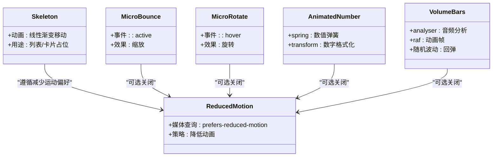
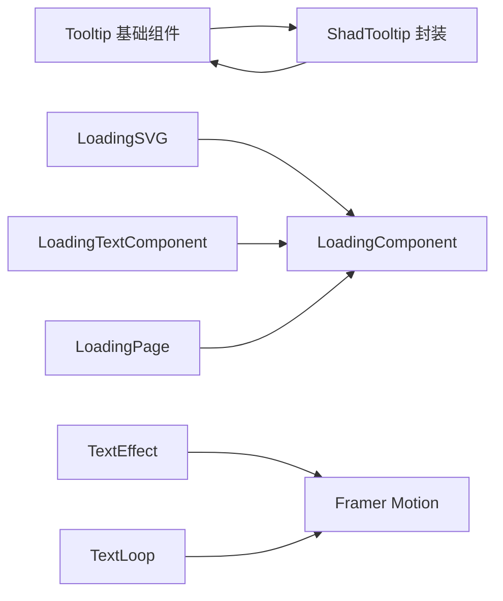

# 交互设计

<cite>
**本文引用的文件**
- [loading.tsx](file://vibe_surf/frontend/src/components/ui/loading.tsx)
- [loadingComponent/index.tsx](file://vibe_surf/frontend/src/components/common/loadingComponent/index.tsx)
- [loadingTextComponent/index.tsx](file://vibe_surf/frontend/src/components/common/loadingTextComponent/index.tsx)
- [pages/LoadingPage/index.tsx](file://vibe_surf/frontend/src/pages/LoadingPage/index.tsx)
- [components/common/shadTooltipComponent/index.tsx](file://vibe_surf/frontend/src/components/common/shadTooltipComponent/index.tsx)
- [components/ui/tooltip.tsx](file://vibe_surf/frontend/src/components/ui/tooltip.tsx)
- [components/ui/text-loop.tsx](file://vibe_surf/frontend/src/components/ui/text-loop.tsx)
- [components/ui/textAnimation.tsx](file://vibe_surf/frontend/src/components/ui/textAnimation.tsx)
- [styles/animations.css](file://vibe_surf/frontend/src/chrome_extension/styles/animations.css)
- [customization/components/custom-loading-page.tsx](file://vibe_surf/frontend/src/customization/components/custom-loading-page.tsx)
- [customization/config-constants.ts](file://vibe_surf/frontend/src/customization/config-constants.ts)
- [customization/hooks/use-custom-theme.ts](file://vibe_surf/frontend/src/customization/hooks/use-custom-theme.ts)
- [components/core/appHeaderComponent/components/ThemeButtons/index.tsx](file://vibe_surf/frontend/src/components/core/appHeaderComponent/components/ThemeButtons/index.tsx)
- [components/common/animatedNumbers/index.tsx](file://vibe_surf/frontend/src/components/common/animatedNumbers/index.tsx)
- [modals/IOModal/components/chatView/chatInput/components/voice-assistant/hooks/use-bar-controls.ts](file://vibe_surf/frontend/src/modals/IOModal/components/chatView/chatInput/components/voice-assistant/hooks/use-bar-controls.ts)
- [find_page_element.py](file://vibe_surf/browser/find_page_element.py)
- [index.tsx](file://vibe_surf/frontend/src/index.tsx)
</cite>

## 目录
1. [简介](#简介)
2. [项目结构](#项目结构)
3. [核心组件](#核心组件)
4. [架构总览](#架构总览)
5. [详细组件分析](#详细组件分析)
6. [依赖关系分析](#依赖关系分析)
7. [性能考量](#性能考量)
8. [可访问性指南](#可访问性指南)
9. [故障排查指南](#故障排查指南)
10. [结论](#结论)

## 简介
本文件聚焦于 VibeSurf 前端交互设计，系统梳理并解析以下关键交互元素与机制：
- 加载状态：包含 SVG 动画加载图标、通用加载组件、动态点号加载文案组件，以及页面级加载页。
- 工具提示：基于 Radix UI 的 Tooltip 组件体系，以及封装的 ShadTooltip 组件，支持延迟、定位、碰撞避免与自定义样式。
- 文本动画：TextLoop 文本轮播组件与 TextEffect 文本逐段/逐字/逐词入场动画，配合 Framer Motion 实现流畅过渡。
- 视觉反馈与微交互：骨架屏加载、微缩放、旋转、主题切换指示器、音量条动画等。
- 配置与定制：主题钩子、自定义加载页、常量配置等。
- 性能与可访问性：动画节流、减少运动偏好适配、无障碍标签与语义化结构。

## 项目结构
前端交互相关代码主要分布在以下目录：
- components/ui：基础 UI 动画与提示组件（如 Tooltip、TextLoop、TextEffect）
- components/common：通用交互组件（如 Loading、ShadTooltip 封装、LoadingText）
- pages：页面级加载页
- chrome_extension/styles：扩展侧动画与微交互样式
- customization：主题与加载页定制入口
- 其他：音量条动画、主题按钮、数字动画等

图表来源
- [components/ui/text-loop.tsx](file://vibe_surf/frontend/src/components/ui/text-loop.tsx#L1-L100)
- [components/ui/textAnimation.tsx](file://vibe_surf/frontend/src/components/ui/textAnimation.tsx#L102-L226)
- [components/ui/tooltip.tsx](file://vibe_surf/frontend/src/components/ui/tooltip.tsx#L1-L54)
- [components/common/shadTooltipComponent/index.tsx](file://vibe_surf/frontend/src/components/common/shadTooltipComponent/index.tsx#L1-L98)
- [components/common/loadingComponent/index.tsx](file://vibe_surf/frontend/src/components/common/loadingComponent/index.tsx#L1-L28)
- [components/ui/loading.tsx](file://vibe_surf/frontend/src/components/ui/loading.tsx#L1-L44)
- [components/common/loadingTextComponent/index.tsx](file://vibe_surf/frontend/src/components/common/loadingTextComponent/index.tsx#L1-L23)
- [pages/LoadingPage/index.tsx](file://vibe_surf/frontend/src/pages/LoadingPage/index.tsx#L1-L15)
- [styles/animations.css](file://vibe_surf/frontend/src/chrome_extension/styles/animations.css#L405-L471)
- [components/common/animatedNumbers/index.tsx](file://vibe_surf/frontend/src/components/common/animatedNumbers/index.tsx#L1-L67)
- [modals/IOModal/components/chatView/chatInput/components/voice-assistant/hooks/use-bar-controls.ts](file://vibe_surf/frontend/src/modals/IOModal/components/chatView/chatInput/components/voice-assistant/hooks/use-bar-controls.ts#L114-L172)
- [customization/components/custom-loading-page.tsx](file://vibe_surf/frontend/src/customization/components/custom-loading-page.tsx#L1-L3)
- [customization/hooks/use-custom-theme.ts](file://vibe_surf/frontend/src/customization/hooks/use-custom-theme.ts)
- [components/core/appHeaderComponent/components/ThemeButtons/index.tsx](file://vibe_surf/frontend/src/components/core/appHeaderComponent/components/ThemeButtons/index.tsx#L1-L64)

章节来源
- [index.tsx](file://vibe_surf/frontend/src/index.tsx#L1-L19)

## 核心组件
- 加载组件族
  - SVG 加载图标：通过 SVG 动画实现旋转与描边位移，适合小尺寸、高帧率反馈。
  - 通用加载组件：以矢量路径绘制的圆形旋转加载，带脉冲文本“加载中”。
  - 动态点号加载文案：定时更新点数，营造等待感。
  - 页面级加载页：居中布局，支持覆盖层模式。
- 工具提示
  - Tooltip 基础组件：提供 Provider、Root、Trigger、Content、Portal 等能力。
  - ShadTooltip 封装：统一类名、延迟、定位、碰撞避免、受控 open 状态，并对内容进行记忆化。
- 文本动画
  - TextLoop：按时间间隔循环展示多个子节点，支持过渡与回调。
  - TextEffect：按行/词/字符拆分，逐段入场，支持预设与延迟。
- 微交互与视觉反馈
  - 骨架屏：线性渐变背景移动，模拟内容加载。
  - 微缩放/旋转：按钮按下缩放、悬停旋转，提升触控反馈。
  - 主题切换指示器：滑动指示器随选中主题变化。
  - 数字弹簧动画：数值变化时平滑过渡。
  - 音量条动画：基于音频分析的柱状条高度随机波动与回弹。

章节来源
- [components/ui/loading.tsx](file://vibe_surf/frontend/src/components/ui/loading.tsx#L1-L44)
- [components/common/loadingComponent/index.tsx](file://vibe_surf/frontend/src/components/common/loadingComponent/index.tsx#L1-L28)
- [components/common/loadingTextComponent/index.tsx](file://vibe_surf/frontend/src/components/common/loadingTextComponent/index.tsx#L1-L23)
- [pages/LoadingPage/index.tsx](file://vibe_surf/frontend/src/pages/LoadingPage/index.tsx#L1-L15)
- [components/ui/tooltip.tsx](file://vibe_surf/frontend/src/components/ui/tooltip.tsx#L1-L54)
- [components/common/shadTooltipComponent/index.tsx](file://vibe_surf/frontend/src/components/common/shadTooltipComponent/index.tsx#L1-L98)
- [components/ui/text-loop.tsx](file://vibe_surf/frontend/src/components/ui/text-loop.tsx#L1-L100)
- [components/ui/textAnimation.tsx](file://vibe_surf/frontend/src/components/ui/textAnimation.tsx#L102-L226)
- [styles/animations.css](file://vibe_surf/frontend/src/chrome_extension/styles/animations.css#L405-L471)
- [components/common/animatedNumbers/index.tsx](file://vibe_surf/frontend/src/components/common/animatedNumbers/index.tsx#L1-L67)
- [modals/IOModal/components/chatView/chatInput/components/voice-assistant/hooks/use-bar-controls.ts](file://vibe_surf/frontend/src/modals/IOModal/components/chatView/chatInput/components/voice-assistant/hooks/use-bar-controls.ts#L114-L172)
- [components/core/appHeaderComponent/components/ThemeButtons/index.tsx](file://vibe_surf/frontend/src/components/core/appHeaderComponent/components/ThemeButtons/index.tsx#L1-L64)

## 架构总览
交互组件之间的调用关系如下：
- 页面级加载页依赖通用加载组件；通用加载组件内部组合 SVG 加载图标与脉冲文本。
- ShadTooltip 封装 Tooltip，统一样式与行为，作为通用提示组件被广泛复用。
- 文本动画组件 TextLoop 与 TextEffect 通过 Framer Motion 提供一致的过渡体验。
- 微交互样式与动画由 CSS 与 Hook 共同实现，贯穿主题切换、音量可视化与数字动画。

图表来源
- [pages/LoadingPage/index.tsx](file://vibe_surf/frontend/src/pages/LoadingPage/index.tsx#L1-L15)
- [components/common/loadingComponent/index.tsx](file://vibe_surf/frontend/src/components/common/loadingComponent/index.tsx#L1-L28)
- [components/ui/loading.tsx](file://vibe_surf/frontend/src/components/ui/loading.tsx#L1-L44)
- [components/common/loadingTextComponent/index.tsx](file://vibe_surf/frontend/src/components/common/loadingTextComponent/index.tsx#L1-L23)

## 详细组件分析

### 加载组件族（Loading）
- SVG 加载图标（LoadingSVG）
  - 使用 SVG 圆形与 stroke-dasharray/dashoffset 实现描边动画，配合旋转动画形成无限循环。
  - 适合小尺寸、高帧率反馈，占用资源低。
- 通用加载组件（LoadingComponent）
  - 采用矢量路径绘制的圆形旋转，结合脉冲文本“加载中”，提供明确的语义化状态。
  - 支持 rem 单位尺寸控制，便于在不同密度下保持一致观感。
- 动态点号加载文案（LoadingTextComponent）
  - 通过定时器每 300ms 更新点号数量，实现“加载中…”的动态效果。
  - 在文本为空时返回空，避免无意义渲染。
- 页面级加载页（LoadingPage）
  - 居中布局，支持覆盖层模式，用于全屏加载或局部遮罩场景。

图表来源
- [pages/LoadingPage/index.tsx](file://vibe_surf/frontend/src/pages/LoadingPage/index.tsx#L1-L15)
- [components/common/loadingComponent/index.tsx](file://vibe_surf/frontend/src/components/common/loadingComponent/index.tsx#L1-L28)
- [components/ui/loading.tsx](file://vibe_surf/frontend/src/components/ui/loading.tsx#L1-L44)
- [components/common/loadingTextComponent/index.tsx](file://vibe_surf/frontend/src/components/common/loadingTextComponent/index.tsx#L1-L23)

章节来源
- [components/ui/loading.tsx](file://vibe_surf/frontend/src/components/ui/loading.tsx#L1-L44)
- [components/common/loadingComponent/index.tsx](file://vibe_surf/frontend/src/components/common/loadingComponent/index.tsx#L1-L28)
- [components/common/loadingTextComponent/index.tsx](file://vibe_surf/frontend/src/components/common/loadingTextComponent/index.tsx#L1-L23)
- [pages/LoadingPage/index.tsx](file://vibe_surf/frontend/src/pages/LoadingPage/index.tsx#L1-L15)

### 工具提示（Tooltip）
- Tooltip 基础组件
  - 提供 Provider、Root、Trigger、Content、Portal 等能力，支持侧向偏移、动画进入等。
- ShadTooltip 封装
  - 统一类名、延迟、定位、碰撞避免与受控 open 状态。
  - 对 TooltipContent 进行记忆化，避免不必要的重渲染。
  - 当 content 为空时直接返回 children，减少无效包裹。
  - 支持 asChild、align、side 等参数，满足多样布局需求。

图表来源
- [components/ui/tooltip.tsx](file://vibe_surf/frontend/src/components/ui/tooltip.tsx#L1-L54)
- [components/common/shadTooltipComponent/index.tsx](file://vibe_surf/frontend/src/components/common/shadTooltipComponent/index.tsx#L1-L98)

章节来源
- [components/ui/tooltip.tsx](file://vibe_surf/frontend/src/components/ui/tooltip.tsx#L1-L54)
- [components/common/shadTooltipComponent/index.tsx](file://vibe_surf/frontend/src/components/common/shadTooltipComponent/index.tsx#L1-L98)

### 文本动画（TextLoop 与 TextEffect）
- TextLoop
  - 接收多个子节点，按设定间隔循环展示，支持过渡与回调。
  - 使用 AnimatePresence 与 motion 控制进场/出场，mode 默认 popLayout。
- TextEffect
  - 支持按行/词/字符拆分，逐段入场，支持预设与延迟。
  - 通过 AnimationComponent 内部根据粒度生成 span 结构，支持自定义 wrapper 类名。

图表来源
- [components/ui/text-loop.tsx](file://vibe_surf/frontend/src/components/ui/text-loop.tsx#L1-L100)
- [components/ui/textAnimation.tsx](file://vibe_surf/frontend/src/components/ui/textAnimation.tsx#L102-L226)

章节来源
- [components/ui/text-loop.tsx](file://vibe_surf/frontend/src/components/ui/text-loop.tsx#L1-L100)
- [components/ui/textAnimation.tsx](file://vibe_surf/frontend/src/components/ui/textAnimation.tsx#L102-L226)

### 微交互与视觉反馈
- 骨架屏（Skeleton）
  - 线性渐变背景沿水平方向移动，模拟内容加载，适合列表/卡片占位。
- 微缩放与旋转
  - 按钮按下时轻微缩放，悬停时旋转，增强触控反馈与可用性。
- 减少运动偏好
  - 响应 prefers-reduced-motion，降低动画持续时间与迭代次数，保障敏感用户体验。
- 主题切换指示器
  - ThemeButtons 中的滑动指示器随选中主题变化，提供即时反馈。
- 数字弹簧动画
  - AnimatedNumber 使用 spring 与 transform 实现数值平滑过渡，适合统计/计数场景。
- 音量条动画
  - 基于音频分析器的柱状条高度随机波动与回弹，结合 requestAnimationFrame 保证流畅度。

图表来源
- [styles/animations.css](file://vibe_surf/frontend/src/chrome_extension/styles/animations.css#L405-L471)
- [components/common/animatedNumbers/index.tsx](file://vibe_surf/frontend/src/components/common/animatedNumbers/index.tsx#L1-L67)
- [modals/IOModal/components/chatView/chatInput/components/voice-assistant/hooks/use-bar-controls.ts](file://vibe_surf/frontend/src/modals/IOModal/components/chatView/chatInput/components/voice-assistant/hooks/use-bar-controls.ts#L114-L172)
- [components/core/appHeaderComponent/components/ThemeButtons/index.tsx](file://vibe_surf/frontend/src/components/core/appHeaderComponent/components/ThemeButtons/index.tsx#L1-L64)

章节来源
- [styles/animations.css](file://vibe_surf/frontend/src/chrome_extension/styles/animations.css#L405-L471)
- [components/common/animatedNumbers/index.tsx](file://vibe_surf/frontend/src/components/common/animatedNumbers/index.tsx#L1-L67)
- [modals/IOModal/components/chatView/chatInput/components/voice-assistant/hooks/use-bar-controls.ts](file://vibe_surf/frontend/src/modals/IOModal/components/chatView/chatInput/components/voice-assistant/hooks/use-bar-controls.ts#L114-L172)
- [components/core/appHeaderComponent/components/ThemeButtons/index.tsx](file://vibe_surf/frontend/src/components/core/appHeaderComponent/components/ThemeButtons/index.tsx#L1-L64)

## 依赖关系分析
- 组件耦合
  - ShadTooltip 依赖 Tooltip 基础组件，统一样式与行为，降低上层使用复杂度。
  - LoadingPage 依赖 LoadingComponent，后者内部组合 LoadingSVG 与 LoadingTextComponent。
  - TextEffect 依赖 Framer Motion，TextLoop 同样依赖 AnimatePresence/motion。
- 外部依赖
  - Radix UI：Tooltip 的底层实现。
  - Framer Motion：文本动画与过渡的基础。
  - Tailwind CSS：类名合并与主题变量。
- 可能的循环依赖
  - 未发现直接循环导入；组件间通过 props 传递状态，避免循环引用。

图表来源
- [components/ui/tooltip.tsx](file://vibe_surf/frontend/src/components/ui/tooltip.tsx#L1-L54)
- [components/common/shadTooltipComponent/index.tsx](file://vibe_surf/frontend/src/components/common/shadTooltipComponent/index.tsx#L1-L98)
- [components/common/loadingComponent/index.tsx](file://vibe_surf/frontend/src/components/common/loadingComponent/index.tsx#L1-L28)
- [components/ui/loading.tsx](file://vibe_surf/frontend/src/components/ui/loading.tsx#L1-L44)
- [components/common/loadingTextComponent/index.tsx](file://vibe_surf/frontend/src/components/common/loadingTextComponent/index.tsx#L1-L23)
- [pages/LoadingPage/index.tsx](file://vibe_surf/frontend/src/pages/LoadingPage/index.tsx#L1-L15)
- [components/ui/text-loop.tsx](file://vibe_surf/frontend/src/components/ui/text-loop.tsx#L1-L100)
- [components/ui/textAnimation.tsx](file://vibe_surf/frontend/src/components/ui/textAnimation.tsx#L102-L226)

章节来源
- [components/ui/tooltip.tsx](file://vibe_surf/frontend/src/components/ui/tooltip.tsx#L1-L54)
- [components/common/shadTooltipComponent/index.tsx](file://vibe_surf/frontend/src/components/common/shadTooltipComponent/index.tsx#L1-L98)
- [components/common/loadingComponent/index.tsx](file://vibe_surf/frontend/src/components/common/loadingComponent/index.tsx#L1-L28)
- [components/ui/loading.tsx](file://vibe_surf/frontend/src/components/ui/loading.tsx#L1-L44)
- [components/common/loadingTextComponent/index.tsx](file://vibe_surf/frontend/src/components/common/loadingTextComponent/index.tsx#L1-L23)
- [pages/LoadingPage/index.tsx](file://vibe_surf/frontend/src/pages/LoadingPage/index.tsx#L1-L15)
- [components/ui/text-loop.tsx](file://vibe_surf/frontend/src/components/ui/text-loop.tsx#L1-L100)
- [components/ui/textAnimation.tsx](file://vibe_surf/frontend/src/components/ui/textAnimation.tsx#L102-L226)

## 性能考量
- 动画与渲染
  - 使用 memo 与 useMemo 降低 Tooltip 与内容的重渲染频率。
  - TextLoop 仅在 trigger 为真且存在多个子项时启动定时器，避免无效开销。
  - 骨架屏使用线性渐变移动，避免复杂布局抖动。
- 资源与体积
  - SVG 加载图标与矢量路径加载组件体积小、帧率稳定，适合频繁显示。
  - 减少运动偏好下，将动画持续时间降至极短，避免卡顿。
- 计算密集型
  - 音量条动画使用 requestAnimationFrame 并限制更新频率，避免过度计算。
  - AnimatedNumber 使用 spring 与 transform，避免频繁 DOM 操作。
- 最佳实践
  - 在长列表/大量提示场景中，优先使用骨架屏与轻量动画。
  - 对高频交互（如滚动、悬停）尽量使用纯 CSS 动画或较低复杂度的 JS 动画。
  - 合理设置 TextLoop 的 interval，避免过快导致视觉疲劳。

[本节为通用指导，不直接分析具体文件]

## 可访问性指南
- 语义化与标签
  - 加载组件提供 role 与 aria-hidden，确保读屏器正确处理。
  - Tooltip 内容具备清晰文本，避免仅依赖图标传达信息。
- 无障碍属性
  - 为可交互元素提供 aria-label 或关联 label，确保键盘可达。
  - 对动态点号加载文案，确保其语义与上下文一致。
- 减少运动偏好
  - 自动响应 prefers-reduced-motion，降低动画持续时间与迭代次数。
- 键盘与焦点
  - Tooltip 支持键盘触发与焦点管理，确保非鼠标用户可操作。
- 测试建议
  - 使用读屏器验证加载状态与提示文本的可理解性。
  - 在减少运动模式下测试动画表现，确保可读性与稳定性。

章节来源
- [components/common/loadingComponent/index.tsx](file://vibe_surf/frontend/src/components/common/loadingComponent/index.tsx#L1-L28)
- [components/common/loadingTextComponent/index.tsx](file://vibe_surf/frontend/src/components/common/loadingTextComponent/index.tsx#L1-L23)
- [components/ui/tooltip.tsx](file://vibe_surf/frontend/src/components/ui/tooltip.tsx#L1-L54)
- [styles/animations.css](file://vibe_surf/frontend/src/chrome_extension/styles/animations.css#L459-L471)
- [find_page_element.py](file://vibe_surf/browser/find_page_element.py#L34-L637)

## 故障排查指南
- Tooltip 不显示或闪烁
  - 检查 content 是否为空，空内容将直接返回 children。
  - 确认 delayDuration、open 与 setOpen 的状态同步。
  - 验证 Portal 渲染是否成功，避免父容器裁剪。
- 加载动画不生效
  - 确认 SVG 动画属性（stroke-dasharray、dashoffset、transform）未被外部样式覆盖。
  - 检查 remSize 与容器尺寸匹配，避免被裁切。
- 文本动画卡顿
  - 调整 TextLoop 的 interval，避免过短导致频繁重排。
  - 在减少运动模式下观察动画是否被抑制。
- 音量条动画异常
  - 确认 analyser 正常工作，避免在静音或权限不足时出现异常。
  - 控制 requestAnimationFrame 的使用频率，避免过度更新。

章节来源
- [components/common/shadTooltipComponent/index.tsx](file://vibe_surf/frontend/src/components/common/shadTooltipComponent/index.tsx#L1-L98)
- [components/ui/loading.tsx](file://vibe_surf/frontend/src/components/ui/loading.tsx#L1-L44)
- [components/common/loadingComponent/index.tsx](file://vibe_surf/frontend/src/components/common/loadingComponent/index.tsx#L1-L28)
- [components/ui/text-loop.tsx](file://vibe_surf/frontend/src/components/ui/text-loop.tsx#L1-L100)
- [modals/IOModal/components/chatView/chatInput/components/voice-assistant/hooks/use-bar-controls.ts](file://vibe_surf/frontend/src/modals/IOModal/components/chatView/chatInput/components/voice-assistant/hooks/use-bar-controls.ts#L114-L172)

## 结论
VibeSurf 前端交互设计围绕“清晰的状态反馈、一致的微交互与良好的可访问性”展开。通过 SVG 加载图标、通用加载组件与动态点号文案构建了直观的加载体验；ShadTooltip 封装统一了提示行为；TextLoop 与 TextEffect 提供丰富的文本动画能力；骨架屏与微交互样式则提升了整体的流畅度与可用性。结合主题钩子与减少运动偏好，系统在不同设备与用户需求下均能提供稳定、友好且高性能的交互体验。