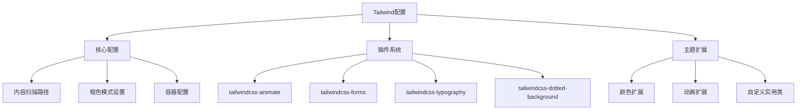
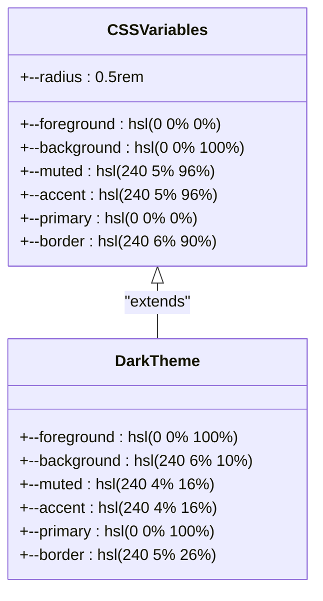
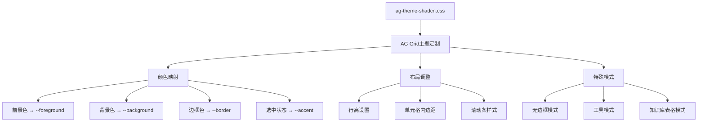
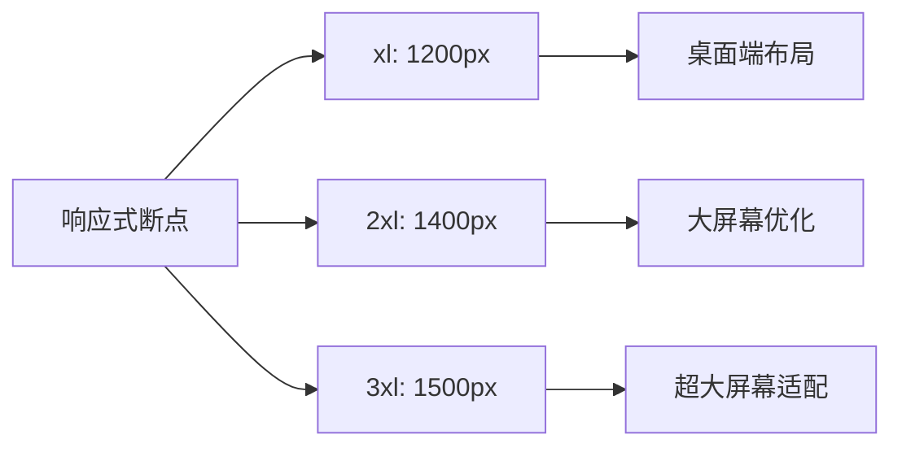
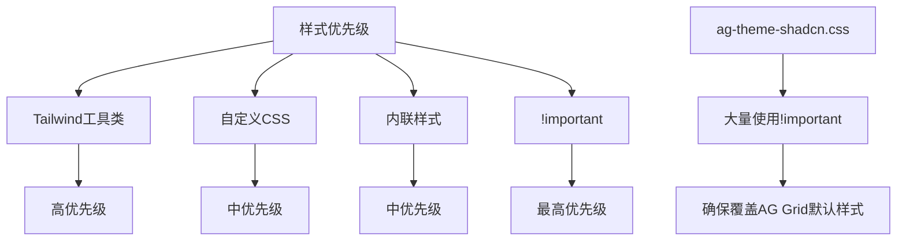
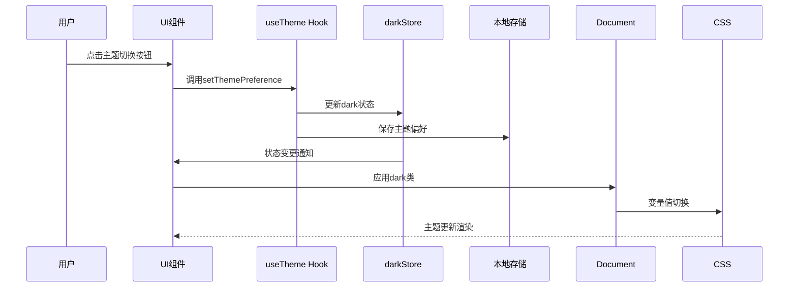
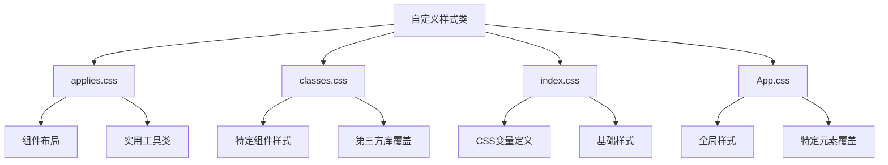
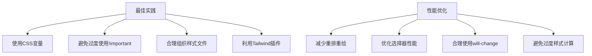

# 样式架构

<cite>
**本文档引用的文件**
- [tailwind.config.mjs](file://vibe_surf/frontend/tailwind.config.mjs)
- [ag-theme-shadcn.css](file://vibe_surf/frontend/src/style/ag-theme-shadcn.css)
- [index.css](file://vibe_surf/frontend/src/style/index.css)
- [App.css](file://vibe_surf/frontend/src/App.css)
- [variables.css](file://vibe_surf/chrome_extension/styles/variables.css)
- [use-custom-theme.ts](file://vibe_surf/frontend/src/customization/hooks/use-custom-theme.ts)
- [ThemeButtons/index.tsx](file://vibe_surf/frontend/src/components/core/appHeaderComponent/components/ThemeButtons/index.tsx)
</cite>

## 目录
1. [简介](#简介)
2. [Tailwind CSS配置分析](#tailwind-css配置分析)
3. [CSS变量与主题系统](#css变量与主题系统)
4. [ag-theme-shadcn.css主题文件](#ag-theme-shadcn.css主题文件)
5. [响应式断点配置](#响应式断点配置)
6. [样式优先级管理](#样式优先级管理)
7. [深色/浅色模式切换实现](#深色/浅色模式切换实现)
8. [自定义样式类组织方式](#自定义样式类组织方式)
9. [最佳实践与性能优化建议](#最佳实践与性能优化建议)

## 简介
VibeSurf前端样式架构基于Tailwind CSS构建，采用现代化的CSS-in-JS方法论，结合CSS变量和主题系统实现灵活的样式管理。该架构通过ag-theme-shadcn.css主题文件为第三方UI组件库提供样式定制，同时利用Tailwind的配置扩展功能创建自定义设计系统。样式系统支持深色/浅色模式切换，通过CSS变量实现主题的动态变更，并采用模块化的组织方式确保样式的可维护性和可扩展性。

## Tailwind CSS配置分析

**Diagram sources**
- [tailwind.config.mjs](file://vibe_surf/frontend/tailwind.config.mjs#L1-L522)

**Section sources**
- [tailwind.config.mjs](file://vibe_surf/frontend/tailwind.config.mjs#L1-L522)

VibeSurf的Tailwind CSS配置文件(tailwind.config.mjs)定义了完整的样式系统架构。配置中通过`darkMode: ["class"]`启用基于类的暗色模式支持，允许通过添加`dark`类来切换主题。`content`字段指定了需要扫描的文件路径，确保所有JSX/TSX文件中的Tailwind类名都能被正确识别和生成。

配置文件扩展了多种Tailwind插件，包括：
- `tailwindcss-animate`：提供预定义的动画效果
- `tailwindcss-forms`：重置表单元素样式
- `tailwindcss-typography`：优化排版样式
- `tailwindcss-dotted-background`：创建点状背景效果

在主题扩展部分，配置文件定义了丰富的自定义样式，包括关键帧动画、颜色调色板、边框半径、字体系列等。特别值得注意的是，通过自定义插件创建了多种实用类，如`scrollbar-hide`（隐藏滚动条）、`truncate-multiline`（多行文本截断）和`custom-scroll`（自定义滚动条样式）。

## CSS变量与主题系统

**Diagram sources**
- [index.css](file://vibe_surf/frontend/src/style/index.css#L7-L465)

**Section sources**
- [index.css](file://vibe_surf/frontend/src/style/index.css#L7-L465)
- [variables.css](file://vibe_surf/chrome_extension/styles/variables.css#L3-L105)

VibeSurf采用CSS变量作为主题系统的核心，通过`:root`选择器定义了一套完整的HSL颜色系统。这种基于HSL的颜色模型允许通过调整色相、饱和度和亮度来轻松创建配色方案，并支持在运行时动态修改主题。

主要的CSS变量包括：
- `--foreground`和`--background`：定义前景色和背景色
- `--muted`、`--accent`、`--primary`：定义不同层次的强调色
- `--border`：定义边框颜色
- `--radius`：定义统一的边框半径

在暗色模式下，这些变量的值会被覆盖，实现主题的平滑切换。例如，浅色模式下的背景色为`hsl(0 0% 100%)`（白色），而在暗色模式下变为`hsl(240 6% 10%)`（深灰色）。这种设计确保了UI元素在不同主题下都能保持良好的可读性和视觉一致性。

## ag-theme-shadcn.css主题文件

**Diagram sources**
- [ag-theme-shadcn.css](file://vibe_surf/frontend/src/style/ag-theme-shadcn.css#L1-L195)

**Section sources**
- [ag-theme-shadcn.css](file://vibe_surf/frontend/src/style/ag-theme-shadcn.css#L1-L195)

`ag-theme-shadcn.css`文件是VibeSurf中用于定制AG Grid组件样式的主题文件。该文件通过CSS变量将AG Grid的内部样式与项目的全局设计系统集成，确保表格组件与整体UI风格保持一致。

主题文件的主要功能包括：
1. **颜色映射**：将AG Grid的内部颜色变量（如`--ag-foreground-color`）映射到项目全局的CSS变量（如`hsl(var(--foreground))`）
2. **布局调整**：自定义行高、单元格内边距等布局属性
3. **滚动条样式**：重写默认滚动条样式，使用与全局一致的自定义滚动条
4. **特殊模式**：定义了多种特殊显示模式，如`ag-no-border`（无边框模式）、`ag-tool-mode`（工具模式）和`ag-knowledge-table`（知识库表格模式）

特别值得注意的是，该主题文件使用了`!important`声明来确保样式的优先级，这在覆盖第三方组件库的默认样式时是必要的。同时，通过条件类选择器（如`.ag-no-border .ag-row`）实现了不同状态下的样式变体。

## 响应式断点配置

**Diagram sources**
- [tailwind.config.mjs](file://vibe_surf/frontend/tailwind.config.mjs#L39-L43)

**Section sources**
- [tailwind.config.mjs](file://vibe_surf/frontend/tailwind.config.mjs#L39-L43)

VibeSurf的响应式断点配置在Tailwind配置文件中通过`theme.extend.screens`进行定义。项目采用了三个主要断点：

- `xl`：1200px，适用于标准桌面显示器
- `2xl`：1400px，适用于大尺寸桌面显示器
- `3xl`：1500px，适用于超大屏幕或高分辨率显示器

这些断点不仅用于媒体查询，还与容器系统集成。`theme.container.screens`配置确保在不同屏幕尺寸下容器的最大宽度能够适配，提供最佳的阅读体验。例如，在`2xl`屏幕上容器宽度限制为1400px，在`3xl`屏幕上限制为1500px。

此外，项目还使用了`useIsMobile`自定义Hook来检测移动设备状态，该Hook基于768px的断点判断设备类型，为移动端提供特定的UI交互逻辑。

## 样式优先级管理

**Diagram sources**
- [tailwind.config.mjs](file://vibe_surf/frontend/tailwind.config.mjs#L29-L30)
- [ag-theme-shadcn.css](file://vibe_surf/frontend/src/style/ag-theme-shadcn.css)

**Section sources**
- [tailwind.config.mjs](file://vibe_surf/frontend/tailwind.config.mjs#L29-L30)
- [ag-theme-shadcn.css](file://vibe_surf/frontend/src/style/ag-theme-shadcn.css)

VibeSurf通过多种机制管理样式优先级，确保样式的可预测性和一致性。在Tailwind配置中，`important: false`的默认设置鼓励使用工具类而非自定义CSS，这符合Tailwind的设计哲学。

然而，在某些特定情况下，项目采用了不同的优先级策略：
1. **AG Grid主题覆盖**：在`ag-theme-shadcn.css`中广泛使用`!important`，确保能够可靠地覆盖AG Grid组件的默认样式
2. **自定义滚动条**：通过`::-webkit-scrollbar`伪元素选择器创建自定义滚动条样式
3. **特定状态样式**：使用更具体的选择器（如`.ag-no-border .ag-row`）来提高特定状态下的样式优先级

这种分层的优先级管理方法平衡了Tailwind的原子化设计理念与实际开发中覆盖第三方组件样式的需要。

## 深色/浅色模式切换实现

**Diagram sources**
- [use-custom-theme.ts](file://vibe_surf/frontend/src/customization/hooks/use-custom-theme.ts#L1-L67)
- [ThemeButtons/index.tsx](file://vibe_surf/frontend/src/components/core/appHeaderComponent/components/ThemeButtons/index.tsx#L1-L64)

**Section sources**
- [use-custom-theme.ts](file://vibe_surf/frontend/src/customization/hooks/use-custom-theme.ts#L1-L67)
- [ThemeButtons/index.tsx](file://vibe_surf/frontend/src/components/core/appHeaderComponent/components/ThemeButtons/index.tsx#L1-L64)

深色/浅色模式切换通过一套完整的状态管理系统实现。核心是`useTheme`自定义Hook，它管理着主题状态并处理与用户偏好、系统设置和本地存储的同步。

实现机制包括：
1. **状态管理**：使用Zustand库的`darkStore`管理全局的暗色模式状态
2. **用户偏好**：通过`localStorage`持久化存储用户的主题选择
3. **系统集成**：监听`prefers-color-scheme`媒体查询，支持跟随系统主题
4. **UI组件**：`ThemeButtons`组件提供直观的界面让用户在浅色、深色和自动模式间切换

当主题切换时，系统会更新根元素的CSS变量值，触发所有使用这些变量的组件重新渲染，实现平滑的主题过渡。这种基于CSS变量的方法确保了主题切换的高效性和一致性。

## 自定义样式类组织方式

**Diagram sources**
- [applies.css](file://vibe_surf/frontend/src/style/applies.css#L1-L800)
- [classes.css](file://vibe_surf/frontend/src/style/classes.css#L1-L435)

**Section sources**
- [applies.css](file://vibe_surf/frontend/src/style/applies.css#L1-L800)
- [classes.css](file://vibe_surf/frontend/src/style/classes.css#L1-L435)

VibeSurf的自定义样式类采用模块化组织方式，分布在多个CSS文件中，每个文件有明确的职责：

- **applies.css**：使用`@apply`指令创建复合实用类，主要用于组件布局和常用样式组合
- **classes.css**：定义特定组件的样式规则，特别是对第三方库（如AG Grid、CodeMirror）的样式覆盖
- **index.css**：定义全局CSS变量和基础样式
- **App.css**：包含应用级别的全局样式和特定元素的样式覆盖

这种组织方式确保了样式的可维护性，使开发者能够快速定位和修改特定类型的样式。同时，通过将Tailwind的原子化类组合成更有语义的复合类，提高了代码的可读性和复用性。

## 最佳实践与性能优化建议

**Section sources**
- [tailwind.config.mjs](file://vibe_surf/frontend/tailwind.config.mjs)
- [index.css](file://vibe_surf/frontend/src/style/index.css)
- [ag-theme-shadcn.css](file://vibe_surf/frontend/src/style/ag-theme-shadcn.css)

基于对VibeSurf样式架构的分析，以下是推荐的最佳实践和性能优化建议：

### 最佳实践
1. **优先使用CSS变量**：通过CSS变量实现主题系统，便于维护和扩展
2. **谨慎使用!important**：仅在必要时（如覆盖第三方组件样式）使用，避免滥用
3. **模块化组织样式**：将样式按功能和用途分离到不同文件中
4. **利用Tailwind插件**：通过插件扩展Tailwind功能，而不是编写大量自定义CSS
5. **保持一致性**：遵循项目现有的命名约定和组织模式

### 性能优化建议
1. **减少重排重绘**：避免频繁修改触发布局变化的属性
2. **优化选择器性能**：使用简单、高效的选择器，避免深层嵌套
3. **合理使用will-change**：对需要动画的元素适当使用`will-change`提示浏览器
4. **避免过度样式计算**：减少复杂的CSS表达式和嵌套
5. **利用硬件加速**：对动画元素使用`transform`和`opacity`等可硬件加速的属性

通过遵循这些最佳实践和优化建议，可以确保VibeSurf的样式系统既美观又高效，为用户提供流畅的交互体验。