# 用户体验与设计系统

<cite>
**本文档中引用的文件**   
- [App.tsx](file://vibe_surf/frontend/src/App.tsx)
- [tailwind.config.mjs](file://vibe_surf/frontend/tailwind.config.mjs)
- [package.json](file://vibe_surf/frontend/package.json)
- [ag-theme-shadcn.css](file://vibe_surf/frontend/src/style/ag-theme-shadcn.css)
- [index.css](file://vibe_surf/frontend/src/style/index.css)
- [eagerIconImports.ts](file://vibe_surf/frontend/src/icons/eagerIconImports.ts)
- [lazyIconImports.ts](file://vibe_surf/frontend/src/icons/lazyIconImports.ts)
- [button.tsx](file://vibe_surf/frontend/src/components/ui/button.tsx)
- [card.tsx](file://vibe_surf/frontend/src/components/ui/card.tsx)
- [dialog.tsx](file://vibe_surf/frontend/src/components/ui/dialog.tsx)
- [loading.tsx](file://vibe_surf/frontend/src/components/ui/loading.tsx)
- [tooltip.tsx](file://vibe_surf/frontend/src/components/ui/tooltip.tsx)
- [textAnimation.tsx](file://vibe_surf/frontend/src/components/ui/textAnimation.tsx)
- [text-loop.tsx](file://vibe_surf/frontend/src/components/ui/text-loop.tsx)
</cite>

## 目录
1. [简介](#简介)
2. [样式架构](#样式架构)
3. [UI组件库](#ui组件库)
4. [图标系统](#图标系统)
5. [响应式设计与动画](#响应式设计与动画)
6. [视觉反馈机制](#视觉反馈机制)
7. [设计系统扩展指南](#设计系统扩展指南)

## 简介
VibeSurf前端用户体验和设计系统基于Tailwind CSS和ShadCN构建，提供了一套完整的UI组件和设计规范。该系统通过ag-theme-shadcn.css等主题文件实现了统一的视觉风格，同时提供了丰富的UI组件库和灵活的图标管理系统。设计系统注重用户体验，实现了响应式布局、流畅的动画效果和直观的视觉反馈机制。

**Section sources**
- [App.tsx](file://vibe_surf/frontend/src/App.tsx)

## 样式架构
VibeSurf的样式架构基于Tailwind CSS构建，通过ag-theme-shadcn.css主题文件实现了与ShadCN设计系统的集成。系统使用CSS变量定义了完整的颜色体系，支持深色和浅色模式的无缝切换。

### 主题实现
ag-theme-shadcn.css文件定义了AG Grid组件的主题样式，通过CSS变量与Tailwind的配色方案集成。该文件设置了网格组件的前景色、背景色、边框色等视觉属性，确保与整体设计风格的一致性。

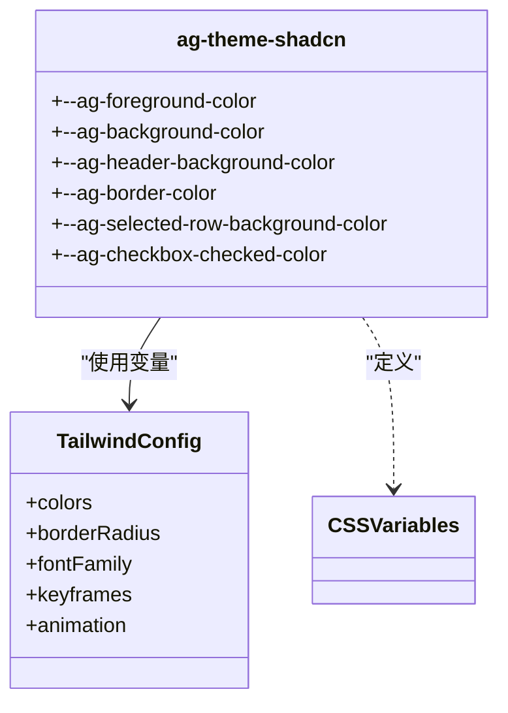

**Diagram sources**
- [ag-theme-shadcn.css](file://vibe_surf/frontend/src/style/ag-theme-shadcn.css)
- [tailwind.config.mjs](file://vibe_surf/frontend/tailwind.config.mjs)

### 颜色系统
设计系统通过index.css文件定义了完整的颜色体系，包括基础颜色、状态颜色和语义颜色。系统使用HSL颜色模型，通过CSS变量实现主题化，支持深色和浅色模式。

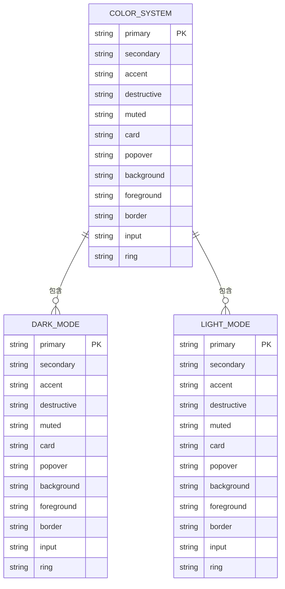

**Diagram sources**
- [index.css](file://vibe_surf/frontend/src/style/index.css)
- [tailwind.config.mjs](file://vibe_surf/frontend/tailwind.config.mjs)

**Section sources**
- [index.css](file://vibe_surf/frontend/src/style/index.css)
- [tailwind.config.mjs](file://vibe_surf/frontend/tailwind.config.mjs)

## UI组件库
VibeSurf的UI组件库基于ShadCN构建，提供了button、card、dialog等核心组件，遵循统一的设计原则和使用规范。

### 按钮组件
按钮组件(button.tsx)使用class-variance-authority(CVA)定义了多种变体和尺寸，支持加载状态和图标显示。组件通过toTitleCase函数自动格式化文本内容，确保视觉一致性。

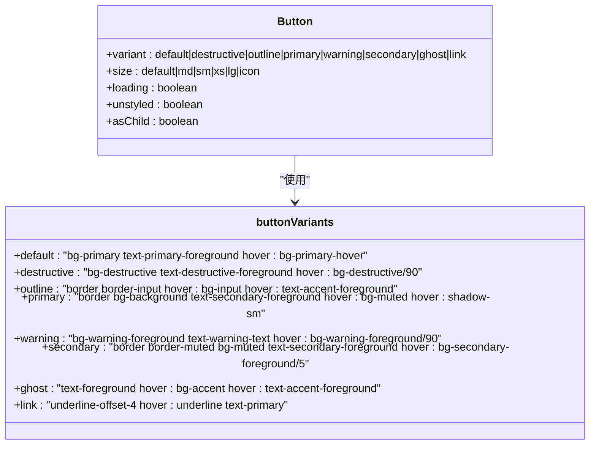

**Diagram sources**
- [button.tsx](file://vibe_surf/frontend/src/components/ui/button.tsx)

### 卡片组件
卡片组件(card.tsx)提供了Card、CardHeader、CardTitle、CardDescription、CardContent和CardFooter等子组件，形成了完整的卡片布局体系。组件支持灵活的内容组织和样式定制。

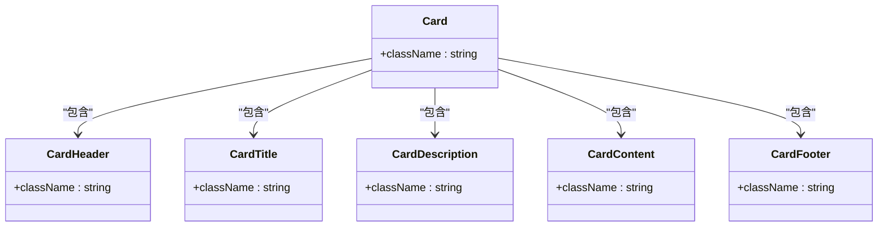

**Diagram sources**
- [card.tsx](file://vibe_surf/frontend/src/components/ui/card.tsx)

### 对话框组件
对话框组件(dialog.tsx)基于Radix UI构建，提供了完整的模态对话框功能。组件包含标题、描述、头部、尾部等结构化元素，并集成了ShadTooltip作为关闭按钮的提示。

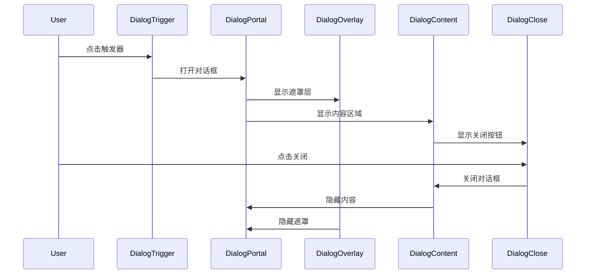

**Diagram sources**
- [dialog.tsx](file://vibe_surf/frontend/src/components/ui/dialog.tsx)

**Section sources**
- [button.tsx](file://vibe_surf/frontend/src/components/ui/button.tsx)
- [card.tsx](file://vibe_surf/frontend/src/components/ui/card.tsx)
- [dialog.tsx](file://vibe_surf/frontend/src/components/ui/dialog.tsx)

## 图标系统
VibeSurf的图标系统通过eagerIconImports.ts和lazyIconImports.ts两个文件实现，提供了图标预加载和按需加载两种机制。

### 预加载图标
eagerIconImports.ts文件导入了所有常用的图标组件，并创建了eagerIconsMapping对象，将图标名称映射到对应的React组件。这种预加载方式确保了常用图标的即时可用性。

```mermaid
classDiagram
class eagerIconImports {
+eagerIconsMapping : Map[string, ReactComponent]
+AIML : AIMLIcon
+AgentQL : AgentQLIcon
+Airbyte : AirbyteIcon
+Anthropic : AnthropicIcon
+Apify : ApifyIcon
+ArXiv : ArXivIcon
+AssemblyAI : AssemblyAIIcon
+AstraDB : AstraDBIcon
+AWS : AWSIcon
+Azure : AzureIcon
+Bing : BingIcon
+BotMessageSquare : BotMessageSquareIcon
+Cassandra : CassandraIcon
+Chroma : ChromaIcon
+Clickhouse : ClickhouseIcon
+Cloudflare : CloudflareIcon
+Cohere : CohereIcon
+Composio : ComposioIcon
+Confluence : ConfluenceIcon
+Couchbase : CouchbaseIcon
+CrewAI : CrewAiIcon
+DeepSeek : DeepSeekIcon
+Docling : DoclingIcon
+Douyin : DouyinIcon
+Dropbox : DropboxIcon
+DuckDuckGo : DuckDuckGoIcon
+ElasticsearchStore : ElasticsearchIcon
+Evernote : EvernoteIcon
+Exa : ExaIcon
+FacebookMessenger : FBIcon
+Firecrawl : FirecrawlIcon
+freezeAll : freezeAllIcon
+GitBook : GitBookIcon
+GitLoader : GitLoaderIcon
+Glean : GleanIcon
+Google : GoogleIcon
+GoogleDrive : GoogleDriveIcon
+GoogleGenerativeAI : GoogleGenerativeAIIcon
+Gmail : GmailIcon
+GradientInfinity : GradientInfinity
+GradientSave : GradientSave
+GradientUngroup : GradientUngroup
+GridHorizontal : GridHorizontalIcon
+Groq : GroqIcon
+HackerNews : HackerNewsIcon
+HCD : HCDIcon
+HomeAssistant : HomeAssistantIcon
+HuggingFace : HuggingFaceIcon
+Icosa : IcosaIcon
+IFixIt : IFixIcon
+javascript : JSIcon
+JigsawStack : JigsawStackIcon
+LangChain : LangChainIcon
+Langwatch : LangwatchIcon
+LMStudio : LMStudioIcon
+Maritalk : MaritalkIcon
+Mem0 : Mem0
+Meta : MetaIcon
+Midjourney : MidjourneyIcon
+Milvus : MilvusIcon
+MongoDB : MongoDBIcon
+Mistral : MistralIcon
+Needle : NeedleIcon
+NotDiamond : NotDiamondIcon
+Notion : NotionIcon
+Novita : NovitaIcon
+NVIDIA : NvidiaIcon
+Olivya : OlivyaIcon
+Ollama : OllamaIcon
+OneDrive : OneDriveIcon
+OpenAI : OpenAiIcon
+OpenRouter : OpenRouterIcon
+OpenSearch : OpenSearch
+Perplexity : PerplexityIcon
+Pinecone : PineconeIcon
+Postgres : PostgresIcon
+Python : PythonIcon
+QDrant : QDrantIcon
+QianFanChat : QianFanChatIcon
+Redis : RedisIcon
+SambaNova : SambaNovaIcon
+ScrapeGraph : ScrapeGraph
+SearchAPI : SearchAPIIcon
+SearchLexical : SearchLexicalIcon
+SearchHybrid : SearchHybridIcon
+SearchVector : SearchVectorIcon
+Searx : SearxIcon
+SerpSearch : SerpSearchIcon
+Serper : SerperIcon
+Share : ShareIcon
+Share2 : Share2Icon
+Slack : SlackIcon
+Spider : SpiderIcon
+Streamlit : Streamlit
+Supabase : SupabaseIcon
+Tavily : TavilyIcon
+TwelveLabs : TwelveLabsIcon
+Unstructured : UnstructuredIcon
+Upstash : UpstashSvgIcon
+Vectara : VectaraIcon
+VertexAI : VertexAIIcon
+Weaviate : WeaviateIcon
+Weibo : WeiboIcon
+Wikipedia : WikipediaIcon
+Windsurf : WindsurfIcon
+Wolfram : WolframIcon
+xAI : XAIIcon
+Xiaohongshu : XiaohongshuIcon
+YouTube : YouTubeIcon
+ZepMemory : ZepMemoryIcon
}
```

**Diagram sources**
- [eagerIconImports.ts](file://vibe_surf/frontend/src/icons/eagerIconImports.ts)

### 按需加载图标
lazyIconImports.ts文件定义了lazyIconsMapping对象，使用动态导入实现图标的按需加载。每个图标映射到一个返回Promise的函数，只有在实际使用时才会加载对应的图标组件。

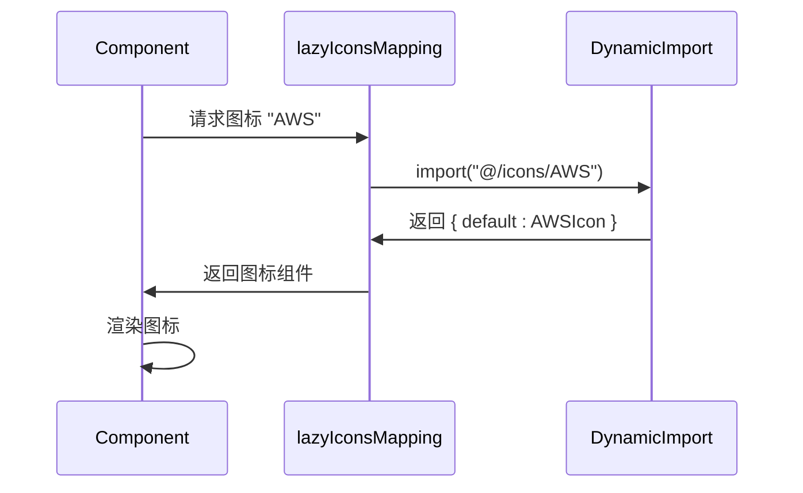

**Diagram sources**
- [lazyIconImports.ts](file://vibe_surf/frontend/src/icons/lazyIconImports.ts)

**Section sources**
- [eagerIconImports.ts](file://vibe_surf/frontend/src/icons/eagerIconImports.ts)
- [lazyIconImports.ts](file://vibe_surf/frontend/src/icons/lazyIconImports.ts)

## 响应式设计与动画
VibeSurf设计系统实现了完整的响应式布局和流畅的动画效果，提升了用户体验。

### 响应式设计
系统通过Tailwind CSS的响应式断点系统实现了多设备适配。在tailwind.config.mjs中定义了xl、2xl、3xl等多个断点，确保界面在不同屏幕尺寸下的良好表现。

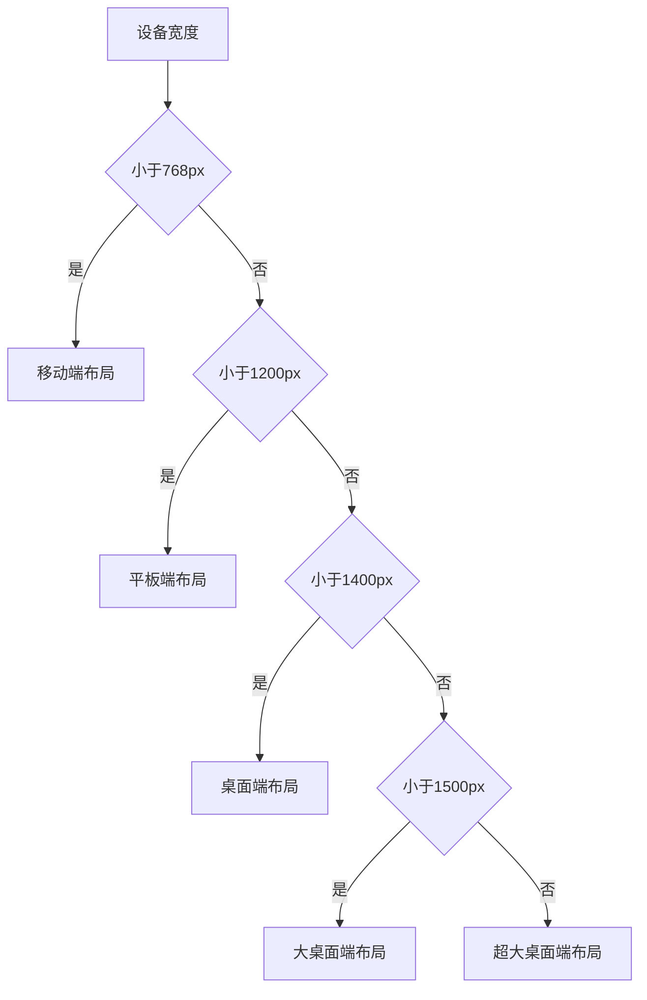

**Diagram sources**
- [tailwind.config.mjs](file://vibe_surf/frontend/tailwind.config.mjs)

### 动画效果
系统实现了多种动画效果，包括textAnimation和text-loop等文本动画。这些动画通过CSS keyframes和animation属性实现，提供了流畅的视觉体验。

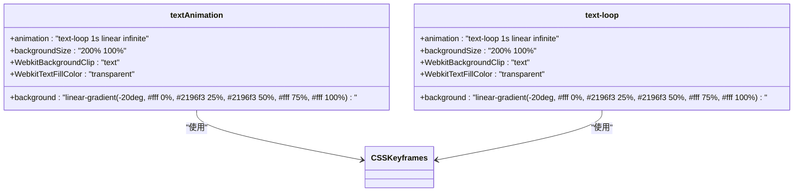

**Diagram sources**
- [textAnimation.tsx](file://vibe_surf/frontend/src/components/ui/textAnimation.tsx)
- [text-loop.tsx](file://vibe_surf/frontend/src/components/ui/text-loop.tsx)

**Section sources**
- [textAnimation.tsx](file://vibe_surf/frontend/src/components/ui/textAnimation.tsx)
- [text-loop.tsx](file://vibe_surf/frontend/src/components/ui/text-loop.tsx)

## 视觉反馈机制
VibeSurf设计系统提供了多种视觉反馈机制，包括加载组件和shadTooltipComponent，增强了用户交互体验。

### 加载组件
loading.tsx组件实现了基于SVG的加载动画，使用圆形路径和动画变换创建了流畅的旋转效果。组件支持自定义大小，并可通过CSS控制动画行为。

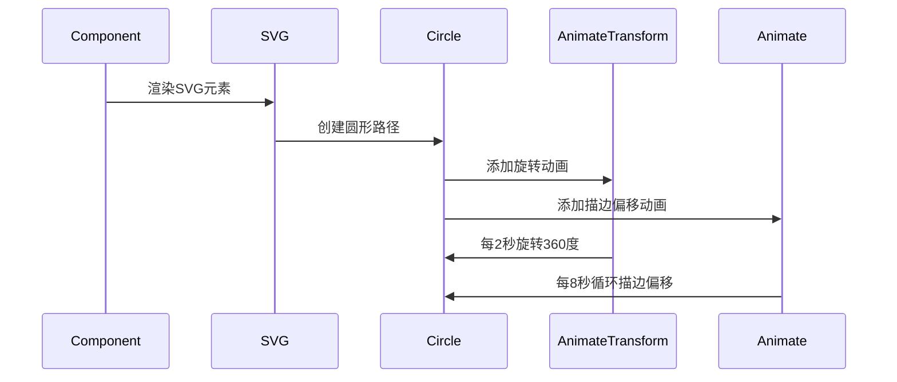

**Diagram sources**
- [loading.tsx](file://vibe_surf/frontend/src/components/ui/loading.tsx)

### 工具提示组件
shadTooltipComponent基于Radix UI的TooltipPrimitive构建，提供了非侵入式的上下文信息展示。组件支持自定义位置、样式和交互行为。

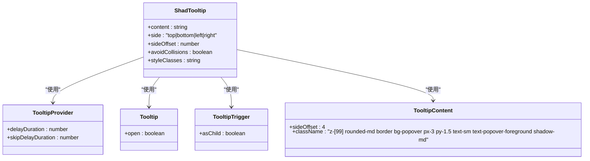

**Diagram sources**
- [tooltip.tsx](file://vibe_surf/frontend/src/components/ui/tooltip.tsx)

**Section sources**
- [loading.tsx](file://vibe_surf/frontend/src/components/ui/loading.tsx)
- [tooltip.tsx](file://vibe_surf/frontend/src/components/ui/tooltip.tsx)

## 设计系统扩展指南
VibeSurf设计系统提供了灵活的扩展机制，允许开发者根据需要定制主题和组件。

### 主题定制
通过修改index.css中的CSS变量，可以轻松定制设计系统的主题颜色。系统支持深色和浅色模式，所有颜色变量都定义在:root和.dark选择器中。

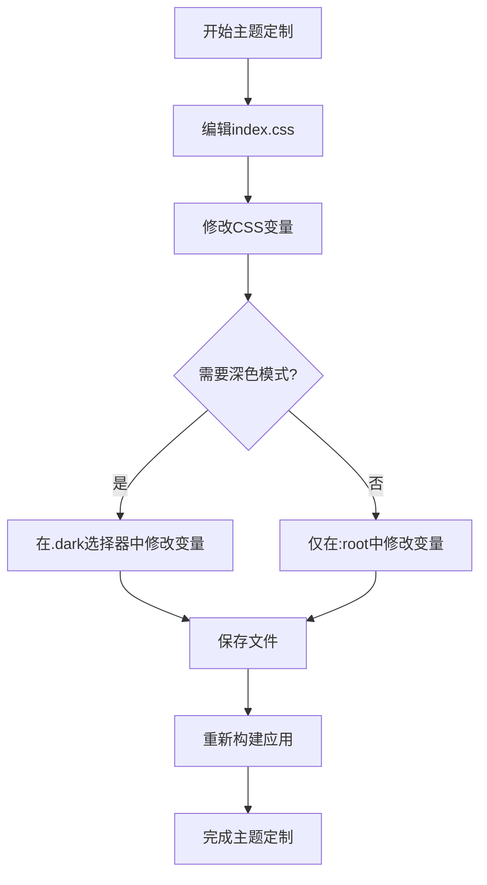

### 组件扩展
开发者可以通过继承现有组件或创建新组件来扩展UI组件库。建议使用与现有组件一致的命名规范和样式约定，确保设计系统的一致性。

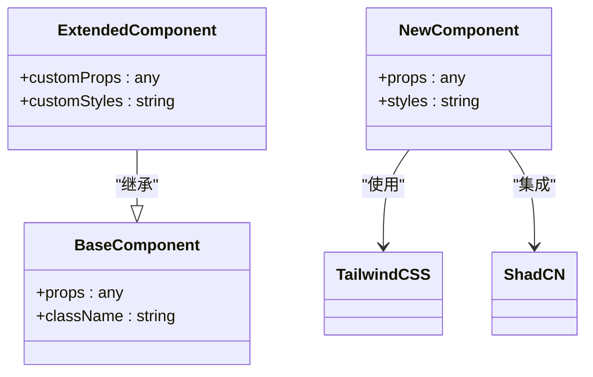

**Section sources**
- [index.css](file://vibe_surf/frontend/src/style/index.css)
- [tailwind.config.mjs](file://vibe_surf/frontend/tailwind.config.mjs)