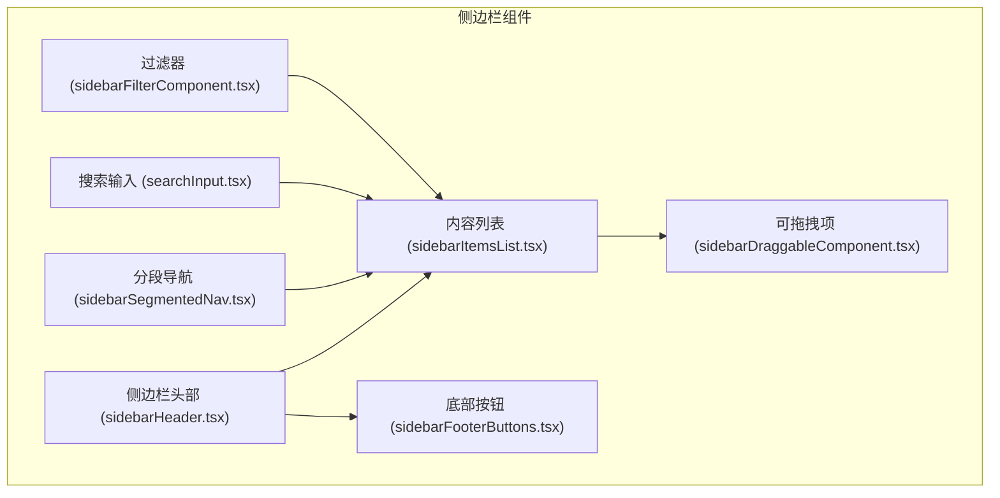
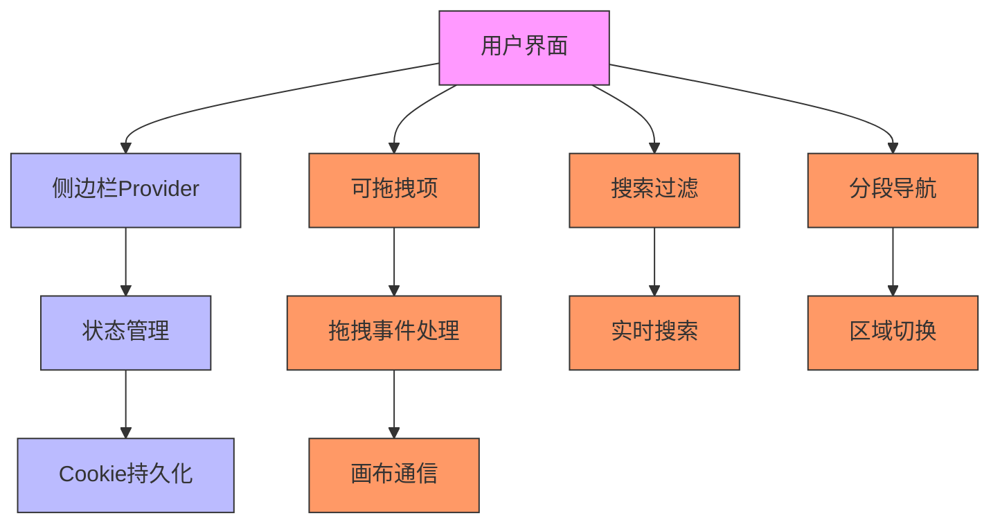
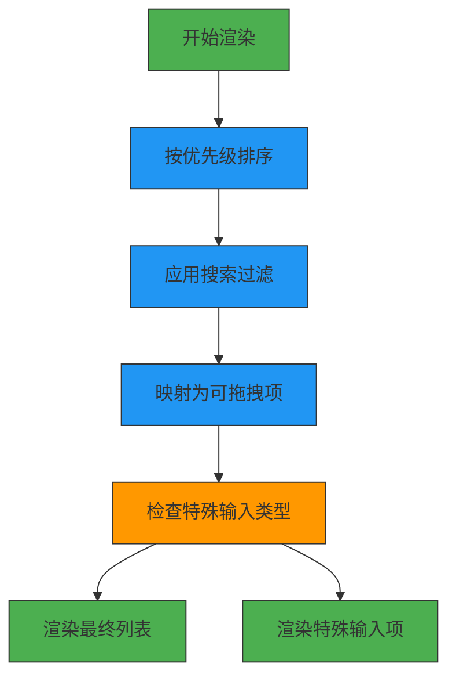
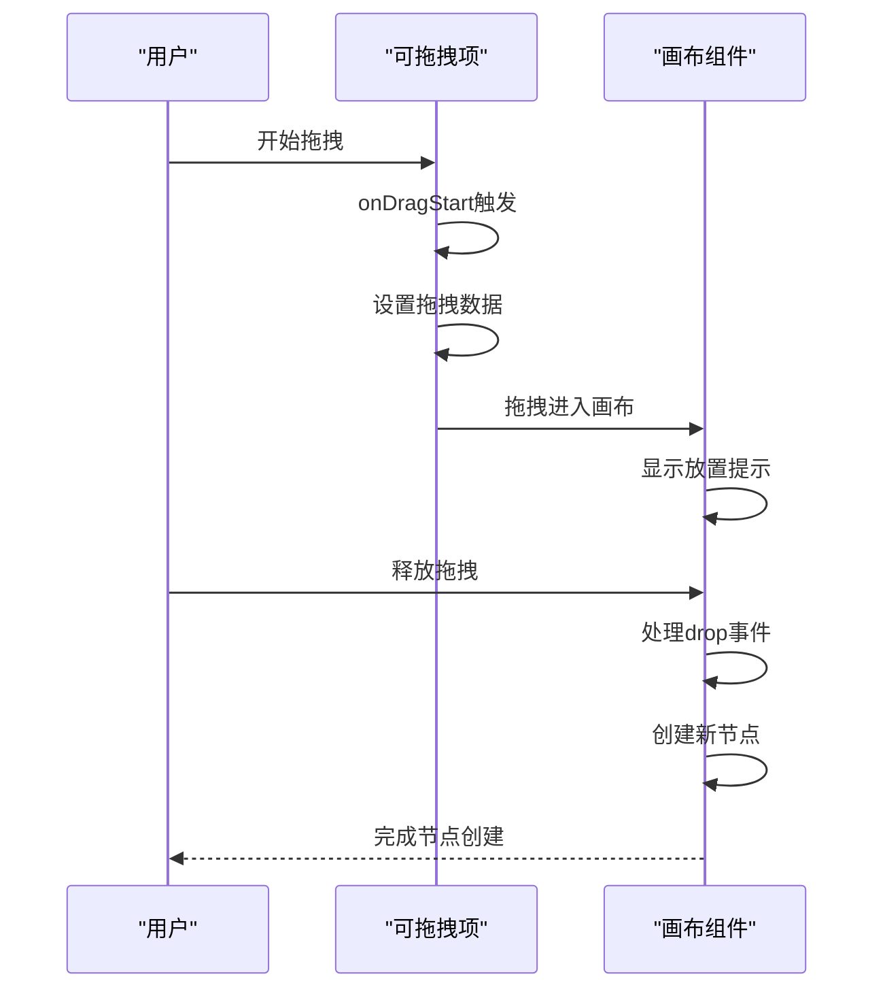
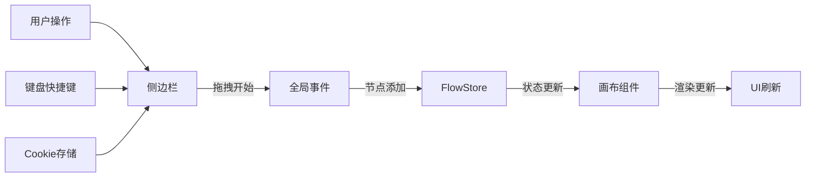
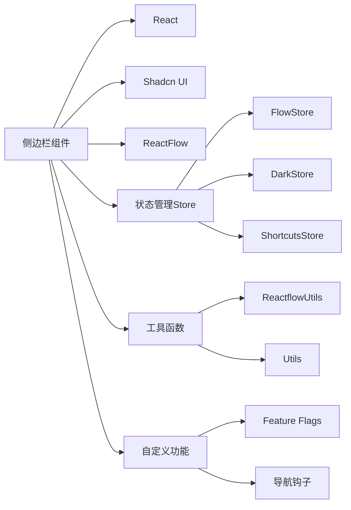

# 侧边栏组件

<cite>
**本文档中引用的文件**  
- [sidebar.tsx](file://vibe_surf/frontend/src/components/ui/sidebar.tsx)
- [sidebarDraggableComponent.tsx](file://vibe_surf/frontend/src/pages/FlowPage/components/flowSidebarComponent/components/sidebarDraggableComponent.tsx)
- [sidebarItemsList.tsx](file://vibe_surf/frontend/src/pages/FlowPage/components/flowSidebarComponent/components/sidebarItemsList.tsx)
- [sidebarHeader.tsx](file://vibe_surf/frontend/src/pages/FlowPage/components/flowSidebarComponent/components/sidebarHeader.tsx)
- [sidebarSegmentedNav.tsx](file://vibe_surf/frontend/src/pages/FlowPage/components/flowSidebarComponent/components/sidebarSegmentedNav.tsx)
- [sidebarFooterButtons.tsx](file://vibe_surf/frontend/src/pages/FlowPage/components/flowSidebarComponent/components/sidebarFooterButtons.tsx)
</cite>

## 目录
1. [简介](#简介)
2. [项目结构](#项目结构)
3. [核心组件](#核心组件)
4. [架构概述](#架构概述)
5. [详细组件分析](#详细组件分析)
6. [依赖分析](#依赖分析)
7. [性能考虑](#性能考虑)
8. [故障排除指南](#故障排除指南)
9. [结论](#结论)

## 简介
侧边栏组件是VibeSurf应用中的核心UI模块，负责提供工作流组件的可视化展示、拖拽创建功能以及与画布组件的通信机制。该组件实现了复杂的交互逻辑，包括动态加载、状态管理、拖拽操作和用户偏好设置持久化。

## 项目结构
侧边栏组件主要位于前端源码的特定目录中，采用模块化设计，各功能组件分离清晰。

**图示来源**
- [sidebarHeader.tsx](file://vibe_surf/frontend/src/pages/FlowPage/components/flowSidebarComponent/components/sidebarHeader.tsx)
- [sidebarSegmentedNav.tsx](file://vibe_surf/frontend/src/pages/FlowPage/components/flowSidebarComponent/components/sidebarSegmentedNav.tsx)
- [sidebarItemsList.tsx](file://vibe_surf/frontend/src/pages/FlowPage/components/flowSidebarComponent/components/sidebarItemsList.tsx)
- [sidebarDraggableComponent.tsx](file://vibe_surf/frontend/src/pages/FlowPage/components/flowSidebarComponent/components/sidebarDraggableComponent.tsx)
- [sidebarFooterButtons.tsx](file://vibe_surf/frontend/src/pages/FlowPage/components/flowSidebarComponent/components/sidebarFooterButtons.tsx)

**本节来源**
- [sidebar.tsx](file://vibe_surf/frontend/src/components/ui/sidebar.tsx)
- [sidebarHeader.tsx](file://vibe_surf/frontend/src/pages/FlowPage/components/flowSidebarComponent/components/sidebarHeader.tsx)
- [sidebarSegmentedNav.tsx](file://vibe_surf/frontend/src/pages/FlowPage/components/flowSidebarComponent/components/sidebarSegmentedNav.tsx)

## 核心组件
侧边栏的核心功能由多个React组件协同实现，包括状态管理、拖拽处理、搜索过滤和UI展示等。

**本节来源**
- [sidebarDraggableComponent.tsx](file://vibe_surf/frontend/src/pages/FlowPage/components/flowSidebarComponent/components/sidebarDraggableComponent.tsx)
- [sidebarItemsList.tsx](file://vibe_surf/frontend/src/pages/FlowPage/components/flowSidebarComponent/components/sidebarItemsList.tsx)

## 架构概述
侧边栏采用分层架构设计，基于React的上下文API进行状态管理，通过自定义Hook实现功能解耦。

**图示来源**
- [sidebar.tsx](file://vibe_surf/frontend/src/components/ui/sidebar.tsx)
- [sidebarSegmentedNav.tsx](file://vibe_surf/frontend/src/pages/FlowPage/components/flowSidebarComponent/components/sidebarSegmentedNav.tsx)
- [sidebarDraggableComponent.tsx](file://vibe_surf/frontend/src/pages/FlowPage/components/flowSidebarComponent/components/sidebarDraggableComponent.tsx)

## 详细组件分析

### FolderTree实现分析
虽然项目中未直接找到名为FolderTree的组件，但侧边栏通过`sidebarItemsList`组件实现了类似的树形结构展示功能。该组件使用React的`useMemo`进行性能优化，对数据进行排序和过滤。

**图示来源**
- [sidebarItemsList.tsx](file://vibe_surf/frontend/src/pages/FlowPage/components/flowSidebarComponent/components/sidebarItemsList.tsx)

**本节来源**
- [sidebarItemsList.tsx](file://vibe_surf/frontend/src/pages/FlowPage/components/flowSidebarComponent/components/sidebarItemsList.tsx)

### DragDropHandler实现分析
`SidebarDraggableComponent`组件实现了工作流组件的拖拽创建功能，包含完整的拖拽源、拖拽目标和数据传输机制。

**图示来源**
- [sidebarDraggableComponent.tsx](file://vibe_surf/frontend/src/pages/FlowPage/components/flowSidebarComponent/components/sidebarDraggableComponent.tsx)

**本节来源**
- [sidebarDraggableComponent.tsx](file://vibe_surf/frontend/src/pages/FlowPage/components/flowSidebarComponent/components/sidebarDraggableComponent.tsx)

### 通信协议分析
侧边栏与画布组件通过事件系统和状态管理store进行通信，实现了状态同步机制。

**图示来源**
- [sidebarDraggableComponent.tsx](file://vibe_surf/frontend/src/pages/FlowPage/components/flowSidebarComponent/components/sidebarDraggableComponent.tsx)
- [sidebar.tsx](file://vibe_surf/frontend/src/components/ui/sidebar.tsx)

**本节来源**
- [sidebarDraggableComponent.tsx](file://vibe_surf/frontend/src/pages/FlowPage/components/flowSidebarComponent/components/sidebarDraggableComponent.tsx)
- [sidebar.tsx](file://vibe_surf/frontend/src/components/ui/sidebar.tsx)

## 依赖分析
侧边栏组件依赖于多个核心模块和第三方库，形成了复杂的依赖关系网络。

**图示来源**
- [sidebar.tsx](file://vibe_surf/frontend/src/components/ui/sidebar.tsx)
- [sidebarDraggableComponent.tsx](file://vibe_surf/frontend/src/pages/FlowPage/components/flowSidebarComponent/components/sidebarDraggableComponent.tsx)
- [sidebarHeader.tsx](file://vibe_surf/frontend/src/pages/FlowPage/components/flowSidebarComponent/components/sidebarHeader.tsx)

**本节来源**
- [sidebar.tsx](file://vibe_surf/frontend/src/components/ui/sidebar.tsx)
- [sidebarDraggableComponent.tsx](file://vibe_surf/frontend/src/pages/FlowPage/components/flowSidebarComponent/components/sidebarDraggableComponent.tsx)
- [sidebarHeader.tsx](file://vibe_surf/frontend/src/pages/FlowPage/components/flowSidebarComponent/components/sidebarHeader.tsx)

## 性能考虑
侧边栏组件在设计时考虑了多项性能优化策略，包括：

1. **记忆化计算**：使用`useMemo`避免重复计算
2. **事件节流**：对频繁触发的事件进行优化
3. **条件渲染**：根据状态决定是否渲染特定组件
4. **虚拟滚动**：对于大型列表的潜在优化方案
5. **懒加载**：按需加载组件资源

这些优化确保了即使在包含大量组件类型的情况下，侧边栏仍能保持流畅的用户体验。

## 故障排除指南
当侧边栏功能出现异常时，可参考以下常见问题及解决方案：

1. **拖拽功能失效**：
   - 检查`draggable`属性是否正确设置
   - 验证`onDragStart`事件处理器是否正常工作
   - 确认画布组件的drop区域是否正确配置

2. **状态不同步**：
   - 检查Cookie存储是否正常工作
   - 验证状态管理store的更新机制
   - 确认组件间的通信通道是否畅通

3. **UI显示异常**：
   - 检查CSS类名是否正确应用
   - 验证响应式设计在不同屏幕尺寸下的表现
   - 确认图标和文本的显示是否正常

4. **搜索功能问题**：
   - 检查搜索输入的绑定是否正确
   - 验证过滤算法的逻辑是否准确
   - 确认搜索结果的更新是否及时

## 结论
侧边栏组件作为VibeSurf应用的核心交互界面，实现了复杂而优雅的用户功能。通过模块化设计、状态管理优化和流畅的交互体验，为用户提供了高效的工作流构建环境。其架构设计充分考虑了可扩展性和维护性，为未来的功能迭代奠定了坚实基础。