# 卡片组件

<cite>
**本文档中引用的文件**  
- [card.tsx](file://vibe_surf/frontend/src/components/ui/card.tsx)
- [use-on-drag-start.tsx](file://vibe_surf/frontend/src/components/core/cardComponent/hooks/use-on-drag-start.tsx)
- [dragCardComponent/index.tsx](file://vibe_surf/frontend/src/components/core/cardComponent/components/dragCardComponent/index.tsx)
- [cardsWrapComponent/index.tsx](file://vibe_surf/frontend/src/components/core/cardsWrapComponent/index.tsx)
- [switch-case-size.ts](file://vibe_surf/frontend/src/modals/baseModal/helpers/switch-case-size.ts)
- [settings-integrations.css](file://vibe_surf/chrome_extension/styles/settings-integrations.css)
- [settings-responsive.css](file://vibe_surf/chrome_extension/styles/settings-responsive.css)
- [custom-file-card.tsx](file://vibe_surf/frontend/src/customization/components/custom-file-card.tsx)
- [file-card.tsx](file://vibe_surf/frontend/src/modals/IOModal/components/chatView/fileComponent/components/file-card.tsx)
</cite>

## 目录
1. [介绍](#介绍)
2. [布局系统](#布局系统)
3. [交互设计](#交互设计)
4. [样式定制与主题支持](#样式定制与主题支持)
5. [高级用法](#高级用法)
6. [性能优化](#性能优化)

## 介绍
卡片组件是VibeSurf前端界面的核心UI元素，用于展示和组织各种类型的内容，如项目、模板、工具包等。该组件系统提供了响应式布局、拖拽排序、样式定制等丰富的功能，支持在不同设备和场景下的灵活使用。

**Section sources**
- [card.tsx](file://vibe_surf/frontend/src/components/ui/card.tsx)
- [settings-integrations.css](file://vibe_surf/chrome_extension/styles/settings-integrations.css)

## 布局系统

### 响应式网格布局
卡片组件采用基于CSS Grid的响应式布局系统，能够根据容器大小自动调整列数和排列方式。核心布局通过`grid-template-columns: repeat(auto-fill, minmax(400px, 1fr))`实现，确保每个卡片最小宽度为400px，同时在空间允许时自动填充可用空间。

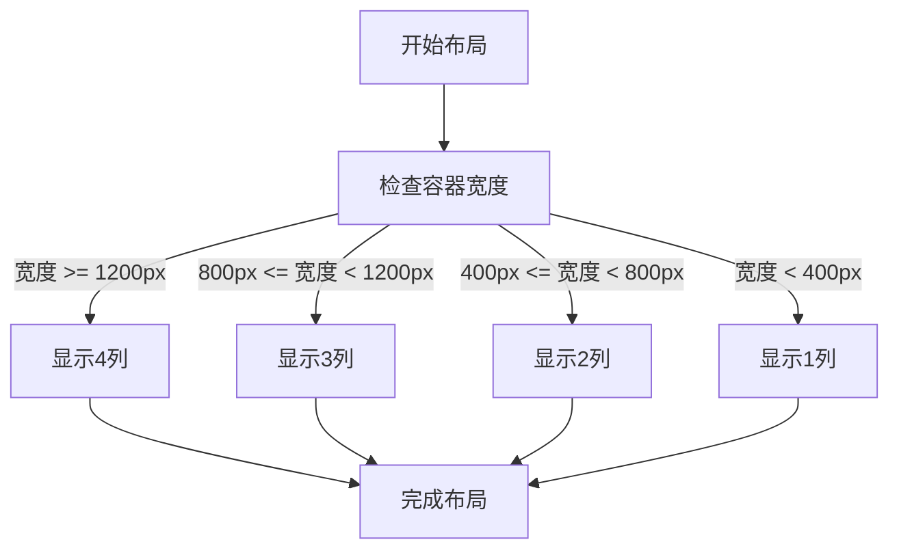

**Diagram sources**
- [settings-integrations.css](file://vibe_surf/chrome_extension/styles/settings-integrations.css#L267)

### 自适应尺寸调整
卡片组件实现了智能的尺寸调整机制，通过断点设置和流式排列确保在不同设备上的最佳显示效果。系统定义了多个预设尺寸模式，包括"large"、"templates"、"three-cards"等，每种模式都有特定的最小宽度和高度约束。

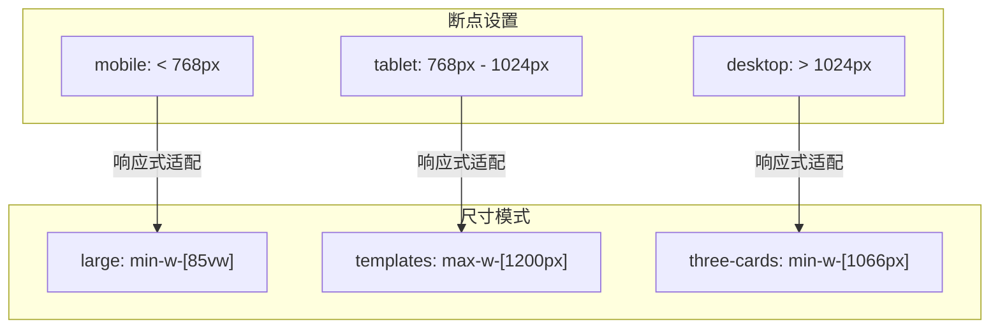

**Diagram sources**
- [switch-case-size.ts](file://vibe_surf/frontend/src/modals/baseModal/helpers/switch-case-size.ts#L53-L64)
- [use-mobile.ts](file://vibe_surf/frontend/src/hooks/use-mobile.ts#L3)

**Section sources**
- [switch-case-size.ts](file://vibe_surf/frontend/src/modals/baseModal/helpers/switch-case-size.ts#L51-L107)
- [settings-integrations.css](file://vibe_surf/chrome_extension/styles/settings-integrations.css#L264-L268)

## 交互设计

### 拖拽排序实现
卡片组件通过HTML5 Drag and Drop API实现了拖拽排序功能。当用户开始拖拽卡片时，系统会创建一个不可见的拖拽图像（ghost element），并在数据传输对象中存储卡片的相关信息。

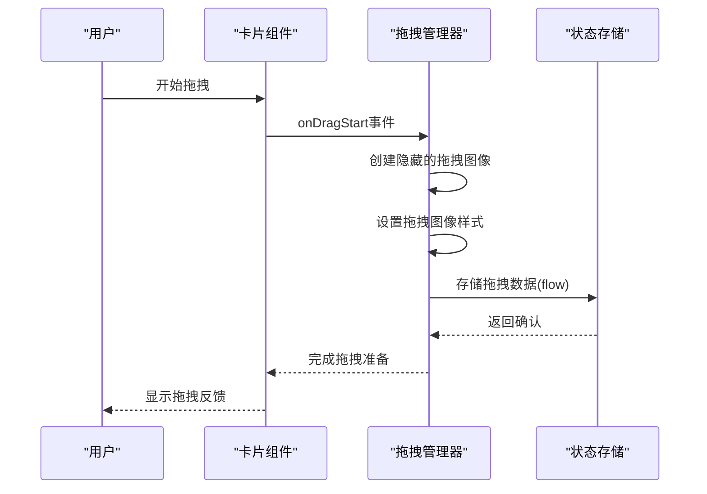

**Diagram sources**
- [use-on-drag-start.tsx](file://vibe_surf/frontend/src/components/core/cardComponent/hooks/use-on-drag-start.tsx#L7-L32)
- [dragCardComponent/index.tsx](file://vibe_surf/frontend/src/components/core/cardComponent/components/dragCardComponent/index.tsx#L6-L38)

### 位置持久化
拖拽操作完成后，系统会将新的卡片位置信息持久化到后端数据库。通过监听drop事件，获取目标容器的ID，并调用`saveFlow`方法更新卡片的文件夹归属和位置信息。

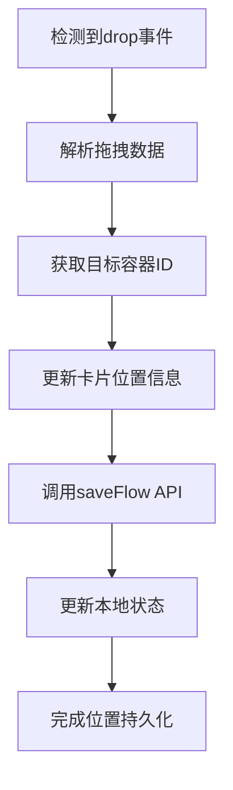

**Diagram sources**
- [use-on-file-drop.ts](file://vibe_surf/frontend/src/components/core/folderSidebarComponent/hooks/use-on-file-drop.ts#L82-L125)

### 拖拽预览与反馈
系统实现了完整的拖拽预览和反馈机制。在拖拽过程中，源卡片会显示半透明效果，目标容器会高亮显示，提供清晰的视觉反馈。同时，系统还处理了浏览器标签切换等特殊情况，确保拖拽状态的正确管理。

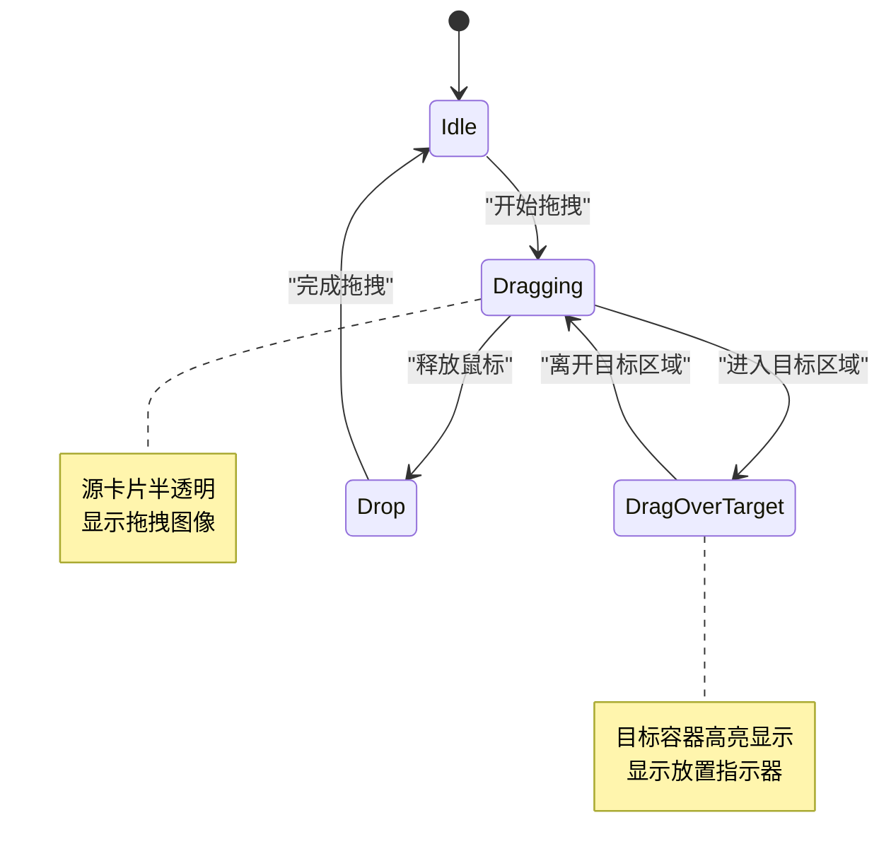

**Diagram sources**
- [cardsWrapComponent/index.tsx](file://vibe_surf/frontend/src/components/core/cardsWrapComponent/index.tsx#L35-L66)
- [dragCardComponent/index.tsx](file://vibe_surf/frontend/src/components/core/cardComponent/components/dragCardComponent/index.tsx#L9-L14)

**Section sources**
- [use-on-drag-start.tsx](file://vibe_surf/frontend/src/components/core/cardComponent/hooks/use-on-drag-start.tsx#L7-L32)
- [dragCardComponent/index.tsx](file://vibe_surf/frontend/src/components/core/cardComponent/components/dragCardComponent/index.tsx#L6-L38)
- [cardsWrapComponent/index.tsx](file://vibe_surf/frontend/src/components/core/cardsWrapComponent/index.tsx#L1-L92)

## 样式定制与主题支持

### 样式定制机制
卡片组件提供了灵活的样式定制机制，通过Tailwind CSS的实用类系统和CSS变量实现。开发者可以通过`className`属性扩展卡片样式，或通过主题配置文件自定义颜色、间距等设计令牌。

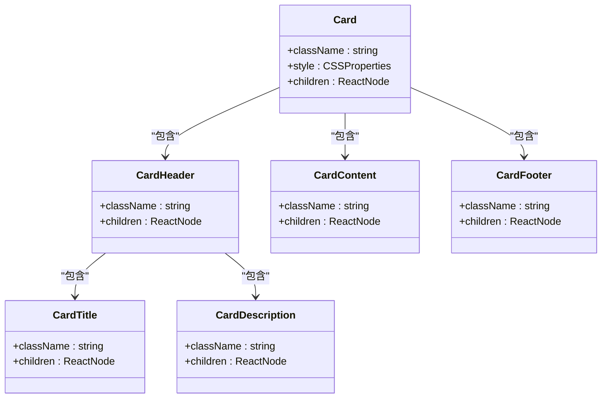

**Diagram sources**
- [card.tsx](file://vibe_surf/frontend/src/components/ui/card.tsx#L4-L85)

### 主题支持
系统支持深色和浅色主题模式，通过CSS变量和`data-theme`属性实现主题切换。卡片组件会根据当前主题自动调整背景色、边框色和文本颜色，确保在不同主题下的可读性和美观性。

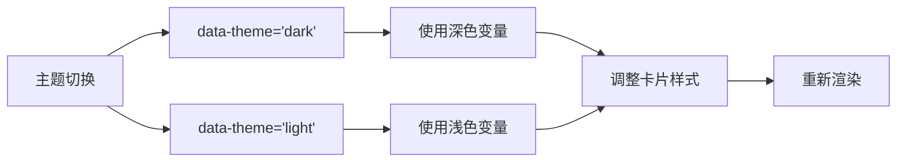

**Diagram sources**
- [settings-integrations.css](file://vibe_surf/chrome_extension/styles/settings-integrations.css#L257-L263)
- [settings-responsive.css](file://vibe_surf/chrome_extension/styles/settings-responsive.css#L172-L175)

### 可访问性支持
卡片组件充分考虑了可访问性需求，支持键盘导航、高对比度模式和减少动画效果。系统通过媒体查询检测用户的辅助功能偏好，并相应调整组件的视觉表现和交互行为。

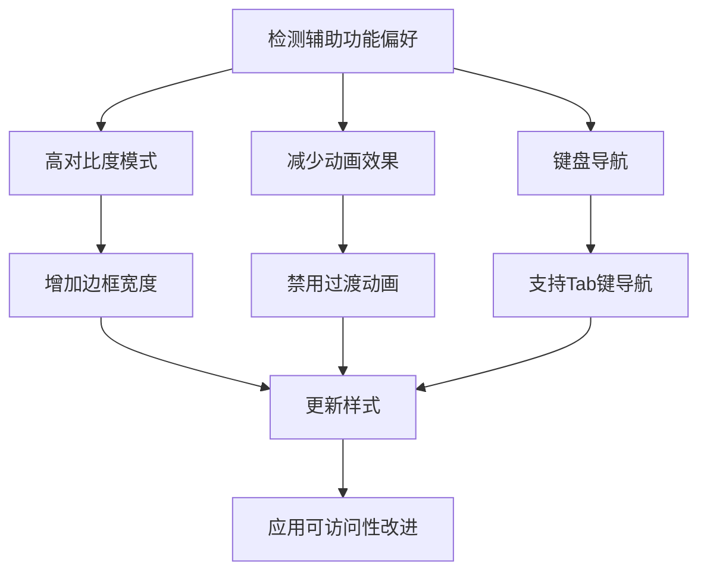

**Diagram sources**
- [settings-integrations.css](file://vibe_surf/chrome_extension/styles/settings-integrations.css#L917-L945)
- [settings-responsive.css](file://vibe_surf/chrome_extension/styles/settings-responsive.css#L149-L169)

**Section sources**
- [card.tsx](file://vibe_surf/frontend/src/components/ui/card.tsx#L1-L85)
- [settings-integrations.css](file://vibe_surf/chrome_extension/styles/settings-integrations.css#L257-L945)
- [settings-responsive.css](file://vibe_surf/chrome_extension/styles/settings-responsive.css#L148-L176)

## 高级用法

### 嵌套布局
卡片组件支持嵌套布局，可以在卡片内容区域包含其他卡片或复杂组件。通过合理的CSS类组合和Flexbox布局，实现多层次的信息组织和展示。

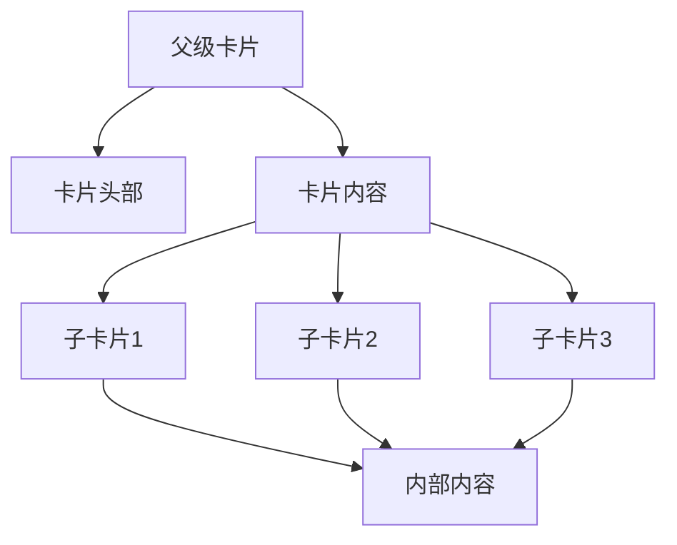

**Diagram sources**
- [storeCardComponent/index.tsx](file://vibe_surf/frontend/src/components/common/storeCardComponent/index.tsx#L105-L129)

### 动态内容加载
系统支持卡片内容的动态加载，通过异步数据获取和条件渲染实现。卡片可以根据数据状态显示加载骨架屏、错误状态或实际内容，提供流畅的用户体验。

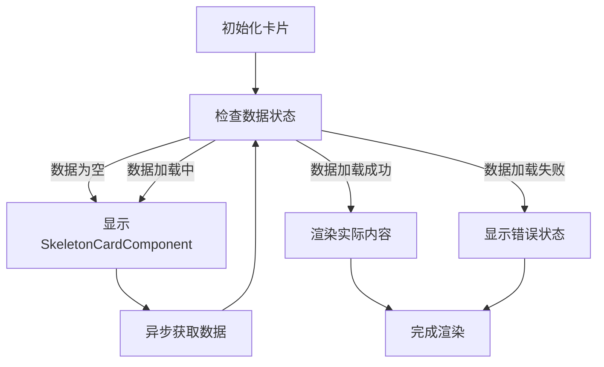

**Diagram sources**
- [skeletonCardComponent/index.tsx](file://vibe_surf/frontend/src/components/common/skeletonCardComponent/index.tsx#L1-L16)

### 文件卡片集成
系统提供了专门的文件卡片组件，用于展示和管理文件。通过`CustomFileCard`包装器，可以将文件信息以卡片形式展示，并支持文件预览、下载等操作。

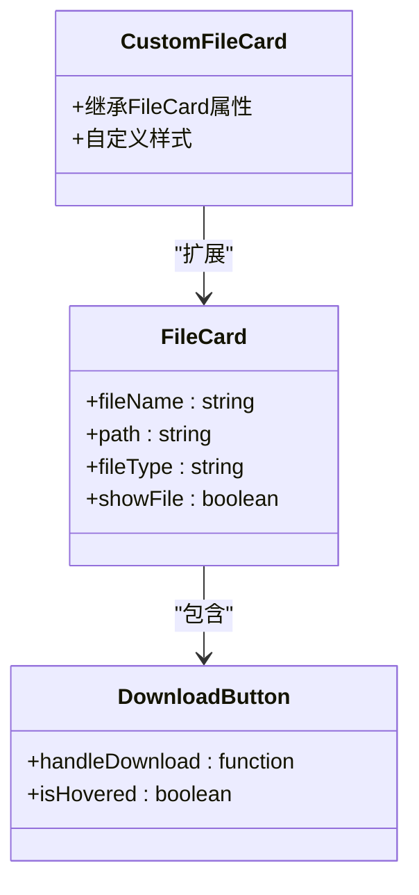

**Diagram sources**
- [custom-file-card.tsx](file://vibe_surf/frontend/src/customization/components/custom-file-card.tsx#L1-L21)
- [file-card.tsx](file://vibe_surf/frontend/src/modals/IOModal/components/chatView/fileComponent/components/file-card.tsx#L1-L81)

**Section sources**
- [skeletonCardComponent/index.tsx](file://vibe_surf/frontend/src/components/common/skeletonCardComponent/index.tsx#L1-L16)
- [storeCardComponent/index.tsx](file://vibe_surf/frontend/src/components/common/storeCardComponent/index.tsx#L105-L129)
- [custom-file-card.tsx](file://vibe_surf/frontend/src/customization/components/custom-file-card.tsx#L1-L21)

## 性能优化

### 虚拟化渲染
对于包含大量卡片的场景，建议使用虚拟化渲染技术，只渲染可视区域内的卡片，显著提升滚动性能和内存使用效率。

### 拖拽性能优化
通过`useCallback`钩子缓存拖拽事件处理器，避免不必要的重新渲染。同时，使用`createRoot`进行拖拽图像的渲染，确保拖拽过程的流畅性。

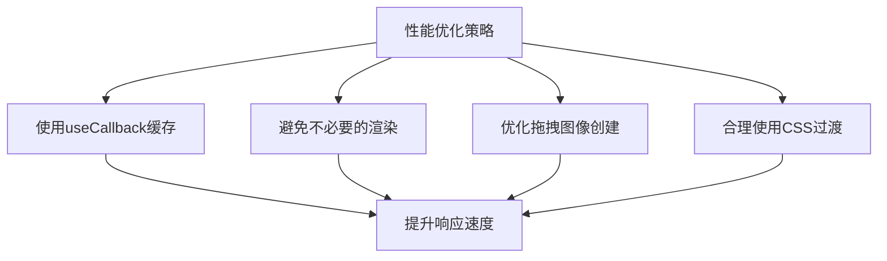

**Diagram sources**
- [use-on-drag-start.tsx](file://vibe_surf/frontend/src/components/core/cardComponent/hooks/use-on-drag-start.tsx#L10-L29)

**Section sources**
- [use-on-drag-start.tsx](file://vibe_surf/frontend/src/components/core/cardComponent/hooks/use-on-drag-start.tsx#L1-L35)
- [cardsWrapComponent/index.tsx](file://vibe_surf/frontend/src/components/core/cardsWrapComponent/index.tsx#L1-L92)