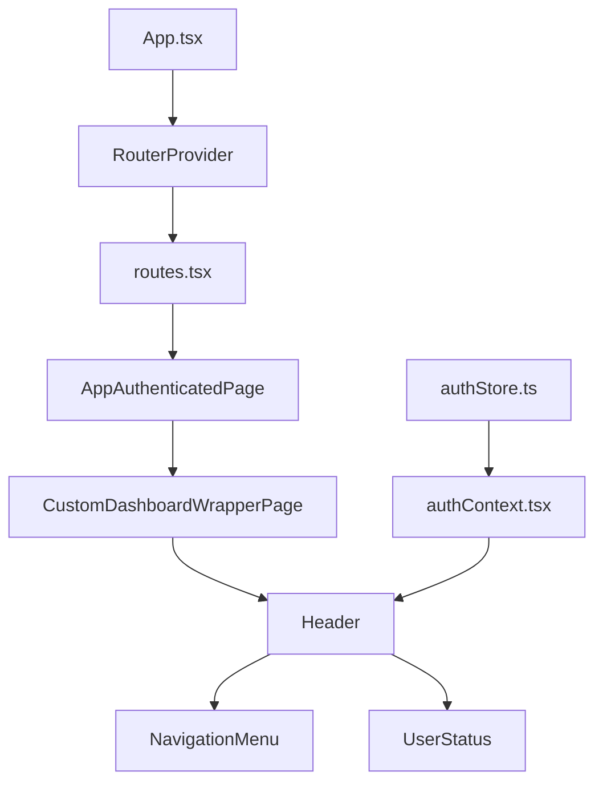
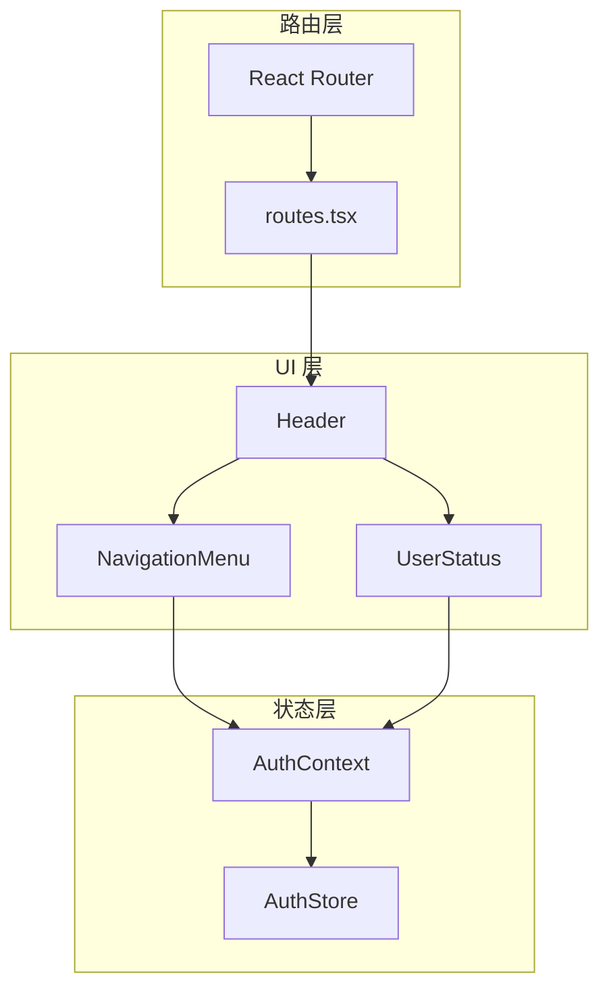
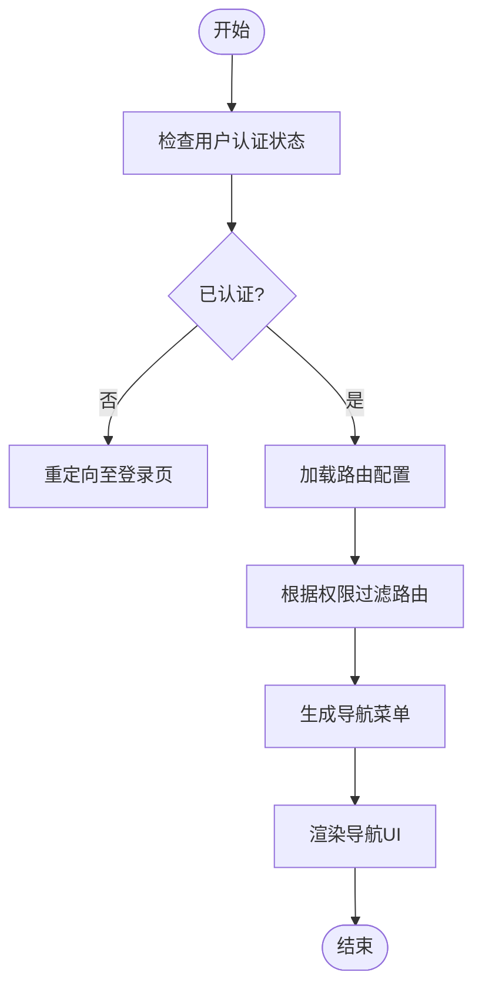
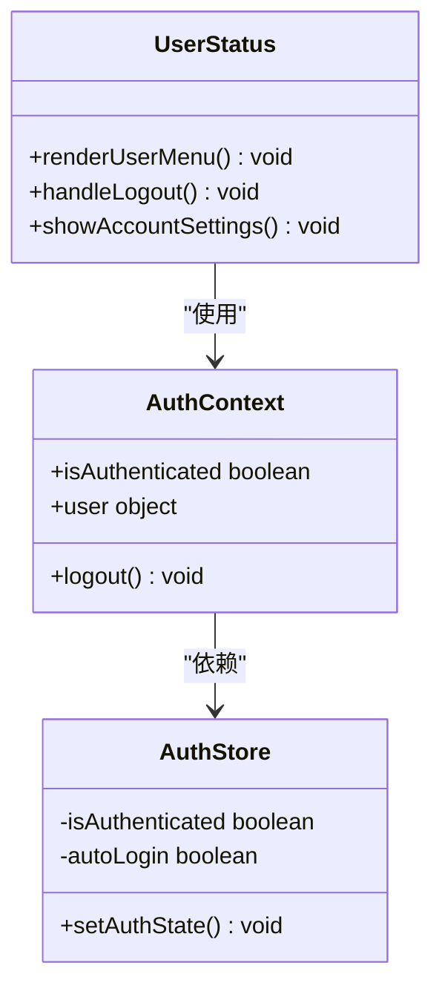
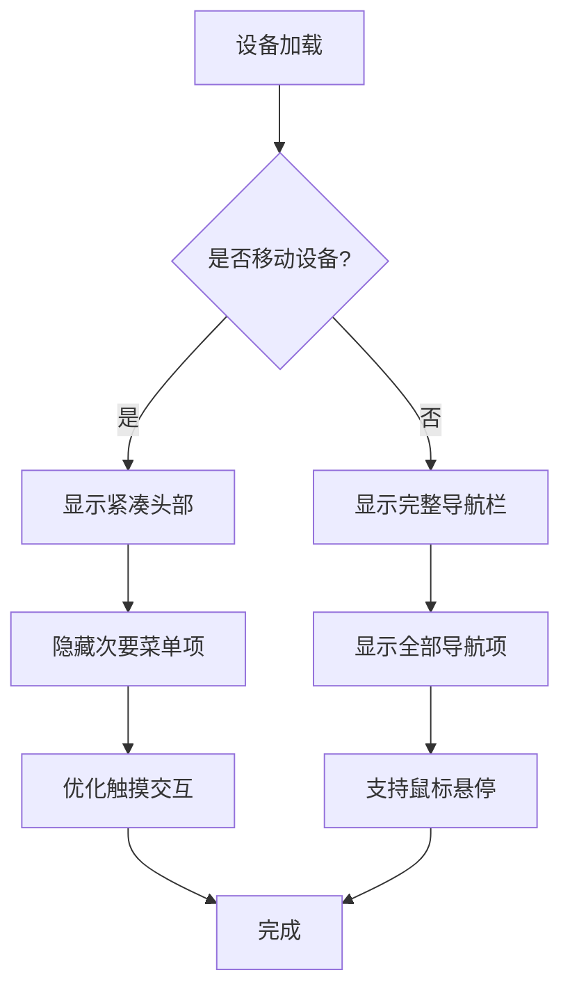
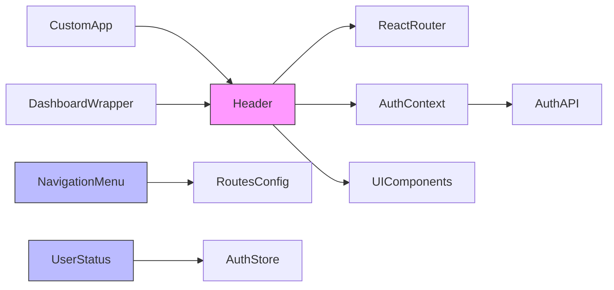

# 头部组件

<cite>
**本文档中引用的文件**  
- [App.tsx](file://vibe_surf/frontend/src/App.tsx)
- [routes.tsx](file://vibe_surf/frontend/src/routes.tsx)
- [authGuard/index.tsx](file://vibe_surf/frontend/src/components/authorization/authGuard/index.tsx)
- [authContext.tsx](file://vibe_surf/frontend/src/contexts/authContext.tsx)
- [authStore.ts](file://vibe_surf/frontend/src/stores/authStore.ts)
- [Header.tsx](file://vibe_surf/frontend/src/components/core/Header.tsx)
- [UserStatus.tsx](file://vibe_surf/frontend/src/components/core/UserStatus.tsx)
- [NavigationMenu.tsx](file://vibe_surf/frontend/src/components/core/NavigationMenu.tsx)
- [custom-App.tsx](file://vibe_surf/frontend/src/customization/components/custom-App.tsx)
- [custom-wrapper.tsx](file://vibe_surf/frontend/src/customization/components/custom-wrapper.tsx)
</cite>

## 目录

1. [介绍](#介绍)  
2. [项目结构](#项目结构)  
3. [核心组件](#核心组件)  
4. [架构概述](#架构概述)  
5. [详细组件分析](#详细组件分析)  
6. [依赖分析](#依赖分析)  
7. [性能考虑](#性能考虑)  
8. [故障排除指南](#故障排除指南)  
9. [结论](#结论)

## 介绍

本文件深入文档化头部组件的设计与实现，重点分析 `NavigationMenu` 如何实现全局导航与路由管理，包括动态菜单生成与权限控制机制。同时探讨 `UserStatus` 组件如何管理用户认证状态、用户资料展示及账户设置入口。此外，文档还说明头部组件的响应式设计与跨设备适配策略，并提供扩展机制，展示如何集成新导航项、自定义用户信息展示以及第三方身份验证服务。

## 项目结构

前端头部组件位于 `vibe_surf/frontend/src/components/core/` 目录下，主要由 `Header.tsx`、`NavigationMenu.tsx` 和 `UserStatus.tsx` 构成。这些组件通过 React 路由系统与认证上下文协同工作，实现动态导航与用户状态管理。

**图示来源**  
- [App.tsx](file://vibe_surf/frontend/src/App.tsx#L1-L23)  
- [routes.tsx](file://vibe_surf/frontend/src/routes.tsx#L1-L211)  
- [Header.tsx](file://vibe_surf/frontend/src/components/core/Header.tsx)  

## 核心组件

头部组件由三大核心部分构成：`Header` 作为容器，`NavigationMenu` 负责导航逻辑，`UserStatus` 管理用户认证状态。这些组件通过 React Context 和 Zustand 状态管理库实现状态共享与响应式更新。

**本节来源**  
- [Header.tsx](file://vibe_surf/frontend/src/components/core/Header.tsx)  
- [NavigationMenu.tsx](file://vibe_surf/frontend/src/components/core/NavigationMenu.tsx)  
- [UserStatus.tsx](file://vibe_surf/frontend/src/components/core/UserStatus.tsx)  

## 架构概述

头部组件采用分层架构，结合 React 路由、认证上下文和状态管理，实现灵活的导航与用户状态控制。

**图示来源**  
- [authContext.tsx](file://vibe_surf/frontend/src/contexts/authContext.tsx)  
- [authStore.ts](file://vibe_surf/frontend/src/stores/authStore.ts)  
- [routes.tsx](file://vibe_surf/frontend/src/routes.tsx)  

## 详细组件分析

### NavigationMenu 分析

`NavigationMenu` 组件负责实现全局导航功能，支持动态菜单生成与基于用户权限的访问控制。它通过读取路由配置和用户角色信息，动态渲染可用的导航项。

**图示来源**  
- [NavigationMenu.tsx](file://vibe_surf/frontend/src/components/core/NavigationMenu.tsx)  
- [routes.tsx](file://vibe_surf/frontend/src/routes.tsx)  
- [authStore.ts](file://vibe_surf/frontend/src/stores/authStore.ts)  

### UserStatus 分析

`UserStatus` 组件管理用户认证状态、显示用户信息并提供账户设置入口。它监听认证状态变化，动态更新UI，并集成自动登录功能。

**图示来源**  
- [UserStatus.tsx](file://vibe_surf/frontend/src/components/core/UserStatus.tsx)  
- [authContext.tsx](file://vibe_surf/frontend/src/contexts/authContext.tsx)  
- [authStore.ts](file://vibe_surf/frontend/src/stores/authStore.ts)  

### 响应式设计分析

头部组件采用响应式设计，适配不同设备尺寸，通过 CSS 媒体查询和移动检测钩子实现布局调整。

**图示来源**  
- [Header.tsx](file://vibe_surf/frontend/src/components/core/Header.tsx)  
- [use-mobile.ts](file://vibe_surf/frontend/src/hooks/use-mobile.ts)  
- [responsive.css](file://vibe_surf/frontend/src/style/responsive.css)  

## 依赖分析

头部组件依赖多个核心模块，包括路由系统、认证服务、状态管理及UI组件库。

**图示来源**  
- [custom-App.tsx](file://vibe_surf/frontend/src/customization/components/custom-App.tsx)  
- [custom-wrapper.tsx](file://vibe_surf/frontend/src/customization/components/custom-wrapper.tsx)  
- [Header.tsx](file://vibe_surf/frontend/src/components/core/Header.tsx)  

## 性能考虑

头部组件在性能方面进行了优化，包括：
- 使用 React 懒加载减少初始包大小
- 实现认证令牌自动刷新机制
- 采用 Zustand 进行高效状态管理
- 通过条件渲染减少不必要的重绘

## 故障排除指南

常见问题及解决方案：
- **导航不响应**：检查路由配置与认证状态
- **用户信息不显示**：验证认证上下文是否正确初始化
- **权限控制失效**：确认角色权限配置与路由守卫逻辑
- **响应式布局异常**：检查 CSS 媒体查询与移动检测钩子

**本节来源**  
- [authGuard/index.tsx](file://vibe_surf/frontend/src/components/authorization/authGuard/index.tsx)  
- [use-mobile.ts](file://vibe_surf/frontend/src/hooks/use-mobile.ts)  

## 结论

头部组件通过模块化设计实现了灵活的导航与用户状态管理。`NavigationMenu` 提供了基于权限的动态路由控制，`UserStatus` 实现了完整的认证状态管理，整体架构支持响应式布局与可扩展性。该设计便于集成新功能，如第三方身份验证服务和自定义用户信息展示。