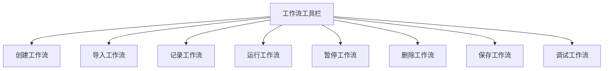
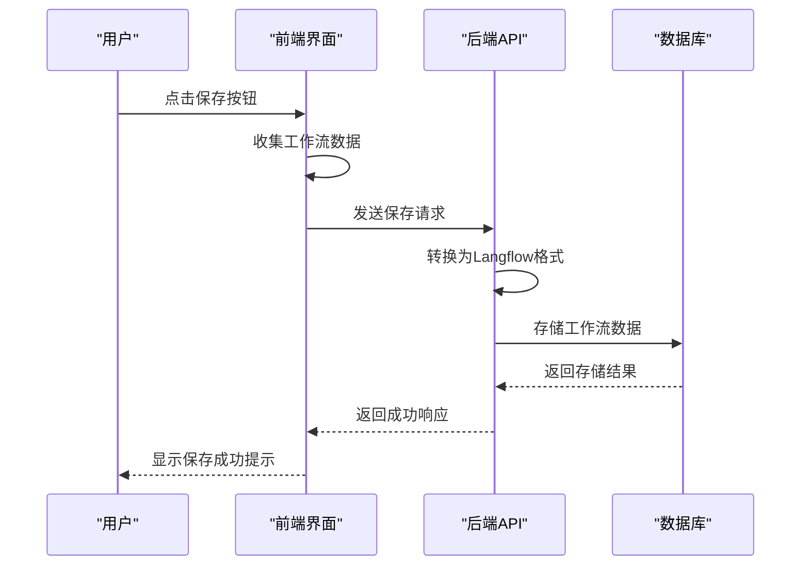
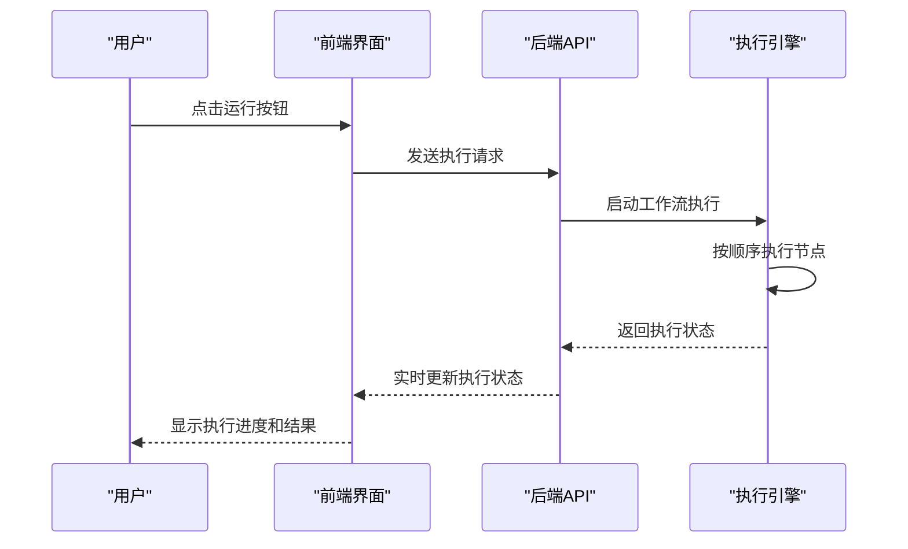
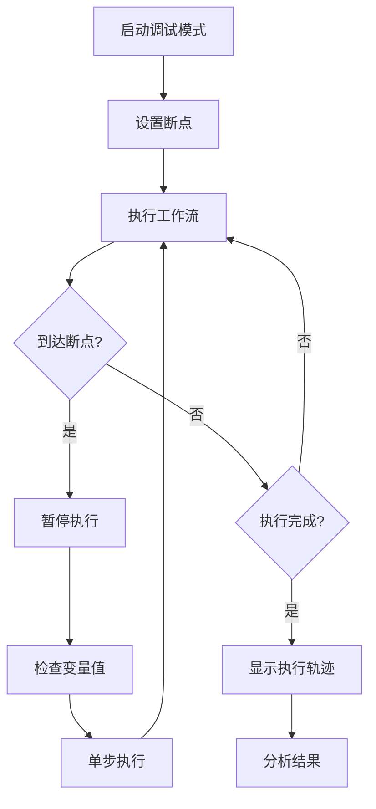
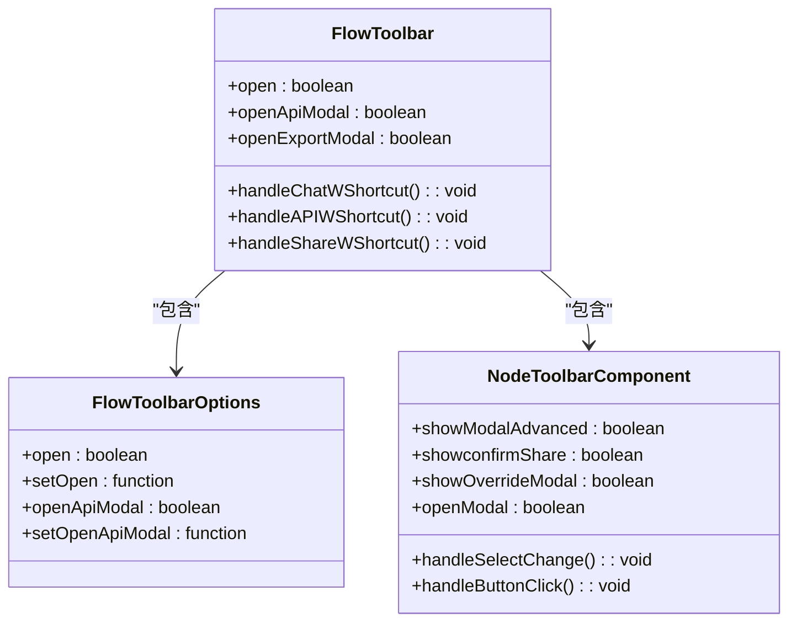
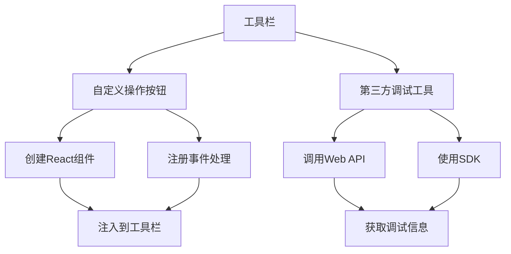

# 工作流工具栏

<cite>
**本文档引用的文件**   
- [settings-workflow.js](file://vibe_surf/chrome_extension/scripts/settings-workflow.js)
- [flow-toolbar-options.tsx](file://vibe_surf/frontend/src/components/core/flowToolbarComponent/components/flow-toolbar-options.tsx)
- [nodeToolbarComponent.tsx](file://vibe_surf/frontend/src/pages/FlowPage/components/nodeToolbarComponent/index.tsx)
- [workflow_converter.py](file://vibe_surf/backend/utils/workflow_converter.py)
- [vibesurf.py](file://vibe_surf/backend/api/vibesurf.py)
- [flowStore.ts](file://vibe_surf/frontend/src/stores/flowStore.ts)
- [flowsManagerStore.ts](file://vibe_surf/frontend/src/stores/flowsManagerStore.ts)
</cite>

## 目录
1. [简介](#简介)
2. [工具栏功能模块](#工具栏功能模块)
3. [保存按钮与持久化存储](#保存按钮与持久化存储)
4. [运行按钮与执行引擎](#运行按钮与执行引擎)
5. [调试按钮与调试模式](#调试按钮与调试模式)
6. [状态管理与响应式设计](#状态管理与响应式设计)
7. [扩展接口与自定义操作](#扩展接口与自定义操作)
8. [结论](#结论)

## 简介
工作流工具栏是VibeSurf平台的核心交互界面，为用户提供了一套完整的功能集合来创建、管理和执行自动化工作流。该工具栏集成了保存、运行、调试等关键功能，通过直观的用户界面和强大的后端支持，实现了工作流的全生命周期管理。本文档将详细分析工具栏的各个功能模块及其技术实现。

**Section sources**
- [settings-workflow.js](file://vibe_surf/chrome_extension/scripts/settings-workflow.js#L1-L3530)
- [flow-toolbar-options.tsx](file://vibe_surf/frontend/src/components/core/flowToolbarComponent/components/flow-toolbar-options.tsx#L1-L39)

## 工具栏功能模块
工作流工具栏包含多个功能模块，每个模块都针对特定的工作流管理需求。主要功能包括工作流的创建、导入、记录、运行、暂停和删除。工具栏通过事件监听机制与后端API进行通信，实现用户操作的即时响应。界面元素如按钮、下拉菜单和对话框都经过精心设计，确保用户能够轻松地完成复杂的工作流操作。

**Diagram sources **
- [settings-workflow.js](file://vibe_surf/chrome_extension/scripts/settings-workflow.js#L1202-L1222)
- [nodeToolbarComponent.tsx](file://vibe_surf/frontend/src/pages/FlowPage/components/nodeToolbarComponent/index.tsx#L544-L580)

**Section sources**
- [settings-workflow.js](file://vibe_surf/chrome_extension/scripts/settings-workflow.js#L529-L572)
- [nodeToolbarComponent.tsx](file://vibe_surf/frontend/src/pages/FlowPage/components/nodeToolbarComponent/index.tsx#L435-L475)

## 保存按钮与持久化存储
SaveButton功能通过前端与后端API的紧密集成，实现了工作流的持久化存储。当用户点击保存按钮时，前端会收集当前工作流的所有配置信息，包括节点布局、连接关系和参数设置，然后通过API请求将这些数据发送到后端。后端接收到数据后，会将其转换为Langflow格式并存储到数据库中，同时生成唯一的workflow_id用于后续的引用和管理。

自动保存机制通过监听用户操作和定时器实现，确保工作流的最新状态能够及时保存。版本控制机制则通过在数据库中维护工作流的历史记录来实现，每次保存都会创建一个新的版本，用户可以随时回滚到之前的版本。

**Diagram sources **
- [vibesurf.py](file://vibe_surf/backend/api/vibesurf.py#L484-L544)
- [workflow_converter.py](file://vibe_surf/backend/utils/workflow_converter.py#L420-L433)

**Section sources**
- [vibesurf.py](file://vibe_surf/backend/api/vibesurf.py#L484-L544)
- [workflow_converter.py](file://vibe_surf/backend/utils/workflow_converter.py#L420-L433)

## 运行按钮与执行引擎
RunButton功能通过触发工作流执行引擎来启动工作流的执行过程。当用户点击运行按钮时，前端会向后端发送一个执行请求，后端接收到请求后会启动一个异步任务来执行工作流。执行引擎会按照工作流的定义顺序执行各个节点，并将执行结果实时反馈给前端。

执行状态反馈通过WebSocket或轮询机制实现，前端会定期向后端查询工作流的执行状态，并在界面上更新显示。用户可以实时看到工作流的执行进度、当前执行的节点以及任何错误信息。如果工作流执行成功，用户将看到最终的输出结果；如果执行失败，系统会提供详细的错误信息帮助用户进行调试。

**Diagram sources **
- [settings-workflow.js](file://vibe_surf/chrome_extension/scripts/settings-workflow.js#L1300-L1319)
- [nodeToolbarComponent.tsx](file://vibe_surf/frontend/src/pages/FlowPage/components/nodeToolbarComponent/index.tsx#L462-L475)

**Section sources**
- [settings-workflow.js](file://vibe_surf/chrome_extension/scripts/settings-workflow.js#L1300-L1319)
- [nodeToolbarComponent.tsx](file://vibe_surf/frontend/src/pages/FlowPage/components/nodeToolbarComponent/index.tsx#L462-L475)

## 调试按钮与调试模式
DebugButton功能实现了工作流的调试模式，允许用户在执行过程中设置断点、监控变量和追踪执行轨迹。当用户启用调试模式时，工作流会在预设的断点处暂停执行，用户可以检查当前的变量值和执行状态。系统还提供了变量监控功能，用户可以选择特定的变量进行实时监控，观察其在执行过程中的变化。

执行轨迹追踪功能记录了工作流执行的每一步操作，包括节点的输入输出、执行时间和任何异常信息。这些信息会被可视化地展示在调试面板中，帮助用户理解工作流的执行流程和识别潜在的问题。调试模式还支持单步执行，用户可以逐个节点地执行工作流，精确控制执行过程。

**Diagram sources **
- [nodeToolbarComponent.tsx](file://vibe_surf/frontend/src/pages/FlowPage/components/nodeToolbarComponent/index.tsx#L435-L475)
- [settings-workflow.js](file://vibe_surf/chrome_extension/scripts/settings-workflow.js#L1323-L1345)

**Section sources**
- [nodeToolbarComponent.tsx](file://vibe_surf/frontend/src/pages/FlowPage/components/nodeToolbarComponent/index.tsx#L435-L475)
- [settings-workflow.js](file://vibe_surf/chrome_extension/scripts/settings-workflow.js#L1323-L1345)

## 状态管理与响应式设计
工具栏的状态管理机制基于React的useState和useContext钩子，结合Zustand状态管理库实现。每个工具栏组件都维护自己的局部状态，同时通过全局状态管理器共享关键信息，如当前工作流ID、执行状态和用户偏好设置。这种分层状态管理架构确保了组件间的高效通信和状态一致性。

响应式设计通过CSS媒体查询和Flexbox布局实现，确保工具栏在不同设备和屏幕尺寸下都能提供良好的用户体验。组件的大小、位置和可见性会根据屏幕尺寸动态调整，关键功能始终保持可访问性。此外，工具栏还实现了动画效果和过渡效果，提升用户交互的流畅性和直观性。

**Diagram sources **
- [flowToolbarComponent.tsx](file://vibe_surf/frontend/src/components/core/flowToolbarComponent/index.tsx#L1-L69)
- [flow-toolbar-options.tsx](file://vibe_surf/frontend/src/components/core/flowToolbarComponent/components/flow-toolbar-options.tsx#L1-L39)

**Section sources**
- [flowToolbarComponent.tsx](file://vibe_surf/frontend/src/components/core/flowToolbarComponent/index.tsx#L1-L69)
- [flowStore.ts](file://vibe_surf/frontend/src/stores/flowStore.ts#L1-L100)
- [flowsManagerStore.ts](file://vibe_surf/frontend/src/stores/flowsManagerStore.ts#L1-L100)

## 扩展接口与自定义操作
工具栏提供了丰富的扩展接口，允许开发者添加自定义操作按钮和集成第三方调试工具。通过插件系统，开发者可以注册新的工具栏按钮，这些按钮可以触发自定义的功能或与外部服务进行交互。API接口设计遵循RESTful原则，支持CRUD操作，便于第三方工具的集成。

自定义操作按钮的实现基于React组件和事件处理机制，开发者可以创建新的组件并将其注入到工具栏中。集成第三方调试工具则通过Web API或SDK实现，工具栏可以调用外部服务的API来获取调试信息或执行特定的调试操作。这种开放的架构设计使得工具栏能够适应不断变化的需求和技术环境。

**Diagram sources **
- [nodeToolbarComponent.tsx](file://vibe_surf/frontend/src/pages/FlowPage/components/nodeToolbarComponent/index.tsx#L544-L580)
- [settings-workflow.js](file://vibe_surf/chrome_extension/scripts/settings-workflow.js#L2831-L2856)

**Section sources**
- [nodeToolbarComponent.tsx](file://vibe_surf/frontend/src/pages/FlowPage/components/nodeToolbarComponent/index.tsx#L544-L580)
- [settings-workflow.js](file://vibe_surf/chrome_extension/scripts/settings-workflow.js#L2831-L2856)

## 结论
工作流工具栏作为VibeSurf平台的核心组件，通过精心设计的功能模块和先进的技术实现，为用户提供了一个强大而直观的工作流管理界面。从保存和运行到调试和扩展，每个功能都经过深思熟虑，确保了用户体验的流畅性和功能性。通过持续的优化和创新，工作流工具栏将继续为用户提供卓越的服务，推动自动化工作流的发展。