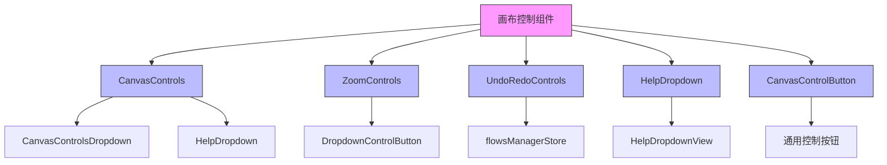
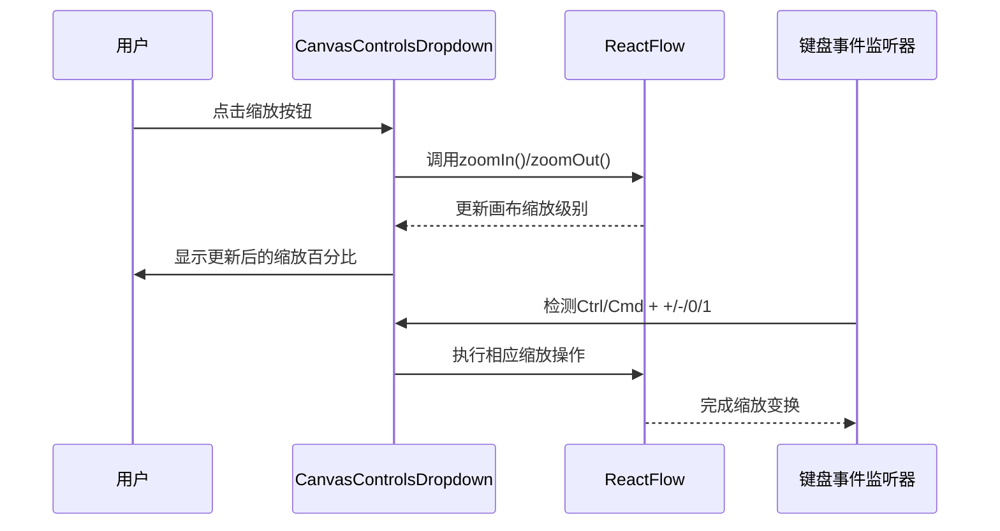
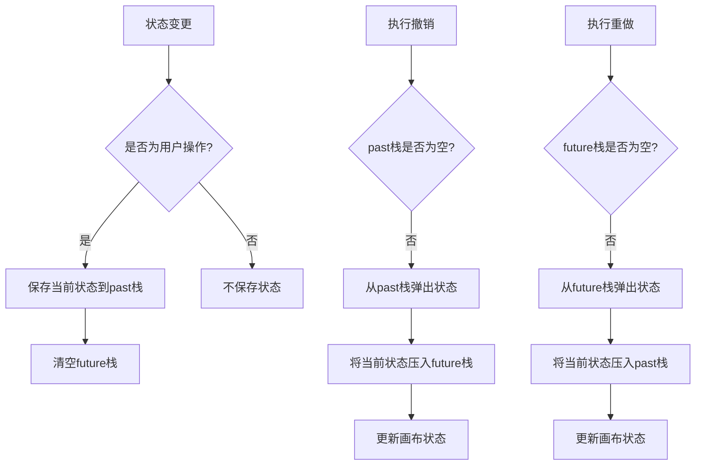
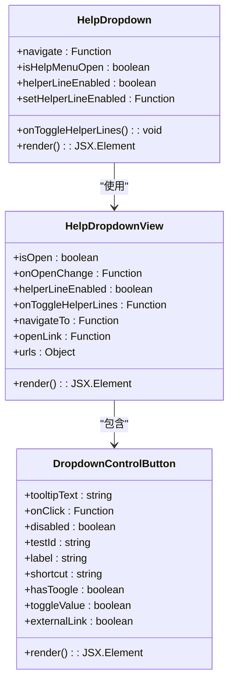
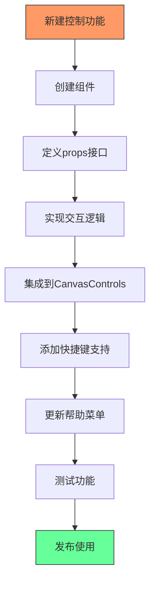

# 画布控制组件

<cite>
**本文档引用的文件**   
- [CanvasControls.tsx](file://vibe_surf/frontend/src/components/core/canvasControlsComponent/CanvasControls.tsx)
- [CanvasControlButton.tsx](file://vibe_surf/frontend/src/components/core/canvasControlsComponent/CanvasControlButton.tsx)
- [CanvasControlsDropdown.tsx](file://vibe_surf/frontend/src/components/core/canvasControlsComponent/CanvasControlsDropdown.tsx)
- [HelpDropdown.tsx](file://vibe_surf/frontend/src/components/core/canvasControlsComponent/HelpDropdown.tsx)
- [HelpDropdownView.tsx](file://vibe_surf/frontend/src/components/core/canvasControlsComponent/HelpDropdownView.tsx)
- [DropdownControlButton.tsx](file://vibe_surf/frontend/src/components/core/canvasControlsComponent/DropdownControlButton.tsx)
- [canvasUtils.ts](file://vibe_surf/frontend/src/components/core/canvasControlsComponent/utils/canvasUtils.ts)
- [flowsManagerStore.ts](file://vibe_surf/frontend/src/stores/flowsManagerStore.ts)
- [flowStore.ts](file://vibe_surf/frontend/src/stores/flowStore.ts)
</cite>

## 目录
1. [项目结构](#项目结构)
2. [核心组件](#核心组件)
3. [缩放与平移功能实现](#缩放与平移功能实现)
4. [撤销重做功能集成](#撤销重做功能集成)
5. [帮助下拉菜单设计](#帮助下拉菜单设计)
6. [画布控制按钮API](#画布控制按钮api)
7. [实际使用示例](#实际使用示例)

## 项目结构

VibeSurf画布控制组件位于前端源码的特定目录中，采用模块化设计，各组件职责分明。

**Diagram sources**
- [CanvasControls.tsx](file://vibe_surf/frontend/src/components/core/canvasControlsComponent/CanvasControls.tsx)
- [CanvasControlsDropdown.tsx](file://vibe_surf/frontend/src/components/core/canvasControlsComponent/CanvasControlsDropdown.tsx)
- [HelpDropdown.tsx](file://vibe_surf/frontend/src/components/core/canvasControlsComponent/HelpDropdown.tsx)

**Section sources**
- [CanvasControls.tsx](file://vibe_surf/frontend/src/components/core/canvasControlsComponent/CanvasControls.tsx)
- [CanvasControlsDropdown.tsx](file://vibe_surf/frontend/src/components/core/canvasControlsComponent/CanvasControlsDropdown.tsx)

## 核心组件

画布控制组件由多个核心模块组成，包括主控面板、缩放控制、帮助菜单和通用按钮组件。这些组件通过React Flow库与画布进行交互，实现了完整的画布操作功能。

**Section sources**
- [CanvasControls.tsx](file://vibe_surf/frontend/src/components/core/canvasControlsComponent/CanvasControls.tsx)
- [CanvasControlButton.tsx](file://vibe_surf/frontend/src/components/core/canvasControlsComponent/CanvasControlButton.tsx)

## 缩放与平移功能实现

ZoomControls功能通过CanvasControlsDropdown组件实现，支持鼠标滚轮、手势和按钮控制等多种交互方式。组件利用React Flow的useReactFlow钩子访问画布状态和操作方法。

**Diagram sources**
- [CanvasControlsDropdown.tsx](file://vibe_surf/frontend/src/components/core/canvasControlsComponent/CanvasControlsDropdown.tsx)
- [canvasUtils.ts](file://vibe_surf/frontend/src/components/core/canvasControlsComponent/utils/canvasUtils.ts)

**Section sources**
- [CanvasControlsDropdown.tsx](file://vibe_surf/frontend/src/components/core/canvasControlsComponent/CanvasControlsDropdown.tsx)
- [canvasUtils.ts](file://vibe_surf/frontend/src/components/core/canvasControlsComponent/utils/canvasUtils.ts)

## 撤销重做功能集成

UndoRedoControls与ReactFlow状态管理深度集成，通过zustand状态管理库实现工作流编辑的撤销和重做功能。系统维护了过去和未来的状态栈，确保操作的可逆性。

**Diagram sources**
- [flowsManagerStore.ts](file://vibe_surf/frontend/src/stores/flowsManagerStore.ts)
- [flowStore.ts](file://vibe_surf/frontend/src/stores/flowStore.ts)

**Section sources**
- [flowsManagerStore.ts](file://vibe_surf/frontend/src/stores/flowsManagerStore.ts)
- [flowStore.ts](file://vibe_surf/frontend/src/stores/flowStore.ts)

## 帮助下拉菜单设计

HelpDropdown组件提供了全面的帮助系统，包括文档链接、快捷键展示、错误报告和智能辅助线切换功能。提示系统通过条件渲染和状态管理实现动态交互。

**Diagram sources**
- [HelpDropdown.tsx](file://vibe_surf/frontend/src/components/core/canvasControlsComponent/HelpDropdown.tsx)
- [HelpDropdownView.tsx](file://vibe_surf/frontend/src/components/core/canvasControlsComponent/HelpDropdownView.tsx)
- [DropdownControlButton.tsx](file://vibe_surf/frontend/src/components/core/canvasControlsComponent/DropdownControlButton.tsx)

**Section sources**
- [HelpDropdown.tsx](file://vibe_surf/frontend/src/components/core/canvasControlsComponent/HelpDropdown.tsx)
- [HelpDropdownView.tsx](file://vibe_surf/frontend/src/components/core/canvasControlsComponent/HelpDropdownView.tsx)

## 画布控制按钮API

CanvasControlButton组件提供了标准化的API接口，支持事件处理和样式定制，是构建画布控制功能的基础组件。

### API接口

| 属性 | 类型 | 描述 | 默认值 |
|------|------|------|--------|
| iconName | string | 图标名称 | 无 |
| tooltipText | string | 工具提示文本 | 无 |
| onClick | () => void | 点击事件处理函数 | 无 |
| disabled | boolean | 是否禁用 | false |
| backgroundClasses | string | 背景样式类 | 无 |
| iconClasses | string | 图标样式类 | 无 |
| testId | string | 测试标识符 | 无 |

### 事件处理

组件通过onClick属性处理用户交互，内部使用ControlButton包装，确保与React Flow的兼容性。事件处理遵循React的合成事件系统。

### 样式定制

通过backgroundClasses和iconClasses属性，开发者可以灵活定制按钮外观，支持Tailwind CSS类名组合，实现与应用主题的一致性。

**Section sources**
- [CanvasControlButton.tsx](file://vibe_surf/frontend/src/components/core/canvasControlsComponent/CanvasControlButton.tsx)
- [DropdownControlButton.tsx](file://vibe_surf/frontend/src/components/core/canvasControlsComponent/DropdownControlButton.tsx)

## 实际使用示例

以下示例展示如何扩展新的画布控制功能，并与其他核心组件集成：

扩展新功能时，应遵循现有组件的设计模式，确保API一致性。通过复用CanvasControlButton基础组件，可以快速构建符合应用风格的新控制功能。

**Section sources**
- [CanvasControls.tsx](file://vibe_surf/frontend/src/components/core/canvasControlsComponent/CanvasControls.tsx)
- [CanvasControlButton.tsx](file://vibe_surf/frontend/src/components/core/canvasControlsComponent/CanvasControlButton.tsx)
- [CanvasControlsDropdown.tsx](file://vibe_surf/frontend/src/components/core/canvasControlsComponent/CanvasControlsDropdown.tsx)