# API测试模态框

<cite>
**本文档引用的文件**   
- [index.tsx](file://vibe_surf/frontend/src/modals/apiModal/index.tsx)
- [code-tabs.tsx](file://vibe_surf/frontend/src/modals/apiModal/codeTabs/code-tabs.tsx)
- [get-python-api-code.tsx](file://vibe_surf/frontend/src/modals/apiModal/utils/get-python-api-code.tsx)
- [get-js-api-code.tsx](file://vibe_surf/frontend/src/modals/apiModal/utils/get-js-api-code.tsx)
- [get-curl-code.tsx](file://vibe_surf/frontend/src/modals/apiModal/utils/get-curl-code.tsx)
- [detect-file-tweaks.ts](file://vibe_surf/frontend/src/modals/apiModal/utils/detect-file-tweaks.ts)
- [filter-tweaks.ts](file://vibe_surf/frontend/src/modals/apiModal/utils/filter-tweaks.ts)
- [task.py](file://vibe_surf/backend/api/task.py)
- [models.py](file://vibe_surf/backend/api/models.py)
</cite>

## 目录
1. [简介](#简介)
2. [核心组件分析](#核心组件分析)
3. [代码生成逻辑](#代码生成逻辑)
4. [后端API集成](#后端api集成)
5. [代码标签页实现](#代码标签页实现)
6. [使用示例](#使用示例)
7. [错误处理与响应可视化](#错误处理与响应可视化)

## 简介

API测试模态框是VibeSurf平台中的一个关键功能组件，它为用户提供了一个直观的界面来测试和调用API端点。该模态框支持生成Python、JavaScript和cURL代码片段，使用户能够轻松地将API集成到他们的应用程序中。通过这个模态框，用户可以配置API请求参数，选择HTTP方法，并查看响应结果。

**API测试模态框**的主要功能包括：
- 生成多种编程语言的API调用代码
- 支持不同的HTTP方法和请求参数
- 提供语法高亮的代码标签页
- 处理文件上传和多步骤API调用
- 集成后端API进行实际测试

这个模态框的设计旨在简化API测试过程，使开发者能够快速验证API的功能和性能。

## 核心组件分析

API测试模态框由多个核心组件构成，这些组件协同工作以提供完整的API测试功能。主要组件包括模态框本身、代码标签页、输入模式和后端集成。

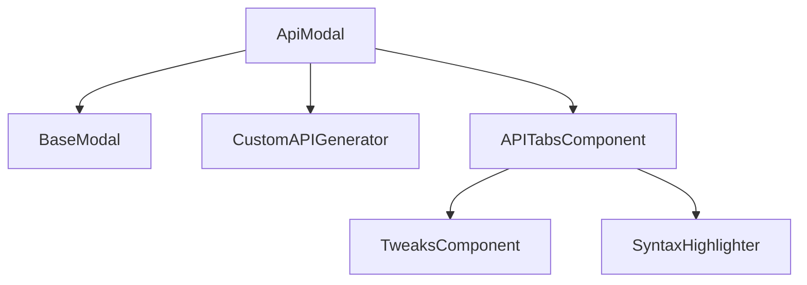

**模态框结构**
- `ApiModal`：主组件，负责管理模态框的状态和布局
- `BaseModal`：基础模态框组件，提供通用的模态框功能
- `CustomAPIGenerator`：自定义API生成器，用于生成API端点
- `APITabsComponent`：代码标签页组件，显示不同语言的代码片段

**输入模式管理**
- `TweaksComponent`：允许用户配置API请求的输入参数
- `useTweaksStore`：Zustand状态管理，存储和管理输入模式

**代码高亮**
- `SyntaxHighlighter`：使用Prism库实现代码语法高亮
- `oneDark` 和 `oneLight`：两种主题样式，适应不同的用户偏好

**Section sources**
- [index.tsx](file://vibe_surf/frontend/src/modals/apiModal/index.tsx#L1-L215)
- [code-tabs.tsx](file://vibe_surf/frontend/src/modals/apiModal/codeTabs/code-tabs.tsx#L1-L313)

## 代码生成逻辑

API测试模态框的代码生成逻辑是其核心功能之一。它能够根据用户的配置生成Python、JavaScript和cURL代码片段。这些代码片段可以直接用于调用API端点。

### Python代码生成

Python代码生成器使用`requests`库来构建API调用。它支持文件上传和多步骤API调用。生成的代码包括错误处理和响应解析。


**Python代码生成特点**：
- 使用`requests`库进行HTTP请求
- 支持文件上传（v1和v2 API）
- 包含错误处理和异常捕获
- 自动生成会话ID

### JavaScript代码生成

JavaScript代码生成器使用`fetch` API或`http`模块来构建API调用。它支持异步操作和多步骤调用。

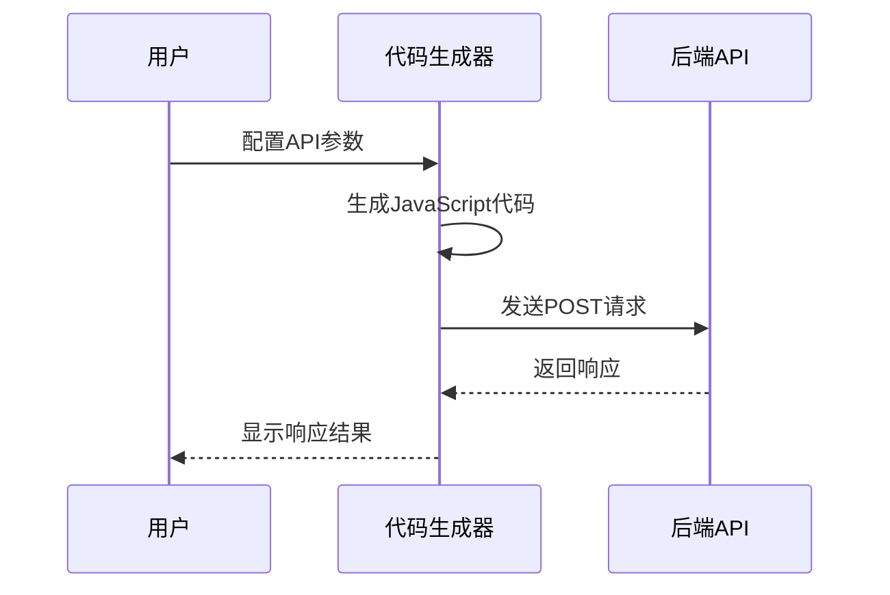

**JavaScript代码生成特点**：
- 使用`fetch` API或`http`模块
- 支持异步操作
- 包含错误处理和异常捕获
- 自动生成会话ID

### cURL代码生成

cURL代码生成器支持Unix和Windows平台。它能够生成多步骤的cURL命令，用于文件上传和API调用。

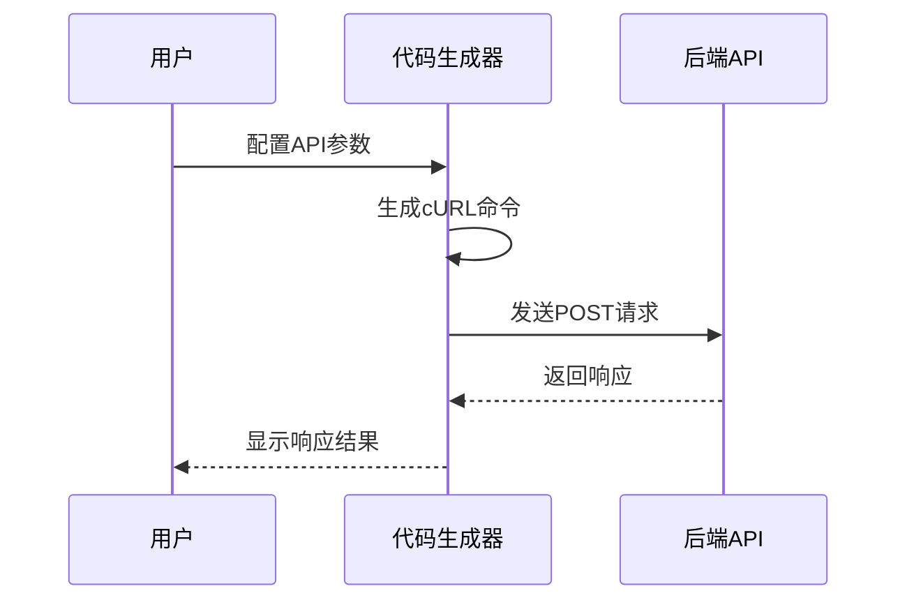

**cURL代码生成特点**：
- 支持Unix和Windows平台
- 生成多步骤命令
- 包含文件上传命令
- 支持认证头

**Diagram sources**
- [get-python-api-code.tsx](file://vibe_surf/frontend/src/modals/apiModal/utils/get-python-api-code.tsx#L1-L189)
- [get-js-api-code.tsx](file://vibe_surf/frontend/src/modals/apiModal/utils/get-js-api-code.tsx#L1-L308)
- [get-curl-code.tsx](file://vibe_surf/frontend/src/modals/apiModal/utils/get-curl-code.tsx#L1-L267)

**Section sources**
- [get-python-api-code.tsx](file://vibe_surf/frontend/src/modals/apiModal/utils/get-python-api-code.tsx#L1-L189)
- [get-js-api-code.tsx](file://vibe_surf/frontend/src/modals/apiModal/utils/get-js-api-code.tsx#L1-L308)
- [get-curl-code.tsx](file://vibe_surf/frontend/src/modals/apiModal/utils/get-curl-code.tsx#L1-L267)

## 后端API集成

API测试模态框与后端API紧密集成，通过RESTful API进行通信。后端API提供了多个端点，用于处理任务提交、状态查询和控制操作。

### 任务提交API

任务提交API用于提交新的任务进行执行。它接受任务描述、会话ID和LLM配置等参数。

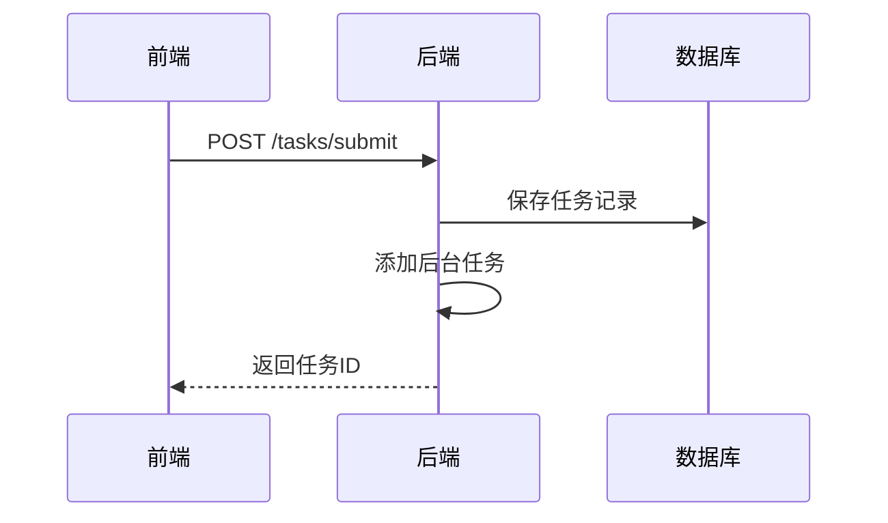

**任务提交API特点**：
- 接受`TaskCreateRequest`对象
- 生成唯一的任务ID
- 保存任务到数据库
- 添加后台任务进行执行

### 任务状态API

任务状态API用于查询当前任务的执行状态。它返回任务的详细信息，包括状态、开始时间等。

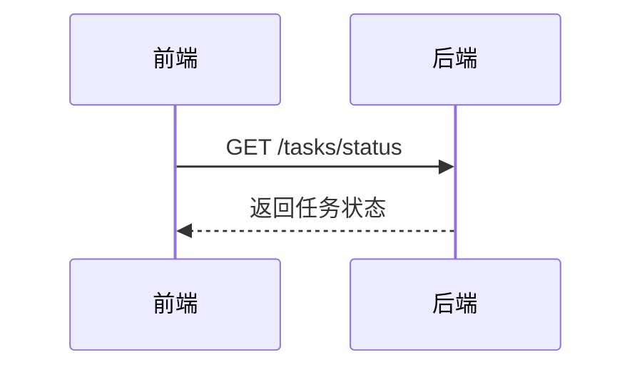

**任务状态API特点**：
- 返回当前任务的执行状态
- 包括任务ID、状态、会话ID等信息
- 支持详细状态查询

### 控制操作API

控制操作API提供了一系列操作，用于控制任务的执行，包括暂停、恢复和停止。

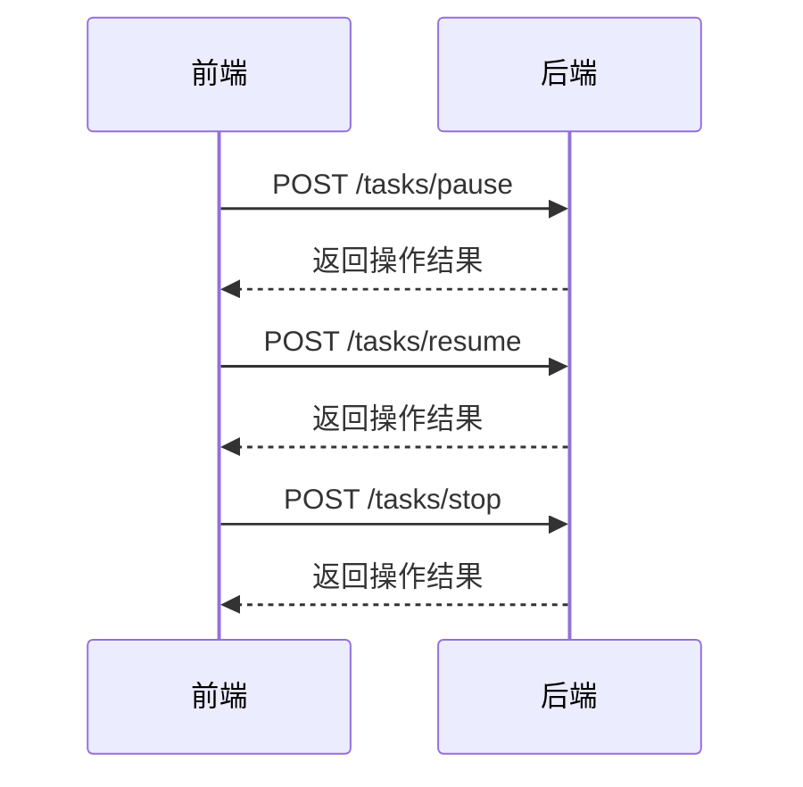

**控制操作API特点**：
- 支持暂停、恢复和停止操作
- 接受`TaskControlRequest`对象
- 返回操作结果和消息

**Diagram sources**
- [task.py](file://vibe_surf/backend/api/task.py#L1-L379)
- [models.py](file://vibe_surf/backend/api/models.py#L1-L260)

**Section sources**
- [task.py](file://vibe_surf/backend/api/task.py#L1-L379)
- [models.py](file://vibe_surf/backend/api/models.py#L1-L260)

## 代码标签页实现

代码标签页是API测试模态框的重要组成部分，它提供了语法高亮和代码复制功能。标签页支持多种编程语言，包括Python、JavaScript和cURL。

### 标签页结构

代码标签页由多个组件构成，包括标签列表、代码内容和复制按钮。

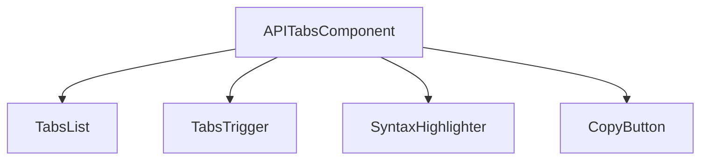

**标签页组件**：
- `TabsList`：标签列表，显示可用的编程语言
- `TabsTrigger`：标签触发器，用于切换标签
- `SyntaxHighlighter`：代码高亮组件
- `CopyButton`：复制按钮，用于复制代码

### 语法高亮

语法高亮使用`react-syntax-highlighter`库实现，支持多种主题和语言。

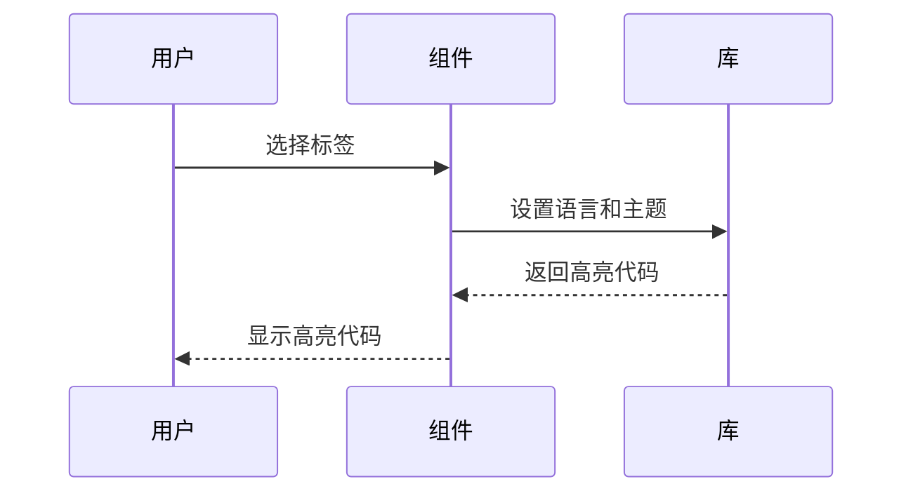

**语法高亮特点**：
- 支持多种编程语言
- 提供多种主题（oneDark, oneLight）
- 支持行号显示
- 自动换行

### 代码复制

代码复制功能允许用户一键复制生成的代码片段。

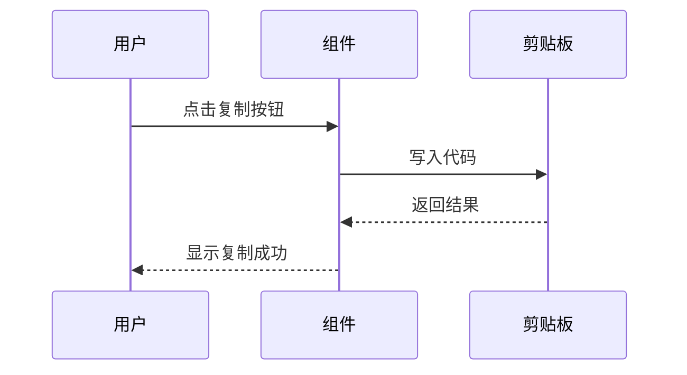

**代码复制特点**：
- 使用`navigator.clipboard` API
- 支持多步骤代码复制
- 提供复制成功提示

**Diagram sources**
- [code-tabs.tsx](file://vibe_surf/frontend/src/modals/apiModal/codeTabs/code-tabs.tsx#L1-L313)

**Section sources**
- [code-tabs.tsx](file://vibe_surf/frontend/src/modals/apiModal/codeTabs/code-tabs.tsx#L1-L313)

## 使用示例

以下是一些使用API测试模态框的实际示例，展示了如何测试不同的API端点。

### Python API调用示例

```python
import requests
import os
import uuid

api_key = 'YOUR_API_KEY_HERE'
url = "http://localhost:7860/api/v1/run/flow_id"  # The complete API endpoint URL for this flow

# Request payload configuration
payload = {
    "output_type": "chat",
    "input_type": "chat",
    "input_value": "hello world!",
    "session_id": str(uuid.uuid4())
}

headers = {"x-api-key": api_key}

try:
    # Send API request
    response = requests.request("POST", url, json=payload, headers=headers)
    response.raise_for_status()  # Raise exception for bad status codes

    # Print response
    print(response.text)

except requests.exceptions.RequestException as e:
    print(f"Error making API request: {e}")
except ValueError as e:
    print(f"Error parsing response: {e}")
```

### JavaScript API调用示例

```javascript
const crypto = require('crypto');
const apiKey = 'YOUR_API_KEY_HERE';

const payload = {
    "output_type": "chat",
    "input_type": "chat",
    "input_value": "hello world!",
    "session_id": crypto.randomUUID()
};

const options = {
    method: 'POST',
    headers: {
        'Content-Type': 'application/json',
        "x-api-key": apiKey
    },
    body: JSON.stringify(payload)
};

fetch('http://localhost:7860/api/v1/run/flow_id', options)
    .then(response => response.json())
    .then(response => console.warn(response))
    .catch(err => console.error(err));
```

### cURL API调用示例

```bash
curl --request POST \
     --url 'http://localhost:7860/api/v1/run/flow_id?stream=false' \
     --header 'Content-Type: application/json' \
     --header 'x-api-key: YOUR_API_KEY_HERE' \
     --data '{
    "output_type": "chat",
    "input_type": "chat",
    "input_value": "hello world!",
    "session_id": "YOUR_SESSION_ID_HERE"
}'
```

**Section sources**
- [get-python-api-code.tsx](file://vibe_surf/frontend/src/modals/apiModal/utils/get-python-api-code.tsx#L1-L189)
- [get-js-api-code.tsx](file://vibe_surf/frontend/src/modals/apiModal/utils/get-js-api-code.tsx#L1-L308)
- [get-curl-code.tsx](file://vibe_surf/frontend/src/modals/apiModal/utils/get-curl-code.tsx#L1-L267)

## 错误处理与响应可视化

API测试模态框提供了完善的错误处理机制和响应数据的可视化展示方式。

### 错误处理

错误处理机制包括前端和后端两个层面。

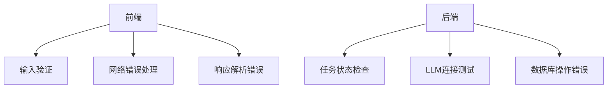

**前端错误处理**：
- 输入参数验证
- 网络请求错误处理
- 响应数据解析错误

**后端错误处理**：
- 任务状态检查
- LLM连接测试
- 数据库操作错误

### 响应可视化

响应数据的可视化展示方式包括文本显示、JSON格式化和图表展示。

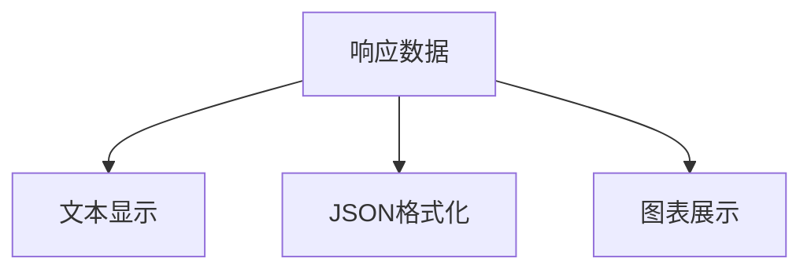

**响应可视化特点**：
- 支持文本和JSON格式显示
- 提供语法高亮
- 支持大型响应数据的分页显示
- 提供错误信息的详细展示

**Section sources**
- [index.tsx](file://vibe_surf/frontend/src/modals/apiModal/index.tsx#L1-L215)
- [task.py](file://vibe_surf/backend/api/task.py#L1-L379)