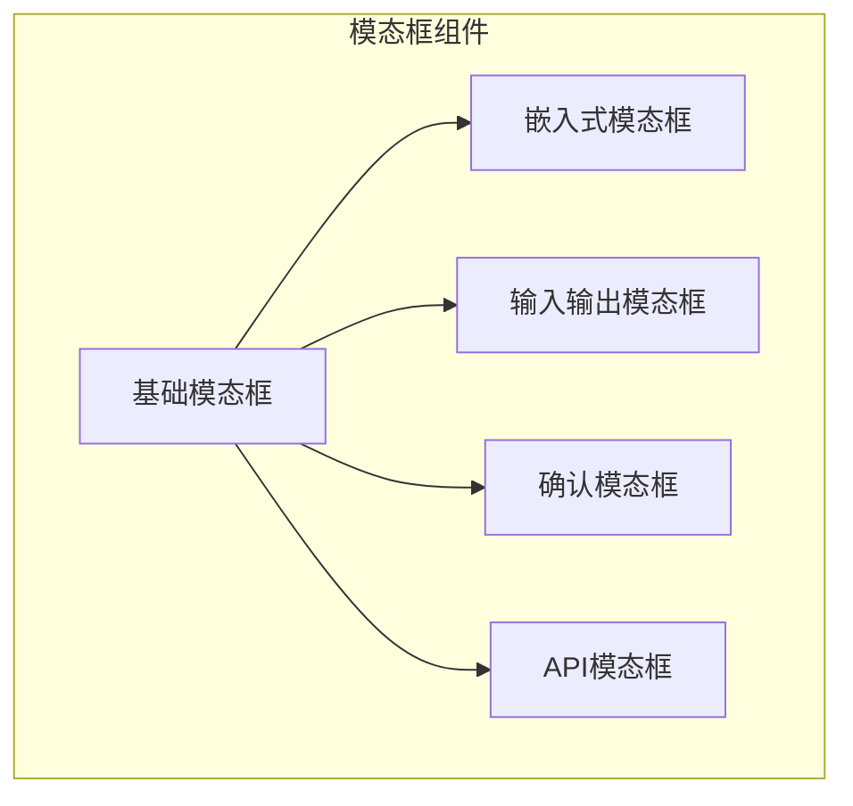
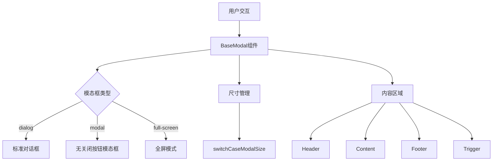
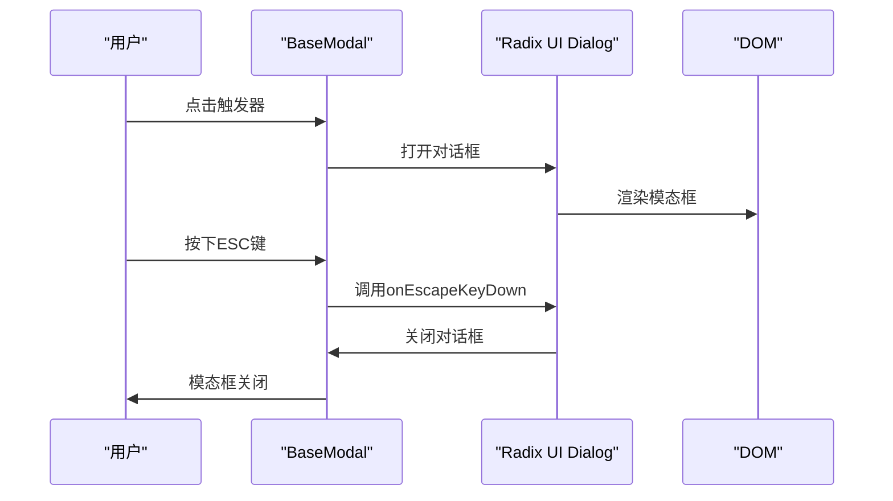
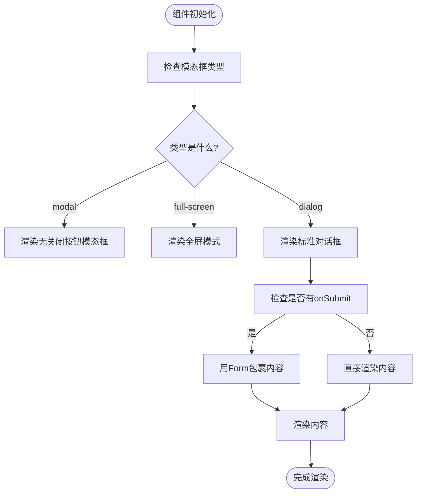
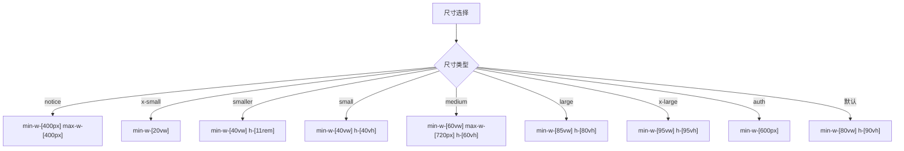
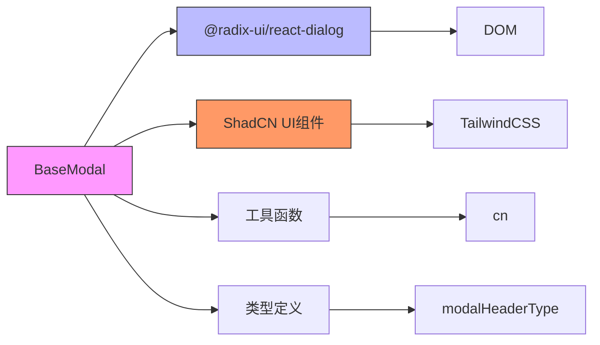

# 基础模态框架构

<cite>
**本文档中引用的文件**  
- [baseModal/index.tsx](file://vibe_surf/frontend/src/modals/baseModal/index.tsx)
- [switch-case-size.ts](file://vibe_surf/frontend/src/modals/baseModal/helpers/switch-case-size.ts)
- [embed-modal.tsx](file://vibe_surf/frontend/src/modals/EmbedModal/embed-modal.tsx)
- [playground-modal.tsx](file://vibe_surf/frontend/src/modals/IOModal/playground-modal.tsx)
- [confirmationModal/index.tsx](file://vibe_surf/frontend/src/modals/confirmationModal/index.tsx)
- [apiModal/index.tsx](file://vibe_surf/frontend/src/modals/apiModal/index.tsx)
- [dialog.tsx](file://vibe_surf/frontend/src/components/ui/dialog.tsx)
- [dialog-with-no-close.tsx](file://vibe_surf/frontend/src/components/ui/dialog-with-no-close.tsx)
- [components/index.ts](file://vibe_surf/frontend/src/types/components/index.ts)
</cite>

## 目录
1. [简介](#简介)
2. [项目结构](#项目结构)
3. [核心组件](#核心组件)
4. [架构概述](#架构概述)
5. [详细组件分析](#详细组件分析)
6. [依赖分析](#依赖分析)
7. [性能考虑](#性能考虑)
8. [故障排除指南](#故障排除指南)
9. [结论](#结论)

## 简介
基础模态框架构是VibeSurf前端应用中所有模态框组件的基类实现。该框架提供了一套可复用、可扩展的模态框系统，支持多种尺寸、类型和交互模式。作为ShadCN UI组件库的扩展，它封装了复杂的对话框逻辑，为开发者提供了简洁的API来创建各种类型的模态框，包括嵌入式模态框、确认对话框和API访问模态框等。

## 项目结构
基础模态框架构位于前端源码的模态框目录中，作为所有特定模态框组件的基类。该结构遵循组件化设计原则，将通用功能与特定实现分离。



**Diagram sources**
- [baseModal/index.tsx](file://vibe_surf/frontend/src/modals/baseModal/index.tsx)
- [embed-modal.tsx](file://vibe_surf/frontend/src/modals/EmbedModal/embed-modal.tsx)
- [playground-modal.tsx](file://vibe_surf/frontend/src/modals/IOModal/playground-modal.tsx)
- [confirmationModal/index.tsx](file://vibe_surf/frontend/src/modals/confirmationModal/index.tsx)
- [apiModal/index.tsx](file://vibe_surf/frontend/src/modals/apiModal/index.tsx)

**Section sources**
- [baseModal/index.tsx](file://vibe_surf/frontend/src/modals/baseModal/index.tsx)
- [embed-modal.tsx](file://vibe_surf/frontend/src/modals/EmbedModal/embed-modal.tsx)

## 核心组件
基础模态框架构（BaseModal）是所有模态框组件的基类，提供核心功能和可复用的UI结构。它通过组合式API设计，允许子组件灵活地构建不同类型的模态框，同时保持一致的用户体验。

**Section sources**
- [baseModal/index.tsx](file://vibe_surf/frontend/src/modals/baseModal/index.tsx)

## 架构概述
基础模态框架构基于Radix UI的Dialog组件构建，通过封装复杂的交互逻辑，提供简化的API供其他组件使用。其架构设计体现了分层和关注点分离的原则。



**Diagram sources**
- [baseModal/index.tsx](file://vibe_surf/frontend/src/modals/baseModal/index.tsx)
- [switch-case-size.ts](file://vibe_surf/frontend/src/modals/baseModal/helpers/switch-case-size.ts)

## 详细组件分析

### 基础模态框分析
基础模态框组件采用React函数式组件和TypeScript类型系统，提供类型安全的API。它通过复合组件模式，允许以声明式方式构建模态框的不同部分。

#### 对象导向组件
```mermaid
classDiagram
class BaseModal {
+open : boolean
+setOpen : (open : boolean) => void
+size : string
+type : "modal" | "dialog" | "full-screen"
+onSubmit : () => void
+onEscapeKeyDown : (e : KeyboardEvent) => void
}
class Content {
+children : ReactNode
+overflowHidden : boolean
+className : string
}
class Header {
+children : ReactNode
+description : string | JSX.Element | null
+clampDescription : number
}
class Footer {
+children : ReactNode
+submit : { label : string, icon? : ReactNode, loading? : boolean, disabled? : boolean, onClick? : () => void }
+close : boolean
+centered : boolean
+className : string
}
class Trigger {
+children : ReactNode
+asChild : boolean
+disable : boolean
+className : string
}
BaseModal --> Content : "包含"
BaseModal --> Header : "包含"
BaseModal --> Footer : "包含"
BaseModal --> Trigger : "包含"
BaseModal --> switchCaseModalSize : "使用"
```

**Diagram sources**
- [baseModal/index.tsx](file://vibe_surf/frontend/src/modals/baseModal/index.tsx)
- [switch-case-size.ts](file://vibe_surf/frontend/src/modals/baseModal/helpers/switch-case-size.ts)

#### API服务组件


**Diagram sources**
- [baseModal/index.tsx](file://vibe_surf/frontend/src/modals/baseModal/index.tsx)
- [dialog.tsx](file://vibe_surf/frontend/src/components/ui/dialog.tsx)

#### 复杂逻辑组件


**Diagram sources**
- [baseModal/index.tsx](file://vibe_surf/frontend/src/modals/baseModal/index.tsx)
- [dialog.tsx](file://vibe_surf/frontend/src/components/ui/dialog.tsx)

**Section sources**
- [baseModal/index.tsx](file://vibe_surf/frontend/src/modals/baseModal/index.tsx)
- [switch-case-size.ts](file://vibe_surf/frontend/src/modals/baseModal/helpers/switch-case-size.ts)

### 模态框尺寸管理
基础模态框框架提供了一套完整的尺寸管理系统，支持多种预定义尺寸，满足不同场景的需求。



**Diagram sources**
- [switch-case-size.ts](file://vibe_surf/frontend/src/modals/baseModal/helpers/switch-case-size.ts)

**Section sources**
- [switch-case-size.ts](file://vibe_surf/frontend/src/modals/baseModal/helpers/switch-case-size.ts)

## 依赖分析
基础模态框框架依赖于多个外部库和内部组件，形成了清晰的依赖关系。



**Diagram sources**
- [baseModal/index.tsx](file://vibe_surf/frontend/src/modals/baseModal/index.tsx)
- [dialog.tsx](file://vibe_surf/frontend/src/components/ui/dialog.tsx)
- [components/index.ts](file://vibe_surf/frontend/src/types/components/index.ts)

**Section sources**
- [baseModal/index.tsx](file://vibe_surf/frontend/src/modals/baseModal/index.tsx)
- [dialog.tsx](file://vibe_surf/frontend/src/components/ui/dialog.tsx)

## 性能考虑
基础模态框框架在设计时考虑了性能优化，通过多种机制确保良好的用户体验。

1. **懒加载**: 模态框内容在打开时才渲染，减少初始加载时间
2. **内存管理**: 使用useState和useEffect正确管理组件状态和生命周期
3. **事件处理**: 通过stopPropagation防止事件冒泡，优化交互性能
4. **条件渲染**: 根据配置条件渲染不同部分，避免不必要的DOM操作

**Section sources**
- [baseModal/index.tsx](file://vibe_surf/frontend/src/modals/baseModal/index.tsx)

## 故障排除指南
在使用基础模态框框架时可能遇到的常见问题及解决方案：

1. **模态框无法关闭**: 检查`setOpen`函数是否正确传递
2. **样式错乱**: 确认Tailwind CSS类名正确应用
3. **键盘事件无效**: 检查`onEscapeKeyDown`处理函数是否正确实现
4. **内容溢出**: 使用`overflowHidden`属性控制内容区域溢出行为

**Section sources**
- [baseModal/index.tsx](file://vibe_surf/frontend/src/modals/baseModal/index.tsx)
- [dialog.tsx](file://vibe_surf/frontend/src/components/ui/dialog.tsx)

## 结论
基础模态框框架构是一个设计精良、功能丰富的UI组件，为VibeSurf应用提供了统一的模态框解决方案。通过继承和组合模式，它实现了高度的可复用性和可定制性，同时保持了良好的性能特征。该框架的成功实施体现了现代前端开发中组件化和抽象化的重要性，为构建复杂用户界面提供了坚实的基础。