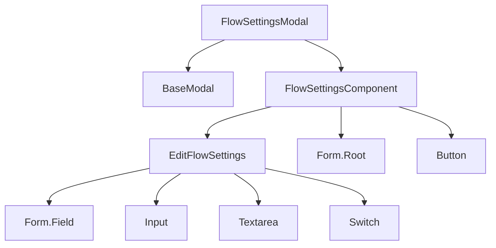
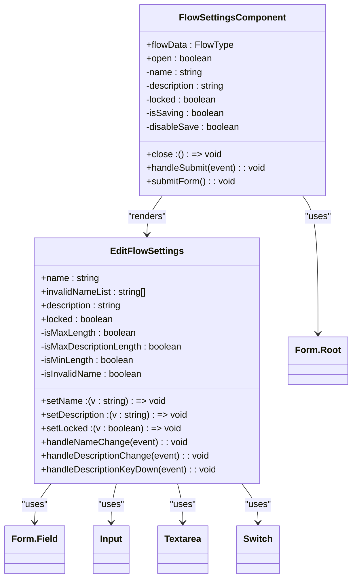
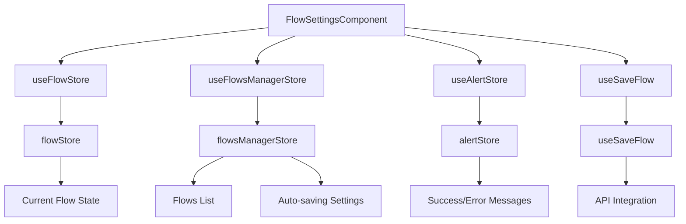
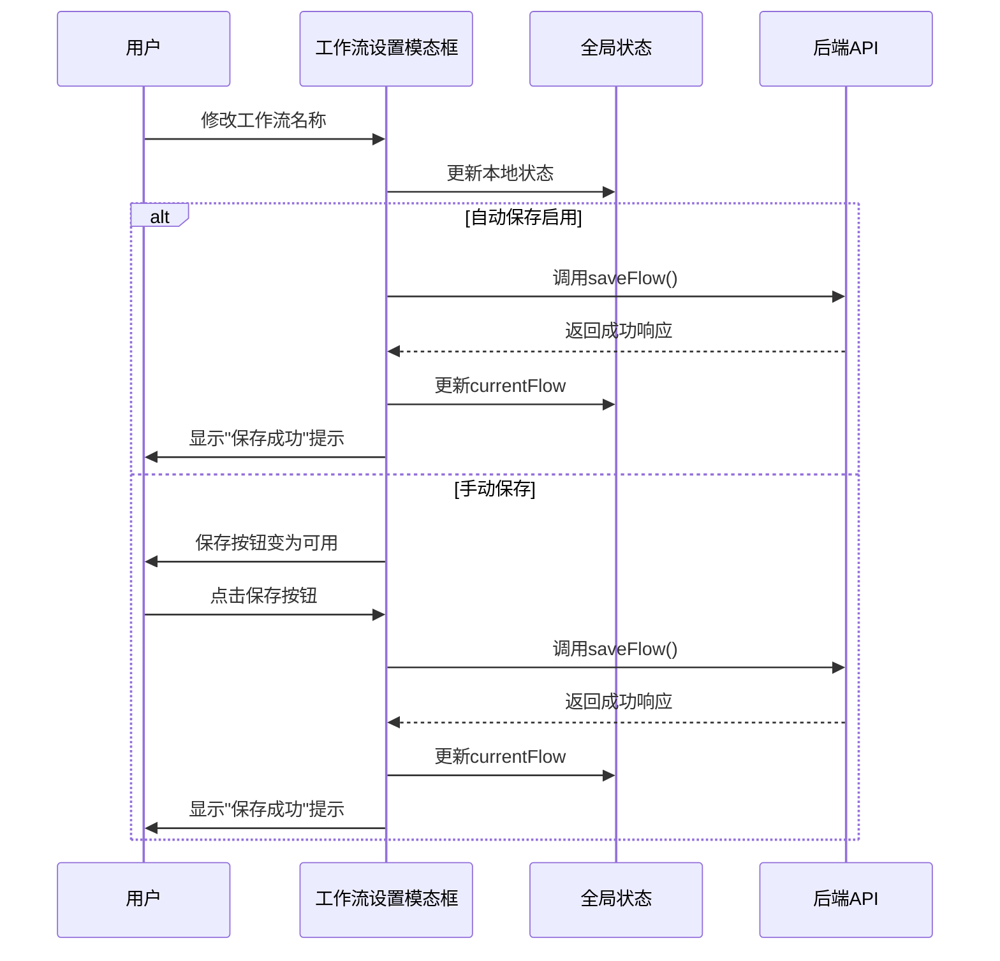
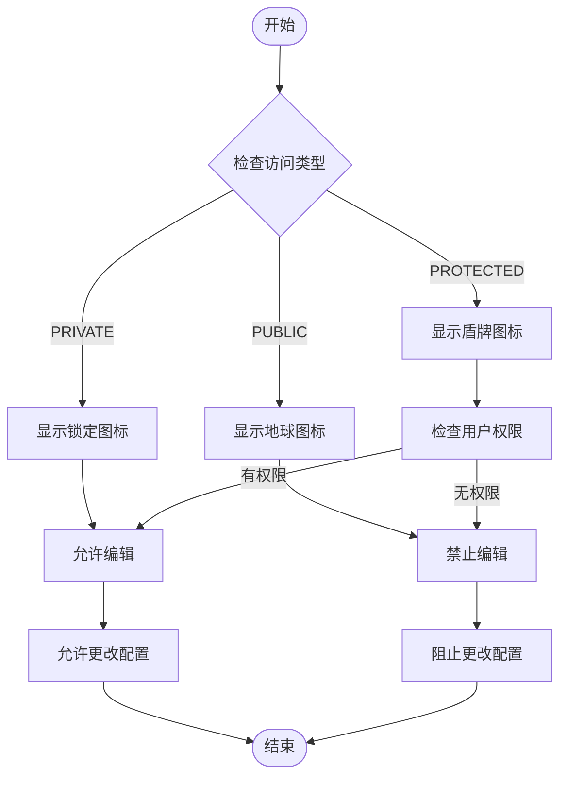

# 工作流设置模态框

<cite>
**本文档中引用的文件**  
- [flowSettingsModal/index.tsx](file://vibe_surf/frontend/src/modals/flowSettingsModal/index.tsx)
- [flowSettingsComponent/index.tsx](file://vibe_surf/frontend/src/components/core/flowSettingsComponent/index.tsx)
- [editFlowSettingsComponent/index.tsx](file://vibe_surf/frontend/src/components/core/editFlowSettingsComponent/index.tsx)
- [flowStore.ts](file://vibe_surf/frontend/src/stores/flowStore.ts)
- [flowsManagerStore.ts](file://vibe_surf/frontend/src/stores/flowsManagerStore.ts)
- [use-save-flow.ts](file://vibe_surf/frontend/src/hooks/flows/use-save-flow.ts)
- [use-patch-update-flow.ts](file://vibe_surf/frontend/src/controllers/API/queries/flows/use-patch-update-flow.ts)
- [shareModal/index.tsx](file://vibe_surf/frontend/src/modals/shareModal/index.tsx)
</cite>

## 目录
1. [简介](#简介)
2. [核心组件分析](#核心组件分析)
3. [工作流属性配置机制](#工作流属性配置机制)
4. [全局状态管理集成](#全局状态管理集成)
5. [保存与版本控制](#保存与版本控制)
6. [权限管理与共享配置](#权限管理与共享配置)
7. [用户体验设计](#用户体验设计)
8. [实际使用示例](#实际使用示例)
9. [结论](#结论)

## 简介
工作流设置模态框是VibeSurf应用中的关键功能组件，允许用户配置和管理复杂的工作流属性。该模态框提供了对工作流元数据的全面编辑功能，包括名称、描述和锁定状态等。通过与全局状态管理系统的深度集成，该组件确保了工作流配置的实时同步和持久化存储。本文档将深入分析其架构设计、实现机制和用户体验特性。

## 核心组件分析

工作流设置模态框由多个相互协作的React组件构成，形成了清晰的层次结构。主要组件包括`FlowSettingsModal`、`FlowSettingsComponent`和`EditFlowSettings`，它们共同实现了工作流配置的完整功能。



**Diagram sources**
- [flowSettingsModal/index.tsx](file://vibe_surf/frontend/src/modals/flowSettingsModal/index.tsx)
- [flowSettingsComponent/index.tsx](file://vibe_surf/frontend/src/components/core/flowSettingsComponent/index.tsx)
- [editFlowSettingsComponent/index.tsx](file://vibe_surf/frontend/src/components/core/editFlowSettingsComponent/index.tsx)

**Section sources**
- [flowSettingsModal/index.tsx](file://vibe_surf/frontend/src/modals/flowSettingsModal/index.tsx)
- [flowSettingsComponent/index.tsx](file://vibe_surf/frontend/src/components/core/flowSettingsComponent/index.tsx)

## 工作流属性配置机制

工作流设置模态框提供了对工作流元数据的全面编辑功能，包括名称、描述和锁定状态等属性的配置。

### 元数据编辑功能
模态框支持对工作流的基本元数据进行编辑，包括：
- **名称编辑**：用户可以修改工作流的名称，系统会验证名称的唯一性和长度限制
- **描述编辑**：提供文本区域供用户输入工作流的详细描述
- **锁定状态**：通过开关控件控制工作流的编辑权限



**Diagram sources**
- [flowSettingsComponent/index.tsx](file://vibe_surf/frontend/src/components/core/flowSettingsComponent/index.tsx)
- [editFlowSettingsComponent/index.tsx](file://vibe_surf/frontend/src/components/core/editFlowSettingsComponent/index.tsx)

**Section sources**
- [flowSettingsComponent/index.tsx](file://vibe_surf/frontend/src/components/core/flowSettingsComponent/index.tsx)
- [editFlowSettingsComponent/index.tsx](file://vibe_surf/frontend/src/components/core/editFlowSettingsComponent/index.tsx)

## 全局状态管理集成

工作流设置模态框与Zustand状态管理库深度集成，实现了跨组件的状态共享和同步。

### 状态管理架构
系统使用多个Zustand store来管理不同类型的状态：
- `flowStore`：管理当前工作流的节点、边和构建状态
- `flowsManagerStore`：管理工作流列表和全局配置
- `alertStore`：管理用户界面的提示和错误消息



**Diagram sources**
- [flowStore.ts](file://vibe_surf/frontend/src/stores/flowStore.ts)
- [flowsManagerStore.ts](file://vibe_surf/frontend/src/stores/flowsManagerStore.ts)
- [use-save-flow.ts](file://vibe_surf/frontend/src/hooks/flows/use-save-flow.ts)

**Section sources**
- [flowStore.ts](file://vibe_surf/frontend/src/stores/flowStore.ts)
- [flowsManagerStore.ts](file://vibe_surf/frontend/src/stores/flowsManagerStore.ts)

## 保存与版本控制

工作流设置模态框实现了智能的保存机制和版本控制功能，确保用户配置的安全性和一致性。

### 保存机制
系统提供了两种保存模式：
- **自动保存**：当`autoSaving`标志启用时，更改会自动保存到服务器
- **手动保存**：当自动保存禁用时，更改仅更新本地状态，需要用户显式保存



**Diagram sources**
- [use-save-flow.ts](file://vibe_surf/frontend/src/hooks/flows/use-save-flow.ts)
- [use-patch-update-flow.ts](file://vibe_surf/frontend/src/controllers/API/queries/flows/use-patch-update-flow.ts)

**Section sources**
- [use-save-flow.ts](file://vibe_surf/frontend/src/hooks/flows/use-save-flow.ts)
- [use-patch-update-flow.ts](file://vibe_surf/frontend/src/controllers/API/queries/flows/use-patch-update-flow.ts)

## 权限管理与共享配置

工作流设置模态框集成了完善的权限管理和共享配置功能，支持不同级别的访问控制。

### 访问类型设置
系统支持三种访问类型：
- **PRIVATE**：私有工作流，仅创建者可以访问
- **PUBLIC**：公开工作流，所有用户可以查看
- **PROTECTED**：受保护工作流，特定用户可以访问



**Diagram sources**
- [use-patch-update-flow.ts](file://vibe_surf/frontend/src/controllers/API/queries/flows/use-patch-update-flow.ts)
- [shareModal/index.tsx](file://vibe_surf/frontend/src/modals/shareModal/index.tsx)

**Section sources**
- [use-patch-update-flow.ts](file://vibe_surf/frontend/src/controllers/API/queries/flows/use-patch-update-flow.ts)
- [shareModal/index.tsx](file://vibe_surf/frontend/src/modals/shareModal/index.tsx)

## 用户体验设计

工作流设置模态框注重用户体验，提供了完善的输入验证、错误提示和响应式布局。

### 输入验证与错误处理
系统实现了多层次的输入验证机制：
- **实时验证**：在用户输入时即时检查有效性
- **提交验证**：在表单提交时进行最终验证
- **错误提示**：提供清晰的错误消息和建议

```mermaid
flowchart TD
A[用户输入名称] --> B{名称长度检查}
B --> |小于最小长度| C[显示"最少需要1个字符"]
B --> |达到最大长度| D[显示"字符数已达上限"]
B --> |有效长度| E{名称唯一性检查}
E --> |名称已存在| F[显示"工作流名称已存在"]
E --> |名称唯一| G[接受输入]
H[用户输入描述] --> I{描述长度检查}
I --> |达到最大长度| J[显示"字符数已达上限"]
I --> |有效长度| K[接受输入]
L[用户切换锁定状态] --> M[立即更新本地状态]
M --> N[如果自动保存，同步到服务器]
```

**Diagram sources**
- [editFlowSettingsComponent/index.tsx](file://vibe_surf/frontend/src/components/core/editFlowSettingsComponent/index.tsx)
- [flowSettingsComponent/index.tsx](file://vibe_surf/frontend/src/components/core/flowSettingsComponent/index.tsx)

**Section sources**
- [editFlowSettingsComponent/index.tsx](file://vibe_surf/frontend/src/components/core/editFlowSettingsComponent/index.tsx)

## 实际使用示例

以下是一个配置复杂工作流属性的实际使用示例：

### 配置多步骤工作流
假设用户需要创建一个包含数据提取、处理和分析的复杂工作流：

1. **打开设置模态框**：用户点击工作流标题旁的设置图标
2. **配置基本信息**：
   - 名称：`客户数据分析工作流`
   - 描述：`从多个来源提取客户数据，进行清洗和分析，生成报告`
3. **设置访问权限**：
   - 将访问类型设置为`PROTECTED`
   - 添加团队成员到共享列表
4. **启用工作流锁定**：防止意外修改
5. **保存配置**：点击保存按钮，系统验证并保存配置

该示例展示了如何通过工作流设置模态框配置一个复杂的多步骤工作流，包括元数据编辑、权限设置和保护机制。

**Section sources**
- [flowSettingsModal/index.tsx](file://vibe_surf/frontend/src/modals/flowSettingsModal/index.tsx)
- [flowSettingsComponent/index.tsx](file://vibe_surf/frontend/src/components/core/flowSettingsComponent/index.tsx)

## 结论
工作流设置模态框是VibeSurf应用中一个功能强大且用户友好的组件，它通过清晰的架构设计和完善的用户体验，为用户提供了全面的工作流配置能力。该组件与全局状态管理系统的深度集成确保了数据的一致性和实时性，而智能的保存机制和权限管理功能则保障了工作流的安全性和协作性。通过持续优化和功能扩展，该模态框将继续为用户提供高效、可靠的工作流管理体验。