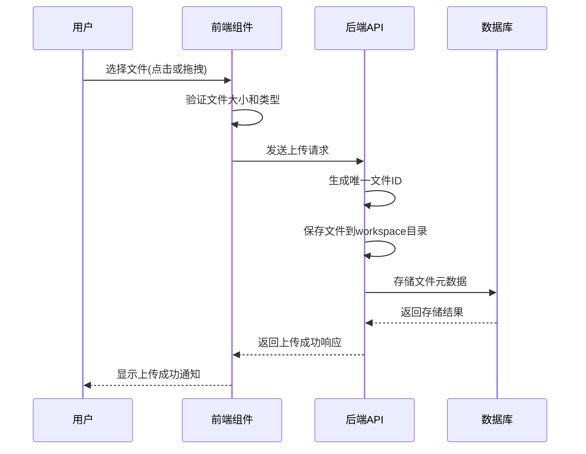
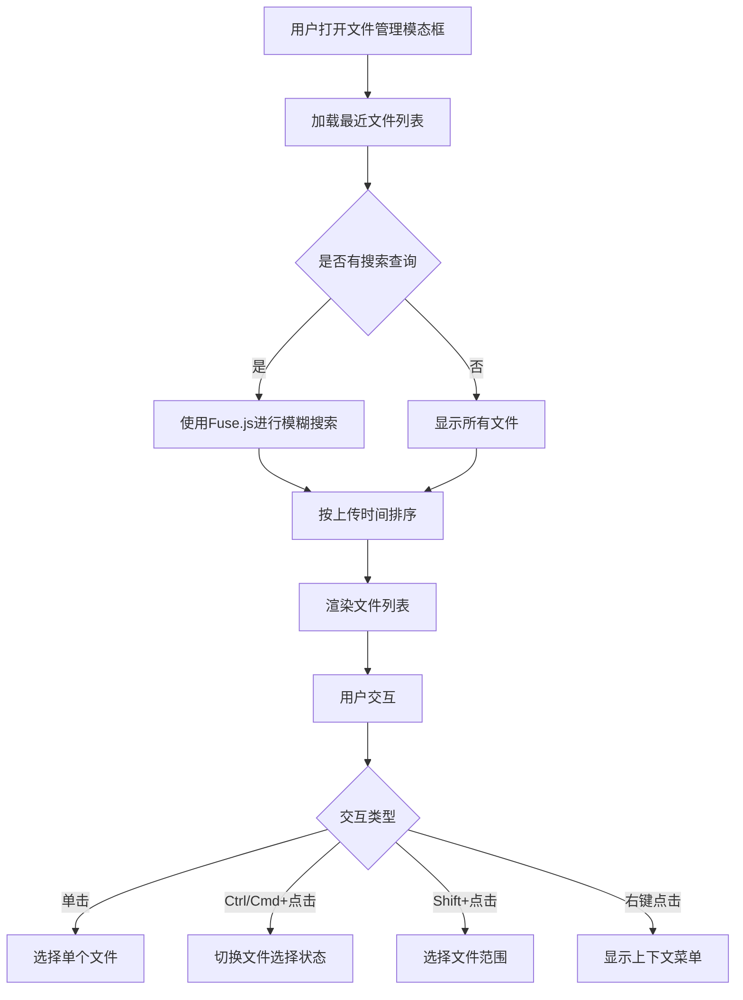
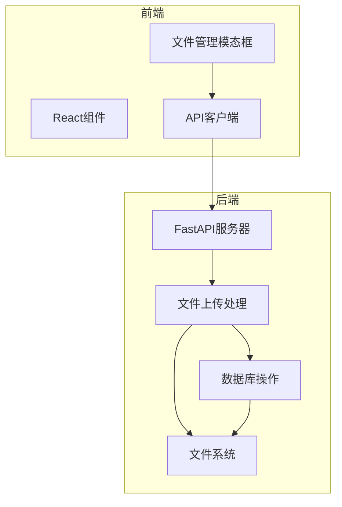

# 文件管理模态框

<cite>
**本文档引用的文件**  
- [file-manager.js](file://vibe_surf/chrome_extension/scripts/file-manager.js)
- [index.tsx](file://vibe_surf/frontend/src/modals/fileManagerModal/index.tsx)
- [dragFilesComponent/index.tsx](file://vibe_surf/frontend/src/modals/fileManagerModal/components/dragFilesComponent/index.tsx)
- [recentFilesComponent/index.tsx](file://vibe_surf/frontend/src/modals/fileManagerModal/components/recentFilesComponent/index.tsx)
- [filesRendererComponent/index.tsx](file://vibe_surf/frontend/src/modals/fileManagerModal/components/filesRendererComponent/index.tsx)
- [fileRendererComponent/index.tsx](file://vibe_surf/frontend/src/modals/fileManagerModal/components/filesRendererComponent/components/fileRendererComponent/index.tsx)
- [use-upload-file.ts](file://vibe_surf/frontend/src/hooks/files/use-upload-file.ts)
- [files.py](file://vibe_surf/backend/api/files.py)
</cite>

## 目录
1. [简介](#简介)
2. [核心功能分析](#核心功能分析)
3. [文件上传机制](#文件上传机制)
4. [文件列表渲染与分页](#文件列表渲染与分页)
5. [最近文件显示功能](#最近文件显示功能)
6. [与后端文件系统的集成](#与后端文件系统的集成)
7. [大文件上传与进度显示](#大文件上传与进度显示)
8. [安全考虑](#安全考虑)
9. [用户体验优化](#用户体验优化)
10. [实际使用示例](#实际使用示例)
11. [结论](#结论)

## 简介
文件管理模态框是VibeSurf应用中的核心功能组件，为用户提供了一个直观、高效的文件管理界面。该模态框允许用户上传、管理和查看项目相关文件，支持拖放上传、批量操作和文件类型过滤等高级功能。通过与后端文件系统的深度集成，文件管理模态框实现了从文件上传到存储、检索的完整生命周期管理。本文档将深入分析该组件的架构设计、功能实现和最佳实践，为开发者和用户提供全面的技术参考。

## 核心功能分析
文件管理模态框提供了完整的文件管理解决方案，主要包含三大核心功能：文件上传、文件管理和最近文件显示。这些功能通过前端React组件与后端FastAPI服务的协同工作实现。模态框采用模块化设计，由多个子组件构成，包括拖拽上传区、最近文件列表和文件渲染器等。组件间通过props和事件系统进行通信，确保了功能的独立性和可维护性。整个系统支持文件类型验证、大小限制、进度显示等安全和用户体验特性，为用户提供了一个可靠且易用的文件管理环境。

**Section sources**
- [index.tsx](file://vibe_surf/frontend/src/modals/fileManagerModal/index.tsx#L1-L114)

## 文件上传机制
文件上传功能通过前端拖拽组件和后端API的协同工作实现。用户可以通过点击或拖拽文件到指定区域来触发上传操作。前端使用HTML5的File API和Drag & Drop API捕获用户选择的文件，并通过自定义hook `useUploadFile` 处理上传逻辑。该hook首先验证文件大小和类型，然后调用后端的上传接口。后端使用FastAPI的`UploadFile`类接收文件流，并将其保存到指定的workspace目录中。上传过程中，系统会生成唯一的文件ID，记录文件的元数据（如原始文件名、存储路径、大小、MIME类型等）并存储到数据库中，确保文件的可追溯性和安全性。

**Diagram sources**
- [dragFilesComponent/index.tsx](file://vibe_surf/frontend/src/modals/fileManagerModal/components/dragFilesComponent/index.tsx#L1-L158)
- [use-upload-file.ts](file://vibe_surf/frontend/src/hooks/files/use-upload-file.ts#L1-L69)
- [files.py](file://vibe_surf/backend/api/files.py#L57-L154)

## 文件列表渲染与分页
文件列表的渲染机制采用了高效的虚拟化技术，确保在处理大量文件时仍能保持流畅的用户体验。前端通过`RecentFilesComponent`组件获取文件列表数据，并使用`FilesRendererComponent`进行渲染。系统实现了搜索过滤、排序和分页功能，用户可以通过搜索框快速定位文件，按上传时间排序，并通过分页控件浏览大量文件。后端API支持分页查询参数（limit和offset），只返回当前页所需的数据，减少了网络传输量和前端渲染压力。前端还使用了Fuse.js库实现模糊搜索，提升了文件查找的准确性和用户体验。

**Section sources**
- [recentFilesComponent/index.tsx](file://vibe_surf/frontend/src/modals/fileManagerModal/components/recentFilesComponent/index.tsx#L1-L193)
- [filesRendererComponent/index.tsx](file://vibe_surf/frontend/src/modals/fileManagerModal/components/filesRendererComponent/index.tsx#L1-L35)

## 最近文件显示功能
最近文件显示功能为用户提供了一个便捷的文件访问入口，能够快速查看和选择最近上传或使用的文件。该功能通过`RecentFilesComponent`实现，支持多种交互方式，包括点击选择、Shift+点击进行范围选择、Ctrl/Cmd+点击进行多选等。组件会根据文件的更新时间自动排序，确保最近使用的文件位于列表顶部。每个文件项都显示了文件名、大小和图标等关键信息，并通过颜色编码和禁用状态指示文件类型是否受支持。用户还可以通过右键菜单或上下文按钮对文件进行重命名、删除等操作，实现了完整的文件管理功能。

**Diagram sources**
- [recentFilesComponent/index.tsx](file://vibe_surf/frontend/src/modals/fileManagerModal/components/recentFilesComponent/index.tsx#L1-L193)
- [fileRendererComponent/index.tsx](file://vibe_surf/frontend/src/modals/fileManagerModal/components/filesRendererComponent/components/fileRendererComponent/index.tsx#L1-L224)

## 与后端文件系统的集成
文件管理模态框与后端文件系统通过RESTful API进行深度集成，实现了文件的全生命周期管理。前端通过API路由与后端通信，主要接口包括文件上传(`/files/upload`)、文件下载(`/files/{file_id}`)、文件列表查询(`/files`)和文件删除(`/files/{file_id}`)。后端使用SQLAlchemy进行数据库操作，将文件元数据存储在关系型数据库中，同时将实际文件存储在本地文件系统中。系统通过`workspace_dir`配置项确定文件存储的根目录，并为每个会话创建独立的子目录，实现了文件的隔离和组织。这种架构设计既保证了文件访问的安全性，又提供了灵活的文件管理能力。

**Diagram sources**
- [index.tsx](file://vibe_surf/frontend/src/modals/fileManagerModal/index.tsx#L1-L114)
- [files.py](file://vibe_surf/backend/api/files.py#L1-L332)

## 大文件上传与进度显示
系统针对大文件上传场景进行了专门优化，提供了实时的上传进度显示功能。当用户上传大文件时，前端会显示进度条和百分比，让用户清楚了解上传状态。后端通过分块上传和流式处理技术，确保大文件上传的稳定性和效率。系统还实现了上传失败的自动重试机制，当网络中断或上传失败时，用户可以点击"重试"按钮继续上传，而无需重新选择文件。此外，上传过程中会实时验证文件大小是否超过系统限制（由`maxFileSizeUpload`配置），并在超出时给出明确的错误提示，避免了无效的上传尝试。

**Section sources**
- [fileRendererComponent/index.tsx](file://vibe_surf/frontend/src/modals/fileManagerModal/components/filesRendererComponent/components/fileRendererComponent/index.tsx#L1-L224)
- [use-upload-file.ts](file://vibe_surf/frontend/src/hooks/files/use-upload-file.ts#L1-L69)

## 安全考虑
文件管理模态框在设计时充分考虑了安全性，实施了多层次的安全措施。首先，系统对上传文件的类型和大小进行了严格限制，只允许预定义的文件类型，并设置了最大文件大小阈值。其次，后端在保存文件前会验证文件路径的安全性，防止路径遍历攻击。文件存储采用唯一的ID命名，避免了文件名冲突和恶意覆盖。数据库中存储的文件记录包含完整的元数据，支持审计和追踪。此外，系统还实现了软删除机制，删除文件时不会立即从磁盘移除，而是标记为已删除状态，为数据恢复提供了可能。

**Section sources**
- [use-upload-file.ts](file://vibe_surf/frontend/src/hooks/files/use-upload-file.ts#L1-L69)
- [files.py](file://vibe_surf/backend/api/files.py#L44-L55)

## 用户体验优化
为了提升用户体验，文件管理模态框实现了多项优化功能。拖放上传支持让用户可以通过简单的拖拽操作完成文件上传，操作直观且高效。批量操作功能允许用户同时选择多个文件进行管理，提高了工作效率。键盘快捷键支持（如Shift+点击进行范围选择）满足了高级用户的需求。文件图标根据类型动态显示，提供了视觉上的快速识别。搜索功能支持模糊匹配，即使输入不完整的文件名也能找到目标文件。错误处理机制友好，当操作失败时会给出明确的错误信息和解决方案建议，帮助用户快速解决问题。

**Section sources**
- [dragFilesComponent/index.tsx](file://vibe_surf/frontend/src/modals/fileManagerModal/components/dragFilesComponent/index.tsx#L1-L158)
- [recentFilesComponent/index.tsx](file://vibe_surf/frontend/src/modals/fileManagerModal/components/recentFilesComponent/index.tsx#L1-L193)

## 实际使用示例
在实际使用中，用户可以通过点击工具栏上的文件图标打开文件管理模态框。在模态框中，用户可以将项目文档、图片或数据文件拖拽到上传区域，系统会自动开始上传并显示进度。上传完成后，文件会出现在最近文件列表中，用户可以通过搜索框快速找到特定文件。选择一个或多个文件后，点击"选择文件"按钮即可将其关联到当前任务。对于已上传的文件，用户可以通过右键菜单进行重命名或删除操作。当需要重新上传失败的文件时，只需点击文件项中的"重试"链接即可继续上传过程。

**Section sources**
- [index.tsx](file://vibe_surf/frontend/src/modals/fileManagerModal/index.tsx#L1-L114)
- [fileRendererComponent/index.tsx](file://vibe_surf/frontend/src/modals/fileManagerModal/components/filesRendererComponent/components/fileRendererComponent/index.tsx#L1-L224)

## 结论
文件管理模态框作为VibeSurf应用的核心功能之一，通过精心的设计和实现，为用户提供了一个强大而易用的文件管理解决方案。其模块化的架构、安全的文件处理机制和优化的用户体验，确保了文件管理的高效性和可靠性。通过前端与后端的紧密协作，系统实现了从文件上传到存储、检索和管理的完整闭环。未来可以进一步优化大文件上传的分块处理、增加文件预览功能，并支持更多云存储集成，为用户提供更加丰富和灵活的文件管理体验。