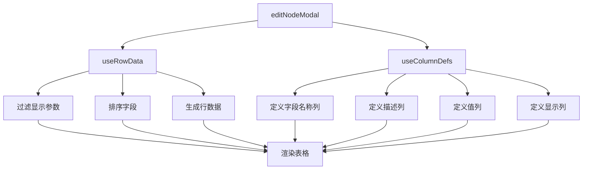
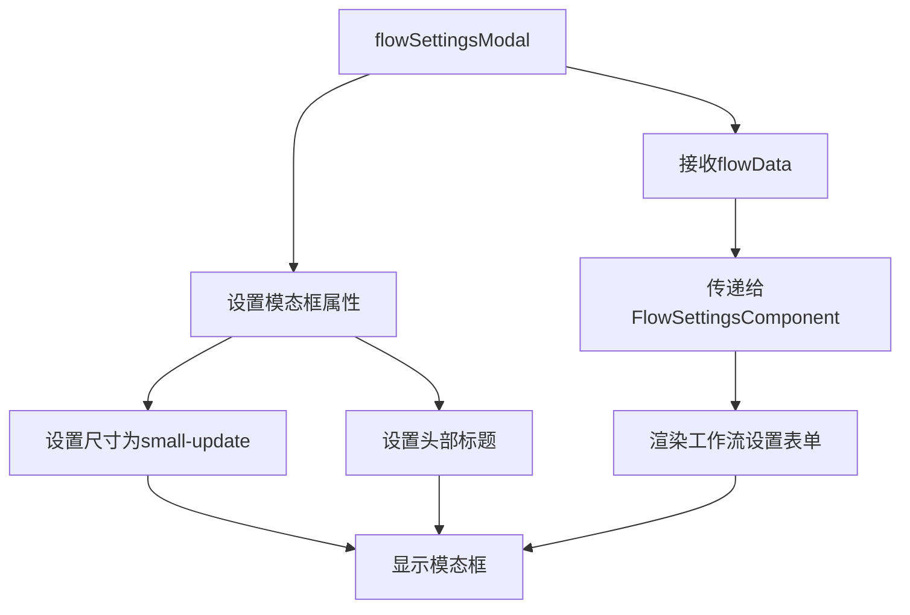
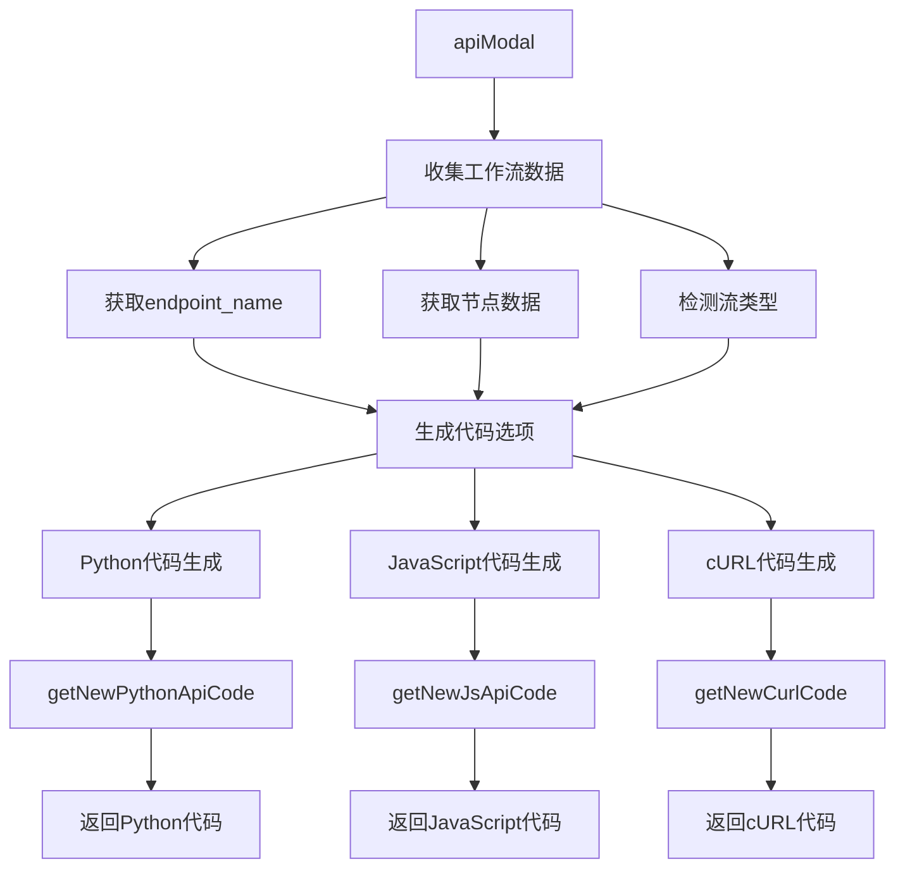
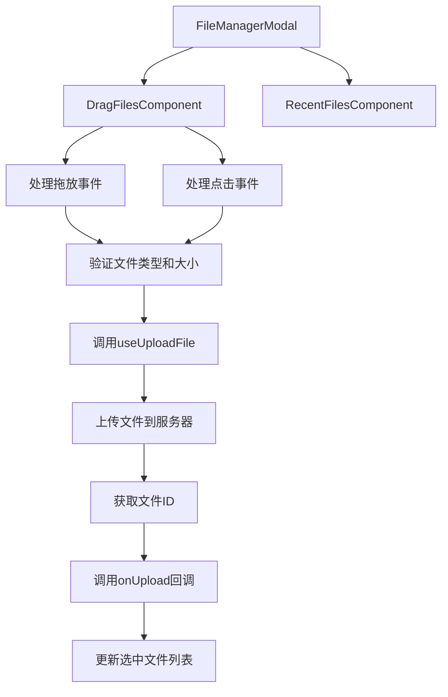
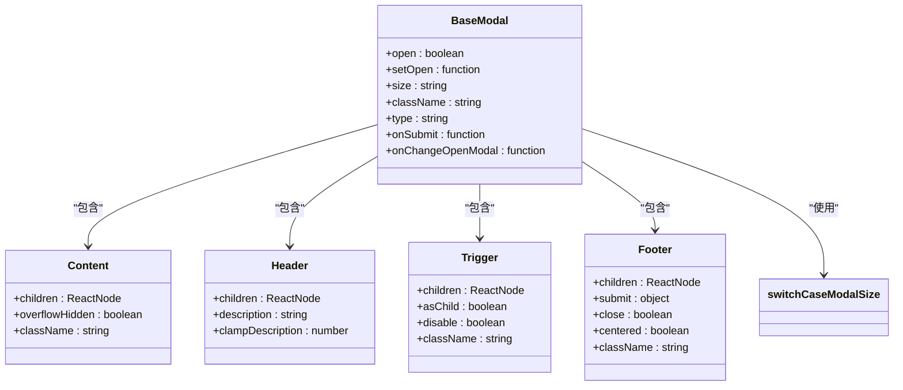

# 模态框系统

<cite>
**本文档中引用的文件**  
- [editNodeModal/index.tsx](file://vibe_surf/frontend/src/modals/editNodeModal/index.tsx)
- [editNodeModal/components/editNodeComponent/index.tsx](file://vibe_surf/frontend/src/modals/editNodeModal/components/editNodeComponent/index.tsx)
- [editNodeModal/hooks/use-row-data.ts](file://vibe_surf/frontend/src/modals/editNodeModal/hooks/use-row-data.ts)
- [editNodeModal/hooks/use-column-defs.ts](file://vibe_surf/frontend/src/modals/editNodeModal/hooks/use-column-defs.ts)
- [flowSettingsModal/index.tsx](file://vibe_surf/frontend/src/modals/flowSettingsModal/index.tsx)
- [apiModal/index.tsx](file://vibe_surf/frontend/src/modals/apiModal/index.tsx)
- [apiModal/codeTabs/code-tabs.tsx](file://vibe_surf/frontend/src/modals/apiModal/codeTabs/code-tabs.tsx)
- [apiModal/utils/get-python-api-code.tsx](file://vibe_surf/frontend/src/modals/apiModal/utils/get-python-api-code.tsx)
- [apiModal/utils/get-js-api-code.tsx](file://vibe_surf/frontend/src/modals/apiModal/utils/get-js-api-code.tsx)
- [apiModal/utils/get-curl-code.tsx](file://vibe_surf/frontend/src/modals/apiModal/utils/get-curl-code.tsx)
- [fileManagerModal/index.tsx](file://vibe_surf/frontend/src/modals/fileManagerModal/index.tsx)
- [fileManagerModal/components/dragFilesComponent/index.tsx](file://vibe_surf/frontend/src/modals/fileManagerModal/components/dragFilesComponent/index.tsx)
- [fileManagerModal/components/recentFilesComponent/index.tsx](file://vibe_surf/frontend/src/modals/fileManagerModal/components/recentFilesComponent/index.tsx)
- [baseModal/index.tsx](file://vibe_surf/frontend/src/modals/baseModal/index.tsx)
- [baseModal/helpers/switch-case-size.ts](file://vibe_surf/frontend/src/modals/baseModal/helpers/switch-case-size.ts)
</cite>

## 目录
1. [简介](#简介)
2. [核心模态框组件](#核心模态框组件)
3. [editNodeModal节点配置编辑](#editnodemodal节点配置编辑)
4. [flowSettingsModal工作流属性配置](#flowsettingsmodal工作流属性配置)
5. [apiModal代码生成与API测试](#apimodal代码生成与api测试)
6. [fileManagerModal文件管理](#filemanagermodal文件管理)
7. [baseModal底层架构](#basemodal底层架构)
8. [模态框系统指南](#模态框系统指南)
9. [结论](#结论)

## 简介
VibeSurf模态框系统为用户提供了一套完整的交互式界面组件，用于配置和管理工作流中的各种元素。该系统包含多个专用模态框组件，每个组件都针对特定功能进行了优化，包括节点配置编辑、工作流属性设置、API代码生成和文件管理等。所有模态框都基于统一的baseModal组件构建，确保了界面的一致性和可维护性。本文档将深入分析这些模态框的实现机制和使用方法。

## 核心模态框组件
VibeSurf的模态框系统由多个专用组件构成，每个组件负责不同的功能领域。系统采用分层架构设计，以baseModal作为基础组件提供通用的模态框功能，其他专用模态框在此基础上进行扩展。主要组件包括editNodeModal（用于节点配置编辑）、flowSettingsModal（用于工作流属性配置）、apiModal（用于API代码生成和测试）以及fileManagerModal（用于文件上传和管理）。这些组件通过props传递数据和回调函数，实现了高度的可复用性和灵活性。

**Section sources**
- [editNodeModal/index.tsx](file://vibe_surf/frontend/src/modals/editNodeModal/index.tsx)
- [flowSettingsModal/index.tsx](file://vibe_surf/frontend/src/modals/flowSettingsModal/index.tsx)
- [apiModal/index.tsx](file://vibe_surf/frontend/src/modals/apiModal/index.tsx)
- [fileManagerModal/index.tsx](file://vibe_surf/frontend/src/modals/fileManagerModal/index.tsx)
- [baseModal/index.tsx](file://vibe_surf/frontend/src/modals/baseModal/index.tsx)

## editNodeModal节点配置编辑
editNodeModal组件实现了节点配置的完整编辑功能，包括表单渲染、参数验证和变更检测。该组件通过AG-Grid表格组件渲染节点参数，提供了直观的编辑界面。

### 表单渲染机制
editNodeModal使用AG-Grid作为表格渲染引擎，通过useColumnDefs和useRowData两个自定义Hook来配置表格的列定义和行数据。列定义包括"字段名称"、"描述"、"值"和"显示"四个列，其中"值"列使用TableNodeCellRender组件进行渲染，"显示"列使用TableAdvancedToggleCellRender组件渲染为切换开关。

**Diagram sources**
- [editNodeModal/index.tsx](file://vibe_surf/frontend/src/modals/editNodeModal/index.tsx)
- [editNodeModal/components/editNodeComponent/index.tsx](file://vibe_surf/frontend/src/modals/editNodeModal/components/editNodeComponent/index.tsx)
- [editNodeModal/hooks/use-row-data.ts](file://vibe_surf/frontend/src/modals/editNodeModal/hooks/use-row-data.ts)
- [editNodeModal/hooks/use-column-defs.ts](file://vibe_surf/frontend/src/modals/editNodeModal/hooks/use-column-defs.ts)

### 参数验证与变更检测
参数验证通过在useRowData Hook中过滤节点模板参数实现，排除以下类型的参数：以"_"开头的内部参数、show属性为false的参数、类型为"code"且键名为"code"的参数，以及包含"code"且具有proxy属性的参数。变更检测通过useEffect Hook实现，当节点数据发生变化时，比较新旧模板参数的键名，如有变化则更新nodeClass状态。

**Section sources**
- [editNodeModal/index.tsx](file://vibe_surf/frontend/src/modals/editNodeModal/index.tsx)
- [editNodeModal/hooks/use-row-data.ts](file://vibe_surf/frontend/src/modals/editNodeModal/hooks/use-row-data.ts)
- [editNodeModal/hooks/use-column-defs.ts](file://vibe_surf/frontend/src/modals/editNodeModal/hooks/use-column-defs.ts)

## flowSettingsModal工作流属性配置
flowSettingsModal组件提供了工作流属性的配置界面，允许用户查看和修改工作流的基本信息。

### 配置机制
该组件通过接收flowData属性获取工作流数据，并将其传递给FlowSettingsComponent进行渲染。模态框采用"small-update"尺寸，包含一个简单的头部和内容区域。头部显示"Flow Details"标题，内容区域渲染FlowSettingsComponent组件，该组件负责实际的表单渲染和数据处理。

**Diagram sources**
- [flowSettingsModal/index.tsx](file://vibe_surf/frontend/src/modals/flowSettingsModal/index.tsx)

### 数据流与交互
当用户打开flowSettingsModal时，组件检查open属性，如果为true则渲染BaseModal。BaseModal包含头部、内容和页脚区域，其中内容区域渲染FlowSettingsComponent，并传递flowData、close回调和open状态。用户在表单中进行的任何更改都会通过FlowSettingsComponent的内部逻辑处理，并在用户确认后保存。

**Section sources**
- [flowSettingsModal/index.tsx](file://vibe_surf/frontend/src/modals/flowSettingsModal/index.tsx)

## apiModal代码生成与API测试
apiModal组件提供了完整的API代码生成和测试功能，支持多种编程语言和测试环境。

### 代码生成逻辑
apiModal支持生成Python、JavaScript和cURL三种代码片段，每种语言的生成逻辑由独立的工具函数处理。代码生成基于当前工作流的配置，包括endpoint_name、节点数据和输入输出类型等信息。

**Diagram sources**
- [apiModal/index.tsx](file://vibe_surf/frontend/src/modals/apiModal/index.tsx)
- [apiModal/codeTabs/code-tabs.tsx](file://vibe_surf/frontend/src/modals/apiModal/codeTabs/code-tabs.tsx)
- [apiModal/utils/get-python-api-code.tsx](file://vibe_surf/frontend/src/modals/apiModal/utils/get-python-api-code.tsx)
- [apiModal/utils/get-js-api-code.tsx](file://vibe_surf/frontend/src/modals/apiModal/utils/get-js-api-code.tsx)
- [apiModal/utils/get-curl-code.tsx](file://vibe_surf/frontend/src/modals/apiModal/utils/get-curl-code.tsx)

### 生成逻辑细节
- **Python代码生成**：使用getNewPythonApiCode函数，根据是否需要API密钥、是否支持流式传输等条件生成相应的Python请求代码
- **JavaScript代码生成**：使用getNewJsApiCode函数，生成使用fetch API的JavaScript代码，支持async/await语法
- **cURL代码生成**：使用getNewCurlCode函数，根据操作系统类型（macOS/Linux或Windows）生成相应的cURL命令，支持PowerShell语法

**Section sources**
- [apiModal/index.tsx](file://vibe_surf/frontend/src/modals/apiModal/index.tsx)
- [apiModal/codeTabs/code-tabs.tsx](file://vibe_surf/frontend/src/modals/apiModal/codeTabs/code-tabs.tsx)

## fileManagerModal文件管理
fileManagerModal组件提供了文件上传、管理和最近文件显示的完整功能。

### 文件上传功能
文件上传功能通过DragFilesComponent实现，支持拖放和点击两种上传方式。组件使用useUploadFile Hook处理文件上传逻辑，并在上传成功后调用onUpload回调。

**Diagram sources**
- [fileManagerModal/index.tsx](file://vibe_surf/frontend/src/modals/fileManagerModal/index.tsx)
- [fileManagerModal/components/dragFilesComponent/index.tsx](file://vibe_surf/frontend/src/modals/fileManagerModal/components/dragFilesComponent/index.tsx)

### 文件管理与显示
文件管理功能通过RecentFilesComponent实现，提供文件搜索、排序和多选功能。组件使用Fuse.js进行模糊搜索，支持按名称和类型过滤文件。用户可以通过Ctrl/Cmd+点击进行多选，或通过Shift+点击选择范围。

**Section sources**
- [fileManagerModal/index.tsx](file://vibe_surf/frontend/src/modals/fileManagerModal/index.tsx)
- [fileManagerModal/components/recentFilesComponent/index.tsx](file://vibe_surf/frontend/src/modals/fileManagerModal/components/recentFilesComponent/index.tsx)

## baseModal底层架构
baseModal组件是所有模态框的基础，提供了统一的架构和可复用性设计。

### 架构设计
baseModal基于Radix UI的Dialog组件构建，提供了标准化的模态框结构，包括触发器、头部、内容和页脚区域。组件通过props接受子组件，实现了灵活的内容组织。

**Diagram sources**
- [baseModal/index.tsx](file://vibe_surf/frontend/src/modals/baseModal/index.tsx)
- [baseModal/helpers/switch-case-size.ts](file://vibe_surf/frontend/src/modals/baseModal/helpers/switch-case-size.ts)

### 可复用性设计
baseModal通过静态属性暴露Content、Header、Trigger和Footer组件，允许子组件以声明式方式组织内容。组件支持多种尺寸预设，通过switchCaseModalSize函数根据size属性返回相应的CSS类。此外，组件还支持表单提交、自定义关闭行为和键盘事件处理等高级功能。

**Section sources**
- [baseModal/index.tsx](file://vibe_surf/frontend/src/modals/baseModal/index.tsx)

## 模态框系统指南
本指南提供模态框的创建、注册、状态管理和关闭确认的完整说明，以及开发新模态框组件的方法。

### 创建与注册
创建新的模态框组件应遵循以下步骤：
1. 创建新组件文件，通常位于`/src/modals/`目录下
2. 导入baseModal作为基础组件
3. 定义组件props接口，包括open、setOpen和必要的数据属性
4. 在组件内部使用baseModal，并配置其大小、头部、内容和页脚
5. 将新组件添加到需要使用它的父组件中

### 状态管理
模态框的状态管理通过props传递的open和setOpen函数实现。建议使用useState Hook管理内部状态，并通过useEffect Hook监听状态变化。对于复杂的状态管理，可以考虑使用Zustand等状态管理库。

### 关闭确认
关闭确认功能可以通过在Footer中添加submit属性实现，该属性包含确认按钮的标签、图标、加载状态和点击处理函数。对于需要二次确认的场景，可以嵌套使用ConfirmationModal组件。

### 开发新组件
开发新的模态框组件时，应遵循以下最佳实践：
- 保持接口一致性，使用标准的open/setOpen模式
- 合理使用尺寸预设，避免自定义CSS
- 充分利用baseModal提供的静态组件
- 考虑可访问性，添加适当的ARIA属性
- 处理边界情况，如空数据或错误状态

**Section sources**
- [baseModal/index.tsx](file://vibe_surf/frontend/src/modals/baseModal/index.tsx)
- [editNodeModal/index.tsx](file://vibe_surf/frontend/src/modals/editNodeModal/index.tsx)

## 结论
VibeSurf的模态框系统通过精心设计的分层架构，实现了高度的可复用性和灵活性。baseModal作为基础组件提供了统一的界面和行为，而专用模态框组件则针对特定功能进行了优化。系统采用现代化的React Hooks和组件化设计，确保了代码的可维护性和扩展性。通过本文档的详细分析，开发者可以深入了解各模态框的实现机制，并能够基于现有架构开发新的功能组件。