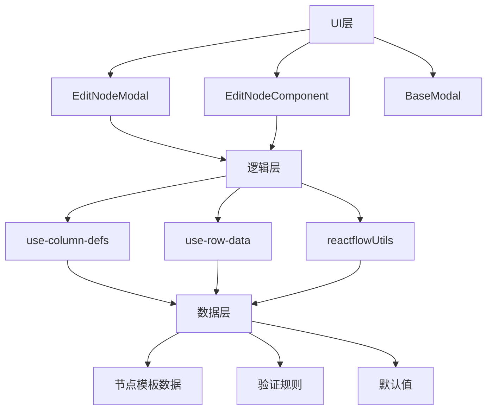
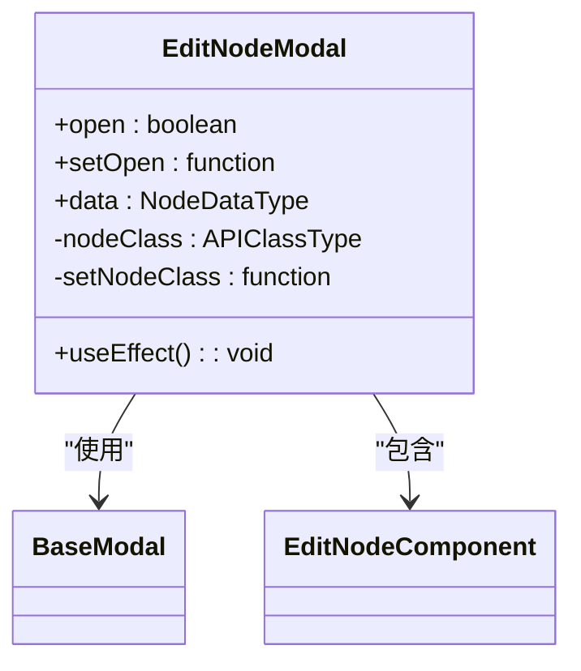
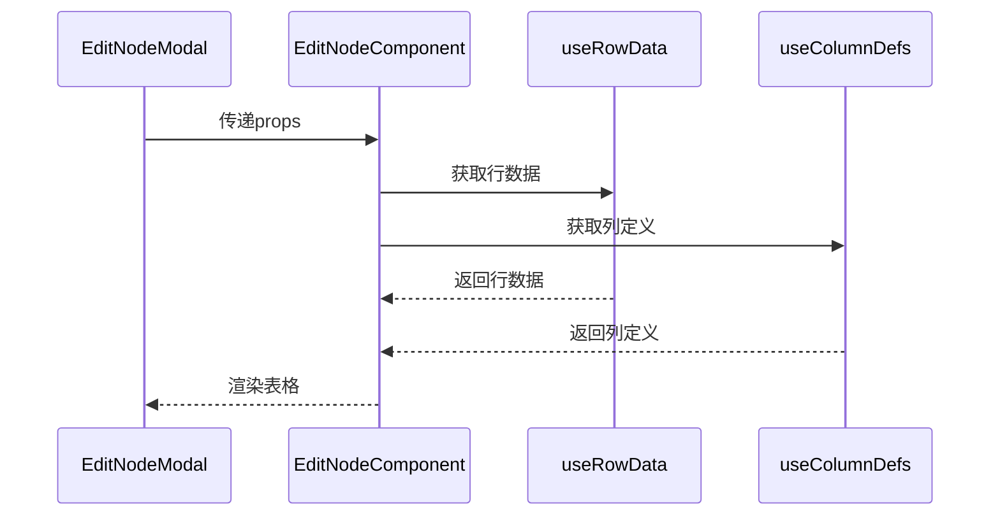
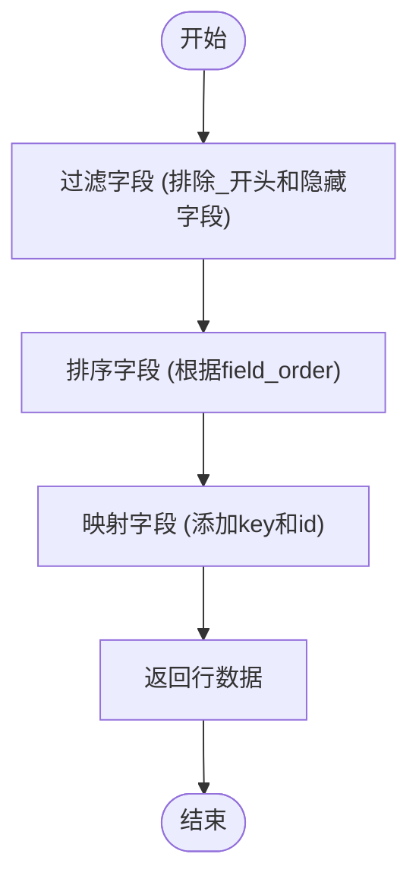
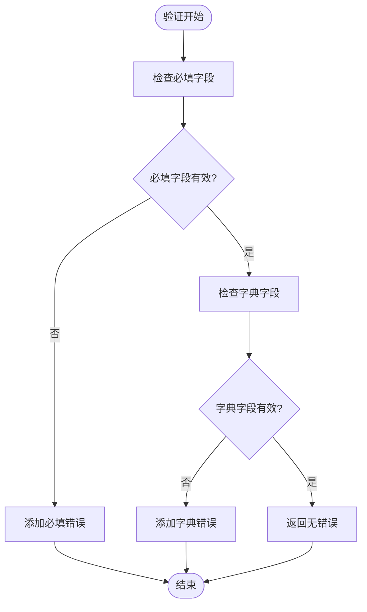
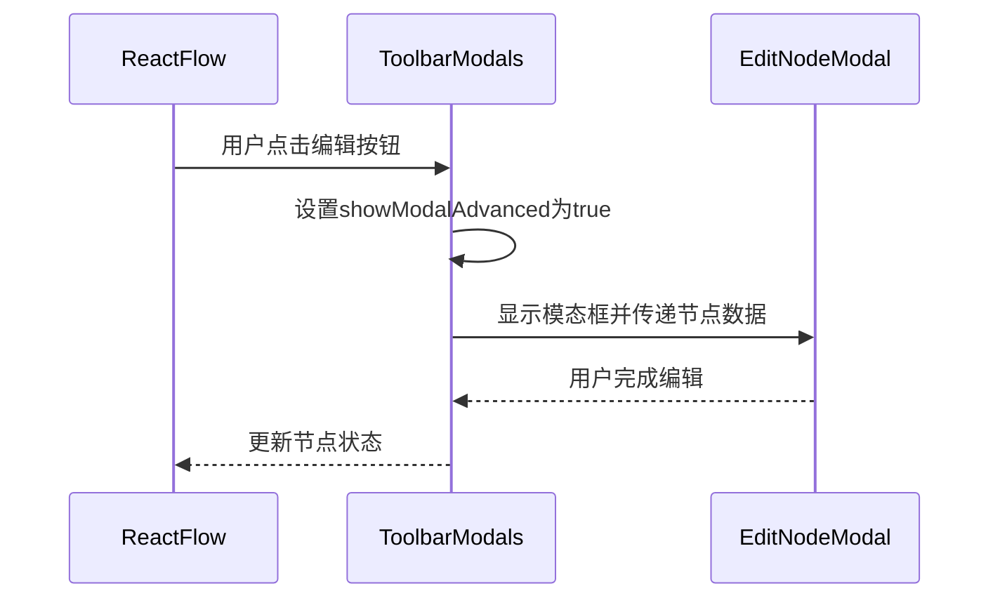
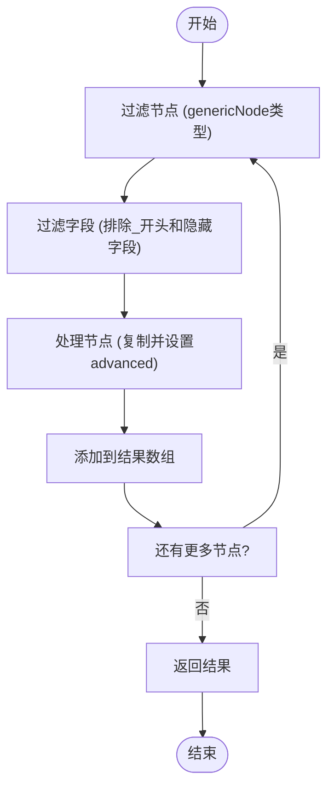

# 节点编辑模态框

<cite>
**本文档中引用的文件**  
- [editNodeModal/index.tsx](file://vibe_surf/frontend/src/modals/editNodeModal/index.tsx)
- [editNodeComponent/index.tsx](file://vibe_surf/frontend/src/modals/editNodeModal/components/editNodeComponent/index.tsx)
- [use-column-defs.ts](file://vibe_surf/frontend/src/modals/editNodeModal/hooks/use-column-defs.ts)
- [use-row-data.ts](file://vibe_surf/frontend/src/modals/editNodeModal/hooks/use-row-data.ts)
- [baseModal/index.tsx](file://vibe_surf/frontend/src/modals/baseModal/index.tsx)
- [reactflowUtils.ts](file://vibe_surf/frontend/src/utils/reactflowUtils.ts)
- [toolbar-modals.tsx](file://vibe_surf/frontend/src/pages/FlowPage/components/nodeToolbarComponent/components/toolbar-modals.tsx)
- [get-nodes-with-default-value.ts](file://vibe_surf/frontend/src/modals/apiModal/utils/get-nodes-with-default-value.ts)
- [NodeDialogComponent/index.tsx](file://vibe_surf/frontend/src/CustomNodes/GenericNode/components/NodeDialogComponent/index.tsx)
</cite>

## 目录
1. [简介](#简介)
2. [核心组件分析](#核心组件分析)
3. [架构概览](#架构概览)
4. [详细组件分析](#详细组件分析)
5. [动态表单渲染机制](#动态表单渲染机制)
6. [参数验证机制](#参数验证机制)
7. [变更检测逻辑](#变更检测逻辑)
8. [与ReactFlow图编辑器的集成](#与reactflow图编辑器的集成)
9. [不同节点类型的配置处理](#不同节点类型的配置处理)
10. [表单组件复用设计](#表单组件复用设计)
11. [状态管理策略](#状态管理策略)
12. [错误处理与用户体验优化](#错误处理与用户体验优化)
13. [结论](#结论)

## 简介
节点编辑模态框是VibeSurf工作流系统中的核心功能组件，为用户提供了一个直观的界面来配置和编辑工作流中的各个节点。该模态框实现了动态表单渲染、参数验证、变更检测等关键功能，并与ReactFlow图编辑器无缝集成。通过这个模态框，用户可以轻松地为不同类型的节点设置参数，管理配置，并实时查看验证结果。

**节点编辑模态框**的设计注重用户体验，提供了实时验证反馈、默认值处理等优化措施。它支持多种节点类型，能够根据节点的特定需求动态调整表单结构和验证规则。该组件采用模块化设计，通过复用表单组件和统一的状态管理策略，确保了代码的可维护性和扩展性。

## 核心组件分析
节点编辑模态框由多个核心组件构成，每个组件都有明确的职责和功能。这些组件协同工作，共同实现了节点配置编辑的完整功能。

**EditNodeModal** 是模态框的主组件，负责管理模态框的整体状态和生命周期。它接收节点数据作为输入，并根据数据动态渲染相应的编辑界面。该组件使用了状态管理钩子来跟踪节点类别的变化，并在必要时进行更新。

**EditNodeComponent** 是实际的编辑界面组件，它使用AG-Grid表格来展示和编辑节点参数。该组件通过自定义的列定义和行数据钩子，实现了灵活的表单渲染。它能够根据节点类型和配置需求，动态调整表格的列和行。

**BaseModal** 提供了模态框的基础结构和样式，包括头部、内容区域和底部操作栏。它支持多种尺寸和类型，为不同的使用场景提供了灵活性。

**Section sources**
- [editNodeModal/index.tsx](file://vibe_surf/frontend/src/modals/editNodeModal/index.tsx#L1-L60)
- [editNodeComponent/index.tsx](file://vibe_surf/frontend/src/modals/editNodeModal/components/editNodeComponent/index.tsx#L1-L51)
- [baseModal/index.tsx](file://vibe_surf/frontend/src/modals/baseModal/index.tsx#L1-L323)

## 架构概览
节点编辑模态框的架构设计遵循了现代前端应用的最佳实践，采用了组件化和模块化的思想。整个架构可以分为三个主要层次：UI层、逻辑层和数据层。

**Diagram sources**
- [editNodeModal/index.tsx](file://vibe_surf/frontend/src/modals/editNodeModal/index.tsx#L1-L60)
- [editNodeComponent/index.tsx](file://vibe_surf/frontend/src/modals/editNodeModal/components/editNodeComponent/index.tsx#L1-L51)
- [use-column-defs.ts](file://vibe_surf/frontend/src/modals/editNodeModal/hooks/use-column-defs.ts#L1-L93)
- [use-row-data.ts](file://vibe_surf/frontend/src/modals/editNodeModal/hooks/use-row-data.ts#L1-L34)
- [reactflowUtils.ts](file://vibe_surf/frontend/src/utils/reactflowUtils.ts#L626-L684)

## 详细组件分析
### EditNodeModal 分析
EditNodeModal 组件是节点编辑功能的入口点，负责管理模态框的显示状态和整体布局。它接收三个主要的props：open（控制模态框的显示/隐藏）、setOpen（用于更新显示状态）和data（包含要编辑的节点信息）。

该组件使用了useState和useEffect钩子来管理节点类别的状态。当节点数据发生变化时，useEffect会检查节点模板的键是否发生了变化，如果发生了变化，则更新节点类别状态。这种设计确保了模态框能够正确地响应节点配置的变化。

**Diagram sources**
- [editNodeModal/index.tsx](file://vibe_surf/frontend/src/modals/editNodeModal/index.tsx#L1-L60)

### EditNodeComponent 分析
EditNodeComponent 是实际的编辑界面，它使用了AG-Grid表格来展示和编辑节点参数。该组件通过useMemo优化了渲染性能，只有在节点类别发生变化时才会重新渲染。

组件接收多个props，包括open（模态框显示状态）、nodeId（节点ID）、nodeClass（节点类别）等。它使用两个自定义钩子：useRowData来获取表格的行数据，useColumnDefs来获取列定义。这种分离关注点的设计使得代码更加清晰和可维护。

**Diagram sources**
- [editNodeComponent/index.tsx](file://vibe_surf/frontend/src/modals/editNodeComponent/index.tsx#L1-L51)
- [use-row-data.ts](file://vibe_surf/frontend/src/modals/editNodeModal/hooks/use-row-data.ts#L1-L34)
- [use-column-defs.ts](file://vibe_surf/frontend/src/modals/editNodeModal/hooks/use-column-defs.ts#L1-L93)

## 动态表单渲染机制
节点编辑模态框的动态表单渲染机制是其核心功能之一。该机制能够根据节点的模板定义，自动生成相应的表单字段，为用户提供直观的配置界面。

### 表单结构生成
表单的结构由节点的模板数据决定。模板数据包含了每个参数的元信息，如名称、类型、是否必填、默认值等。EditNodeComponent组件通过遍历模板数据，为每个参数生成相应的表格行。

**Diagram sources**
- [use-row-data.ts](file://vibe_surf/frontend/src/modals/editNodeModal/hooks/use-row-data.ts#L5-L28)

### 列定义动态生成
列定义的生成由useColumnDefs钩子负责。该钩子根据节点的配置需求，动态生成表格的列定义。例如，当处于tweaks模式时，"Expose Input"列的标题会变为"Expose Input"，否则为"Show"。

列定义包括字段名称、描述、值获取器、单元格渲染器等属性。通过valueGetter，可以为每个单元格提供额外的上下文信息，如节点ID和参数ID，这对于后续的值更新操作至关重要。

**Section sources**
- [use-column-defs.ts](file://vibe_surf/frontend/src/modals/editNodeModal/hooks/use-column-defs.ts#L6-L87)
- [use-row-data.ts](file://vibe_surf/frontend/src/modals/editNodeModal/hooks/use-row-data.ts#L5-L28)

## 参数验证机制
节点编辑模态框实现了完善的参数验证机制，确保用户输入的数据符合预期要求。验证机制在多个层面进行，包括前端实时验证和后端构建时验证。

### 前端实时验证
前端验证主要通过reactflowUtils.ts文件中的validateNode和validateNodes函数实现。这些函数会检查节点的必填字段是否已填写，以及字典类型的字段是否存在重复键或空键。

**Diagram sources**
- [reactflowUtils.ts](file://vibe_surf/frontend/src/utils/reactflowUtils.ts#L626-L684)

### 验证规则配置
验证规则通过节点模板中的required属性来配置。当一个字段的required属性为true时，该字段将被视为必填字段。此外，对于字典类型的字段，还会额外检查键的唯一性和非空性。

验证函数会遍历模板中的所有字段，对每个字段应用相应的验证规则。验证结果以字符串数组的形式返回，每个字符串代表一个具体的验证错误。

**Section sources**
- [reactflowUtils.ts](file://vibe_surf/frontend/src/utils/reactflowUtils.ts#L626-L684)

## 变更检测逻辑
节点编辑模态框的变更检测逻辑确保了用户对节点配置的修改能够被正确地捕获和处理。这种机制对于维护工作流的一致性和可靠性至关重要。

### 状态同步
当用户在模态框中修改节点参数时，这些变更会通过事件回调传递给父组件。父组件负责将变更应用到全局状态中，确保整个应用的状态保持一致。

### 变更追踪
变更检测通过比较节点模板的键来实现。当节点数据发生变化时，useEffect会检查新旧模板的键是否相同。如果不同，则更新节点类别状态，触发界面重新渲染。

这种基于键的变更检测机制简单而有效，能够准确地识别出模板结构的变化，而不会对值的变化做出过度反应。

**Section sources**
- [editNodeModal/index.tsx](file://vibe_surf/frontend/src/modals/editNodeModal/index.tsx#L24-L31)

## 与ReactFlow图编辑器的集成
节点编辑模态框与ReactFlow图编辑器的集成是通过toolbar-modals.tsx文件实现的。该文件定义了工具栏中的各种模态框，包括节点编辑模态框。

### 集成方式
当用户在ReactFlow图中选择一个节点并点击编辑按钮时，toolbar-modals组件会将showModalAdvanced状态设置为true，从而显示EditNodeModal。同时，它会将选中节点的数据传递给模态框。

**Diagram sources**
- [toolbar-modals.tsx](file://vibe_surf/frontend/src/pages/FlowPage/components/nodeToolbarComponent/components/toolbar-modals.tsx#L79-L85)

### 数据传递
数据传递通过props实现。toolbar-modals组件将节点的data属性作为props传递给EditNodeModal。这个data属性包含了节点的所有配置信息，包括ID、类型、显示名称和模板数据。

这种基于props的数据传递方式简单直接，符合React的单向数据流原则，确保了数据的一致性和可预测性。

**Section sources**
- [toolbar-modals.tsx](file://vibe_surf/frontend/src/pages/FlowPage/components/nodeToolbarComponent/components/toolbar-modals.tsx#L79-L85)

## 不同节点类型的配置处理
节点编辑模态框能够处理不同节点类型的特定配置需求，这得益于其灵活的模板系统和动态渲染机制。

### 模板驱动的配置
每个节点类型都有自己的模板定义，这个模板定义了该节点支持的所有参数及其属性。当编辑不同类型的节点时，模态框会根据相应的模板动态生成表单。

### 高级字段处理
对于某些特殊类型的字段，如代码字段或代理字段，模态框会进行特殊处理。在use-row-data钩子中，会过滤掉以"code"开头且类型为"code"的字段，或者包含"code"且具有代理属性的字段。

这种过滤机制确保了敏感或复杂的字段不会在常规编辑界面中暴露，而是通过专门的编辑器进行处理。

**Section sources**
- [use-row-data.ts](file://vibe_surf/frontend/src/modals/editNodeModal/hooks/use-row-data.ts#L8-L17)

## 表单组件复用设计
节点编辑模态框采用了高度复用的表单组件设计，这不仅提高了开发效率，也保证了用户体验的一致性。

### TableComponent 复用
核心的表单渲染功能由TableComponent组件实现。这个组件被多个地方复用，包括节点编辑模态框、API模态框等。通过传递不同的列定义和行数据，TableComponent可以适应各种不同的使用场景。

### 单元格渲染器复用
单元格渲染器也被设计为可复用的组件。例如，TableNodeCellRender用于渲染参数值单元格，TableAdvancedToggleCellRender用于渲染高级选项切换单元格。这些渲染器可以在不同的表格中重复使用。

这种组件复用的设计模式遵循了DRY（Don't Repeat Yourself）原则，减少了代码冗余，提高了可维护性。

**Section sources**
- [editNodeComponent/index.tsx](file://vibe_surf/frontend/src/modals/editNodeModal/components/editNodeComponent/index.tsx#L36-L43)
- [use-column-defs.ts](file://vibe_surf/frontend/src/modals/editNodeModal/hooks/use-column-defs.ts#L44-L65)

## 状态管理策略
节点编辑模态框采用了基于React Hooks的状态管理策略，结合了全局状态和局部状态的优势。

### 全局状态管理
节点的整体状态由useFlowStore管理，这是一个基于Zustand的状态管理库。这个全局状态存储了所有节点的信息，确保了数据的一致性和共享性。

### 局部状态管理
模态框自身的状态，如显示状态和节点类别，由useState管理。这种局部状态管理适用于组件内部的临时状态，避免了不必要的全局状态污染。

### 状态同步
当用户在模态框中修改节点配置时，会通过setNode等函数将变更同步到全局状态。这种同步机制确保了用户界面和应用状态的一致性。

**Section sources**
- [editNodeModal/index.tsx](file://vibe_surf/frontend/src/modals/editNodeModal/index.tsx#L22-L31)
- [reactflowUtils.ts](file://vibe_surf/frontend/src/utils/reactflowUtils.ts#L703-L706)

## 错误处理与用户体验优化
节点编辑模态框在错误处理和用户体验优化方面做了大量工作，确保用户能够顺畅地完成节点配置。

### 实时验证反馈
通过validateNode函数，模态框能够在用户编辑时实时检查配置的有效性。当发现错误时，会以清晰的方式向用户反馈，帮助用户快速定位和解决问题。

### 默认值处理
对于有默认值的字段，模态框会自动填充默认值，减少用户的输入负担。在get-nodes-with-default-value.ts文件中，可以看到如何处理节点的默认值。

**Diagram sources**
- [get-nodes-with-default-value.ts](file://vibe_surf/frontend/src/modals/apiModal/utils/get-nodes-with-default-value.ts#L13-L38)

### 用户体验优化
模态框还提供了多种用户体验优化措施，如：
- 使用useMemo优化渲染性能
- 提供清晰的字段名称和描述
- 支持键盘快捷键操作
- 实现平滑的动画效果

这些优化措施共同提升了用户的操作效率和满意度。

**Section sources**
- [get-nodes-with-default-value.ts](file://vibe_surf/frontend/src/modals/apiModal/utils/get-nodes-with-default-value.ts#L5-L38)
- [reactflowUtils.ts](file://vibe_surf/frontend/src/utils/reactflowUtils.ts#L626-L684)

## 结论
节点编辑模态框是VibeSurf工作流系统中的关键组件，它通过动态表单渲染、参数验证、变更检测等机制，为用户提供了一个强大而直观的节点配置界面。该组件与ReactFlow图编辑器紧密集成，支持多种节点类型的特定配置需求。

通过采用模块化设计、组件复用和合理的状态管理策略，节点编辑模态框实现了高内聚、低耦合的架构。其完善的错误处理和用户体验优化措施，确保了用户能够高效地完成工作流的配置和编辑。

未来可以进一步优化的方向包括：增强验证规则的可配置性、提供更丰富的字段类型支持、优化大规模节点场景下的性能表现等。这些改进将进一步提升节点编辑模态框的功能和用户体验。