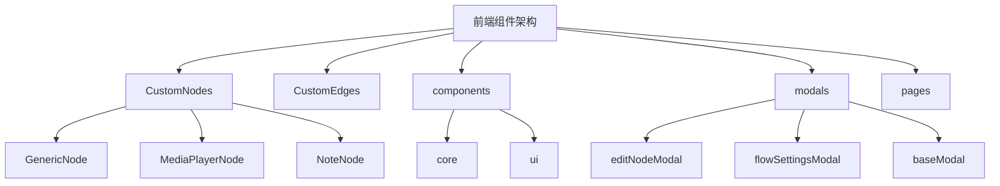
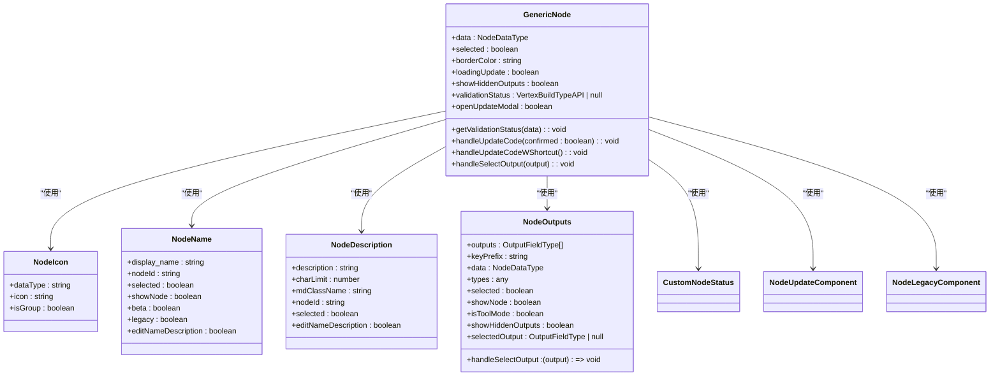
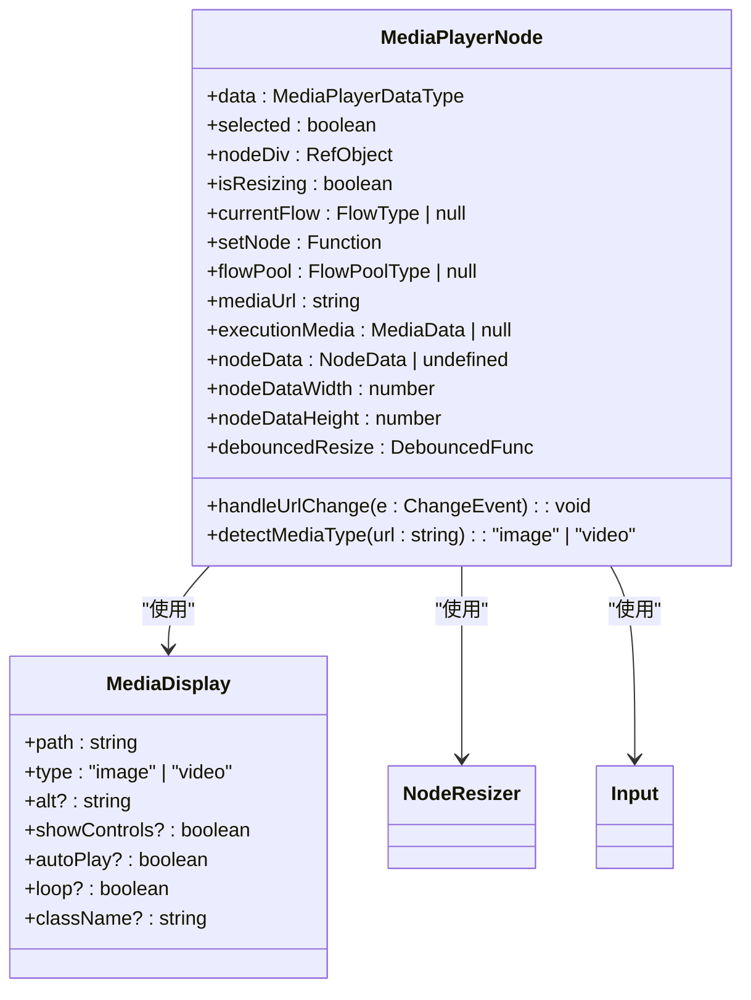
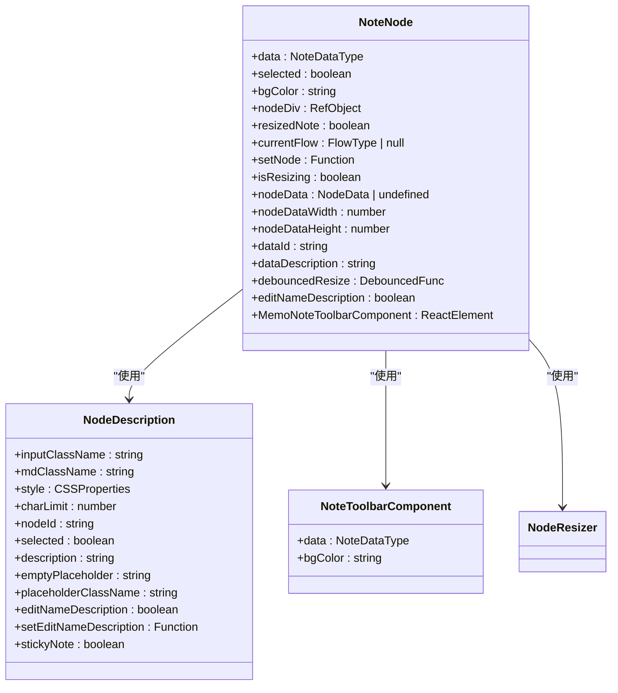
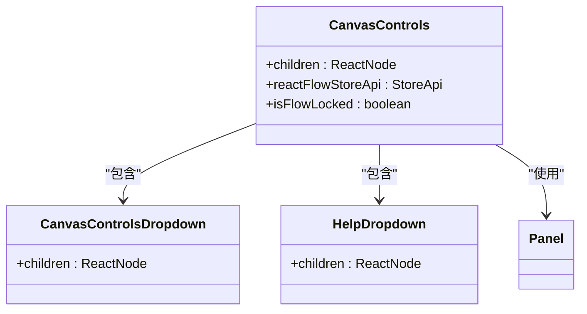
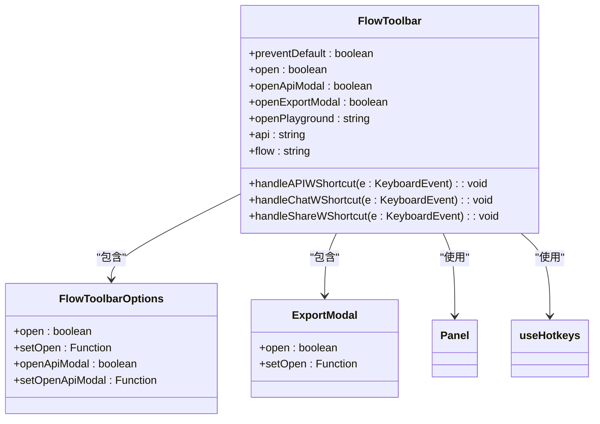
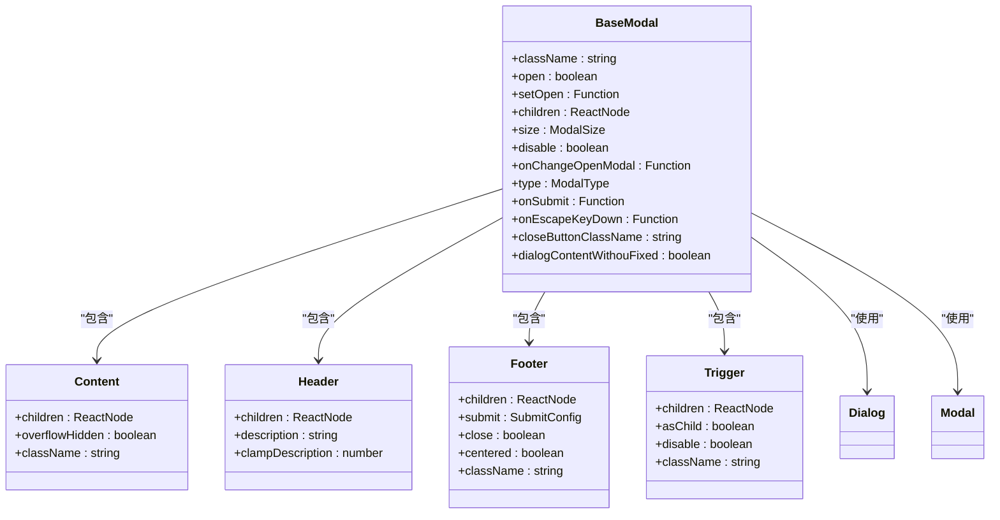
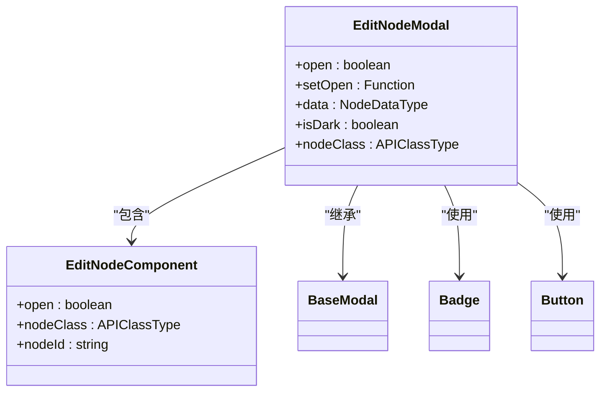
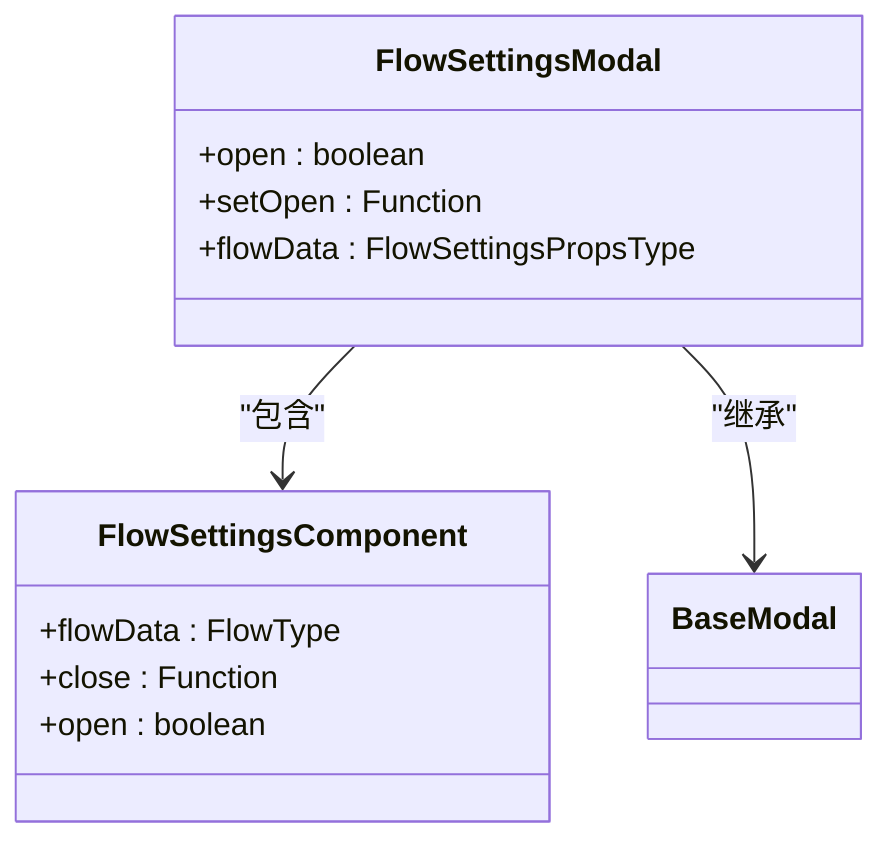

# 组件架构

<cite>
**本文档引用的文件**   
- [index.tsx](file://vibe_surf/frontend/src/CustomEdges/index.tsx)
- [GenericNode/index.tsx](file://vibe_surf/frontend/src/CustomNodes/GenericNode/index.tsx)
- [MediaPlayerNode/index.tsx](file://vibe_surf/frontend/src/CustomNodes/MediaPlayerNode/index.tsx)
- [NoteNode/index.tsx](file://vibe_surf/frontend/src/CustomNodes/NoteNode/index.tsx)
- [flowToolbarComponent/index.tsx](file://vibe_surf/frontend/src/components/core/flowToolbarComponent/index.tsx)
- [canvasControlsComponent/CanvasControls.tsx](file://vibe_surf/frontend/src/components/core/canvasControlsComponent/CanvasControls.tsx)
- [editNodeModal/index.tsx](file://vibe_surf/frontend/src/modals/editNodeModal/index.tsx)
- [flowSettingsModal/index.tsx](file://vibe_surf/frontend/src/modals/flowSettingsModal/index.tsx)
- [baseModal/index.tsx](file://vibe_surf/frontend/src/modals/baseModal/index.tsx)
</cite>

## 目录
1. [项目结构](#项目结构)
2. [核心组件架构](#核心组件架构)
3. [自定义节点实现机制](#自定义节点实现机制)
4. [核心UI组件分析](#核心ui组件分析)
5. [模态框系统架构](#模态框系统架构)
6. [组件复用与样式方案](#组件复用与样式方案)

## 项目结构

VibeSurf前端组件架构主要围绕`CustomNodes`、`CustomEdges`、`components`、`modals`和`pages`等核心目录组织。这些目录分别负责自定义节点、边线、通用UI组件、模态框和页面路由的实现。

**Diagram sources**
- [vibe_surf/frontend/src/CustomNodes](file://vibe_surf/frontend/src/CustomNodes)
- [vibe_surf/frontend/src/components](file://vibe_surf/frontend/src/components)
- [vibe_surf/frontend/src/modals](file://vibe_surf/frontend/src/modals)

**Section sources**
- [vibe_surf/frontend/src/CustomNodes](file://vibe_surf/frontend/src/CustomNodes)
- [vibe_surf/frontend/src/CustomEdges](file://vibe_surf/frontend/src/CustomEdges)
- [vibe_surf/frontend/src/components](file://vibe_surf/frontend/src/components)
- [vibe_surf/frontend/src/modals](file://vibe_surf/frontend/src/modals)
- [vibe_surf/frontend/src/pages](file://vibe_surf/frontend/src/pages)

## 核心组件架构

VibeSurf前端采用模块化架构设计，将不同功能的组件分离到独立的目录中。这种设计提高了代码的可维护性和可扩展性，使得开发人员可以专注于特定功能的开发。

核心架构特点包括：
- **组件化设计**：每个功能模块都被封装为独立的组件
- **状态管理**：使用Zustand进行全局状态管理
- **响应式布局**：基于React Flow实现可视化工作流
- **可扩展性**：提供清晰的扩展接口和钩子函数

**Section sources**
- [vibe_surf/frontend/src/components](file://vibe_surf/frontend/src/components)

## 自定义节点实现机制

### GenericNode实现

GenericNode是VibeSurf中最基础的节点组件，它提供了通用的节点功能和扩展接口。该组件通过组合多个子组件来实现复杂的功能。

**Diagram sources**
- [vibe_surf/frontend/src/CustomNodes/GenericNode/index.tsx](file://vibe_surf/frontend/src/CustomNodes/GenericNode/index.tsx)
- [vibe_surf/frontend/src/CustomNodes/GenericNode/components/NodeIcon/index.tsx](file://vibe_surf/frontend/src/CustomNodes/GenericNode/components/nodeIcon/index.tsx)
- [vibe_surf/frontend/src/CustomNodes/GenericNode/components/NodeName/index.tsx](file://vibe_surf/frontend/src/CustomNodes/GenericNode/components/NodeName/index.tsx)
- [vibe_surf/frontend/src/CustomNodes/GenericNode/components/NodeDescription/index.tsx](file://vibe_surf/frontend/src/CustomNodes/GenericNode/components/NodeDescription/index.tsx)
- [vibe_surf/frontend/src/CustomNodes/GenericNode/components/NodeOutputParameter/NodeOutputs.tsx](file://vibe_surf/frontend/src/CustomNodes/GenericNode/components/NodeOutputParameter/NodeOutputs.tsx)

**Section sources**
- [vibe_surf/frontend/src/CustomNodes/GenericNode/index.tsx](file://vibe_surf/frontend/src/CustomNodes/GenericNode/index.tsx)

### MediaPlayerNode实现

MediaPlayerNode是一个专门用于媒体播放的自定义节点，支持图像和视频的显示和播放控制。

**Diagram sources**
- [vibe_surf/frontend/src/CustomNodes/MediaPlayerNode/index.tsx](file://vibe_surf/frontend/src/CustomNodes/MediaPlayerNode/index.tsx)
- [vibe_surf/frontend/src/components/MediaDisplay.tsx](file://vibe_surf/frontend/src/components/MediaDisplay.tsx)

**Section sources**
- [vibe_surf/frontend/src/CustomNodes/MediaPlayerNode/index.tsx](file://vibe_surf/frontend/src/CustomNodes/MediaPlayerNode/index.tsx)

### NoteNode实现

NoteNode是一个便签式节点，允许用户在工作流中添加和编辑文本内容。

**Diagram sources**
- [vibe_surf/frontend/src/CustomNodes/NoteNode/index.tsx](file://vibe_surf/frontend/src/CustomNodes/NoteNode/index.tsx)
- [vibe_surf/frontend/src/CustomNodes/GenericNode/components/NodeDescription/index.tsx](file://vibe_surf/frontend/src/CustomNodes/GenericNode/components/NodeDescription/index.tsx)
- [vibe_surf/frontend/src/CustomNodes/NoteNode/NoteToolbarComponent/index.tsx](file://vibe_surf/frontend/src/CustomNodes/NoteNode/NoteToolbarComponent/index.tsx)

**Section sources**
- [vibe_surf/frontend/src/CustomNodes/NoteNode/index.tsx](file://vibe_surf/frontend/src/CustomNodes/NoteNode/index.tsx)

## 核心UI组件分析

### canvasControlsComponent

canvasControlsComponent提供了画布的基本控制功能，包括缩放、重置视图和帮助菜单。

**Diagram sources**
- [vibe_surf/frontend/src/components/core/canvasControlsComponent/CanvasControls.tsx](file://vibe_surf/frontend/src/components/core/canvasControlsComponent/CanvasControls.tsx)
- [vibe_surf/frontend/src/components/core/canvasControlsComponent/CanvasControlsDropdown.tsx](file://vibe_surf/frontend/src/components/core/canvasControlsComponent/CanvasControlsDropdown.tsx)
- [vibe_surf/frontend/src/components/core/canvasControlsComponent/HelpDropdown.tsx](file://vibe_surf/frontend/src/components/core/canvasControlsComponent/HelpDropdown.tsx)

**Section sources**
- [vibe_surf/frontend/src/components/core/canvasControlsComponent/CanvasControls.tsx](file://vibe_surf/frontend/src/components/core/canvasControlsComponent/CanvasControls.tsx)

### flowToolbarComponent

flowToolbarComponent实现了工作流工具栏，提供API访问、分享和导出功能。

**Diagram sources**
- [vibe_surf/frontend/src/components/core/flowToolbarComponent/index.tsx](file://vibe_surf/frontend/src/components/core/flowToolbarComponent/index.tsx)
- [vibe_surf/frontend/src/components/core/flowToolbarComponent/components/flow-toolbar-options](file://vibe_surf/frontend/src/components/core/flowToolbarComponent/components/flow-toolbar-options)
- [vibe_surf/frontend/src/modals/exportModal](file://vibe_surf/frontend/src/modals/exportModal)

**Section sources**
- [vibe_surf/frontend/src/components/core/flowToolbarComponent/index.tsx](file://vibe_surf/frontend/src/components/core/flowToolbarComponent/index.tsx)

## 模态框系统架构

### baseModal

baseModal是所有模态框的基础组件，提供了统一的模态框结构和样式。

**Diagram sources**
- [vibe_surf/frontend/src/modals/baseModal/index.tsx](file://vibe_surf/frontend/src/modals/baseModal/index.tsx)
- [vibe_surf/frontend/src/components/ui/dialog.tsx](file://vibe_surf/frontend/src/components/ui/dialog.tsx)
- [vibe_surf/frontend/src/components/ui/dialog-with-no-close.tsx](file://vibe_surf/frontend/src/components/ui/dialog-with-no-close.tsx)

**Section sources**
- [vibe_surf/frontend/src/modals/baseModal/index.tsx](file://vibe_surf/frontend/src/modals/baseModal/index.tsx)

### editNodeModal

editNodeModal用于编辑节点属性，继承自baseModal并添加了节点编辑功能。

**Diagram sources**
- [vibe_surf/frontend/src/modals/editNodeModal/index.tsx](file://vibe_surf/frontend/src/modals/editNodeModal/index.tsx)
- [vibe_surf/frontend/src/modals/editNodeModal/components/editNodeComponent/index.tsx](file://vibe_surf/frontend/src/modals/editNodeModal/components/editNodeComponent/index.tsx)
- [vibe_surf/frontend/src/components/ui/badge.tsx](file://vibe_surf/frontend/src/components/ui/badge.tsx)
- [vibe_surf/frontend/src/components/ui/button.tsx](file://vibe_surf/frontend/src/components/ui/button.tsx)

**Section sources**
- [vibe_surf/frontend/src/modals/editNodeModal/index.tsx](file://vibe_surf/frontend/src/modals/editNodeModal/index.tsx)

### flowSettingsModal

flowSettingsModal用于显示和编辑工作流设置，同样基于baseModal构建。

**Diagram sources**
- [vibe_surf/frontend/src/modals/flowSettingsModal/index.tsx](file://vibe_surf/frontend/src/modals/flowSettingsModal/index.tsx)
- [vibe_surf/frontend/src/components/core/flowSettingsComponent/index.tsx](file://vibe_surf/frontend/src/components/core/flowSettingsComponent/index.tsx)

**Section sources**
- [vibe_surf/frontend/src/modals/flowSettingsModal/index.tsx](file://vibe_surf/frontend/src/modals/flowSettingsModal/index.tsx)

## 组件复用与样式方案

### 组件复用模式

VibeSurf采用了多种组件复用模式：

1. **高阶组件模式**：通过memo包装组件提高性能
2. **组合模式**：将复杂组件拆分为多个子组件
3. **钩子模式**：使用自定义钩子封装可复用逻辑
4. **继承模式**：基础模态框被多个特定模态框继承

### 样式隔离方案

样式隔离通过以下方式实现：

1. **CSS Modules**：使用CSS模块避免样式冲突
2. **Tailwind CSS**：采用实用类系统减少CSS文件大小
3. **Scoped Styles**：组件样式作用域限制在组件内部
4. **BEM命名**：使用BEM命名约定提高样式可读性

### 可访问性实现

可访问性通过以下方式实现：

1. **ARIA标签**：为交互元素添加适当的ARIA属性
2. **键盘导航**：支持键盘操作和快捷键
3. **语义化HTML**：使用正确的HTML元素
4. **对比度检查**：确保文本与背景有足够的对比度

**Section sources**
- [vibe_surf/frontend/src/components](file://vibe_surf/frontend/src/components)
- [vibe_surf/frontend/src/modals](file://vibe_surf/frontend/src/modals)
- [vibe_surf/frontend/src/CustomNodes](file://vibe_surf/frontend/src/CustomNodes)