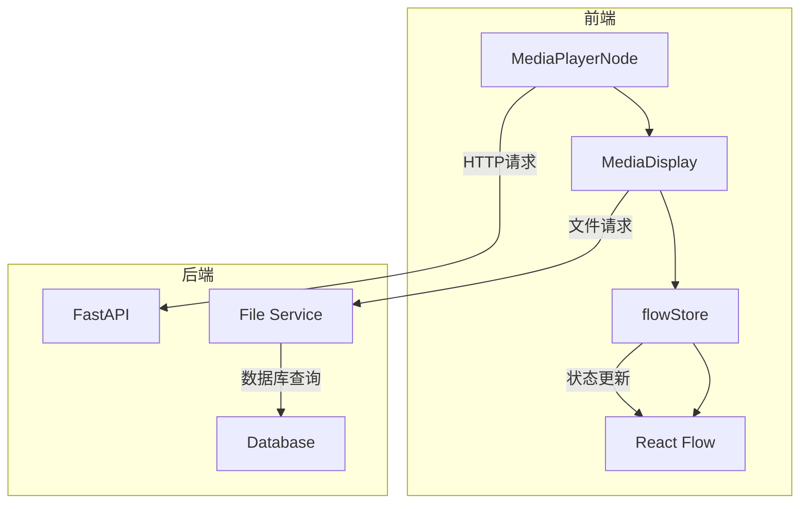
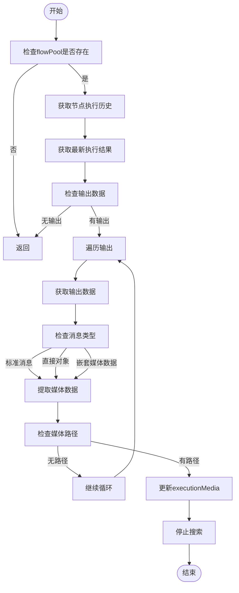
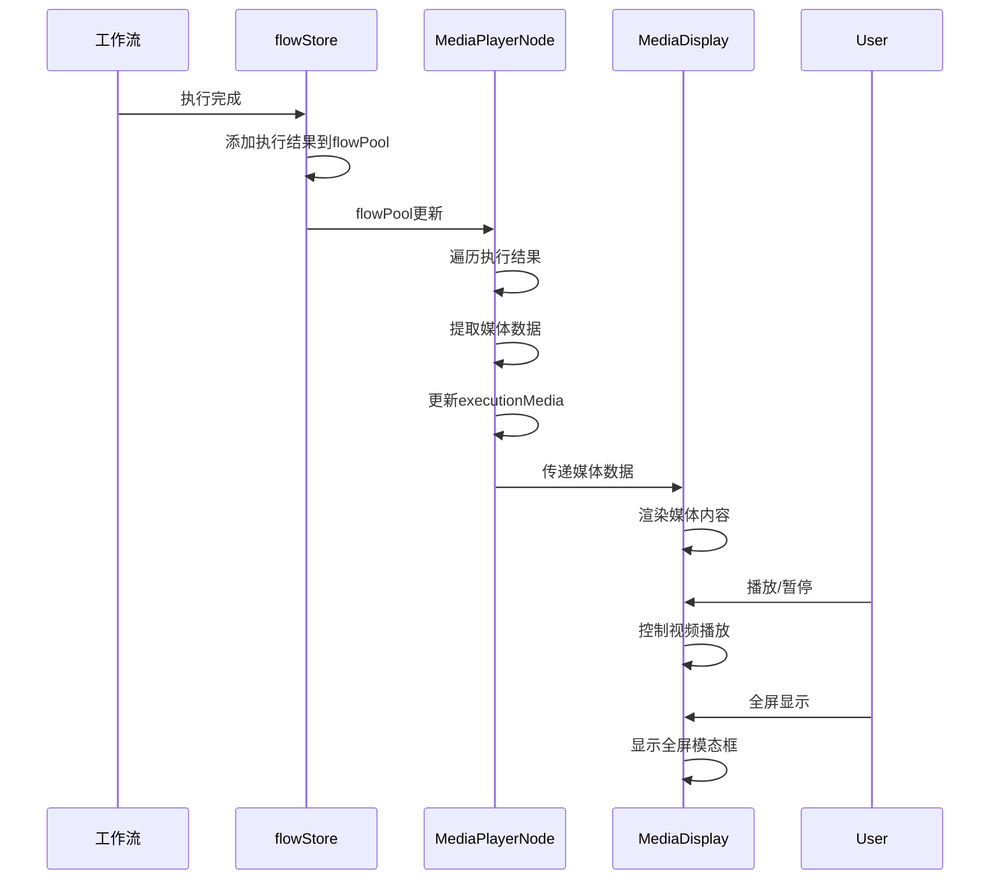

# 媒体播放节点

<cite>
**本文档引用的文件**   
- [index.tsx](file://vibe_surf/frontend/src/CustomNodes/MediaPlayerNode/index.tsx)
- [MediaDisplay.tsx](file://vibe_surf/frontend/src/components/MediaDisplay.tsx)
- [flowStore.ts](file://vibe_surf/frontend/src/stores/flowStore.ts)
- [flow/index.ts](file://vibe_surf/frontend/src/types/flow/index.ts)
- [vibesurf.py](file://vibe_surf/backend/api/vibesurf.py)
- [files.py](file://vibe_surf/backend/api/files.py)
</cite>

## 目录
1. [简介](#简介)
2. [核心组件](#核心组件)
3. [架构概述](#架构概述)
4. [详细组件分析](#详细组件分析)
5. [数据流与事件处理](#数据流与事件处理)
6. [配置选项与支持格式](#配置选项与支持格式)
7. [性能优化建议](#性能优化建议)
8. [扩展媒体播放功能](#扩展媒体播放功能)

## 简介
媒体播放节点是VibeSurf系统中的一个关键组件，用于在工作流中集成和展示音频/视频资源。该节点提供了一个直观的用户界面，允许用户通过输入URL或运行工作流来加载和播放媒体内容。媒体播放节点不仅支持手动输入媒体链接，还能自动从工作流执行结果中提取媒体数据并进行渲染。节点具备完整的播放控制功能，包括播放/暂停、音量调节、全屏显示和下载等。此外，节点还支持图像的缩放、旋转和重置等交互操作，为用户提供丰富的媒体体验。

## 核心组件
媒体播放节点由多个核心组件构成，包括MediaPlayerNode、MediaDisplay和flowStore。MediaPlayerNode是主要的UI组件，负责节点的布局和用户交互。它包含一个URL输入框，允许用户手动输入媒体链接，并能根据工作流执行结果自动更新显示内容。MediaDisplay组件是媒体渲染的核心，支持图像和视频两种类型，提供播放控制、全屏显示和下载功能。flowStore是状态管理组件，负责管理工作流的执行状态和数据流，使媒体播放节点能够实时响应工作流的执行结果。

**Section sources**
- [index.tsx](file://vibe_surf/frontend/src/CustomNodes/MediaPlayerNode/index.tsx#L1-L234)
- [MediaDisplay.tsx](file://vibe_surf/frontend/src/components/MediaDisplay.tsx#L1-L348)
- [flowStore.ts](file://vibe_surf/frontend/src/stores/flowStore.ts#L1-L1101)

## 架构概述
媒体播放节点采用分层架构设计，前端组件与后端服务通过API进行通信。前端使用React和TypeScript构建，利用Zustand进行状态管理，通过React Flow实现节点图的可视化。媒体播放节点通过监听flowPool状态来获取工作流执行结果，并从中提取媒体数据进行渲染。当媒体路径为本地文件时，前端通过/api/vibesurf/serve接口从后端获取文件。后端使用FastAPI框架，提供文件服务和API接口，确保文件访问的安全性。



**Diagram sources**
- [index.tsx](file://vibe_surf/frontend/src/CustomNodes/MediaPlayerNode/index.tsx#L1-L234)
- [MediaDisplay.tsx](file://vibe_surf/frontend/src/components/MediaDisplay.tsx#L1-L348)
- [flowStore.ts](file://vibe_surf/frontend/src/stores/flowStore.ts#L1-L1101)
- [vibesurf.py](file://vibe_surf/backend/api/vibesurf.py#L587-L613)
- [files.py](file://vibe_surf/backend/api/files.py#L1-L332)

## 详细组件分析

### MediaPlayerNode分析
MediaPlayerNode是媒体播放节点的主要实现，负责处理用户输入和工作流执行结果。节点通过useFlowStore钩子订阅当前工作流状态和执行结果，当工作流执行完成时，会自动从执行历史中提取媒体数据并更新显示。节点支持手动输入媒体URL，通过detectMediaType函数自动识别媒体类型。节点大小可调整，通过NodeResizer组件实现，调整后的尺寸会通过debouncedResize函数异步保存。

**Section sources**
- [index.tsx](file://vibe_surf/frontend/src/CustomNodes/MediaPlayerNode/index.tsx#L1-L234)

### MediaDisplay分析
MediaDisplay组件负责媒体内容的渲染和用户交互。对于图像，组件提供缩放、旋转和重置功能，支持全屏查看和下载。对于视频，组件提供播放/暂停、音量调节、全屏显示和下载功能。组件通过mediaSrc变量确定媒体源，如果路径是完整URL则直接使用，否则通过/api/vibesurf/serve接口获取。视频播放状态通过videoRef引用进行控制，播放/暂停、静音/取消静音操作直接调用HTML5视频元素的方法。

```mermaid
classDiagram
class MediaDisplay {
+mediaSrc : string
+isZoomed : boolean
+isPlaying : boolean
+isMuted : boolean
+volume : number
+imageZoom : number
+imageRotation : number
+videoRef : RefObject
+handleDownload() : void
+handleFullscreen() : void
+handleZoomIn() : void
+handleZoomOut() : void
+handleRotate() : void
+resetImageTransform() : void
+togglePlayPause() : void
+toggleMute() : void
+handleVolumeChange(e : ChangeEvent) : void
}
MediaDisplay --> "1" "1" MediaPlayerNode
```

**Diagram sources**
- [MediaDisplay.tsx](file://vibe_surf/frontend/src/components/MediaDisplay.tsx#L1-L348)

### flowStore分析
flowStore是全局状态管理器，负责管理工作流的状态和数据流。flowPool是关键状态之一，存储了各个节点的执行历史。媒体播放节点通过监听flowPool来获取最新的执行结果。addDataToFlowPool和updateFlowPool函数用于向flowPool添加和更新数据。setFlowPool函数用于重置flowPool状态。flowStore还管理节点、边、构建状态等信息，为整个工作流提供统一的状态管理。



**Diagram sources**
- [flowStore.ts](file://vibe_surf/frontend/src/stores/flowStore.ts#L1-L1101)

## 数据流与事件处理
媒体播放节点的数据流始于工作流执行，当工作流运行时，相关节点的执行结果会被添加到flowPool中。媒体播放节点通过useEffect钩子监听flowPool的变化，当检测到新的执行结果时，会遍历输出数据寻找媒体信息。媒体信息可能以多种格式存在，包括标准消息、直接对象或嵌套媒体数据。一旦找到有效的媒体数据，节点会更新executionMedia状态，触发UI重新渲染。用户交互事件如播放/暂停、音量调节等通过相应的事件处理函数直接操作DOM元素。



**Diagram sources**
- [flowStore.ts](file://vibe_surf/frontend/src/stores/flowStore.ts#L1-L1101)
- [index.tsx](file://vibe_surf/frontend/src/CustomNodes/MediaPlayerNode/index.tsx#L1-L234)
- [MediaDisplay.tsx](file://vibe_surf/frontend/src/components/MediaDisplay.tsx#L1-L348)

## 配置选项与支持格式
媒体播放节点支持多种配置选项和媒体格式。节点尺寸可在400x300到800x600之间调整。支持的图像格式包括JPG、JPEG、PNG、GIF、BMP、WEBP和SVG。支持的视频格式包括MP4、AVI、MOV、WMV、WEBM和MKV。媒体数据通过JSON对象传递，包含path、type、alt、showControls、autoPlay和loop等属性。节点自动检测URL的媒体类型，用户也可以通过手动输入URL来加载媒体内容。

**Section sources**
- [index.tsx](file://vibe_surf/frontend/src/CustomNodes/MediaPlayerNode/index.tsx#L123-L138)
- [MediaDisplay.tsx](file://vibe_surf/frontend/src/components/MediaDisplay.tsx#L6-L14)

## 性能优化建议
为优化媒体播放节点的性能，建议采取以下措施：使用debounce技术减少频繁的状态更新，避免不必要的重新渲染；对大尺寸媒体文件进行适当的压缩和优化；利用浏览器缓存机制减少重复的网络请求；在全屏模式下释放非必要的资源；对长时间运行的工作流进行分批处理，避免一次性加载过多数据；使用懒加载技术，仅在媒体可见时才加载和渲染。

## 扩展媒体播放功能
要扩展媒体播放功能以支持更多媒体类型，可以通过修改MediaDisplay组件的type属性定义和媒体源构造逻辑来实现。例如，添加对音频文件的支持，可以增加"audio"类型，并使用HTML5音频元素进行播放。对于流媒体支持，可以集成第三方播放器库如Video.js或Hls.js。通过插件化设计，可以动态加载不同类型的媒体处理器，实现灵活的媒体类型扩展。

**Section sources**
- [MediaDisplay.tsx](file://vibe_surf/frontend/src/components/MediaDisplay.tsx#L8-L9)
- [index.tsx](file://vibe_surf/frontend/src/CustomNodes/MediaPlayerNode/index.tsx#L31-L37)