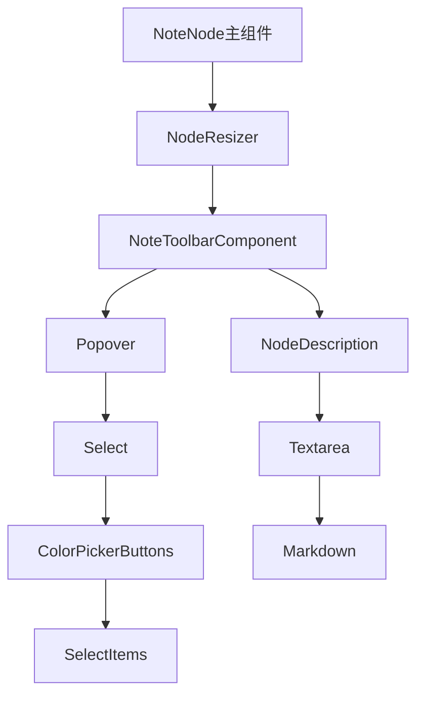
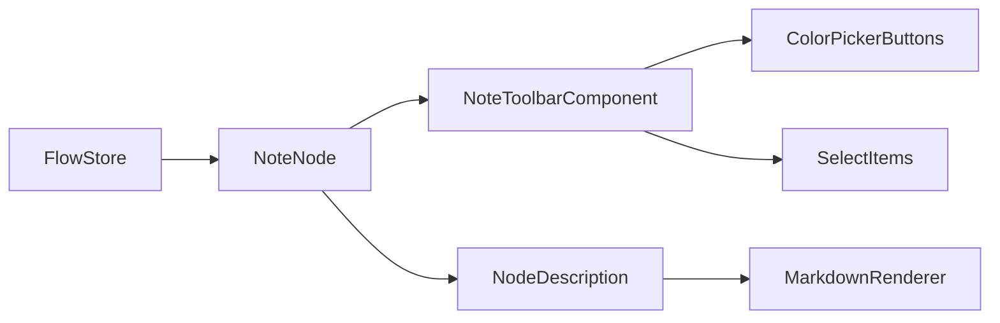
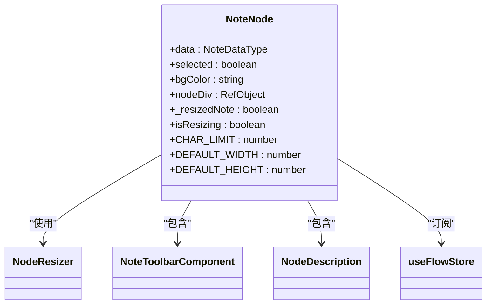
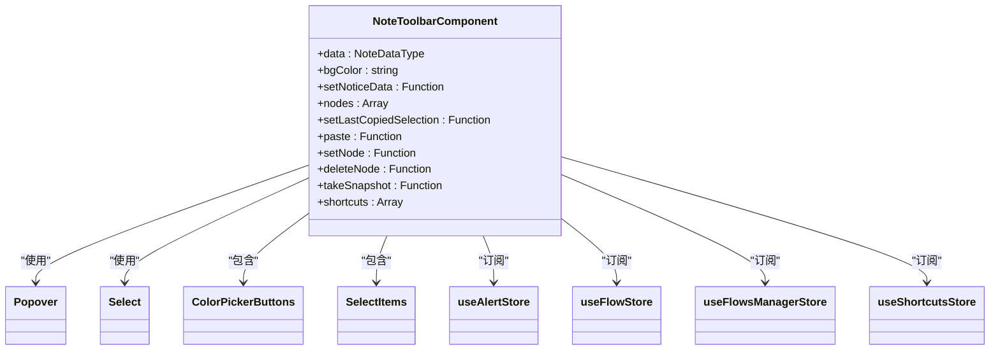
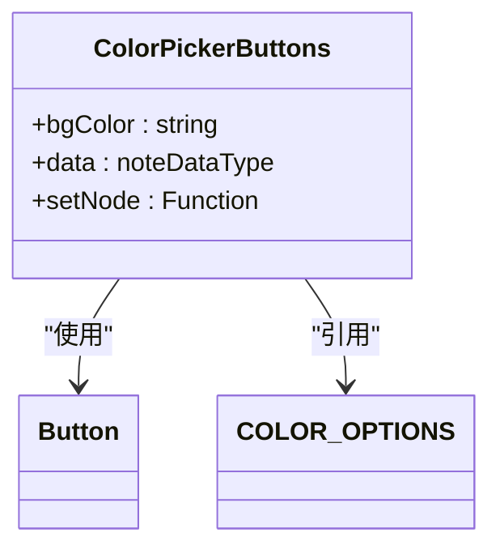
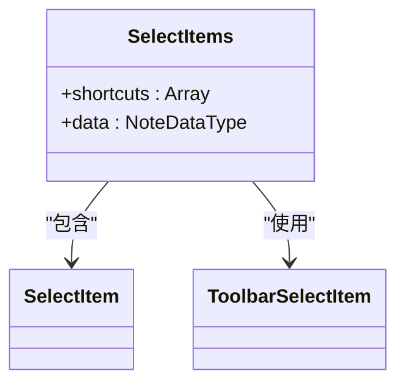
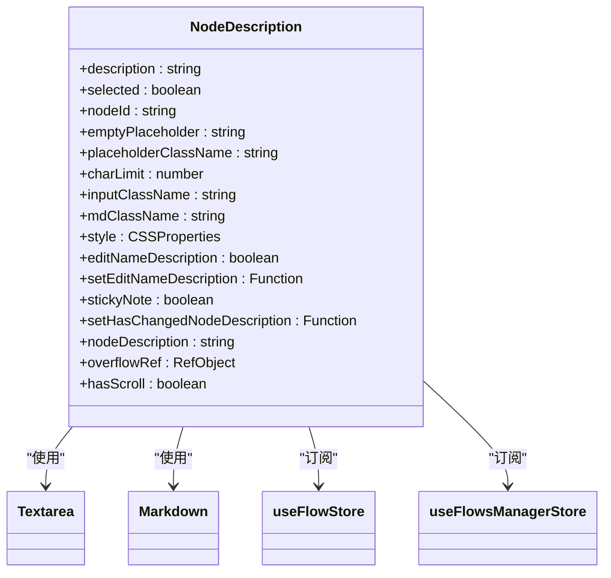

# 笔记节点

<cite>
**本文档中引用的文件**  
- [index.tsx](file://vibe_surf/frontend/src/CustomNodes/NoteNode/index.tsx)
- [NoteToolbarComponent/index.tsx](file://vibe_surf/frontend/src/CustomNodes/NoteNode/NoteToolbarComponent/index.tsx)
- [color-picker-buttons.tsx](file://vibe_surf/frontend/src/CustomNodes/NoteNode/components/color-picker-buttons.tsx)
- [select-items.tsx](file://vibe_surf/frontend/src/CustomNodes/NoteNode/components/select-items.tsx)
- [NodeDescription/index.tsx](file://vibe_surf/frontend/src/CustomNodes/GenericNode/components/NodeDescription/index.tsx)
- [constants.ts](file://vibe_surf/frontend/src/constants/constants.ts)
- [flow/index.ts](file://vibe_surf/frontend/src/types/flow/index.ts)
</cite>

## 目录
1. [简介](#简介)
2. [项目结构](#项目结构)
3. [核心组件](#核心组件)
4. [架构概述](#架构概述)
5. [详细组件分析](#详细组件分析)
6. [依赖分析](#依赖分析)
7. [性能考虑](#性能考虑)
8. [故障排除指南](#故障排除指南)
9. [结论](#结论)

## 简介
笔记节点是VibeSurf前端系统中的一个核心UI组件，用于提供富文本编辑功能和视觉化笔记管理。该组件支持Markdown格式的文本编辑、颜色主题选择和多种编辑操作，为用户提供了一个直观的笔记创建和管理界面。笔记节点通过React Flow框架集成到可视化工作流中，允许用户在画布上自由放置和调整笔记大小。

**Section sources**
- [index.tsx](file://vibe_surf/frontend/src/CustomNodes/NoteNode/index.tsx)

## 项目结构
笔记节点组件位于前端源码的CustomNodes目录下，采用模块化设计，将不同功能分离到独立的子组件中。组件结构清晰，主要分为NoteNode主组件、NoteToolbarComponent工具栏组件以及相关的辅助组件。



**Diagram sources**
- [index.tsx](file://vibe_surf/frontend/src/CustomNodes/NoteNode/index.tsx)
- [NoteToolbarComponent/index.tsx](file://vibe_surf/frontend/src/CustomNodes/NoteNode/NoteToolbarComponent/index.tsx)
- [NodeDescription/index.tsx](file://vibe_surf/frontend/src/CustomNodes/GenericNode/components/NodeDescription/index.tsx)

**Section sources**
- [index.tsx](file://vibe_surf/frontend/src/CustomNodes/NoteNode/index.tsx)

## 核心组件
笔记节点的核心功能由多个组件协同实现，包括富文本编辑、颜色选择和工具栏操作。组件通过状态管理和事件处理机制实现用户交互，支持双击编辑、实时保存和撤销操作。

**Section sources**
- [index.tsx](file://vibe_surf/frontend/src/CustomNodes/NoteNode/index.tsx)
- [NodeDescription/index.tsx](file://vibe_surf/frontend/src/CustomNodes/GenericNode/components/NodeDescription/index.tsx)

## 架构概述
笔记节点采用分层架构设计，将UI展示、状态管理和业务逻辑分离。组件通过React的useMemo和useCallback钩子优化性能，减少不必要的重新渲染。数据流从父组件传递到子组件，通过回调函数实现子组件到父组件的通信。



**Diagram sources**
- [index.tsx](file://vibe_surf/frontend/src/CustomNodes/NoteNode/index.tsx)
- [NoteToolbarComponent/index.tsx](file://vibe_surf/frontend/src/CustomNodes/NoteNode/NoteToolbarComponent/index.tsx)
- [NodeDescription/index.tsx](file://vibe_surf/frontend/src/CustomNodes/GenericNode/components/NodeDescription/index.tsx)

## 详细组件分析

### NoteNode主组件分析
NoteNode是笔记节点的主容器组件，负责管理节点的整体状态和布局。组件使用NodeResizer实现可调整大小的功能，并通过useMemo优化性能。

#### 组件结构


**Diagram sources**
- [index.tsx](file://vibe_surf/frontend/src/CustomNodes/NoteNode/index.tsx)

#### 功能实现
NoteNode组件实现了以下核心功能：
- 节点大小调整：通过NodeResizer组件实现，支持最小和最大尺寸限制
- 背景颜色管理：根据数据中的backgroundColor属性设置节点背景色
- 工具栏显示：在节点选中时显示NoteToolbarComponent
- 富文本编辑：通过NodeDescription组件实现Markdown编辑功能

**Section sources**
- [index.tsx](file://vibe_surf/frontend/src/CustomNodes/NoteNode/index.tsx)

### NoteToolbarComponent分析
NoteToolbarComponent是笔记节点的工具栏组件，提供颜色选择和更多操作选项。

#### 组件结构


**Diagram sources**
- [NoteToolbarComponent/index.tsx](file://vibe_surf/frontend/src/CustomNodes/NoteNode/NoteToolbarComponent/index.tsx)

#### 功能实现
NoteToolbarComponent实现了以下功能：
- 颜色选择：通过Popover和ColorPickerButtons实现颜色选择功能
- 更多操作：通过Select组件提供复制、删除、文档查看等操作
- 快捷键支持：集成快捷键系统，提升用户体验

**Section sources**
- [NoteToolbarComponent/index.tsx](file://vibe_surf/frontend/src/CustomNodes/NoteNode/NoteToolbarComponent/index.tsx)

### 颜色选择器组件分析
颜色选择器组件提供直观的颜色选择界面，支持多种预设颜色。

#### 组件结构


**Diagram sources**
- [color-picker-buttons.tsx](file://vibe_surf/frontend/src/CustomNodes/NoteNode/components/color-picker-buttons.tsx)

#### 功能实现
颜色选择器组件实现了以下功能：
- 颜色显示：通过CSS变量显示预设颜色
- 选中状态：高亮当前选中的颜色
- 点击事件：点击颜色按钮更新节点背景色

**Section sources**
- [color-picker-buttons.tsx](file://vibe_surf/frontend/src/CustomNodes/NoteNode/components/color-picker-buttons.tsx)

### 下拉菜单组件分析
下拉菜单组件提供复制、删除、文档查看等操作选项。

#### 组件结构


**Diagram sources**
- [select-items.tsx](file://vibe_surf/frontend/src/CustomNodes/NoteNode/components/select-items.tsx)

#### 功能实现
下拉菜单组件实现了以下功能：
- 操作选项：提供复制、删除、文档查看等操作
- 快捷键显示：显示每个操作对应的快捷键
- 禁用状态：根据条件禁用某些操作（如无文档链接时禁用文档查看）

**Section sources**
- [select-items.tsx](file://vibe_surf/frontend/src/CustomNodes/NoteNode/components/select-items.tsx)

### NodeDescription组件分析
NodeDescription是富文本编辑的核心组件，支持Markdown渲染和文本编辑。

#### 组件结构


**Diagram sources**
- [NodeDescription/index.tsx](file://vibe_surf/frontend/src/CustomNodes/GenericNode/components/NodeDescription/index.tsx)

#### 功能实现
NodeDescription组件实现了以下功能：
- 双模式切换：根据editNameDescription状态在编辑模式和查看模式间切换
- Markdown渲染：使用react-markdown库渲染Markdown内容
- 字符限制：显示字符计数器，提醒用户剩余字符数
- 自动保存：在失去焦点或按下Escape键时自动保存内容

**Section sources**
- [NodeDescription/index.tsx](file://vibe_surf/frontend/src/CustomNodes/GenericNode/components/NodeDescription/index.tsx)

## 依赖分析
笔记节点组件依赖多个外部库和内部模块，形成了复杂的依赖关系网络。

```mermaid
graph TD
NoteNode --> @xyflow/react
NoteNode --> lodash
NoteNode --> react
NoteNode --> constants
NoteNode --> hooks
NoteNode --> stores
NoteNode --> types
NoteNode --> utils
NoteNode --> GenericNode
NoteNode --> NoteToolbarComponent
NoteToolbarComponent --> react
NoteToolbarComponent --> components
NoteToolbarComponent --> constants
NoteToolbarComponent --> customization
NoteToolbarComponent --> stores
NoteToolbarComponent --> shortcuts
NoteToolbarComponent --> utils
NoteToolbarComponent --> color-picker-buttons
NoteToolbarComponent --> select-items
color-picker-buttons --> react
color-picker-buttons --> components
color-picker-buttons --> constants
color-picker-buttons --> utils
select-items --> react
select-items --> components
select-items --> types
```

**Diagram sources**
- [index.tsx](file://vibe_surf/frontend/src/CustomNodes/NoteNode/index.tsx)
- [NoteToolbarComponent/index.tsx](file://vibe_surf/frontend/src/CustomNodes/NoteNode/NoteToolbarComponent/index.tsx)
- [color-picker-buttons.tsx](file://vibe_surf/frontend/src/CustomNodes/NoteNode/components/color-picker-buttons.tsx)
- [select-items.tsx](file://vibe_surf/frontend/src/CustomNodes/NoteNode/components/select-items.tsx)

## 性能考虑
笔记节点组件在性能方面做了多项优化：
- 使用useMemo缓存计算结果，避免重复计算
- 使用useCallback缓存函数引用，避免子组件不必要的重新渲染
- 使用debounce延迟保存操作，减少频繁的状态更新
- 使用memo高阶组件包装子组件，实现浅比较优化

## 故障排除指南
### 常见问题及解决方案
- **问题：颜色选择器不显示**
  - 检查COLOR_OPTIONS常量是否正确定义
  - 确认CSS变量在主题中正确定义
  - 检查组件是否正确导入

- **问题：富文本编辑无法保存**
  - 检查setNode函数是否正确定义
  - 确认节点ID是否正确传递
  - 检查状态管理store是否正常工作

- **问题：工具栏操作无效**
  - 检查相关store的订阅是否正确
  - 确认快捷键配置是否正确
  - 检查事件处理函数是否正确定义

**Section sources**
- [index.tsx](file://vibe_surf/frontend/src/CustomNodes/NoteNode/index.tsx)
- [NoteToolbarComponent/index.tsx](file://vibe_surf/frontend/src/CustomNodes/NoteNode/NoteToolbarComponent/index.tsx)

## 结论
笔记节点是一个功能丰富、设计良好的前端组件，通过模块化设计和性能优化，为用户提供了一个直观的笔记编辑体验。组件的架构清晰，依赖关系明确，易于维护和扩展。通过深入分析组件的实现机制，我们可以更好地理解其工作原理，并在此基础上进行功能扩展和性能优化。