# 自定义节点

<cite>
**本文档引用的文件**  
- [GenericNode/index.tsx](file://vibe_surf/frontend/src/CustomNodes/GenericNode/index.tsx)
- [MediaPlayerNode/index.tsx](file://vibe_surf/frontend/src/CustomNodes/MediaPlayerNode/index.tsx)
- [NoteNode/index.tsx](file://vibe_surf/frontend/src/CustomNodes/NoteNode/index.tsx)
- [get-node-input-colors.ts](file://vibe_surf/frontend/src/CustomNodes/helpers/get-node-input-colors.ts)
- [process-node-advanced-fields.ts](file://vibe_surf/frontend/src/CustomNodes/helpers/process-node-advanced-fields.ts)
- [NodeInputField/index.tsx](file://vibe_surf/frontend/src/CustomNodes/GenericNode/components/NodeInputField/index.tsx)
- [NodeOutputParameter/index.tsx](file://vibe_surf/frontend/src/CustomNodes/GenericNode/components/NodeOutputParameter/index.tsx)
- [NodeStatus/index.tsx](file://vibe_surf/frontend/src/CustomNodes/GenericNode/components/NodeStatus/index.tsx)
- [NodeDescription/index.tsx](file://vibe_surf/frontend/src/CustomNodes/GenericNode/components/NodeDescription/index.tsx)
- [NodeName/index.tsx](file://vibe_surf/frontend/src/CustomNodes/GenericNode/components/NodeName/index.tsx)
- [NodeIcon/index.tsx](file://vibe_surf/frontend/src/CustomNodes/GenericNode/components/NodeIcon/index.tsx)
- [color-picker-buttons.tsx](file://vibe_surf/frontend/src/CustomNodes/NoteNode/components/color-picker-buttons.tsx)
- [NoteToolbarComponent/index.tsx](file://vibe_surf/frontend/src/CustomNodes/NoteNode/NoteToolbarComponent/index.tsx)
</cite>

## 目录
1. [简介](#简介)
2. [核心节点实现机制](#核心节点实现机制)
3. [GenericNode组件分析](#genericnode组件分析)
4. [MediaPlayerNode媒体集成](#mediaplayernode媒体集成)
5. [NoteNode富文本与颜色选择](#notenode富文本与颜色选择)
6. [辅助函数详解](#辅助函数详解)
7. [自定义节点开发指南](#自定义节点开发指南)
8. [数据流与事件处理](#数据流与事件处理)
9. [总结](#总结)

## 简介

VibeSurf平台提供了强大的自定义节点功能，允许用户创建和集成各种类型的节点来构建复杂的工作流。本文档深入分析了三种核心自定义节点：GenericNode、MediaPlayerNode和NoteNode的实现机制，详细说明了节点结构、输入输出处理、状态管理和UI渲染等关键方面。

**Section sources**
- [GenericNode/index.tsx](file://vibe_surf/frontend/src/CustomNodes/GenericNode/index.tsx#L70-L747)
- [MediaPlayerNode/index.tsx](file://vibe_surf/frontend/src/CustomNodes/MediaPlayerNode/index.tsx#L17-L232)
- [NoteNode/index.tsx](file://vibe_surf/frontend/src/CustomNodes/NoteNode/index.tsx#L22-L170)

## 核心节点实现机制

VibeSurf的自定义节点基于React和TypeScript构建，采用组件化架构设计。每个节点都实现了特定的功能，通过统一的接口与工作流系统集成。节点的核心机制包括：

- **节点结构**：每个节点都包含数据属性（data）和选中状态（selected），用于存储节点配置和UI状态
- **输入输出处理**：通过模板系统定义输入参数和输出参数，支持类型检查和验证
- **状态管理**：使用Zustand进行全局状态管理，包括节点状态、流程状态和构建状态
- **UI渲染**：基于Tailwind CSS和ShadCN组件库构建响应式UI，支持主题定制

节点通过React Flow库进行可视化布局和连接，实现了拖拽、缩放、连接等交互功能。

**Section sources**
- [GenericNode/index.tsx](file://vibe_surf/frontend/src/CustomNodes/GenericNode/index.tsx#L70-L747)
- [MediaPlayerNode/index.tsx](file://vibe_surf/frontend/src/CustomNodes/MediaPlayerNode/index.tsx#L17-L232)
- [NoteNode/index.tsx](file://vibe_surf/frontend/src/CustomNodes/NoteNode/index.tsx#L22-L170)

## GenericNode组件分析

GenericNode是VibeSurf中最基础和通用的节点类型，提供了完整的节点功能实现。它由多个子组件构成，每个组件负责特定的功能。

### NodeInputField组件

NodeInputField组件负责处理节点的输入参数，其主要职责包括：

- **输入参数渲染**：根据模板定义渲染不同类型的输入字段
- **颜色管理**：根据输入类型动态设置边框颜色，提供视觉反馈
- **交互处理**：处理用户输入、焦点变化和值更新事件
- **工具模式支持**：在工具模式下调整显示样式和行为

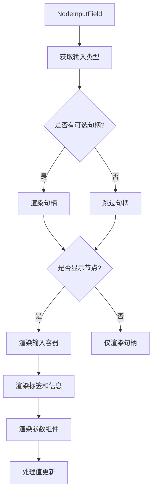

**Diagram sources**
- [NodeInputField/index.tsx](file://vibe_surf/frontend/src/CustomNodes/GenericNode/components/NodeInputField/index.tsx#L31-L234)

### NodeOutputParameter组件

NodeOutputParameter组件负责处理节点的输出参数，其主要职责包括：

- **输出参数渲染**：根据模板定义渲染输出字段
- **颜色管理**：根据输出类型动态设置颜色
- **选择处理**：处理输出类型的选择和切换
- **连接管理**：管理输出句柄的连接状态

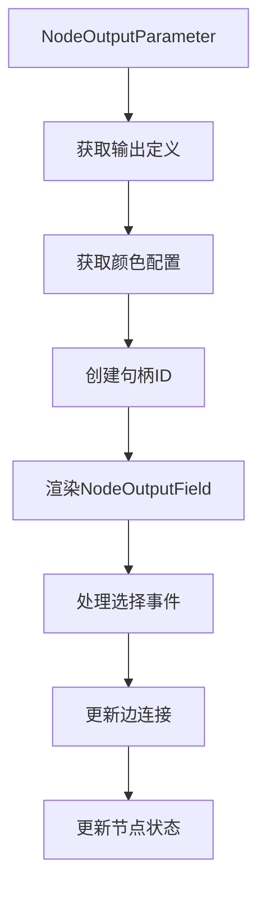

**Diagram sources**
- [NodeOutputParameter/index.tsx](file://vibe_surf/frontend/src/CustomNodes/GenericNode/components/NodeOutputParameter/index.tsx#L7-L64)

### NodeStatus组件

NodeStatus组件负责显示节点的构建状态和执行状态，其主要职责包括：

- **状态显示**：显示构建成功、错误或未激活状态
- **运行控制**：提供运行和停止构建的按钮
- **连接管理**：处理认证连接和断开连接
- **时间显示**：显示上次运行时间和执行时长

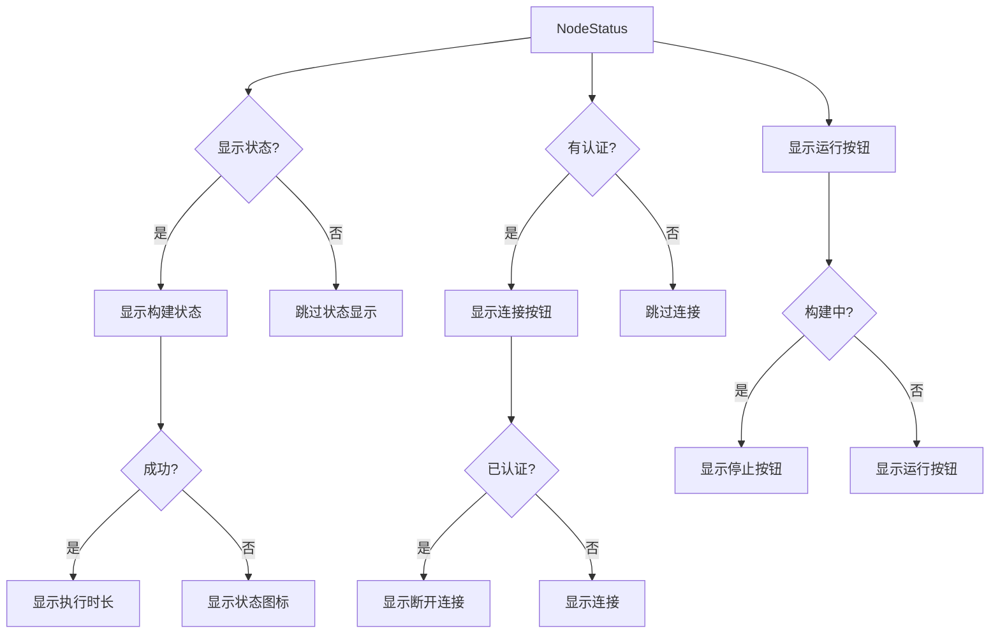

**Diagram sources**
- [NodeStatus/index.tsx](file://vibe_surf/frontend/src/CustomNodes/GenericNode/components/NodeStatus/index.tsx#L31-L499)

### NodeDescription组件

NodeDescription组件负责处理节点的描述信息，支持富文本编辑和Markdown渲染，其主要职责包括：

- **描述编辑**：提供文本区域进行描述编辑
- **Markdown渲染**：将Markdown格式的描述渲染为HTML
- **字符限制**：支持字符数限制和计数显示
- **双击编辑**：支持双击进入编辑模式

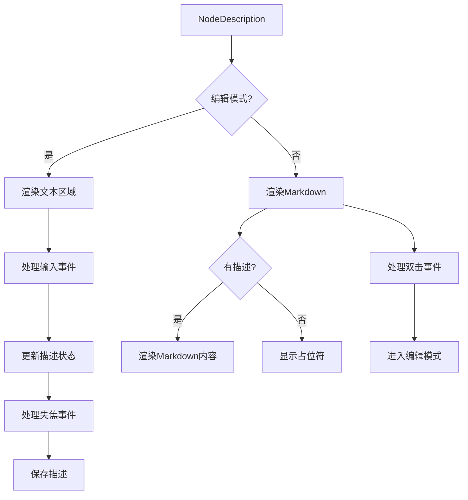

**Diagram sources**
- [NodeDescription/index.tsx](file://vibe_surf/frontend/src/CustomNodes/GenericNode/components/NodeDescription/index.tsx#L9-L202)

### NodeName组件

NodeName组件负责处理节点的名称显示和编辑，其主要职责包括：

- **名称显示**：显示节点的显示名称
- **名称编辑**：提供输入框进行名称编辑
- **状态标记**：显示Beta和Legacy状态标记
- **快捷键支持**：支持Enter保存和Escape取消

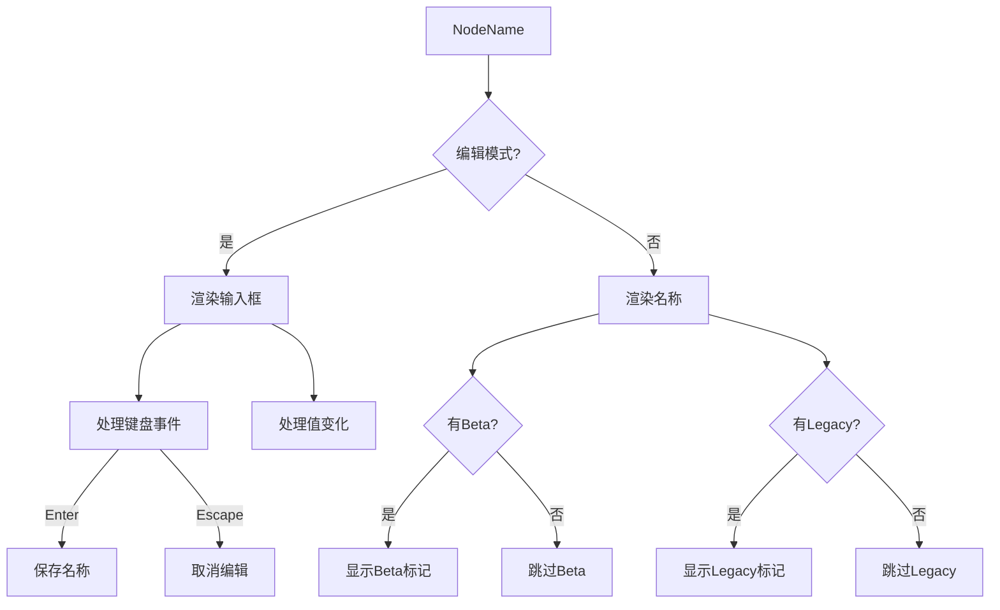

**Diagram sources**
- [NodeName/index.tsx](file://vibe_surf/frontend/src/CustomNodes/GenericNode/components/NodeName/index.tsx#L9-L127)

### NodeIcon组件

NodeIcon组件负责处理节点的图标显示，其主要职责包括：

- **图标选择**：根据配置选择合适的图标
- **Emoji支持**：支持Emoji图标显示
- **Lucide图标**：支持Lucide图标库
- **类型回退**：在图标不存在时使用类型名称作为回退

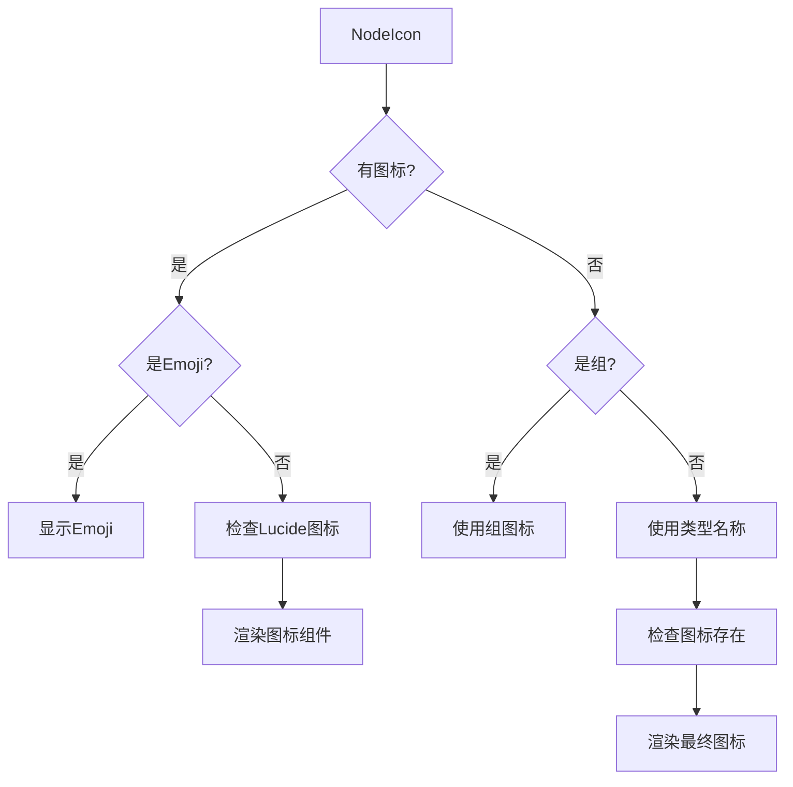

**Diagram sources**
- [NodeIcon/index.tsx](file://vibe_surf/frontend/src/CustomNodes/GenericNode/components/NodeIcon/index.tsx#L9-L50)

## MediaPlayerNode媒体集成

MediaPlayerNode实现了媒体播放功能，允许用户输入媒体URL并播放图像或视频。

### 核心功能

- **URL输入**：提供输入框让用户输入媒体URL
- **自动检测**：根据URL扩展名自动检测媒体类型
- **尺寸调整**：支持节点大小调整，保持宽高比
- **执行结果显示**：显示工作流执行结果中的媒体内容

### 媒体类型检测

MediaPlayerNode通过文件扩展名来检测媒体类型：

```mermaid
flowchart TD
A[检测媒体类型] --> B[获取URL]
B --> C[提取扩展名]
C --> D{是图像扩展?}
D --> |是| E[返回"image"]
D --> |否| F{是视频扩展?}
F --> |是| G[返回"video"]
F --> |否| H[返回默认"image"]
```

**Diagram sources**
- [MediaPlayerNode/index.tsx](file://vibe_surf/frontend/src/CustomNodes/MediaPlayerNode/index.tsx#L123-L138)

### 执行结果处理

MediaPlayerNode监听工作流执行结果，自动显示输出中的媒体内容：

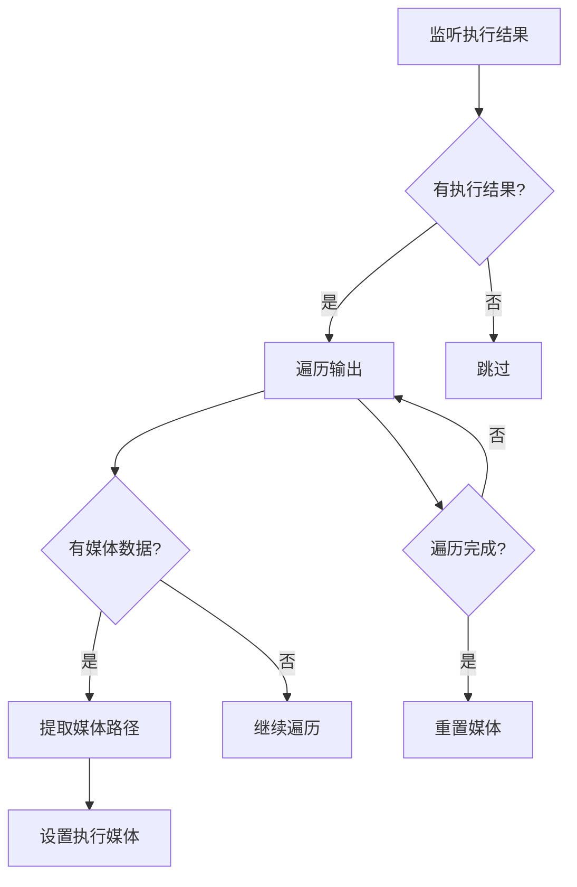

**Diagram sources**
- [MediaPlayerNode/index.tsx](file://vibe_surf/frontend/src/CustomNodes/MediaPlayerNode/index.tsx#L68-L116)

## NoteNode富文本与颜色选择

NoteNode实现了富文本编辑和颜色选择功能，提供类似便签的用户体验。

### 颜色选择实现

NoteNode通过ColorPickerButtons组件实现颜色选择功能：

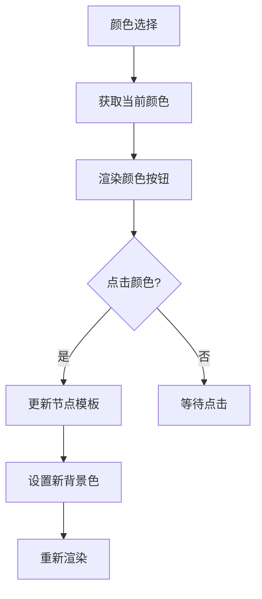

**Diagram sources**
- [color-picker-buttons.tsx](file://vibe_surf/frontend/src/CustomNodes/NoteNode/components/color-picker-buttons.tsx#L7-L55)

### 工具栏实现

NoteNode通过NoteToolbarComponent提供上下文工具栏：

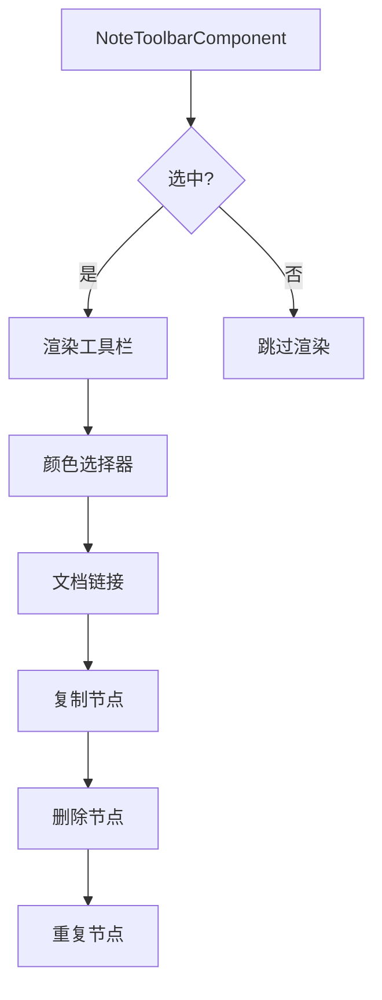

**Diagram sources**
- [NoteToolbarComponent/index.tsx](file://vibe_surf/frontend/src/CustomNodes/NoteNode/NoteToolbarComponent/index.tsx#L58-L137)

## 辅助函数详解

### get-node-input-colors函数

`get-node-input-colors`函数负责根据输入类型获取相应的颜色配置：

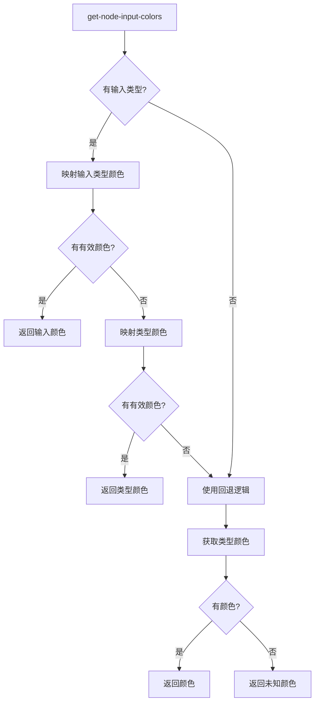

**Diagram sources**
- [get-node-input-colors.ts](file://vibe_surf/frontend/src/CustomNodes/helpers/get-node-input-colors.ts#L3-L39)

### process-node-advanced-fields函数

`process-node-advanced-fields`函数负责处理节点的高级字段，根据连接状态自动调整字段的可见性：

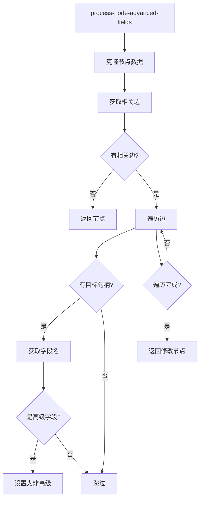

**Diagram sources**
- [process-node-advanced-fields.ts](file://vibe_surf/frontend/src/CustomNodes/helpers/process-node-advanced-fields.ts#L5-L32)

## 自定义节点开发指南

### 组件创建

创建自定义节点需要遵循以下步骤：

1. **创建组件文件**：在`CustomNodes`目录下创建新的组件目录和文件
2. **定义类型**：在`types/flow.ts`中定义节点数据类型
3. **实现UI**：使用React组件实现节点的UI界面
4. **处理状态**：使用Zustand store管理节点状态
5. **注册节点**：在节点注册系统中注册新节点

### 类型定义

节点类型定义应包含以下关键属性：

- `id`: 节点唯一标识符
- `type`: 节点类型
- `data`: 节点数据，包含配置和状态
- `position`: 节点在画布上的位置
- `selected`: 选中状态

### 注册流程

节点注册流程包括：

1. **导入组件**：在注册文件中导入新节点组件
2. **定义配置**：配置节点的显示名称、图标、描述等元数据
3. **添加到注册表**：将节点添加到全局节点注册表中
4. **测试验证**：在UI中测试节点的显示和功能

### 最佳实践

- **性能优化**：使用`memo`和`useMemo`避免不必要的重新渲染
- **错误处理**：提供友好的错误提示和恢复机制
- **可访问性**：确保键盘导航和屏幕阅读器支持
- **响应式设计**：适配不同屏幕尺寸和设备

## 数据流与事件处理

### 节点数据流

节点的数据流遵循以下模式：

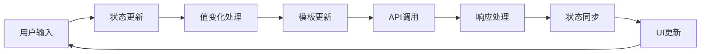

**Diagram sources**
- [GenericNode/index.tsx](file://vibe_surf/frontend/src/CustomNodes/GenericNode/index.tsx#L148-L213)

### 事件处理机制

事件处理机制包括：

- **键盘事件**：处理Enter、Escape等快捷键
- **鼠标事件**：处理点击、双击、悬停等交互
- **焦点事件**：处理输入框的获得和失去焦点
- **自定义事件**：通过Zustand store分发和监听自定义事件

## 总结

VibeSurf的自定义节点系统提供了强大而灵活的扩展能力。通过深入分析GenericNode、MediaPlayerNode和NoteNode的实现，我们可以看到系统采用了组件化、模块化的设计思想，通过清晰的职责分离和良好的API设计，使得节点开发和维护变得更加简单高效。

核心要点包括：
- **组件化架构**：将复杂功能分解为可复用的小组件
- **状态管理**：使用Zustand实现全局状态管理
- **类型安全**：通过TypeScript确保类型安全
- **用户体验**：提供直观的UI和流畅的交互体验

这些设计原则为开发新的自定义节点提供了坚实的基础，开发者可以基于现有模式快速创建功能丰富的新节点。