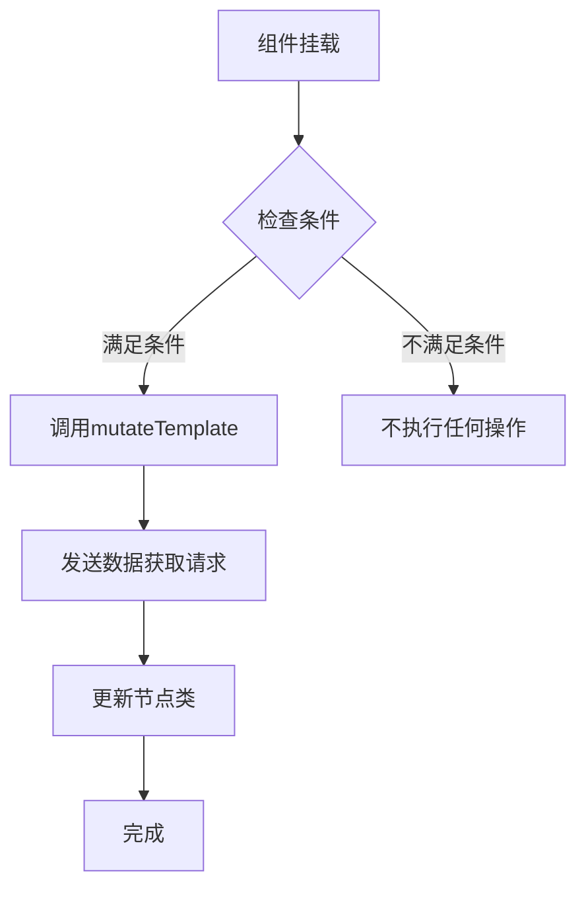
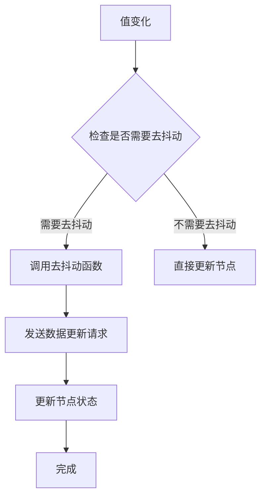
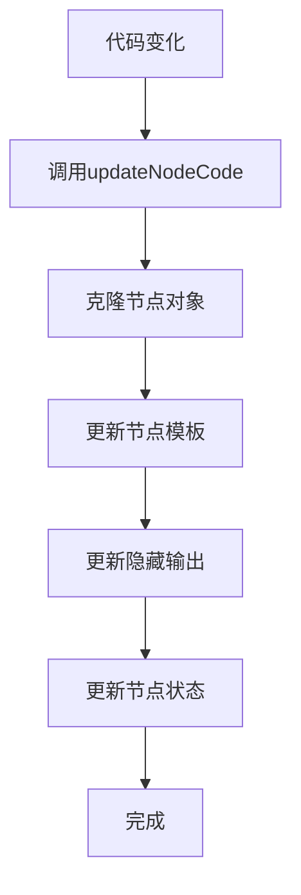
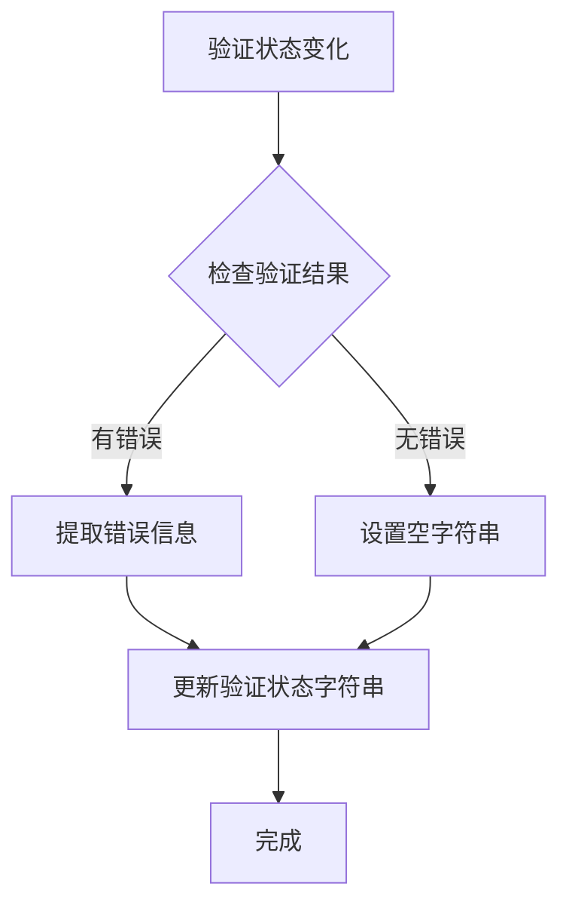
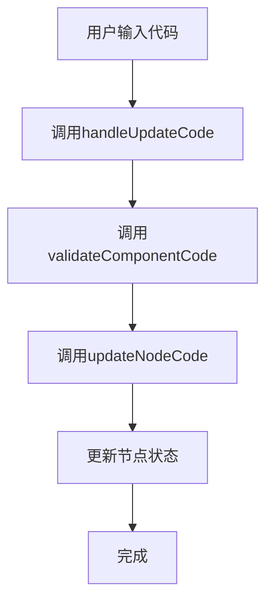

# 节点Hook

<cite>
**本文档中引用的文件**  
- [use-fetch-data-on-mount.ts](file://vibe_surf/frontend/src/CustomNodes/hooks/use-fetch-data-on-mount.ts)
- [use-handle-new-value.ts](file://vibe_surf/frontend/src/CustomNodes/hooks/use-handle-new-value.ts)
- [use-update-node-code.ts](file://vibe_surf/frontend/src/CustomNodes/hooks/use-update-node-code.ts)
- [use-validation-status-string.ts](file://vibe_surf/frontend/src/CustomNodes/hooks/use-validation-status-string.ts)
- [use-update-validation-status.ts](file://vibe_surf/frontend/src/CustomNodes/hooks/use-update-validation-status.ts)
- [mutate-template.ts](file://vibe_surf/frontend/src/CustomNodes/helpers/mutate-template.ts)
- [update-hidden-outputs.ts](file://vibe_surf/frontend/src/CustomNodes/helpers/update-hidden-outputs.ts)
- [GenericNode/index.tsx](file://vibe_surf/frontend/src/CustomNodes/GenericNode/index.tsx)
- [codeAreaModal/index.tsx](file://vibe_surf/frontend/src/modals/codeAreaModal/index.tsx)
- [flowStore.ts](file://vibe_surf/frontend/src/stores/flowStore.ts)
</cite>

## 目录
1. [介绍](#介绍)
2. [核心Hook分析](#核心hook分析)
3. [use-fetch-data-on-mount](#use-fetch-data-on-mount)
4. [use-handle-new-value](#use-handle-new-value)
5. [use-update-node-code](#use-update-node-code)
6. [use-validation-status-string](#use-validation-status-string)
7. [Hook使用场景和最佳实践](#hook使用场景和最佳实践)
8. [结论](#结论)

## 介绍

节点Hook是VibeSurf前端架构中的核心组件，用于管理自定义节点的生命周期、状态同步和数据处理。这些Hook提供了一种声明式的方法来处理节点相关的副作用和状态管理，使开发者能够更高效地构建和维护复杂的节点系统。本文档将深入分析各个自定义Hook的实现和用途，包括`use-fetch-data-on-mount`用于组件挂载时数据获取，`use-handle-new-value`用于处理新值更新，`use-update-node-code`用于节点代码更新，`use-validation-status-string`用于验证状态管理。

**节点Hook**在节点生命周期管理、状态同步和数据处理中扮演着关键角色。它们通过封装复杂的逻辑和状态管理，简化了自定义节点的开发过程。这些Hook不仅提高了代码的可重用性和可维护性，还确保了节点在不同状态下的正确行为。

## 核心Hook分析

本文档将详细分析四个核心Hook：`use-fetch-data-on-mount`、`use-handle-new-value`、`use-update-node-code`和`use-validation-status-string`。每个Hook都有其特定的用途和实现方式，共同构成了节点状态管理的基础。

### Hook设计原则

节点Hook的设计遵循以下原则：
- **单一职责**：每个Hook专注于解决一个特定的问题。
- **可组合性**：Hook可以相互组合，以实现更复杂的功能。
- **可测试性**：Hook的逻辑独立，便于单元测试。
- **性能优化**：通过使用`useCallback`、`useMemo`和`debounce`等技术，优化性能。

这些原则确保了Hook的高效性和可靠性，使开发者能够专注于业务逻辑的实现。

## use-fetch-data-on-mount

`use-fetch-data-on-mount` Hook用于在组件挂载时获取数据。它通过`useEffect` Hook在组件挂载时执行数据获取逻辑，确保数据在组件首次渲染时可用。

### 实现细节

`use-fetch-data-on-mount` Hook接收以下参数：
- `node`：节点对象，包含节点的模板和配置。
- `nodeId`：节点的唯一标识符。
- `setNodeClass`：用于更新节点类的函数。
- `name`：需要获取数据的字段名称。
- `postTemplateValue`：用于发送数据获取请求的突变函数。

**图源**
- [use-fetch-data-on-mount.ts](file://vibe_surf/frontend/src/CustomNodes/hooks/use-fetch-data-on-mount.ts#L7-L47)

### 使用场景

`use-fetch-data-on-mount` Hook适用于以下场景：
- **实时刷新**：当节点的某个字段需要在挂载时实时刷新数据。
- **按钮刷新**：当节点的某个字段需要在挂载时通过按钮触发数据刷新。
- **工具模式**：当节点处于工具模式时，需要在挂载时获取工具元数据。

通过这些场景，`use-fetch-data-on-mount` Hook确保了节点在挂载时能够获取到最新的数据，提高了用户体验。

**节源**
- [use-fetch-data-on-mount.ts](file://vibe_surf/frontend/src/CustomNodes/hooks/use-fetch-data-on-mount.ts#L7-L47)

## use-handle-new-value

`use-handle-new-value` Hook用于处理节点字段的新值更新。它通过`useCallback` Hook封装了值更新的逻辑，确保在值变化时能够正确地更新节点状态。

### 实现细节

`use-handle-new-value` Hook接收以下参数：
- `node`：节点对象，包含节点的模板和配置。
- `nodeId`：节点的唯一标识符。
- `name`：需要更新的字段名称。
- `setNode`：用于更新节点的函数。

**图源**
- [use-handle-new-value.ts](file://vibe_surf/frontend/src/CustomNodes/hooks/use-handle-new-value.ts#L24-L168)

### 使用场景

`use-handle-new-value` Hook适用于以下场景：
- **实时更新**：当节点的某个字段需要在值变化时实时更新。
- **去抖动更新**：当节点的某个字段需要在值变化时进行去抖动处理，以避免频繁的请求。
- **错误处理**：当节点的某个字段更新失败时，能够正确地处理错误并提示用户。

通过这些场景，`use-handle-new-value` Hook确保了节点在值变化时能够正确地更新状态，提高了系统的稳定性和用户体验。

**节源**
- [use-handle-new-value.ts](file://vibe_surf/frontend/src/CustomNodes/hooks/use-handle-new-value.ts#L24-L168)

## use-update-node-code

`use-update-node-code` Hook用于更新节点的代码。它通过`useCallback` Hook封装了代码更新的逻辑，确保在代码变化时能够正确地更新节点状态。

### 实现细节

`use-update-node-code` Hook接收以下参数：
- `dataId`：节点的唯一标识符。
- `dataNode`：节点对象，包含节点的模板和配置。
- `setNode`：用于更新节点的函数。
- `updateNodeInternals`：用于更新节点内部状态的函数。

**图源**
- [use-update-node-code.ts](file://vibe_surf/frontend/src/CustomNodes/hooks/use-update-node-code.ts#L7-L54)

### 使用场景

`use-update-node-code` Hook适用于以下场景：
- **代码更新**：当节点的代码发生变化时，需要更新节点的模板和输出。
- **隐藏输出管理**：当节点的输出发生变化时，需要更新隐藏的输出字段。
- **状态同步**：当节点的代码更新后，需要同步节点的内部状态。

通过这些场景，`use-update-node-code` Hook确保了节点在代码变化时能够正确地更新状态，提高了系统的稳定性和用户体验。

**节源**
- [use-update-node-code.ts](file://vibe_surf/frontend/src/CustomNodes/hooks/use-update-node-code.ts#L7-L54)

## use-validation-status-string

`use-validation-status-string` Hook用于管理节点的验证状态字符串。它通过`useEffect` Hook监听验证状态的变化，并将验证结果转换为字符串形式。

### 实现细节

`use-validation-status-string` Hook接收以下参数：
- `validationStatus`：验证状态对象，包含验证结果。
- `setValidationString`：用于更新验证状态字符串的函数。

**图源**
- [use-validation-status-string.ts](file://vibe_surf/frontend/src/CustomNodes/hooks/use-validation-status-string.ts#L5-L23)

### 使用场景

`use-validation-status-string` Hook适用于以下场景：
- **错误提示**：当节点的验证结果包含错误时，需要将错误信息转换为字符串形式，以便在界面上显示。
- **状态同步**：当节点的验证状态发生变化时，需要同步验证状态字符串。

通过这些场景，`use-validation-status-string` Hook确保了节点在验证状态变化时能够正确地更新状态字符串，提高了用户体验。

**节源**
- [use-validation-status-string.ts](file://vibe_surf/frontend/src/CustomNodes/hooks/use-validation-status-string.ts#L5-L23)

## Hook使用场景和最佳实践

### 综合使用示例

在实际开发中，这些Hook通常会结合使用，以实现更复杂的功能。例如，在`GenericNode`组件中，`use-update-node-code` Hook与`use-handle-new-value` Hook结合使用，实现了节点代码的更新和值的处理。

**图源**
- [GenericNode/index.tsx](file://vibe_surf/frontend/src/CustomNodes/GenericNode/index.tsx#L148-L195)

### 最佳实践

1. **避免重复调用**：在使用Hook时，应避免重复调用相同的Hook，以提高性能。
2. **合理使用去抖动**：对于频繁变化的值，应合理使用去抖动技术，以避免频繁的请求。
3. **错误处理**：在处理数据更新和验证时，应正确处理错误，并提供友好的用户提示。
4. **状态同步**：在更新节点状态时，应确保状态的同步，避免状态不一致的问题。

通过遵循这些最佳实践，开发者可以更高效地使用节点Hook，提高代码的可维护性和用户体验。

**节源**
- [GenericNode/index.tsx](file://vibe_surf/frontend/src/CustomNodes/GenericNode/index.tsx#L148-L195)
- [codeAreaModal/index.tsx](file://vibe_surf/frontend/src/modals/codeAreaModal/index.tsx#L117-L134)

## 结论

节点Hook是VibeSurf前端架构中的核心组件，通过封装复杂的逻辑和状态管理，简化了自定义节点的开发过程。`use-fetch-data-on-mount`、`use-handle-new-value`、`use-update-node-code`和`use-validation-status-string`这四个Hook分别解决了数据获取、值更新、代码更新和验证状态管理的问题，共同构成了节点状态管理的基础。通过合理使用这些Hook，开发者可以更高效地构建和维护复杂的节点系统，提高代码的可重用性和可维护性。