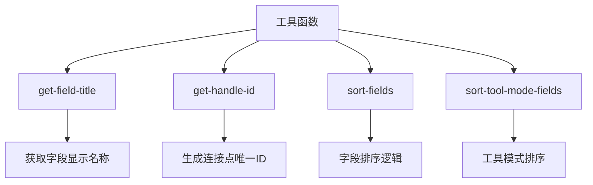
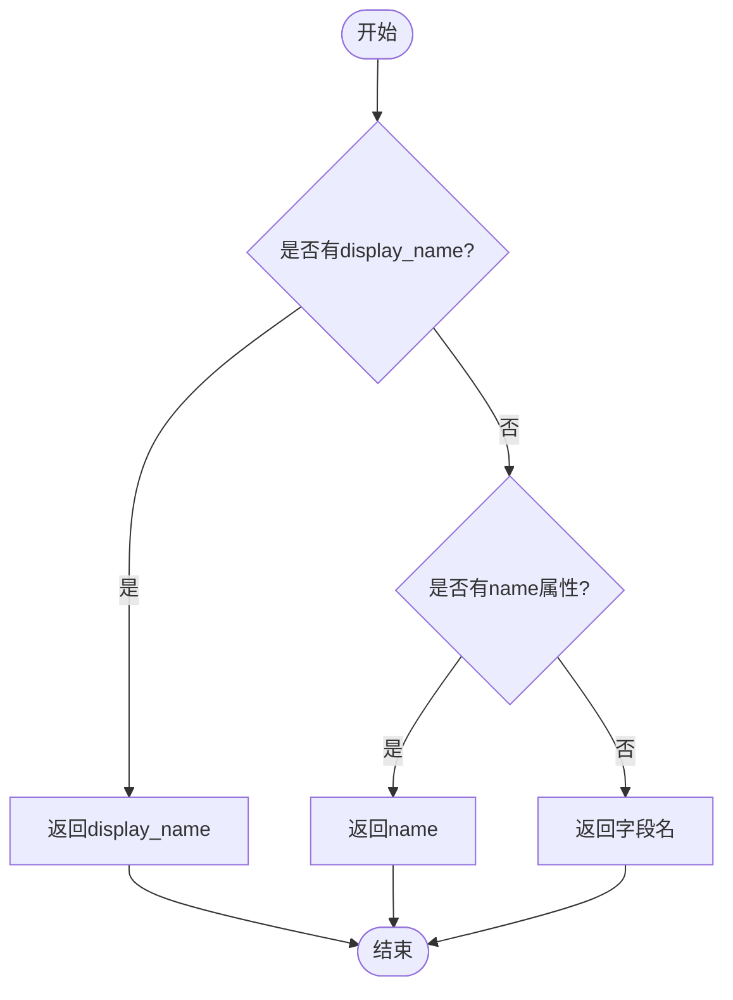
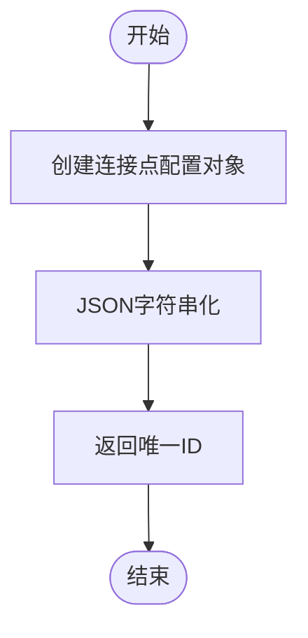
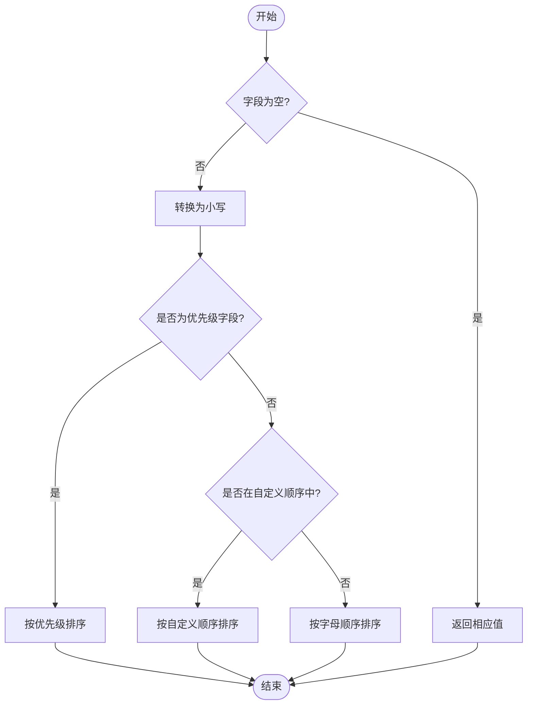
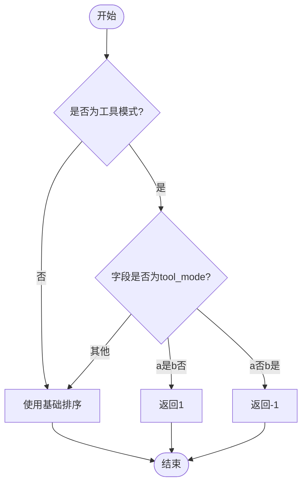
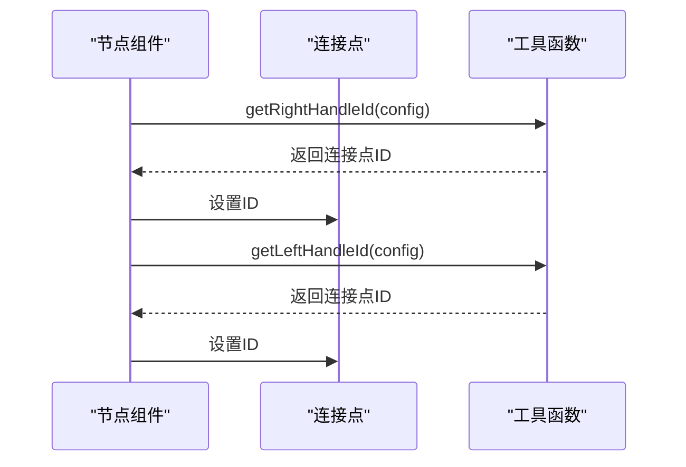

# 节点工具函数

<cite>
**本文档中引用的文件**  
- [get-field-title.tsx](file://vibe_surf/frontend/src/CustomNodes/utils/get-field-title.tsx)
- [get-handle-id.tsx](file://vibe_surf/frontend/src/CustomNodes/utils/get-handle-id.tsx)
- [sort-fields.tsx](file://vibe_surf/frontend/src/CustomNodes/utils/sort-fields.tsx)
- [sort-tool-mode-field.ts](file://vibe_surf/frontend/src/CustomNodes/helpers/sort-tool-mode-field.ts)
- [constants.ts](file://vibe_surf/frontend/src/constants/constants.ts)
- [reactflowUtils.ts](file://vibe_surf/frontend/src/utils/reactflowUtils.ts)
</cite>

## 目录
1. [简介](#简介)
2. [核心工具函数分析](#核心工具函数分析)
3. [字段标题获取函数](#字段标题获取函数)
4. [连接点ID生成函数](#连接点id生成函数)
5. [字段排序函数](#字段排序函数)
6. [工具模式字段排序](#工具模式字段排序)
7. [使用场景与最佳实践](#使用场景与最佳实践)
8. [总结](#总结)

## 简介
本文档详细介绍了节点系统中的核心工具函数，包括`get-field-title`、`get-handle-id`和`sort-fields`等关键工具函数的实现原理和用途。这些工具函数在节点布局、连接点管理和UI渲染中发挥着重要作用，为自定义节点开发提供了基础支持。

**Section sources**
- [get-field-title.tsx](file://vibe_surf/frontend/src/CustomNodes/utils/get-field-title.tsx)
- [get-handle-id.tsx](file://vibe_surf/frontend/src/CustomNodes/utils/get-handle-id.tsx)
- [sort-fields.tsx](file://vibe_surf/frontend/src/CustomNodes/utils/sort-fields.tsx)

## 核心工具函数分析
节点系统中的工具函数主要负责处理节点的UI展示、连接点管理和字段排序等核心功能。这些函数通过标准化的接口为前端组件提供支持，确保节点系统的稳定性和可扩展性。



**Diagram sources**
- [get-field-title.tsx](file://vibe_surf/frontend/src/CustomNodes/utils/get-field-title.tsx)
- [get-handle-id.tsx](file://vibe_surf/frontend/src/CustomNodes/utils/get-handle-id.tsx)
- [sort-fields.tsx](file://vibe_surf/frontend/src/CustomNodes/utils/sort-fields.tsx)
- [sort-tool-mode-field.ts](file://vibe_surf/frontend/src/CustomNodes/helpers/sort-tool-mode-field.ts)

## 字段标题获取函数
`get-field-title`函数用于获取字段的显示标题，它根据模板配置优先返回`display_name`，如果没有则返回`name`或字段名本身。

### 函数签名
```typescript
function getFieldTitle(template: APITemplateType, templateField: string): string
```

### 参数说明
- **template**: 节点模板对象，包含所有字段的配置信息
- **templateField**: 要获取标题的字段名称

### 返回值
返回字段的显示标题字符串

### 实现逻辑
1. 首先检查字段是否有`display_name`配置
2. 如果有，则返回`display_name`
3. 否则返回`name`属性或字段名本身



**Diagram sources**
- [get-field-title.tsx](file://vibe_surf/frontend/src/CustomNodes/utils/get-field-title.tsx)

**Section sources**
- [get-field-title.tsx](file://vibe_surf/frontend/src/CustomNodes/utils/get-field-title.tsx)

## 连接点ID生成函数
`get-handle-id`函数用于生成连接点的唯一标识符，确保每个连接点在系统中具有唯一的ID。

### 函数签名
```typescript
function getRightHandleId({ output_types, id, dataType, name }: sourceHandleType): string
function getLeftHandleId({ inputTypes, type, fieldName, id }: targetHandleType): string
```

### 参数说明
- **output_types**: 输出类型数组
- **id**: 节点ID
- **dataType**: 数据类型
- **name**: 名称
- **inputTypes**: 输入类型数组
- **type**: 类型
- **fieldName**: 字段名称

### 返回值
返回JSON字符串化的连接点配置对象

### 实现逻辑
1. 接收连接点的配置参数
2. 使用`scapedJSONStringfy`函数将配置对象转换为字符串
3. 返回唯一标识符



**Diagram sources**
- [get-handle-id.tsx](file://vibe_surf/frontend/src/CustomNodes/utils/get-handle-id.tsx)

**Section sources**
- [get-handle-id.tsx](file://vibe_surf/frontend/src/CustomNodes/utils/get-handle-id.tsx)

## 字段排序函数
`sort-fields`函数用于对字段进行排序，支持优先级字段、自定义顺序和默认排序。

### 函数签名
```typescript
function sortFields(a, b, fieldOrder): number
```

### 参数说明
- **a**: 第一个字段名
- **b**: 第二个字段名
- **fieldOrder**: 字段自定义顺序数组

### 返回值
返回排序比较结果（-1, 0, 1）

### 排序优先级
1. 优先级字段（如"code"、"template"、"mode"）
2. 自定义顺序字段
3. 普通字段（按字母顺序）

### 实现逻辑
1. 处理空字段的特殊情况
2. 转换为小写进行不区分大小写的比较
3. 检查是否为优先级字段
4. 检查是否在自定义顺序数组中
5. 最后按字母顺序排序



**Diagram sources**
- [sort-fields.tsx](file://vibe_surf/frontend/src/CustomNodes/utils/sort-fields.tsx)
- [constants.ts](file://vibe_surf/frontend/src/constants/constants.ts)

**Section sources**
- [sort-fields.tsx](file://vibe_surf/frontend/src/CustomNodes/utils/sort-fields.tsx)

## 工具模式字段排序
`sort-tool-mode-fields`函数扩展了基础排序功能，增加了对工具模式的支持。

### 函数签名
```typescript
const sortToolModeFields = (a: string, b: string, template: any, fieldOrder: string[], isToolMode: boolean) => number
```

### 参数说明
- **a**: 第一个字段名
- **b**: 第二个字段名
- **template**: 模板对象
- **fieldOrder**: 字段顺序数组
- **isToolMode**: 是否为工具模式

### 实现逻辑
1. 如果不是工具模式，使用基础排序
2. 如果是工具模式，检查字段的`tool_mode`属性
3. `tool_mode`字段排在最后
4. 其他情况使用基础排序



**Diagram sources**
- [sort-tool-mode-field.ts](file://vibe_surf/frontend/src/CustomNodes/helpers/sort-tool-mode-field.ts)
- [sort-fields.tsx](file://vibe_surf/frontend/src/CustomNodes/utils/sort-fields.tsx)

**Section sources**
- [sort-tool-mode-field.ts](file://vibe_surf/frontend/src/CustomNodes/helpers/sort-tool-mode-field.ts)

## 使用场景与最佳实践
### 节点布局管理
工具函数在节点布局中发挥关键作用：
- `get-field-title`确保字段显示名称的一致性
- `sort-fields`保证字段按预期顺序排列
- `get-handle-id`确保连接点ID的唯一性

### 连接点管理


**Diagram sources**
- [get-handle-id.tsx](file://vibe_surf/frontend/src/CustomNodes/utils/get-handle-id.tsx)

### UI渲染优化
通过合理使用工具函数，可以显著提升开发效率和代码质量：
1. 统一字段显示逻辑
2. 标准化连接点ID生成
3. 灵活的字段排序机制

### 最佳实践
- 始终使用`get-field-title`获取字段标题
- 使用`sort-fields`进行字段排序
- 在工具模式下使用`sort-tool-mode-fields`
- 保持连接点ID生成的一致性

**Section sources**
- [reactflowUtils.ts](file://vibe_surf/frontend/src/utils/reactflowUtils.ts)

## 总结
本文档详细分析了节点系统中的核心工具函数，包括`get-field-title`、`get-handle-id`和`sort-fields`等。这些函数在节点布局、连接点管理和UI渲染中发挥着重要作用，为自定义节点开发提供了坚实的基础。通过合理使用这些工具函数，开发者可以显著提升开发效率和代码质量，确保系统的稳定性和可维护性。