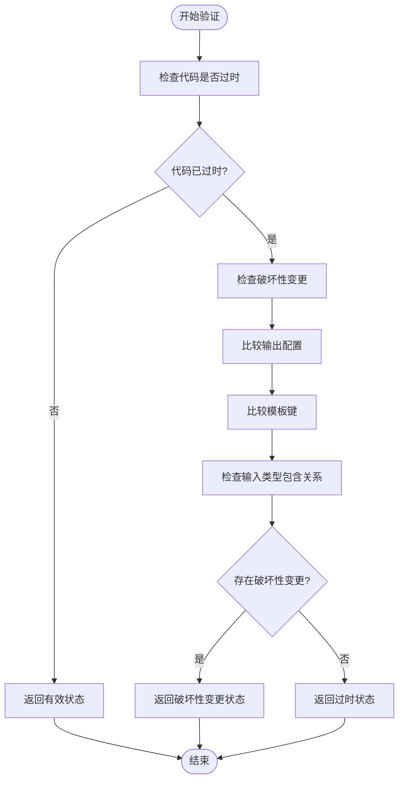
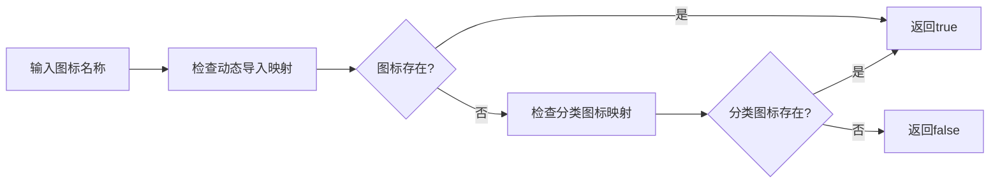
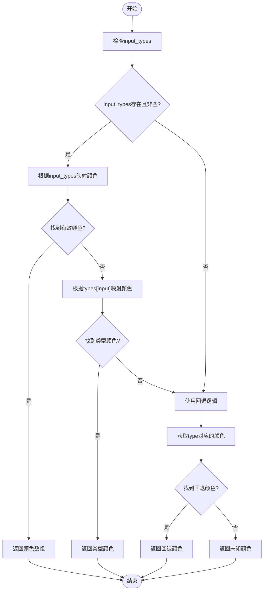
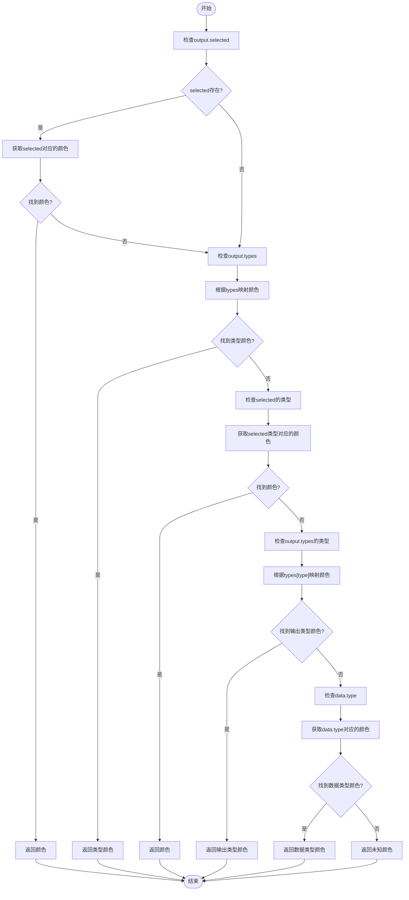
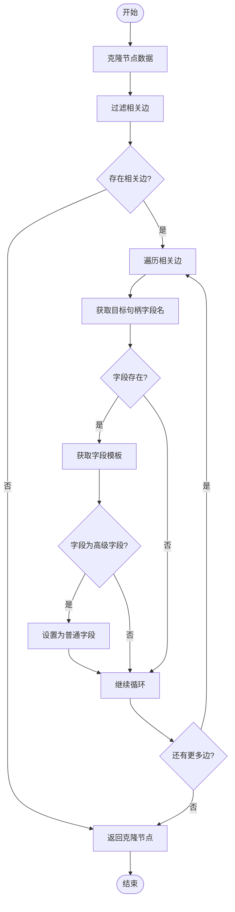
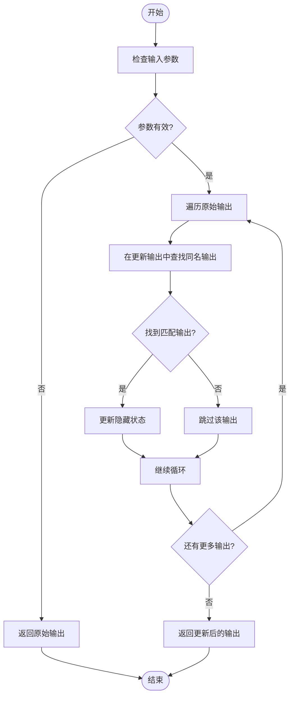

# 节点辅助函数

<cite>
**本文档中引用的文件**  
- [check-code-validity.ts](file://vibe_surf/frontend/src/CustomNodes/helpers/check-code-validity.ts)
- [check-lucide-icons.ts](file://vibe_surf/frontend/src/CustomNodes/helpers/check-lucide-icons.ts)
- [get-node-input-colors.ts](file://vibe_surf/frontend/src/CustomNodes/helpers/get-node-input-colors.ts)
- [get-node-output-colors.ts](file://vibe_surf/frontend/src/CustomNodes/helpers/get-node-output-colors.ts)
- [process-node-advanced-fields.ts](file://vibe_surf/frontend/src/CustomNodes/helpers/process-node-advanced-fields.ts)
- [update-hidden-outputs.ts](file://vibe_surf/frontend/src/CustomNodes/helpers/update-hidden-outputs.ts)
- [styleUtils.ts](file://vibe_surf/frontend/src/utils/styleUtils.ts)
- [RenderInputParameters/index.tsx](file://vibe_surf/frontend/src/CustomNodes/GenericNode/components/RenderInputParameters/index.tsx)
- [GenericNode/index.tsx](file://vibe_surf/frontend/src/CustomNodes/GenericNode/index.tsx)
</cite>

## 目录
1. [引言](#引言)
2. [核心辅助函数分析](#核心辅助函数分析)
3. [代码有效性验证](#代码有效性验证)
4. [图标检查](#图标检查)
5. [节点颜色管理](#节点颜色管理)
6. [高级字段处理](#高级字段处理)
7. [隐藏输出更新](#隐藏输出更新)
8. [使用场景与最佳实践](#使用场景与最佳实践)
9. [结论](#结论)

## 引言

节点辅助函数是VibeSurf前端系统中的关键工具集，用于支持节点的渲染、状态管理和用户体验优化。这些辅助函数在自定义节点开发中扮演着重要角色，通过提供标准化的工具来处理代码验证、图标检查、颜色管理、高级字段处理和隐藏输出更新等核心功能。本技术文档将深入分析这些辅助函数的实现细节、用途和使用方法，为开发者提供全面的参考指南。

## 核心辅助函数分析

节点辅助函数集合包含多个专门设计的工具函数，每个函数都针对特定的节点管理任务。这些函数主要位于`vibe_surf/frontend/src/CustomNodes/helpers/`目录下，通过模块化设计实现了高内聚低耦合的架构。辅助函数的设计遵循函数式编程原则，具有纯函数特性，确保了可预测性和可测试性。这些函数通过参数传递依赖，避免了全局状态的使用，提高了代码的可维护性和可重用性。

**节点辅助函数的主要功能包括：**
- 代码有效性验证：检查节点代码是否过时或存在破坏性变更
- 图标检查：验证Lucide图标是否存在并可加载
- 颜色管理：根据节点类型和状态动态获取输入/输出端口颜色
- 高级字段处理：根据边连接状态动态调整节点字段的高级属性
- 隐藏输出更新：同步更新节点的隐藏输出状态

这些辅助函数共同构成了节点管理系统的核心工具集，为前端节点的动态渲染和交互提供了坚实的基础。

**Section sources**
- [check-code-validity.ts](file://vibe_surf/frontend/src/CustomNodes/helpers/check-code-validity.ts)
- [check-lucide-icons.ts](file://vibe_surf/frontend/src/CustomNodes/helpers/check-lucide-icons.ts)
- [get-node-input-colors.ts](file://vibe_surf/frontend/src/CustomNodes/helpers/get-node-input-colors.ts)
- [get-node-output-colors.ts](file://vibe_surf/frontend/src/CustomNodes/helpers/get-node-output-colors.ts)
- [process-node-advanced-fields.ts](file://vibe_surf/frontend/src/CustomNodes/helpers/process-node-advanced-fields.ts)
- [update-hidden-outputs.ts](file://vibe_surf/frontend/src/CustomNodes/helpers/update-hidden-outputs.ts)

## 代码有效性验证

`check-code-validity`函数是节点代码管理的核心工具，负责验证节点代码的有效性并检测潜在的破坏性变更。该函数通过比较当前节点代码与原始模板代码的差异，判断代码是否过时，并检查是否存在输出、模板键或输入类型的变化。



**函数参数说明：**
- `data`: 节点数据对象，包含当前节点的配置信息
- `templates`: 模板集合，包含所有节点类型的原始配置

**返回值定义：**
- `outdated`: 布尔值，表示代码是否过时
- `breakingChange`: 布尔值，表示是否存在破坏性变更
- `userEdited`: 布尔值，表示用户是否已编辑过节点

该函数通过多层验证逻辑确保节点代码的兼容性和稳定性，在自定义节点开发中可用于自动检测代码更新并提示用户进行必要的调整。

**Diagram sources**
- [check-code-validity.ts](file://vibe_surf/frontend/src/CustomNodes/helpers/check-code-validity.ts)

**Section sources**
- [check-code-validity.ts](file://vibe_surf/frontend/src/CustomNodes/helpers/check-code-validity.ts)

## 图标检查

`check-lucide-icons`函数负责验证Lucide图标名称的有效性，确保指定的图标可以在前端正确加载和显示。该函数通过检查动态导入映射和分类图标映射来确认图标的可用性。



**函数参数说明：**
- `iconName`: 图标名称字符串

**返回值定义：**
- 布尔值，表示图标名称是否有效且可加载

该函数利用`dynamicIconImports`和`categoryIcons`两个映射对象进行双重验证，确保了图标的可靠加载。在自定义节点开发中，此函数可用于动态图标选择器，防止无效图标名称导致的渲染错误。

**Diagram sources**
- [check-lucide-icons.ts](file://vibe_surf/frontend/src/CustomNodes/helpers/check-lucide-icons.ts)

**Section sources**
- [check-lucide-icons.ts](file://vibe_surf/frontend/src/CustomNodes/helpers/check-lucide-icons.ts)

## 节点颜色管理

节点颜色管理功能由`get-node-input-colors`和`get-node-output-colors`两个函数实现，它们根据节点类型、输入输出配置和类型映射动态获取端口颜色。这些函数使用了`nodeColors`和`nodeColorsName`颜色映射表，支持多种颜色获取策略。

### 输入颜色获取

`get-node-input-colors`函数通过以下策略获取输入端口颜色：



### 输出颜色获取

`get-node-output-colors`函数通过以下策略获取输出端口颜色：



**函数参数说明：**
- `input_types`: 输入类型数组（可选）
- `type`: 类型字符串（可选）
- `types`: 类型映射对象
- `output`: 输出字段对象
- `data`: 节点数据对象

**返回值定义：**
- 颜色字符串数组，包含一个或多个十六进制颜色值

这些颜色管理函数在节点渲染中起着关键作用，通过动态颜色分配增强了用户界面的可视化效果和用户体验。

**Diagram sources**
- [get-node-input-colors.ts](file://vibe_surf/frontend/src/CustomNodes/helpers/get-node-input-colors.ts)
- [get-node-output-colors.ts](file://vibe_surf/frontend/src/CustomNodes/helpers/get-node-output-colors.ts)

**Section sources**
- [get-node-input-colors.ts](file://vibe_surf/frontend/src/CustomNodes/helpers/get-node-input-colors.ts)
- [get-node-output-colors.ts](file://vibe_surf/frontend/src/CustomNodes/helpers/get-node-output-colors.ts)

## 高级字段处理

`process-node-advanced-fields`函数负责处理节点的高级字段属性，根据边连接状态动态调整字段的可见性。该函数通过分析相关边的连接情况，将已连接的高级字段自动降级为普通字段，提升用户体验。



**函数参数说明：**
- `resData`: API类类型数据
- `edges`: 边类型数组
- `nodeId`: 节点ID字符串

**返回值定义：**
- 处理后的节点数据对象，其中已连接的高级字段已被降级

该函数在节点编辑过程中自动优化字段布局，减少了用户手动调整的工作量。当用户连接一个高级字段的边时，该字段会自动变为普通字段，使界面更加简洁。

**Diagram sources**
- [process-node-advanced-fields.ts](file://vibe_surf/frontend/src/CustomNodes/helpers/process-node-advanced-fields.ts)

**Section sources**
- [process-node-advanced-fields.ts](file://vibe_surf/frontend/src/CustomNodes/helpers/process-node-advanced-fields.ts)

## 隐藏输出更新

`update-hidden-outputs`函数负责同步更新节点的隐藏输出状态，确保输出配置的一致性。该函数通过比较原始输出和更新后的输出，将隐藏状态从原始输出复制到更新后的输出。



**函数参数说明：**
- `outputs`: 原始输出字段数组
- `updatedOutputs`: 更新后的输出字段数组

**返回值定义：**
- 更新后的输出数组，其中隐藏状态已同步

该函数在节点配置更新过程中保持输出状态的一致性，防止因配置更新导致的隐藏状态丢失。在自定义节点开发中，此函数可用于保存和恢复节点的显示状态。

**Diagram sources**
- [update-hidden-outputs.ts](file://vibe_surf/frontend/src/CustomNodes/helpers/update-hidden-outputs.ts)

**Section sources**
- [update-hidden-outputs.ts](file://vibe_surf/frontend/src/CustomNodes/helpers/update-hidden-outputs.ts)

## 使用场景与最佳实践

### 代码有效性验证使用场景

在节点编辑器中，`check-code-validity`函数可用于：
- 自动检测节点代码更新并提示用户
- 防止破坏性变更导致的工作流中断
- 提供代码更新建议和迁移指南

```typescript
// 示例：在节点更新时检查代码有效性
const validation = checkCodeValidity(nodeData, templates);
if (validation.outdated) {
  if (validation.breakingChange) {
    showBreakingChangeWarning();
  } else {
    showCodeUpdateNotification();
  }
}
```

### 图标检查使用场景

`check-lucide-icons`函数适用于：
- 动态图标选择器的验证
- 防止无效图标名称导致的渲染错误
- 图标库的兼容性检查

```typescript
// 示例：安全地设置节点图标
if (checkLucideIcons(iconName)) {
  setNodeIcon(iconName);
} else {
  setNodeIcon('HelpCircle'); // 使用默认图标
}
```

### 颜色管理使用场景

颜色管理函数在以下场景中特别有用：
- 动态主题支持
- 节点类型可视化
- 数据流跟踪

```typescript
// 示例：在渲染输入参数时获取颜色
const colors = getNodeInputColors(
  template.input_types,
  template.type,
  types
);
```

### 高级字段处理使用场景

`process-node-advanced-fields`函数的最佳实践包括：
- 在节点初始化时自动优化字段布局
- 提升用户体验，减少手动配置
- 保持界面简洁性

```typescript
// 示例：在加载节点时处理高级字段
const processedNode = processNodeAdvancedFields(
  apiData,
  currentEdges,
  nodeId
);
```

### 隐藏输出更新使用场景

`update-hidden-outputs`函数适用于：
- 节点配置的持久化
- 工作流的版本控制
- 用户偏好设置的保存

```typescript
// 示例：在更新节点配置时同步隐藏状态
const updatedOutputs = updateHiddenOutputs(
  currentOutputs,
  newOutputs
);
```

**最佳实践建议：**
1. 在节点渲染前预处理所有辅助函数调用
2. 使用memoization优化性能敏感的函数调用
3. 提供清晰的错误处理和回退机制
4. 保持函数的纯函数特性，避免副作用
5. 在自定义节点开发中充分测试辅助函数的边界情况

**Section sources**
- [RenderInputParameters/index.tsx](file://vibe_surf/frontend/src/CustomNodes/GenericNode/components/RenderInputParameters/index.tsx)
- [GenericNode/index.tsx](file://vibe_surf/frontend/src/CustomNodes/GenericNode/index.tsx)

## 结论

节点辅助函数是VibeSurf前端系统中不可或缺的工具集，为节点的渲染、状态管理和用户体验优化提供了强大的支持。通过对`check-code-validity`、`check-lucide-icons`、`get-node-input-colors`、`get-node-output-colors`、`process-node-advanced-fields`和`update-hidden-outputs`等函数的深入分析，我们了解了它们的实现细节、用途和使用方法。

这些辅助函数的设计体现了模块化、函数式和可维护性的最佳实践，通过清晰的接口和可靠的逻辑为自定义节点开发提供了坚实的基础。在实际应用中，合理利用这些辅助函数可以显著提升开发效率和用户体验，确保节点系统的稳定性和一致性。

未来，可以考虑进一步优化这些辅助函数的性能，增加更多的类型安全检查，并提供更完善的文档和示例，以支持更广泛的自定义节点开发需求。