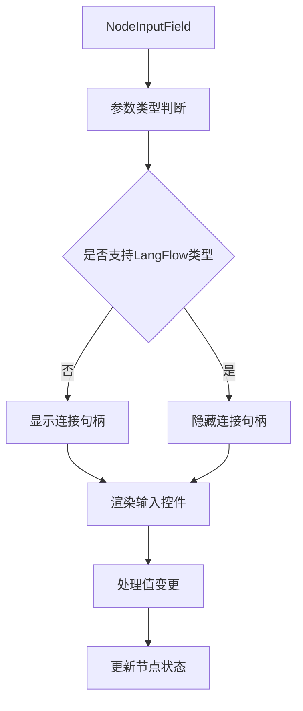
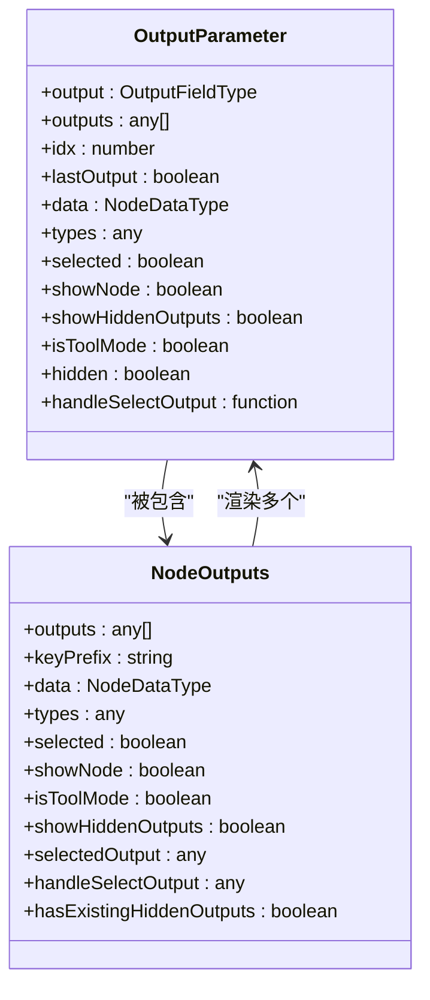
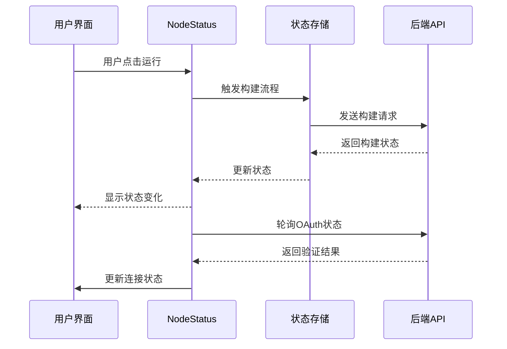
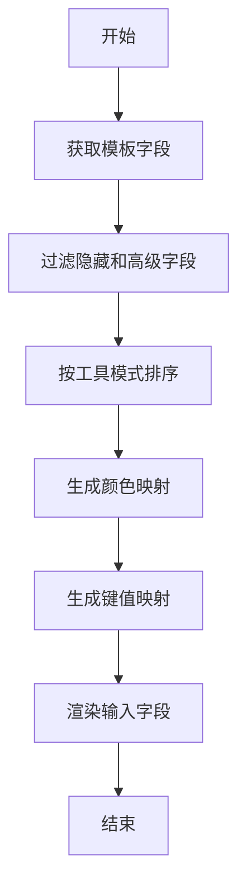
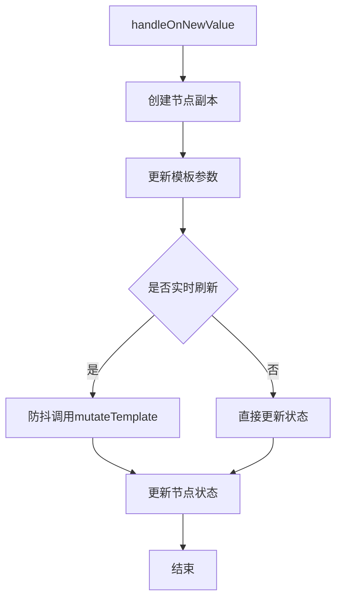
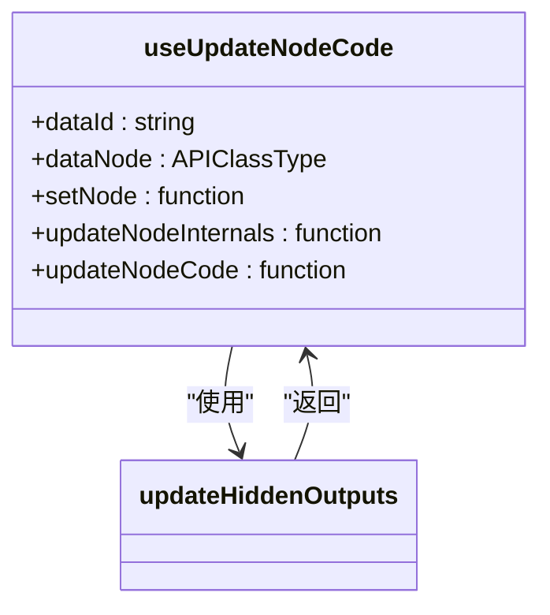

# 通用节点

<cite>
**本文档中引用的文件**  
- [index.tsx](file://vibe_surf/frontend/src/CustomNodes/GenericNode/index.tsx)
- [NodeInputField/index.tsx](file://vibe_surf/frontend/src/CustomNodes/GenericNode/components/NodeInputField/index.tsx)
- [NodeOutputParameter/index.tsx](file://vibe_surf/frontend/src/CustomNodes/GenericNode/components/NodeOutputParameter/index.tsx)
- [NodeOutputParameter/NodeOutputs.tsx](file://vibe_surf/frontend/src/CustomNodes/GenericNode/components/NodeOutputParameter/NodeOutputs.tsx)
- [NodeStatus/index.tsx](file://vibe_surf/frontend/src/CustomNodes/GenericNode/components/NodeStatus/index.tsx)
- [RenderInputParameters/index.tsx](file://vibe_surf/frontend/src/CustomNodes/GenericNode/components/RenderInputParameters/index.tsx)
- [hooks/use-handle-new-value.ts](file://vibe_surf/frontend/src/CustomNodes/hooks/use-handle-new-value.ts)
- [hooks/use-update-node-code.ts](file://vibe_surf/frontend/src/CustomNodes/hooks/use-update-node-code.ts)
- [helpers/update-hidden-outputs.ts](file://vibe_surf/frontend/src/CustomNodes/helpers/update-hidden-outputs.ts)
</cite>

## 目录
1. [简介](#简介)
2. [核心组件结构](#核心组件结构)
3. [节点参数处理机制](#节点参数处理机制)
4. [状态管理与UI渲染](#状态管理与ui渲染)
5. [自定义Hook功能分析](#自定义hook功能分析)
6. [配置选项与事件处理](#配置选项与事件处理)
7. [扩展与定制指南](#扩展与定制指南)

## 简介
通用节点（GenericNode）是可视化工作流系统中的核心UI组件，负责呈现和管理各类功能节点的可视化界面。该组件采用模块化设计，通过组合多个子组件实现完整的节点展示、交互和状态管理功能。通用节点支持参数输入、输出管理、状态显示、代码更新等多种功能，为用户提供直观的工作流构建体验。

**Section sources**
- [index.tsx](file://vibe_surf/frontend/src/CustomNodes/GenericNode/index.tsx#L1-L750)

## 核心组件结构
通用节点采用分层架构设计，由多个可复用的子组件构成，每个子组件负责特定的功能模块。

### NodeInputField组件
NodeInputField组件负责处理节点的输入参数渲染和交互。该组件根据参数类型动态渲染相应的输入控件，并支持连接句柄显示、参数标签、信息提示等功能。组件通过useHandleOnNewValue Hook处理参数值变更，确保数据的一致性和实时性。

**Diagram sources**
- [NodeInputField/index.tsx](file://vibe_surf/frontend/src/CustomNodes/GenericNode/components/NodeInputField/index.tsx#L1-L234)

### NodeOutputParameter组件
NodeOutputParameter组件管理节点的输出参数显示和选择逻辑。该组件包含OutputParameter和NodeOutputs两个子组件，分别负责单个输出项的渲染和输出列表的整体管理。组件支持隐藏输出、分组输出和循环输出等多种复杂场景。

**Diagram sources**
- [NodeOutputParameter/index.tsx](file://vibe_surf/frontend/src/CustomNodes/GenericNode/components/NodeOutputParameter/index.tsx#L1-L65)
- [NodeOutputParameter/NodeOutputs.tsx](file://vibe_surf/frontend/src/CustomNodes/GenericNode/components/NodeOutputParameter/NodeOutputs.tsx#L1-L121)

### NodeStatus组件
NodeStatus组件负责节点的构建状态显示和运行控制。该组件集成构建状态显示、连接管理、运行按钮等功能，提供完整的节点状态可视化。组件通过轮询机制监控OAuth连接状态，并支持构建过程的启动和停止操作。

**Diagram sources**
- [NodeStatus/index.tsx](file://vibe_surf/frontend/src/CustomNodes/GenericNode/components/NodeStatus/index.tsx#L1-L499)

**Section sources**
- [NodeInputField/index.tsx](file://vibe_surf/frontend/src/CustomNodes/GenericNode/components/NodeInputField/index.tsx#L1-L234)
- [NodeOutputParameter/index.tsx](file://vibe_surf/frontend/src/CustomNodes/GenericNode/components/NodeOutputParameter/index.tsx#L1-L65)
- [NodeOutputParameter/NodeOutputs.tsx](file://vibe_surf/frontend/src/CustomNodes/GenericNode/components/NodeOutputParameter/NodeOutputs.tsx#L1-L121)
- [NodeStatus/index.tsx](file://vibe_surf/frontend/src/CustomNodes/GenericNode/components/NodeStatus/index.tsx#L1-L499)

## 节点参数处理机制
通用节点通过一系列机制实现高效的参数处理和状态同步。

### 参数渲染流程
参数渲染通过RenderInputParameters组件实现，该组件负责收集、排序和渲染所有输入参数。渲染流程包括参数过滤、排序、颜色映射和键值生成等步骤，确保参数按正确的顺序和样式显示。

**Diagram sources**
- [RenderInputParameters/index.tsx](file://vibe_surf/frontend/src/CustomNodes/GenericNode/components/RenderInputParameters/index.tsx#L1-L130)

### 值变更处理
参数值的变更通过useHandleOnNewValue Hook统一处理。该Hook实现了防抖机制、快照管理和API调用等功能，确保用户输入能够正确地更新到节点状态中，并在必要时触发后端验证。

**Section sources**
- [RenderInputParameters/index.tsx](file://vibe_surf/frontend/src/CustomNodes/GenericNode/components/RenderInputParameters/index.tsx#L1-L130)

## 状态管理与UI渲染
通用节点采用Zustand状态管理库实现全局状态的高效管理。

### 状态同步机制
节点状态通过多个Store进行管理，包括flowStore、typesStore和shortcutsStore等。这些Store通过useShallow Hook实现精确的订阅，避免不必要的重新渲染。

### UI渲染优化
组件采用React.memo进行性能优化，对NodeIcon、NodeName、NodeStatus等子组件进行记忆化处理。同时使用useMemo和useCallback Hook缓存计算结果和函数引用，提升渲染性能。

**Section sources**
- [index.tsx](file://vibe_surf/frontend/src/CustomNodes/GenericNode/index.tsx#L1-L750)

## 自定义Hook功能分析
通用节点系统提供了多个自定义Hook，用于封装复杂的业务逻辑。

### use-handle-new-value Hook
该Hook负责处理节点参数的值变更操作。它集成了防抖、快照、状态更新和API调用等功能，确保参数变更能够正确地反映到系统状态中。

**Diagram sources**
- [hooks/use-handle-new-value.ts](file://vibe_surf/frontend/src/CustomNodes/hooks/use-handle-new-value.ts#L1-L169)

### use-update-node-code Hook
该Hook用于处理节点代码的更新操作。当组件代码需要更新时，该Hook负责将新的代码应用到节点，并更新相关的输出参数。

**Diagram sources**
- [hooks/use-update-node-code.ts](file://vibe_surf/frontend/src/CustomNodes/hooks/use-update-node-code.ts#L1-L55)

**Section sources**
- [hooks/use-handle-new-value.ts](file://vibe_surf/frontend/src/CustomNodes/hooks/use-handle-new-value.ts#L1-L169)
- [hooks/use-update-node-code.ts](file://vibe_surf/frontend/src/CustomNodes/hooks/use-update-node-code.ts#L1-L55)

## 配置选项与事件处理
通用节点支持多种配置选项和事件处理机制。

### 配置属性
- **showNode**: 控制节点是否展开显示详细信息
- **selected**: 标识节点是否被选中
- **isToolMode**: 指示是否处于工具模式
- **editNameDescription**: 控制是否可编辑节点名称和描述

### 事件处理
- **参数变更**: 通过handleOnNewValue处理
- **节点更新**: 通过handleUpdateCode处理
- **输出选择**: 通过handleSelectOutput处理
- **运行控制**: 通过handleClickRun处理

**Section sources**
- [index.tsx](file://vibe_surf/frontend/src/CustomNodes/GenericNode/index.tsx#L1-L750)

## 扩展与定制指南
开发者可以通过以下方式扩展和定制通用节点：

### 组件扩展
通过继承或组合现有组件，可以创建新的节点类型。例如，可以创建一个继承自GenericNode的SpecializedNode，添加特定领域的功能。

### 样式定制
通过CSS变量和Tailwind CSS类，可以轻松定制节点的外观样式，包括颜色、边框、阴影等。

### 功能增强
通过添加新的Hook或修改现有Hook，可以增强节点的功能，如添加新的验证规则、集成第三方服务等。

**Section sources**
- [index.tsx](file://vibe_surf/frontend/src/CustomNodes/GenericNode/index.tsx#L1-L750)
- [helpers/update-hidden-outputs.ts](file://vibe_surf/frontend/src/CustomNodes/helpers/update-hidden-outputs.ts#L1-L10)