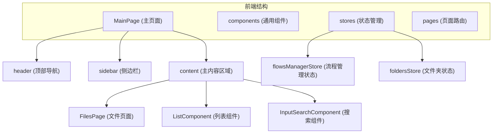
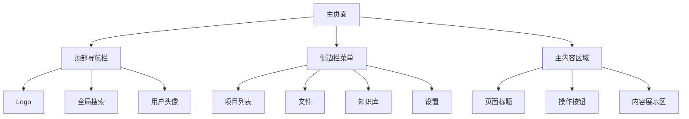
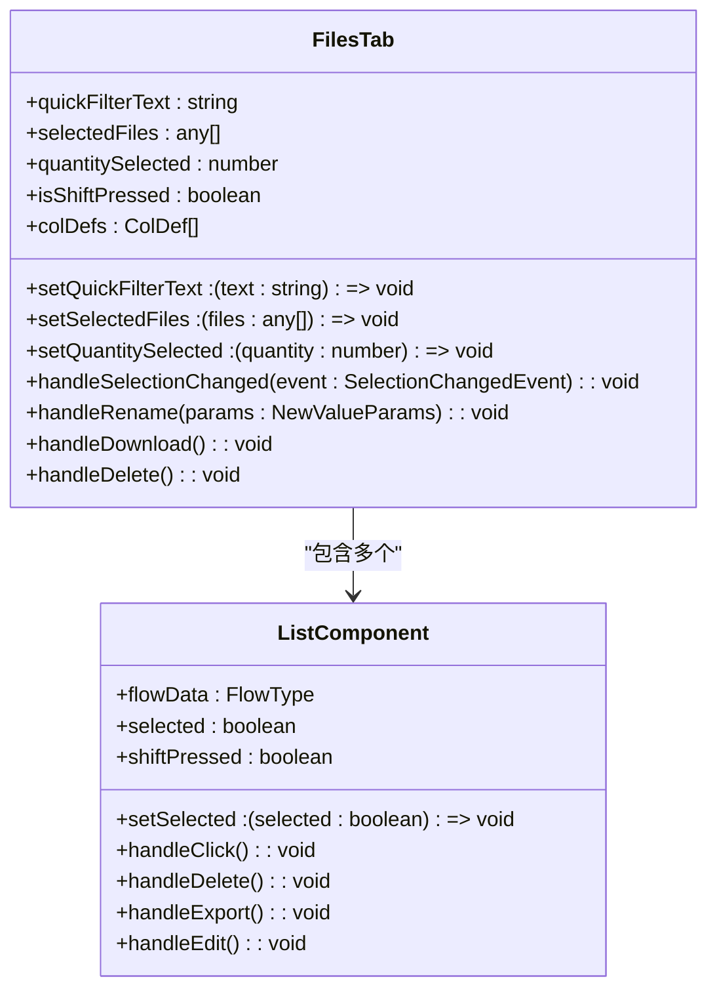
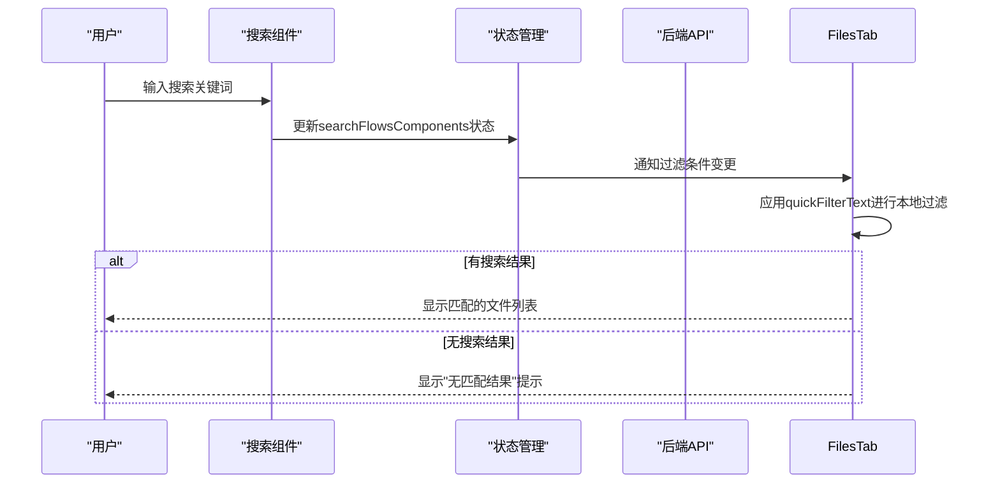
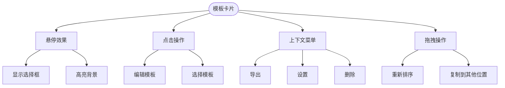
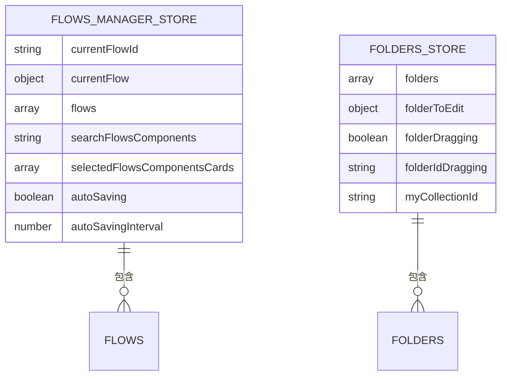

# 主页面架构

<cite>
**本文档中引用的文件**  
- [main-page.tsx](file://vibe_surf/frontend/src/pages/MainPage/pages/main-page.tsx)
- [list/index.tsx](file://vibe_surf/frontend/src/pages/MainPage/components/list/index.tsx)
- [inputSearchComponent/index.tsx](file://vibe_surf/frontend/src/pages/MainPage/components/inputSearchComponent/index.tsx)
- [filesPage/index.tsx](file://vibe_surf/frontend/src/pages/MainPage/pages/filesPage/index.tsx)
- [FilesTab.tsx](file://vibe_surf/frontend/src/pages/MainPage/pages/filesPage/components/FilesTab.tsx)
- [foldersStore.tsx](file://vibe_surf/frontend/src/stores/foldersStore.tsx)
- [flowsManagerStore.ts](file://vibe_surf/frontend/src/stores/flowsManagerStore.ts)
</cite>

## 目录
1. [项目结构](#项目结构)
2. [核心组件](#核心组件)
3. [布局结构](#布局结构)
4. [文件列表组件](#文件列表组件)
5. [搜索功能实现](#搜索功能实现)
6. [模板展示区域](#模板展示区域)
7. [页面状态管理](#页面状态管理)

## 项目结构

VibeSurf主页面的前端代码位于`vibe_surf/frontend/src`目录下，采用React + TypeScript技术栈，结合Zustand进行状态管理。主页面相关组件主要分布在`pages/MainPage`目录中，包括布局结构、文件列表、搜索功能等核心模块。

**Diagram sources**
- [main-page.tsx](file://vibe_surf/frontend/src/pages/MainPage/pages/main-page.tsx)
- [filesPage/index.tsx](file://vibe_surf/frontend/src/pages/MainPage/pages/filesPage/index.tsx)
- [flowsManagerStore.ts](file://vibe_surf/frontend/src/stores/flowsManagerStore.ts)

**Section sources**
- [main-page.tsx](file://vibe_surf/frontend/src/pages/MainPage/pages/main-page.tsx)
- [filesPage/index.tsx](file://vibe_surf/frontend/src/pages/MainPage/pages/filesPage/index.tsx)

## 核心组件

主页面的核心功能由多个组件协同完成，包括布局容器、文件列表、搜索输入框、文件操作等功能模块。这些组件通过React的组合模式构建出完整的用户界面。

**Section sources**
- [main-page.tsx](file://vibe_surf/frontend/src/pages/MainPage/pages/main-page.tsx)
- [list/index.tsx](file://vibe_surf/frontend/src/pages/MainPage/components/list/index.tsx)
- [inputSearchComponent/index.tsx](file://vibe_surf/frontend/src/pages/MainPage/components/inputSearchComponent/index.tsx)

## 布局结构

主页面采用现代化的三栏布局设计，包含顶部导航栏、侧边栏菜单和主内容区域，具有良好的响应式特性。

**Diagram sources**
- [main-page.tsx](file://vibe_surf/frontend/src/pages/MainPage/pages/main-page.tsx)
- [filesPage/index.tsx](file://vibe_surf/frontend/src/pages/MainPage/pages/filesPage/index.tsx)

**Section sources**
- [main-page.tsx](file://vibe_surf/frontend/src/pages/MainPage/pages/main-page.tsx)
- [filesPage/index.tsx](file://vibe_surf/frontend/src/pages/MainPage/pages/filesPage/index.tsx)

## 文件列表组件

文件列表组件实现了分页加载、排序过滤和虚拟滚动优化等高级功能，提供流畅的用户体验。

### 列表项实现

文件列表项组件`ListComponent`采用卡片式布局，包含图标、名称、修改时间和操作菜单等元素。通过`ag-grid-react`实现表格渲染，支持列排序、过滤和编辑功能。

**Diagram sources**
- [list/index.tsx](file://vibe_surf/frontend/src/pages/MainPage/components/list/index.tsx)
- [FilesTab.tsx](file://vibe_surf/frontend/src/pages/MainPage/pages/filesPage/components/FilesTab.tsx)

**Section sources**
- [list/index.tsx](file://vibe_surf/frontend/src/pages/MainPage/components/list/index.tsx)
- [FilesTab.tsx](file://vibe_surf/frontend/src/pages/MainPage/pages/filesPage/components/FilesTab.tsx)

## 搜索功能实现

搜索功能通过实时搜索、模糊匹配和搜索历史管理为用户提供高效的文件查找体验。

### 搜索机制

搜索组件`InputSearchComponent`监听用户输入事件，通过`onChange`和`onKeyDown`回调处理搜索逻辑。搜索功能支持根据当前页面路径动态调整占位符文本，提供上下文相关的搜索体验。

**Diagram sources**
- [inputSearchComponent/index.tsx](file://vibe_surf/frontend/src/pages/MainPage/components/inputSearchComponent/index.tsx)
- [flowsManagerStore.ts](file://vibe_surf/frontend/src/stores/flowsManagerStore.ts)

**Section sources**
- [inputSearchComponent/index.tsx](file://vibe_surf/frontend/src/pages/MainPage/components/inputSearchComponent/index.tsx)
- [flowsManagerStore.ts](file://vibe_surf/frontend/src/stores/flowsManagerStore.ts)

## 模板展示区域

模板展示区域采用卡片式布局，提供直观的视觉呈现和丰富的交互功能。

### 交互设计

模板卡片支持悬停效果和快速启动功能。用户可以通过Shift键进行多选操作，通过点击省略号按钮访问上下文菜单，执行编辑、导出、删除等操作。

**Diagram sources**
- [list/index.tsx](file://vibe_surf/frontend/src/pages/MainPage/components/list/index.tsx)
- [FilesTab.tsx](file://vibe_surf/frontend/src/pages/MainPage/pages/filesPage/components/FilesTab.tsx)

**Section sources**
- [list/index.tsx](file://vibe_surf/frontend/src/pages/MainPage/components/list/index.tsx)
- [FilesTab.tsx](file://vibe_surf/frontend/src/pages/MainPage/pages/filesPage/components/FilesTab.tsx)

## 页面状态管理

页面状态通过Zustand全局store进行管理，确保状态的一致性和可预测性。

### 状态管理方案

系统使用多个Zustand store来管理不同维度的状态。`flowsManagerStore`负责管理文件列表、搜索状态和用户选择，`foldersStore`负责管理文件夹相关的状态。

**Diagram sources**
- [flowsManagerStore.ts](file://vibe_surf/frontend/src/stores/flowsManagerStore.ts)
- [foldersStore.tsx](file://vibe_surf/frontend/src/stores/foldersStore.tsx)

**Section sources**
- [flowsManagerStore.ts](file://vibe_surf/frontend/src/stores/flowsManagerStore.ts)
- [foldersStore.tsx](file://vibe_surf/frontend/src/stores/foldersStore.tsx)