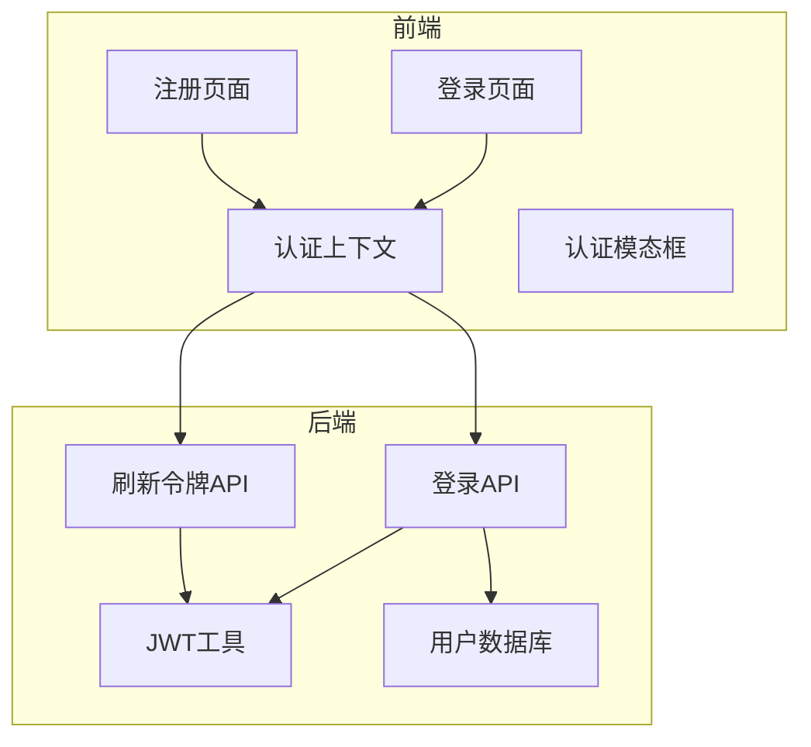
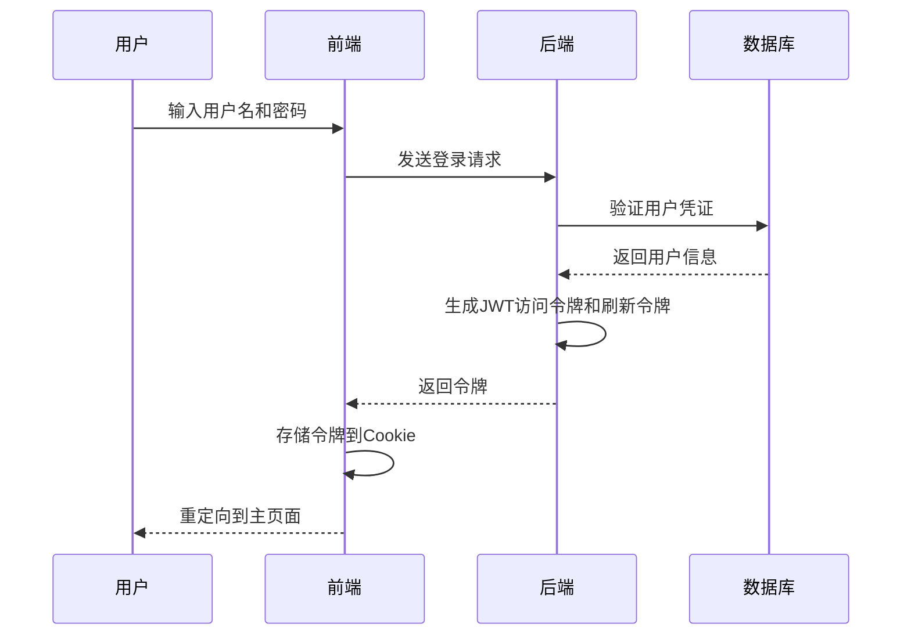
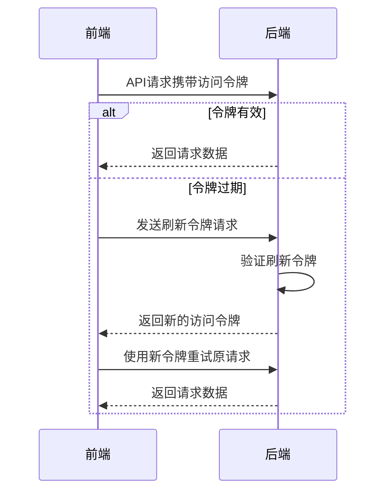
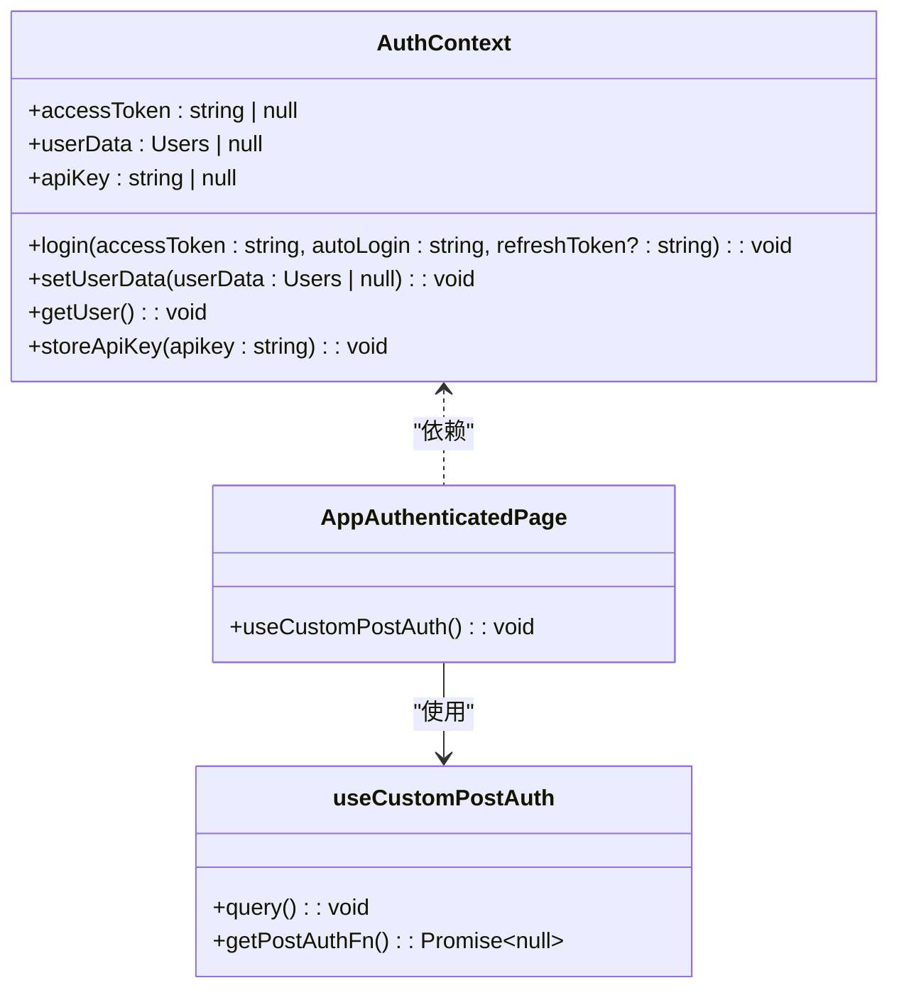
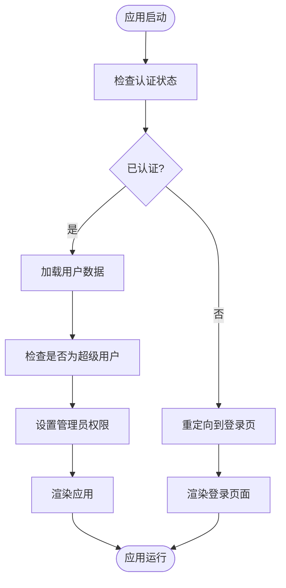
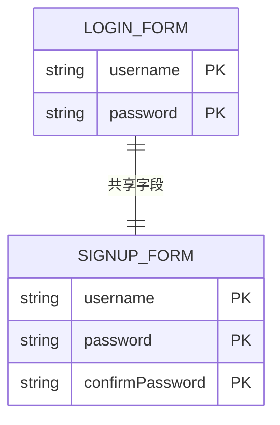
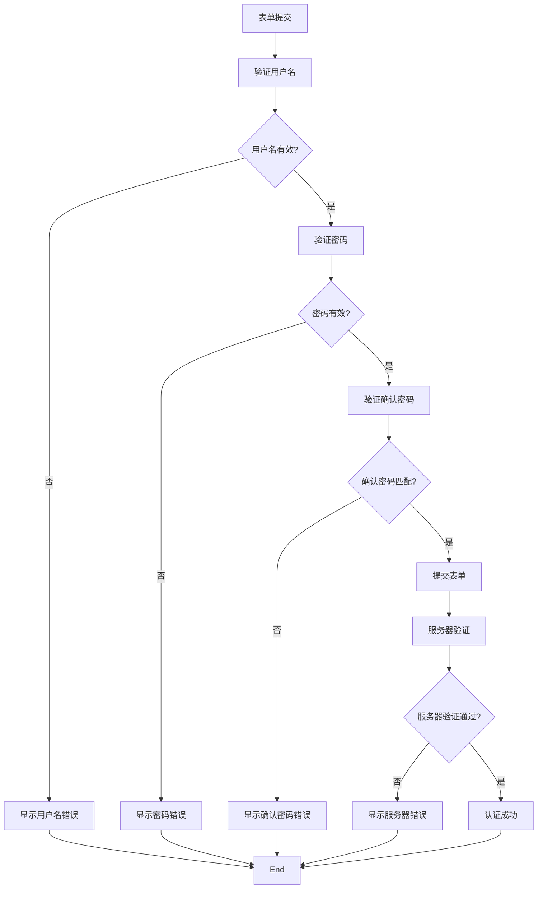
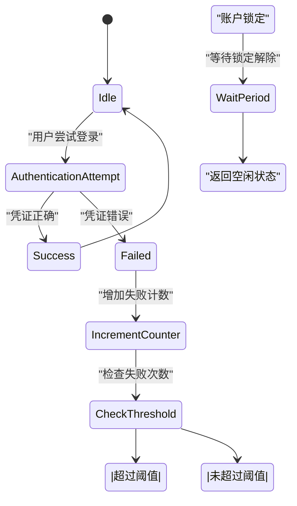
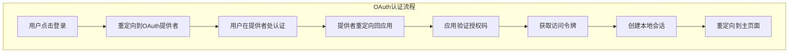

# 认证页面架构

<cite>
**本文档中引用的文件**  
- [LoginPage/index.tsx](file://vibe_surf/frontend/src/pages/LoginPage/index.tsx)
- [SignUpPage/index.tsx](file://vibe_surf/frontend/src/pages/SignUpPage/index.tsx)
- [authContext.tsx](file://vibe_surf/frontend/src/contexts/authContext.tsx)
- [use-post-login-user.ts](file://vibe_surf/frontend/src/controllers/API/queries/auth/use-post-login-user.ts)
- [use-post-add-user.ts](file://vibe_surf/frontend/src/controllers/API/queries/auth/use-post-add-user.ts)
- [use-get-user.ts](file://vibe_surf/frontend/src/controllers/API/queries/auth/use-get-user.ts)
- [utils.py](file://vibe_surf/langflow/services/auth/utils.py)
- [login.py](file://vibe_surf/langflow/api/v1/login.py)
- [AppAuthenticatedPage/index.tsx](file://vibe_surf/frontend/src/pages/AppAuthenticatedPage/index.tsx)
- [use-custom-post-auth.ts](file://vibe_surf/frontend/src/customization/hooks/use-custom-post-auth.ts)
- [authModal/index.tsx](file://vibe_surf/frontend/src/modals/authModal/index.tsx)
- [sidepanel.html](file://vibe_surf/chrome_extension/sidepanel.html)
</cite>

## 目录
1. [项目结构](#项目结构)
2. [核心组件](#核心组件)
3. [认证流程实现](#认证流程实现)
4. [全局状态管理机制](#全局状态管理机制)
5. [表单设计与验证](#表单设计与验证)
6. [错误处理策略](#错误处理策略)
7. [安全最佳实践](#安全最佳实践)

## 项目结构

VibeSurf项目的认证功能主要分布在前端和后端两个部分。前端认证相关代码位于`vibe_surf/frontend/src/pages/`目录下，包含登录和注册页面的实现。核心认证逻辑通过`contexts/authContext.tsx`提供全局状态管理。后端认证服务位于`vibe_surf/langflow/api/v1/login.py`和`vibe_surf/langflow/services/auth/utils.py`中，处理JWT令牌生成、验证和刷新等核心功能。

**Diagram sources**
- [LoginPage/index.tsx](file://vibe_surf/frontend/src/pages/LoginPage/index.tsx)
- [SignUpPage/index.tsx](file://vibe_surf/frontend/src/pages/SignUpPage/index.tsx)
- [authContext.tsx](file://vibe_surf/frontend/src/contexts/authContext.tsx)
- [login.py](file://vibe_surf/langflow/api/v1/login.py)
- [utils.py](file://vibe_surf/langflow/services/auth/utils.py)

**Section sources**
- [LoginPage/index.tsx](file://vibe_surf/frontend/src/pages/LoginPage/index.tsx)
- [SignUpPage/index.tsx](file://vibe_surf/frontend/src/pages/SignUpPage/index.tsx)
- [authContext.tsx](file://vibe_surf/frontend/src/contexts/authContext.tsx)
- [login.py](file://vibe_surf/langflow/api/v1/login.py)

## 核心组件

认证系统的核心组件包括登录页面、注册页面、认证上下文和后端认证API。登录和注册页面负责用户界面交互，认证上下文管理全局认证状态，后端API处理认证逻辑和令牌管理。

**Section sources**
- [LoginPage/index.tsx](file://vibe_surf/frontend/src/pages/LoginPage/index.tsx)
- [SignUpPage/index.tsx](file://vibe_surf/frontend/src/pages/SignUpPage/index.tsx)
- [authContext.tsx](file://vibe_surf/frontend/src/contexts/authContext.tsx)

## 认证流程实现

### JWT令牌管理

VibeSurf使用JWT（JSON Web Token）进行用户认证。当用户成功登录时，后端生成包含用户ID和令牌类型的访问令牌和刷新令牌。访问令牌用于常规API请求认证，刷新令牌用于在访问令牌过期后获取新的访问令牌。

**Diagram sources**
- [use-post-login-user.ts](file://vibe_surf/frontend/src/controllers/API/queries/auth/use-post-login-user.ts)
- [login.py](file://vibe_surf/langflow/api/v1/login.py)
- [utils.py](file://vibe_surf/langflow/services/auth/utils.py)

### 会话持久化和自动刷新机制

系统通过Cookie实现会话持久化，将访问令牌和刷新令牌存储在HTTP-only Cookie中，提高安全性。当访问令牌即将过期时，系统自动使用刷新令牌获取新的访问令牌，实现无缝的会话续期。

**Diagram sources**
- [authContext.tsx](file://vibe_surf/frontend/src/contexts/authContext.tsx)
- [login.py](file://vibe_surf/langflow/api/v1/login.py)

**Section sources**
- [authContext.tsx](file://vibe_surf/frontend/src/contexts/authContext.tsx)
- [login.py](file://vibe_surf/langflow/api/v1/login.py)
- [utils.py](file://vibe_surf/langflow/services/auth/utils.py)

## 全局状态管理机制

### AppWrapperPage的全局状态管理

AppWrapperPage通过React Context API实现全局状态管理，特别是用户认证状态的管理。`AuthProvider`组件封装了整个应用，提供统一的认证状态访问接口。

**Diagram sources**
- [authContext.tsx](file://vibe_surf/frontend/src/contexts/authContext.tsx)
- [AppAuthenticatedPage/index.tsx](file://vibe_surf/frontend/src/pages/AppAuthenticatedPage/index.tsx)
- [use-custom-post-auth.ts](file://vibe_surf/frontend/src/customization/hooks/use-custom-post-auth.ts)

### 用户认证状态和权限控制

系统通过`AuthContext`管理用户认证状态，包括访问令牌、用户数据和API密钥。权限控制基于用户角色（如超级用户）实现，确保不同权限级别的用户只能访问相应的功能。

**Diagram sources**
- [authContext.tsx](file://vibe_surf/frontend/src/contexts/authContext.tsx)
- [use-get-user.ts](file://vibe_surf/frontend/src/controllers/API/queries/auth/use-get-user.ts)

**Section sources**
- [authContext.tsx](file://vibe_surf/frontend/src/contexts/authContext.tsx)
- [use-get-user.ts](file://vibe_surf/frontend/src/controllers/API/queries/auth/use-get-user.ts)

## 表单设计与验证

### 登录和注册页面的表单设计

登录和注册页面采用一致的设计模式，使用Radix UI的表单组件实现。表单包含用户名、密码和确认密码（注册页面）字段，通过React状态管理用户输入。

### 字段验证和错误提示

系统实现了客户端和服务器端双重验证。客户端验证包括必填字段检查和密码一致性验证，服务器端验证确保用户名唯一性和密码强度要求。

**Diagram sources**
- [LoginPage/index.tsx](file://vibe_surf/frontend/src/pages/LoginPage/index.tsx)
- [SignUpPage/index.tsx](file://vibe_surf/frontend/src/pages/SignUpPage/index.tsx)

**Section sources**
- [LoginPage/index.tsx](file://vibe_surf/frontend/src/pages/LoginPage/index.tsx)
- [SignUpPage/index.tsx](file://vibe_surf/frontend/src/pages/SignUpPage/index.tsx)

## 错误处理策略

### 网络异常处理

系统通过React Query的错误处理机制捕获网络异常，在用户界面显示友好的错误提示，同时记录错误日志用于调试。

### 认证失败和账户锁定处理

当用户认证失败时，系统返回详细的错误信息，如"用户名或密码错误"。对于多次失败的登录尝试，系统可能实施账户锁定策略以防止暴力破解。

**Diagram sources**
- [use-post-login-user.ts](file://vibe_surf/frontend/src/controllers/API/queries/auth/use-post-login-user.ts)
- [utils.py](file://vibe_surf/langflow/services/auth/utils.py)

**Section sources**
- [use-post-login-user.ts](file://vibe_surf/frontend/src/controllers/API/queries/auth/use-post-login-user.ts)
- [utils.py](file://vibe_surf/langflow/services/auth/utils.py)

## 安全最佳实践

### 密码强度检查

系统在服务器端实施密码强度检查，要求密码达到一定的复杂度标准，包括最小长度、包含大小写字母、数字和特殊字符等。

### 双因素认证支持

虽然当前代码中未完全实现，但系统架构支持双因素认证（2FA）。`authModal`组件中包含了OAuth相关的配置字段，为未来实现2FA预留了接口。

**Diagram sources**
- [authModal/index.tsx](file://vibe_surf/frontend/src/modals/authModal/index.tsx)
- [sidepanel.html](file://vibe_surf/chrome_extension/sidepanel.html)

### CSRF防护

系统通过使用安全的Cookie属性（HttpOnly、Secure、SameSite）来防止跨站脚本攻击（XSS）和跨站请求伪造（CSRF）攻击。访问令牌和刷新令牌都设置为HttpOnly，防止JavaScript访问。

**Section sources**
- [authContext.tsx](file://vibe_surf/frontend/src/contexts/authContext.tsx)
- [login.py](file://vibe_surf/langflow/api/v1/login.py)
- [utils.py](file://vibe_surf/langflow/services/auth/utils.py)