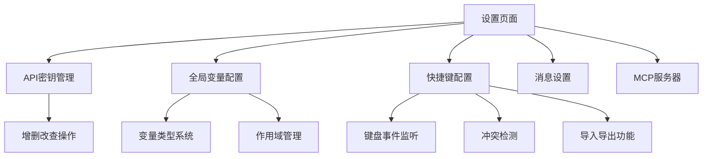
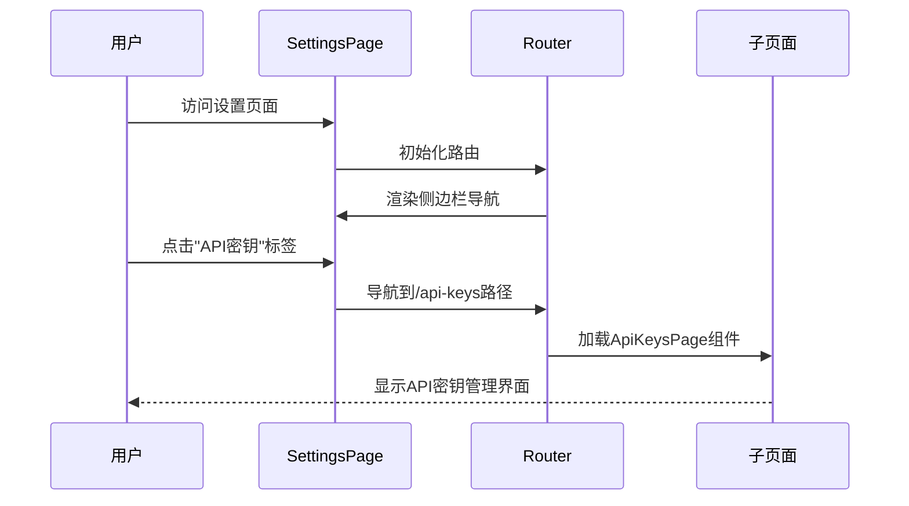
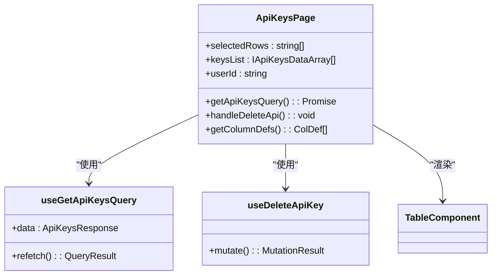
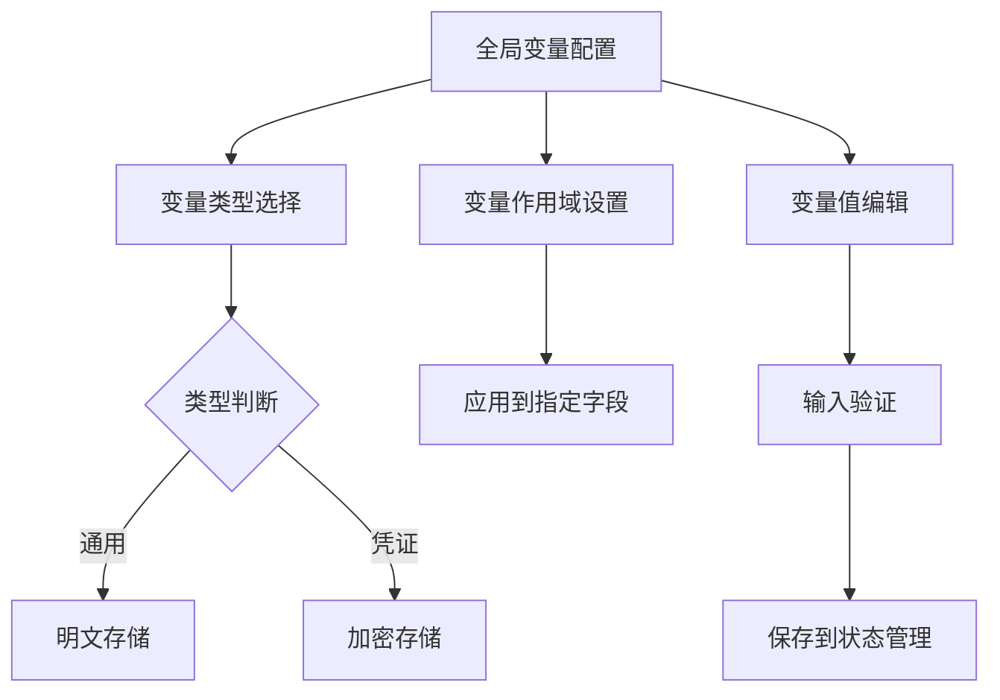
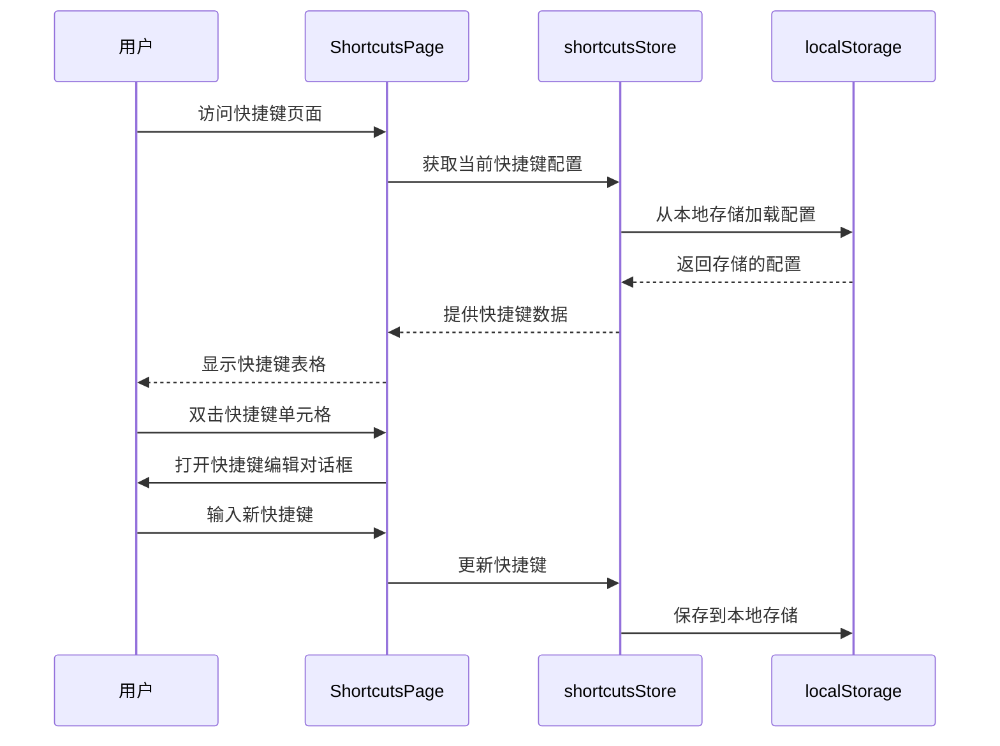

# 设置页面架构

<cite>
**本文档中引用的文件**  
- [settings-general.js](file://vibe_surf/chrome_extension/scripts/settings-general.js)
- [settings-integrations.js](file://vibe_surf/chrome_extension/scripts/settings-integrations.js)
- [settings-manager.js](file://vibe_surf/chrome_extension/scripts/settings-manager.js)
- [settings-profiles.js](file://vibe_surf/chrome_extension/scripts/settings-profiles.js)
- [settings-workflow.js](file://vibe_surf/chrome_extension/scripts/settings-workflow.js)
- [user-settings-storage.js](file://vibe_surf/chrome_extension/scripts/user-settings-storage.js)
- [settings-environment.css](file://vibe_surf/chrome_extension/styles/settings-environment.css)
- [settings-forms.css](file://vibe_surf/chrome_extension/styles/settings-forms.css)
- [settings-integrations.css](file://vibe_surf/chrome_extension/styles/settings-integrations.css)
- [settings-modal.css](file://vibe_surf/chrome_extension/styles/settings-modal.css)
- [settings-profiles.css](file://vibe_surf/chrome_extension/styles/settings-profiles.css)
- [settings-responsive.css](file://vibe_surf/chrome_extension/styles/settings-responsive.css)
- [settings-utilities.css](file://vibe_surf/chrome_extension/styles/settings-utilities.css)
- [settings-workflow.css](file://vibe_surf/chrome_extension/styles/settings-workflow.css)
- [routes.tsx](file://vibe_surf/frontend/src/routes.tsx)
- [SettingsPage/index.tsx](file://vibe_surf/frontend/src/pages/SettingsPage/index.tsx)
- [ApiKeysPage/index.tsx](file://vibe_surf/frontend/src/pages/SettingsPage/pages/ApiKeysPage/index.tsx)
- [GlobalVariablesPage/index.tsx](file://vibe_surf/frontend/src/pages/SettingsPage/pages/GlobalVariablesPage/index.tsx)
- [ShortcutsPage/index.tsx](file://vibe_surf/frontend/src/pages/SettingsPage/pages/ShortcutsPage/index.tsx)
- [shortcuts.ts](file://vibe_surf/frontend/src/stores/shortcuts.ts)
- [use-overlap-shortcuts.ts](file://vibe_surf/frontend/src/hooks/use-overlap-shortcuts.ts)
- [constants.ts](file://vibe_surf/frontend/src/constants/constants.ts)
- [use-get-api-keys.ts](file://vibe_surf/frontend/src/controllers/API/queries/api-keys/use-get-api-keys.ts)
- [use-delete-global-variables.ts](file://vibe_surf/frontend/src/controllers/API/queries/variables/use-delete-global-variables.ts)
- [use-get-global-variables.ts](file://vibe_surf/frontend/src/controllers/API/queries/variables/use-get-global-variables.ts)
- [use-get-mutation-global-variables.ts](file://vibe_surf/frontend/src/controllers/API/queries/variables/use-get-mutation-global-variables.ts)
- [use-patch-global-variables.ts](file://vibe_surf/frontend/src/controllers/API/queries/variables/use-patch-global-variables.ts)
- [use-post-global-variables.ts](file://vibe_surf/frontend/src/controllers/API/queries/variables/use-post-global-variables.ts)
</cite>

## 目录
1. [项目结构](#项目结构)
2. [多标签界面实现](#多标签界面实现)
3. [API密钥管理](#api密钥管理)
4. [全局变量配置](#全局变量配置)
5. [快捷键配置](#快捷键配置)
6. [表单验证与错误处理](#表单验证与错误处理)

## 项目结构

VibeSurf设置页面的前端实现主要位于`vibe_surf/frontend/src/pages/SettingsPage`目录下，采用React框架和TypeScript语言构建。该页面通过React Router实现路由管理，支持多标签界面的导航和状态管理。

**图示来源**
- [SettingsPage/index.tsx](file://vibe_surf/frontend/src/pages/SettingsPage/index.tsx)
- [routes.tsx](file://vibe_surf/frontend/src/routes.tsx)

**本节来源**
- [SettingsPage/index.tsx](file://vibe_surf/frontend/src/pages/SettingsPage/index.tsx)
- [routes.tsx](file://vibe_surf/frontend/src/routes.tsx)

## 多标签界面实现

设置页面采用侧边栏导航模式实现多标签界面，通过React Router的嵌套路由机制管理不同设置模块的切换。主设置页面组件`SettingsPage`使用`SidebarProvider`和`SideBarButtonsComponent`构建导航侧边栏，每个标签对应一个独立的路由路径。

侧边栏的导航项通过JavaScript数组`sidebarNavItems`动态构建，每个导航项包含标题、路由路径和图标。页面使用`Outlet`组件作为子路由的占位符，实现内容区域的动态切换。标签切换时，页面通过CSS过渡动画实现平滑的视觉效果，提升用户体验。

**图示来源**
- [SettingsPage/index.tsx](file://vibe_surf/frontend/src/pages/SettingsPage/index.tsx)
- [routes.tsx](file://vibe_surf/frontend/src/routes.tsx)

**本节来源**
- [SettingsPage/index.tsx](file://vibe_surf/frontend/src/pages/SettingsPage/index.tsx)
- [routes.tsx](file://vibe_surf/frontend/src/routes.tsx)

## API密钥管理

API密钥管理页面提供完整的密钥生命周期管理功能，包括创建、查看、更新和删除操作。系统采用加密存储机制保护密钥安全，并记录密钥使用统计信息。

### 功能实现

API密钥管理基于AG Grid表格组件实现数据展示和交互，支持多选删除、分页浏览和选择状态管理。页面通过`useGetApiKeysQuery`和`useDeleteApiKey`等自定义Hook与后端API进行数据交互。

### 安全机制

系统通过以下机制确保API密钥的安全性：
1. **加密存储**：密钥在数据库中采用加密方式存储
2. **访问控制**：只有授权用户才能访问密钥管理功能
3. **使用统计**：记录密钥最后使用时间，便于监控和审计
4. **错误处理**：提供详细的错误信息反馈，帮助用户排查问题

当用户删除密钥时，系统会根据删除数量显示相应的成功或错误提示信息，确保操作的可追溯性。

**图示来源**
- [ApiKeysPage/index.tsx](file://vibe_surf/frontend/src/pages/SettingsPage/pages/ApiKeysPage/index.tsx)
- [use-get-api-keys.ts](file://vibe_surf/frontend/src/controllers/API/queries/api-keys/use-get-api-keys.ts)

**本节来源**
- [ApiKeysPage/index.tsx](file://vibe_surf/frontend/src/pages/SettingsPage/pages/ApiKeysPage/index.tsx)
- [use-get-api-keys.ts](file://vibe_surf/frontend/src/controllers/API/queries/api-keys/use-get-api-keys.ts)

## 全局变量配置

全局变量配置页面实现了一个灵活的变量管理系统，支持不同类型变量的定义和管理，为应用程序提供统一的配置中心。

### 变量类型系统

系统支持两种主要变量类型：
- **通用变量**：用于存储普通配置值
- **凭证变量**：用于存储敏感信息，如密码、令牌等

### 作用域管理

每个全局变量可以指定应用到哪些字段，通过`default_fields`属性实现作用域控制。系统使用Zustand状态管理库维护变量状态，确保数据的一致性和响应性。

页面实现中，`GlobalVariablesPage`组件通过`useGetGlobalVariables`和`useDeleteGlobalVariables`等Hook与后端交互，获取和更新变量数据。表格支持行点击编辑功能，用户可以直接在表格中修改变量值。

**图示来源**
- [GlobalVariablesPage/index.tsx](file://vibe_surf/frontend/src/pages/SettingsPage/pages/GlobalVariablesPage/index.tsx)
- [use-get-global-variables.ts](file://vibe_surf/frontend/src/controllers/API/queries/variables/use-get-global-variables.ts)

**本节来源**
- [GlobalVariablesPage/index.tsx](file://vibe_surf/frontend/src/pages/SettingsPage/pages/GlobalVariablesPage/index.tsx)
- [use-get-global-variables.ts](file://vibe_surf/frontend/src/controllers/API/queries/variables/use-get-global-variables.ts)

## 快捷键配置

快捷键配置页面提供了一套完整的键盘快捷方式管理系统，支持自定义快捷键、冲突检测和配置导入导出功能。

### 交互设计

系统采用表格形式展示所有可用的快捷键，每行显示功能名称和对应的键盘组合。用户可以通过双击快捷键单元格来修改快捷方式。

### 冲突检测

系统通过`useKeyboardShortcut` Hook实现快捷键冲突检测，确保新设置的快捷键不会与现有快捷键冲突。该Hook会监听键盘事件，解析快捷键组合，并检查是否存在冲突。

快捷键配置支持"mod"键的智能识别，在Mac系统上自动映射为Command键，在其他系统上映射为Ctrl键，提供跨平台的一致体验。

**图示来源**
- [ShortcutsPage/index.tsx](file://vibe_surf/frontend/src/pages/SettingsPage/pages/ShortcutsPage/index.tsx)
- [shortcuts.ts](file://vibe_surf/frontend/src/stores/shortcuts.ts)
- [use-overlap-shortcuts.ts](file://vibe_surf/frontend/src/hooks/use-overlap-shortcuts.ts)

**本节来源**
- [ShortcutsPage/index.tsx](file://vibe_surf/frontend/src/pages/SettingsPage/pages/ShortcutsPage/index.tsx)
- [shortcuts.ts](file://vibe_surf/frontend/src/stores/shortcuts.ts)
- [use-overlap-shortcuts.ts](file://vibe_surf/frontend/src/hooks/use-overlap-shortcuts.ts)

## 表单验证与错误处理

系统实现了全面的表单验证策略和错误处理机制，确保用户输入的准确性和系统的稳定性。

### 验证策略

表单验证采用多层次验证策略：
1. **前端验证**：在用户输入时实时验证数据格式
2. **提交验证**：在表单提交前进行完整性检查
3. **后端验证**：服务器端进行最终验证和安全检查

系统通过Zustand状态管理库维护表单状态，使用自定义Hook封装验证逻辑，提高代码复用性。

### 错误处理

错误处理机制包括：
- **用户友好提示**：使用清晰的错误消息指导用户修正问题
- **错误分类**：区分不同类型的错误，提供针对性的解决方案
- **日志记录**：记录错误信息用于后续分析和改进
- **恢复机制**：提供操作撤销和数据恢复功能

当发生错误时，系统通过全局状态管理通知用户，并在界面中突出显示有问题的表单字段，帮助用户快速定位和解决问题。

**本节来源**
- [constants.ts](file://vibe_surf/frontend/src/constants/constants.ts)
- [use-overlap-shortcuts.ts](file://vibe_surf/frontend/src/hooks/use-overlap-shortcuts.ts)
- [shortcuts.ts](file://vibe_surf/frontend/src/stores/shortcuts.ts)