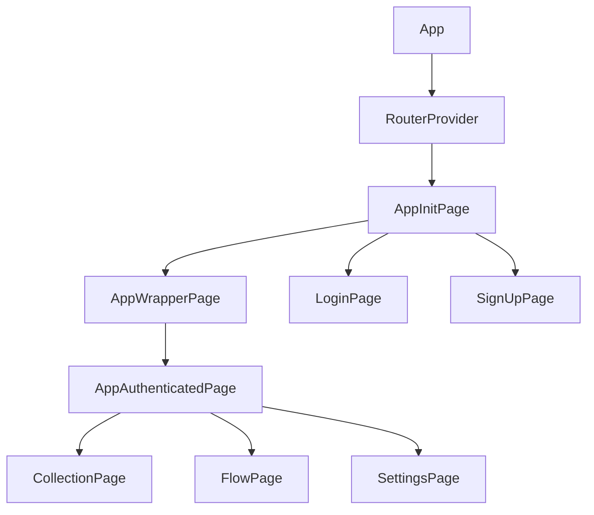
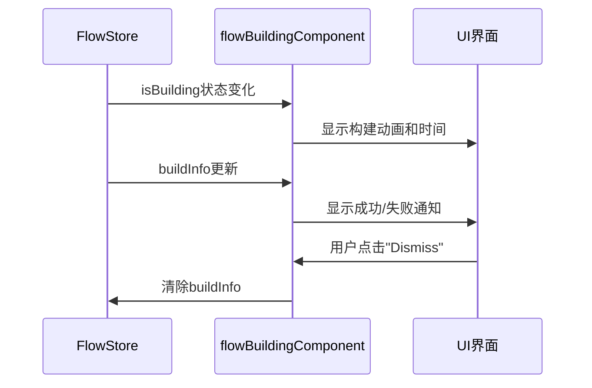
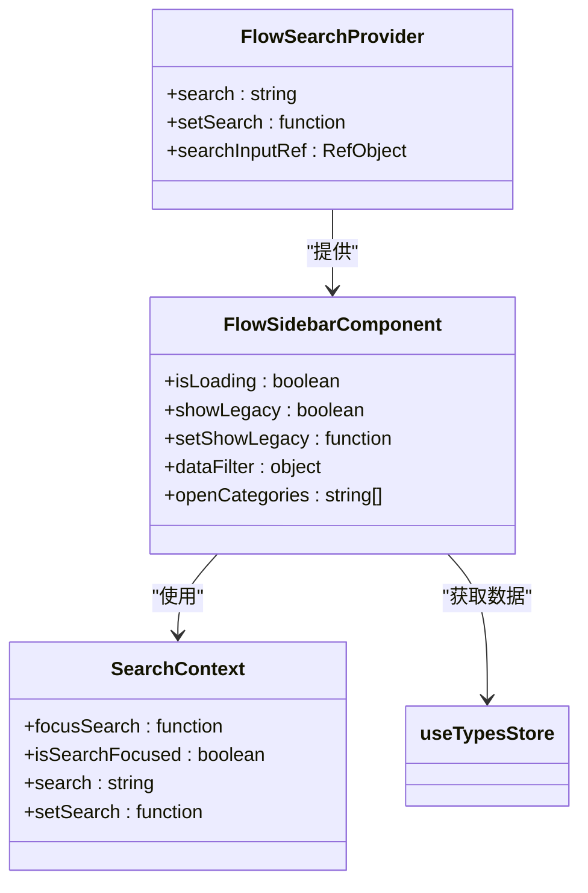
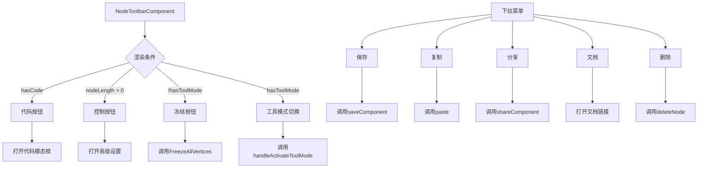
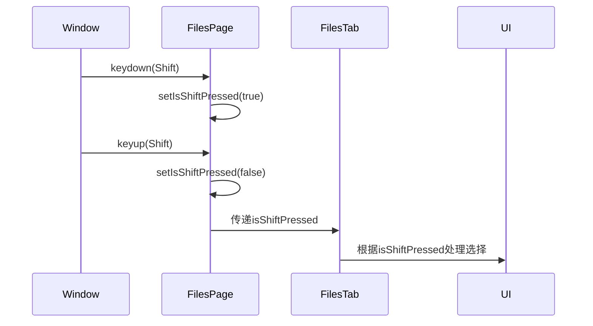
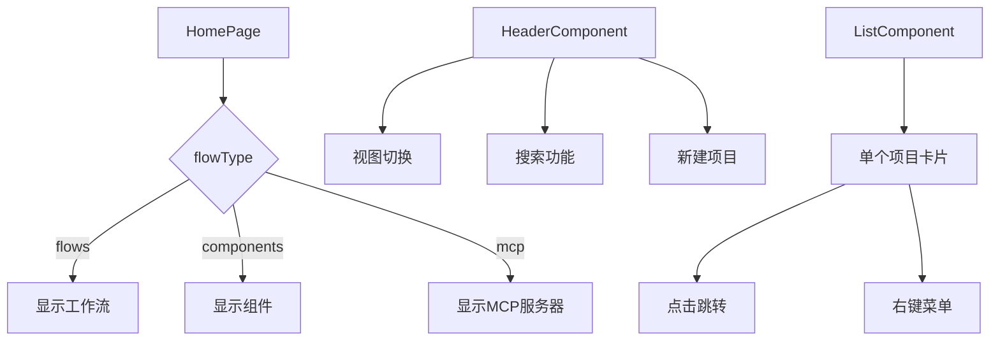
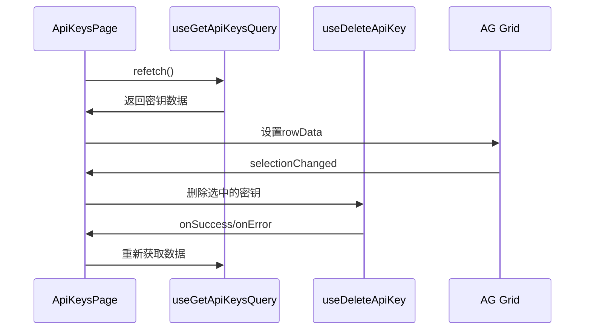
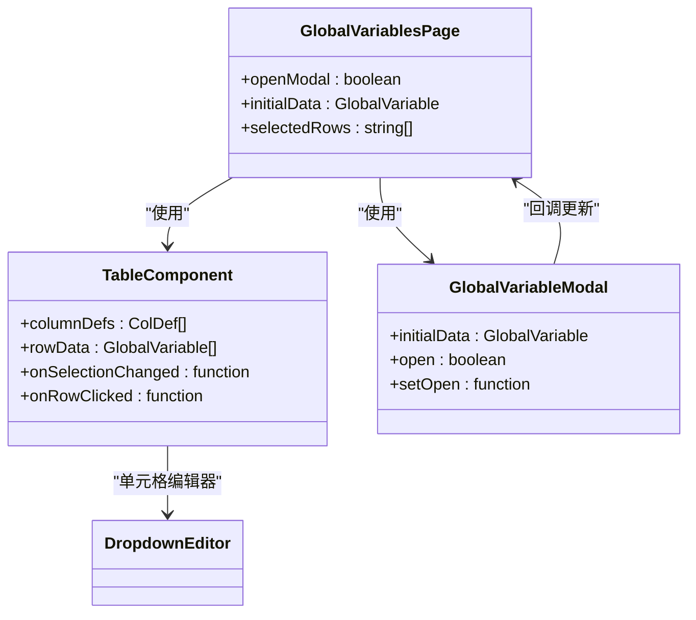
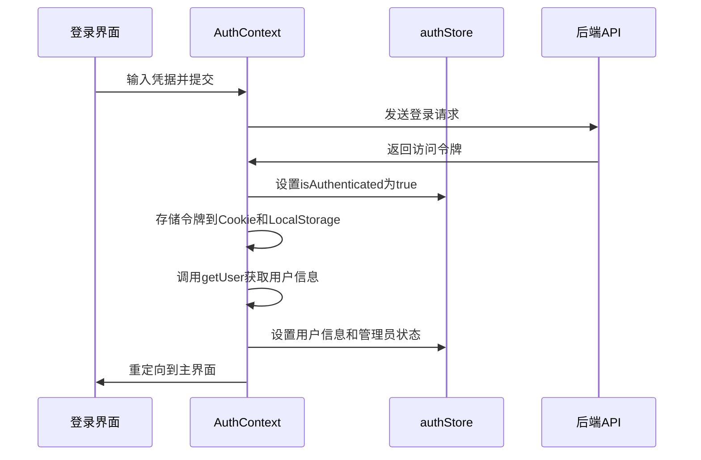
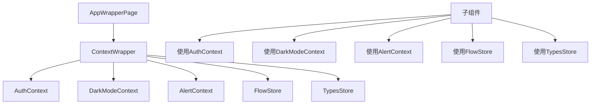

# 页面架构

<cite>
**本文档中引用的文件**  
- [App.tsx](file://vibe_surf/frontend/src/App.tsx)
- [routes.tsx](file://vibe_surf/frontend/src/routes.tsx)
- [authContext.tsx](file://vibe_surf/frontend/src/contexts/authContext.tsx)
- [FlowPage/index.tsx](file://vibe_surf/frontend/src/pages/FlowPage/index.tsx)
- [flowBuildingComponent/index.tsx](file://vibe_surf/frontend/src/pages/FlowPage/components/flowBuildingComponent/index.tsx)
- [flowSidebarComponent/index.tsx](file://vibe_surf/frontend/src/pages/FlowPage/components/flowSidebarComponent/index.tsx)
- [nodeToolbarComponent/index.tsx](file://vibe_surf/frontend/src/pages/FlowPage/components/nodeToolbarComponent/index.tsx)
- [main-page.tsx](file://vibe_surf/frontend/src/pages/MainPage/pages/main-page.tsx)
- [homePage/index.tsx](file://vibe_surf/frontend/src/pages/MainPage/pages/homePage/index.tsx)
- [filesPage/index.tsx](file://vibe_surf/frontend/src/pages/MainPage/pages/filesPage/index.tsx)
- [inputSearchComponent/index.tsx](file://vibe_surf/frontend/src/pages/MainPage/components/inputSearchComponent/index.tsx)
- [SettingsPage/index.tsx](file://vibe_surf/frontend/src/pages/SettingsPage/index.tsx)
- [ApiKeysPage/index.tsx](file://vibe_surf/frontend/src/pages/SettingsPage/pages/ApiKeysPage/index.tsx)
- [GeneralPage/index.tsx](file://vibe_surf/frontend/src/pages/SettingsPage/pages/GeneralPage/index.tsx)
- [GlobalVariablesPage/index.tsx](file://vibe_surf/frontend/src/pages/SettingsPage/pages/GlobalVariablesPage/index.tsx)
- [LoginPage/index.tsx](file://vibe_surf/frontend/src/pages/LoginPage/index.tsx)
- [AppWrapperPage/index.tsx](file://vibe_surf/frontend/src/pages/AppWrapperPage/index.tsx)
</cite>

## 目录
1. [页面路由与布局管理](#页面路由与布局管理)
2. [FlowPage工作流编辑界面](#flowpage工作流编辑界面)
3. [MainPage主界面布局](#mainpage主界面布局)
4. [SettingsPage多标签设置界面](#settingspage多标签设置界面)
5. [认证与全局状态管理](#认证与全局状态管理)

## 页面路由与布局管理

VibeSurf应用的页面路由由`routes.tsx`文件定义，采用React Router进行管理。应用通过`App.tsx`中的`RouterProvider`组件加载路由配置。路由结构采用嵌套方式，以`AppInitPage`为根，包含`AppWrapperPage`和`AppAuthenticatedPage`等包装组件，实现分层权限控制。

主要路由包括：
- `/flow/:id/`: 工作流编辑页面
- `/settings`: 设置页面
- `/login`: 登录页面
- `/all/`: 主界面，展示所有工作流

权限控制通过`ProtectedRoute`、`ProtectedLoginRoute`等高阶组件实现，确保未登录用户无法访问受保护页面，已登录用户无法访问登录页面。

**Diagram sources**
- [App.tsx](file://vibe_surf/frontend/src/App.tsx)
- [routes.tsx](file://vibe_surf/frontend/src/routes.tsx)

**Section sources**
- [App.tsx](file://vibe_surf/frontend/src/App.tsx#L1-L23)
- [routes.tsx](file://vibe_surf/frontend/src/routes.tsx#L1-L211)

## FlowPage工作流编辑界面

FlowPage是VibeSurf的核心工作流编辑界面，由`flowBuildingComponent`、`flowSidebarComponent`和`nodeToolbarComponent`三个主要组件构成，它们协同工作提供完整的编辑体验。

### flowBuildingComponent分析

`flowBuildingComponent`负责显示工作流构建过程中的状态信息，包括构建进度、成功或失败通知。该组件通过`useFlowStore`监听`isBuilding`状态，当工作流正在构建时，显示动态的构建状态。

**Diagram sources**
- [flowBuildingComponent/index.tsx](file://vibe_surf/frontend/src/pages/FlowPage/components/flowBuildingComponent/index.tsx)

**Section sources**
- [flowBuildingComponent/index.tsx](file://vibe_surf/frontend/src/pages/FlowPage/components/flowBuildingComponent/index.tsx#L1-L286)

### flowSidebarComponent分析

`flowSidebarComponent`是工作流编辑器的侧边栏，提供组件搜索、分类浏览和拖拽功能。它使用`SearchContext`管理搜索状态，并通过`useTypesStore`获取组件类型数据。

侧边栏支持多种过滤方式：
- 搜索过滤：使用Fuse.js进行模糊搜索
- 类型过滤：通过`getFilterComponent`和`getFilterEdge`过滤
- 状态过滤：显示或隐藏Beta和Legacy组件

**Diagram sources**
- [flowSidebarComponent/index.tsx](file://vibe_surf/frontend/src/pages/FlowPage/components/flowSidebarComponent/index.tsx)

**Section sources**
- [flowSidebarComponent/index.tsx](file://vibe_surf/frontend/src/pages/FlowPage/components/flowSidebarComponent/index.tsx#L1-L731)

### nodeToolbarComponent分析

`nodeToolbarComponent`是节点工具栏组件，为每个工作流节点提供操作按钮和下拉菜单。它通过`useFlowStore`和`useFlowsManagerStore`访问全局状态，并提供丰富的节点操作功能。

主要功能包括：
- 代码查看：打开节点代码编辑器
- 参数控制：打开高级参数设置
- 冻结/解冻：冻结节点或整个路径
- 工具模式：切换节点的工具模式
- 分享和下载：分享或下载节点组件

**Diagram sources**
- [nodeToolbarComponent/index.tsx](file://vibe_surf/frontend/src/pages/FlowPage/components/nodeToolbarComponent/index.tsx)

**Section sources**
- [nodeToolbarComponent/index.tsx](file://vibe_surf/frontend/src/pages/FlowPage/components/nodeToolbarComponent/index.tsx#L1-L760)

## MainPage主界面布局

MainPage是VibeSurf的主界面，负责展示工作流、组件和文件的列表。它由`CollectionPage`作为容器，包含`homePage`和`filesPage`等多个子页面。

### 文件列表与搜索功能

`filesPage`组件实现了文件管理功能，支持文件选择、批量操作和快捷键。通过`useEffect`监听Shift键状态，实现连续选择功能。

**Diagram sources**
- [filesPage/index.tsx](file://vibe_surf/frontend/src/pages/MainPage/pages/filesPage/index.tsx)

**Section sources**
- [filesPage/index.tsx](file://vibe_surf/frontend/src/pages/MainPage/pages/filesPage/index.tsx#L1-L80)

### 模板展示与导航逻辑

`homePage`组件负责展示工作流和组件的模板列表，支持网格和列表两种视图模式。通过`useParams`获取URL参数，实现基于文件夹的导航。

**Diagram sources**
- [homePage/index.tsx](file://vibe_surf/frontend/src/pages/MainPage/pages/homePage/index.tsx)

**Section sources**
- [homePage/index.tsx](file://vibe_surf/frontend/src/pages/MainPage/pages/homePage/index.tsx#L1-L378)

## SettingsPage多标签设置界面

SettingsPage采用多标签设计，通过React Router的嵌套路由实现标签页切换。每个标签页对应一个独立的组件，如`ApiKeysPage`、`GeneralPage`等。

### API密钥配置

`ApiKeysPage`使用AG Grid表格组件展示API密钥列表，支持多选删除。通过`useGetApiKeysQuery`获取密钥数据，并使用`useDeleteApiKey`进行删除操作。

**Diagram sources**
- [ApiKeysPage/index.tsx](file://vibe_surf/frontend/src/pages/SettingsPage/pages/ApiKeysPage/index.tsx)

**Section sources**
- [ApiKeysPage/index.tsx](file://vibe_surf/frontend/src/pages/SettingsPage/pages/ApiKeysPage/index.tsx#L1-L110)

### 全局变量与快捷键配置

`GlobalVariablesPage`提供全局变量的管理界面，支持变量的增删改查。使用自定义的`DropdownEditor`作为表格单元格编辑器，实现类型选择功能。

**Diagram sources**
- [GlobalVariablesPage/index.tsx](file://vibe_surf/frontend/src/pages/SettingsPage/pages/GlobalVariablesPage/index.tsx)

**Section sources**
- [GlobalVariablesPage/index.tsx](file://vibe_surf/frontend/src/pages/SettingsPage/pages/GlobalVariablesPage/index.tsx#L1-L156)

## 认证与全局状态管理

### LoginPage认证流程

LoginPage处理用户认证流程，通过`AuthProvider`和`AuthContext`管理认证状态。登录成功后，将访问令牌存储在Cookie和LocalStorage中。

**Section sources**
- [authContext.tsx](file://vibe_surf/frontend/src/contexts/authContext.tsx#L1-L126)

### AppWrapperPage全局状态管理

AppWrapperPage作为应用的包装组件，负责初始化全局状态和上下文。它通过`ContextWrapper`提供认证、暗色模式等全局上下文。

**Section sources**
- [AppWrapperPage/index.tsx](file://vibe_surf/frontend/src/pages/AppWrapperPage/index.tsx)
- [App.tsx](file://vibe_surf/frontend/src/App.tsx#L1-L23)