# API设计

<cite>
**Referenced Files in This Document**   
- [main.py](file://vibe_surf/backend/main.py)
- [activity.py](file://vibe_surf/backend/api/activity.py)
- [agent.py](file://vibe_surf/backend/api/agent.py)
- [browser.py](file://vibe_surf/backend/api/browser.py)
- [composio.py](file://vibe_surf/backend/api/composio.py)
- [config.py](file://vibe_surf/backend/api/config.py)
- [files.py](file://vibe_surf/backend/api/files.py)
- [models.py](file://vibe_surf/backend/api/models.py)
- [schedule.py](file://vibe_surf/backend/api/schedule.py)
- [task.py](file://vibe_surf/backend/api/task.py)
- [vibesurf.py](file://vibe_surf/backend/api/vibesurf.py)
- [voices.py](file://vibe_surf/backend/api/voices.py)
</cite>

## 目录
1. [API设计](#api设计)
2. [项目结构](#项目结构)
3. [核心组件](#核心组件)
4. [架构概述](#架构概述)
5. [详细组件分析](#详细组件分析)
6. [依赖分析](#依赖分析)
7. [性能考虑](#性能考虑)
8. [故障排除指南](#故障排除指南)
9. [结论](#结论)
10. [附录](#附录) (如果需要)

## 项目结构

```mermaid
graph TD
backend[backend]
backend --> api[api]
backend --> database[database]
backend --> utils[utils]
backend --> llm_config[llm_config.py]
backend --> main[main.py]
backend --> shared_state[shared_state.py]
backend --> voice_model_config[voice_model_config.py]
api --> activity[activity.py]
api --> agent[agent.py]
api --> browser[browser.py]
api --> composio[composio.py]
api --> config[config.py]
api --> files[files.py]
api --> models[models.py]
api --> schedule[schedule.py]
api --> task[task.py]
api --> vibesurf[vibesurf.py]
api --> voices[voices.py]
database --> migrations[migrations]
database --> manager[manager.py]
database --> models[models.py]
database --> queries[queries.py]
database --> schemas[schemas.py]
utils --> encryption[encryption.py]
utils --> llm_factory[llm_factory.py]
utils --> utils[utils.py]
utils --> workflow_converter[workflow_converter.py]
```

**Diagram sources**
- [main.py](file://vibe_surf/backend/main.py#L1-L794)
- [activity.py](file://vibe_surf/backend/api/activity.py#L1-L246)
- [agent.py](file://vibe_surf/backend/api/agent.py#L1-L38)
- [browser.py](file://vibe_surf/backend/api/browser.py#L1-L71)
- [composio.py](file://vibe_surf/backend/api/composio.py#L1-L800)
- [config.py](file://vibe_surf/backend/api/config.py#L1-L762)
- [files.py](file://vibe_surf/backend/api/files.py#L1-L332)
- [models.py](file://vibe_surf/backend/api/models.py#L1-L260)
- [schedule.py](file://vibe_surf/backend/api/schedule.py#L1-L331)
- [task.py](file://vibe_surf/backend/api/task.py#L1-L379)
- [vibesurf.py](file://vibe_surf/backend/api/vibesurf.py#L1-L681)
- [voices.py](file://vibe_surf/backend/api/voices.py#L1-L481)

**Section sources**
- [main.py](file://vibe_surf/backend/main.py#L1-L794)
- [activity.py](file://vibe_surf/backend/api/activity.py#L1-L246)
- [agent.py](file://vibe_surf/backend/api/agent.py#L1-L38)
- [browser.py](file://vibe_surf/backend/api/browser.py#L1-L71)
- [composio.py](file://vibe_surf/backend/api/composio.py#L1-L800)
- [config.py](file://vibe_surf/backend/api/config.py#L1-L762)
- [files.py](file://vibe_surf/backend/api/files.py#L1-L332)
- [models.py](file://vibe_surf/backend/api/models.py#L1-L260)
- [schedule.py](file://vibe_surf/backend/api/schedule.py#L1-L331)
- [task.py](file://vibe_surf/backend/api/task.py#L1-L379)
- [vibesurf.py](file://vibe_surf/backend/api/vibesurf.py#L1-L681)
- [voices.py](file://vibe_surf/backend/api/voices.py#L1-L481)

## 核心组件

VibeSurf后端API基于FastAPI框架构建，提供RESTful API端点设计，支持HTTP方法、URL路由、请求/响应模式和认证机制。API模块包括activity、agent、browser、composio、config、files、models、schedule、task、vibesurf、voices，每个模块都有其特定的功能职责和接口规范。

**Section sources**
- [main.py](file://vibe_surf/backend/main.py#L1-L794)
- [activity.py](file://vibe_surf/backend/api/activity.py#L1-L246)
- [agent.py](file://vibe_surf/backend/api/agent.py#L1-L38)
- [browser.py](file://vibe_surf/backend/api/browser.py#L1-L71)
- [composio.py](file://vibe_surf/backend/api/composio.py#L1-L800)
- [config.py](file://vibe_surf/backend/api/config.py#L1-L762)
- [files.py](file://vibe_surf/backend/api/files.py#L1-L332)
- [models.py](file://vibe_surf/backend/api/models.py#L1-L260)
- [schedule.py](file://vibe_surf/backend/api/schedule.py#L1-L331)
- [task.py](file://vibe_surf/backend/api/task.py#L1-L379)
- [vibesurf.py](file://vibe_surf/backend/api/vibesurf.py#L1-L681)
- [voices.py](file://vibe_surf/backend/api/voices.py#L1-L481)

## 架构概述

VibeSurf后端API采用单任务执行模型，集成了Langflow。API通过FastAPI应用提供服务，支持CORS配置，允许所有来源的请求。API包括多个路由器，如任务、文件、活动、配置、浏览器、声音、代理、Composio、计划和VibeSurf，每个路由器处理特定的API请求。

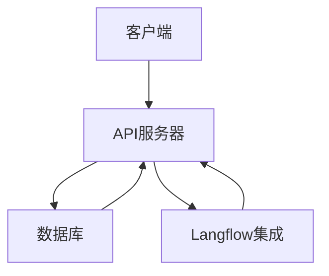

**Diagram sources**
- [main.py](file://vibe_surf/backend/main.py#L1-L794)
- [activity.py](file://vibe_surf/backend/api/activity.py#L1-L246)
- [agent.py](file://vibe_surf/backend/api/agent.py#L1-L38)
- [browser.py](file://vibe_surf/backend/api/browser.py#L1-L71)
- [composio.py](file://vibe_surf/backend/api/composio.py#L1-L800)
- [config.py](file://vibe_surf/backend/api/config.py#L1-L762)
- [files.py](file://vibe_surf/backend/api/files.py#L1-L332)
- [models.py](file://vibe_surf/backend/api/models.py#L1-L260)
- [schedule.py](file://vibe_surf/backend/api/schedule.py#L1-L331)
- [task.py](file://vibe_surf/backend/api/task.py#L1-L379)
- [vibesurf.py](file://vibe_surf/backend/api/vibesurf.py#L1-L681)
- [voices.py](file://vibe_surf/backend/api/voices.py#L1-L481)

## 详细组件分析

### Activity模块分析

Activity模块负责处理从VibeSurf代理和数据库任务历史中检索活动日志的请求。

#### Activity API端点
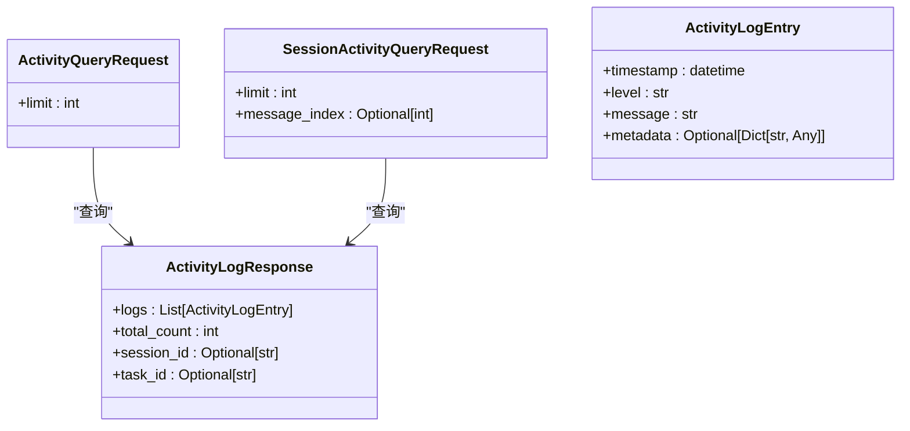

**Diagram sources**
- [activity.py](file://vibe_surf/backend/api/activity.py#L1-L246)
- [models.py](file://vibe_surf/backend/api/models.py#L1-L260)

**Section sources**
- [activity.py](file://vibe_surf/backend/api/activity.py#L1-L246)
- [models.py](file://vibe_surf/backend/api/models.py#L1-L260)

### Agent模块分析

Agent模块提供获取所有可用技能的API端点。

#### Agent API端点
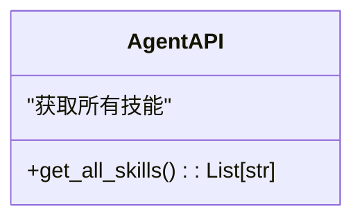

**Diagram sources**
- [agent.py](file://vibe_surf/backend/api/agent.py#L1-L38)

**Section sources**
- [agent.py](file://vibe_surf/backend/api/agent.py#L1-L38)

### Browser模块分析

Browser模块处理浏览器标签信息的检索，包括活动标签和所有标签。

#### Browser API端点
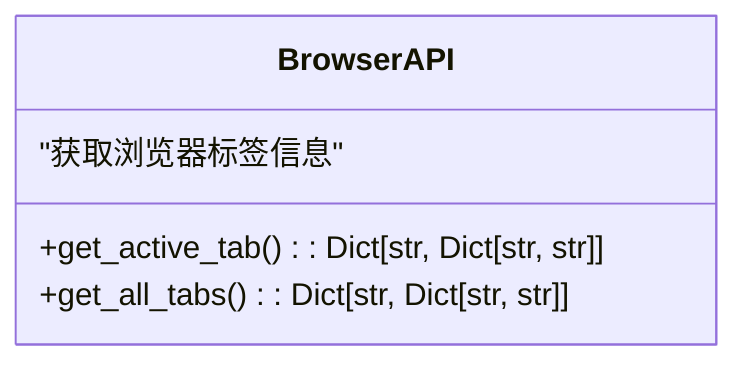

**Diagram sources**
- [browser.py](file://vibe_surf/backend/api/browser.py#L1-L71)

**Section sources**
- [browser.py](file://vibe_surf/backend/api/browser.py#L1-L71)

### Composio模块分析

Composio模块处理Composio集成管理，包括工具包配置、OAuth流程处理和API密钥验证。

#### Composio API端点
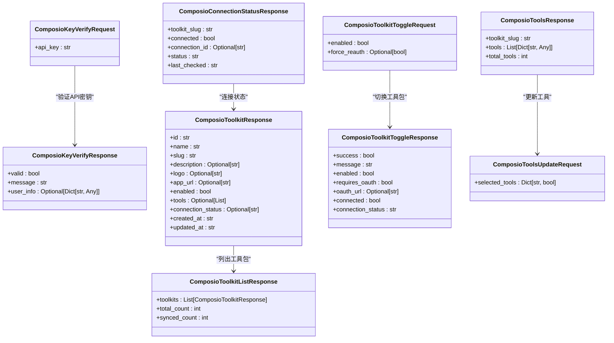

**Diagram sources**
- [composio.py](file://vibe_surf/backend/api/composio.py#L1-L800)
- [models.py](file://vibe_surf/backend/api/models.py#L1-L260)

**Section sources**
- [composio.py](file://vibe_surf/backend/api/composio.py#L1-L800)
- [models.py](file://vibe_surf/backend/api/models.py#L1-L260)

### Config模块分析

Config模块处理LLM配置文件和工具配置的管理。

#### Config API端点
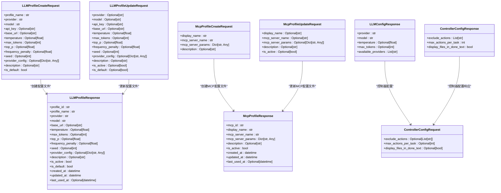

**Diagram sources**
- [config.py](file://vibe_surf/backend/api/config.py#L1-L762)
- [models.py](file://vibe_surf/backend/api/models.py#L1-L260)

**Section sources**
- [config.py](file://vibe_surf/backend/api/config.py#L1-L762)
- [models.py](file://vibe_surf/backend/api/models.py#L1-L260)

### Files模块分析

Files模块处理文件上传到工作区目录、文件检索和列出上传文件的请求。

#### Files API端点
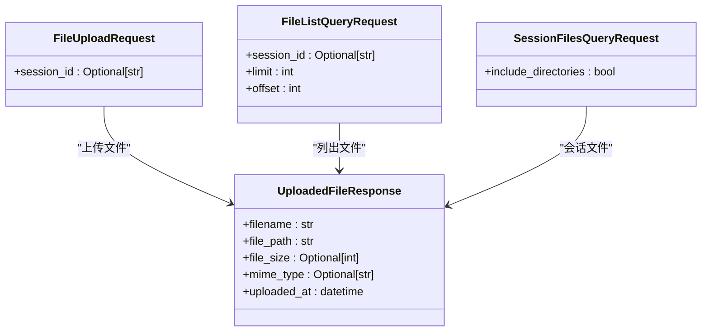

**Diagram sources**
- [files.py](file://vibe_surf/backend/api/files.py#L1-L332)
- [models.py](file://vibe_surf/backend/api/models.py#L1-L260)

**Section sources**
- [files.py](file://vibe_surf/backend/api/files.py#L1-L332)
- [models.py](file://vibe_surf/backend/api/models.py#L1-L260)

### Schedule模块分析

Schedule模块处理工作流计划的管理。

#### Schedule API端点
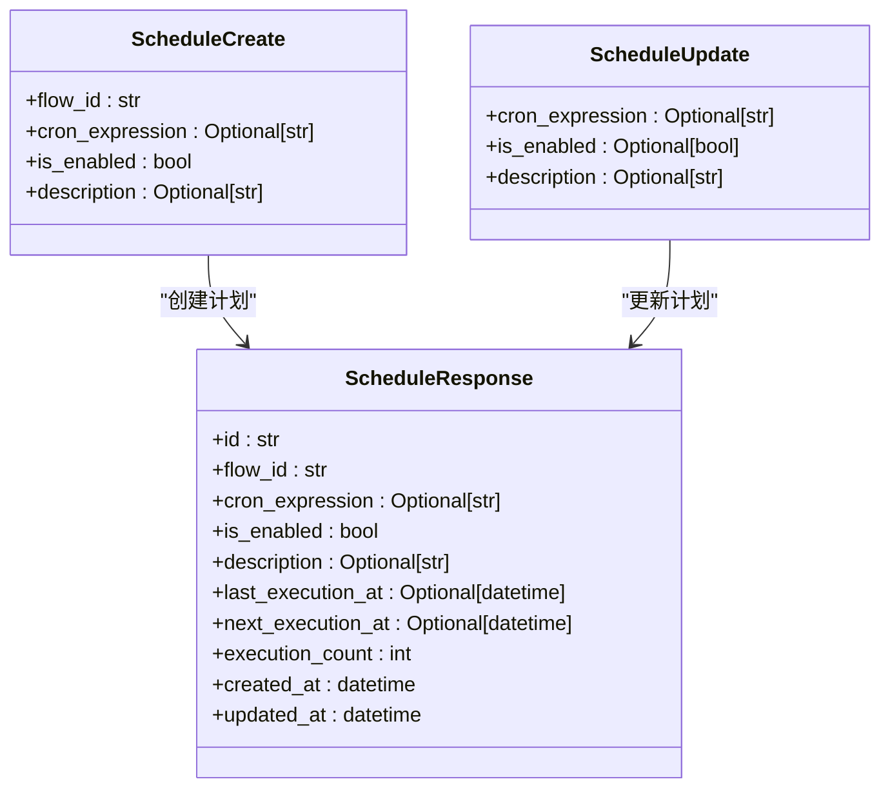

**Diagram sources**
- [schedule.py](file://vibe_surf/backend/api/schedule.py#L1-L331)
- [models.py](file://vibe_surf/backend/api/models.py#L1-L260)

**Section sources**
- [schedule.py](file://vibe_surf/backend/api/schedule.py#L1-L331)
- [models.py](file://vibe_surf/backend/api/models.py#L1-L260)

### Task模块分析

Task模块处理任务提交、执行控制（暂停/恢复/停止）和状态监控。

#### Task API端点
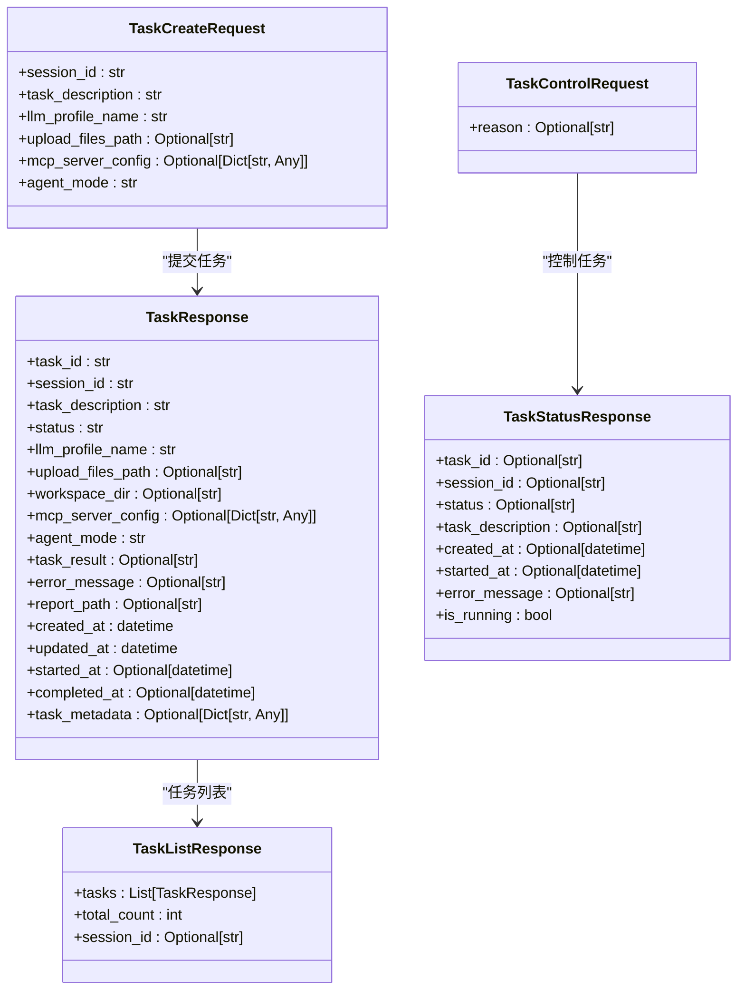

**Diagram sources**
- [task.py](file://vibe_surf/backend/api/task.py#L1-L379)
- [models.py](file://vibe_surf/backend/api/models.py#L1-L260)

**Section sources**
- [task.py](file://vibe_surf/backend/api/task.py#L1-L379)
- [models.py](file://vibe_surf/backend/api/models.py#L1-L260)

### VibeSurf模块分析

VibeSurf模块处理VibeSurf API密钥的验证和存储。

#### VibeSurf API端点
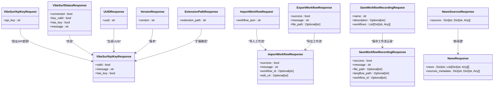

**Diagram sources**
- [vibesurf.py](file://vibe_surf/backend/api/vibesurf.py#L1-L681)
- [models.py](file://vibe_surf/backend/api/models.py#L1-L260)

**Section sources**
- [vibesurf.py](file://vibe_surf/backend/api/vibesurf.py#L1-L681)
- [models.py](file://vibe_surf/backend/api/models.py#L1-L260)

### Voices模块分析

Voices模块处理语音识别和其他工具相关操作。

#### Voices API端点
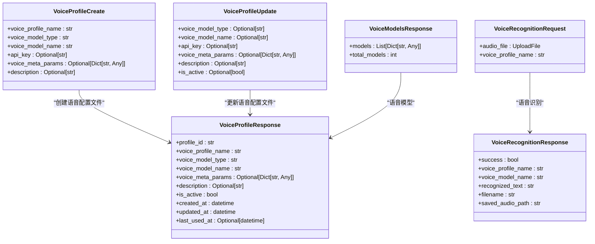

**Diagram sources**
- [voices.py](file://vibe_surf/backend/api/voices.py#L1-L481)
- [models.py](file://vibe_surf/backend/api/models.py#L1-L260)

**Section sources**
- [voices.py](file://vibe_surf/backend/api/voices.py#L1-L481)
- [models.py](file://vibe_surf/backend/api/models.py#L1-L260)

## 依赖分析

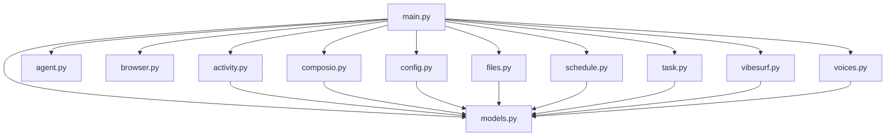

**Diagram sources**
- [main.py](file://vibe_surf/backend/main.py#L1-L794)
- [activity.py](file://vibe_surf/backend/api/activity.py#L1-L246)
- [agent.py](file://vibe_surf/backend/api/agent.py#L1-L38)
- [browser.py](file://vibe_surf/backend/api/browser.py#L1-L71)
- [composio.py](file://vibe_surf/backend/api/composio.py#L1-L800)
- [config.py](file://vibe_surf/backend/api/config.py#L1-L762)
- [files.py](file://vibe_surf/backend/api/files.py#L1-L332)
- [models.py](file://vibe_surf/backend/api/models.py#L1-L260)
- [schedule.py](file://vibe_surf/backend/api/schedule.py#L1-L331)
- [task.py](file://vibe_surf/backend/api/task.py#L1-L379)
- [vibesurf.py](file://vibe_surf/backend/api/vibesurf.py#L1-L681)
- [voices.py](file://vibe_surf/backend/api/voices.py#L1-L481)

**Section sources**
- [main.py](file://vibe_surf/backend/main.py#L1-L794)
- [activity.py](file://vibe_surf/backend/api/activity.py#L1-L246)
- [agent.py](file://vibe_surf/backend/api/agent.py#L1-L38)
- [browser.py](file://vibe_surf/backend/api/browser.py#L1-L71)
- [composio.py](file://vibe_surf/backend/api/composio.py#L1-L800)
- [config.py](file://vibe_surf/backend/api/config.py#L1-L762)
- [files.py](file://vibe_surf/backend/api/files.py#L1-L332)
- [models.py](file://vibe_surf/backend/api/models.py#L1-L260)
- [schedule.py](file://vibe_surf/backend/api/schedule.py#L1-L331)
- [task.py](file://vibe_surf/backend/api/task.py#L1-L379)
- [vibesurf.py](file://vibe_surf/backend/api/vibesurf.py#L1-L681)
- [voices.py](file://vibe_surf/backend/api/voices.py#L1-L481)

## 性能考虑

VibeSurf后端API设计考虑了性能优化，包括使用异步数据库会话、缓存和后台任务处理。API通过FastAPI的异步特性支持高并发请求处理，同时通过数据库连接池和查询优化减少延迟。

## 故障排除指南

### 常见问题

1. **API密钥验证失败**：确保API密钥格式正确，以'vs-'开头，长度为51个字符。
2. **文件上传失败**：检查文件路径是否安全，确保文件大小在限制范围内。
3. **任务提交失败**：确认LLM配置文件存在且API密钥有效。
4. **语音识别失败**：验证语音配置文件的API密钥和模型名称是否正确。

### 错误处理

API使用HTTP状态码和详细的错误消息来处理错误。常见的错误状态码包括：
- 400 Bad Request：请求参数无效或缺失。
- 404 Not Found：请求的资源不存在。
- 500 Internal Server Error：服务器内部错误。

**Section sources**
- [main.py](file://vibe_surf/backend/main.py#L1-L794)
- [activity.py](file://vibe_surf/backend/api/activity.py#L1-L246)
- [agent.py](file://vibe_surf/backend/api/agent.py#L1-L38)
- [browser.py](file://vibe_surf/backend/api/browser.py#L1-L71)
- [composio.py](file://vibe_surf/backend/api/composio.py#L1-L800)
- [config.py](file://vibe_surf/backend/api/config.py#L1-L762)
- [files.py](file://vibe_surf/backend/api/files.py#L1-L332)
- [models.py](file://vibe_surf/backend/api/models.py#L1-L260)
- [schedule.py](file://vibe_surf/backend/api/schedule.py#L1-L331)
- [task.py](file://vibe_surf/backend/api/task.py#L1-L379)
- [vibesurf.py](file://vibe_surf/backend/api/vibesurf.py#L1-L681)
- [voices.py](file://vibe_surf/backend/api/voices.py#L1-L481)

## 结论

VibeSurf后端API提供了全面的RESTful API端点设计，支持多种功能模块，包括活动日志、代理、浏览器、Composio集成、配置管理、文件处理、计划任务、任务执行、VibeSurf集成和语音识别。API设计遵循最佳实践，包括清晰的请求/响应模式、认证机制和错误处理。通过FastAPI框架，API实现了高性能和可扩展性，支持与前端、浏览器扩展和代理系统的无缝集成。