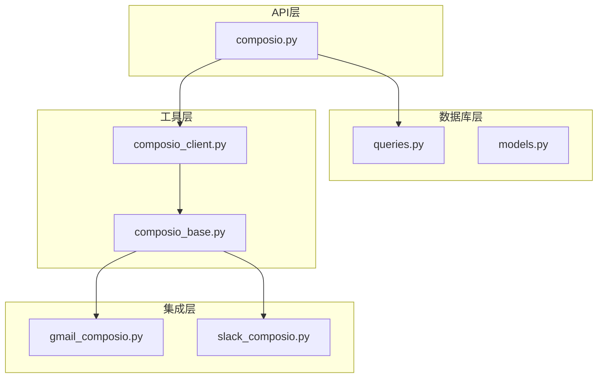
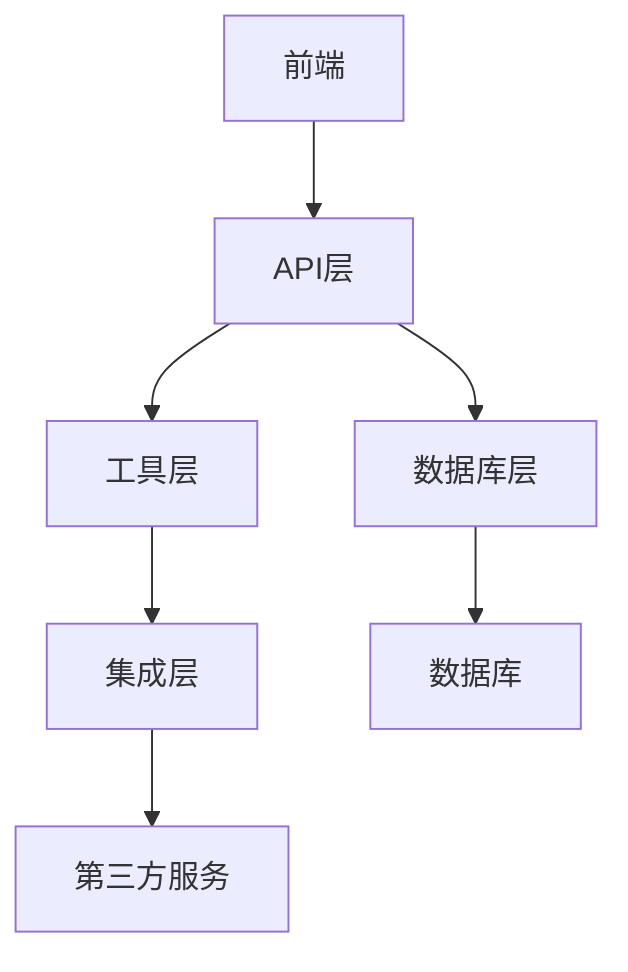
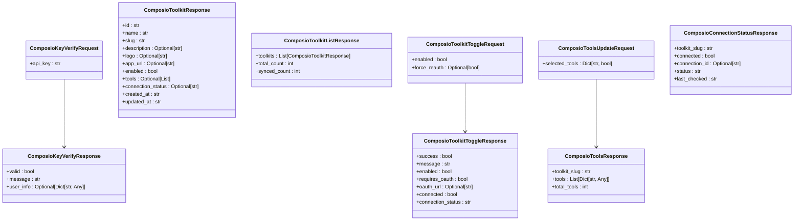
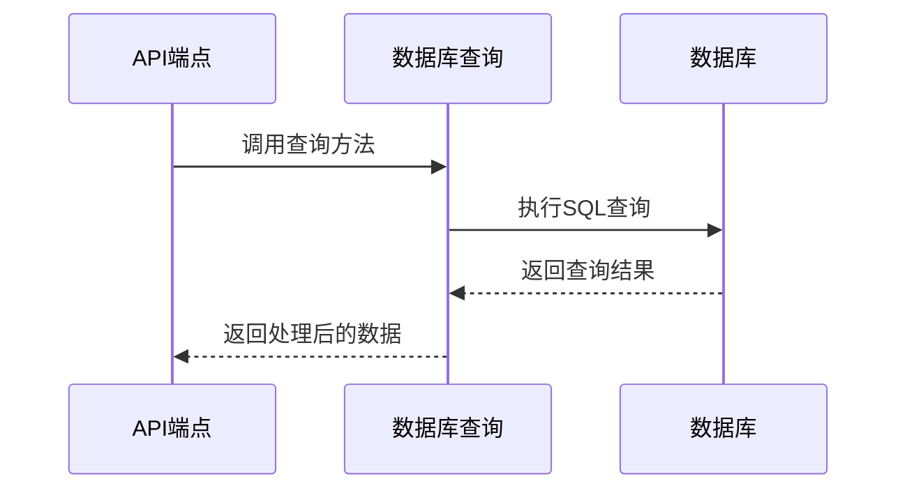
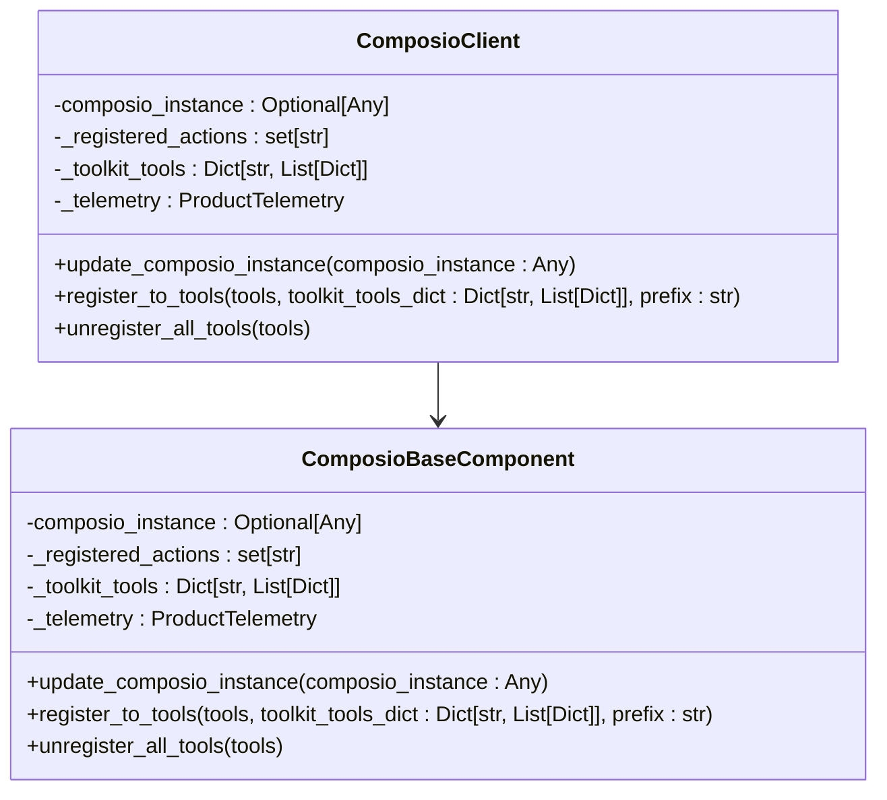
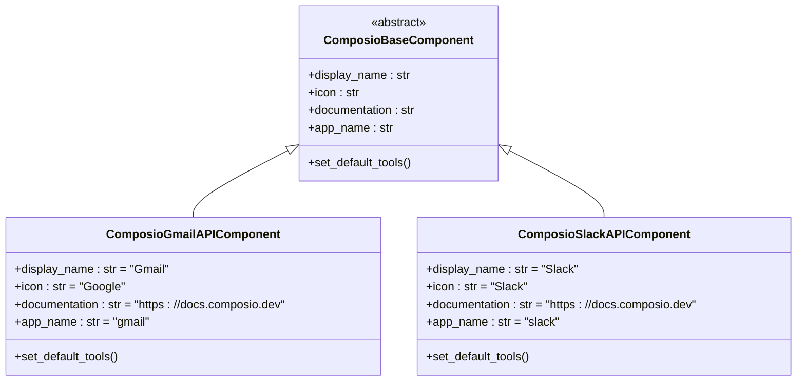
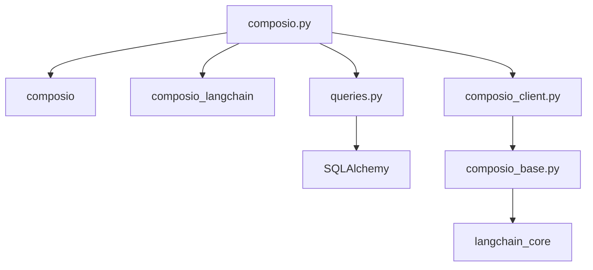

# Composio集成API

<cite>
**本文档引用的文件**
- [composio.py](file://vibe_surf/backend/api/composio.py)
- [queries.py](file://vibe_surf/backend/database/queries.py)
- [composio_client.py](file://vibe_surf/tools/composio_client.py)
- [composio_base.py](file://vibe_surf/langflow/base/composio/composio_base.py)
- [gmail_composio.py](file://vibe_surf/workflows/Integrations/gmail_composio.py)
- [slack_composio.py](file://vibe_surf/workflows/Integrations/slack_composio.py)
- [.env.example](file://.env.example)
</cite>

## 目录
1. [简介](#简介)
2. [项目结构](#项目结构)
3. [核心组件](#核心组件)
4. [架构概述](#架构概述)
5. [详细组件分析](#详细组件分析)
6. [依赖分析](#依赖分析)
7. [性能考虑](#性能考虑)
8. [故障排除指南](#故障排除指南)
9. [结论](#结论)

## 简介
Composio集成API为VibeSurf平台提供了与第三方服务（如Gmail、Notion、Slack等）集成的能力。该API通过Composio平台的OAuth集成流程，实现了对第三方服务连接的管理、认证令牌处理、工具调用和事件监听等功能。API端点定义在`composio.py`文件中，涵盖了从API密钥验证到工具调用的完整生命周期管理。系统通过数据库存储和管理Composio工具包配置、连接状态和认证信息，确保了集成的持久性和安全性。

## 项目结构
VibeSurf项目的结构清晰地组织了Composio集成相关的组件。主要的API端点定义在`vibe_surf/backend/api/composio.py`中，数据库查询操作在`vibe_surf/backend/database/queries.py`中实现，而工具客户端和基础组件则分布在`vibe_surf/tools/composio_client.py`和`vibe_surf/langflow/base/composio/composio_base.py`中。第三方服务的特定集成（如Gmail和Slack）位于`vibe_surf/workflows/Integrations/`目录下。环境变量配置文件`.env.example`中包含了`COMPOSIO_API_KEY`的占位符，用于配置Composio API密钥。

**Diagram sources**
- [composio.py](file://vibe_surf/backend/api/composio.py)
- [queries.py](file://vibe_surf/backend/database/queries.py)
- [composio_client.py](file://vibe_surf/tools/composio_client.py)
- [composio_base.py](file://vibe_surf/langflow/base/composio/composio_base.py)
- [gmail_composio.py](file://vibe_surf/workflows/Integrations/gmail_composio.py)
- [slack_composio.py](file://vibe_surf/workflows/Integrations/slack_composio.py)

**Section sources**
- [composio.py](file://vibe_surf/backend/api/composio.py)
- [queries.py](file://vibe_surf/backend/database/queries.py)
- [composio_client.py](file://vibe_surf/tools/composio_client.py)
- [composio_base.py](file://vibe_surf/langflow/base/composio/composio_base.py)
- [gmail_composio.py](file://vibe_surf/workflows/Integrations/gmail_composio.py)
- [slack_composio.py](file://vibe_surf/workflows/Integrations/slack_composio.py)
- [.env.example](file://.env.example)

## 核心组件
Composio集成API的核心组件包括API端点、数据库查询、工具客户端和基础组件。API端点处理HTTP请求，验证API密钥，并管理工具包的启用和禁用状态。数据库查询组件负责与数据库交互，存储和检索Composio工具包和认证信息。工具客户端将Composio工具注册为VibeSurf动作，而基础组件提供了通用的功能，如OAuth连接管理和工具执行。

**Section sources**
- [composio.py](file://vibe_surf/backend/api/composio.py)
- [queries.py](file://vibe_surf/backend/database/queries.py)
- [composio_client.py](file://vibe_surf/tools/composio_client.py)
- [composio_base.py](file://vibe_surf/langflow/base/composio/composio_base.py)

## 架构概述
Composio集成API的架构分为四个主要层次：API层、数据库层、工具层和集成层。API层接收和处理来自前端的请求，数据库层负责数据的持久化，工具层处理工具的注册和执行，集成层则实现了特定第三方服务的集成。各层次之间通过明确定义的接口进行通信，确保了系统的模块化和可维护性。

**Diagram sources**
- [composio.py](file://vibe_surf/backend/api/composio.py)
- [queries.py](file://vibe_surf/backend/database/queries.py)
- [composio_client.py](file://vibe_surf/tools/composio_client.py)
- [composio_base.py](file://vibe_surf/langflow/base/composio/composio_base.py)

## 详细组件分析

### API端点分析
API端点是Composio集成的入口，负责处理各种HTTP请求。主要端点包括API密钥验证、工具包列表获取、工具包启用/禁用、工具列表获取和更新、连接状态检查等。每个端点都有明确的请求和响应模型，确保了API的类型安全和文档化。

#### API端点类图

**Diagram sources**
- [composio.py](file://vibe_surf/backend/api/composio.py)

**Section sources**
- [composio.py](file://vibe_surf/backend/api/composio.py)

### 数据库查询分析
数据库查询组件负责与数据库交互，执行CRUD操作。主要查询包括创建、获取、更新和删除Composio工具包，以及管理认证信息。这些查询通过SQLAlchemy ORM实现，确保了类型安全和代码的可读性。

#### 数据库查询序列图

**Diagram sources**
- [queries.py](file://vibe_surf/backend/database/queries.py)

**Section sources**
- [queries.py](file://vibe_surf/backend/database/queries.py)

### 工具客户端分析
工具客户端负责将Composio工具注册为VibeSurf动作。它通过`ComposioClient`类实现，该类提供了注册和注销工具的方法。工具客户端还处理工具参数的转换和结果的格式化，确保了工具调用的一致性和可靠性。

#### 工具客户端类图

**Diagram sources**
- [composio_client.py](file://vibe_surf/tools/composio_client.py)
- [composio_base.py](file://vibe_surf/langflow/base/composio/composio_base.py)

**Section sources**
- [composio_client.py](file://vibe_surf/tools/composio_client.py)
- [composio_base.py](file://vibe_surf/langflow/base/composio/composio_base.py)

### 集成分析
集成层实现了特定第三方服务的集成，如Gmail和Slack。每个集成都继承自`ComposioBaseComponent`，并提供了特定的后处理器和默认工具设置。这些集成通过Composio平台的OAuth流程与第三方服务进行身份验证，并执行相应的操作。

#### 集成类图

**Diagram sources**
- [composio_base.py](file://vibe_surf/langflow/base/composio/composio_base.py)
- [gmail_composio.py](file://vibe_surf/workflows/Integrations/gmail_composio.py)
- [slack_composio.py](file://vibe_surf/workflows/Integrations/slack_composio.py)

**Section sources**
- [composio_base.py](file://vibe_surf/langflow/base/composio/composio_base.py)
- [gmail_composio.py](file://vibe_surf/workflows/Integrations/gmail_composio.py)
- [slack_composio.py](file://vibe_surf/workflows/Integrations/slack_composio.py)

## 依赖分析
Composio集成API依赖于多个外部库和内部组件。主要外部依赖包括`composio`和`composio_langchain`，用于与Composio平台进行交互。内部依赖包括`vibe_surf.backend.database`用于数据库操作，`vibe_surf.tools`用于工具管理，以及`vibe_surf.langflow`用于基础组件功能。这些依赖通过清晰的接口进行通信，确保了系统的松耦合和可扩展性。

**Diagram sources**
- [composio.py](file://vibe_surf/backend/api/composio.py)
- [queries.py](file://vibe_surf/backend/database/queries.py)
- [composio_client.py](file://vibe_surf/tools/composio_client.py)
- [composio_base.py](file://vibe_surf/langflow/base/composio/composio_base.py)

**Section sources**
- [composio.py](file://vibe_surf/backend/api/composio.py)
- [queries.py](file://vibe_surf/backend/database/queries.py)
- [composio_client.py](file://vibe_surf/tools/composio_client.py)
- [composio_base.py](file://vibe_surf/langflow/base/composio/composio_base.py)

## 性能考虑
Composio集成API在设计时考虑了性能优化。通过缓存机制，避免了重复的API调用和数据库查询。例如，`ComposioBaseComponent`类中的`_actions_cache`和`_action_schema_cache`用于缓存工具和模式信息，减少了对Composio API的调用次数。此外，异步操作的使用确保了高并发下的响应性能。

## 故障排除指南
在使用Composio集成API时，可能会遇到一些常见问题。以下是一些故障排除建议：

- **API密钥验证失败**：确保提供的API密钥正确无误，并且在`.env`文件中正确配置。
- **OAuth连接失败**：检查第三方服务的OAuth配置，确保重定向URL正确，并且用户已授权。
- **工具调用失败**：检查工具参数是否正确，特别是必填字段和数据类型。
- **连接状态检查失败**：确保Composio实例已正确初始化，并且网络连接正常。

**Section sources**
- [composio.py](file://vibe_surf/backend/api/composio.py)
- [composio_base.py](file://vibe_surf/langflow/base/composio/composio_base.py)

## 结论
Composio集成API为VibeSurf平台提供了强大的第三方服务集成能力。通过清晰的架构设计和模块化的组件，API实现了对连接管理、认证、工具调用和事件监听的全面支持。详细的文档和示例代码使得开发者能够快速上手并集成各种第三方服务。未来的工作可以包括增加更多的集成示例、优化性能和增强错误处理机制。