# VibeSurf核心API

<cite>
**本文档引用的文件**   
- [vibesurf.py](file://vibe_surf/backend/api/vibesurf.py)
- [queries.py](file://vibe_surf/backend/database/queries.py)
- [workflow_converter.py](file://vibe_surf/backend/utils/workflow_converter.py)
- [background.js](file://vibe_surf/chrome_extension/background.js)
- [vibe_surf_agent.py](file://vibe_surf/agents/vibe_surf_agent.py)
- [browser_use_agent.py](file://vibe_surf/agents/browser_use_agent.py)
- [vibesurf_tools.py](file://vibe_surf/tools/vibesurf_tools.py)
- [main.py](file://vibe_surf/backend/main.py)
- [shared_state.py](file://vibe_surf/backend/shared_state.py)
</cite>

## 目录
1. [简介](#简介)
2. [项目结构](#项目结构)
3. [核心组件](#核心组件)
4. [架构概述](#架构概述)
5. [详细组件分析](#详细组件分析)
6. [依赖分析](#依赖分析)
7. [性能考虑](#性能考虑)
8. [故障排除指南](#故障排除指南)
9. [结论](#结论)

## 简介
VibeSurf核心API是整个系统的主要入口点，负责协调代理、浏览器和工具的综合操作。该API提供了高级自动化工作流的触发机制，包括深度研究、智能爬取和内容摘要等场景。API通过会话管理、上下文传递和错误聚合机制，确保复杂请求的分解与编排逻辑的正确执行。此外，API与Chrome扩展深度集成，提供无缝的用户体验。

## 项目结构
VibeSurf项目采用模块化设计，主要分为以下几个部分：
- `vibe_surf/backend/api/vibesurf.py`：核心API定义，处理VibeSurf API密钥验证和存储。
- `vibe_surf/backend/database/queries.py`：数据库查询操作，包括任务和LLM配置文件的管理。
- `vibe_surf/backend/utils/workflow_converter.py`：工作流转换工具，将录制的工作流转换为Langflow格式。
- `vibe_surf/chrome_extension/background.js`：Chrome扩展的后台脚本，处理扩展生命周期和侧边栏管理。
- `vibe_surf/agents/vibe_surf_agent.py`：VibeSurf代理，协调浏览器任务和报告生成。
- `vibe_surf/agents/browser_use_agent.py`：浏览器使用代理，执行具体的浏览器自动化任务。
- `vibe_surf/tools/vibesurf_tools.py`：工具集，提供各种功能，如文件操作、浏览器控制等。
- `vibe_surf/backend/main.py`：应用主入口，初始化FastAPI应用和路由配置。
- `vibe_surf/backend/shared_state.py`：共享状态管理，维护全局状态和组件。

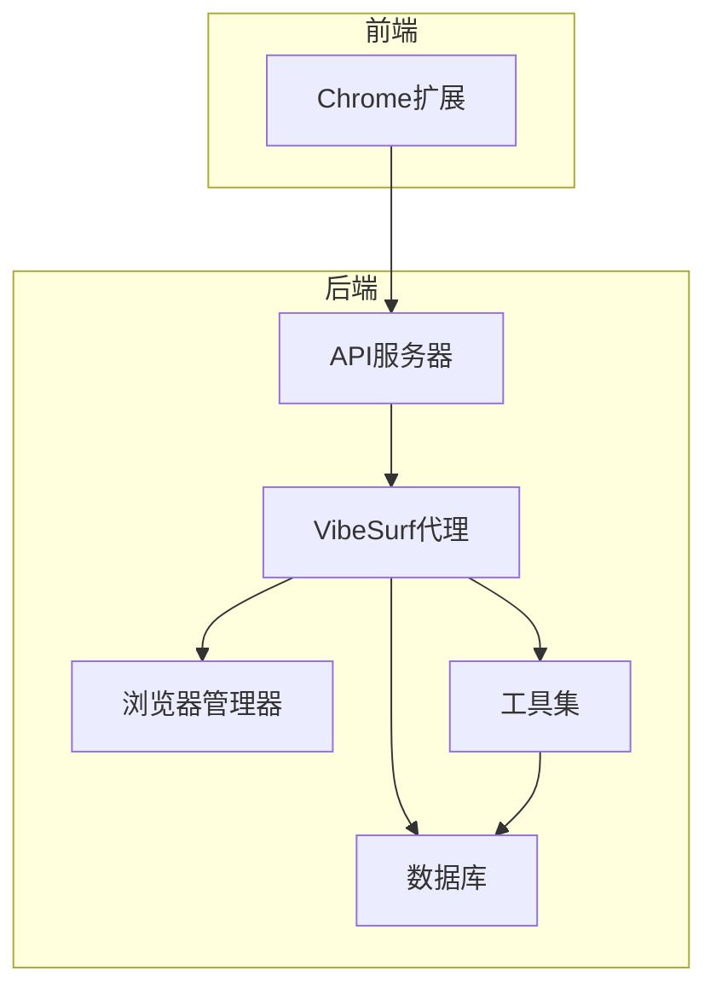

**Diagram sources**
- [vibesurf.py](file://vibe_surf/backend/api/vibesurf.py)
- [main.py](file://vibe_surf/backend/main.py)
- [shared_state.py](file://vibe_surf/backend/shared_state.py)

**Section sources**
- [vibesurf.py](file://vibe_surf/backend/api/vibesurf.py)
- [main.py](file://vibe_surf/backend/main.py)
- [shared_state.py](file://vibe_surf/backend/shared_state.py)

## 核心组件
VibeSurf核心API的主要组件包括：
- **API密钥管理**：处理VibeSurf API密钥的验证和存储。
- **工作流管理**：导入和导出工作流，支持JSON格式。
- **状态管理**：获取VibeSurf连接状态，包括API密钥的有效性。
- **UUID生成**：生成新的UUID v4。
- **版本信息**：获取VibeSurf包的版本信息。
- **扩展路径**：获取Chrome扩展的目录路径。
- **文件服务**：安全地提供本地文件服务。
- **新闻API**：获取新闻源和新闻内容。

**Section sources**
- [vibesurf.py](file://vibe_surf/backend/api/vibesurf.py)

## 架构概述
VibeSurf核心API采用分层架构，主要包括以下几个层次：
- **API层**：提供RESTful API接口，处理客户端请求。
- **业务逻辑层**：实现核心业务逻辑，如API密钥验证、工作流管理等。
- **数据访问层**：与数据库交互，执行CRUD操作。
- **工具层**：提供各种工具和功能，支持业务逻辑的实现。
- **集成层**：与Chrome扩展和其他外部服务集成。

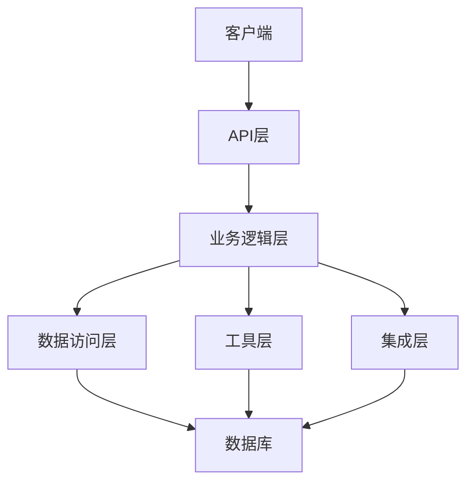

**Diagram sources**
- [vibesurf.py](file://vibe_surf/backend/api/vibesurf.py)
- [main.py](file://vibe_surf/backend/main.py)
- [shared_state.py](file://vibe_surf/backend/shared_state.py)

## 详细组件分析
### API密钥管理
API密钥管理是VibeSurf核心API的重要组成部分，负责验证和存储VibeSurf API密钥。API密钥必须以`vs-`开头，并且长度为51个字符。

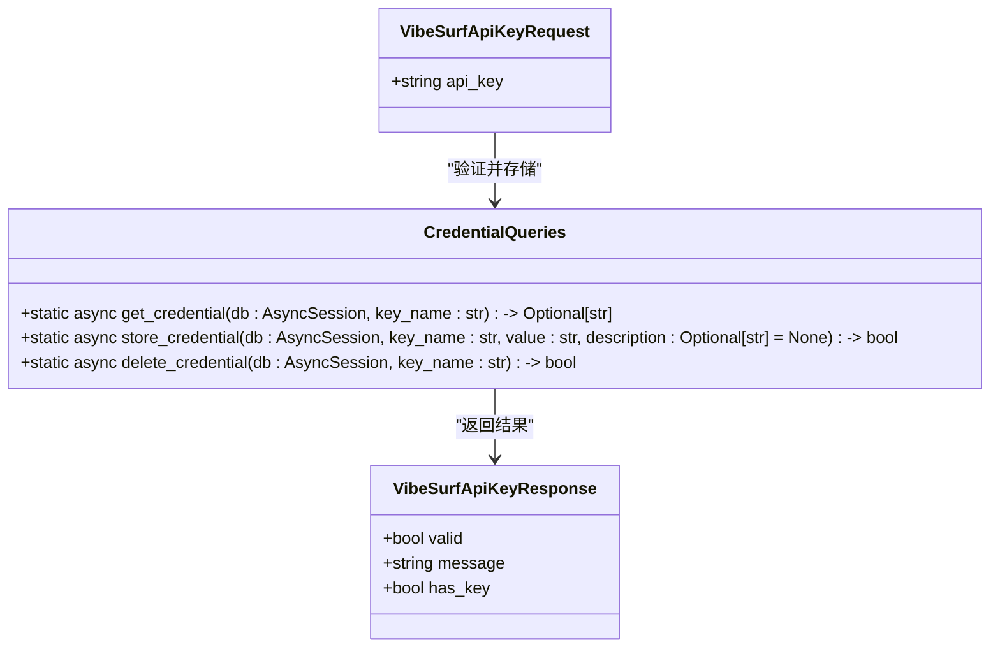

**Diagram sources**
- [vibesurf.py](file://vibe_surf/backend/api/vibesurf.py)
- [queries.py](file://vibe_surf/backend/database/queries.py)

### 工作流管理
工作流管理功能允许用户导入和导出工作流，支持JSON格式。导入工作流时，API会验证JSON格式并创建相应的流程。

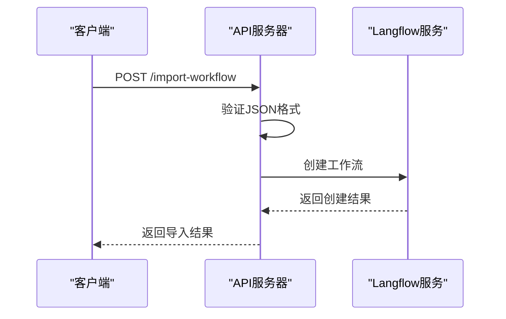

**Diagram sources**
- [vibesurf.py](file://vibe_surf/backend/api/vibesurf.py)
- [workflow_converter.py](file://vibe_surf/backend/utils/workflow_converter.py)

### 状态管理
状态管理功能提供VibeSurf连接状态的获取，包括API密钥的有效性和连接状态。

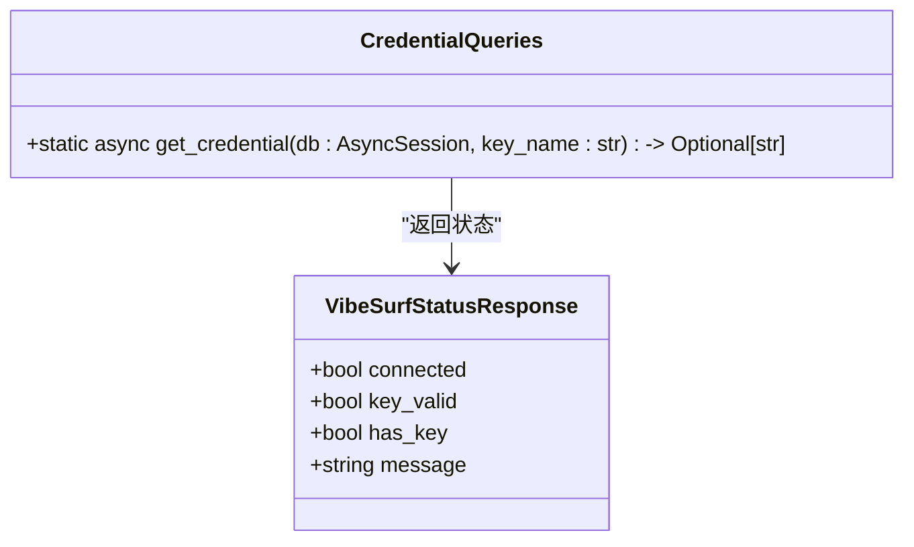

**Diagram sources**
- [vibesurf.py](file://vibe_surf/backend/api/vibesurf.py)
- [queries.py](file://vibe_surf/backend/database/queries.py)

### UUID生成
UUID生成功能提供生成新的UUID v4的能力，用于唯一标识各种资源。

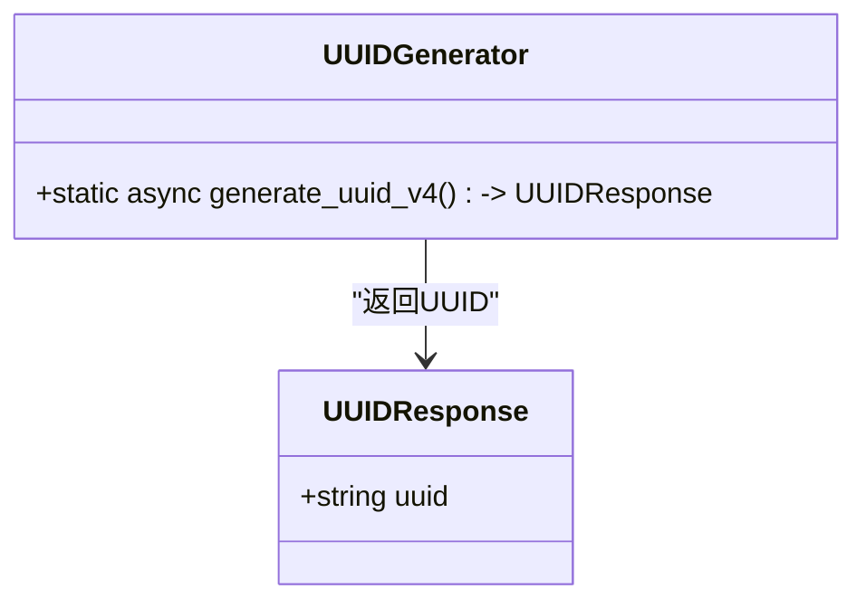

**Diagram sources**
- [vibesurf.py](file://vibe_surf/backend/api/vibesurf.py)

### 版本信息
版本信息功能提供获取VibeSurf包版本信息的能力。

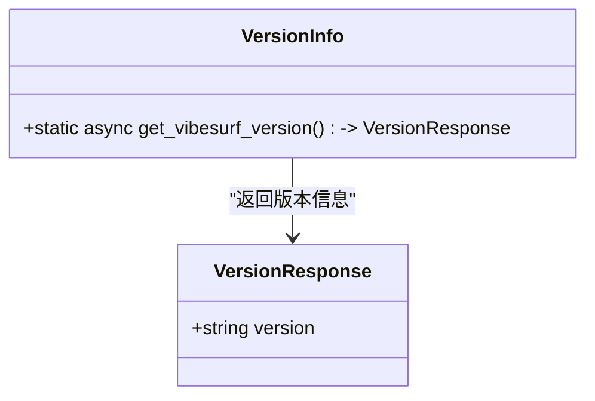

**Diagram sources**
- [vibesurf.py](file://vibe_surf/backend/api/vibesurf.py)

### 扩展路径
扩展路径功能提供获取Chrome扩展目录路径的能力。

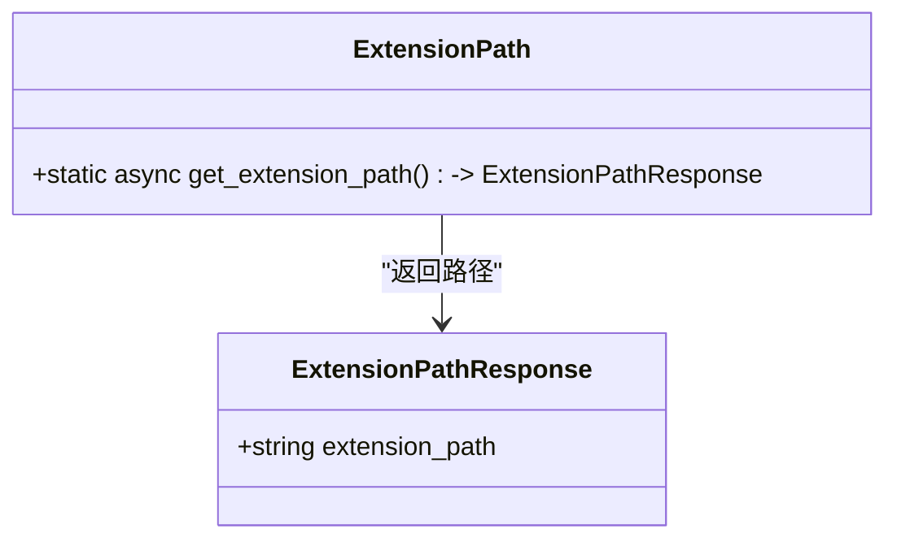

**Diagram sources**
- [vibesurf.py](file://vibe_surf/backend/api/vibesurf.py)
- [background.js](file://vibe_surf/chrome_extension/background.js)

### 文件服务
文件服务功能提供安全地提供本地文件服务的能力。

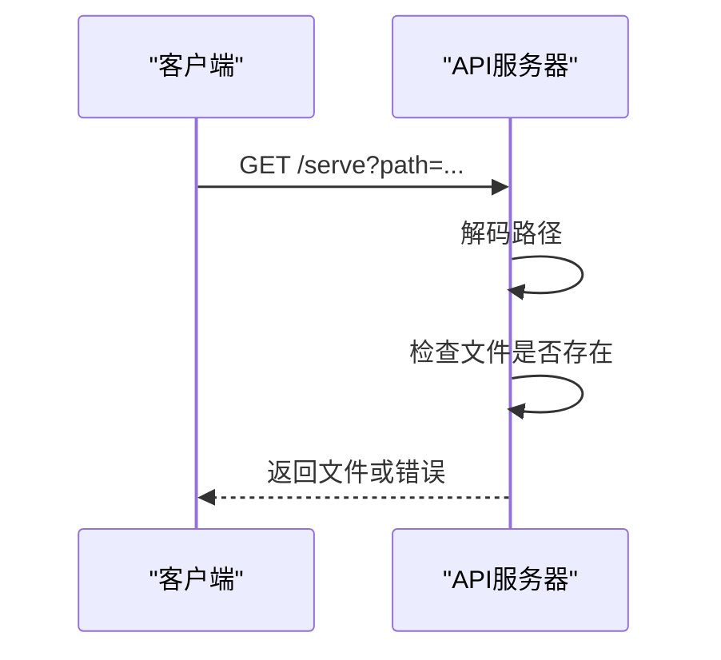

**Diagram sources**
- [vibesurf.py](file://vibe_surf/backend/api/vibesurf.py)

### 新闻API
新闻API功能提供获取新闻源和新闻内容的能力。

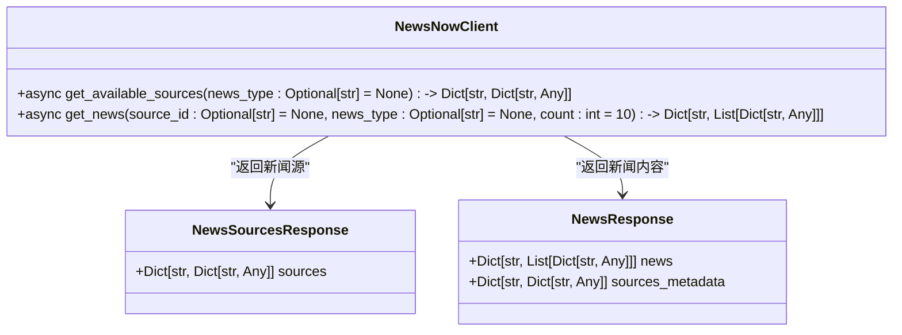

**Diagram sources**
- [vibesurf.py](file://vibe_surf/backend/api/vibesurf.py)
- [newsnow/client.py](file://vibe_surf/tools/website_api/newsnow/client.py)

## 依赖分析
VibeSurf核心API依赖于多个外部库和内部模块，主要包括：
- **FastAPI**：用于构建RESTful API。
- **SQLAlchemy**：用于数据库操作。
- **httpx**：用于HTTP请求。
- **pydantic**：用于数据验证。
- **uuid**：用于生成UUID。
- **json**：用于JSON处理。
- **os**：用于操作系统交互。
- **pathlib**：用于路径操作。
- **typing**：用于类型注解。

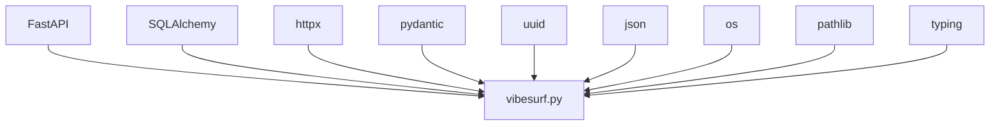

**Diagram sources**
- [vibesurf.py](file://vibe_surf/backend/api/vibesurf.py)

## 性能考虑
VibeSurf核心API在设计时考虑了性能优化，主要包括：
- **异步处理**：使用异步函数处理耗时操作，提高响应速度。
- **缓存机制**：对频繁访问的数据进行缓存，减少数据库查询。
- **批量操作**：对数据库操作进行批量处理，减少I/O开销。
- **错误处理**：提供详细的错误信息，便于调试和优化。

## 故障排除指南
### API密钥验证失败
如果API密钥验证失败，请检查以下几点：
- 确保API密钥以`vs-`开头。
- 确保API密钥长度为51个字符。
- 确保API密钥未过期。

### 工作流导入失败
如果工作流导入失败，请检查以下几点：
- 确保JSON格式正确。
- 确保API密钥有效。
- 确保Langflow服务正常运行。

### 文件服务失败
如果文件服务失败，请检查以下几点：
- 确保文件路径正确。
- 确保文件存在且可读。
- 确保文件路径未被恶意利用。

**Section sources**
- [vibesurf.py](file://vibe_surf/backend/api/vibesurf.py)

## 结论
VibeSurf核心API通过提供丰富的功能和良好的性能，支持高级自动化工作流的触发和管理。API与Chrome扩展深度集成，提供无缝的用户体验。通过合理的架构设计和依赖管理，VibeSurf核心API能够高效地处理复杂的请求和任务。