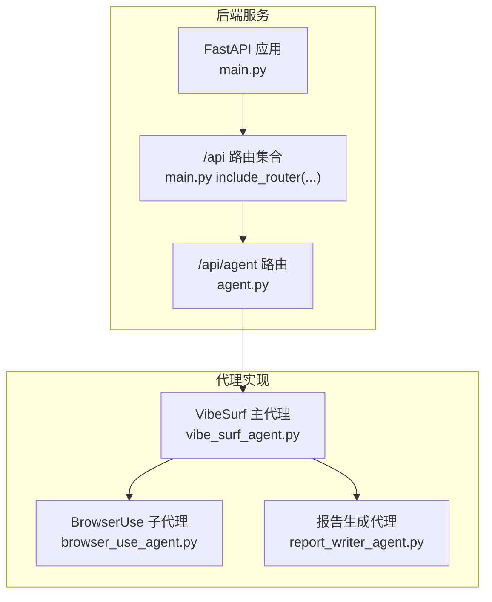
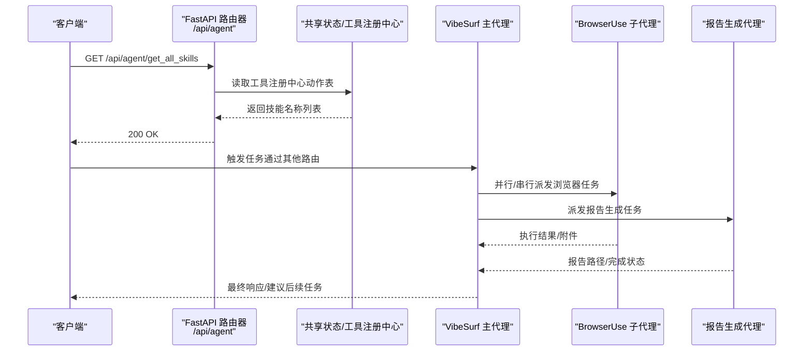
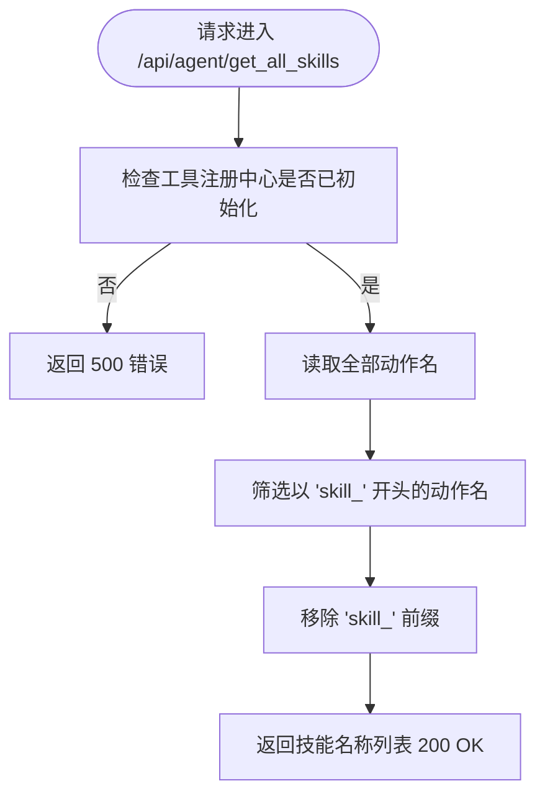
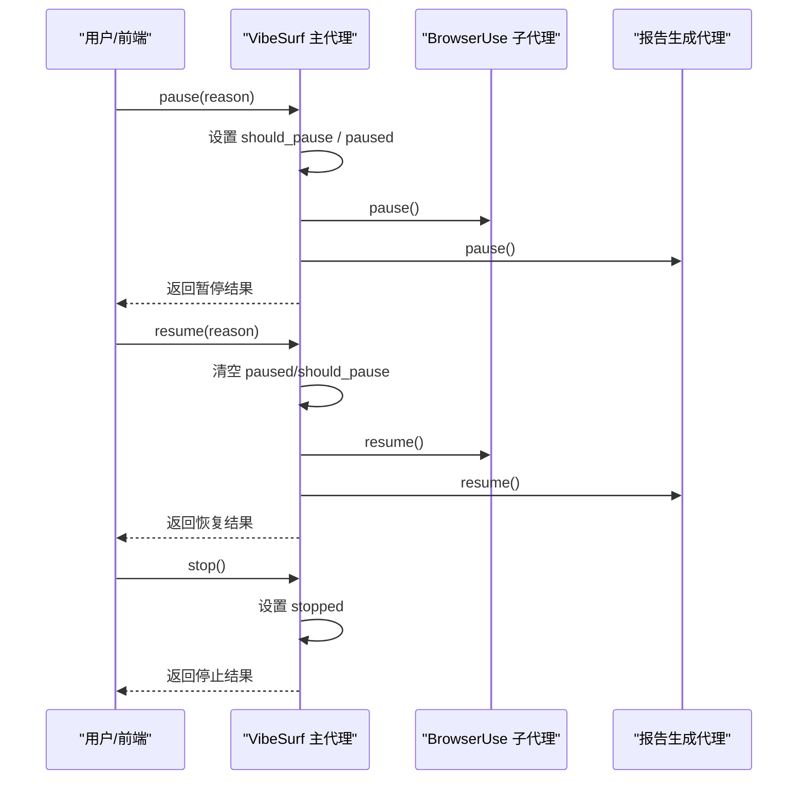
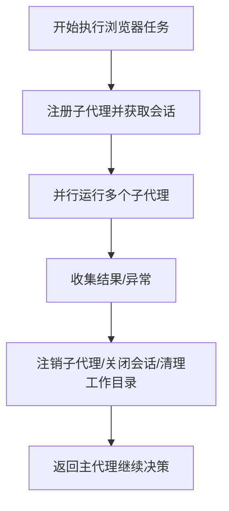
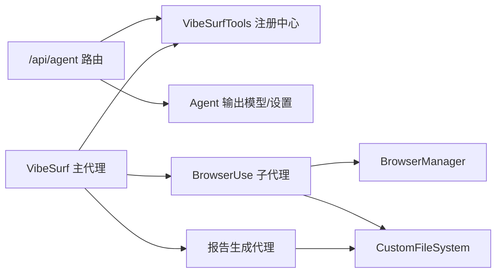

# 代理API

<cite>
**本文引用的文件**
- [vibe_surf/backend/api/agent.py](file://vibe_surf/backend/api/agent.py)
- [vibe_surf/backend/main.py](file://vibe_surf/backend/main.py)
- [vibe_surf/agents/vibe_surf_agent.py](file://vibe_surf/agents/vibe_surf_agent.py)
- [vibe_surf/agents/browser_use_agent.py](file://vibe_surf/agents/browser_use_agent.py)
- [vibe_surf/agents/report_writer_agent.py](file://vibe_surf/agents/report_writer_agent.py)
- [vibe_surf/agents/views.py](file://vibe_surf/agents/views.py)
- [vibe_surf/tools/vibesurf_tools.py](file://vibe_surf/tools/vibesurf_tools.py)
</cite>

## 目录
1. [简介](#简介)
2. [项目结构](#项目结构)
3. [核心组件](#核心组件)
4. [架构总览](#架构总览)
5. [详细组件分析](#详细组件分析)
6. [依赖关系分析](#依赖关系分析)
7. [性能考量](#性能考量)
8. [故障排查指南](#故障排查指南)
9. [结论](#结论)
10. [附录](#附录)

## 简介
本文件面向“代理API”的使用与集成，聚焦于后端FastAPI路由与代理生命周期管理的实现，覆盖以下主题：
- 代理API端点：当前暴露的技能查询接口
- 代理生命周期：暂停/恢复/停止/状态查询的控制机制
- 代理类型差异：VibeSurf主代理、BrowserUse子代理、报告生成代理
- 配置参数：LLM选择、提示词模板、执行模式（思考/无思考/闪速）
- 代理间通信与并发：并行浏览器任务、回调日志、资源清理
- 前端集成：与前端代理管理界面的对接建议

## 项目结构
后端通过FastAPI统一注册各模块路由，代理API位于独立模块，前缀为/api/agent；同时在应用入口处挂载了代理路由。

图表来源
- [vibe_surf/backend/main.py](file://vibe_surf/backend/main.py#L580-L590)
- [vibe_surf/backend/api/agent.py](file://vibe_surf/backend/api/agent.py#L1-L38)
- [vibe_surf/agents/vibe_surf_agent.py](file://vibe_surf/agents/vibe_surf_agent.py#L1-L120)
- [vibe_surf/agents/browser_use_agent.py](file://vibe_surf/agents/browser_use_agent.py#L1-L120)
- [vibe_surf/agents/report_writer_agent.py](file://vibe_surf/agents/report_writer_agent.py#L1-L60)

章节来源
- [vibe_surf/backend/main.py](file://vibe_surf/backend/main.py#L580-L590)
- [vibe_surf/backend/api/agent.py](file://vibe_surf/backend/api/agent.py#L1-L38)

## 核心组件
- 代理API路由器：提供技能列表查询端点
- VibeSurf主代理：编排型代理，负责决策、路由到子代理、状态汇总
- BrowserUse子代理：浏览器自动化执行器，支持多实例并行
- 报告生成代理：基于LLM的报告生成流程，支持暂停/恢复/停止
- 工具注册中心：集中注册可被代理调用的动作（技能）

章节来源
- [vibe_surf/backend/api/agent.py](file://vibe_surf/backend/api/agent.py#L1-L38)
- [vibe_surf/agents/vibe_surf_agent.py](file://vibe_surf/agents/vibe_surf_agent.py#L1-L120)
- [vibe_surf/agents/browser_use_agent.py](file://vibe_surf/agents/browser_use_agent.py#L1-L120)
- [vibe_surf/agents/report_writer_agent.py](file://vibe_surf/agents/report_writer_agent.py#L1-L60)
- [vibe_surf/tools/vibesurf_tools.py](file://vibe_surf/tools/vibesurf_tools.py#L1-L120)

## 架构总览
代理API与代理运行时的关系如下：

图表来源
- [vibe_surf/backend/api/agent.py](file://vibe_surf/backend/api/agent.py#L14-L38)
- [vibe_surf/agents/vibe_surf_agent.py](file://vibe_surf/agents/vibe_surf_agent.py#L548-L763)
- [vibe_surf/agents/report_writer_agent.py](file://vibe_surf/agents/report_writer_agent.py#L106-L210)
- [vibe_surf/tools/vibesurf_tools.py](file://vibe_surf/tools/vibesurf_tools.py#L1-L120)

## 详细组件分析

### 代理API端点
- 路由器前缀与标签：/api/agent，标签为agent
- 当前唯一端点：GET /api/agent/get_all_skills
  - 功能：从工具注册中心读取所有动作名，过滤出以“skill_”前缀的技能，并返回去前缀后的技能名称列表
  - 异常处理：当工具未初始化或内部异常时，返回500错误

图表来源
- [vibe_surf/backend/api/agent.py](file://vibe_surf/backend/api/agent.py#L14-L38)

章节来源
- [vibe_surf/backend/api/agent.py](file://vibe_surf/backend/api/agent.py#L1-L38)

### 代理生命周期管理（暂停/恢复/停止/状态）
- 控制信号与状态
  - 全局状态：paused/should_pause/stopped/is_complete/current_step
  - 代理级状态：_running_agents（记录并行子代理）、外部事件等待器（用于暂停/恢复）
- 关键方法
  - pause(reason)：设置should_pause并通知所有子代理暂停
  - resume(reason)：清除paused/should_pause并通知所有子代理恢复
  - pause_agent(agent_id, reason)/resume_agent(agent_id, reason)：针对单个子代理进行暂停/恢复
  - stop()：标记stopped并唤醒等待中的暂停逻辑
  - get_status()：汇总整体状态与各子代理状态
- 并发与资源
  - 并行执行子代理时，使用asyncio.gather收集结果
  - 执行完成后清理子代理注册与浏览器会话

图表来源
- [vibe_surf/agents/vibe_surf_agent.py](file://vibe_surf/agents/vibe_surf_agent.py#L1233-L1415)
- [vibe_surf/agents/browser_use_agent.py](file://vibe_surf/agents/browser_use_agent.py#L658-L799)
- [vibe_surf/agents/report_writer_agent.py](file://vibe_surf/agents/report_writer_agent.py#L77-L110)

章节来源
- [vibe_surf/agents/vibe_surf_agent.py](file://vibe_surf/agents/vibe_surf_agent.py#L1233-L1415)
- [vibe_surf/agents/browser_use_agent.py](file://vibe_surf/agents/browser_use_agent.py#L658-L799)
- [vibe_surf/agents/report_writer_agent.py](file://vibe_surf/agents/report_writer_agent.py#L77-L110)

### 代理类型与差异化接口
- VibeSurf主代理
  - 角色：编排者，根据上下文与历史消息决定下一步动作，路由到BrowserUse或报告生成
  - 特性：支持思考模式/无思考模式/闪速模式；维护全局状态机；记录活动日志
- BrowserUse子代理
  - 角色：浏览器自动化执行器，支持多实例并行、步骤回调、截图/文件系统、成本统计
  - 特性：可直接打开URL、限制每步动作数、超时控制、失败重试阈值
- 报告生成代理
  - 角色：LLM驱动的报告生成器，按步骤循环执行动作，支持最终HTML输出与回退方案

章节来源
- [vibe_surf/agents/vibe_surf_agent.py](file://vibe_surf/agents/vibe_surf_agent.py#L344-L521)
- [vibe_surf/agents/browser_use_agent.py](file://vibe_surf/agents/browser_use_agent.py#L83-L210)
- [vibe_surf/agents/report_writer_agent.py](file://vibe_surf/agents/report_writer_agent.py#L106-L210)

### 代理配置参数详解
- LLM选择
  - 可通过构造函数传入BaseChatModel实例；BrowserUse子代理默认模型可在构造时指定
- 提示词模板
  - VibeSurf主代理：系统提示词包含时间、浏览器标签页、历史结果、报告生成结果等上下文
  - BrowserUse子代理：支持覆盖/扩展系统提示词（extend_system_message），并可启用/禁用视觉输入
  - 报告生成代理：统一提示词在专用模块中定义
- 执行模式
  - agent_mode：支持“thinking”（思考+行动）、“no-thinking”（仅行动）、“flash”（快速模式）
  - BrowserUse子代理：use_thinking/flash_mode分别映射上述模式
  - VibeSurf主代理：根据settings.agent_mode动态切换输出格式（有/无thinking字段）

章节来源
- [vibe_surf/agents/vibe_surf_agent.py](file://vibe_surf/agents/vibe_surf_agent.py#L344-L521)
- [vibe_surf/agents/browser_use_agent.py](file://vibe_surf/agents/browser_use_agent.py#L83-L210)
- [vibe_surf/agents/report_writer_agent.py](file://vibe_surf/agents/report_writer_agent.py#L106-L177)
- [vibe_surf/agents/views.py](file://vibe_surf/agents/views.py#L59-L124)

### 代理间通信机制、并发控制与资源管理
- 通信机制
  - VibeSurf主代理通过动作模型（ActionModel）向工具注册中心请求执行，工具层再调度BrowserUse或报告生成代理
  - 步骤回调：BrowserUse子代理与报告生成代理均支持step_callback，用于记录每步思考与动作摘要
- 并发控制
  - 并行执行：主代理在浏览器任务节点中批量注册子代理并并行运行，使用asyncio.gather聚合结果
  - 暂停/恢复：通过事件等待器与状态标志位协调，避免竞态
- 资源管理
  - 浏览器会话：并行场景下为每个子代理注册独立会话；结束后注销并关闭多余标签页
  - 文件系统：为每个子代理分配独立工作目录，保存历史、截图、附件等
  - 成本统计：TokenCost服务贯穿子代理，汇总使用量与费用

图表来源
- [vibe_surf/agents/vibe_surf_agent.py](file://vibe_surf/agents/vibe_surf_agent.py#L607-L763)
- [vibe_surf/agents/browser_use_agent.py](file://vibe_surf/agents/browser_use_agent.py#L658-L799)

章节来源
- [vibe_surf/agents/vibe_surf_agent.py](file://vibe_surf/agents/vibe_surf_agent.py#L548-L763)
- [vibe_surf/agents/browser_use_agent.py](file://vibe_surf/agents/browser_use_agent.py#L658-L799)

### 与前端代理管理界面的集成方式
- 后端路由挂载：/api/agent 路由在应用启动时被include，确保前端可通过/api/agent/*访问
- 建议集成路径
  - 技能列表：GET /api/agent/get_all_skills，用于前端动态渲染可用技能
  - 控制面板：通过其他路由触发任务（例如任务路由），并在UI中提供暂停/恢复/停止按钮，调用后端控制接口（由主代理提供）
  - 状态展示：通过状态查询接口（主代理提供）展示整体状态与子代理状态
- 注意事项
  - 前端需处理异步控制（暂停/恢复可能需要轮询状态）
  - 并行任务较多时，注意浏览器会话数量与资源占用

章节来源
- [vibe_surf/backend/main.py](file://vibe_surf/backend/main.py#L580-L590)
- [vibe_surf/backend/api/agent.py](file://vibe_surf/backend/api/agent.py#L1-L38)
- [vibe_surf/agents/vibe_surf_agent.py](file://vibe_surf/agents/vibe_surf_agent.py#L1394-L1415)

## 依赖关系分析
- 组件耦合
  - 主代理依赖工具注册中心（VibeSurfTools）以获取动作模型与执行能力
  - 子代理依赖浏览器管理器（BrowserManager）与文件系统（CustomFileSystem）
  - 报告生成代理依赖自定义文件系统与报告工具集
- 外部依赖
  - FastAPI：路由与中间件
  - browser_use：子代理框架与工具体系
  - asyncio：并发与异步控制

图表来源
- [vibe_surf/backend/api/agent.py](file://vibe_surf/backend/api/agent.py#L1-L38)
- [vibe_surf/tools/vibesurf_tools.py](file://vibe_surf/tools/vibesurf_tools.py#L1-L120)
- [vibe_surf/agents/vibe_surf_agent.py](file://vibe_surf/agents/vibe_surf_agent.py#L1-L120)
- [vibe_surf/agents/browser_use_agent.py](file://vibe_surf/agents/browser_use_agent.py#L1-L120)
- [vibe_surf/agents/report_writer_agent.py](file://vibe_surf/agents/report_writer_agent.py#L1-L60)

章节来源
- [vibe_surf/tools/vibesurf_tools.py](file://vibe_surf/tools/vibesurf_tools.py#L1-L120)
- [vibe_surf/agents/vibe_surf_agent.py](file://vibe_surf/agents/vibe_surf_agent.py#L1-L120)
- [vibe_surf/agents/browser_use_agent.py](file://vibe_surf/agents/browser_use_agent.py#L1-L120)
- [vibe_surf/agents/report_writer_agent.py](file://vibe_surf/agents/report_writer_agent.py#L1-L60)

## 性能考量
- 并行执行
  - 并行子代理数量与浏览器会话数成正比，需关注CPU/内存与浏览器稳定性
  - 建议在任务规模较大时分批执行，避免过多并发导致资源争用
- 超时与重试
  - 子代理支持LLM与步骤超时，失败阈值可配置，防止长时间卡死
- 日志与成本
  - 步骤回调与活动日志有助于定位瓶颈
  - TokenCost服务可用于成本控制与审计

## 故障排查指南
- 技能列表为空
  - 检查工具注册中心是否初始化成功
  - 确认动作命名是否符合“skill_”前缀约定
- 并行任务失败
  - 查看子代理历史与错误信息，确认浏览器会话是否正确注册与注销
  - 检查文件系统路径与权限
- 暂停/恢复无效
  - 确认paused/should_pause状态与外部事件等待器状态一致
  - 检查子代理是否实现了pause/resume接口
- 报告生成异常
  - 查看最终HTML清理与链接转换过程，确认相对路径转绝对路径逻辑

章节来源
- [vibe_surf/backend/api/agent.py](file://vibe_surf/backend/api/agent.py#L14-L38)
- [vibe_surf/agents/vibe_surf_agent.py](file://vibe_surf/agents/vibe_surf_agent.py#L548-L763)
- [vibe_surf/agents/report_writer_agent.py](file://vibe_surf/agents/report_writer_agent.py#L348-L395)

## 结论
- 代理API目前提供技能查询端点，满足前端动态展示与选择需求
- 生命周期控制由主代理统一管理，支持暂停/恢复/停止与状态查询
- 不同代理类型职责清晰：主代理编排、子代理执行、报告代理生成
- 并发与资源管理通过会话注册、回调日志与清理流程保障稳定性
- 建议在前端集成中结合状态轮询与错误提示，提升用户体验

## 附录
- 常用端点
  - GET /api/agent/get_all_skills：获取可用技能名称列表
- 常用控制方法（由主代理提供）
  - pause(reason) / resume(reason) / stop()
  - pause_agent(agent_id, reason) / resume_agent(agent_id, reason)
  - get_status()

章节来源
- [vibe_surf/backend/api/agent.py](file://vibe_surf/backend/api/agent.py#L14-L38)
- [vibe_surf/agents/vibe_surf_agent.py](file://vibe_surf/agents/vibe_surf_agent.py#L1233-L1415)