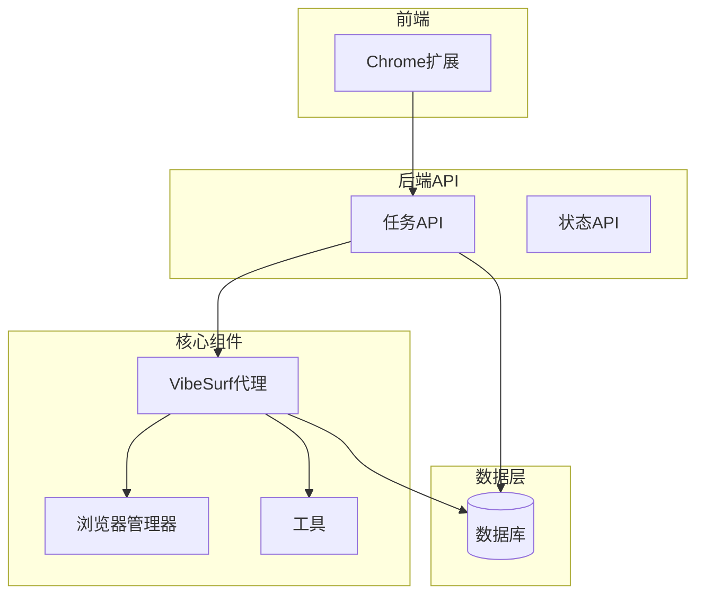
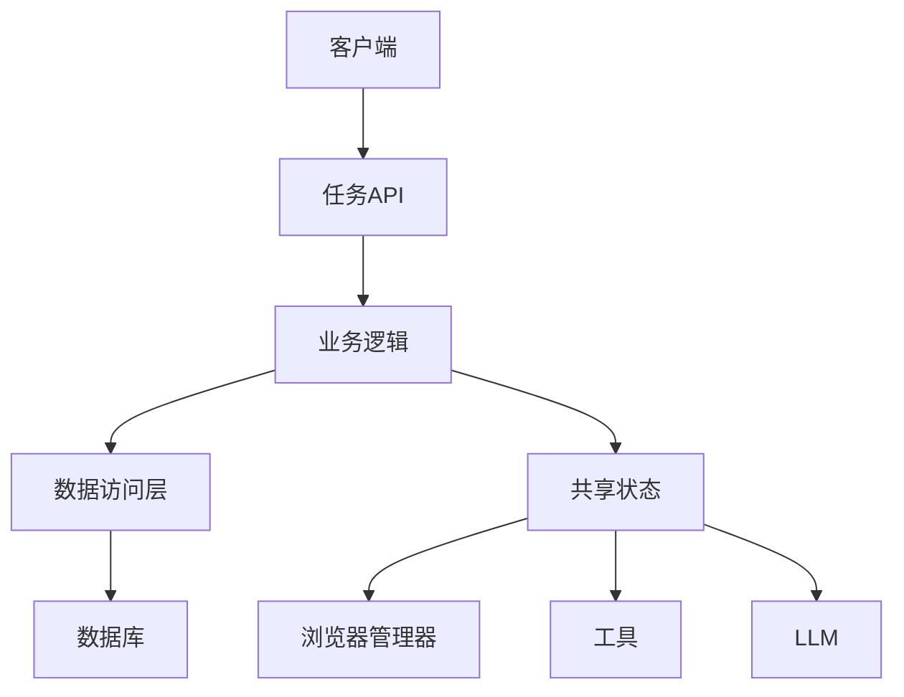
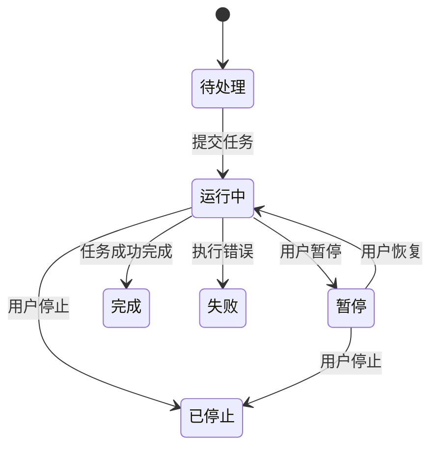
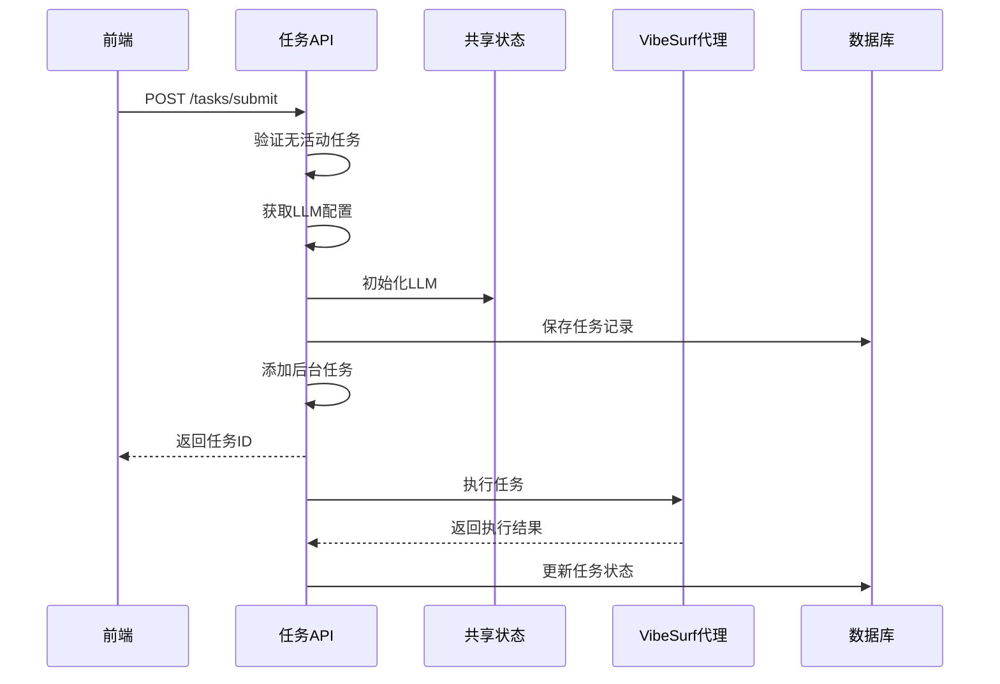
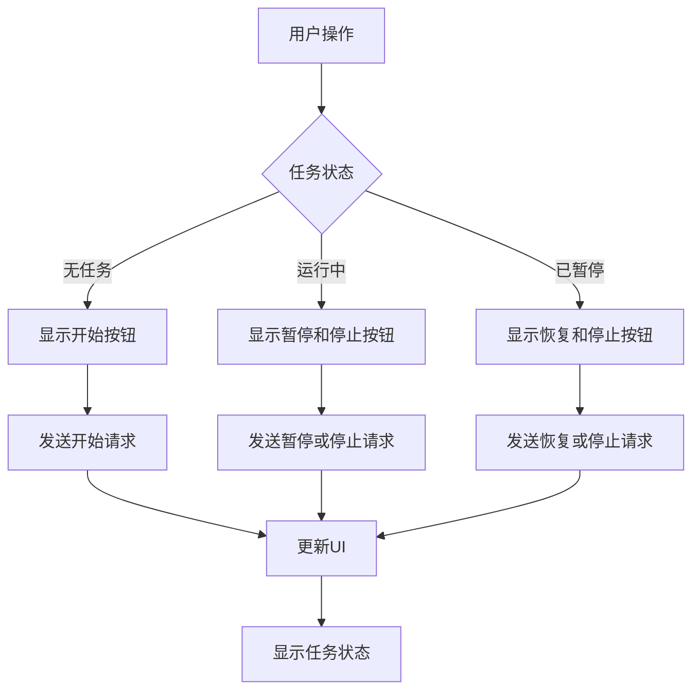
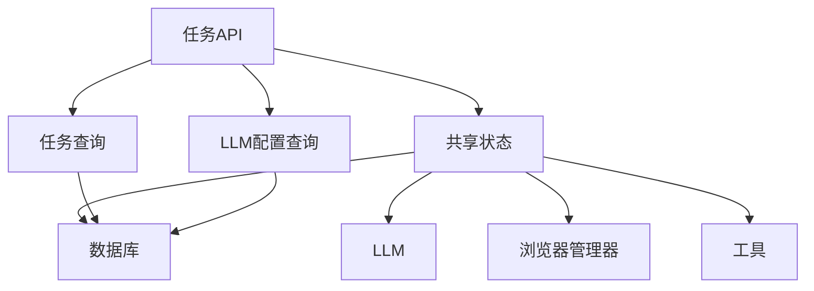

# 任务API

<cite>
**本文档引用的文件**   
- [task.py](file://vibe_surf/backend/api/task.py)
- [models.py](file://vibe_surf/backend/database/models.py)
- [queries.py](file://vibe_surf/backend/database/queries.py)
- [shared_state.py](file://vibe_surf/backend/shared_state.py)
- [main.js](file://vibe_surf/chrome_extension/scripts/main.js)
- [ui-manager.js](file://vibe_surf/chrome_extension/scripts/ui-manager.js)
</cite>

## 目录
1. [简介](#简介)
2. [项目结构](#项目结构)
3. [核心组件](#核心组件)
4. [架构概述](#架构概述)
5. [详细组件分析](#详细组件分析)
6. [依赖分析](#依赖分析)
7. [性能考虑](#性能考虑)
8. [故障排除指南](#故障排除指南)
9. [结论](#结论)
10. [附录](#附录)（如有必要）

## 简介
本文档详细描述了VibeSurf系统中的任务API，该API负责任务的提交、执行控制（暂停/恢复/停止）和状态监控。API通过FastAPI实现，支持任务的创建、启动、监控、暂停和结果获取。系统采用单任务执行模型，确保同一时间只有一个任务在运行。任务状态机包括待处理、运行中、暂停、完成、失败和已停止等状态。API与前端Chrome扩展紧密集成，提供实时任务状态更新和控制功能。

## 项目结构
任务API是VibeSurf后端系统的核心组件，位于`vibe_surf/backend/api/`目录下。系统采用分层架构，包括API路由、数据库模型、查询服务和共享状态管理。任务相关的数据模型定义在`database/models.py`中，数据库操作封装在`database/queries.py`中，全局状态和组件管理通过`shared_state.py`实现。前端通过Chrome扩展与后端API进行交互，提供用户友好的任务控制界面。

**图表来源**
- [task.py](file://vibe_surf/backend/api/task.py#L1-L379)
- [models.py](file://vibe_surf/backend/database/models.py#L1-L289)
- [shared_state.py](file://vibe_surf/backend/shared_state.py#L1-L1111)

**章节来源**
- [task.py](file://vibe_surf/backend/api/task.py#L1-L379)
- [models.py](file://vibe_surf/backend/database/models.py#L1-L289)

## 核心组件
任务API的核心组件包括任务路由、任务状态管理、数据库模型和共享状态。API路由处理任务的提交、控制和状态查询请求。任务状态通过共享状态中的`active_task`字典进行跟踪，确保系统能够快速响应状态查询。数据库模型定义了任务的持久化结构，包括任务ID、会话ID、任务描述、状态、LLM配置等字段。共享状态管理全局组件实例和任务执行上下文，确保各组件之间的协调工作。

**章节来源**
- [task.py](file://vibe_surf/backend/api/task.py#L1-L379)
- [shared_state.py](file://vibe_surf/backend/shared_state.py#L1-L1111)
- [models.py](file://vibe_surf/backend/database/models.py#L1-L289)

## 架构概述
任务API采用基于FastAPI的RESTful架构，通过异步处理实现高性能。系统架构分为四层：API层、业务逻辑层、数据访问层和持久化层。API层暴露任务相关的端点，业务逻辑层处理任务执行的核心逻辑，数据访问层封装数据库操作，持久化层使用SQLite数据库存储任务数据。系统通过共享状态管理全局组件实例和任务上下文，确保单任务执行模型的正确性。

**图表来源**
- [task.py](file://vibe_surf/backend/api/task.py#L1-L379)
- [shared_state.py](file://vibe_surf/backend/shared_state.py#L1-L1111)
- [queries.py](file://vibe_surf/backend/database/queries.py#L1-L1683)

## 详细组件分析

### 任务API分析
任务API实现了任务的全生命周期管理，包括创建、控制和监控。API通过`/tasks/submit`端点接收新任务，验证当前没有活动任务后，初始化LLM连接并创建后台任务执行。控制端点（`/tasks/pause`、`/tasks/resume`、`/tasks/stop`）允许用户干预任务执行。状态端点提供任务执行的实时信息。

#### 任务状态机

**图表来源**
- [task.py](file://vibe_surf/backend/api/task.py#L1-L379)
- [models.py](file://vibe_surf/backend/database/models.py#L1-L289)

#### 任务执行流程

**图表来源**
- [task.py](file://vibe_surf/backend/api/task.py#L1-L379)
- [shared_state.py](file://vibe_surf/backend/shared_state.py#L1-L1111)
- [queries.py](file://vibe_surf/backend/database/queries.py#L1-L1683)

### 任务数据结构
任务API使用明确定义的数据结构来管理任务信息。主要数据结构包括任务创建请求、任务控制请求和任务状态响应。

**任务创建请求结构**
| 字段 | 类型 | 描述 |
|------|------|------|
| task_description | string | 任务描述 |
| session_id | string | 会话ID |
| llm_profile_name | string | LLM配置文件名称 |
| upload_files_path | string[] | 上传文件路径 |
| agent_mode | string | 代理模式 |

**任务状态响应结构**
| 字段 | 类型 | 描述 |
|------|------|------|
| has_active_task | boolean | 是否有活动任务 |
| task_id | string | 任务ID |
| status | string | 任务状态 |
| session_id | string | 会话ID |
| start_time | datetime | 开始时间 |
| end_time | datetime | 结束时间 |
| result | string | 执行结果 |
| error | string | 错误信息 |
| vibesurf_status | object | VibeSurf状态详情 |

**图表来源**
- [task.py](file://vibe_surf/backend/api/task.py#L1-L379)
- [models.py](file://vibe_surf/backend/database/models.py#L1-L289)

**章节来源**
- [task.py](file://vibe_surf/backend/api/task.py#L1-L379)
- [models.py](file://vibe_surf/backend/database/models.py#L1-L289)

### 前端集成分析
任务API与Chrome扩展前端紧密集成，提供实时任务监控和控制功能。前端通过定期轮询和事件驱动的方式获取任务状态，更新用户界面。控制面板根据任务状态动态显示相应的操作按钮（开始、暂停、恢复、停止）。

#### 前端任务控制流程

**图表来源**
- [main.js](file://vibe_surf/chrome_extension/scripts/main.js#L1-L547)
- [ui-manager.js](file://vibe_surf/chrome_extension/scripts/ui-manager.js#L550-L1527)

**章节来源**
- [main.js](file://vibe_surf/chrome_extension/scripts/main.js#L1-L547)
- [ui-manager.js](file://vibe_surf/chrome_extension/scripts/ui-manager.js#L550-L1527)

## 依赖分析
任务API依赖于多个核心组件和外部服务。主要依赖包括数据库服务、LLM服务、浏览器管理器和工具集。系统通过共享状态管理这些依赖的实例，确保它们在整个应用生命周期中可用。

**图表来源**
- [task.py](file://vibe_surf/backend/api/task.py#L1-L379)
- [shared_state.py](file://vibe_surf/backend/shared_state.py#L1-L1111)
- [queries.py](file://vibe_surf/backend/database/queries.py#L1-L1683)

**章节来源**
- [task.py](file://vibe_surf/backend/api/task.py#L1-L379)
- [shared_state.py](file://vibe_surf/backend/shared_state.py#L1-L1111)
- [queries.py](file://vibe_surf/backend/database/queries.py#L1-L1683)

## 性能考虑
任务API设计时考虑了性能和可扩展性。系统采用异步处理模式，避免阻塞主线程。数据库操作通过索引优化查询性能，特别是对任务状态、会话ID和创建时间的查询。任务状态检查采用轻量级的内存查询，避免频繁的数据库访问。后台任务执行与API响应分离，确保API响应的快速性。

## 故障排除指南
当任务API出现问题时，可以按照以下步骤进行排查：

1. **检查后端服务状态**：确保VibeSurf后端服务器正在运行。
2. **验证数据库连接**：检查数据库文件是否存在且可访问。
3. **检查LLM配置**：确认LLM配置文件存在且API密钥正确。
4. **查看日志文件**：检查系统日志以获取详细的错误信息。
5. **验证前端连接**：确保Chrome扩展能够连接到后端API。

常见问题包括：
- **无法提交任务**：检查是否有活动任务正在运行。
- **LLM连接失败**：验证LLM配置文件和API密钥。
- **任务执行缓慢**：检查网络连接和LLM服务响应时间。

**章节来源**
- [task.py](file://vibe_surf/backend/api/task.py#L1-L379)
- [shared_state.py](file://vibe_surf/backend/shared_state.py#L1-L1111)
- [queries.py](file://vibe_surf/backend/database/queries.py#L1-L1683)

## 结论
任务API是VibeSurf系统的核心组件，提供了完整的任务生命周期管理功能。通过清晰的RESTful接口、健壮的状态管理和高效的执行模型，API能够可靠地处理复杂的自动化任务。与前端的紧密集成提供了良好的用户体验，而模块化的架构设计确保了系统的可维护性和可扩展性。未来可以考虑支持多任务并发执行和更复杂的任务调度功能。