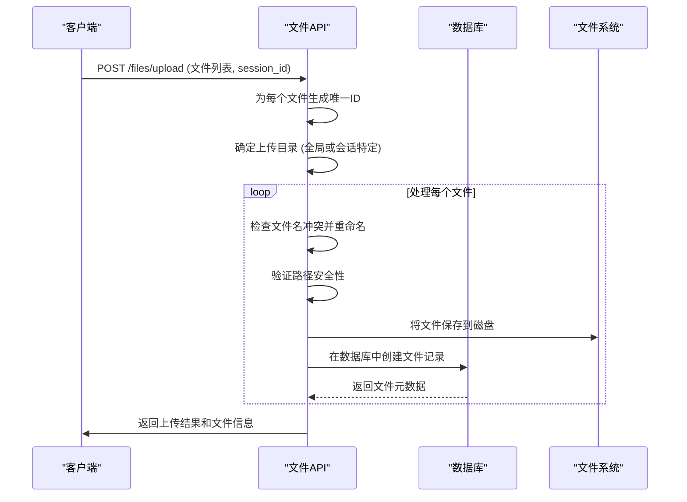
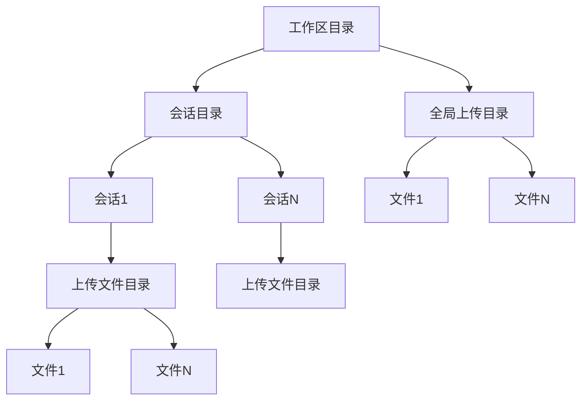
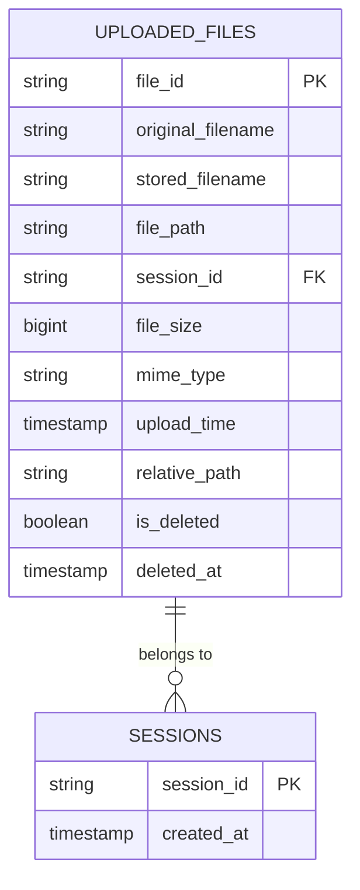

# 文件API

<cite>
**本文档引用的文件**   
- [files.py](file://vibe_surf/backend/api/files.py)
- [queries.py](file://vibe_surf/backend/database/queries.py)
- [models.py](file://vibe_surf/backend/database/models.py)
- [shared_state.py](file://vibe_surf/backend/shared_state.py)
- [use-post-upload-file.ts](file://vibe_surf/frontend/src/controllers/API/queries/file-management/use-post-upload-file.ts)
- [use-get-download-file.ts](file://vibe_surf/frontend/src/controllers/API/queries/file-management/use-get-download-file.ts)
- [use-get-files.ts](file://vibe_surf/frontend/src/controllers/API/queries/file-management/use-get-files.ts)
</cite>

## 目录
1. [简介](#简介)
2. [核心端点](#核心端点)
3. [文件存储与后端抽象](#文件存储与后端抽象)
4. [文件权限与安全](#文件权限与安全)
5. [前端集成](#前端集成)
6. [工作流中的使用模式](#工作流中的使用模式)

## 简介
文件API是VibeSurf平台的核心组件，负责管理所有文件的上传、下载、列表查询和元数据操作。该API为用户会话和全局操作提供统一的文件管理接口，支持将文件作为数据输入/输出集成到自动化工作流中。API设计注重安全性，通过路径验证和权限控制来防止路径遍历攻击，并将文件元数据与物理存储分离，以实现灵活的后端抽象。

**Section sources**
- [files.py](file://vibe_surf/backend/api/files.py#L1-L332)

## 核心端点

文件API提供了四个主要的REST端点，分别用于文件上传、下载、列表查询和删除操作。

### 文件上传
`POST /files/upload` 端点允许客户端上传一个或多个文件。文件可以上传到全局目录或特定会话的目录中。上传时，系统会生成唯一的文件ID，处理重复文件名，并将文件元数据存储在数据库中。



**Diagram sources**
- [files.py](file://vibe_surf/backend/api/files.py#L57-L149)

### 文件下载
`GET /files/{file_id}` 端点根据文件ID提供文件下载。系统首先从数据库中检索文件元数据，然后验证文件在磁盘上的存在性，并检查路径安全性，最后通过`FileResponse`返回文件内容。

### 文件列表查询
`GET /files` 端点返回已上传文件的列表，支持通过`session_id`进行过滤，并提供分页功能。`GET /files/session/{session_id}` 端点则列出特定会话目录中的所有文件和子目录。

### 文件删除
`DELETE /files/{file_id}` 端点执行文件的软删除。它首先从数据库中获取文件记录，然后从磁盘删除物理文件，最后在数据库中标记文件为已删除。

**Section sources**
- [files.py](file://vibe_surf/backend/api/files.py#L57-L262)

## 文件存储与后端抽象

文件API采用本地文件系统作为主要存储后端，但其设计支持未来的云存储扩展。文件存储路径由`workspace_dir`（工作区目录）和`session_id`（会话ID）共同决定，实现了全局文件和会话特定文件的隔离。

### 存储路径结构


**Diagram sources**
- [files.py](file://vibe_surf/backend/api/files.py#L31-L41)
- [shared_state.py](file://vibe_surf/backend/shared_state.py#L48)

### 数据库抽象
文件元数据（如文件ID、原始文件名、大小、MIME类型、上传时间等）存储在`uploaded_files`数据库表中，与物理文件路径分离。这种抽象层设计使得文件的逻辑管理与物理存储解耦，便于实现元数据查询、权限控制和未来存储后端的迁移。



**Diagram sources**
- [models.py](file://vibe_surf/backend/database/models.py#L138-L156)
- [queries.py](file://vibe_surf/backend/database/queries.py#L755-L879)

## 文件权限与安全

文件API实施了多层次的安全措施来保护文件系统。

### 路径安全验证
`is_safe_path()` 函数确保所有文件操作都在`workspace_dir`根目录内进行，防止路径遍历攻击。该函数通过比较绝对路径的前缀来验证目标路径是否在允许的基目录内。

### 权限控制
虽然当前实现主要依赖路径隔离，但数据库中的`session_id`字段为实现细粒度的访问控制提供了基础。未来可以通过扩展`UploadedFile`模型来支持用户ID和访问权限列表。

### 类型验证
API在上传时通过`mimetypes`模块推断文件的MIME类型，这有助于前端正确处理文件，但目前没有实施严格的文件类型白名单或病毒扫描。

**Section sources**
- [files.py](file://vibe_surf/backend/api/files.py#L44-L54)
- [files.py](file://vibe_surf/backend/api/files.py#L101)

## 前端集成

前端通过一系列React Hook与文件API进行交互，实现了文件管理器的完整功能。

### 前端Hook
- `usePostUploadFileV2`: 用于上传文件，支持在上传前更新UI状态。
- `useGetFilesV2`: 用于获取文件列表，支持数据缓存。
- `useGetDownloadFileV2`: 用于下载文件，直接处理二进制数据流以避免文件损坏。

```mermaid
flowchart TD
A[前端文件管理器] --> B[usePostUploadFileV2]
A --> C[useGetFilesV2]
A --> D[useGetDownloadFileV2]
A --> E[useDuplicateFileV2]
B --> F[POST /files/upload]
C --> G[GET /files]
D --> H[GET /files/{file_id}]
E --> I[先下载再上传]
F --> J[后端API]
G --> J
H --> J
I --> J
```

**Diagram sources**
- [use-post-upload-file.ts](file://vibe_surf/frontend/src/controllers/API/queries/file-management/use-post-upload-file.ts)
- [use-get-files.ts](file://vibe_surf/frontend/src/controllers/API/queries/file-management/use-get-files.ts)
- [use-get-download-file.ts](file://vibe_surf/frontend/src/controllers/API/queries/file-management/use-get-download-file.ts)

## 工作流中的使用模式

文件在VibeSurf工作流中扮演着关键角色，主要作为数据输入和输出。

### 作为数据输入
当用户启动一个任务时，可以指定一个或多个已上传的文件作为输入。这些文件的路径会通过`upload_files_path`参数传递给任务执行引擎，供代理（Agent）在执行过程中读取和分析。

### 作为数据输出
任务执行完成后，生成的报告或其他输出文件会自动保存到会话的`reports`目录中。这些文件随后可以通过文件API进行访问和下载，形成一个完整的数据闭环。

**Section sources**
- [files.py](file://vibe_surf/backend/api/files.py#L108-L111)
- [shared_state.py](file://vibe_surf/backend/shared_state.py#L175-L185)