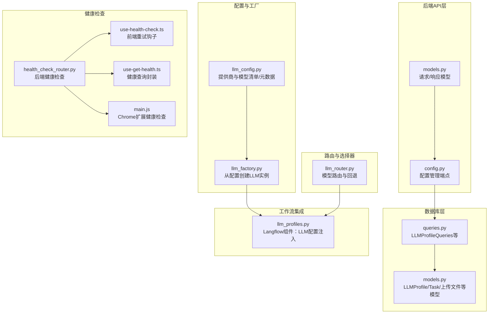
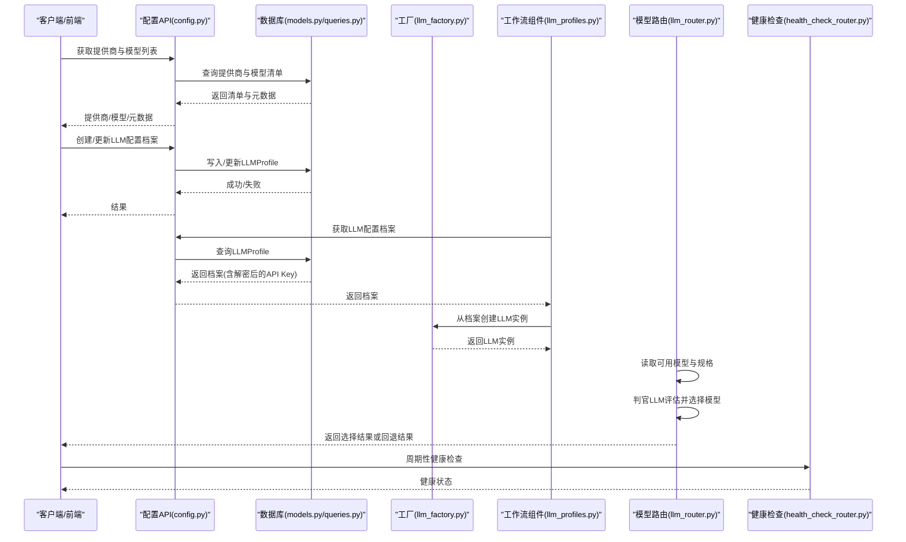
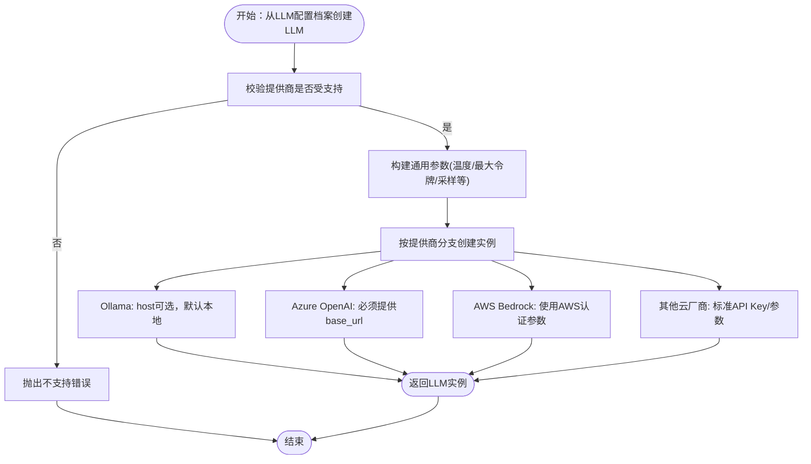
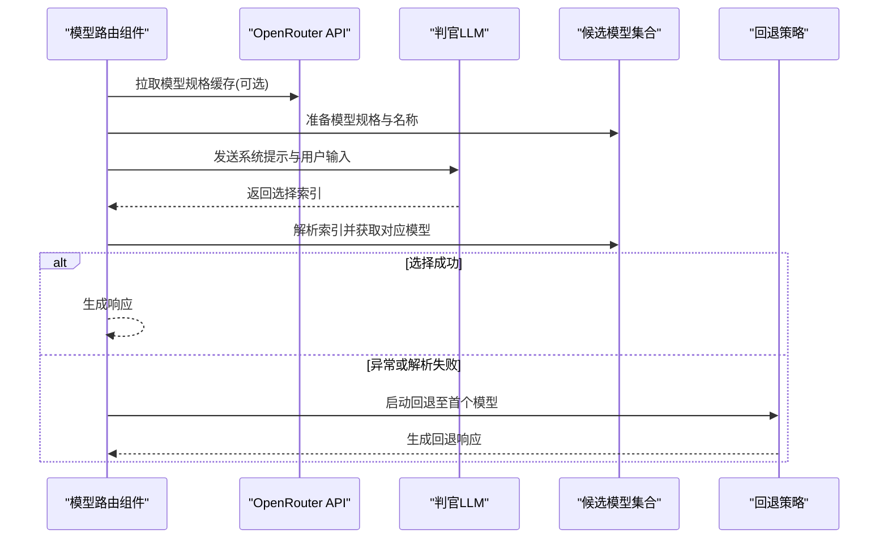
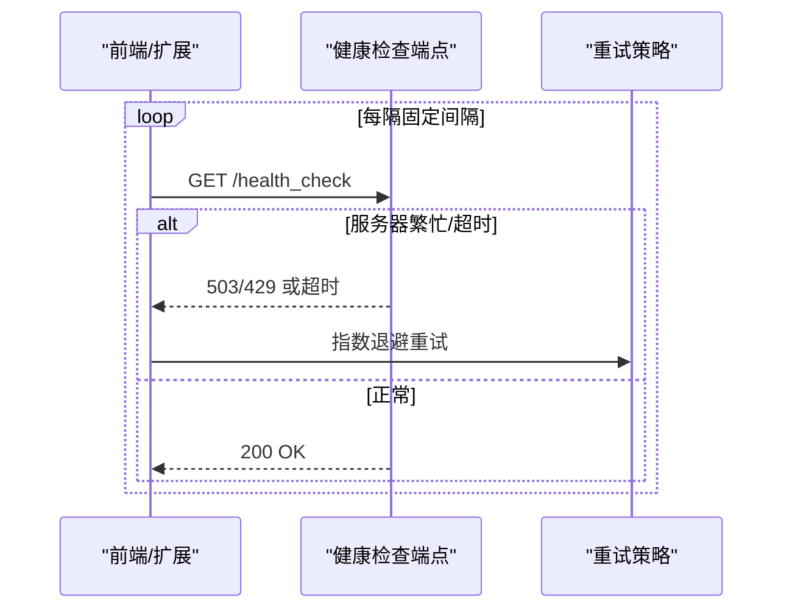
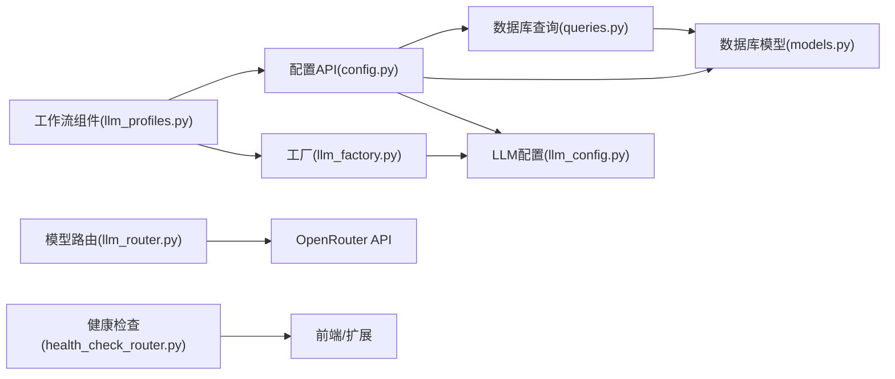

# 模型API

<cite>
**本文引用的文件**
- [models.py](file://vibe_surf/backend/api/models.py)
- [llm_config.py](file://vibe_surf/backend/llm_config.py)
- [llm_factory.py](file://vibe_surf/backend/utils/llm_factory.py)
- [config.py](file://vibe_surf/backend/api/config.py)
- [models.py](file://vibe_surf/backend/database/models.py)
- [queries.py](file://vibe_surf/backend/database/queries.py)
- [llm_profiles.py](file://vibe_surf/workflows/VibeSurf/llm_profiles.py)
- [llm_router.py](file://vibe_surf/langflow/components/processing/llm_router.py)
- [health_check_router.py](file://vibe_surf/langflow/api/health_check_router.py)
- [use-health-check.ts](file://vibe_surf/frontend/src/pages/AppWrapperPage/hooks/use-health-check.ts)
- [use-get-health.ts](file://vibe_surf/frontend/src/controllers/API/queries/health/use-get-health.ts)
- [main.js](file://vibe_surf/chrome_extension/scripts/main.js)
</cite>

## 目录
1. [简介](#简介)
2. [项目结构](#项目结构)
3. [核心组件](#核心组件)
4. [架构总览](#架构总览)
5. [详细组件分析](#详细组件分析)
6. [依赖关系分析](#依赖关系分析)
7. [性能考量](#性能考量)
8. [故障排查指南](#故障排查指南)
9. [结论](#结论)
10. [附录](#附录)

## 简介
本文件系统化梳理并说明后端模型API的设计与实现，重点覆盖以下方面：
- LLM模型发现、配置与测试：通过统一的LLM配置中心与工厂方法，支持本地Ollama与多家云厂商（OpenAI、Anthropic、Google、Azure OpenAI、Groq、OpenRouter、DeepSeek、AWS Bedrock、LM Studio等）。
- 模型元数据管理：提供“提供商+模型”清单、能力开关（工具调用、视觉）、默认模型与基础URL等元数据，便于前端与工作流层进行可视化与选择。
- 集成方式：通过配置API创建/更新/删除LLM配置档案；通过工厂方法从档案动态构建具体LLM实例；在工作流中以组件形式注入LLM配置。
- 健康检查与故障转移：后端提供通用健康检查接口，前端与扩展侧周期性拉取并按指数退避重试；模型路由组件具备自动回退策略。
- 模型选择器：在Langflow中提供基于“判官LLM”的模型路由组件，结合OpenRouter规格信息与优化偏好（质量/速度/成本/平衡）进行智能选择，并可回退至首个模型。

## 项目结构
围绕模型API的关键目录与文件如下：
- 后端API层：定义请求/响应模型与配置管理端点
- 配置与工厂：集中管理支持的提供商与模型清单，以及从配置生成LLM实例
- 数据库层：LLM配置档案的持久化与查询
- 工作流集成：将LLM配置注入到Langflow组件
- 路由与选择器：在Langflow中实现模型选择与回退
- 健康检查：后端健康检查与前端/扩展侧重试机制

图表来源
- [models.py](file://vibe_surf/backend/api/models.py#L1-L260)
- [config.py](file://vibe_surf/backend/api/config.py#L1-L762)
- [llm_config.py](file://vibe_surf/backend/llm_config.py#L1-L226)
- [llm_factory.py](file://vibe_surf/backend/utils/llm_factory.py#L1-L275)
- [models.py](file://vibe_surf/backend/database/models.py#L1-L289)
- [queries.py](file://vibe_surf/backend/database/queries.py#L1-L800)
- [llm_profiles.py](file://vibe_surf/workflows/VibeSurf/llm_profiles.py#L1-L104)
- [llm_router.py](file://vibe_surf/langflow/components/processing/llm_router.py#L100-L500)
- [health_check_router.py](file://vibe_surf/langflow/api/health_check_router.py#L37-L65)
- [use-health-check.ts](file://vibe_surf/frontend/src/pages/AppWrapperPage/hooks/use-health-check.ts#L1-L56)
- [use-get-health.ts](file://vibe_surf/frontend/src/controllers/API/queries/health/use-get-health.ts#L1-L46)
- [main.js](file://vibe_surf/chrome_extension/scripts/main.js#L211-L239)

章节来源
- [models.py](file://vibe_surf/backend/api/models.py#L1-L260)
- [config.py](file://vibe_surf/backend/api/config.py#L1-L762)
- [llm_config.py](file://vibe_surf/backend/llm_config.py#L1-L226)
- [llm_factory.py](file://vibe_surf/backend/utils/llm_factory.py#L1-L275)
- [models.py](file://vibe_surf/backend/database/models.py#L1-L289)
- [queries.py](file://vibe_surf/backend/database/queries.py#L1-L800)
- [llm_profiles.py](file://vibe_surf/workflows/VibeSurf/llm_profiles.py#L1-L104)
- [llm_router.py](file://vibe_surf/langflow/components/processing/llm_router.py#L100-L500)
- [health_check_router.py](file://vibe_surf/langflow/api/health_check_router.py#L37-L65)
- [use-health-check.ts](file://vibe_surf/frontend/src/pages/AppWrapperPage/hooks/use-health-check.ts#L1-L56)
- [use-get-health.ts](file://vibe_surf/frontend/src/controllers/API/queries/health/use-get-health.ts#L1-L46)
- [main.js](file://vibe_surf/chrome_extension/scripts/main.js#L211-L239)

## 核心组件
- 请求/响应模型：定义LLM配置档案的创建、更新、列表、获取与任务相关模型，确保前后端一致的数据契约。
- 配置管理端点：提供LLM配置档案的增删改查、默认配置设置、可用提供商与模型列表查询、环境变量管理等。
- 提供商与模型清单：集中维护支持的提供商、模型列表与元数据（是否需要API Key、是否支持base_url、是否支持工具调用/视觉、默认模型等）。
- 工厂方法：根据LLM配置档案动态创建对应LLM实例，处理参数支持差异与认证方式差异。
- 数据库模型与查询：LLMProfile、Task、上传文件等模型与查询操作，支撑配置持久化与任务关联。
- 工作流组件：Langflow组件将LLM配置注入到工作流节点，支持动态刷新与默认配置选择。
- 模型路由与回退：基于判官LLM的模型选择器，结合OpenRouter规格与优化偏好，失败时自动回退至首个模型。
- 健康检查：后端健康检查端点，前端与扩展侧周期性轮询并按指数退避重试。

章节来源
- [models.py](file://vibe_surf/backend/api/models.py#L1-L260)
- [config.py](file://vibe_surf/backend/api/config.py#L1-L762)
- [llm_config.py](file://vibe_surf/backend/llm_config.py#L1-L226)
- [llm_factory.py](file://vibe_surf/backend/utils/llm_factory.py#L1-L275)
- [models.py](file://vibe_surf/backend/database/models.py#L1-L289)
- [queries.py](file://vibe_surf/backend/database/queries.py#L1-L800)
- [llm_profiles.py](file://vibe_surf/workflows/VibeSurf/llm_profiles.py#L1-L104)
- [llm_router.py](file://vibe_surf/langflow/components/processing/llm_router.py#L100-L500)
- [health_check_router.py](file://vibe_surf/langflow/api/health_check_router.py#L37-L65)

## 架构总览
下图展示模型API在系统中的位置与交互关系。

图表来源
- [config.py](file://vibe_surf/backend/api/config.py#L585-L762)
- [models.py](file://vibe_surf/backend/database/models.py#L1-L289)
- [queries.py](file://vibe_surf/backend/database/queries.py#L1-L800)
- [llm_factory.py](file://vibe_surf/backend/utils/llm_factory.py#L1-L275)
- [llm_profiles.py](file://vibe_surf/workflows/VibeSurf/llm_profiles.py#L1-L104)
- [llm_router.py](file://vibe_surf/langflow/components/processing/llm_router.py#L100-L500)
- [health_check_router.py](file://vibe_surf/langflow/api/health_check_router.py#L37-L65)

## 详细组件分析

### 1) 配置API与模型发现
- 端点职责
  - 列出所有LLM提供商及其模型与元数据
  - 获取指定提供商的模型列表与元数据
  - 管理LLM配置档案：创建、查询、更新、删除、设为默认
  - 管理MCP配置档案
  - 获取整体配置状态与环境变量
- 关键实现要点
  - 使用统一的LLM配置中心获取提供商清单与元数据，避免硬编码
  - 对LLM配置档案进行加密存储，查询时解密返回
  - 默认配置设置时会先清除其他默认标记，再设置当前档案
  - 提供环境变量管理端点，便于代理/工作流运行时调整网络代理等

章节来源
- [config.py](file://vibe_surf/backend/api/config.py#L585-L762)
- [llm_config.py](file://vibe_surf/backend/llm_config.py#L1-L226)
- [queries.py](file://vibe_surf/backend/database/queries.py#L1-L800)

### 2) 模型元数据与能力管理
- 元数据字段
  - 显示名、是否需要API Key、是否需要base_url、是否支持工具调用、是否支持视觉、默认模型、默认base_url等
- 模型清单
  - 覆盖OpenAI、Anthropic、Google、Azure OpenAI、Groq、Ollama、OpenRouter、DeepSeek、AWS Bedrock、LM Studio等
- 使用场景
  - 前端用于展示与筛选
  - 工厂方法用于参数支持判断与认证方式适配
  - 路由器用于OpenRouter规格获取与模型选择

章节来源
- [llm_config.py](file://vibe_surf/backend/llm_config.py#L1-L226)
- [llm_router.py](file://vibe_surf/langflow/components/processing/llm_router.py#L100-L276)

### 3) 工厂方法与本地/云模型集成
- 支持的提供商与实例类型
  - OpenAI、Anthropic、Google、Azure OpenAI、Groq、Ollama、OpenRouter、DeepSeek、AWS Bedrock、Anthropic Bedrock、OpenAI Compatible、Qwen、Kimi、LM Studio等
- 参数支持差异
  - 不同提供商对temperature、max_tokens、top_p、frequency_penalty、seed的支持不同
  - OpenRouter不支持max_tokens；Azure OpenAI需要base_url；AWS Bedrock使用不同的认证参数
- 认证与连接
  - 本地Ollama默认host为本地端口，可覆盖
  - OpenAI Compatible需提供base_url
  - AWS Bedrock需提供region等参数
- 错误处理
  - 对不支持的提供商抛出明确错误
  - 对配置缺失（如缺少API Key或base_url）进行校验并报错

图表来源
- [llm_factory.py](file://vibe_surf/backend/utils/llm_factory.py#L1-L275)

章节来源
- [llm_factory.py](file://vibe_surf/backend/utils/llm_factory.py#L1-L275)

### 4) 数据库模型与查询
- LLMProfile模型
  - 存储提供商、模型、base_url、加密API Key、温度、最大令牌、top_p、频率惩罚、种子、提供商特定配置、描述、激活/默认标志、时间戳等
- 查询操作
  - 创建、查询、列表、更新、删除、设置默认、更新最后使用时间
  - 获取带解密API Key的档案
- 任务与文件
  - Task模型包含任务描述、状态、LLM配置档案名称、上传文件路径、工作空间目录、MCP配置、代理模式、结果、错误信息、报告路径、时间戳等
  - UploadedFile模型记录上传文件信息

章节来源
- [models.py](file://vibe_surf/backend/database/models.py#L1-L289)
- [queries.py](file://vibe_surf/backend/database/queries.py#L1-L800)

### 5) 工作流中的模型选择器
- 组件职责
  - 动态加载可用LLM配置档案名称，支持默认配置优先
  - 将选定的LLM配置转换为实际的LLM实例，供工作流节点使用
- 与工厂方法协作
  - 通过LLMProfileQueries获取档案，再交由llm_factory创建实例
- 与前端/扩展联动
  - 在Langflow界面中作为组件输入，支持实时刷新与默认值选择

章节来源
- [llm_profiles.py](file://vibe_surf/workflows/VibeSurf/llm_profiles.py#L1-L104)
- [llm_factory.py](file://vibe_surf/backend/utils/llm_factory.py#L1-L275)
- [queries.py](file://vibe_surf/backend/database/queries.py#L1-L800)

### 6) 模型路由与故障转移
- 路由逻辑
  - 可选使用OpenRouter规格缓存，结合输入长度与优化偏好（质量/速度/成本/平衡），通过判官LLM选择最优模型
  - 输出包含路由决策说明与所选模型信息
- 故障转移
  - 当路由过程中出现异常且启用回退时，自动切换到第一个模型继续执行
  - 回退时记录路由决策日志，便于问题定位

图表来源
- [llm_router.py](file://vibe_surf/langflow/components/processing/llm_router.py#L277-L443)

章节来源
- [llm_router.py](file://vibe_surf/langflow/components/processing/llm_router.py#L100-L500)

### 7) 健康检查与重试策略
- 后端健康检查
  - 提供统一健康检查端点，检查数据库与聊天服务连通性，返回状态
- 前端与扩展
  - 前端定时轮询健康状态，遇到503/429时按指数退避重试
  - Chrome扩展周期性调用后端健康检查接口，静默处理失败

图表来源
- [health_check_router.py](file://vibe_surf/langflow/api/health_check_router.py#L37-L65)
- [use-health-check.ts](file://vibe_surf/frontend/src/pages/AppWrapperPage/hooks/use-health-check.ts#L1-L56)
- [use-get-health.ts](file://vibe_surf/frontend/src/controllers/API/queries/health/use-get-health.ts#L1-L46)
- [main.js](file://vibe_surf/chrome_extension/scripts/main.js#L211-L239)

章节来源
- [health_check_router.py](file://vibe_surf/langflow/api/health_check_router.py#L37-L65)
- [use-health-check.ts](file://vibe_surf/frontend/src/pages/AppWrapperPage/hooks/use-health-check.ts#L1-L56)
- [use-get-health.ts](file://vibe_surf/frontend/src/controllers/API/queries/health/use-get-health.ts#L1-L46)
- [main.js](file://vibe_surf/chrome_extension/scripts/main.js#L211-L239)

## 依赖关系分析
- 组件耦合
  - API层依赖数据库查询层与LLM配置中心
  - 工厂方法依赖LLM配置中心与第三方LLM SDK
  - 工作流组件依赖API层与工厂方法
  - 路由组件依赖OpenRouter API与判官LLM
  - 健康检查独立于业务逻辑，仅依赖后端服务
- 外部依赖
  - 第三方LLM SDK（OpenAI、Anthropic、Google、Azure OpenAI、Groq、Ollama、OpenRouter、DeepSeek、AWS Bedrock等）
  - OpenRouter API（可选，用于模型规格缓存）

图表来源
- [config.py](file://vibe_surf/backend/api/config.py#L1-L762)
- [queries.py](file://vibe_surf/backend/database/queries.py#L1-L800)
- [models.py](file://vibe_surf/backend/database/models.py#L1-L289)
- [llm_config.py](file://vibe_surf/backend/llm_config.py#L1-L226)
- [llm_factory.py](file://vibe_surf/backend/utils/llm_factory.py#L1-L275)
- [llm_profiles.py](file://vibe_surf/workflows/VibeSurf/llm_profiles.py#L1-L104)
- [llm_router.py](file://vibe_surf/langflow/components/processing/llm_router.py#L100-L500)
- [health_check_router.py](file://vibe_surf/langflow/api/health_check_router.py#L37-L65)

章节来源
- [config.py](file://vibe_surf/backend/api/config.py#L1-L762)
- [queries.py](file://vibe_surf/backend/database/queries.py#L1-L800)
- [llm_config.py](file://vibe_surf/backend/llm_config.py#L1-L226)
- [llm_factory.py](file://vibe_surf/backend/utils/llm_factory.py#L1-L275)
- [llm_profiles.py](file://vibe_surf/workflows/VibeSurf/llm_profiles.py#L1-L104)
- [llm_router.py](file://vibe_surf/langflow/components/processing/llm_router.py#L100-L500)
- [health_check_router.py](file://vibe_surf/langflow/api/health_check_router.py#L37-L65)

## 性能考量
- 模型规格缓存：OpenRouter规格缓存可显著减少外部API调用次数，建议在路由组件中开启并复用缓存
- 参数支持过滤：工厂方法按提供商过滤参数，避免无效参数导致SDK警告或失败
- 数据库访问：查询LLM配置档案时尽量批量获取并使用索引，避免频繁I/O
- 健康检查：前端与扩展侧采用指数退避，降低对后端的压力峰值
- 路由回退：在异常情况下快速回退至首个模型，保证工作流连续性

## 故障排查指南
- 常见错误与定位
  - “不支持的提供商”：检查提供商名称是否在配置中心清单中
  - “缺少API Key或base_url”：根据提供商元数据要求补齐
  - “健康检查失败/超时”：前端/扩展侧按指数退避重试；检查网络代理与后端服务状态
  - “路由异常”：查看路由组件日志，确认判官LLM输出是否为数字索引；必要时关闭OpenRouter规格缓存回退到基础模式
- 排查步骤
  - 通过配置API列出提供商与模型，确认目标提供商与模型存在
  - 使用配置API创建/更新LLM配置档案，验证默认配置设置
  - 在工作流组件中选择LLM配置并尝试创建实例
  - 观察健康检查端点返回状态，前端/扩展侧重试行为是否符合预期

章节来源
- [llm_factory.py](file://vibe_surf/backend/utils/llm_factory.py#L1-L275)
- [llm_router.py](file://vibe_surf/langflow/components/processing/llm_router.py#L277-L443)
- [health_check_router.py](file://vibe_surf/langflow/api/health_check_router.py#L37-L65)
- [use-health-check.ts](file://vibe_surf/frontend/src/pages/AppWrapperPage/hooks/use-health-check.ts#L1-L56)

## 结论
本模型API通过统一的配置中心、工厂方法与工作流组件，实现了对本地与多家云厂商LLM的标准化接入；配合健康检查与指数退避重试策略，提升了系统的稳定性与可用性；通过模型路由与回退机制，进一步增强了在复杂场景下的鲁棒性。建议在生产环境中：
- 开启OpenRouter规格缓存以提升路由效率
- 为关键提供商配置默认模型与base_url
- 在前端/扩展侧保持健康检查与重试策略
- 对路由异常建立完善的日志与告警机制

## 附录
- 端点一览（节选）
  - GET /config/llm/providers：获取可用提供商与模型列表及元数据
  - GET /config/llm/providers/{provider_name}/models：获取指定提供商的模型列表与元数据
  - POST/GET/PUT/DELETE /config/llm-profiles：管理LLM配置档案
  - GET /config/status：获取整体配置状态
  - GET /health_check：后端健康检查
- 工作流集成
  - LLMProfilesComponent：动态加载LLM配置档案并创建LLM实例
- 路由与回退
  - LLM Router：基于判官LLM的模型选择与回退策略

章节来源
- [config.py](file://vibe_surf/backend/api/config.py#L585-L762)
- [health_check_router.py](file://vibe_surf/langflow/api/health_check_router.py#L37-L65)
- [llm_profiles.py](file://vibe_surf/workflows/VibeSurf/llm_profiles.py#L1-L104)
- [llm_router.py](file://vibe_surf/langflow/components/processing/llm_router.py#L100-L500)