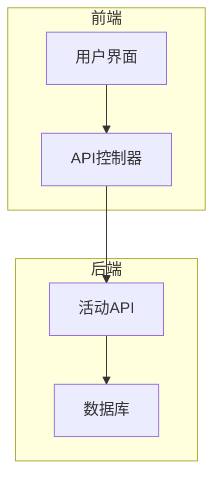
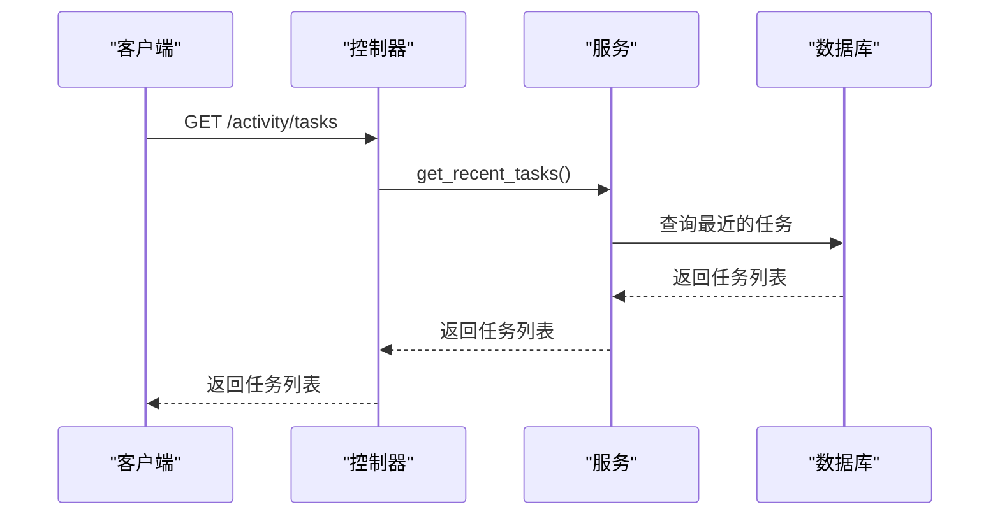
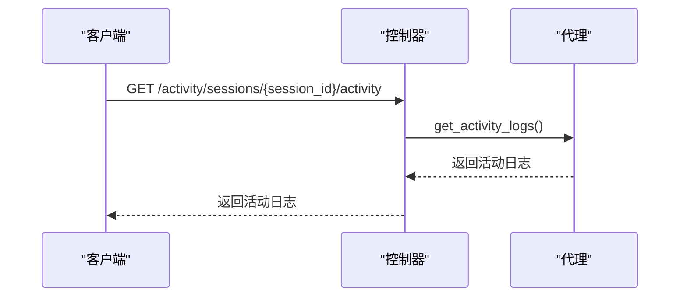
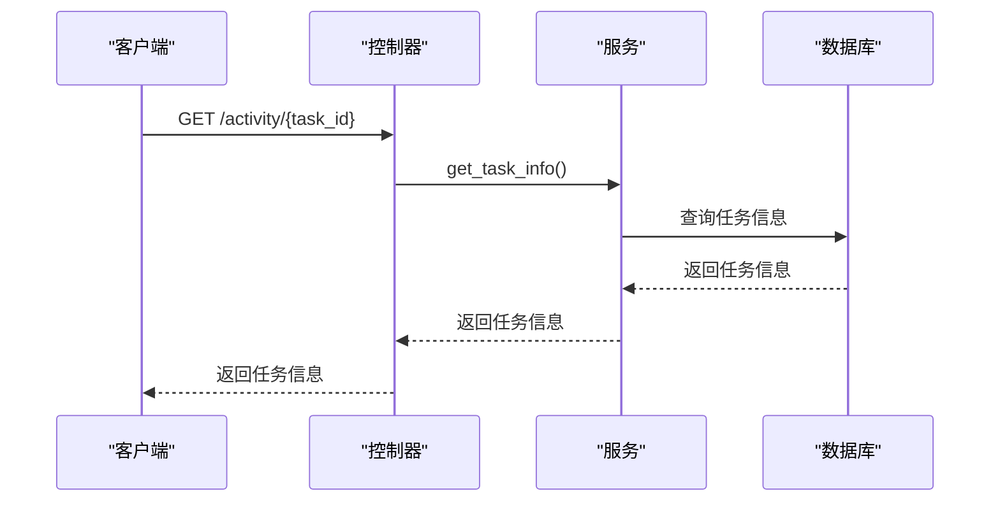
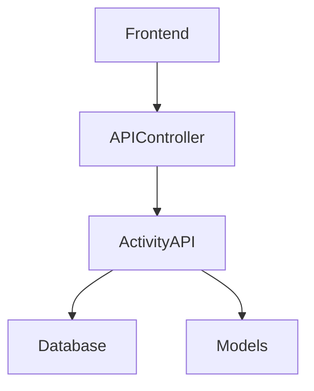

# 活动API

<cite>
**本文档引用的文件**
- [activity.py](file://vibe_surf/backend/api/activity.py)
- [models.py](file://vibe_surf/backend/api/models.py)
- [queries.py](file://vibe_surf/backend/database/queries.py)
- [models.py](file://vibe_surf/backend/database/models.py)
- [shared_state.py](file://vibe_surf/backend/shared_state.py)
- [vibe_surf_agent.py](file://vibe_surf/agents/vibe_surf_agent.py)
- [index.ts](file://vibe_surf/frontend/src/controllers/API/index.ts)
- [constants.ts](file://vibe_surf/frontend/src/constants/constants.ts)
</cite>

## 目录
1. [简介](#简介)
2. [项目结构](#项目结构)
3. [核心组件](#核心组件)
4. [架构概述](#架构概述)
5. [详细组件分析](#详细组件分析)
6. [依赖分析](#依赖分析)
7. [性能考虑](#性能考虑)
8. [故障排除指南](#故障排除指南)
9. [结论](#结论)
10. [附录](#附录) (如有必要)

## 简介
活动API为VibeSurf系统提供用户活动历史、代理执行日志和任务执行状态的RESTful端点。该API支持数据分页、过滤和排序功能，与数据库查询集成，并支持用户行为分析和系统监控功能。通过前端调用，可以显示用户活动流。

## 项目结构
活动API位于`vibe_surf/backend/api/activity.py`文件中，依赖于数据库查询和模型定义。前端通过API控制器调用这些端点。

**Diagram sources**
- [activity.py](file://vibe_surf/backend/api/activity.py#L1-L246)
- [index.ts](file://vibe_surf/frontend/src/controllers/API/index.ts#L1-L304)

**Section sources**
- [activity.py](file://vibe_surf/backend/api/activity.py#L1-L246)
- [index.ts](file://vibe_surf/frontend/src/controllers/API/index.ts#L1-L304)

## 核心组件
活动API的核心组件包括获取用户活动历史、记录代理执行日志和查询任务执行状态的端点。这些端点通过HTTP方法、URL路径、请求参数、响应数据结构和状态码进行详细描述。

**Section sources**
- [activity.py](file://vibe_surf/backend/api/activity.py#L1-L246)
- [models.py](file://vibe_surf/backend/api/models.py#L1-L260)

## 架构概述
活动API的架构包括前端、API控制器、活动API和数据库。前端通过API控制器调用活动API，活动API与数据库交互以获取和存储数据。

**Diagram sources**
- [activity.py](file://vibe_surf/backend/api/activity.py#L1-L246)
- [index.ts](file://vibe_surf/frontend/src/controllers/API/index.ts#L1-L304)

## 详细组件分析
### 获取用户活动历史
获取用户活动历史的端点通过`/activity/tasks`路径提供，支持分页和排序功能。

#### 对于API/服务组件：

**Diagram sources**
- [activity.py](file://vibe_surf/backend/api/activity.py#L25-L56)
- [queries.py](file://vibe_surf/backend/database/queries.py#L555-L567)

### 记录代理执行日志
记录代理执行日志的端点通过`/activity/sessions/{session_id}/activity`路径提供，支持实时日志查询。

#### 对于API/服务组件：

**Diagram sources**
- [activity.py](file://vibe_surf/backend/api/activity.py#L153-L216)
- [vibe_surf_agent.py](file://vibe_surf/agents/vibe_surf_agent.py#L1798-L1823)

### 查询任务执行状态
查询任务执行状态的端点通过`/activity/{task_id}`路径提供，返回任务的详细信息。

#### 对于API/服务组件：

**Diagram sources**
- [activity.py](file://vibe_surf/backend/api/activity.py#L119-L145)
- [queries.py](file://vibe_surf/backend/database/queries.py#L524-L533)

**Section sources**
- [activity.py](file://vibe_surf/backend/api/activity.py#L1-L246)
- [queries.py](file://vibe_surf/backend/database/queries.py#L524-L567)

## 依赖分析
活动API依赖于数据库查询和模型定义，以及前端API控制器。这些依赖关系确保了数据的正确获取和展示。

**Diagram sources**
- [activity.py](file://vibe_surf/backend/api/activity.py#L1-L246)
- [models.py](file://vibe_surf/backend/api/models.py#L1-L260)
- [queries.py](file://vibe_surf/backend/database/queries.py#L1-L800)

**Section sources**
- [activity.py](file://vibe_surf/backend/api/activity.py#L1-L246)
- [models.py](file://vibe_surf/backend/api/models.py#L1-L260)
- [queries.py](file://vibe_surf/backend/database/queries.py#L1-L800)

## 性能考虑
活动API通过分页和排序功能优化了数据查询性能，减少了前端的加载时间。数据库查询的优化确保了快速响应。

## 故障排除指南
如果活动API无法正常工作，请检查数据库连接和前端API控制器的配置。确保所有依赖项都已正确安装和配置。

**Section sources**
- [activity.py](file://vibe_surf/backend/api/activity.py#L1-L246)
- [queries.py](file://vibe_surf/backend/database/queries.py#L1-L800)

## 结论
活动API为VibeSurf系统提供了强大的用户活动历史、代理执行日志和任务执行状态的RESTful端点。通过前端调用，可以有效地展示用户活动流，支持用户行为分析和系统监控功能。