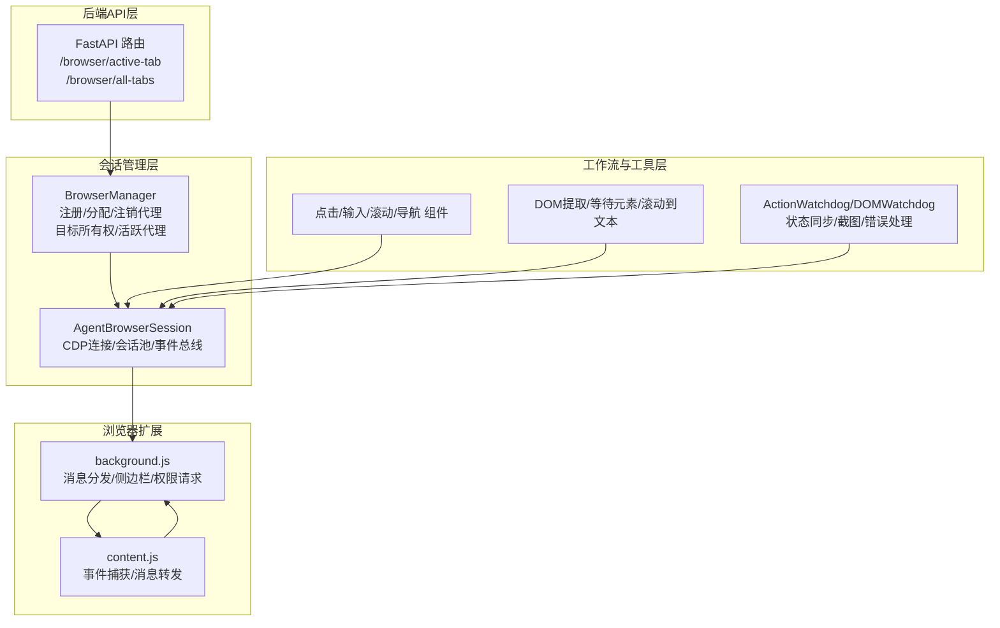
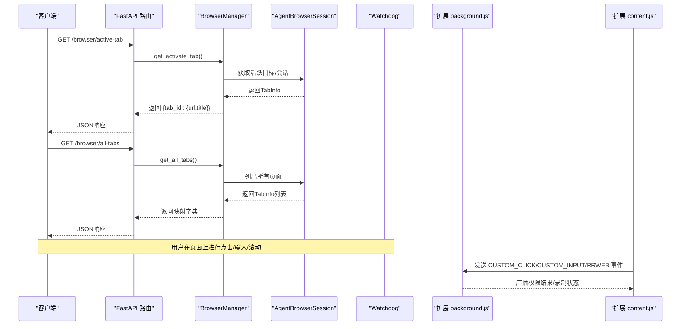
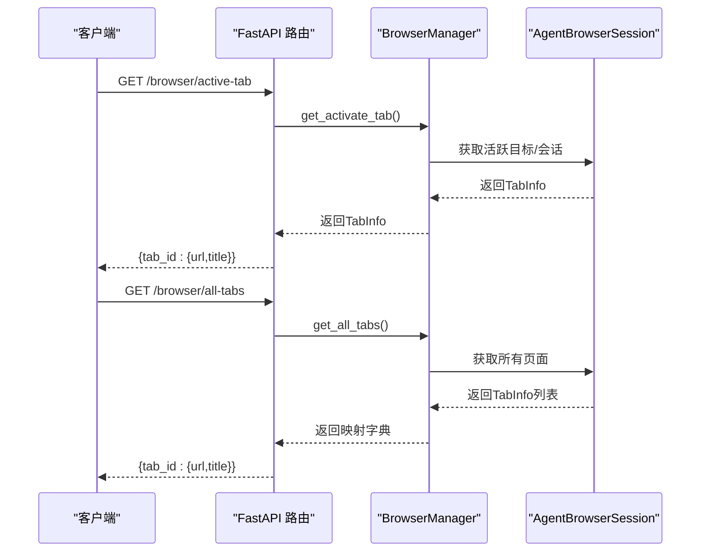
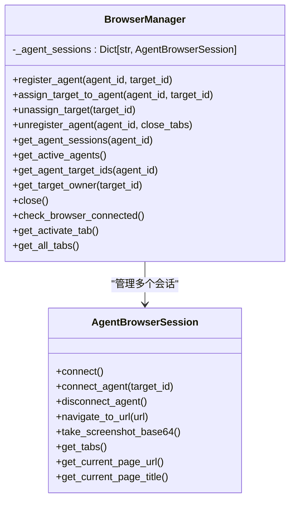
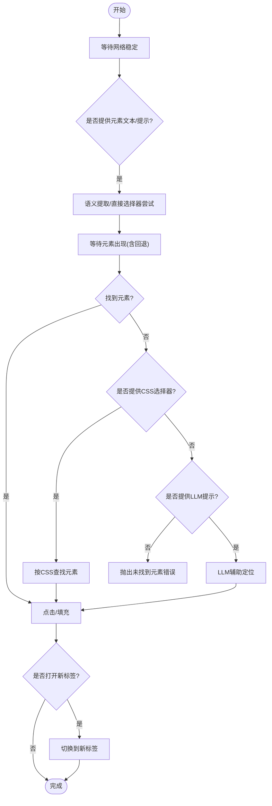
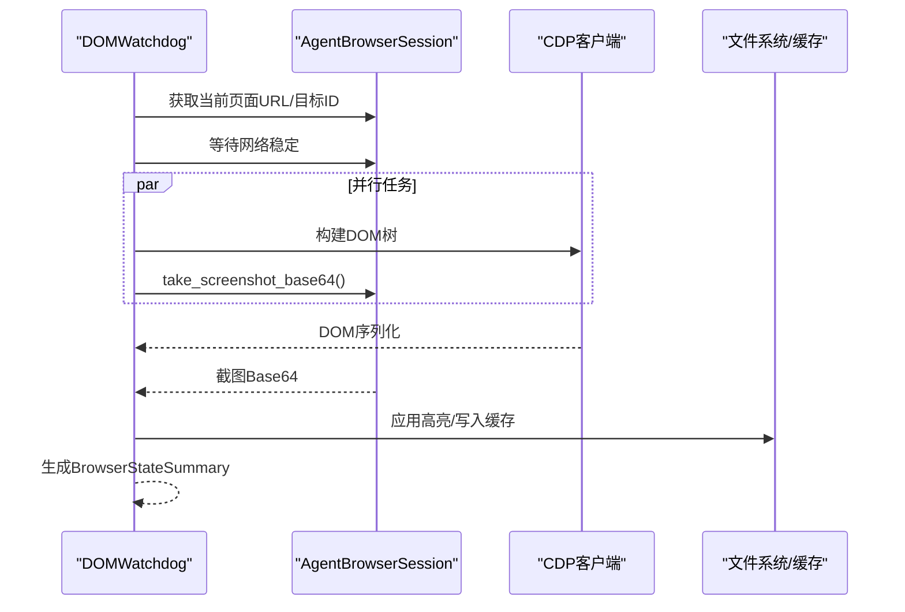
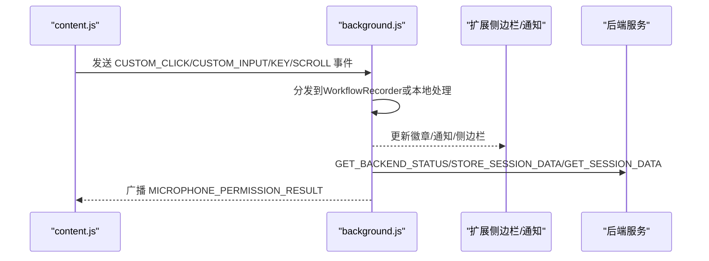
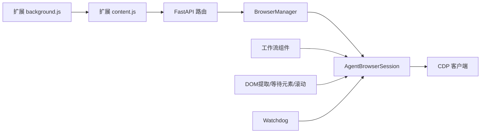

# 浏览器API

<cite>
**本文引用的文件**
- [browser.py](file://vibe_surf/backend/api/browser.py)
- [browser_manager.py](file://vibe_surf/browser/browser_manager.py)
- [agent_browser_session.py](file://vibe_surf/browser/agent_browser_session.py)
- [page_operations.py](file://vibe_surf/browser/page_operations.py)
- [find_page_element.py](file://vibe_surf/browser/find_page_element.py)
- [action_watchdog.py](file://vibe_surf/browser/watchdogs/action_watchdog.py)
- [dom_watchdog.py](file://vibe_surf/browser/watchdogs/dom_watchdog.py)
- [browser_click_element.py](file://vibe_surf/workflows/Browser/browser_click_element.py)
- [browser_input_text.py](file://vibe_surf/workflows/Browser/browser_input_text.py)
- [browser_navigate.py](file://vibe_surf/workflows/Browser/browser_navigate.py)
- [browser_scroll.py](file://vibe_surf/workflows/Browser/browser_scroll.py)
- [background.js](file://vibe_surf/chrome_extension/background.js)
- [content.js](file://vibe_surf/chrome_extension/content.js)
</cite>

## 目录
1. [简介](#简介)
2. [项目结构](#项目结构)
3. [核心组件](#核心组件)
4. [架构总览](#架构总览)
5. [详细组件分析](#详细组件分析)
6. [依赖关系分析](#依赖关系分析)
7. [性能考虑](#性能考虑)
8. [故障排查指南](#故障排查指南)
9. [结论](#结论)

## 简介
本文件系统化梳理浏览器API，覆盖以下方面：
- 后端FastAPI路由：浏览器标签页查询接口
- 浏览器会话管理：多代理隔离、目标分配、生命周期控制
- 标签页操作：激活标签、列出所有标签
- DOM元素交互：点击、输入、滚动、滚动到文本定位
- 页面导航：跳转指定URL
- 浏览器状态同步：DOM树构建、截图、页面信息
- 性能监控与错误恢复：网络稳定等待、异常降级、高亮截图
- 与浏览器扩展的实时通信协议：消息类型、事件捕获与转发

## 项目结构
浏览器API由三层构成：
- 后端API层：提供REST接口，封装对BrowserManager的调用
- 会话管理层：BrowserManager负责多代理隔离、目标分配与生命周期
- 工作流与工具层：基于AgentBrowserSession执行具体动作（点击、输入、滚动等），并通过Watchdog实现状态同步与错误处理

图表来源
- [browser.py](file://vibe_surf/backend/api/browser.py#L1-L71)
- [browser_manager.py](file://vibe_surf/browser/browser_manager.py#L1-L269)
- [agent_browser_session.py](file://vibe_surf/browser/agent_browser_session.py#L1-L800)
- [page_operations.py](file://vibe_surf/browser/page_operations.py#L1-L223)
- [find_page_element.py](file://vibe_surf/browser/find_page_element.py#L1-L800)
- [action_watchdog.py](file://vibe_surf/browser/watchdogs/action_watchdog.py#L1-L109)
- [dom_watchdog.py](file://vibe_surf/browser/watchdogs/dom_watchdog.py#L1-L250)
- [background.js](file://vibe_surf/chrome_extension/background.js#L1-L800)
- [content.js](file://vibe_surf/chrome_extension/content.js#L1-L745)

章节来源
- [browser.py](file://vibe_surf/backend/api/browser.py#L1-L71)
- [browser_manager.py](file://vibe_surf/browser/browser_manager.py#L1-L269)

## 核心组件
- FastAPI浏览器路由
  - GET /browser/active-tab：返回当前活动标签的信息（URL、标题）
  - GET /browser/all-tabs：返回所有页面标签的信息（URL、标题）
- BrowserManager
  - 注册代理、分配目标、注销代理、关闭所有会话
  - 获取活跃代理、目标拥有者、检查浏览器连接
  - 计算“活跃目标”（可见且获得焦点）
- AgentBrowserSession
  - CDP连接、会话池管理、事件总线绑定、欢迎模态注入、代理认证设置
  - 提供导航、截图、等待网络稳定等能力
- 工作流组件
  - 点击元素、输入文本、滚动、导航
- Watchdog
  - 自定义ActionWatchdog：点击事件处理、新标签检测、打印按钮PDF生成
  - 自定义DOMWatchdog：并发构建DOM、截图、高亮、页面信息采集、错误降级
- 扩展通信
  - background.js：消息分发、侧边栏打开、后台健康检查、剪贴板、录音权限、会话数据存储
  - content.js：事件捕获（点击/输入/按键）、消息转发、高亮、滚动到元素

章节来源
- [browser.py](file://vibe_surf/backend/api/browser.py#L1-L71)
- [browser_manager.py](file://vibe_surf/browser/browser_manager.py#L1-L269)
- [agent_browser_session.py](file://vibe_surf/browser/agent_browser_session.py#L1-L800)
- [action_watchdog.py](file://vibe_surf/browser/watchdogs/action_watchdog.py#L1-L109)
- [dom_watchdog.py](file://vibe_surf/browser/watchdogs/dom_watchdog.py#L1-L250)
- [browser_click_element.py](file://vibe_surf/workflows/Browser/browser_click_element.py#L1-L196)
- [browser_input_text.py](file://vibe_surf/workflows/Browser/browser_input_text.py#L1-L170)
- [browser_scroll.py](file://vibe_surf/workflows/Browser/browser_scroll.py#L1-L100)
- [browser_navigate.py](file://vibe_surf/workflows/Browser/browser_navigate.py#L1-L51)
- [background.js](file://vibe_surf/chrome_extension/background.js#L1-L800)
- [content.js](file://vibe_surf/chrome_extension/content.js#L1-L745)

## 架构总览
浏览器API通过后端路由进入，委托给BrowserManager管理多代理会话；每个代理使用AgentBrowserSession与浏览器建立CDP连接，执行具体动作并通过Watchdog进行状态同步与错误恢复；扩展在内容脚本中捕获用户行为并通过background脚本与后端通信。

图表来源
- [browser.py](file://vibe_surf/backend/api/browser.py#L1-L71)
- [browser_manager.py](file://vibe_surf/browser/browser_manager.py#L242-L269)
- [agent_browser_session.py](file://vibe_surf/browser/agent_browser_session.py#L1-L800)
- [action_watchdog.py](file://vibe_surf/browser/watchdogs/action_watchdog.py#L1-L109)
- [dom_watchdog.py](file://vibe_surf/browser/watchdogs/dom_watchdog.py#L1-L250)
- [background.js](file://vibe_surf/chrome_extension/background.js#L160-L298)
- [content.js](file://vibe_surf/chrome_extension/content.js#L416-L550)

## 详细组件分析

### 后端API：标签页查询
- 接口
  - GET /browser/active-tab：返回当前活动标签的URL与标题
  - GET /browser/all-tabs：返回所有页面标签的URL与标题
- 实现要点
  - 从共享状态获取BrowserManager实例
  - 调用BrowserManager的get_activate_tab/get_all_tabs
  - 对返回的TabInfo进行格式化输出
  - 异常时抛出HTTP 500或503

图表来源
- [browser.py](file://vibe_surf/backend/api/browser.py#L1-L71)
- [browser_manager.py](file://vibe_surf/browser/browser_manager.py#L242-L269)

章节来源
- [browser.py](file://vibe_surf/backend/api/browser.py#L1-L71)

### 会话管理：BrowserManager
- 功能
  - register_agent(agent_id, target_id?)：为代理创建隔离会话，初始化看门狗
  - assign_target_to_agent(agent_id, target_id?)：为目标分配代理，必要时创建新目标
  - unassign_target(target_id)：解除目标分配
  - unregister_agent(agent_id, close_tabs?)：注销代理并可选择关闭其标签
  - get_agent_sessions/get_active_agents/get_agent_target_ids/get_target_owner：查询代理与目标关系
  - close()：关闭所有代理会话但保留共享会话
  - check_browser_connected：检查CDP可用性
  - get_activate_tab/get_all_tabs：返回TabInfo
- 关键流程
  - 通过主BrowserSession获取_root_cdp_client，确保连接
  - 使用CDP Target API创建/关闭目标，维护会话池
  - 通过AgentFocus切换页面焦点

图表来源
- [browser_manager.py](file://vibe_surf/browser/browser_manager.py#L1-L269)
- [agent_browser_session.py](file://vibe_surf/browser/agent_browser_session.py#L1-L800)

章节来源
- [browser_manager.py](file://vibe_surf/browser/browser_manager.py#L1-L269)

### 元素交互与导航工作流
- 点击元素
  - 输入：浏览器会话、元素文本/提示/Hierarchical选择器/CSS选择器/后端节点ID/LLM提示
  - 处理：语义提取、直接选择器尝试、等待元素出现、点击（支持左右键、次数、修饰键）
  - 新标签检测：比较点击前后标签集合，自动切换到新标签
- 输入文本
  - 输入：浏览器会话、输入文本、是否清空、元素定位参数
  - 处理：同点击，最终调用fill
- 滚动
  - 输入：文本滚动或坐标+滚轮增量
  - 处理：scroll_to_text或dispatchMouseEvent
- 导航
  - 输入：浏览器会话、URL
  - 处理：navigate_to_url并短暂等待

图表来源
- [browser_click_element.py](file://vibe_surf/workflows/Browser/browser_click_element.py#L1-L196)
- [browser_input_text.py](file://vibe_surf/workflows/Browser/browser_input_text.py#L1-L170)
- [page_operations.py](file://vibe_surf/browser/page_operations.py#L1-L223)
- [find_page_element.py](file://vibe_surf/browser/find_page_element.py#L1-L800)

章节来源
- [browser_click_element.py](file://vibe_surf/workflows/Browser/browser_click_element.py#L1-L196)
- [browser_input_text.py](file://vibe_surf/workflows/Browser/browser_input_text.py#L1-L170)
- [browser_scroll.py](file://vibe_surf/workflows/Browser/browser_scroll.py#L1-L100)
- [browser_navigate.py](file://vibe_surf/workflows/Browser/browser_navigate.py#L1-L51)
- [page_operations.py](file://vibe_surf/browser/page_operations.py#L1-L223)
- [find_page_element.py](file://vibe_surf/browser/find_page_element.py#L1-L800)

### 状态同步与性能监控
- DOMWatchdog
  - 并行构建DOM树与截图，支持Python高亮
  - 等待网络稳定后再抓取DOM，避免空白页
  - 缓存BrowserStateSummary，包含DOM、截图、标签、页面信息、最近事件
  - 错误降级：失败时返回最小可用状态
- ActionWatchdog
  - 点击事件处理：校验会话有效性、特殊元素（打印按钮）直接生成PDF
  - 新标签检测：对比点击前后目标集合，自动切换焦点
  - 文件上传元素保护：禁止直接点击，提示使用专用上传函数
- 性能与稳定性
  - 等待网络稳定：减少DOM为空的风险
  - 截图高亮：提升可视化调试体验
  - 异常降级：保证服务可用性

图表来源
- [dom_watchdog.py](file://vibe_surf/browser/watchdogs/dom_watchdog.py#L1-L250)
- [agent_browser_session.py](file://vibe_surf/browser/agent_browser_session.py#L1-L800)

章节来源
- [dom_watchdog.py](file://vibe_surf/browser/watchdogs/dom_watchdog.py#L1-L250)
- [action_watchdog.py](file://vibe_surf/browser/watchdogs/action_watchdog.py#L1-L109)

### 与浏览器扩展的实时通信协议
- 消息类型（background.js）
  - GET_CURRENT_TAB、UPDATE_BADGE、SHOW_NOTIFICATION、COPY_TO_CLIPBOARD
  - HEALTH_CHECK、GET_BACKEND_STATUS、STORE_SESSION_DATA、GET_SESSION_DATA
  - OPEN_FILE_URL、OPEN_FILE_SYSTEM、GET_ALL_TABS
  - REQUEST_MICROPHONE_PERMISSION、REQUEST_MICROPHONE_PERMISSION_WITH_UI、MICROPHONE_PERMISSION_RESULT
- 事件捕获（content.js）
  - 点击事件：发送 CUSTOM_CLICK_EVENT（含坐标、选择器、URL）
  - 输入事件：发送 CUSTOM_INPUT_EVENT（含值、选择器、URL）
  - 键盘事件：发送 CUSTOM_KEY_EVENT（含修饰键）
  - 滚动事件：发送 RRWEB_EVENT（带时间戳）
- 权限与会话
  - 通过iframe请求麦克风权限，并将结果广播给各标签页
  - 存储/读取会话数据，限制历史会话数量

图表来源
- [background.js](file://vibe_surf/chrome_extension/background.js#L160-L298)
- [content.js](file://vibe_surf/chrome_extension/content.js#L416-L550)

章节来源
- [background.js](file://vibe_surf/chrome_extension/background.js#L1-L800)
- [content.js](file://vibe_surf/chrome_extension/content.js#L1-L745)

## 依赖关系分析
- 组件耦合
  - FastAPI路由依赖BrowserManager
  - BrowserManager依赖AgentBrowserSession与CDP客户端
  - 工作流组件依赖AgentBrowserSession与工具模块（DOM提取、等待元素、滚动）
  - Watchdog依赖AgentBrowserSession与CDP事件
  - 扩展与后端通过消息通道解耦
- 外部依赖
  - CDP（Chrome DevTools Protocol）用于页面控制与状态获取
  - 浏览器扩展API（tabs、runtime、scripting、notifications）

图表来源
- [browser.py](file://vibe_surf/backend/api/browser.py#L1-L71)
- [browser_manager.py](file://vibe_surf/browser/browser_manager.py#L1-L269)
- [agent_browser_session.py](file://vibe_surf/browser/agent_browser_session.py#L1-L800)
- [background.js](file://vibe_surf/chrome_extension/background.js#L1-L800)
- [content.js](file://vibe_surf/chrome_extension/content.js#L1-L745)

章节来源
- [browser.py](file://vibe_surf/backend/api/browser.py#L1-L71)
- [browser_manager.py](file://vibe_surf/browser/browser_manager.py#L1-L269)
- [agent_browser_session.py](file://vibe_surf/browser/agent_browser_session.py#L1-L800)
- [background.js](file://vibe_surf/chrome_extension/background.js#L1-L800)
- [content.js](file://vibe_surf/chrome_extension/content.js#L1-L745)

## 性能考虑
- 并行化
  - DOM构建与截图并行，减少整体等待时间
- 稳定性
  - 网络稳定等待，降低DOM为空概率
  - 高亮截图仅在需要时应用，避免额外开销
- 资源回收
  - 注销代理时可选择关闭其标签，释放资源
  - 限制会话历史数量，避免存储膨胀

[本节为通用指导，不直接分析具体文件]

## 故障排查指南
- 常见错误与恢复
  - 未初始化BrowserManager：/browser/*接口返回503
  - CDP连接失败：AgentBrowserSession抛出致命错误，需检查浏览器与CDP地址
  - 元素未找到：检查元素文本/提示/Hierarchical选择器，使用回退策略
  - 新标签未切换：确认点击后标签集合变化，Watchdog会自动切换
- 日志与诊断
  - Watchdog记录点击/滚动/状态请求日志，便于定位问题
  - 扩展background.js提供健康检查与权限结果广播，便于前端联动
- 建议步骤
  - 先调用GET /browser/active-tab确认活动标签
  - 使用点击/输入工作流前先等待网络稳定
  - 若出现异常，查看Watchdog日志与扩展通知

章节来源
- [browser.py](file://vibe_surf/backend/api/browser.py#L1-L71)
- [browser_manager.py](file://vibe_surf/browser/browser_manager.py#L1-L269)
- [action_watchdog.py](file://vibe_surf/browser/watchdogs/action_watchdog.py#L1-L109)
- [dom_watchdog.py](file://vibe_surf/browser/watchdogs/dom_watchdog.py#L1-L250)
- [background.js](file://vibe_surf/chrome_extension/background.js#L1-L800)

## 结论
该浏览器API以FastAPI路由为入口，结合BrowserManager与AgentBrowserSession实现多代理隔离与目标管理，配合Watchdog完成状态同步与错误恢复，并通过扩展实现用户行为捕获与跨上下文通信。工作流组件提供了点击、输入、滚动、导航等常用操作，具备良好的稳定性与可扩展性。建议在生产环境中启用网络稳定等待、高亮截图与错误降级策略，以提升用户体验与系统鲁棒性。