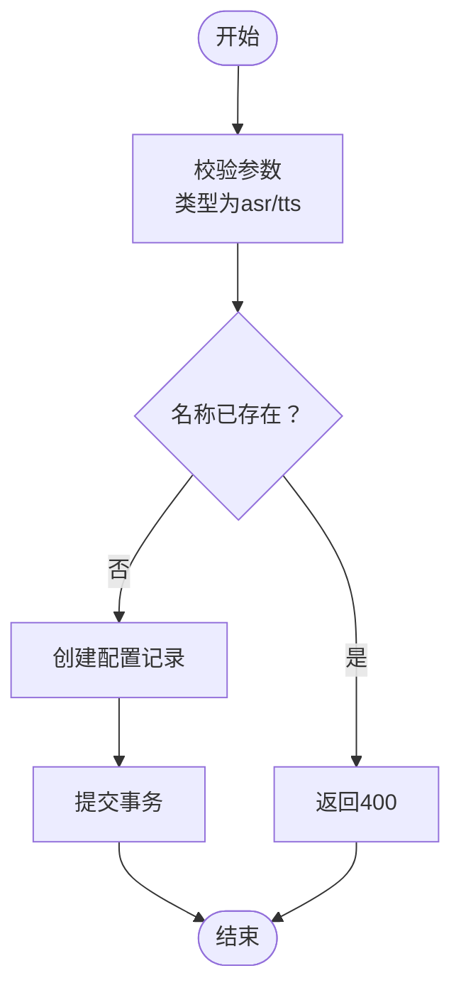

# 语音API

<cite>
**本文引用的文件列表**
- [voices.py](file://vibe_surf/backend/api/voices.py)
- [voice_model_config.py](file://vibe_surf/backend/voice_model_config.py)
- [voice_asr.py](file://vibe_surf/tools/voice_asr.py)
- [models.py](file://vibe_surf/backend/database/models.py)
- [queries.py](file://vibe_surf/backend/database/queries.py)
- [v004_add_voice_profiles.sql](file://vibe_surf/backend/database/migrations/v004_add_voice_profiles.sql)
- [shared_state.py](file://vibe_surf/backend/shared_state.py)
- [test_voice_api.py](file://tests/test_voice_api.py)
- [api-client.js](file://vibe_surf/chrome_extension/scripts/api-client.js)
- [settings-general.js](file://vibe_surf/chrome_extension/scripts/settings-general.js)
- [voice-recorder.js](file://vibe_surf/chrome_extension/scripts/voice-recorder.js)
- [voice-mode.py](file://vibe_surf/langflow/api/v1/voice_mode.py)
</cite>

## 目录
1. [简介](#简介)
2. [项目结构](#项目结构)
3. [核心组件](#核心组件)
4. [架构总览](#架构总览)
5. [详细组件分析](#详细组件分析)
6. [依赖关系分析](#依赖关系分析)
7. [性能考量](#性能考量)
8. [故障排查指南](#故障排查指南)
9. [结论](#结论)
10. [附录](#附录)

## 简介
本文件系统化梳理后端语音API，重点覆盖以下方面：
- 语音配置文件管理：支持创建、更新、删除、查询语音配置档案，并记录使用时间。
- 语音识别（ASR）：通过统一入口调用多家ASR服务（通义千问、OpenAI Whisper、Google Gemini），并支持自定义基础地址等参数。
- 语音模型清单：集中声明可用的语音模型类型与特性。
- 集成与扩展：与数据库模型、查询层、共享状态、前端Chrome扩展及Langflow实时语音能力的衔接。
- 实时处理流程：从音频采集、上传、保存、识别到结果返回的整体链路；以及与前端语音控制界面的交互模式。

## 项目结构
语音相关模块分布于后端API、工具层、数据库层与前端扩展脚本中，形成“配置—识别—存储—展示”的闭环。

图表来源
- [voices.py](file://vibe_surf/backend/api/voices.py#L1-L481)
- [voice_model_config.py](file://vibe_surf/backend/voice_model_config.py#L1-L25)
- [voice_asr.py](file://vibe_surf/tools/voice_asr.py#L1-L125)
- [models.py](file://vibe_surf/backend/database/models.py#L1-L120)
- [queries.py](file://vibe_surf/backend/database/queries.py#L1-L120)
- [shared_state.py](file://vibe_surf/backend/shared_state.py#L1-L120)
- [api-client.js](file://vibe_surf/chrome_extension/scripts/api-client.js#L402-L443)
- [settings-general.js](file://vibe_surf/chrome_extension/scripts/settings-general.js#L62-L223)
- [voice-recorder.js](file://vibe_surf/chrome_extension/scripts/voice-recorder.js#L362-L514)
- [voice-mode.py](file://vibe_surf/langflow/api/v1/voice_mode.py#L126-L1305)

章节来源
- [voices.py](file://vibe_surf/backend/api/voices.py#L1-L481)
- [voice_model_config.py](file://vibe_surf/backend/voice_model_config.py#L1-L25)
- [voice_asr.py](file://vibe_surf/tools/voice_asr.py#L1-L125)
- [models.py](file://vibe_surf/backend/database/models.py#L1-L120)
- [queries.py](file://vibe_surf/backend/database/queries.py#L1-L120)
- [shared_state.py](file://vibe_surf/backend/shared_state.py#L1-L120)
- [api-client.js](file://vibe_surf/chrome_extension/scripts/api-client.js#L402-L443)
- [settings-general.js](file://vibe_surf/chrome_extension/scripts/settings-general.js#L62-L223)
- [voice-recorder.js](file://vibe_surf/chrome_extension/scripts/voice-recorder.js#L362-L514)
- [voice-mode.py](file://vibe_surf/langflow/api/v1/voice_mode.py#L126-L1305)

## 核心组件
- 语音配置文件管理端点
  - 创建、更新、删除、查询语音配置档案；支持按类型筛选与分页。
  - 记录最近使用时间，便于自动选择最新配置。
- 语音识别（ASR）
  - 统一入口接收音频文件与语音配置名，按配置选择具体ASR实现。
  - 支持多家ASR服务与可选的基础地址参数。
- 语音模型配置
  - 集中式声明支持的ASR模型及其特性（是否需要API密钥、提供商等）。
- 数据层
  - 定义语音配置档案表结构、索引与查询方法（含加密API Key的读取与更新）。
- 前端集成
  - Chrome扩展通过API客户端调用后端端点，进行配置管理与转写调用。
  - 录音器负责采集音频并触发转写请求。
- Langflow实时语音
  - 提供实时会话与流式TTS能力，作为补充的语音交互路径。

章节来源
- [voices.py](file://vibe_surf/backend/api/voices.py#L49-L481)
- [voice_model_config.py](file://vibe_surf/backend/voice_model_config.py#L1-L25)
- [models.py](file://vibe_surf/backend/database/models.py#L25-L56)
- [queries.py](file://vibe_surf/backend/database/queries.py#L1-L120)
- [api-client.js](file://vibe_surf/chrome_extension/scripts/api-client.js#L402-L443)
- [voice-recorder.js](file://vibe_surf/chrome_extension/scripts/voice-recorder.js#L362-L514)
- [voice-mode.py](file://vibe_surf/langflow/api/v1/voice_mode.py#L126-L1305)

## 架构总览
后端以FastAPI路由为中心，结合数据库模型与查询层，完成语音配置的全生命周期管理；在ASR识别环节，依据配置动态选择具体实现类，确保多提供商兼容性与可扩展性。

图表来源
- [voices.py](file://vibe_surf/backend/api/voices.py#L224-L373)
- [voice_asr.py](file://vibe_surf/tools/voice_asr.py#L1-L125)
- [models.py](file://vibe_surf/backend/database/models.py#L25-L56)
- [queries.py](file://vibe_surf/backend/database/queries.py#L1-L120)
- [shared_state.py](file://vibe_surf/backend/shared_state.py#L1-L120)
- [voice-recorder.js](file://vibe_surf/chrome_extension/scripts/voice-recorder.js#L362-L398)

## 详细组件分析

### 语音配置文件管理（CRUD与查询）
- 端点
  - POST /voices/voice-profiles：创建新配置，校验类型为“asr”或“tts”，名称唯一，支持描述与元参数。
  - PUT /voices/voice-profiles/{name}：更新配置，排除空值，支持启用/禁用。
  - DELETE /voices/voice-profiles/{name}：删除配置。
  - GET /voices/voice-profiles：分页列出配置，支持按类型与激活状态筛选。
  - GET /voices/models：列出可用语音模型及其类型与密钥需求。
  - GET /voices/{name}：按名称获取配置（不包含密钥）。
- 数据模型
  - 语音配置档案表包含：唯一名称、类型（asr/tts）、模型名、加密API Key、元参数、描述、激活状态、时间戳。
- 查询逻辑
  - 获取配置时支持解密API Key；更新最近使用时间；删除后清理。
- 错误处理
  - 参数校验失败返回400；未找到返回404；内部错误返回500；异常回滚事务并记录日志。

图表来源
- [voices.py](file://vibe_surf/backend/api/voices.py#L49-L100)
- [models.py](file://vibe_surf/backend/database/models.py#L25-L56)
- [queries.py](file://vibe_surf/backend/database/queries.py#L1-L120)

章节来源
- [voices.py](file://vibe_surf/backend/api/voices.py#L49-L222)
- [models.py](file://vibe_surf/backend/database/models.py#L25-L56)
- [queries.py](file://vibe_surf/backend/database/queries.py#L1-L120)

### 语音识别（ASR）端点与流程
- 端点
  - POST /voices/asr：接收音频文件与语音配置名，返回识别文本。
- 流程要点
  - 校验必填参数与文件有效性。
  - 读取配置并解密API Key，检查激活状态与类型。
  - 读取共享状态的工作目录，保存音频至工作目录下的“audios”子目录。
  - 根据配置选择具体ASR实现（通义、OpenAI、Gemini），传入模型名与可选基础地址。
  - 更新最近使用时间并返回识别结果。
- 异常处理
  - 文件保存失败时尝试清理；内部异常统一捕获并返回500。

图表来源
- [voices.py](file://vibe_surf/backend/api/voices.py#L224-L373)
- [voice_asr.py](file://vibe_surf/tools/voice_asr.py#L1-L125)
- [queries.py](file://vibe_surf/backend/database/queries.py#L1-L120)
- [shared_state.py](file://vibe_surf/backend/shared_state.py#L1-L120)

章节来源
- [voices.py](file://vibe_surf/backend/api/voices.py#L224-L373)
- [voice_asr.py](file://vibe_surf/tools/voice_asr.py#L1-L125)
- [queries.py](file://vibe_surf/backend/database/queries.py#L1-L120)
- [shared_state.py](file://vibe_surf/backend/shared_state.py#L1-L120)

### ASR实现类（抽象与多提供商）
- 抽象层
  - 通过统一接口封装多家ASR服务，屏蔽差异。
- 具体实现
  - 通义（DashScope）：支持本地文件路径或HTTP URL，返回识别文本。
  - OpenAI Whisper：仅支持本地文件，返回纯文本。
  - Gemini：上传音频文件并生成内容，返回文本。
- 错误处理
  - 对异常进行日志告警并返回空字符串，保证健壮性。

图表来源
- [voice_asr.py](file://vibe_surf/tools/voice_asr.py#L1-L125)

章节来源
- [voice_asr.py](file://vibe_surf/tools/voice_asr.py#L1-L125)

### 语音模型配置中心
- 配置项
  - 模型名、类型（asr）、是否需要API Key、提供商、是否支持自定义基础地址等。
- 作用
  - 后端端点用于列举可用模型；前端用于展示与选择。

章节来源
- [voice_model_config.py](file://vibe_surf/backend/voice_model_config.py#L1-L25)
- [voices.py](file://vibe_surf/backend/api/voices.py#L424-L444)

### 数据库与迁移
- 表结构
  - voice_profiles：唯一名称、类型（asr/tts）、模型名、加密API Key、元参数、描述、激活状态、时间戳。
- 索引
  - 名称、类型、激活状态索引，提升查询效率。
- 触发器
  - 更新时自动刷新更新时间戳。

章节来源
- [v004_add_voice_profiles.sql](file://vibe_surf/backend/database/migrations/v004_add_voice_profiles.sql#L1-L35)
- [models.py](file://vibe_surf/backend/database/models.py#L25-L56)
- [queries.py](file://vibe_surf/backend/database/queries.py#L1-L120)

### 前端语音控制界面与交互
- API客户端
  - 提供获取/创建/更新/删除语音配置、获取模型列表等方法。
- 设置页面
  - 加载所有语音配置，按类型筛选并填充默认ASR/TTS下拉框，支持自动选择最新配置。
- 录音器
  - 采集音频，检测是否有可用ASR配置，调用后端ASR端点并回调返回结果。

图表来源
- [api-client.js](file://vibe_surf/chrome_extension/scripts/api-client.js#L402-L443)
- [settings-general.js](file://vibe_surf/chrome_extension/scripts/settings-general.js#L62-L223)
- [voices.py](file://vibe_surf/backend/api/voices.py#L375-L444)

章节来源
- [api-client.js](file://vibe_surf/chrome_extension/scripts/api-client.js#L402-L443)
- [settings-general.js](file://vibe_surf/chrome_extension/scripts/settings-general.js#L62-L223)
- [voice-recorder.js](file://vibe_surf/chrome_extension/scripts/voice-recorder.js#L362-L398)

### 实时语音与流式TTS（Langflow）
- 能力概述
  - 提供实时会话与流式TTS能力，支持多种语音与音频格式、VAD检测、工具集成等。
- 与后端的关系
  - Langflow侧侧重实时双向流式交互；后端voices.py聚焦配置管理与ASR识别。两者可并行使用，满足不同场景需求。

章节来源
- [voice-mode.py](file://vibe_surf/langflow/api/v1/voice_mode.py#L126-L1305)

## 依赖关系分析
- 路由依赖
  - voices.py依赖数据库查询层、模型配置中心、ASR实现类与共享状态。
- 工具依赖
  - voice_asr.py依赖第三方SDK（DashScope、OpenAI、Google GenAI）。
- 前端依赖
  - Chrome扩展脚本通过API客户端调用后端端点，实现配置管理与转写调用。
- 数据依赖
  - 数据库迁移脚本定义表结构与索引；查询层提供CRUD与时间戳更新。

图表来源
- [voices.py](file://vibe_surf/backend/api/voices.py#L1-L481)
- [voice_model_config.py](file://vibe_surf/backend/voice_model_config.py#L1-L25)
- [voice_asr.py](file://vibe_surf/tools/voice_asr.py#L1-L125)
- [queries.py](file://vibe_surf/backend/database/queries.py#L1-L120)
- [shared_state.py](file://vibe_surf/backend/shared_state.py#L1-L120)
- [api-client.js](file://vibe_surf/chrome_extension/scripts/api-client.js#L402-L443)
- [settings-general.js](file://vibe_surf/chrome_extension/scripts/settings-general.js#L62-L223)
- [voice-recorder.js](file://vibe_surf/chrome_extension/scripts/voice-recorder.js#L362-L514)

章节来源
- [voices.py](file://vibe_surf/backend/api/voices.py#L1-L481)
- [voice_asr.py](file://vibe_surf/tools/voice_asr.py#L1-L125)
- [queries.py](file://vibe_surf/backend/database/queries.py#L1-L120)
- [api-client.js](file://vibe_surf/chrome_extension/scripts/api-client.js#L402-L443)
- [settings-general.js](file://vibe_surf/chrome_extension/scripts/settings-general.js#L62-L223)
- [voice-recorder.js](file://vibe_surf/chrome_extension/scripts/voice-recorder.js#L362-L514)

## 性能考量
- 存储与I/O
  - 将音频保存到工作目录的“audios”子目录，建议定期清理历史文件，避免磁盘占用增长。
- 并发与异步
  - 使用异步数据库会话与异步文件写入，减少阻塞；ASR调用为外部网络请求，注意超时与重试策略。
- 缓存与索引
  - 数据库对名称、类型、激活状态建立索引，提升查询效率；模型清单可在前端缓存。
- 日志与监控
  - 在关键路径增加日志记录，便于定位问题；对ASR失败率进行统计上报。

## 故障排查指南
- 常见错误与定位
  - 400：参数校验失败（如缺少配置名、文件名为空、类型非法）。
  - 404：配置不存在或未激活。
  - 500：内部异常（数据库回滚、文件保存失败、ASR调用异常）。
- 排查步骤
  - 检查配置是否正确创建且处于激活状态。
  - 确认工作目录存在且有写权限。
  - 查看后端日志，定位ASR实现类的异常（网络、认证、文件路径）。
  - 使用测试脚本验证ASR实现类的可用性。
- 相关文件
  - 端点与错误处理：voices.py
  - ASR实现与异常：voice_asr.py
  - 数据库查询与更新：queries.py
  - 测试脚本：test_voice_api.py

章节来源
- [voices.py](file://vibe_surf/backend/api/voices.py#L224-L373)
- [voice_asr.py](file://vibe_surf/tools/voice_asr.py#L1-L125)
- [queries.py](file://vibe_surf/backend/database/queries.py#L1-L120)
- [test_voice_api.py](file://tests/test_voice_api.py#L1-L45)

## 结论
该语音API以清晰的配置中心与抽象层实现了多提供商ASR能力，配合数据库模型与查询层，提供了完整的语音配置生命周期管理。前端扩展通过API客户端与录音器无缝对接后端端点，形成从采集到识别的完整闭环。同时，Langflow提供的实时语音能力可作为补充方案，满足更丰富的交互场景。

## 附录
- 端点一览
  - POST /voices/voice-profiles：创建语音配置
  - PUT /voices/voice-profiles/{name}：更新语音配置
  - DELETE /voices/voice-profiles/{name}：删除语音配置
  - GET /voices/voice-profiles：查询语音配置（支持分页与筛选）
  - GET /voices/models：查询可用语音模型
  - GET /voices/{name}：按名称获取语音配置
  - POST /voices/asr：执行语音识别（上传音频+指定配置）

章节来源
- [voices.py](file://vibe_surf/backend/api/voices.py#L49-L481)