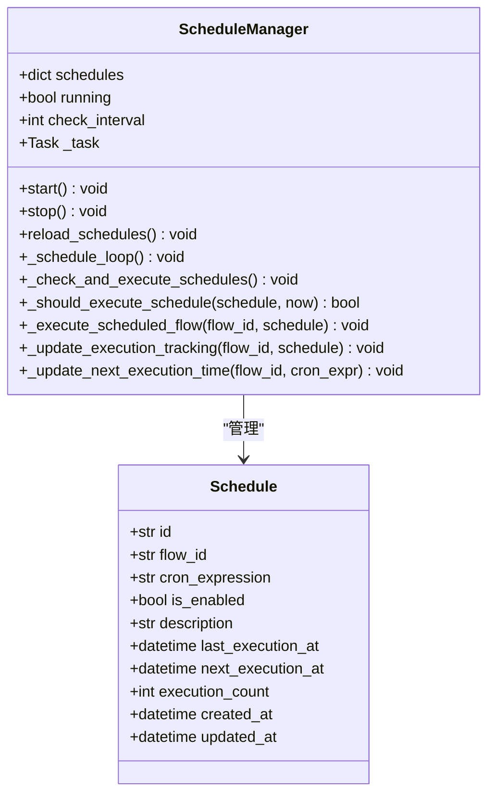
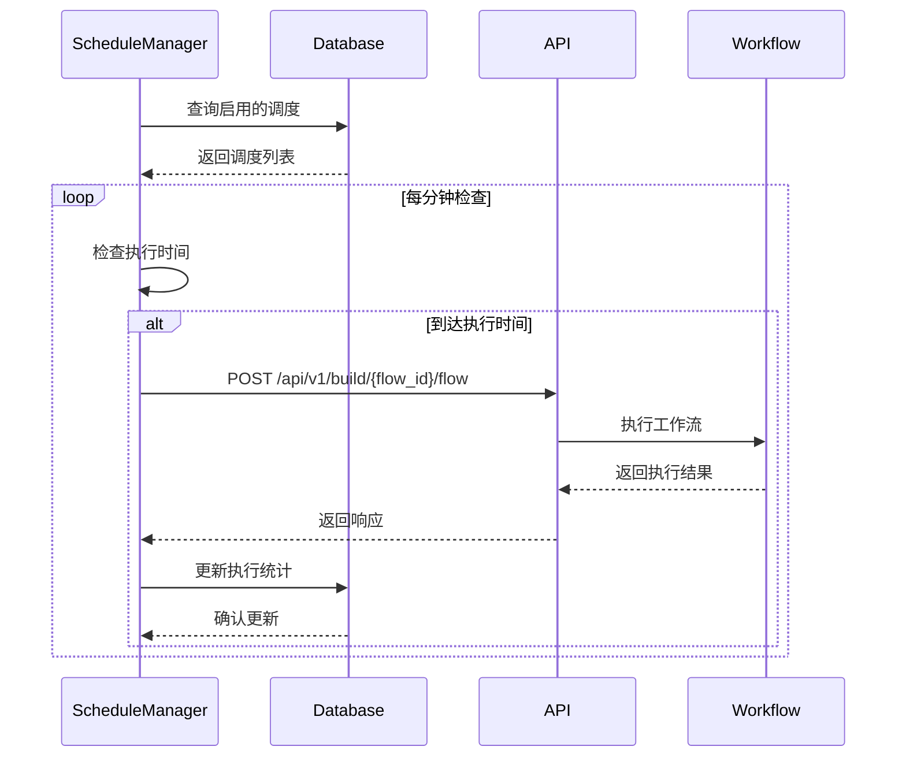
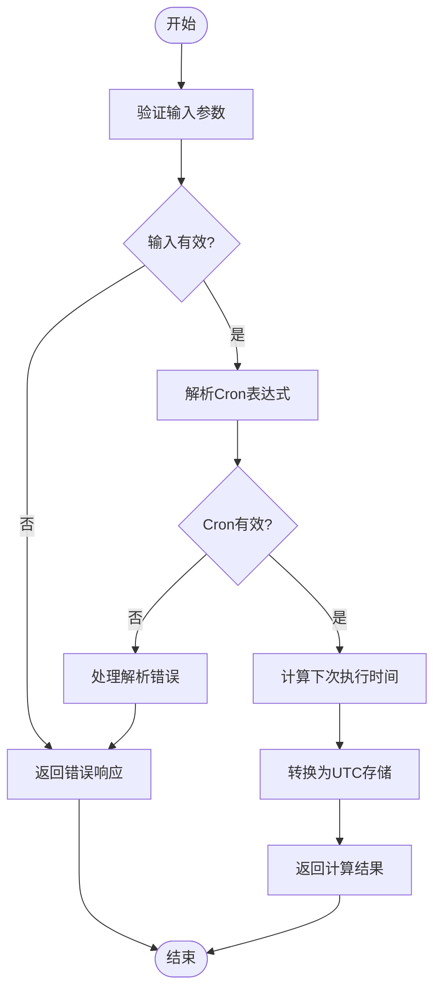
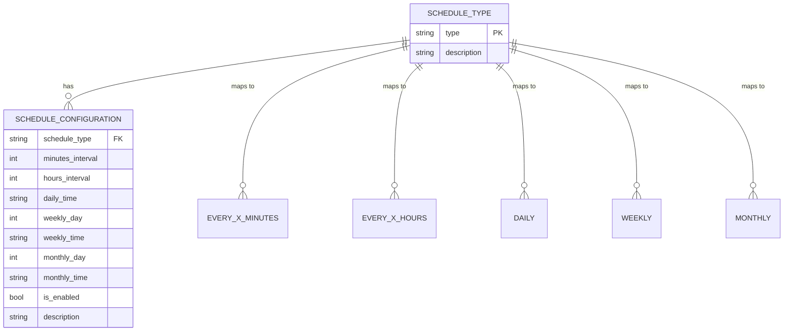
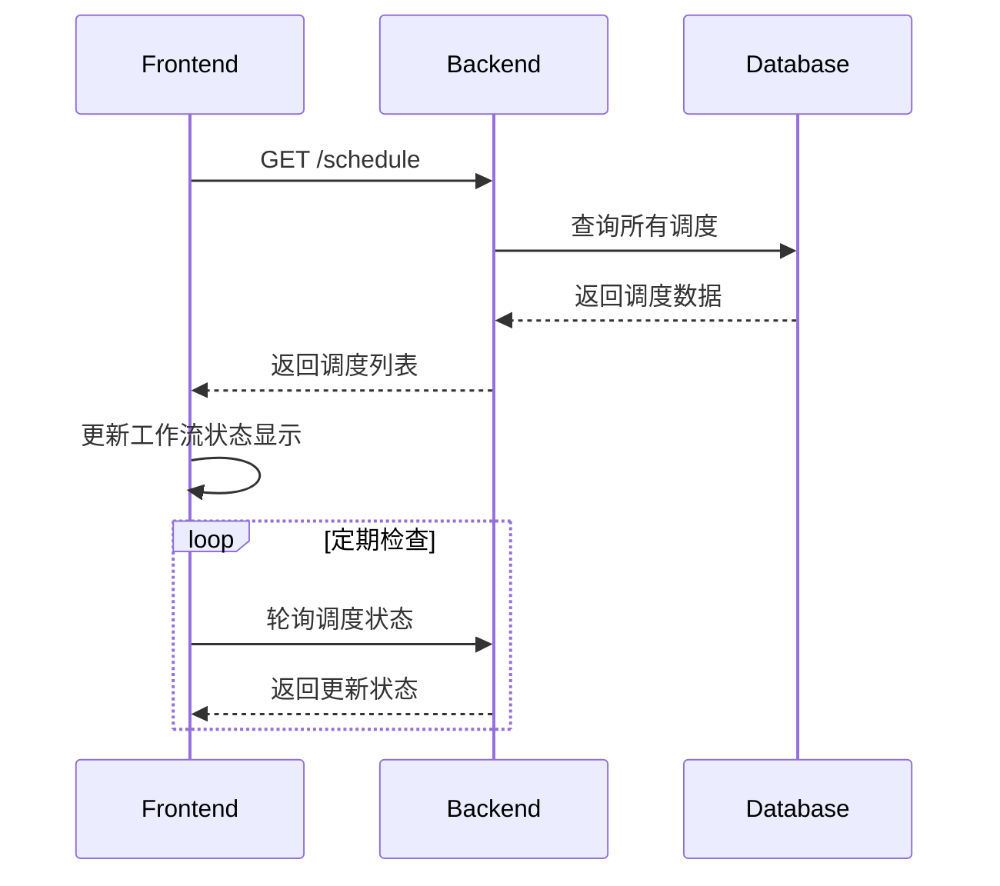

# 调度API

<cite>
**本文档引用的文件**   
- [schedule.py](file://vibe_surf/backend/api/schedule.py)
- [models.py](file://vibe_surf/backend/database/models.py)
- [queries.py](file://vibe_surf/backend/database/queries.py)
- [shared_state.py](file://vibe_surf/backend/shared_state.py)
- [settings-workflow.js](file://vibe_surf/chrome_extension/scripts/settings-workflow.js)
- [sidepanel.html](file://vibe_surf/chrome_extension/sidepanel.html)
</cite>

## 目录
1. [调度API](#调度api)
2. [端点详细说明](#端点详细说明)
3. [调度机制](#调度机制)
4. [Cron表达式与时间解析](#cron表达式与时间解析)
5. [任务依赖与并发控制](#任务依赖与并发控制)
6. [前端集成](#前端集成)
7. [状态同步与通知](#状态同步与通知)

## 端点详细说明

调度API提供了对工作流调度的完整管理功能，包括创建、读取、更新和删除操作。所有端点都通过`/schedule`前缀进行访问，并使用标准的HTTP方法。

### 创建调度
`POST /schedule`端点用于为特定工作流创建新的调度。请求体必须包含`flow_id`，并可选择性地提供`cron_expression`、`is_enabled`和`description`字段。系统会验证Cron表达式的格式，并确保每个工作流只能有一个调度。创建成功后，调度管理器会重新加载调度列表以应用更改。

**Section sources**
- [schedule.py](file://vibe_surf/backend/api/schedule.py#L108-L149)

### 读取调度
系统提供了两个读取调度的端点：
- `GET /schedule`：获取所有调度的列表
- `GET /schedule/{flow_id}`：获取特定工作流的调度详情

这些端点返回包含调度所有属性的响应，包括执行统计和时间戳。

**Section sources**
- [schedule.py](file://vibe_surf/backend/api/schedule.py#L77-L107)
- [schedule.py](file://vibe_surf/backend/api/schedule.py#L159-L185)

### 更新调度
`PUT /schedule/{flow_id}`端点允许修改现有调度的配置。可以更新Cron表达式、启用状态和描述。如果未提供任何更新字段，将返回现有调度信息。更新操作会触发调度管理器重新加载调度列表。

**Section sources**
- [schedule.py](file://vibe_surf/backend/api/schedule.py#L195-L280)

### 删除调度
`DELETE /schedule/{flow_id}`端点用于删除特定工作流的调度。删除前会检查调度是否存在，删除成功后会触发调度管理器重新加载调度列表。

**Section sources**
- [schedule.py](file://vibe_surf/backend/api/schedule.py#L290-L323)

## 调度机制

调度系统基于Celery Beat模式实现，通过`ScheduleManager`类管理所有调度任务。该系统在后台持续运行，定期检查是否有需要执行的调度。

### 调度管理器
`ScheduleManager`是调度系统的核心组件，负责：
- 维护当前活动调度的内存缓存
- 定期检查调度执行时间
- 触发工作流执行
- 更新执行统计

调度管理器在启动时从数据库加载所有启用的调度，并在每次调度创建、更新或删除时重新加载。

**Diagram sources **
- [shared_state.py](file://vibe_surf/backend/shared_state.py#L740-L1111)
- [models.py](file://vibe_surf/backend/database/models.py#L258-L289)

**Section sources**
- [shared_state.py](file://vibe_surf/backend/shared_state.py#L740-L1111)

### 执行流程
调度执行流程如下：
1. 调度管理器循环检查每个调度
2. 比较当前时间与`next_execution_at`
3. 如果时间匹配且满足最小执行间隔，则触发工作流
4. 通过HTTP POST请求调用工作流执行API
5. 更新数据库中的执行统计

**Diagram sources **
- [shared_state.py](file://vibe_surf/backend/shared_state.py#L863-L1081)

**Section sources**
- [shared_state.py](file://vibe_surf/backend/shared_state.py#L863-L1081)

## Cron表达式与时间解析

系统使用`croniter`库来处理Cron表达式的解析和验证，支持标准的五字段Cron格式。

### 表达式格式
Cron表达式由五个字段组成，分别表示：
- 分钟 (0-59)
- 小时 (0-23)
- 日期 (1-31)
- 月份 (1-12)
- 星期 (0-6, 0=Sunday)

例如：`0 9 * * 1-5`表示工作日早上9点执行。

### 验证与计算
系统提供了两个核心函数来处理Cron表达式：

**Diagram sources **
- [schedule.py](file://vibe_surf/backend/api/schedule.py#L52-L75)

**Section sources**
- [schedule.py](file://vibe_surf/backend/api/schedule.py#L52-L75)

### 时区处理
系统在计算执行时间时考虑了时区因素：
1. 使用系统本地时区进行Cron计算
2. 将结果转换为UTC时间存储
3. 所有时间戳在数据库中均以UTC格式保存

这种设计确保了跨时区部署的一致性。

## 任务依赖与并发控制

调度系统实现了多种机制来管理任务依赖和并发执行。

### 错过执行处理
系统通过`next_execution_at`字段跟踪下次执行时间。如果由于系统停机等原因错过了执行时间，系统会在重启后重新计算下次执行时间，确保不会丢失调度。

### 并发控制
系统通过以下方式控制并发：
- 每个工作流只能有一个调度
- 最小执行间隔保护（30秒）
- 数据库事务确保操作的原子性

### 依赖管理
虽然当前系统没有显式的任务依赖配置，但通过工作流ID的唯一性确保了调度的独立性。每个调度只关联到一个特定的工作流。

## 前端集成

调度功能通过Chrome扩展的侧边栏界面与用户交互，提供了直观的调度配置体验。

### 简化调度构建器
前端提供了简化的时间选择器，将复杂的Cron表达式转换为用户友好的界面：

**Diagram sources **
- [settings-workflow.js](file://vibe_surf/chrome_extension/scripts/settings-workflow.js#L2330-L2362)
- [sidepanel.html](file://vibe_surf/chrome_extension/sidepanel.html#L788-L901)

**Section sources**
- [settings-workflow.js](file://vibe_surf/chrome_extension/scripts/settings-workflow.js#L2330-L2362)
- [sidepanel.html](file://vibe_surf/chrome_extension/sidepanel.html#L788-L901)

### 配置映射
前端界面支持五种调度类型，每种类型映射到相应的Cron表达式：
- **每X分钟**: `*/{minutes} * * * *`
- **每X小时**: `0 */{hours} * * *`
- **每日**: `{minute} {hour} * * *`
- **每周**: `{minute} {hour} * * {dayOfWeek}`
- **每月**: `{minute} {hour} {dayOfMonth} * *`

## 状态同步与通知

系统实现了完整的状态同步机制，确保前端界面与后端状态保持一致。

### 状态同步流程

**Diagram sources **
- [settings-workflow.js](file://vibe_surf/chrome_extension/scripts/settings-workflow.js#L498-L532)

**Section sources**
- [settings-workflow.js](file://vibe_surf/chrome_extension/scripts/settings-workflow.js#L498-L532)

### 通知机制
系统通过以下方式提供反馈：
- 成功创建/更新调度时显示确认消息
- 调度执行时记录日志
- 错误发生时返回详细的错误信息
- 界面实时显示调度状态（启用/禁用）