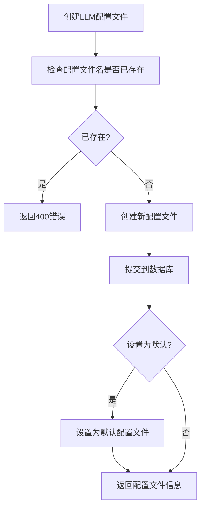
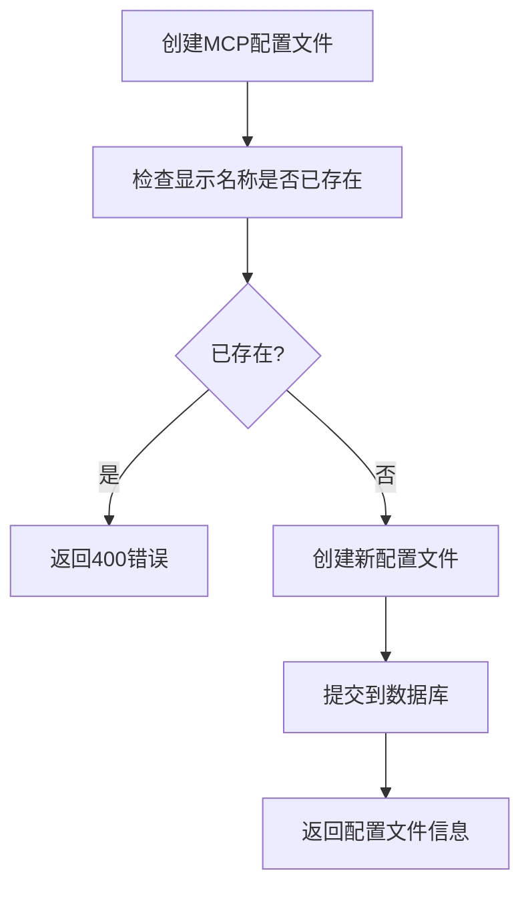
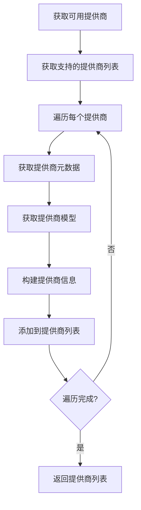
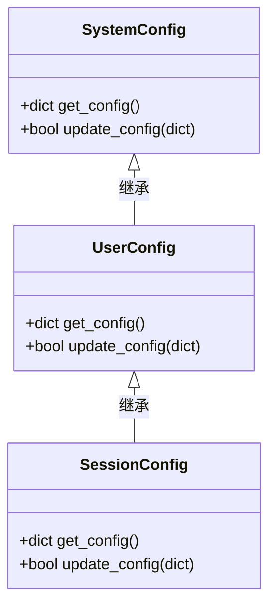
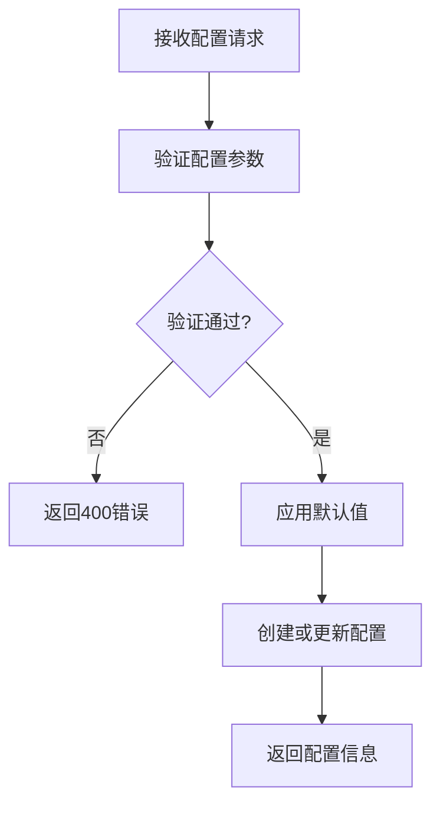
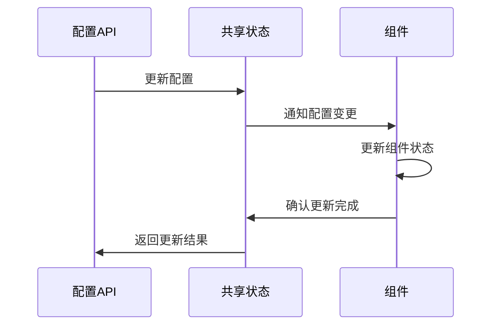
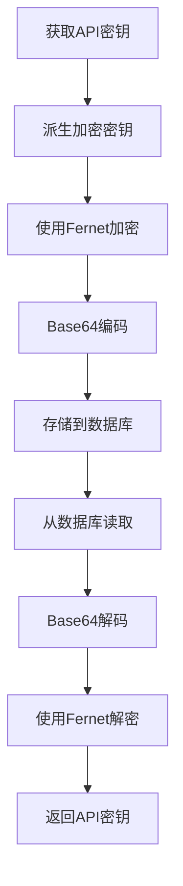
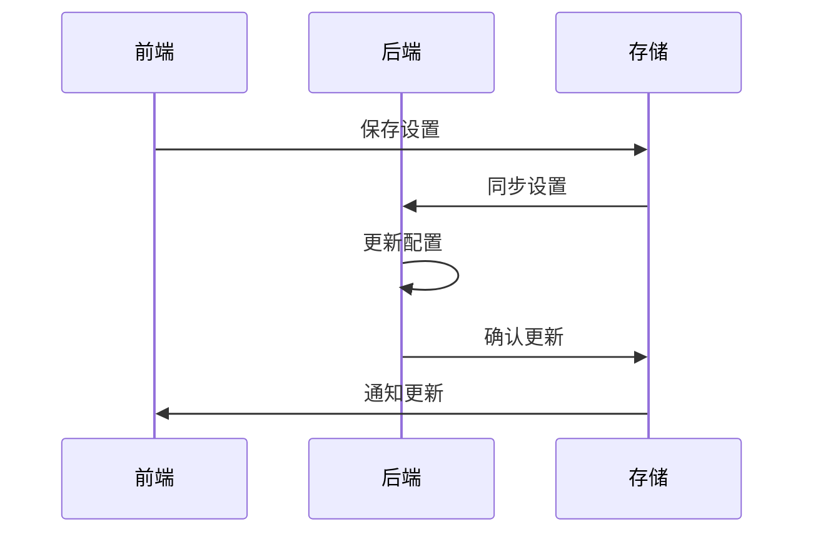
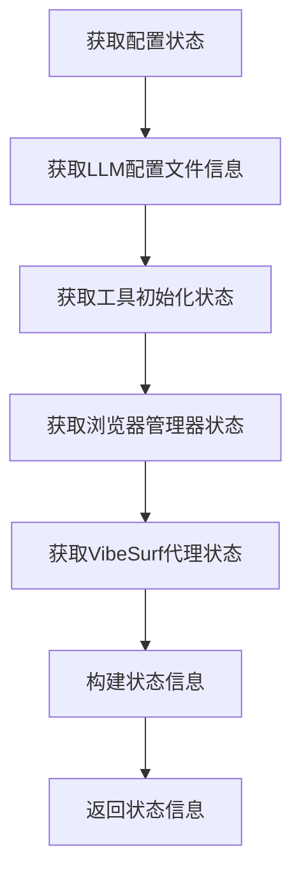

# 配置API

<cite>
**本文档引用的文件**   
- [config.py](file://vibe_surf/backend/api/config.py)
- [models.py](file://vibe_surf/backend/api/models.py)
- [queries.py](file://vibe_surf/backend/database/queries.py)
- [encryption.py](file://vibe_surf/backend/utils/encryption.py)
- [shared_state.py](file://vibe_surf/backend/shared_state.py)
- [llm_config.py](file://vibe_surf/backend/llm_config.py)
- [llm_factory.py](file://vibe_surf/backend/utils/llm_factory.py)
- [models.py](file://vibe_surf/backend/database/models.py)
- [settings-manager.js](file://vibe_surf/chrome_extension/scripts/settings-manager.js)
- [user-settings-storage.js](file://vibe_surf/chrome_extension/scripts/user-settings-storage.js)
</cite>

## 目录
1. [引言](#引言)
2. [配置API端点](#配置api端点)
3. [配置分层结构与继承机制](#配置分层结构与继承机制)
4. [验证规则与默认值处理](#验证规则与默认值处理)
5. [变更通知策略](#变更通知策略)
6. [敏感配置的安全存储与访问控制](#敏感配置的安全存储与访问控制)
7. [前端设置界面的双向同步机制](#前端设置界面的双向同步机制)
8. [配置状态与环境变量管理](#配置状态与环境变量管理)
9. [结论](#结论)

## 引言

配置API是VibeSurf系统的核心组件，负责管理LLM配置、工具配置、环境变量等关键设置。该API提供了对系统设置、用户偏好、LLM配置和工作流模板的读取与更新操作，支持分层配置结构和继承机制。通过配置API，系统能够灵活地管理不同级别的配置，并确保配置变更能够及时通知到相关组件。此外，配置API还实现了敏感配置的安全存储与访问控制，以及与前端设置界面的双向同步机制，为用户提供了一致且安全的配置管理体验。

**Section sources**
- [config.py](file://vibe_surf/backend/api/config.py#L1-L762)

## 配置API端点

配置API提供了多个端点，用于管理LLM配置文件和MCP配置文件。这些端点支持创建、读取、更新和删除操作，以及获取可用的LLM提供商和模型列表。

### LLM配置文件管理

LLM配置文件管理端点允许用户创建、读取、更新和删除LLM配置文件。每个LLM配置文件包含提供商、模型、API密钥、基础URL、温度、最大令牌数等参数。

**Diagram sources**
- [config.py](file://vibe_surf/backend/api/config.py#L78-L299)

### MCP配置文件管理

MCP配置文件管理端点允许用户创建、读取、更新和删除MCP配置文件。每个MCP配置文件包含显示名称、MCP服务器名称、MCP服务器参数等信息。

**Diagram sources**
- [config.py](file://vibe_surf/backend/api/config.py#L403-L583)

### 可用提供商和模型

配置API还提供了获取可用LLM提供商和模型列表的端点。这些端点返回每个提供商的详细信息，包括显示名称、模型列表、是否需要API密钥、是否支持基础URL等。

**Diagram sources**
- [config.py](file://vibe_surf/backend/api/config.py#L585-L643)

**Section sources**
- [config.py](file://vibe_surf/backend/api/config.py#L78-L643)
- [models.py](file://vibe_surf/backend/api/models.py#L14-L100)
- [queries.py](file://vibe_surf/backend/database/queries.py#L24-L200)

## 配置分层结构与继承机制

配置API实现了分层配置结构，包括系统级、用户级和会话级配置。这种分层结构允许配置在不同级别之间继承和覆盖，提供了灵活的配置管理能力。

### 系统级配置

系统级配置是全局配置，适用于所有用户和会话。这些配置通常在系统初始化时设置，并作为默认值使用。

### 用户级配置

用户级配置是针对特定用户的配置，可以覆盖系统级配置。用户可以根据自己的偏好设置LLM配置文件、环境变量等。

### 会话级配置

会话级配置是针对特定会话的配置，可以覆盖用户级和系统级配置。这些配置通常在任务执行时动态设置。

**Diagram sources**
- [shared_state.py](file://vibe_surf/backend/shared_state.py#L38-L45)
- [config.py](file://vibe_surf/backend/api/config.py#L690-L753)

**Section sources**
- [shared_state.py](file://vibe_surf/backend/shared_state.py#L38-L45)
- [config.py](file://vibe_surf/backend/api/config.py#L690-L753)

## 验证规则与默认值处理

配置API实现了严格的验证规则和默认值处理机制，确保配置的完整性和一致性。

### 验证规则

配置API在创建和更新配置时执行验证规则，包括：
- 检查配置文件名是否已存在
- 验证提供商是否支持
- 检查必需的参数是否提供
- 验证API密钥和基础URL的格式

### 默认值处理

配置API为可选参数提供了合理的默认值，包括：
- 温度默认值为0.7
- 最大令牌数无默认值
- Top-p无默认值
- 频率惩罚无默认值
- 种子无默认值

**Diagram sources**
- [llm_factory.py](file://vibe_surf/backend/utils/llm_factory.py#L222-L243)
- [config.py](file://vibe_surf/backend/api/config.py#L85-L91)

**Section sources**
- [llm_factory.py](file://vibe_surf/backend/utils/llm_factory.py#L222-L243)
- [config.py](file://vibe_surf/backend/api/config.py#L85-L91)

## 变更通知策略

配置API实现了变更通知策略，确保配置变更能够及时通知到相关组件。

### 配置变更检测

系统定期检查配置是否发生变化，包括：
- LLM配置文件的变化
- MCP配置文件的变化
- 环境变量的变化

### 组件更新

当检测到配置变化时，系统会更新相关组件，包括：
- 更新LLM实例
- 重新注册MCP客户端
- 更新环境变量

**Diagram sources**
- [shared_state.py](file://vibe_surf/backend/shared_state.py#L255-L387)
- [config.py](file://vibe_surf/backend/api/config.py#L713-L753)

**Section sources**
- [shared_state.py](file://vibe_surf/backend/shared_state.py#L255-L387)
- [config.py](file://vibe_surf/backend/api/config.py#L713-L753)

## 敏感配置的安全存储与访问控制

配置API实现了敏感配置的安全存储与访问控制机制，确保API密钥等敏感信息的安全。

### 安全存储

敏感配置（如API密钥）使用机器MAC地址派生的密钥进行加密存储。加密过程包括：
- 使用PBKDF2算法派生密钥
- 使用Fernet对称加密算法加密数据
- 将加密后的数据以Base64编码存储

### 访问控制

系统实现了严格的访问控制，包括：
- 只有授权用户才能访问敏感配置
- API密钥不会在响应中返回
- 提供商配置信息经过过滤后返回

**Diagram sources**
- [encryption.py](file://vibe_surf/backend/utils/encryption.py#L23-L127)
- [queries.py](file://vibe_surf/backend/database/queries.py#L43-L52)

**Section sources**
- [encryption.py](file://vibe_surf/backend/utils/encryption.py#L23-L127)
- [queries.py](file://vibe_surf/backend/database/queries.py#L43-L52)

## 前端设置界面的双向同步机制

配置API与前端设置界面实现了双向同步机制，确保用户在前端的配置变更能够及时反映到后端，反之亦然。

### 前端设置管理

前端设置管理器负责协调各个设置模块，包括：
- 一般设置
- 配置文件设置
- 集成设置
- 工作流设置

### 用户设置存储

用户设置存储管理器使用Chrome扩展存储API和localStorage统一管理用户设置，支持设置的迁移和备份。

**Diagram sources**
- [settings-manager.js](file://vibe_surf/chrome_extension/scripts/settings-manager.js#L4-L275)
- [user-settings-storage.js](file://vibe_surf/chrome_extension/scripts/user-settings-storage.js#L4-L422)

**Section sources**
- [settings-manager.js](file://vibe_surf/chrome_extension/scripts/settings-manager.js#L4-L275)
- [user-settings-storage.js](file://vibe_surf/chrome_extension/scripts/user-settings-storage.js#L4-L422)

## 配置状态与环境变量管理

配置API提供了获取配置状态和管理环境变量的端点，帮助用户了解系统的整体配置情况。

### 配置状态

配置状态端点返回系统的整体配置状态，包括：
- LLM配置文件的数量和状态
- 工具的初始化状态
- 浏览器管理器的初始化状态
- VibeSurf代理的初始化状态

### 环境变量管理

环境变量管理端点允许用户获取和更新环境变量，包括：
- HTTP代理设置
- HTTPS代理设置
- 无代理设置

**Diagram sources**
- [config.py](file://vibe_surf/backend/api/config.py#L644-L761)

**Section sources**
- [config.py](file://vibe_surf/backend/api/config.py#L644-L761)
- [shared_state.py](file://vibe_surf/backend/shared_state.py#L53-L54)

## 结论

配置API为VibeSurf系统提供了强大而灵活的配置管理能力。通过分层配置结构、严格的验证规则、安全的存储机制和双向同步功能，配置API确保了系统配置的一致性、安全性和易用性。未来可以进一步扩展配置API，支持更多类型的配置和更复杂的继承机制，为用户提供更加丰富的配置管理体验。