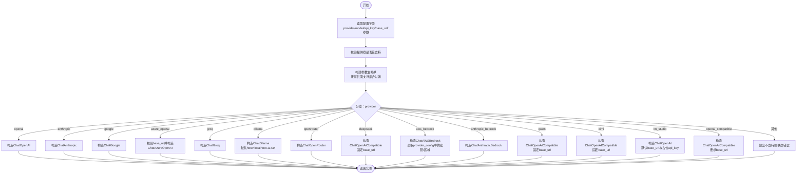

# LLM工厂

<cite>
**本文引用的文件**
- [llm_factory.py](file://vibe_surf/backend/utils/llm_factory.py)
- [llm_config.py](file://vibe_surf/backend/llm_config.py)
- [openai_compatible.py](file://vibe_surf/llm/openai_compatible.py)
- [models.py](file://vibe_surf/backend/database/models.py)
- [queries.py](file://vibe_surf/backend/database/queries.py)
- [config.py](file://vibe_surf/backend/api/config.py)
- [task.py](file://vibe_surf/backend/api/task.py)
- [llm_profiles.py](file://vibe_surf/workflows/VibeSurf/llm_profiles.py)
</cite>

## 目录
1. [简介](#简介)
2. [项目结构](#项目结构)
3. [核心组件](#核心组件)
4. [架构总览](#架构总览)
5. [详细组件分析](#详细组件分析)
6. [依赖关系分析](#依赖关系分析)
7. [性能与优化](#性能与优化)
8. [故障排查指南](#故障排查指南)
9. [结论](#结论)
10. [附录：配置与参数参考](#附录配置与参数参考)

## 简介
本文件面向VibeSurf LLM工厂系统，聚焦于后端工厂模块的实现与使用，涵盖以下主题：
- 工厂模式在llm_factory.py中的实现方式：如何根据LLM配置文件与数据库记录动态创建不同提供商的LLM实例。
- LLM配置文件llm_config.py的结构与参数含义，以及如何支持多种LLM提供商。
- 自定义LLM集成的扩展方法：如何在不修改现有工厂的情况下新增提供商或适配本地/云端差异。
- 错误处理、连接性验证与可维护性建议。
- 性能优化与缓存策略（结合现有缓存服务）。

## 项目结构
与LLM工厂直接相关的目录与文件如下：
- 后端工具层：vibe_surf/backend/utils/llm_factory.py（工厂入口）
- 配置中心：vibe_surf/backend/llm_config.py（提供商与模型清单、元数据）
- OpenAI兼容封装：vibe_surf/llm/openai_compatible.py（统一结构化输出与错误处理）
- 数据库模型与查询：vibe_surf/backend/database/models.py、queries.py、api/config.py
- 工作流集成：vibe_surf/workflows/VibeSurf/llm_profiles.py（从数据库读取配置并创建LLM）

图表来源
- [llm_factory.py](file://vibe_surf/backend/utils/llm_factory.py#L1-L275)
- [llm_config.py](file://vibe_surf/backend/llm_config.py#L1-L226)
- [openai_compatible.py](file://vibe_surf/llm/openai_compatible.py#L1-L373)
- [models.py](file://vibe_surf/backend/database/models.py#L57-L92)
- [queries.py](file://vibe_surf/backend/database/queries.py#L62-L211)
- [config.py](file://vibe_surf/backend/api/config.py#L77-L139)
- [task.py](file://vibe_surf/backend/api/task.py#L163-L182)
- [llm_profiles.py](file://vibe_surf/workflows/VibeSurf/llm_profiles.py#L1-L104)

章节来源
- [llm_factory.py](file://vibe_surf/backend/utils/llm_factory.py#L1-L275)
- [llm_config.py](file://vibe_surf/backend/llm_config.py#L1-L226)
- [openai_compatible.py](file://vibe_surf/llm/openai_compatible.py#L1-L373)
- [models.py](file://vibe_surf/backend/database/models.py#L57-L92)
- [queries.py](file://vibe_surf/backend/database/queries.py#L62-L211)
- [config.py](file://vibe_surf/backend/api/config.py#L77-L139)
- [task.py](file://vibe_surf/backend/api/task.py#L163-L182)
- [llm_profiles.py](file://vibe_surf/workflows/VibeSurf/llm_profiles.py#L1-L104)

## 核心组件
- LLM工厂函数：从数据库记录或字典构建LLM实例，按提供商分发到对应客户端类，同时应用参数白名单与默认值。
- 配置中心：集中管理所有支持的提供商、模型列表与元数据（是否需要API Key、是否需要base_url、默认模型等）。
- OpenAI兼容封装：统一结构化输出、自动schema修复、错误映射与重试策略。
- 数据层：LLMProfile模型与查询，负责加密存储API Key、持久化参数与provider_config。
- 工作流集成：通过下拉选择读取可用LLM配置并创建实例，便于可视化配置与运行时切换。

章节来源
- [llm_factory.py](file://vibe_surf/backend/utils/llm_factory.py#L23-L275)
- [llm_config.py](file://vibe_surf/backend/llm_config.py#L1-L226)
- [openai_compatible.py](file://vibe_surf/llm/openai_compatible.py#L63-L373)
- [models.py](file://vibe_surf/backend/database/models.py#L57-L92)
- [queries.py](file://vibe_surf/backend/database/queries.py#L62-L211)
- [llm_profiles.py](file://vibe_surf/workflows/VibeSurf/llm_profiles.py#L1-L104)

## 架构总览
工厂模式通过“配置驱动 + 参数白名单 + 分支创建”的方式，屏蔽不同LLM提供商的SDK差异，统一对外暴露BaseChatModel接口。OpenAI兼容封装进一步统一了结构化输出与错误处理。

图表来源
- [llm_profiles.py](file://vibe_surf/workflows/VibeSurf/llm_profiles.py#L89-L104)
- [queries.py](file://vibe_surf/backend/database/queries.py#L62-L88)
- [llm_factory.py](file://vibe_surf/backend/utils/llm_factory.py#L23-L216)
- [llm_config.py](file://vibe_surf/backend/llm_config.py#L202-L226)

## 详细组件分析

### 工厂：create_llm_from_profile
- 输入：LLMProfile记录（支持字典或对象），包含provider、model、api_key、base_url、温度、最大token、top_p、频率惩罚、种子、provider_config等。
- 参数白名单：按提供商定义的参数支持集合过滤，避免传递不被支持的参数。
- 实例化分支：针对openai、anthropic、google、azure_openai、groq、ollama、openrouter、deepseek、aws_bedrock、anthropic_bedrock、qwen、kimi、lm_studio、openai_compatible分别构造对应客户端；其中部分提供商需要特定参数（如Azure需base_url，OpenAI Compatible需base_url）。
- 默认行为：未显式传入base_url时，Ollama默认回退到本地地址；AWS Bedrock默认区域为us-east-1。
- 错误处理：捕获异常并记录日志，抛出统一的运行时错误，便于上层感知。

图表来源
- [llm_factory.py](file://vibe_surf/backend/utils/llm_factory.py#L23-L216)

章节来源
- [llm_factory.py](file://vibe_surf/backend/utils/llm_factory.py#L23-L216)

### 配置中心：llm_config.py
- 提供商与模型：集中维护各提供商支持的模型列表，用于前端展示与校验。
- 元数据：每个提供商的显示名、是否需要API Key、是否需要base_url、是否支持工具/视觉、默认模型等。
- 查询接口：提供获取支持列表、模型列表、元数据、默认模型、支持性判断等方法。
- 用途：工厂在创建前进行支持性检查与参数白名单生成；API层在创建/更新配置时进行约束校验。

章节来源
- [llm_config.py](file://vibe_surf/backend/llm_config.py#L1-L226)

### OpenAI兼容封装：openai_compatible.py
- 统一结构化输出：当请求结构化输出时，自动检测模型类型并应用相应schema修复（如Gemini、Kimi/Moonshot、Qwen、DeepSeek）。
- 错误映射：将第三方API错误映射为统一的ModelProviderError，便于上层处理。
- 客户端继承：基于browser_use.llm.openai.ChatOpenAI，扩展了消息序列化、schema修复与响应解析。
- 使用场景：适用于OpenRouter、Azure OpenAI等OpenAI兼容API链路，确保结构化输出稳定。

章节来源
- [openai_compatible.py](file://vibe_surf/llm/openai_compatible.py#L63-L373)

### 数据层：LLMProfile模型与查询
- 模型字段：包含profile_name、provider、model、base_url、加密API Key、温度/最大token/top_p/频率惩罚/种子、provider_config、描述、激活状态、默认状态、时间戳等。
- 查询接口：创建、更新（含API Key加密）、删除、列表、按名称获取等。
- API接口：提供LLM配置的增删改查REST接口，创建时会处理唯一性约束与默认配置更新。

章节来源
- [models.py](file://vibe_surf/backend/database/models.py#L57-L92)
- [queries.py](file://vibe_surf/backend/database/queries.py#L62-L211)
- [config.py](file://vibe_surf/backend/api/config.py#L77-L139)

### 工作流集成：LLMProfilesComponent
- 动态选项：从数据库读取可用LLM配置名称，支持实时刷新与默认配置优先。
- 实例创建：根据选中的配置名称获取完整配置并调用工厂创建LLM实例，作为后续流程的输入。

章节来源
- [llm_profiles.py](file://vibe_surf/workflows/VibeSurf/llm_profiles.py#L1-L104)

## 依赖关系分析
- 工厂依赖配置中心：用于支持性检查与参数白名单生成。
- 工厂依赖OpenAI兼容封装：当提供商为兼容链路或需要结构化输出时使用。
- 工厂依赖浏览器用LLM客户端：按提供商导入对应Chat*类。
- 工作流组件依赖查询层：从数据库读取配置并解密API Key。
- API层依赖查询层：提供LLM配置的CRUD接口。
- 任务层在运行前进行连接性测试：通过一次简单对话验证LLM可用性。

图表来源
- [llm_factory.py](file://vibe_surf/backend/utils/llm_factory.py#L1-L275)
- [llm_config.py](file://vibe_surf/backend/llm_config.py#L1-L226)
- [openai_compatible.py](file://vibe_surf/llm/openai_compatible.py#L1-L373)
- [llm_profiles.py](file://vibe_surf/workflows/VibeSurf/llm_profiles.py#L1-L104)
- [queries.py](file://vibe_surf/backend/database/queries.py#L62-L211)
- [models.py](file://vibe_surf/backend/database/models.py#L57-L92)
- [config.py](file://vibe_surf/backend/api/config.py#L77-L139)
- [task.py](file://vibe_surf/backend/api/task.py#L163-L182)

章节来源
- [llm_factory.py](file://vibe_surf/backend/utils/llm_factory.py#L1-L275)
- [llm_config.py](file://vibe_surf/backend/llm_config.py#L1-L226)
- [openai_compatible.py](file://vibe_surf/llm/openai_compatible.py#L1-L373)
- [llm_profiles.py](file://vibe_surf/workflows/VibeSurf/llm_profiles.py#L1-L104)
- [queries.py](file://vibe_surf/backend/database/queries.py#L62-L211)
- [models.py](file://vibe_surf/backend/database/models.py#L57-L92)
- [config.py](file://vibe_surf/backend/api/config.py#L77-L139)
- [task.py](file://vibe_surf/backend/api/task.py#L163-L182)

## 性能与优化
- 连接性预检：在任务执行前进行一次轻量级对话以验证LLM可用性，避免后续失败重试带来的延迟。
- 参数白名单：减少无效参数传递，降低SDK内部处理开销。
- 缓存策略（结合现有缓存服务）：可考虑对LLM实例创建结果进行短期缓存（键由provider+model+base_url+关键参数组合构成），以减少重复初始化成本；注意缓存键应包含API Key对应的加密标识，避免跨用户泄露。
- 并发控制：在高并发场景下，可通过锁或队列限制同一配置的实例化次数，防止瞬时资源争用。
- 日志与追踪：统一错误映射与日志记录，便于定位性能瓶颈与异常根因。

章节来源
- [task.py](file://vibe_surf/backend/api/task.py#L163-L182)
- [llm_factory.py](file://vibe_surf/backend/utils/llm_factory.py#L23-L216)

## 故障排查指南
- 不支持的提供商：工厂会校验提供商是否受支持，若报错请确认配置名称与llm_config.py中的键一致。
- 缺少必要参数：Azure OpenAI与OpenAI Compatible需要base_url；某些提供商需要API Key；工厂会在创建前进行校验并抛出明确错误。
- Ollama连接失败：若无法连接到Ollama，请检查base_url或默认host是否可达，以及目标模型是否已拉取。
- 结构化输出异常：OpenAI兼容封装会尝试修复schema并重试解析，若仍失败，检查模型是否支持结构化输出或响应格式是否符合预期。
- 数据库约束冲突：创建配置时若出现唯一性冲突，需更换配置名称或清理重复项。

章节来源
- [llm_factory.py](file://vibe_surf/backend/utils/llm_factory.py#L222-L275)
- [llm_config.py](file://vibe_surf/backend/llm_config.py#L202-L226)
- [config.py](file://vibe_surf/backend/api/config.py#L77-L139)
- [openai_compatible.py](file://vibe_surf/llm/openai_compatible.py#L341-L373)

## 结论
VibeSurf的LLM工厂通过“配置驱动 + 参数白名单 + 分支创建”实现了对多提供商、多形态（本地Ollama与云端API）的一致化抽象。配合OpenAI兼容封装与完善的错误映射，系统在易用性与稳定性之间取得良好平衡。通过扩展配置中心与工厂分支，即可平滑引入新的LLM提供商或适配新的部署形态。

## 附录：配置与参数参考

### LLM配置文件结构与参数含义
- 提供商与模型：集中维护各提供商支持的模型列表，用于前端展示与校验。
- 元数据字段：
  - 显示名：用于UI展示
  - 是否需要API Key：用于必填校验
  - 是否需要base_url：用于必填校验
  - 是否支持工具/视觉：用于能力展示
  - 默认模型：用于新配置默认值
- 查询接口：支持获取支持列表、模型列表、元数据、默认模型、支持性判断。

章节来源
- [llm_config.py](file://vibe_surf/backend/llm_config.py#L1-L226)

### 数据库模型字段说明
- profile_name：唯一标识
- provider：提供商名称
- model：模型名称
- base_url：可选，用于兼容链路或本地服务
- encrypted_api_key：加密存储的API Key
- 温度/最大token/top_p/频率惩罚/种子：以JSON形式存储，允许为空
- provider_config：提供商特定配置（如AWS密钥、区域等）
- 描述、激活状态、默认状态、时间戳

章节来源
- [models.py](file://vibe_surf/backend/database/models.py#L57-L92)

### 工厂参数白名单与默认行为
- 参数白名单：按提供商定义的参数支持集合过滤，避免传递不被支持的参数。
- 默认行为：
  - Azure OpenAI：必须提供base_url
  - Ollama：无base_url时默认host为本地地址
  - OpenAI Compatible：必须提供base_url
  - AWS Bedrock：默认区域为us-east-1，支持从provider_config读取密钥与区域
  - LM Studio：默认base_url与占位api_key

章节来源
- [llm_factory.py](file://vibe_surf/backend/utils/llm_factory.py#L49-L179)

### 扩展新LLM提供商的步骤
- 在配置中心添加提供商与模型列表、元数据（是否需要API Key、是否需要base_url、默认模型等）。
- 在工厂分支中增加对应分支，构造对应客户端实例，并处理特殊参数（如base_url、认证方式等）。
- 若需要结构化输出或schema修复，优先复用OpenAI兼容封装。
- 在API层补充创建/更新接口的参数校验与默认值设置。
- 在工作流组件中更新动态选项与默认配置逻辑。

章节来源
- [llm_config.py](file://vibe_surf/backend/llm_config.py#L1-L226)
- [llm_factory.py](file://vibe_surf/backend/utils/llm_factory.py#L23-L216)
- [openai_compatible.py](file://vibe_surf/llm/openai_compatible.py#L63-L373)
- [config.py](file://vibe_surf/backend/api/config.py#L77-L139)
- [llm_profiles.py](file://vibe_surf/workflows/VibeSurf/llm_profiles.py#L1-L104)