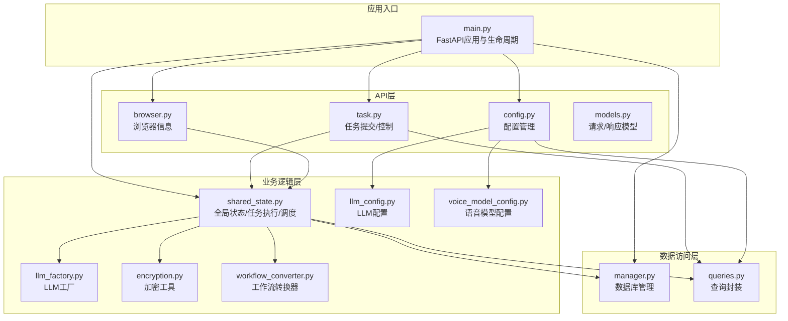
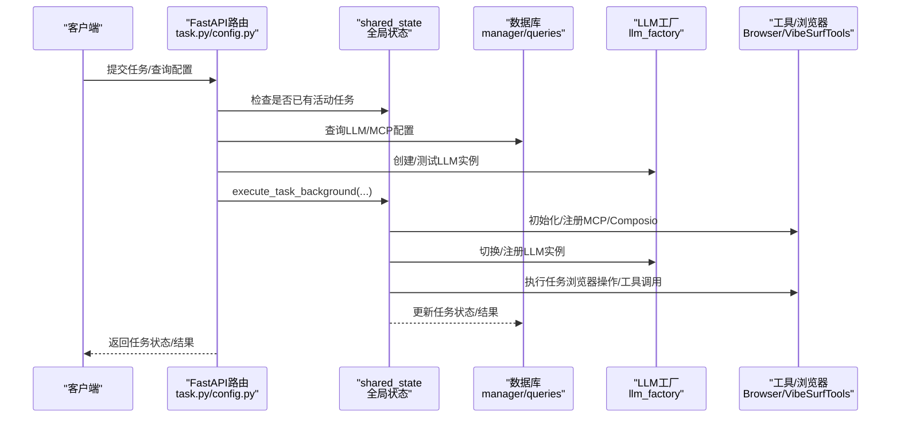
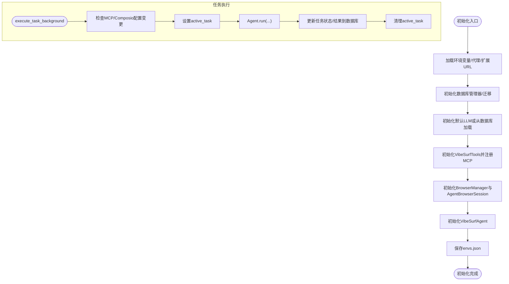
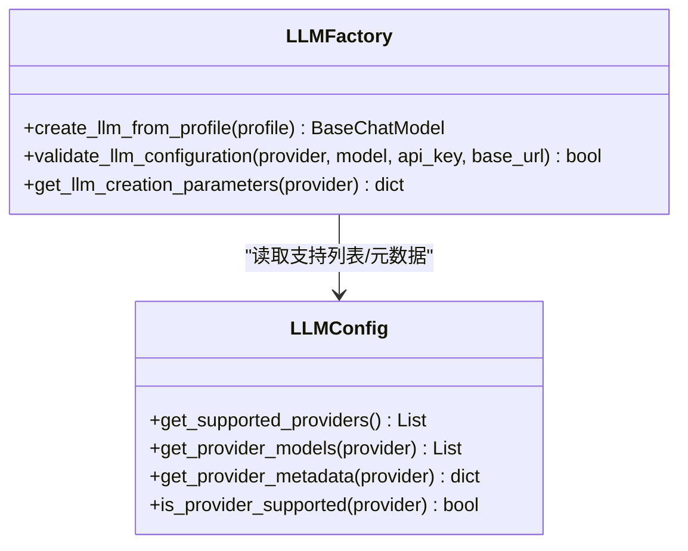
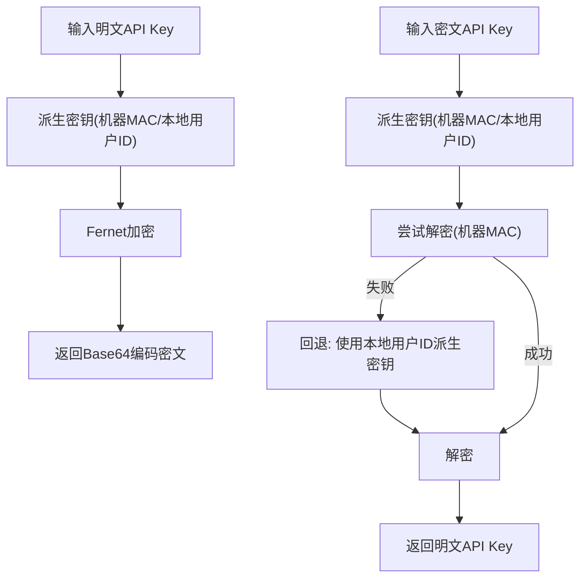
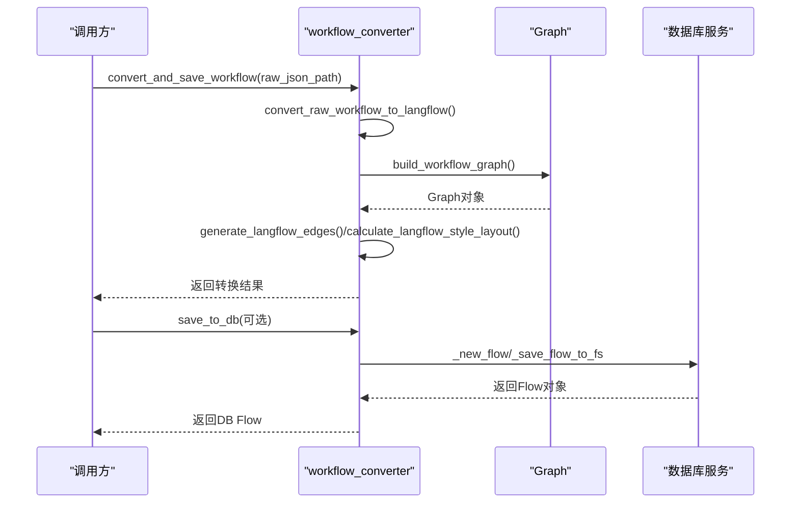
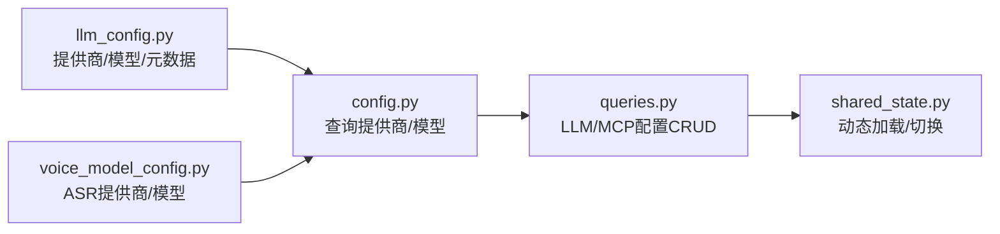
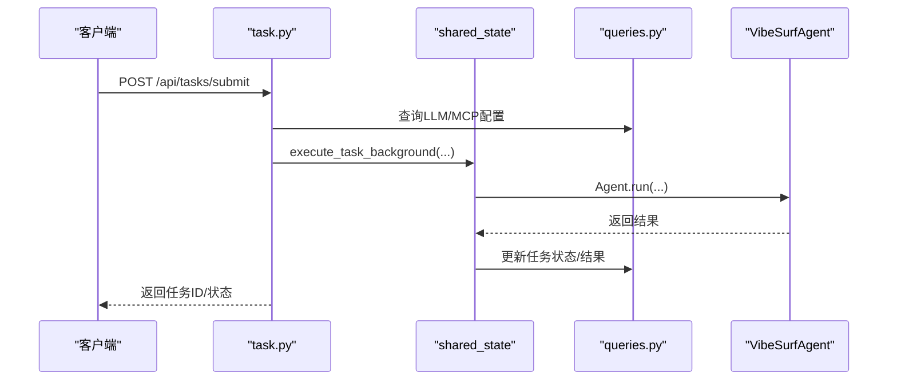
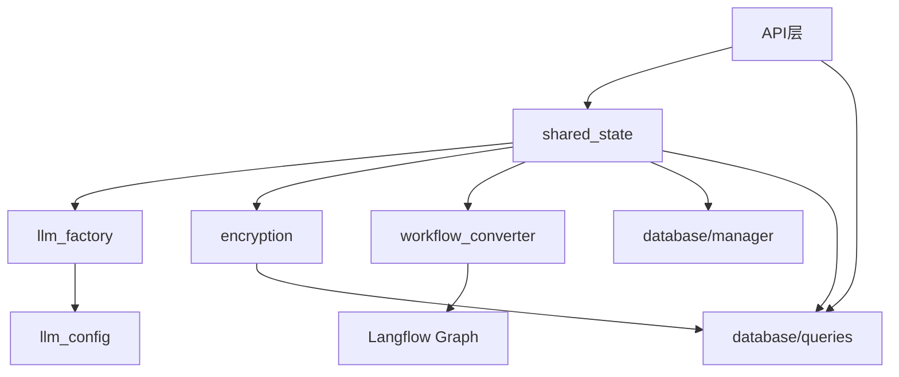

# 业务逻辑

<cite>
**本文引用的文件**
- [main.py](file://vibe_surf/backend/main.py)
- [shared_state.py](file://vibe_surf/backend/shared_state.py)
- [llm_factory.py](file://vibe_surf/backend/utils/llm_factory.py)
- [encryption.py](file://vibe_surf/backend/utils/encryption.py)
- [workflow_converter.py](file://vibe_surf/backend/utils/workflow_converter.py)
- [llm_config.py](file://vibe_surf/backend/llm_config.py)
- [voice_model_config.py](file://vibe_surf/backend/voice_model_config.py)
- [manager.py](file://vibe_surf/backend/database/manager.py)
- [queries.py](file://vibe_surf/backend/database/queries.py)
- [models.py](file://vibe_surf/backend/api/models.py)
- [task.py](file://vibe_surf/backend/api/task.py)
- [config.py](file://vibe_surf/backend/api/config.py)
- [browser.py](file://vibe_surf/backend/api/browser.py)
</cite>

## 目录
1. [简介](#简介)
2. [项目结构](#项目结构)
3. [核心组件](#核心组件)
4. [架构总览](#架构总览)
5. [详细组件分析](#详细组件分析)
6. [依赖关系分析](#依赖关系分析)
7. [性能考量](#性能考量)
8. [故障排查指南](#故障排查指南)
9. [结论](#结论)
10. [附录](#附录)

## 简介
本文件面向VibeSurf业务逻辑层，系统性梳理后端核心业务逻辑的实现方式，包括全局状态管理、LLM实例工厂、加密工具、工作流转换器等关键服务；解释业务逻辑层如何协调API接口、数据库访问与外部服务调用；说明配置管理机制（LLM配置与语音模型配置）的加载与使用；总结设计模式（如单例模式共享状态、工厂模式LLM实例创建）；并提供组件集成示例与最佳实践。

## 项目结构
后端业务逻辑主要集中在以下模块：
- 应用入口与生命周期：backend/main.py
- 全局状态与任务执行：backend/shared_state.py
- 工具与配置：backend/utils/* 与 backend/llm_config.py、backend/voice_model_config.py
- 数据库与查询：backend/database/*
- API层：backend/api/*

图表来源
- [main.py](file://vibe_surf/backend/main.py#L543-L731)
- [shared_state.py](file://vibe_surf/backend/shared_state.py#L1-L200)
- [llm_factory.py](file://vibe_surf/backend/utils/llm_factory.py#L1-L120)
- [encryption.py](file://vibe_surf/backend/utils/encryption.py#L1-L120)
- [workflow_converter.py](file://vibe_surf/backend/utils/workflow_converter.py#L1-L120)
- [llm_config.py](file://vibe_surf/backend/llm_config.py#L1-L120)
- [voice_model_config.py](file://vibe_surf/backend/voice_model_config.py#L1-L25)
- [manager.py](file://vibe_surf/backend/database/manager.py#L148-L223)
- [queries.py](file://vibe_surf/backend/database/queries.py#L1-L120)
- [task.py](file://vibe_surf/backend/api/task.py#L1-L120)
- [config.py](file://vibe_surf/backend/api/config.py#L1-L120)
- [browser.py](file://vibe_surf/backend/api/browser.py#L1-L40)
- [models.py](file://vibe_surf/backend/api/models.py#L1-L120)

章节来源
- [main.py](file://vibe_surf/backend/main.py#L543-L731)

## 核心组件
- 全局状态管理（shared_state）
  - 维护全局组件（VibeSurfAgent、BrowserManager、VibeSurfTools、LLM实例、数据库管理器、环境变量、MCP服务器配置、当前LLM配置名、计划任务管理器等）
  - 提供任务执行入口execute_task_background，支持单任务模式下的运行/暂停/停止/新增指令
  - 支持动态更新LLM实例、MCP服务器配置与Composio工具配置
  - 提供ScheduleManager用于计划任务的启动/停止与周期检查
- LLM实例工厂（llm_factory）
  - 基于LLM配置与数据库记录创建不同提供商的LLM实例
  - 支持参数校验与参数集构建（温度、最大令牌数、top_p、频率惩罚、种子等）
- 加密工具（encryption）
  - 使用机器MAC地址或本地用户ID派生对称密钥，对敏感信息（如API Key）进行加解密
- 工作流转换器（workflow_converter）
  - 将录制的工作流转换为Langflow图结构，生成边与布局，并可保存到数据库
- 配置管理
  - LLM配置：集中定义支持的提供商、模型与元数据
  - 语音模型配置：集中定义ASR提供商与模型类型
- 数据库管理与查询（database/manager.py, database/queries.py）
  - DatabaseManager负责引擎初始化、迁移与会话管理
  - Queries封装LLMProfile、McpProfile、Task、上传文件等表的CRUD与聚合查询

章节来源
- [shared_state.py](file://vibe_surf/backend/shared_state.py#L1-L200)
- [llm_factory.py](file://vibe_surf/backend/utils/llm_factory.py#L1-L120)
- [encryption.py](file://vibe_surf/backend/utils/encryption.py#L1-L120)
- [workflow_converter.py](file://vibe_surf/backend/utils/workflow_converter.py#L1-L120)
- [llm_config.py](file://vibe_surf/backend/llm_config.py#L1-L120)
- [voice_model_config.py](file://vibe_surf/backend/voice_model_config.py#L1-L25)
- [manager.py](file://vibe_surf/backend/database/manager.py#L148-L223)
- [queries.py](file://vibe_surf/backend/database/queries.py#L1-L120)

## 架构总览
业务逻辑层通过FastAPI应用统一对外提供REST接口，内部以shared_state为中心协调各子系统：
- API层接收请求，调用shared_state中的任务执行函数或查询数据库
- shared_state负责初始化全局组件（LLM、Browser、Tools），并在执行任务时按需切换LLM配置
- 数据库层通过SQLAlchemy异步会话与迁移管理保证数据一致性
- 外部服务（浏览器、Composio、Langflow等）通过共享组件与工具模块接入

图表来源
- [task.py](file://vibe_surf/backend/api/task.py#L43-L146)
- [config.py](file://vibe_surf/backend/api/config.py#L78-L140)
- [shared_state.py](file://vibe_surf/backend/shared_state.py#L118-L233)
- [llm_factory.py](file://vibe_surf/backend/utils/llm_factory.py#L23-L120)
- [manager.py](file://vibe_surf/backend/database/manager.py#L203-L223)
- [queries.py](file://vibe_surf/backend/database/queries.py#L441-L520)

## 详细组件分析

### 全局状态管理（shared_state）
- 职责
  - 维护全局组件与环境变量字典
  - 单任务执行入口execute_task_background，负责任务状态跟踪、MCP/Composio配置同步、任务结果持久化
  - 动态更新LLM实例（基于数据库配置或环境变量回退）
  - 计划任务管理（ScheduleManager）：周期检查、任务启动/停止
- 关键流程
  - 初始化initialize_vibesurf_components：加载环境变量、初始化数据库、创建LLM、Browser、Tools、Agent并写回envs.json
  - 任务执行：设置active_task、调用Agent.run、更新数据库、清理active_task
  - MCP/Composio配置变更检测：从数据库拉取最新配置，对比共享状态，必要时重新注册

图表来源
- [shared_state.py](file://vibe_surf/backend/shared_state.py#L453-L598)
- [shared_state.py](file://vibe_surf/backend/shared_state.py#L118-L233)

章节来源
- [shared_state.py](file://vibe_surf/backend/shared_state.py#L1-L200)
- [shared_state.py](file://vibe_surf/backend/shared_state.py#L453-L598)
- [shared_state.py](file://vibe_surf/backend/shared_state.py#L118-L233)

### LLM实例工厂（llm_factory）
- 设计模式：工厂模式
  - 输入：LLM配置（提供商、模型、API Key、基础URL、温度、最大令牌数等）
  - 输出：对应提供商的LLM实例（ChatOpenAI、ChatAnthropic、ChatGoogle、ChatAzureOpenAI、ChatGroq、ChatOllama、ChatOpenRouter、ChatDeepSeek、ChatAWSBedrock、ChatAnthropicBedrock、ChatOpenAICompatible）
- 参数校验与构建
  - 不同提供商支持的参数不同，工厂根据提供商元数据构建参数集合
  - 对Azure OpenAI、AWS Bedrock等特殊提供商进行参数适配
- 验证与错误处理
  - 提供validate_llm_configuration与get_llm_creation_parameters辅助参数合法性检查与参数清单

图表来源
- [llm_factory.py](file://vibe_surf/backend/utils/llm_factory.py#L23-L275)
- [llm_config.py](file://vibe_surf/backend/llm_config.py#L1-L120)

章节来源
- [llm_factory.py](file://vibe_surf/backend/utils/llm_factory.py#L1-L120)
- [llm_config.py](file://vibe_surf/backend/llm_config.py#L1-L120)

### 加密工具（encryption）
- 设计模式：工具类（无状态）
- 功能
  - 从机器MAC地址或本地用户ID派生对称密钥（Fernet）
  - 对API Key进行加解密，支持判断是否已加密
- 安全性
  - 使用PBKDF2进行密钥派生，固定盐值
  - 回退策略：当MAC不可用时使用本地用户ID

图表来源
- [encryption.py](file://vibe_surf/backend/utils/encryption.py#L1-L120)

章节来源
- [encryption.py](file://vibe_surf/backend/utils/encryption.py#L1-L120)

### 工作流转换器（workflow_converter）
- 功能
  - 将原始录制工作流转换为Langflow图结构（节点/边/布局）
  - 生成Langflow兼容的边格式与唯一边ID
  - 计算层级布局（拓扑分层、交叉减少、垂直居中）
  - 可选保存到数据库并落盘
- 流程
  - 解析原始JSON，构建Graph对象
  - 逐条动作映射到组件（导航、点击、输入、滚动等）
  - 生成边与布局，序列化为Langflow JSON
  - 可选调用数据库服务保存

图表来源
- [workflow_converter.py](file://vibe_surf/backend/utils/workflow_converter.py#L129-L171)
- [workflow_converter.py](file://vibe_surf/backend/utils/workflow_converter.py#L420-L483)

章节来源
- [workflow_converter.py](file://vibe_surf/backend/utils/workflow_converter.py#L1-L120)
- [workflow_converter.py](file://vibe_surf/backend/utils/workflow_converter.py#L129-L171)
- [workflow_converter.py](file://vibe_surf/backend/utils/workflow_converter.py#L420-L483)

### 配置管理机制
- LLM配置
  - llm_config.py集中定义支持的提供商、模型列表与元数据（是否需要API Key、是否需要base_url、默认模型等）
  - API层提供查询可用提供商与模型的接口
- 语音模型配置
  - voice_model_config.py集中定义ASR提供商与模型类型
- 数据库存储
  - LLMProfileQueries/McpProfileQueries负责LLM/MCP配置的增删改查与默认配置维护
  - API层提供LLM/MCP配置的CRUD接口

图表来源
- [llm_config.py](file://vibe_surf/backend/llm_config.py#L1-L120)
- [voice_model_config.py](file://vibe_surf/backend/voice_model_config.py#L1-L25)
- [config.py](file://vibe_surf/backend/api/config.py#L585-L643)
- [queries.py](file://vibe_surf/backend/database/queries.py#L1-L120)
- [shared_state.py](file://vibe_surf/backend/shared_state.py#L604-L682)

章节来源
- [llm_config.py](file://vibe_surf/backend/llm_config.py#L1-L120)
- [voice_model_config.py](file://vibe_surf/backend/voice_model_config.py#L1-L25)
- [config.py](file://vibe_surf/backend/api/config.py#L585-L643)
- [queries.py](file://vibe_surf/backend/database/queries.py#L1-L120)
- [shared_state.py](file://vibe_surf/backend/shared_state.py#L604-L682)

### API层与业务逻辑的协作
- 任务API（task.py）
  - 提交任务：校验是否已有活动任务，查询LLM配置，创建初始任务记录，后台执行execute_task_background
  - 控制任务：暂停/恢复/停止，更新active_task状态
  - 详细状态：返回VibeSurf Agent的状态信息
- 配置API（config.py）
  - LLM/MCP配置的CRUD与默认配置设置
  - 查询可用提供商与模型
  - 环境变量的读取与更新
- 浏览器API（browser.py）
  - 获取当前活跃标签页与所有标签页信息

图表来源
- [task.py](file://vibe_surf/backend/api/task.py#L43-L146)
- [shared_state.py](file://vibe_surf/backend/shared_state.py#L118-L233)
- [queries.py](file://vibe_surf/backend/database/queries.py#L441-L520)

章节来源
- [task.py](file://vibe_surf/backend/api/task.py#L1-L120)
- [config.py](file://vibe_surf/backend/api/config.py#L78-L140)
- [browser.py](file://vibe_surf/backend/api/browser.py#L1-L40)
- [models.py](file://vibe_surf/backend/api/models.py#L1-L120)

## 依赖关系分析
- 组件耦合
  - shared_state是中心枢纽，被API层、数据库层、工具层广泛依赖
  - llm_factory与llm_config紧密耦合，确保工厂创建的实例符合配置约束
  - encryption在数据库层用于LLMProfile的API Key加解密
  - workflow_converter依赖Langflow Graph与网络库进行布局计算
- 外部依赖
  - 数据库：SQLAlchemy异步引擎与迁移管理
  - 浏览器：BrowserManager/AgentBrowserSession
  - Composio：工具注册与动态更新
  - Langflow：工作流存储与组件缓存

图表来源
- [shared_state.py](file://vibe_surf/backend/shared_state.py#L1-L200)
- [llm_factory.py](file://vibe_surf/backend/utils/llm_factory.py#L1-L120)
- [encryption.py](file://vibe_surf/backend/utils/encryption.py#L1-L120)
- [workflow_converter.py](file://vibe_surf/backend/utils/workflow_converter.py#L1-L120)
- [manager.py](file://vibe_surf/backend/database/manager.py#L148-L223)
- [queries.py](file://vibe_surf/backend/database/queries.py#L1-L120)

章节来源
- [shared_state.py](file://vibe_surf/backend/shared_state.py#L1-L200)
- [llm_factory.py](file://vibe_surf/backend/utils/llm_factory.py#L1-L120)
- [encryption.py](file://vibe_surf/backend/utils/encryption.py#L1-L120)
- [workflow_converter.py](file://vibe_surf/backend/utils/workflow_converter.py#L1-L120)
- [manager.py](file://vibe_surf/backend/database/manager.py#L148-L223)
- [queries.py](file://vibe_surf/backend/database/queries.py#L1-L120)

## 性能考量
- 异步与并发
  - 数据库采用SQLAlchemy异步引擎与会话工厂，避免阻塞
  - 任务执行通过后台任务队列（BackgroundTasks）异步执行，避免阻塞请求线程
- 连接池与资源复用
  - DatabaseManager针对SQLite使用StaticPool，其他数据库使用连接池参数优化
  - BrowserManager与AgentBrowserSession复用主会话，减少浏览器进程开销
- 缓存与预热
  - Langflow组件缓存与starter项目预创建，降低首次加载延迟
- I/O与序列化
  - 工作流转换器使用NetworkX进行布局计算，建议限制复杂度或离线计算
  - API层对响应序列化异常进行捕获与友好提示，避免崩溃

[本节为通用指导，不直接分析具体文件]

## 故障排查指南
- LLM连接失败
  - 现象：提交任务时报错“无法连接LLM API”
  - 排查：检查LLM配置（提供商、模型、API Key、base_url）、网络代理、工厂参数校验
  - 参考路径：[llm_factory.py](file://vibe_surf/backend/utils/llm_factory.py#L23-L120)、[task.py](file://vibe_surf/backend/api/task.py#L154-L195)
- 任务状态异常
  - 现象：任务卡住或状态不更新
  - 排查：查看shared_state.active_task是否清理、数据库任务状态是否更新、Agent.run是否抛出异常
  - 参考路径：[shared_state.py](file://vibe_surf/backend/shared_state.py#L118-L233)、[queries.py](file://vibe_surf/backend/database/queries.py#L705-L735)
- MCP/Composio配置未生效
  - 现象：工具未按预期注册
  - 排查：确认数据库中MCP/Composio配置是否启用、shared_state是否检测到变更并重新注册
  - 参考路径：[shared_state.py](file://vibe_surf/backend/shared_state.py#L255-L338)
- 数据库迁移失败
  - 现象：初始化数据库报错
  - 排查：检查SQLite路径权限、迁移脚本完整性、版本号设置
  - 参考路径：[manager.py](file://vibe_surf/backend/database/manager.py#L87-L146)
- 加密失败
  - 现象：API Key无法解密
  - 排查：确认密钥派生路径（MAC/本地用户ID）、盐值一致性
  - 参考路径：[encryption.py](file://vibe_surf/backend/utils/encryption.py#L1-L120)

章节来源
- [task.py](file://vibe_surf/backend/api/task.py#L154-L195)
- [shared_state.py](file://vibe_surf/backend/shared_state.py#L118-L233)
- [queries.py](file://vibe_surf/backend/database/queries.py#L705-L735)
- [manager.py](file://vibe_surf/backend/database/manager.py#L87-L146)
- [encryption.py](file://vibe_surf/backend/utils/encryption.py#L1-L120)

## 结论
VibeSurf业务逻辑层以shared_state为核心，结合工厂模式（LLM工厂）、工具类（加密/工作流转换）、配置中心（LLM/语音配置）与数据库层，实现了稳定的单任务执行模型。通过异步I/O、连接池与组件缓存，兼顾了性能与可靠性。API层清晰地将业务逻辑与接口分离，便于扩展与维护。

[本节为总结性内容，不直接分析具体文件]

## 附录
- 设计模式
  - 单例/全局状态：shared_state作为全局共享状态容器
  - 工厂模式：llm_factory按配置创建LLM实例
  - 工具类：encryption/workflow_converter提供纯函数式能力
- 最佳实践
  - 在提交任务前先验证LLM连通性
  - 使用数据库事务与异常捕获保证任务状态一致性
  - 对敏感信息（API Key）始终使用加密存储与传输
  - 合理设置MCP/Composio配置，避免频繁重注册
  - 对复杂工作流转换进行离线批处理，减少在线请求压力

[本节为通用指导，不直接分析具体文件]