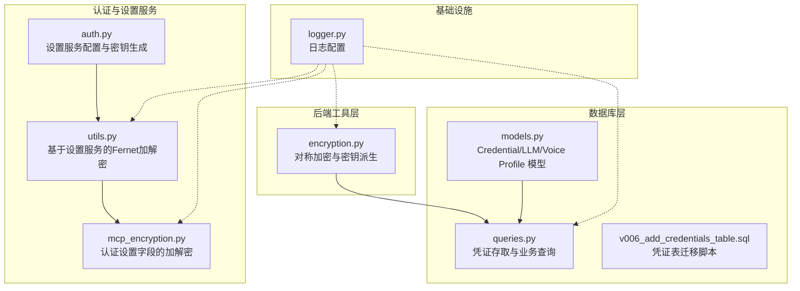
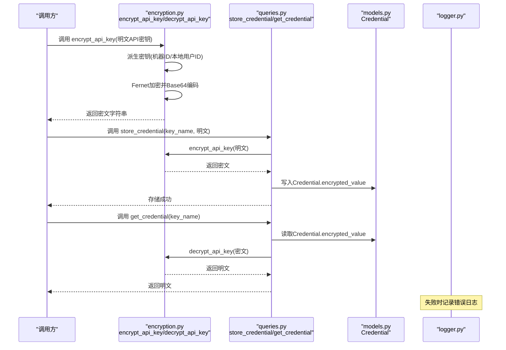
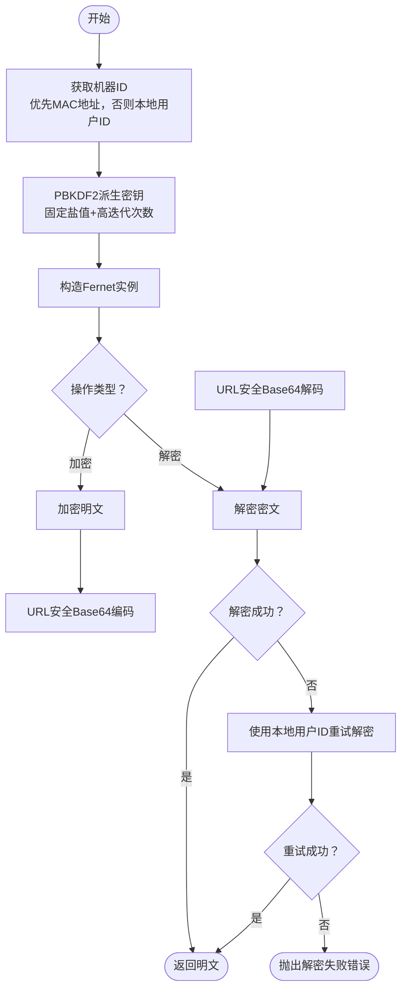
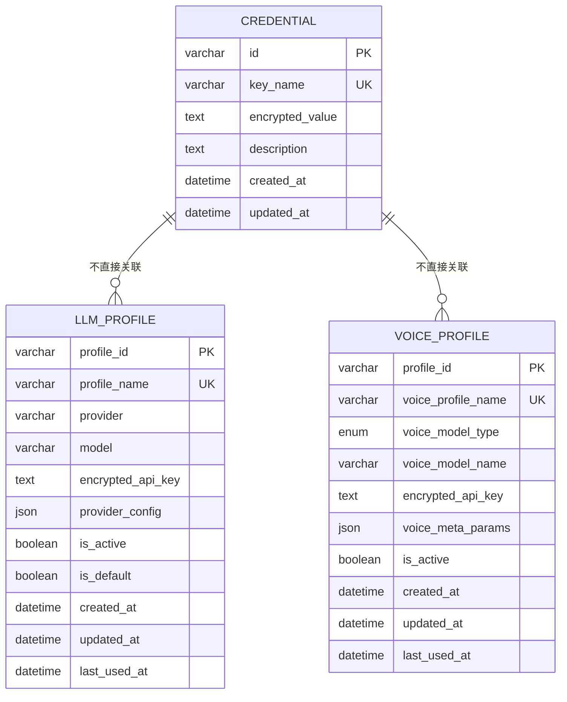
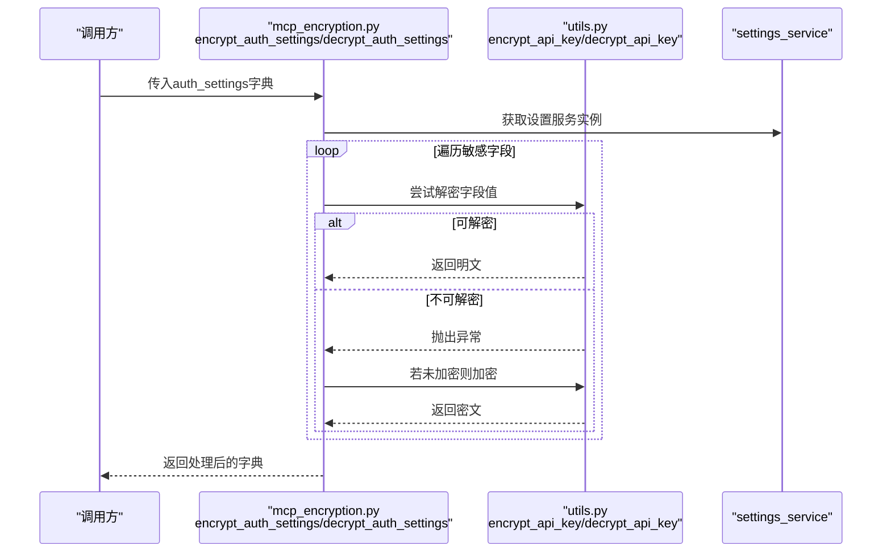
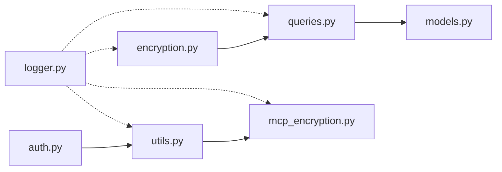

# 加密服务

<cite>
**本文引用的文件**
- [encryption.py](file://vibe_surf/backend/utils/encryption.py)
- [models.py](file://vibe_surf/backend/database/models.py)
- [queries.py](file://vibe_surf/backend/database/queries.py)
- [mcp_encryption.py](file://vibe_surf/langflow/services/auth/mcp_encryption.py)
- [utils.py](file://vibe_surf/langflow/services/auth/utils.py)
- [auth.py](file://vibe_surf/langflow/services/settings/auth.py)
- [logger.py](file://vibe_surf/logger.py)
- [v006_add_credentials_table.sql](file://vibe_surf/backend/database/migrations/v006_add_credentials_table.sql)
</cite>

## 目录
1. [简介](#简介)
2. [项目结构](#项目结构)
3. [核心组件](#核心组件)
4. [架构总览](#架构总览)
5. [详细组件分析](#详细组件分析)
6. [依赖关系分析](#依赖关系分析)
7. [性能考量](#性能考量)
8. [故障排查指南](#故障排查指南)
9. [结论](#结论)
10. [附录](#附录)

## 简介
本文件面向VibeSurf后端的加密服务，系统化阐述Encryption类（在当前仓库中以函数形式实现）的实现原理与使用方式，重点覆盖：
- 使用的对称加密算法：Fernet（基于AES-128-CBC的封装）
- 密钥生成与管理机制：基于机器MAC地址或本地用户ID派生密钥
- 敏感数据保护策略：API密钥、凭证等的加密存储与解密流程
- 加密上下文管理器的使用方法与最佳实践
- 加密/解密操作示例路径、性能基准建议、安全漏洞防范
- 密钥轮换策略、加密数据迁移方案与合规性要求

## 项目结构
围绕加密服务的关键文件分布如下：
- 后端工具层：提供对称加密与密钥派生的核心逻辑
- 数据库模型与查询：定义凭证表并提供存取接口
- 认证与设置服务：提供另一套基于设置服务的对称加密实现
- 日志模块：统一的日志输出，便于审计与排障

图表来源
- [encryption.py](file://vibe_surf/backend/utils/encryption.py#L1-L172)
- [models.py](file://vibe_surf/backend/database/models.py#L217-L235)
- [queries.py](file://vibe_surf/backend/database/queries.py#L1360-L1405)
- [mcp_encryption.py](file://vibe_surf/langflow/services/auth/mcp_encryption.py#L1-L120)
- [utils.py](file://vibe_surf/langflow/services/auth/utils.py#L472-L505)
- [auth.py](file://vibe_surf/langflow/services/settings/auth.py#L1-L112)
- [logger.py](file://vibe_surf/logger.py#L1-L99)
- [v006_add_credentials_table.sql](file://vibe_surf/backend/database/migrations/v006_add_credentials_table.sql#L1-L26)

章节来源
- [encryption.py](file://vibe_surf/backend/utils/encryption.py#L1-L172)
- [models.py](file://vibe_surf/backend/database/models.py#L217-L235)
- [queries.py](file://vibe_surf/backend/database/queries.py#L1360-L1405)
- [mcp_encryption.py](file://vibe_surf/langflow/services/auth/mcp_encryption.py#L1-L120)
- [utils.py](file://vibe_surf/langflow/services/auth/utils.py#L472-L505)
- [auth.py](file://vibe_surf/langflow/services/settings/auth.py#L1-L112)
- [logger.py](file://vibe_surf/logger.py#L1-L99)
- [v006_add_credentials_table.sql](file://vibe_surf/backend/database/migrations/v006_add_credentials_table.sql#L1-L26)

## 核心组件
- 对称加密与密钥派生（后端工具层）
  - 基于PBKDF2-HMAC-SHA256从机器标识（MAC地址或本地用户ID）派生密钥
  - 使用Fernet进行对称加解密，并通过URL安全Base64编码传输
  - 提供加密API密钥、解密API密钥、判断是否已加密的工具函数
- 凭证模型与查询（数据库层）
  - 定义Credential模型用于存储加密后的敏感值
  - 提供存储、读取、删除、列举凭证的查询接口
- 认证设置加解密（设置服务层）
  - 基于设置服务中的密钥，提供对OAuth客户端密钥、API密钥等敏感字段的加解密
  - 支持自动检测是否已加密，兼容明文回退
- 日志与审计（基础设施）
  - 统一日志配置，便于记录加密失败、解密失败等关键事件

章节来源
- [encryption.py](file://vibe_surf/backend/utils/encryption.py#L23-L148)
- [models.py](file://vibe_surf/backend/database/models.py#L217-L235)
- [queries.py](file://vibe_surf/backend/database/queries.py#L1360-L1405)
- [mcp_encryption.py](file://vibe_surf/langflow/services/auth/mcp_encryption.py#L1-L120)
- [utils.py](file://vibe_surf/langflow/services/auth/utils.py#L472-L505)
- [logger.py](file://vibe_surf/logger.py#L1-L99)

## 架构总览
下图展示加密服务在系统中的位置与交互关系：

图表来源
- [encryption.py](file://vibe_surf/backend/utils/encryption.py#L65-L127)
- [queries.py](file://vibe_surf/backend/database/queries.py#L1367-L1401)
- [models.py](file://vibe_surf/backend/database/models.py#L217-L235)
- [logger.py](file://vibe_surf/logger.py#L1-L99)

## 详细组件分析

### 对称加密与密钥派生（后端工具层）
- 算法选择
  - 使用Fernet对称加密，底层基于AES-128-CBC，提供完整性校验
  - 使用PBKDF2-HMAC-SHA256从机器标识派生密钥，固定盐值与高迭代次数，降低彩虹表与字典攻击风险
- 密钥来源与回退
  - 首选获取机器MAC地址作为机器标识；若不可用则回退到本地用户ID（持久化在工作空间目录）
  - 本地用户ID首次运行生成并缓存，确保同一设备上密钥稳定
- 加密/解密流程
  - 加密：派生密钥 → Fernet实例 → 加密 → URL安全Base64编码
  - 解密：URL安全Base64解码 → Fernet实例 → 解密
  - 解密失败时，尝试使用本地用户ID派生密钥重试
- 已加密判定
  - 通过Base64解码与长度/填充字符特征快速判断是否为Fernet密文

图表来源
- [encryption.py](file://vibe_surf/backend/utils/encryption.py#L23-L127)

章节来源
- [encryption.py](file://vibe_surf/backend/utils/encryption.py#L23-L148)

### 凭证模型与查询（数据库层）
- 数据模型
  - Credential表包含键名、加密值、描述与时间戳
  - LLM/Voice Profile模型包含加密API密钥字段，便于在配置中直接存储
- 查询接口
  - 存储：对明文先加密再写入
  - 读取：从数据库读取密文并解密
  - 删除与列举：提供删除与列出键名的辅助能力
- 迁移脚本
  - v006迁移脚本创建凭证表并建立索引与触发器，保障唯一性与更新时间一致性

图表来源
- [models.py](file://vibe_surf/backend/database/models.py#L217-L235)
- [models.py](file://vibe_surf/backend/database/models.py#L29-L56)
- [models.py](file://vibe_surf/backend/database/models.py#L57-L93)
- [v006_add_credentials_table.sql](file://vibe_surf/backend/database/migrations/v006_add_credentials_table.sql#L1-L26)

章节来源
- [models.py](file://vibe_surf/backend/database/models.py#L217-L235)
- [queries.py](file://vibe_surf/backend/database/queries.py#L1367-L1401)
- [v006_add_credentials_table.sql](file://vibe_surf/backend/database/migrations/v006_add_credentials_table.sql#L1-L26)

### 认证设置加解密（设置服务层）
- 设计要点
  - 基于设置服务提供的密钥，对OAuth客户端密钥、API密钥等敏感字段进行加解密
  - 自动检测是否已加密，若未加密则加密；若已加密则解密
  - 兼容明文回退，便于历史数据平滑过渡
- 错误处理
  - 解密失败时区分“值看起来已加密但无法解密”与“明文”两种情况，前者会记录错误并抛出异常，后者保留原值

图表来源
- [mcp_encryption.py](file://vibe_surf/langflow/services/auth/mcp_encryption.py#L1-L120)
- [utils.py](file://vibe_surf/langflow/services/auth/utils.py#L472-L505)

章节来源
- [mcp_encryption.py](file://vibe_surf/langflow/services/auth/mcp_encryption.py#L1-L120)
- [utils.py](file://vibe_surf/langflow/services/auth/utils.py#L472-L505)

### 日志与审计
- 日志配置
  - 控制台与文件双通道输出，支持按调试模式切换日志级别
  - 文件滚动大小与备份数量可控，避免日志过大
- 加密相关日志
  - 加密/解密失败时记录错误，便于定位问题
  - 建议在生产环境开启INFO级别以上，以便审计

章节来源
- [logger.py](file://vibe_surf/logger.py#L1-L99)
- [encryption.py](file://vibe_surf/backend/utils/encryption.py#L90-L127)
- [mcp_encryption.py](file://vibe_surf/langflow/services/auth/mcp_encryption.py#L85-L96)

## 依赖关系分析
- 组件耦合
  - encryption.py与数据库查询层通过store_credential/get_credential耦合
  - 设置服务层的加解密工具与认证设置模块强耦合，便于统一密钥管理
- 外部依赖
  - cryptography.Fernet、PBKDF2-HMAC-SHA256、getmac、uuid_extensions等
- 潜在循环依赖
  - 当前模块间无明显循环导入；注意在扩展新模块时避免双向引用

图表来源
- [encryption.py](file://vibe_surf/backend/utils/encryption.py#L1-L172)
- [queries.py](file://vibe_surf/backend/database/queries.py#L1360-L1405)
- [models.py](file://vibe_surf/backend/database/models.py#L217-L235)
- [mcp_encryption.py](file://vibe_surf/langflow/services/auth/mcp_encryption.py#L1-L120)
- [utils.py](file://vibe_surf/langflow/services/auth/utils.py#L472-L505)
- [auth.py](file://vibe_surf/langflow/services/settings/auth.py#L1-L112)
- [logger.py](file://vibe_surf/logger.py#L1-L99)

章节来源
- [encryption.py](file://vibe_surf/backend/utils/encryption.py#L1-L172)
- [queries.py](file://vibe_surf/backend/database/queries.py#L1360-L1405)
- [models.py](file://vibe_surf/backend/database/models.py#L217-L235)
- [mcp_encryption.py](file://vibe_surf/langflow/services/auth/mcp_encryption.py#L1-L120)
- [utils.py](file://vibe_surf/langflow/services/auth/utils.py#L472-L505)
- [auth.py](file://vibe_surf/langflow/services/settings/auth.py#L1-L112)
- [logger.py](file://vibe_surf/logger.py#L1-L99)

## 性能考量
- 算法开销
  - PBKDF2-HMAC-SHA256的高迭代次数带来一定CPU开销，适合一次性派生密钥；频繁加解密场景建议缓存Fernet实例
- I/O与序列化
  - Base64编码/解码与数据库读写为主要瓶颈；批量操作时合并事务可显著提升吞吐
- 并发与线程安全
  - Fernet实例非线程安全，建议在并发场景下按线程/协程隔离或使用连接池管理
- 基准建议
  - 在目标硬件上对单条API密钥的加解密进行多次采样，统计平均耗时与P95/P99延迟
  - 对比不同迭代次数（如10万、100万）对安全性与性能的影响，结合威胁模型确定最优参数

[本节为通用性能讨论，无需具体文件引用]

## 故障排查指南
- 常见问题
  - 解密失败：检查是否在同一设备上（MAC地址变化或本地用户ID回退）导致密钥不一致
  - 值看起来已加密但无法解密：确认密钥配置正确且未被篡改
  - 明文与密文混杂：使用is_encrypted判断后再决定是否加密
- 排查步骤
  - 查看日志：定位加密/解密异常发生的具体位置
  - 校验密钥来源：确认get_mac_address与本地用户ID文件是否存在
  - 单元测试：参考内置测试函数验证加解密链路
- 相关实现路径
  - 加密/解密入口与错误处理：[encryption.py](file://vibe_surf/backend/utils/encryption.py#L76-L127)
  - 凭证存取与异常日志：[queries.py](file://vibe_surf/backend/database/queries.py#L1367-L1405)
  - 认证设置加解密与兼容逻辑：[mcp_encryption.py](file://vibe_surf/langflow/services/auth/mcp_encryption.py#L1-L120)

章节来源
- [encryption.py](file://vibe_surf/backend/utils/encryption.py#L76-L127)
- [queries.py](file://vibe_surf/backend/database/queries.py#L1367-L1405)
- [mcp_encryption.py](file://vibe_surf/langflow/services/auth/mcp_encryption.py#L1-L120)

## 结论
- VibeSurf后端采用Fernet对称加密保护敏感数据，密钥由机器标识派生，具备设备绑定特性
- 数据库存储凭证表，业务通过查询接口完成加密存取，模型层面也支持在配置中直接存储加密API密钥
- 设置服务层提供另一套基于设置密钥的加解密实现，支持自动识别与兼容明文
- 建议在生产环境中启用严格日志与审计，配合密钥轮换与数据迁移策略，满足安全与合规要求

[本节为总结性内容，无需具体文件引用]

## 附录

### 加密上下文管理器使用方法与最佳实践
- 使用建议
  - 在需要频繁加解密的场景，缓存Fernet实例，避免重复派生密钥
  - 对外传输统一使用URL安全Base64编码，确保跨平台兼容
  - 对于多用户/多租户场景，建议引入用户维度的密钥派生因子，避免跨用户混淆
- 最佳实践
  - 仅在内存中持有明文，落库前立即加密
  - 对密钥材料进行最小权限访问控制，避免硬编码
  - 定期轮换密钥并执行数据迁移，保证历史数据可解密

[本节为通用指导，无需具体文件引用]

### 密钥轮换策略
- 策略设计
  - 新增密钥版本并同时支持旧密钥解密，逐步迁移至新密钥
  - 批量扫描数据库中的密文，使用新密钥重新加密并替换
  - 旧密钥在安全环境下销毁，防止泄露
- 实施要点
  - 保持向后兼容窗口，避免业务中断
  - 记录轮换时间与版本，便于审计与回溯

[本节为通用指导，无需具体文件引用]

### 加密数据迁移方案
- 迁移步骤
  - 读取所有凭证/配置中的密文
  - 使用新密钥重新加密
  - 写回数据库并更新索引
- 风险控制
  - 迁移前备份数据库
  - 分批执行并监控失败率
  - 回滚预案：保留旧密钥与旧版本数据

[本节为通用指导，无需具体文件引用]

### 合规性要求
- 数据最小化：仅存储必要的敏感数据
- 访问控制：限制对密钥与加密数据的访问范围
- 审计日志：记录所有加解密操作与异常事件
- 数据销毁：密钥不再使用时彻底销毁

[本节为通用指导，无需具体文件引用]