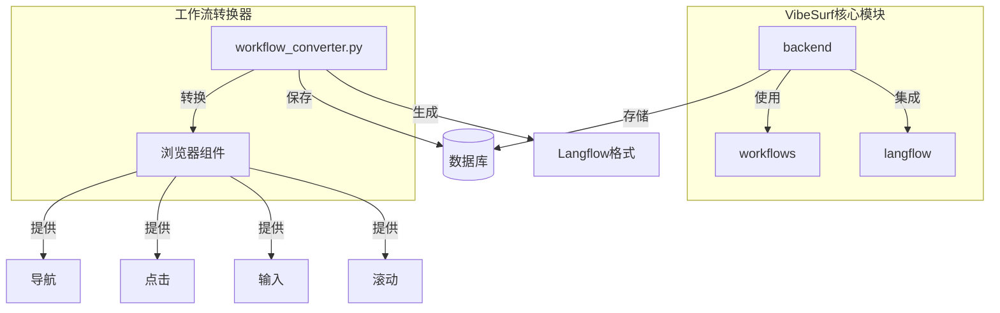
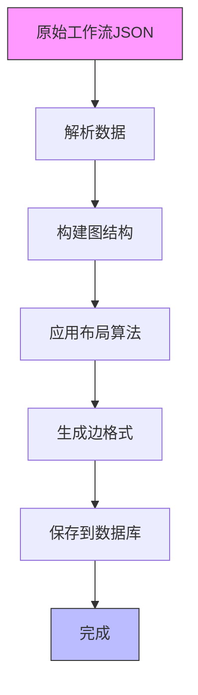
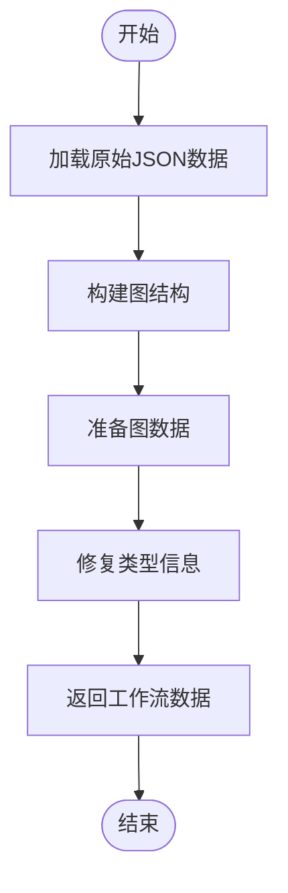
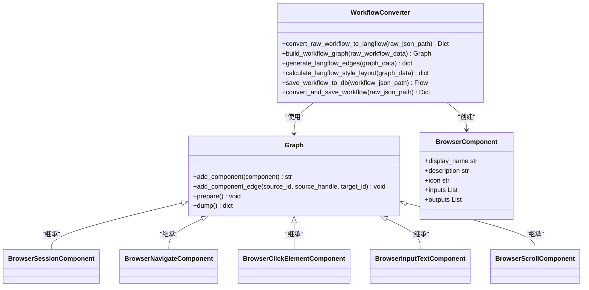
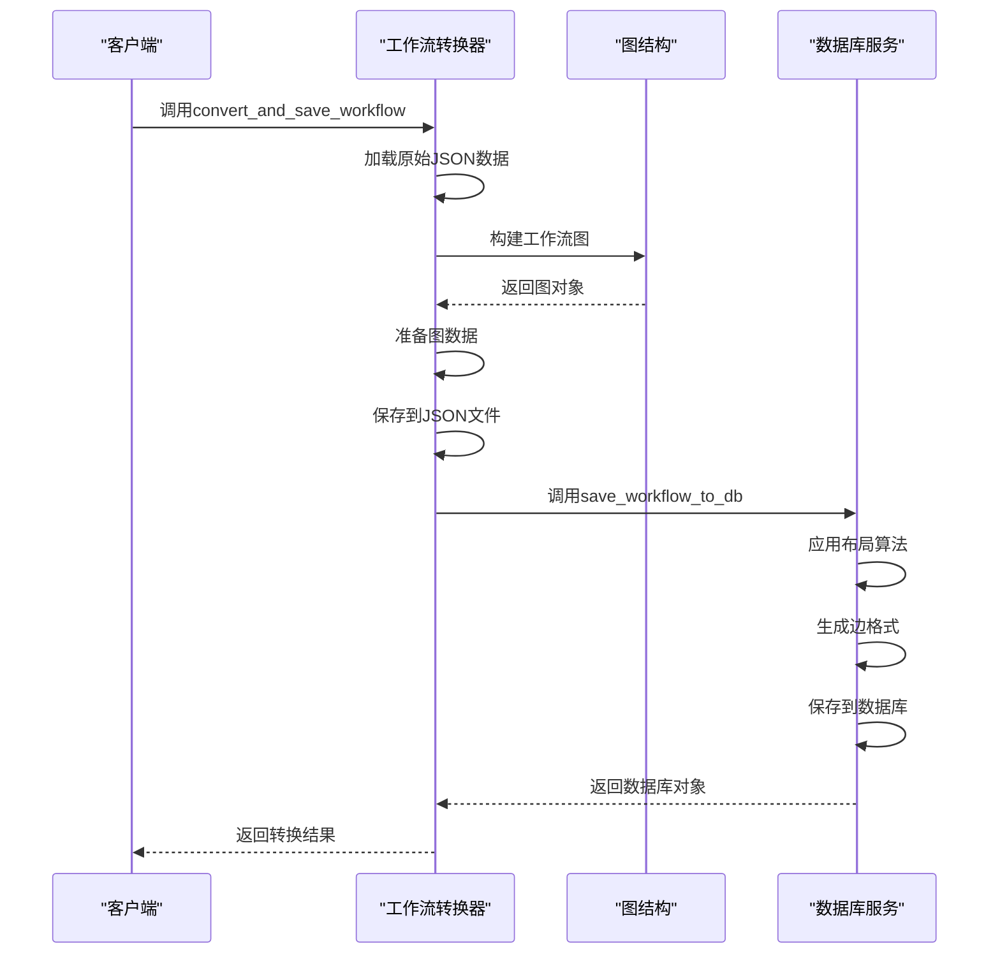
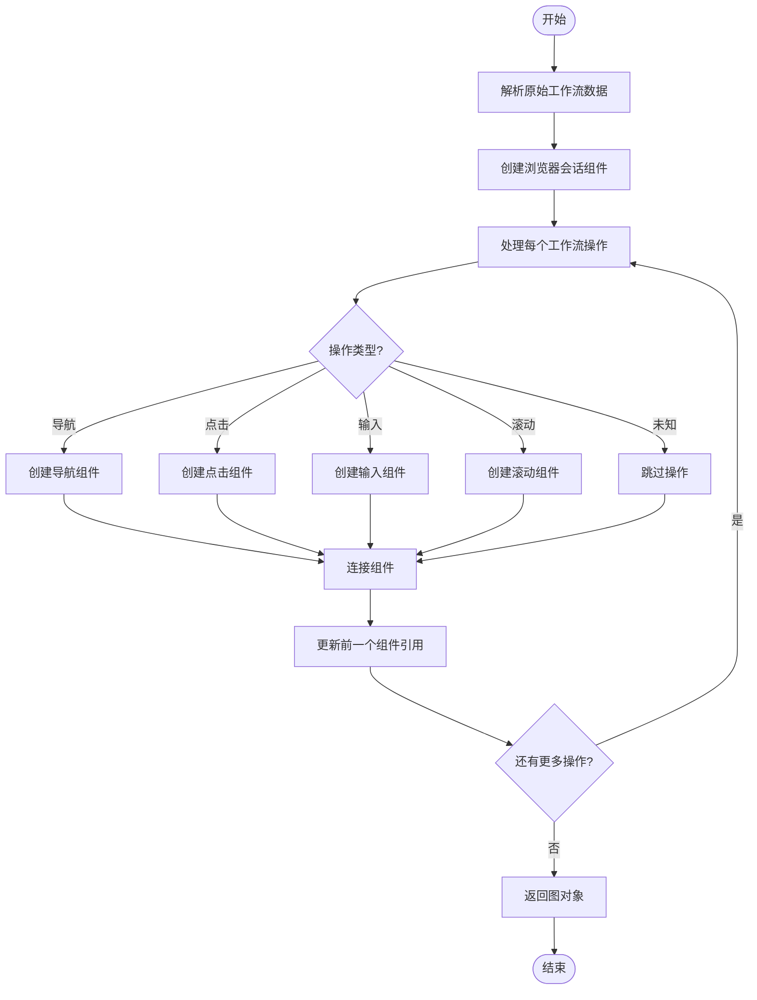
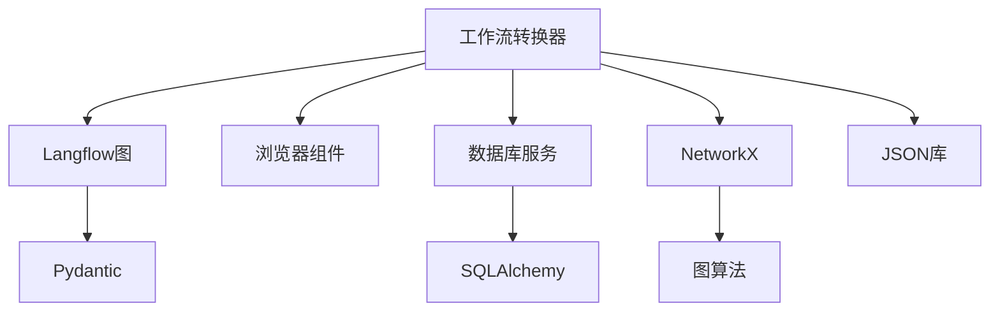

# 工作流转换器

<cite>
**本文档中引用的文件**   
- [workflow_converter.py](file://vibe_surf/backend/utils/workflow_converter.py)
- [browser_session.py](file://vibe_surf/workflows/Browser/browser_session.py)
- [browser_navigate.py](file://vibe_surf/workflows/Browser/browser_navigate.py)
- [browser_click_element.py](file://vibe_surf/workflows/Browser/browser_click_element.py)
- [browser_input_text.py](file://vibe_surf/workflows/Browser/browser_input_text.py)
- [browser_scroll.py](file://vibe_surf/workflows/Browser/browser_scroll.py)
- [base.py](file://vibe_surf/langflow/graph/graph/base.py)
</cite>

## 目录
1. [简介](#简介)
2. [项目结构](#项目结构)
3. [核心组件](#核心组件)
4. [架构概述](#架构概述)
5. [详细组件分析](#详细组件分析)
6. [依赖分析](#依赖分析)
7. [性能考虑](#性能考虑)
8. [故障排除指南](#故障排除指南)
9. [结论](#结论)

## 简介
VibeSurf工作流转换器是一个关键组件，负责将录制的浏览器操作工作流转换为Langflow兼容的格式。该转换器实现了从原始JSON格式到Langflow可视化工作流的完整转换过程，包括数据完整性保护、错误处理和数据库集成。转换器支持多种浏览器操作，如导航、点击、输入文本和滚动，并通过复杂的图布局算法确保工作流在Langflow界面中的可视化效果。

## 项目结构
VibeSurf项目采用模块化设计，工作流转换器位于`vibe_surf/backend/utils/`目录下。该组件与浏览器操作组件、Langflow集成和数据库服务紧密协作，形成一个完整的工作流处理系统。

**Diagram sources**
- [workflow_converter.py](file://vibe_surf/backend/utils/workflow_converter.py#L1-L570)
- [browser_session.py](file://vibe_surf/workflows/Browser/browser_session.py#L1-L55)

**Section sources**
- [workflow_converter.py](file://vibe_surf/backend/utils/workflow_converter.py#L1-L570)
- [vibe_surf/backend/utils/](file://vibe_surf/backend/utils/)

## 核心组件
工作流转换器的核心功能由`convert_raw_workflow_to_langflow`函数实现，该函数将原始工作流数据转换为Langflow兼容的格式。转换过程包括构建图结构、应用布局算法和生成正确的边格式。转换器还实现了`save_workflow_to_db`函数，用于将转换后的工作流保存到数据库中。

**Section sources**
- [workflow_converter.py](file://vibe_surf/backend/utils/workflow_converter.py#L129-L170)
- [workflow_converter.py](file://vibe_surf/backend/utils/workflow_converter.py#L420-L482)

## 架构概述
工作流转换器采用分层架构设计，从原始数据输入到最终的数据库存储，每个步骤都有明确的职责分离。转换器首先解析原始工作流数据，然后构建Langflow图结构，接着应用布局算法，最后生成正确的边格式并保存到数据库。

**Diagram sources**
- [workflow_converter.py](file://vibe_surf/backend/utils/workflow_converter.py#L129-L170)
- [workflow_converter.py](file://vibe_surf/backend/utils/workflow_converter.py#L238-L284)

## 详细组件分析

### 工作流转换组件分析
工作流转换器的核心是`convert_raw_workflow_to_langflow`函数，它负责将原始工作流数据转换为Langflow兼容的格式。该函数首先加载原始JSON数据，然后构建图结构，最后返回完整的Langflow工作流数据。

**Diagram sources**
- [workflow_converter.py](file://vibe_surf/backend/utils/workflow_converter.py#L129-L170)

#### 对象导向组件：

**Diagram sources**
- [workflow_converter.py](file://vibe_surf/backend/utils/workflow_converter.py#L30-L126)
- [browser_session.py](file://vibe_surf/workflows/Browser/browser_session.py#L11-L55)
- [browser_navigate.py](file://vibe_surf/workflows/Browser/browser_navigate.py#L11-L51)
- [browser_click_element.py](file://vibe_surf/workflows/Browser/browser_click_element.py#L16-L196)
- [browser_input_text.py](file://vibe_surf/workflows/Browser/browser_input_text.py#L13-L170)
- [browser_scroll.py](file://vibe_surf/workflows/Browser/browser_scroll.py#L11-L100)

#### API/服务组件：

**Diagram sources**
- [workflow_converter.py](file://vibe_surf/backend/utils/workflow_converter.py#L484-L546)
- [workflow_converter.py](file://vibe_surf/backend/utils/workflow_converter.py#L420-L482)

#### 复杂逻辑组件：

**Diagram sources**
- [workflow_converter.py](file://vibe_surf/backend/utils/workflow_converter.py#L30-L126)

**Section sources**
- [workflow_converter.py](file://vibe_surf/backend/utils/workflow_converter.py#L30-L126)
- [workflow_converter.py](file://vibe_surf/backend/utils/workflow_converter.py#L129-L170)
- [workflow_converter.py](file://vibe_surf/backend/utils/workflow_converter.py#L484-L546)

### 概念概述
工作流转换器的设计理念是将用户在浏览器中的操作录制为结构化的JSON数据，然后转换为Langflow平台可以理解和执行的可视化工作流。这种转换不仅涉及数据格式的改变，还包括逻辑结构的重组和优化。

## 依赖分析
工作流转换器依赖于多个核心组件和库，包括Langflow的图结构、浏览器操作组件和数据库服务。这些依赖关系确保了转换器能够正确地构建和保存工作流。

**Diagram sources**
- [workflow_converter.py](file://vibe_surf/backend/utils/workflow_converter.py#L8-L15)
- [workflow_converter.py](file://vibe_surf/backend/utils/workflow_converter.py#L17-L26)

## 性能考虑
工作流转换器在处理大型工作流时需要考虑性能优化。主要的性能瓶颈在于图布局算法和数据库操作。通过使用高效的图算法和批量数据库操作，可以显著提高转换性能。

## 故障排除指南
当工作流转换失败时，应首先检查原始JSON文件的格式是否正确。常见的错误包括缺失的必需字段、无效的JSON格式和不支持的操作类型。转换器的日志记录功能可以帮助诊断具体的问题。

**Section sources**
- [workflow_converter.py](file://vibe_surf/backend/utils/workflow_converter.py#L537-L546)
- [workflow_converter.py](file://vibe_surf/backend/utils/workflow_converter.py#L110-L112)

## 结论
VibeSurf工作流转换器是一个功能强大且设计精良的组件，它成功地将用户在浏览器中的操作转换为可重用和可编辑的自动化工作流。通过与Langflow平台的深度集成，该转换器为用户提供了从简单录制到复杂自动化的工作流开发体验。