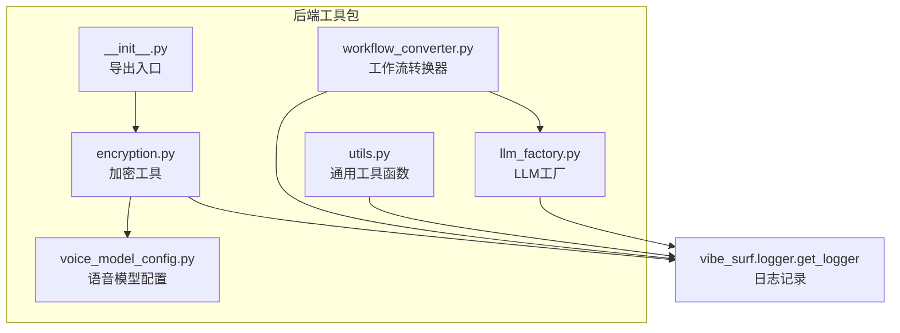
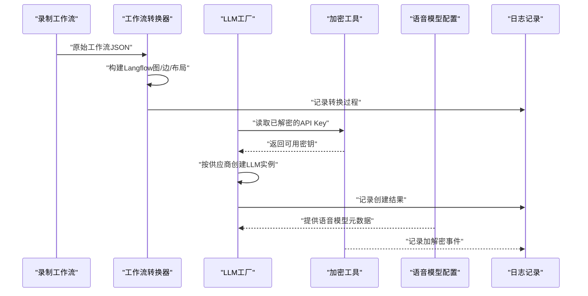
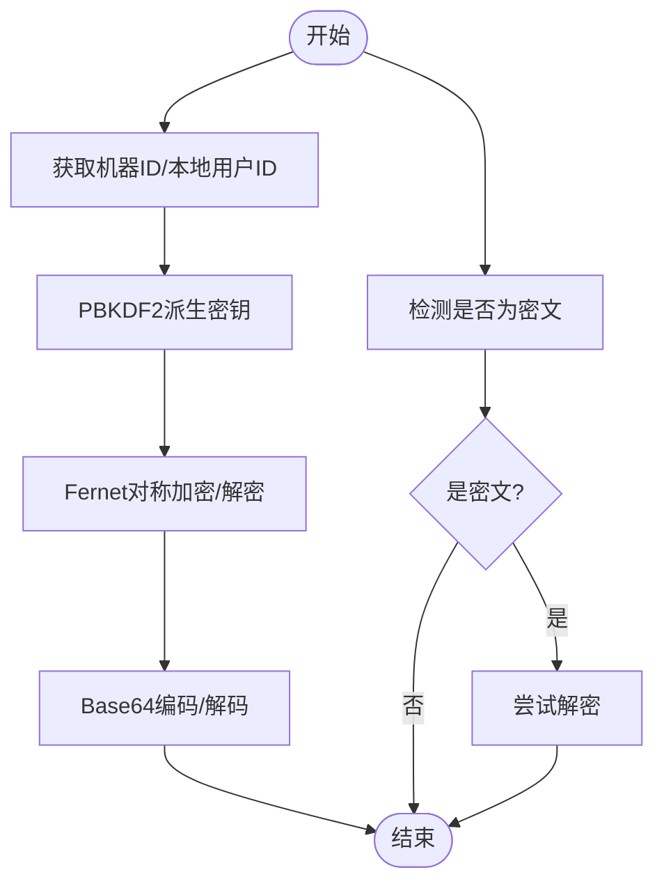
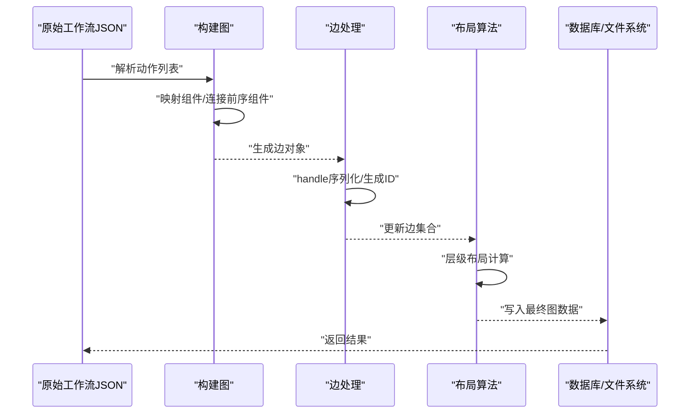
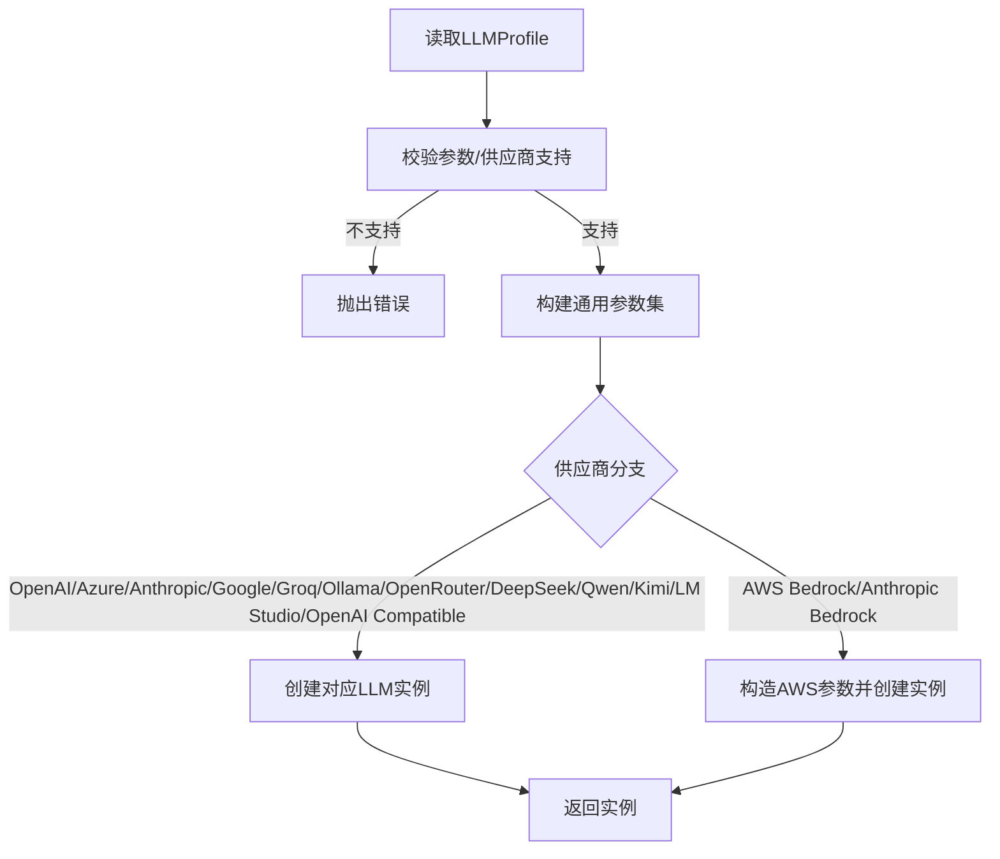
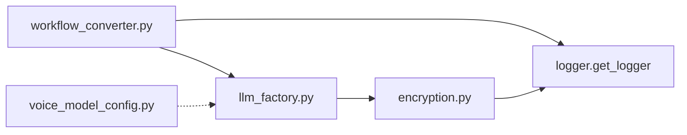

# 工具类服务

<cite>
**本文引用的文件**
- [encryption.py](file://vibe_surf/backend/utils/encryption.py)
- [workflow_converter.py](file://vibe_surf/backend/utils/workflow_converter.py)
- [utils.py](file://vibe_surf/backend/utils/utils.py)
- [voice_model_config.py](file://vibe_surf/backend/voice_model_config.py)
- [llm_factory.py](file://vibe_surf/backend/utils/llm_factory.py)
- [__init__.py](file://vibe_surf/backend/utils/__init__.py)
- [test_tools.py](file://tests/test_tools.py)
</cite>

## 目录
1. [简介](#简介)
2. [项目结构](#项目结构)
3. [核心组件](#核心组件)
4. [架构总览](#架构总览)
5. [详细组件分析](#详细组件分析)
6. [依赖关系分析](#依赖关系分析)
7. [性能考量](#性能考量)
8. [故障排查指南](#故障排查指南)
9. [结论](#结论)
10. [附录](#附录)

## 简介
本文件系统性梳理 VibeSurf 后端工具类服务，重点覆盖以下方面：
- 加密工具（Encryption）：敏感数据保护机制与密钥管理策略
- 工作流转换器（WorkflowConverter）：在录制工作流与 Langflow 格式之间的转换流程
- 通用工具函数：字符串处理、数据验证与类型转换等实用能力
- 语音模型配置：语音识别模型的集中化配置与加载应用
- 使用示例、安全注意事项与性能考量

## 项目结构
工具类服务主要位于后端 utils 包中，并与语言模型工厂、语音模型配置以及日志记录模块协同工作。下图展示工具类与相关模块的关系。

图表来源
- [encryption.py](file://vibe_surf/backend/utils/encryption.py#L1-L172)
- [workflow_converter.py](file://vibe_surf/backend/utils/workflow_converter.py#L1-L570)
- [utils.py](file://vibe_surf/backend/utils/utils.py#L1-L42)
- [llm_factory.py](file://vibe_surf/backend/utils/llm_factory.py#L1-L275)
- [voice_model_config.py](file://vibe_surf/backend/voice_model_config.py#L1-L25)
- [__init__.py](file://vibe_surf/backend/utils/__init__.py#L1-L7)

章节来源
- [__init__.py](file://vibe_surf/backend/utils/__init__.py#L1-L7)

## 核心组件
- 加密工具（Encryption）
  - 基于机器 MAC 地址或本地用户标识派生对称密钥，使用 Fernet 实现 API Key 的加解密
  - 提供密文检测与回退解密策略，确保在设备变更场景下的兼容性
- 工作流转换器（WorkflowConverter）
  - 将浏览器录制的工作流转换为 Langflow 图结构，生成边与布局信息，并可选保存到数据库
- 通用工具函数（Utils）
  - 自动读取系统代理设置并注入环境变量，便于网络访问
- 语音模型配置（Voice Model Config）
  - 集中式声明支持的语音识别模型及其元数据（是否需要 API Key、是否支持 base_url 等）
- LLM 工厂（LLM Factory）
  - 从配置档案动态创建不同供应商的 LLM 实例，统一参数校验与参数集构建

章节来源
- [encryption.py](file://vibe_surf/backend/utils/encryption.py#L1-L172)
- [workflow_converter.py](file://vibe_surf/backend/utils/workflow_converter.py#L1-L570)
- [utils.py](file://vibe_surf/backend/utils/utils.py#L1-L42)
- [voice_model_config.py](file://vibe_surf/backend/voice_model_config.py#L1-L25)
- [llm_factory.py](file://vibe_surf/backend/utils/llm_factory.py#L1-L275)

## 架构总览
下图展示工具类在系统中的交互路径：加密工具用于保护敏感配置；工作流转换器负责将录制工作流转换为 Langflow 可执行图；LLM 工厂根据配置创建 LLM 实例；语音模型配置为语音相关能力提供元数据。

图表来源
- [workflow_converter.py](file://vibe_surf/backend/utils/workflow_converter.py#L129-L171)
- [llm_factory.py](file://vibe_surf/backend/utils/llm_factory.py#L23-L216)
- [encryption.py](file://vibe_surf/backend/utils/encryption.py#L65-L127)
- [voice_model_config.py](file://vibe_surf/backend/voice_model_config.py#L1-L25)

## 详细组件分析

### 加密工具（Encryption）
- 密钥派生
  - 优先使用本机 MAC 地址作为机器标识；若不可用则回退到本地用户标识
  - 使用 PBKDF2-HMAC-SHA256 派生固定长度密钥，迭代次数较高以提升抗暴力破解能力
- API Key 加解密
  - 使用 Fernet 对称加密，输出为 URL 安全 Base64 编码
  - 支持回退解密：当主密钥失败时尝试使用本地用户标识派生的密钥
- 密文检测
  - 基于 Base64 解码与长度/字符特征判断是否为密文
- 安全要点
  - 密钥与设备绑定，更换设备需重新加密
  - 异常时抛出明确错误，避免静默失败
- 性能与复杂度
  - 派生与加解密均为 O(n) 时间复杂度，n 为输入长度
  - 迭代次数较高，建议仅在必要时调用

图表来源
- [encryption.py](file://vibe_surf/backend/utils/encryption.py#L23-L127)

章节来源
- [encryption.py](file://vibe_surf/backend/utils/encryption.py#L23-L172)

### 工作流转换器（WorkflowConverter）
- 功能概述
  - 将浏览器录制的工作流转换为 Langflow 兼容的图结构 JSON
  - 自动生成节点边、规范化边 handle 格式、计算层级布局
  - 可选保存到数据库并落盘
- 关键流程
  - 构建图：根据动作类型映射到具体组件（导航、点击、输入、滚动），并建立顺序连接
  - 边与布局：将边 handle 序列化为特殊字符串格式，生成唯一边 ID，并使用层级布局算法优化视觉效果
  - 数据库保存：生成最终图数据，创建超级用户并写入数据库，同时持久化到文件系统
- 错误处理
  - 记录未知动作类型并跳过
  - 边 handle 缺失时进行告警并跳过
  - 转换异常捕获并返回结构化错误信息

图表来源
- [workflow_converter.py](file://vibe_surf/backend/utils/workflow_converter.py#L30-L127)
- [workflow_converter.py](file://vibe_surf/backend/utils/workflow_converter.py#L129-L171)
- [workflow_converter.py](file://vibe_surf/backend/utils/workflow_converter.py#L173-L221)
- [workflow_converter.py](file://vibe_surf/backend/utils/workflow_converter.py#L238-L418)
- [workflow_converter.py](file://vibe_surf/backend/utils/workflow_converter.py#L420-L547)

章节来源
- [workflow_converter.py](file://vibe_surf/backend/utils/workflow_converter.py#L1-L570)

### 通用工具函数（Utils）
- 系统代理配置
  - 通过标准库读取系统代理设置，自动注入 HTTP_PROXY、HTTPS_PROXY 环境变量
  - 设置 no_proxy 列表，避免内部服务被代理影响
- 使用建议
  - 在网络请求前调用，确保代理一致性
  - 注意与平台代理系统的兼容性差异

章节来源
- [utils.py](file://vibe_surf/backend/utils/utils.py#L1-L42)

### 语音模型配置（Voice Model Config）
- 配置结构
  - 统一声明支持的语音识别模型（如 qwen-asr、openai-asr、gemini-asr）
  - 每个模型包含类型、是否需要 API Key、提供商、是否支持 base_url 等元数据
- 应用方式
  - 在语音相关服务中读取该字典，按模型名选择对应配置
  - 与加密工具结合，确保敏感凭据的安全存储与加载

章节来源
- [voice_model_config.py](file://vibe_surf/backend/voice_model_config.py#L1-L25)

### LLM 工厂（LLM Factory）
- 创建逻辑
  - 从 LLMProfile 中读取 provider、model、api_key、base_url 等字段
  - 基于供应商支持的参数集构建实例，处理温度、最大令牌数、频率惩罚等
  - 特定供应商（如 Azure OpenAI、Ollama、AWS Bedrock、OpenRouter、DeepSeek、Qwen、Kimi、LM Studio、OpenAI Compatible）有专门分支
- 参数校验
  - 校验必填项（provider、model、api_key 或 base_url，视供应商而定）
  - 返回所需/可选参数清单，便于前端或配置界面展示
- 安全与性能
  - api_key 应来自已解密的存储，避免明文泄露
  - 参数校验前置，减少无效初始化开销

图表来源
- [llm_factory.py](file://vibe_surf/backend/utils/llm_factory.py#L23-L216)
- [llm_factory.py](file://vibe_surf/backend/utils/llm_factory.py#L222-L275)

章节来源
- [llm_factory.py](file://vibe_surf/backend/utils/llm_factory.py#L1-L275)

## 依赖关系分析
- 模块内聚与耦合
  - 加密工具与日志模块耦合，用于记录错误与调试信息
  - 工作流转换器依赖 Langflow 图结构与浏览器工作流组件，耦合度中等
  - LLM 工厂依赖加密工具提供的已解密 API Key，耦合度高但职责清晰
  - 语音模型配置为纯数据配置，低耦合、高内聚
- 外部依赖
  - cryptography（Fernet、PBKDF2）、networkx（布局算法）、urllib（系统代理）
- 循环依赖
  - 当前未发现循环依赖迹象

图表来源
- [encryption.py](file://vibe_surf/backend/utils/encryption.py#L1-L172)
- [workflow_converter.py](file://vibe_surf/backend/utils/workflow_converter.py#L1-L570)
- [llm_factory.py](file://vibe_surf/backend/utils/llm_factory.py#L1-L275)
- [voice_model_config.py](file://vibe_surf/backend/voice_model_config.py#L1-L25)

章节来源
- [encryption.py](file://vibe_surf/backend/utils/encryption.py#L1-L172)
- [workflow_converter.py](file://vibe_surf/backend/utils/workflow_converter.py#L1-L570)
- [llm_factory.py](file://vibe_surf/backend/utils/llm_factory.py#L1-L275)
- [voice_model_config.py](file://vibe_surf/backend/voice_model_config.py#L1-L25)

## 性能考量
- 加密工具
  - PBKDF2 迭代次数较高，派生成本显著；建议缓存派生后的密钥或在批量操作中复用
  - Fernet 加解密为线性复杂度，适合小到中等文本
- 工作流转换器
  - 层级布局算法基于拓扑排序与交叉减少，时间复杂度受节点数与边数影响
  - 大规模工作流建议分批处理或异步执行，避免阻塞主线程
- LLM 工厂
  - 参数校验与实例创建为 O(1)，但供应商初始化可能涉及网络请求
  - 建议缓存已创建的 LLM 实例，减少重复初始化
- 通用工具函数
  - 系统代理读取为轻量操作，对性能影响可忽略

[本节为通用指导，无需列出章节来源]

## 故障排查指南
- 加密工具
  - 现象：解密失败
    - 排查：确认当前设备 MAC 是否可用；若不可用，检查本地用户标识文件是否存在且可读
    - 处理：在回退模式下使用本地用户标识派生密钥
  - 现象：密文检测误判
    - 排查：确认输入是否为 Base64 编码且长度满足条件
- 工作流转换器
  - 现象：未知动作类型被跳过
    - 处理：扩展动作映射或在上游修正动作类型
  - 现象：边 handle 缺失导致告警
    - 处理：检查上游数据源是否正确生成 handle 对象
  - 现象：保存数据库失败
    - 处理：查看日志异常栈，确认数据库会话与权限配置
- LLM 工厂
  - 现象：创建实例失败
    - 排查：核对 provider、model、api_key、base_url 是否满足供应商要求
    - 处理：根据参数清单补齐缺失项
- 通用工具函数
  - 现象：代理未生效
    - 排查：确认系统代理设置与环境变量注入是否成功

章节来源
- [encryption.py](file://vibe_surf/backend/utils/encryption.py#L65-L127)
- [workflow_converter.py](file://vibe_surf/backend/utils/workflow_converter.py#L110-L121)
- [workflow_converter.py](file://vibe_surf/backend/utils/workflow_converter.py#L173-L221)
- [workflow_converter.py](file://vibe_surf/backend/utils/workflow_converter.py#L420-L482)
- [llm_factory.py](file://vibe_surf/backend/utils/llm_factory.py#L222-L275)
- [utils.py](file://vibe_surf/backend/utils/utils.py#L8-L42)

## 结论
- 加密工具提供了设备绑定的密钥派生与 Fernet 对称加密，适合保护 API Key 等敏感数据
- 工作流转换器实现了从录制工作流到 Langflow 图结构的完整转换链路，具备边与布局优化
- 通用工具函数简化了系统代理配置，有助于网络访问的一致性
- 语音模型配置集中化管理，便于扩展新的语音识别能力
- LLM 工厂统一了多供应商 LLM 的创建与参数校验，提升了可维护性与安全性

[本节为总结，无需列出章节来源]

## 附录

### 使用示例与最佳实践
- 加密工具
  - 加密 API Key：先确保已正确派生密钥，再进行加密封装
  - 解密 API Key：优先使用设备密钥，失败时启用回退密钥
  - 密文检测：在入库前进行预检，避免非密文误判
- 工作流转换器
  - 转换流程：先转换为 Langflow JSON，再可选保存至数据库
  - 布局优化：对大规模工作流启用层级布局算法，提升可视化体验
  - 边处理：确保 handle 对象完整，避免边生成失败
- 通用工具函数
  - 在启动阶段调用系统代理配置，保证后续网络请求一致
- 语音模型配置
  - 在语音服务初始化时读取配置字典，按模型名选择对应元数据
- LLM 工厂
  - 在创建实例前完成参数校验，确保 provider 与模型支持
  - 对外部网络请求进行超时与重试策略设计

[本节为通用指导，无需列出章节来源]

### 安全注意事项
- 加密工具
  - 不要将明文 API Key 存储在日志或错误信息中
  - 更换设备后及时重新加密敏感数据
- 工作流转换器
  - 仅对可信来源的数据进行转换，防止恶意输入
  - 保存数据库前进行完整性校验
- LLM 工厂
  - 严格校验供应商参数，避免错误配置导致的凭据泄露
  - 对外部接口调用进行限流与熔断

[本节为通用指导，无需列出章节来源]