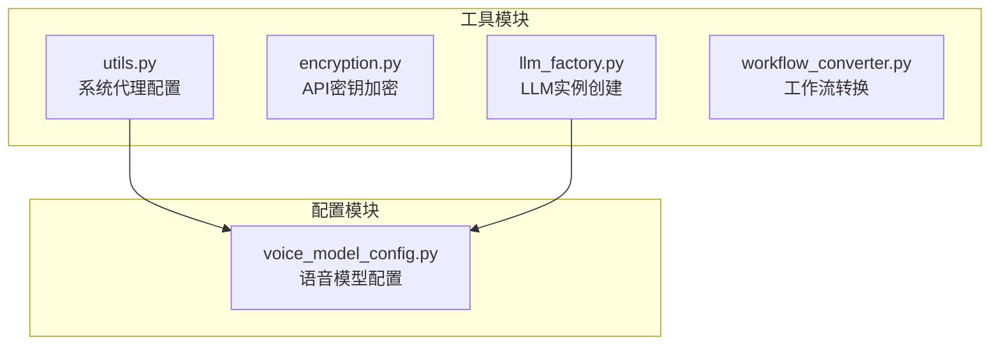
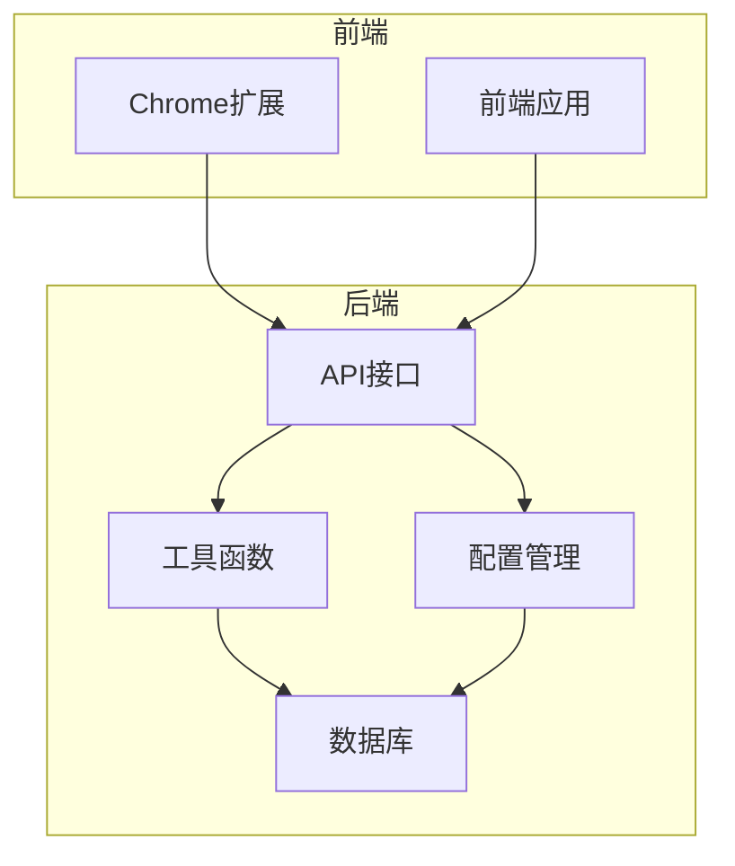
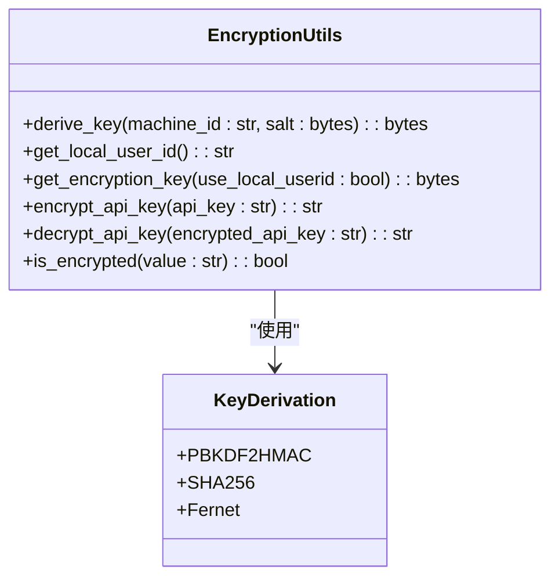
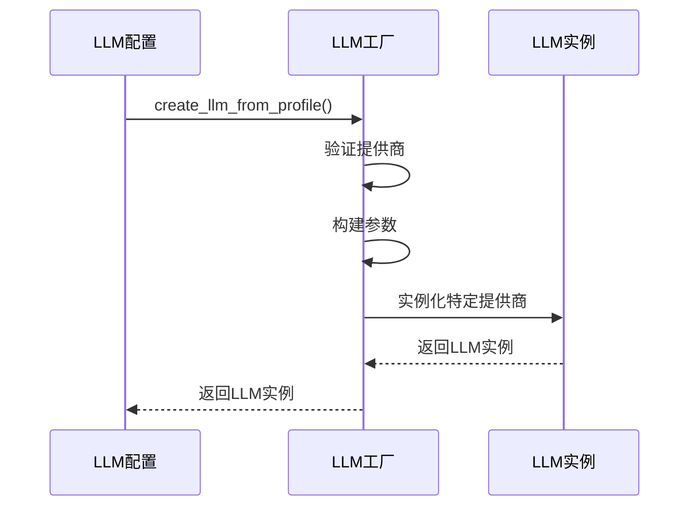
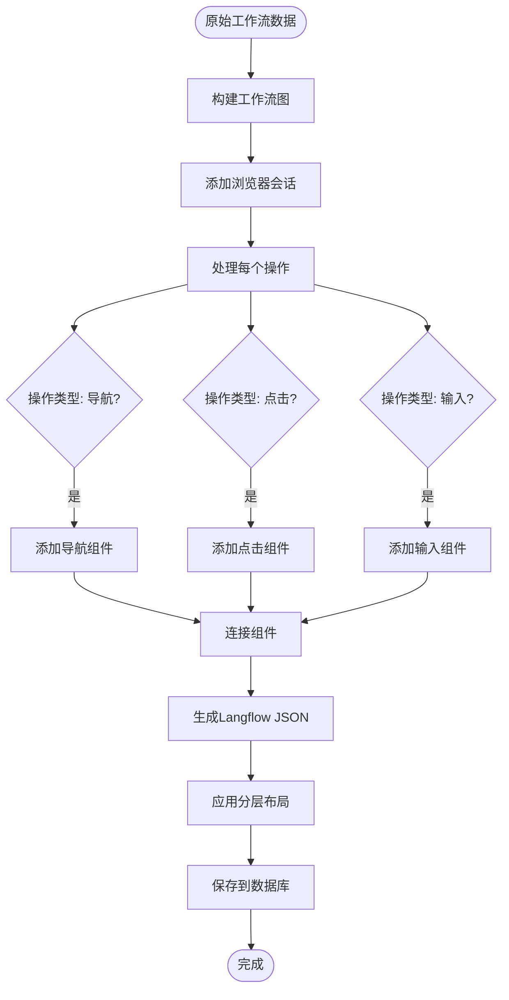
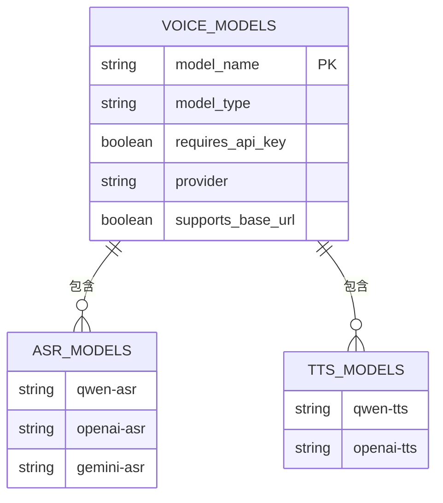
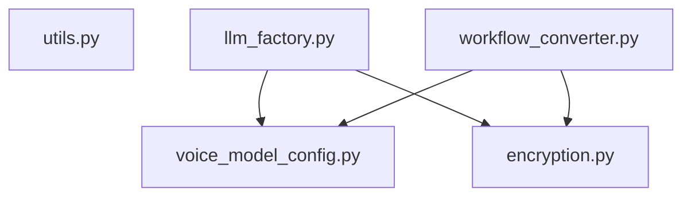

# 通用工具

<cite>
**本文档引用的文件**  
- [utils.py](file://vibe_surf/backend/utils/utils.py)
- [encryption.py](file://vibe_surf/backend/utils/encryption.py)
- [llm_factory.py](file://vibe_surf/backend/utils/llm_factory.py)
- [workflow_converter.py](file://vibe_surf/backend/utils/workflow_converter.py)
- [voice_model_config.py](file://vibe_surf/backend/voice_model_config.py)
- [stringManipulation.ts](file://vibe_surf/frontend/src/utils/stringManipulation.ts)
</cite>

## 目录
1. [引言](#引言)
2. [项目结构](#项目结构)
3. [核心组件](#核心组件)
4. [架构概述](#架构概述)
5. [详细组件分析](#详细组件分析)
6. [依赖分析](#依赖分析)
7. [性能考量](#性能考量)
8. [故障排除指南](#故障排除指南)
9. [结论](#结论)
10. [附录](#附录)（如有必要）

## 引言
本文档全面介绍了VibeSurf后端的通用工具函数和语音模型配置机制。重点分析了`utils.py`中提供的字符串处理、数据验证、类型转换等实用功能，以及`voice_model_config.py`中语音模型配置的加载、解析和应用机制。文档详细说明了各工具函数的参数、返回值定义和异常处理策略，同时提供了性能优化建议、内存使用考量和线程安全注意事项，并列举了典型使用场景和最佳实践模式。

## 项目结构
VibeSurf后端的工具函数主要位于`vibe_surf/backend/utils/`目录下，该目录包含多个模块化工具文件，每个文件负责特定的功能领域。语音模型的配置则集中定义在`vibe_surf/backend/voice_model_config.py`文件中。

**图源**  
- [utils.py](file://vibe_surf/backend/utils/utils.py#L1-L42)
- [voice_model_config.py](file://vibe_surf/backend/voice_model_config.py#L1-L25)

**本节来源**  
- [utils.py](file://vibe_surf/backend/utils/utils.py#L1-L42)
- [voice_model_config.py](file://vibe_surf/backend/voice_model_config.py#L1-L25)

## 核心组件
本文档的核心组件包括`utils.py`中的系统代理配置工具和`voice_model_config.py`中的语音模型配置。`utils.py`提供了`configure_system_proxies`函数，用于自动检测和配置系统代理，确保后端服务能够通过正确的网络路径访问外部API。`voice_model_config.py`则通过`VOICE_MODELS`字典集中管理所有支持的语音识别（ASR）模型，为语音功能提供统一的配置接口。

**本节来源**  
- [utils.py](file://vibe_surf/backend/utils/utils.py#L8-L42)
- [voice_model_config.py](file://vibe_surf/backend/voice_model_config.py#L8-L25)

## 架构概述
VibeSurf后端的工具函数和配置系统采用模块化设计，各组件职责分明，通过清晰的依赖关系协同工作。工具函数模块提供基础服务，如加密、代理配置和工作流转换；配置模块则为这些服务提供必要的参数和元数据。

**图源**  
- [utils.py](file://vibe_surf/backend/utils/utils.py#L1-L42)
- [voice_model_config.py](file://vibe_surf/backend/voice_model_config.py#L1-L25)

## 详细组件分析

### 工具函数分析
`vibe_surf/backend/utils/`目录下的工具函数为后端提供了关键的辅助功能。

#### 加密工具
`encryption.py`模块提供了基于机器MAC地址的API密钥加密功能，确保敏感信息的安全存储。

**图源**  
- [encryption.py](file://vibe_surf/backend/utils/encryption.py#L23-L147)

#### LLM工厂
`llm_factory.py`模块根据配置文件动态创建LLM实例，支持多种提供商。

**图源**  
- [llm_factory.py](file://vibe_surf/backend/utils/llm_factory.py#L23-L219)

#### 工作流转换器
`workflow_converter.py`模块将录制的工作流转换为Langflow兼容格式。

**图源**  
- [workflow_converter.py](file://vibe_surf/backend/utils/workflow_converter.py#L30-L126)

### 语音模型配置分析
`voice_model_config.py`文件定义了所有支持的语音模型，为语音识别功能提供配置基础。

**图源**  
- [voice_model_config.py](file://vibe_surf/backend/voice_model_config.py#L8-L25)

**本节来源**  
- [voice_model_config.py](file://vibe_surf/backend/voice_model_config.py#L1-L25)

## 依赖分析
VibeSurf后端的工具函数和配置模块之间存在清晰的依赖关系。`utils.py`中的代理配置功能独立运行，而`llm_factory.py`和`workflow_converter.py`则依赖于`voice_model_config.py`中的配置信息。加密模块`encryption.py`为其他模块提供安全服务，但本身不依赖其他工具模块。

**图源**  
- [utils.py](file://vibe_surf/backend/utils/utils.py#L1-L42)
- [encryption.py](file://vibe_surf/backend/utils/encryption.py#L1-L172)
- [llm_factory.py](file://vibe_surf/backend/utils/llm_factory.py#L1-L275)
- [workflow_converter.py](file://vibe_surf/backend/utils/workflow_converter.py#L1-L570)
- [voice_model_config.py](file://vibe_surf/backend/voice_model_config.py#L1-L25)

**本节来源**  
- [utils.py](file://vibe_surf/backend/utils/utils.py#L1-L42)
- [encryption.py](file://vibe_surf/backend/utils/encryption.py#L1-L172)
- [llm_factory.py](file://vibe_surf/backend/utils/llm_factory.py#L1-L275)
- [workflow_converter.py](file://vibe_surf/backend/utils/workflow_converter.py#L1-L570)
- [voice_model_config.py](file://vibe_surf/backend/voice_model_config.py#L1-L25)

## 性能考量
在使用这些工具函数时，应注意以下性能考量：
- **加密操作**：`encrypt_api_key`和`decrypt_api_key`函数使用PBKDF2算法，计算开销较大，建议在应用启动时缓存加密密钥。
- **代理配置**：`configure_system_proxies`函数在每次调用时都会查询系统代理，建议在应用初始化时调用一次并缓存结果。
- **工作流转换**：`convert_and_save_workflow`函数涉及文件I/O和数据库操作，属于I/O密集型任务，应使用异步方式调用以避免阻塞主线程。

## 故障排除指南
当遇到工具函数相关问题时，可参考以下指南进行排查：
- **代理配置失败**：检查系统是否设置了代理，或网络环境是否允许访问外部API。
- **API密钥解密失败**：确认当前机器的MAC地址与加密时的机器一致，或尝试使用本地用户ID作为回退方案。
- **LLM实例创建失败**：验证提供商、模型名称和API密钥是否正确，特别是对于需要`base_url`的提供商（如Azure OpenAI）。
- **工作流转换失败**：检查原始工作流JSON文件格式是否正确，以及数据库连接是否正常。

**本节来源**  
- [utils.py](file://vibe_surf/backend/utils/utils.py#L15-L21)
- [encryption.py](file://vibe_surf/backend/utils/encryption.py#L118-L126)
- [llm_factory.py](file://vibe_surf/backend/utils/llm_factory.py#L217-L219)
- [workflow_converter.py](file://vibe_surf/backend/utils/workflow_converter.py#L537-L546)

## 结论
VibeSurf后端的通用工具函数和配置系统设计合理，模块化程度高，为应用的核心功能提供了坚实的基础。通过深入理解这些工具的使用方法和实现细节，开发者可以更高效地利用这些功能，同时遵循最佳实践模式，确保应用的性能、安全性和可维护性。

## 附录
### 字符串处理函数参考
前端也提供了丰富的字符串处理工具，可供参考：

| 函数名 | 功能 | 示例 |
|-------|------|------|
| `toSnakeCase` | 转换为蛇形命名 | "hello world" → "hello_world" |
| `toCamelCase` | 转换为驼峰命名 | "hello_world" → "helloWorld" |
| `toPascalCase` | 转换为帕斯卡命名 | "hello_world" → "HelloWorld" |
| `toKebabCase` | 转换为短横线命名 | "hello world" → "hello-world" |
| `toSpaceCase` | 转换为空格分隔 | "hello_world" → "Hello World" |

**本节来源**  
- [stringManipulation.ts](file://vibe_surf/frontend/src/utils/stringManipulation.ts#L5-L45)