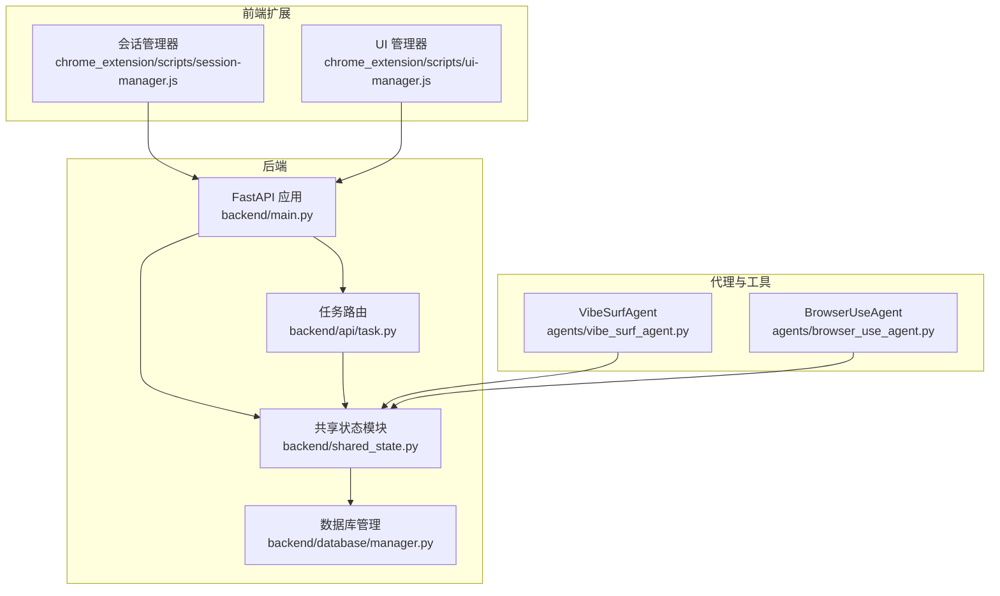
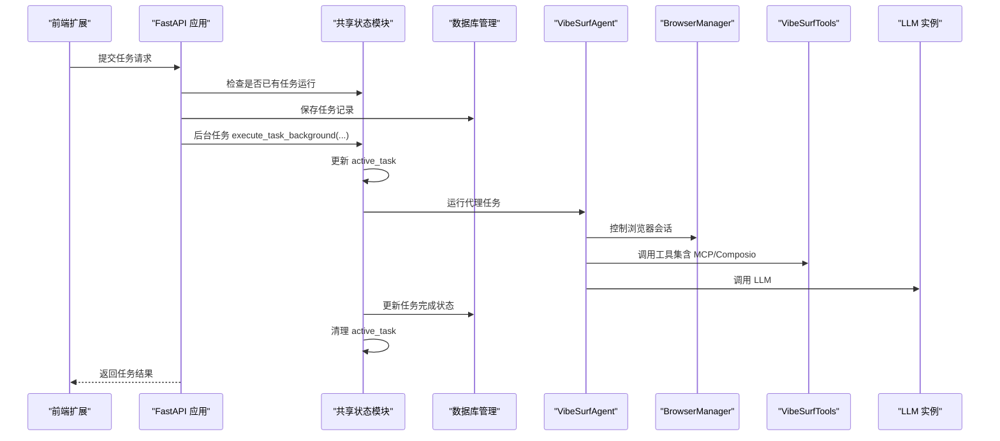
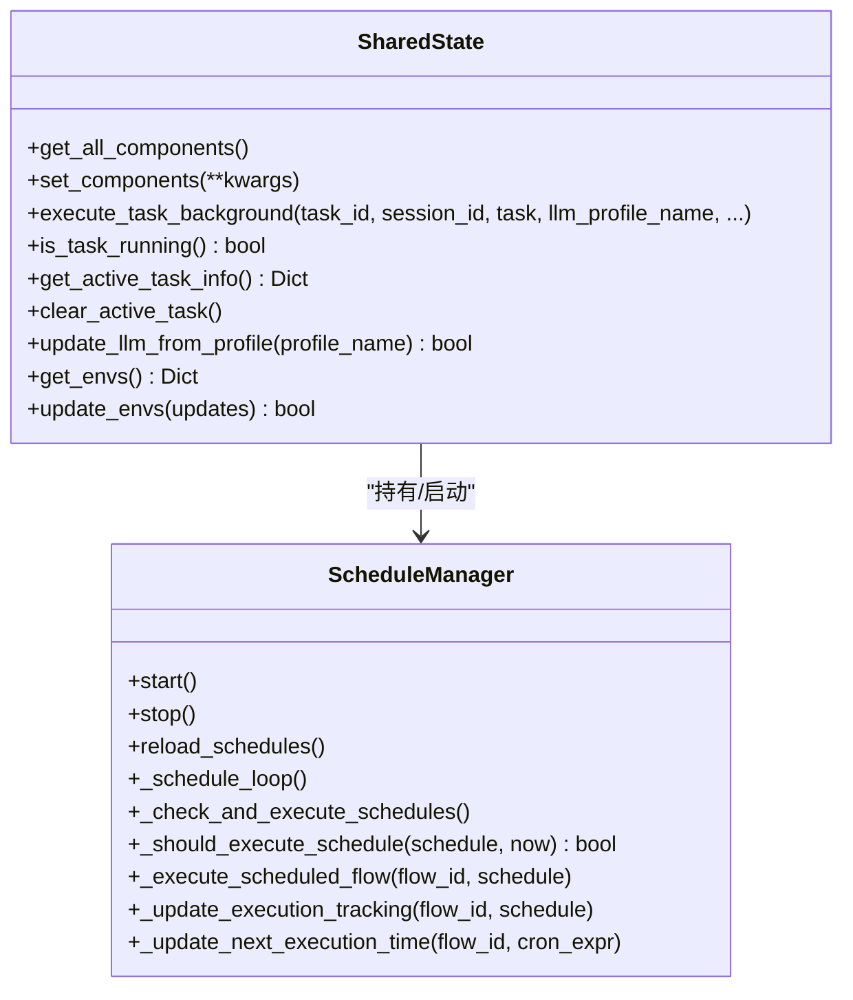
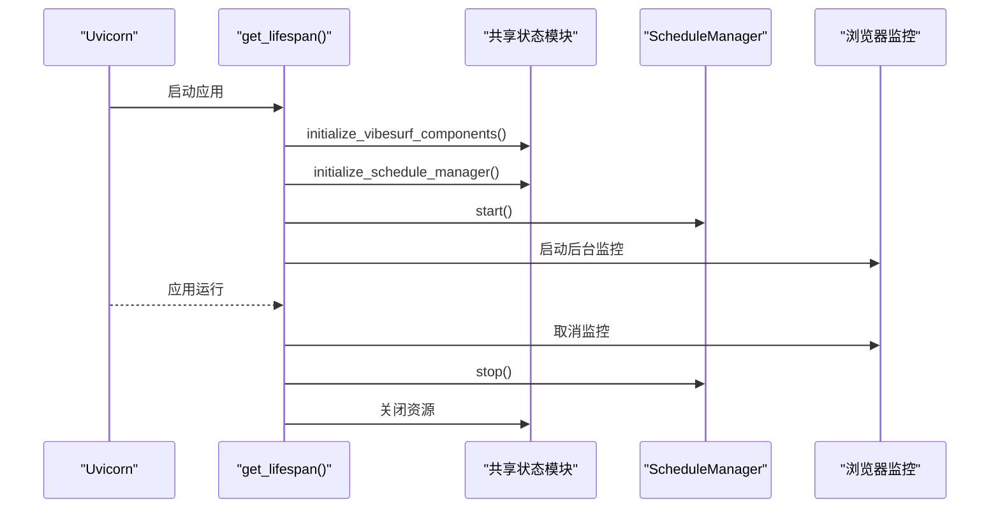
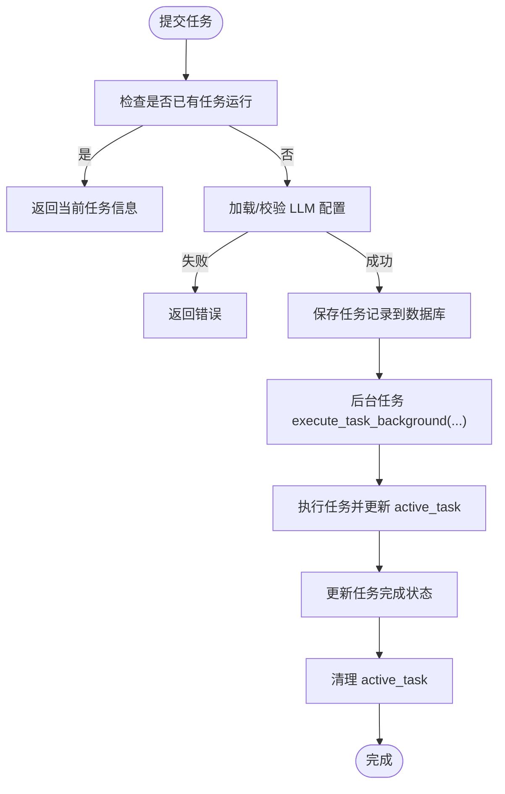
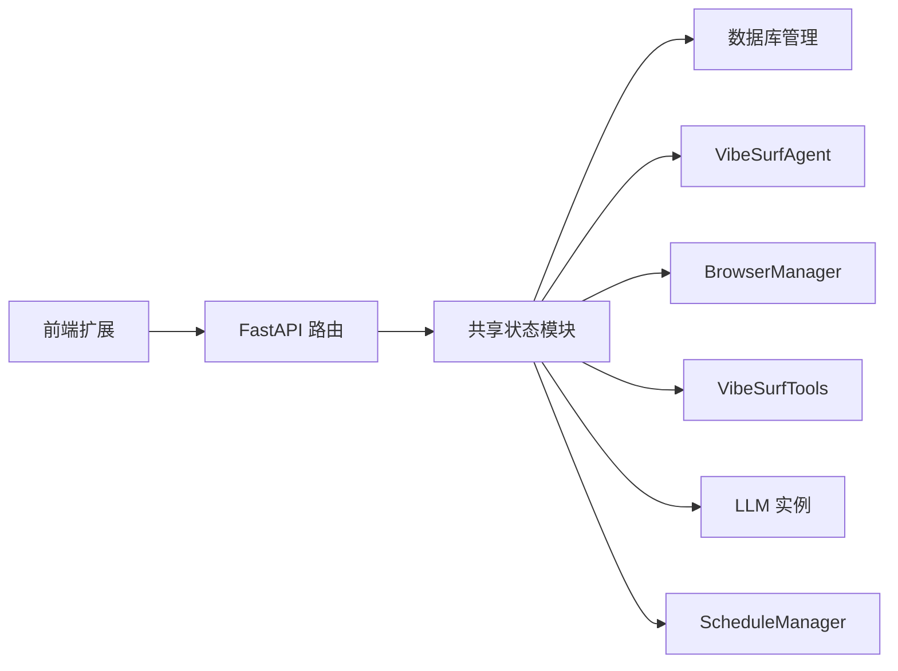

# 状态管理

<cite>
**本文引用的文件列表**
- [shared_state.py](file://vibe_surf/backend/shared_state.py)
- [main.py](file://vibe_surf/backend/main.py)
- [task.py](file://vibe_surf/backend/api/task.py)
- [manager.py](file://vibe_surf/backend/database/manager.py)
- [config.py](file://vibe_surf/backend/api/config.py)
- [browser_use_agent.py](file://vibe_surf/agents/browser_use_agent.py)
- [vibe_surf_agent.py](file://vibe_surf/agents/vibe_surf_agent.py)
- [session-manager.js](file://vibe_surf/chrome_extension/scripts/session-manager.js)
- [ui-manager.js](file://vibe_surf/chrome_extension/scripts/ui-manager.js)
- [service.py](file://vibe_surf/langflow/services/state/service.py)
</cite>

## 目录
1. [简介](#简介)
2. [项目结构](#项目结构)
3. [核心组件](#核心组件)
4. [架构总览](#架构总览)
5. [详细组件分析](#详细组件分析)
6. [依赖关系分析](#依赖关系分析)
7. [性能考量](#性能考量)
8. [故障排查指南](#故障排查指南)
9. [结论](#结论)
10. [附录](#附录)

## 简介
本文件系统性梳理 VibeSurf 后端的状态管理系统，重点围绕 vibe_surf/backend/shared_state.py 中的全局状态管理实现，解释其单例化设计、跨组件共享机制，以及与 FastAPI 后端、浏览器会话、LLM 调用之间的数据协同方式。文档还提供状态读写示例、线程安全与同步策略、任务调度、代理通信与会话保持的关键作用，并给出最佳实践与常见问题解决方案。

## 项目结构
- 全局状态集中于 backend/shared_state.py，包含全局组件（代理、浏览器、工具、LLM、数据库、环境变量、MCP 配置、计划任务）与任务执行控制。
- FastAPI 应用在 backend/main.py 中启动，通过生命周期钩子初始化全局组件并启动计划任务管理器。
- API 层（如 backend/api/task.py）通过共享状态进行任务提交、状态查询与控制。
- 前端扩展（chrome_extension）与后端通过会话 ID 协同，状态通过后端接口暴露与更新。

图表来源
- [main.py](file://vibe_surf/backend/main.py#L327-L482)
- [shared_state.py](file://vibe_surf/backend/shared_state.py#L1-L120)
- [task.py](file://vibe_surf/backend/api/task.py#L1-L120)
- [manager.py](file://vibe_surf/backend/database/manager.py#L148-L200)
- [session-manager.js](file://vibe_surf/chrome_extension/scripts/session-manager.js#L252-L283)
- [ui-manager.js](file://vibe_surf/chrome_extension/scripts/ui-manager.js#L571-L596)
- [vibe_surf_agent.py](file://vibe_surf/agents/vibe_surf_agent.py#L688-L1089)
- [browser_use_agent.py](file://vibe_surf/agents/browser_use_agent.py#L1-L120)

章节来源
- [main.py](file://vibe_surf/backend/main.py#L327-L482)
- [shared_state.py](file://vibe_surf/backend/shared_state.py#L1-L120)

## 核心组件
- 全局组件与状态
  - 组件：VibeSurfAgent、BrowserManager、VibeSurfTools、LLM 实例、DatabaseManager、Composio 实例、ScheduleManager
  - 环境变量：workspace_dir、browser_execution_path、browser_user_data、envs、active_mcp_server、current_llm_profile_name
  - 任务状态：active_task（当前任务运行信息）
- 初始化流程
  - initialize_vibesurf_components：从环境变量加载配置，初始化数据库、LLM、MCP 工具、Composio、浏览器会话与 VibeSurfAgent，并持久化 envs.json
  - initialize_schedule_manager：启动计划任务管理器
- 任务执行
  - execute_task_background：单任务后台执行，维护 active_task 生命周期，更新数据库任务记录
  - is_task_running/get_active_task_info/clear_active_task：任务状态查询与清理
- 环境变量管理
  - get_envs/update_envs：读取与更新 envs 字典，并同步到系统环境变量与 envs.json
- 计划任务管理
  - ScheduleManager：周期性检查并触发工作流执行，更新下一次执行时间与计数

章节来源
- [shared_state.py](file://vibe_surf/backend/shared_state.py#L37-L116)
- [shared_state.py](file://vibe_surf/backend/shared_state.py#L118-L233)
- [shared_state.py](file://vibe_surf/backend/shared_state.py#L235-L253)
- [shared_state.py](file://vibe_surf/backend/shared_state.py#L255-L386)
- [shared_state.py](file://vibe_surf/backend/shared_state.py#L388-L452)
- [shared_state.py](file://vibe_surf/backend/shared_state.py#L453-L602)
- [shared_state.py](file://vibe_surf/backend/shared_state.py#L604-L682)
- [shared_state.py](file://vibe_surf/backend/shared_state.py#L684-L712)
- [shared_state.py](file://vibe_surf/backend/shared_state.py#L740-L1111)

## 架构总览
共享状态模块作为后端的“中枢”，为 FastAPI 路由、代理执行、浏览器会话、LLM 调用与计划任务提供统一的数据入口。FastAPI 在启动时通过生命周期钩子初始化共享状态，并在关闭时进行资源回收。

图表来源
- [main.py](file://vibe_surf/backend/main.py#L327-L482)
- [task.py](file://vibe_surf/backend/api/task.py#L43-L152)
- [shared_state.py](file://vibe_surf/backend/shared_state.py#L118-L233)
- [vibe_surf_agent.py](file://vibe_surf/agents/vibe_surf_agent.py#L688-L1089)

## 详细组件分析

### 共享状态模块（shared_state.py）
- 设计要点
  - 全局变量集中管理：避免循环导入，统一对外提供 get/set 接口
  - 任务执行上下文：active_task 记录任务生命周期与结果
  - 动态配置同步：MCP 服务器与 Composio 工具配置按需更新
  - 计划任务：ScheduleManager 周期性检查并触发工作流
- 关键函数与职责
  - get_all_components/set_components：批量读取/更新全局组件
  - execute_task_background：单任务异步执行，维护 active_task 并持久化结果
  - is_task_running/get_active_task_info/clear_active_task：任务状态查询与清理
  - _check_and_update_mcp_servers/_check_and_update_composio_tools：动态更新工具配置
  - initialize_vibesurf_components：初始化数据库、LLM、浏览器、代理与工具
  - update_llm_from_profile：按配置切换 LLM 实例
  - get_envs/update_envs：环境变量字典读取与持久化
  - ScheduleManager：计划任务的加载、执行与跟踪

图表来源
- [shared_state.py](file://vibe_surf/backend/shared_state.py#L62-L116)
- [shared_state.py](file://vibe_surf/backend/shared_state.py#L118-L233)
- [shared_state.py](file://vibe_surf/backend/shared_state.py#L740-L1111)

章节来源
- [shared_state.py](file://vibe_surf/backend/shared_state.py#L62-L116)
- [shared_state.py](file://vibe_surf/backend/shared_state.py#L118-L233)
- [shared_state.py](file://vibe_surf/backend/shared_state.py#L235-L253)
- [shared_state.py](file://vibe_surf/backend/shared_state.py#L255-L386)
- [shared_state.py](file://vibe_surf/backend/shared_state.py#L388-L452)
- [shared_state.py](file://vibe_surf/backend/shared_state.py#L453-L602)
- [shared_state.py](file://vibe_surf/backend/shared_state.py#L604-L682)
- [shared_state.py](file://vibe_surf/backend/shared_state.py#L684-L712)
- [shared_state.py](file://vibe_surf/backend/shared_state.py#L740-L1111)

### FastAPI 后端集成（main.py）
- 生命周期
  - get_lifespan：应用启动时初始化 Langflow、共享状态、计划任务；关闭时清理资源
  - 浏览览监控：后台任务定期检查浏览器连接，异常时触发优雅退出
- 端点
  - /api/status：返回系统状态与当前任务信息
  - /generate-session-id：生成会话 ID
- 与共享状态的交互
  - 初始化 initialize_vibesurf_components 与 initialize_schedule_manager
  - 任务状态查询 get_active_task_info

图表来源
- [main.py](file://vibe_surf/backend/main.py#L327-L482)
- [shared_state.py](file://vibe_surf/backend/shared_state.py#L1083-L1111)

章节来源
- [main.py](file://vibe_surf/backend/main.py#L327-L482)
- [main.py](file://vibe_surf/backend/main.py#L660-L694)

### 任务路由与状态读写（task.py）
- 提交流程
  - 检查是否有任务正在运行
  - 获取并校验 LLM 配置，必要时测试连通性
  - 写入数据库任务记录
  - 后台任务 execute_task_background 执行
- 状态查询
  - /tasks/status：快速查询任务运行状态与活动任务信息
- 线程安全
  - 任务状态 active_task 为全局可变对象，API 层通过 is_task_running/get_active_task_info/clear_active_task 提供只读视图与清理能力

图表来源
- [task.py](file://vibe_surf/backend/api/task.py#L43-L152)
- [shared_state.py](file://vibe_surf/backend/shared_state.py#L118-L233)

章节来源
- [task.py](file://vibe_surf/backend/api/task.py#L1-L152)

### 数据库管理（manager.py）
- 异步引擎与会话工厂
  - 支持 SQLite/PostgreSQL/MySQL，SQLite 使用 StaticPool，生产环境使用连接池参数
- 迁移管理
  - DBMigrationManager：扫描迁移脚本、按版本号应用迁移、设置 user_version

章节来源
- [manager.py](file://vibe_surf/backend/database/manager.py#L148-L200)
- [manager.py](file://vibe_surf/backend/database/manager.py#L27-L146)

### 环境变量与配置管理（config.py）
- /api/config/environments：获取与更新环境变量
  - get_environments：返回当前 envs 字典
  - put/environments：过滤允许的键并更新 envs 与系统环境变量，同时持久化到 envs.json

章节来源
- [config.py](file://vibe_surf/backend/api/config.py#L690-L730)
- [shared_state.py](file://vibe_surf/backend/shared_state.py#L684-L712)

### 代理与浏览器会话（vibe_surf_agent.py、browser_use_agent.py）
- VibeSurfAgent
  - 维护 _control_lock、_running_agents、_execution_task 等控制状态
  - 与 BrowserManager 主会话协作，按任务信息创建/复用 CDP 会话
- BrowserUseAgent
  - 维护历史、文件系统、截图服务、令牌成本统计等
  - 与 TokenCost 服务注册 LLM，用于成本追踪

章节来源
- [vibe_surf_agent.py](file://vibe_surf/agents/vibe_surf_agent.py#L688-L1089)
- [browser_use_agent.py](file://vibe_surf/agents/browser_use_agent.py#L1-L120)

### 前端扩展与会话保持（session-manager.js、ui-manager.js）
- 会话管理
  - 提交任务前停止轮询，重置活动日志，与服务端日志同步
  - 通过 currentSession.id 与后端保持会话一致性
- 任务状态监控
  - 定期检查任务运行状态，根据变化更新 UI

章节来源
- [session-manager.js](file://vibe_surf/chrome_extension/scripts/session-manager.js#L252-L283)
- [ui-manager.js](file://vibe_surf/chrome_extension/scripts/ui-manager.js#L571-L596)

### 计划任务管理（ScheduleManager）
- 加载与缓存
  - reload_schedules：从数据库加载启用的计划，解析 cron 表达式，计算 next_execution_at 并更新本地缓存
- 执行与跟踪
  - _schedule_loop：每分钟检查一次
  - _should_execute_schedule：判断是否到达执行时间（含最小间隔限制）
  - _execute_scheduled_flow：向后端触发工作流执行，并更新执行次数与下次执行时间
- 生命周期
  - start/stop：启动/停止定时循环
  - initialize_schedule_manager/shutdown_schedule_manager：全局初始化与关闭

章节来源
- [shared_state.py](file://vibe_surf/backend/shared_state.py#L740-L1111)

## 依赖关系分析
- 组件耦合
  - FastAPI 依赖共享状态模块进行组件初始化与任务状态查询
  - 任务路由依赖共享状态的任务执行与数据库管理
  - 代理与浏览器会话依赖共享状态中的 LLM、工具与浏览器管理器
  - 计划任务依赖数据库模型与共享状态的数据库管理器
- 外部依赖
  - 数据库：SQLAlchemy 异步引擎与迁移管理
  - LLM：OpenAI 兼容客户端与令牌成本服务
  - 工具：MCP 与 Composio 工具集
  - 前端扩展：通过会话 ID 与后端协同

图表来源
- [main.py](file://vibe_surf/backend/main.py#L327-L482)
- [shared_state.py](file://vibe_surf/backend/shared_state.py#L1-L120)
- [manager.py](file://vibe_surf/backend/database/manager.py#L148-L200)
- [vibe_surf_agent.py](file://vibe_surf/agents/vibe_surf_agent.py#L688-L1089)

章节来源
- [main.py](file://vibe_surf/backend/main.py#L327-L482)
- [shared_state.py](file://vibe_surf/backend/shared_state.py#L1-L120)
- [manager.py](file://vibe_surf/backend/database/manager.py#L148-L200)

## 性能考量
- 异步执行
  - execute_task_background 与 ScheduleManager 的定时循环均采用 asyncio，避免阻塞事件循环
- 数据库访问
  - 使用异步引擎与会话工厂，SQLite 生产环境建议迁移到 PostgreSQL/MySQL 以提升并发能力
- 任务并发
  - FastAPI 路由层通过 is_task_running 保证单任务串行执行，避免资源竞争
- 缓存与配置
  - MCP 与 Composio 工具配置按需更新，减少不必要的重新注册开销

[本节为通用指导，不直接分析具体文件]

## 故障排查指南
- 任务无法提交
  - 现象：返回“已有任务运行”
  - 排查：调用 /api/tasks/status 查看 active_task；若异常卡住，调用 clear_active_task 清理
- LLM 连接失败
  - 现象：提交任务时报错“llm_connection_failed”
  - 排查：确认 LLM 配置正确；使用 _ensure_llm_initialized 测试连通性；必要时调用 update_llm_from_profile 切换配置
- 浏览器连接中断
  - 现象：后台监控检测到无可用浏览器，触发优雅退出
  - 排查：检查浏览器可执行路径与用户数据目录；确认扩展与后端 URL 配置一致
- 计划任务未执行
  - 现象：cron 表达式有效但未触发
  - 排查：查看 ScheduleManager 的 reload_schedules 与 _should_execute_schedule 判断逻辑；确认数据库中 enabled 且 cron_expression 正确
- 环境变量未生效
  - 现象：更新后系统环境变量未变更
  - 排查：确认 update_envs 成功写入 envs.json 并同步到 os.environ；重启相关服务使新变量生效

章节来源
- [task.py](file://vibe_surf/backend/api/task.py#L43-L152)
- [shared_state.py](file://vibe_surf/backend/shared_state.py#L118-L233)
- [shared_state.py](file://vibe_surf/backend/shared_state.py#L235-L253)
- [shared_state.py](file://vibe_surf/backend/shared_state.py#L604-L682)
- [shared_state.py](file://vibe_surf/backend/shared_state.py#L684-L712)
- [main.py](file://vibe_surf/backend/main.py#L103-L148)
- [shared_state.py](file://vibe_surf/backend/shared_state.py#L740-L1111)

## 结论
共享状态模块通过集中化的全局变量与异步任务执行，实现了 FastAPI 后端、代理、浏览器、LLM 与计划任务之间的高效协同。其设计兼顾了易用性与可维护性，通过明确的初始化与清理流程、任务状态控制与动态配置更新，确保系统在复杂场景下的稳定性与一致性。建议在生产环境中进一步优化数据库与缓存策略，并完善异常处理与可观测性。

[本节为总结性内容，不直接分析具体文件]

## 附录

### 状态读写操作示例（路径指引）
- 读取所有组件
  - 路径：[get_all_components](file://vibe_surf/backend/shared_state.py#L62-L82)
- 更新组件
  - 路径：[set_components](file://vibe_surf/backend/shared_state.py#L85-L117)
- 提交任务（后端）
  - 路径：[submit_task](file://vibe_surf/backend/api/task.py#L43-L152)
- 查询任务状态
  - 路径：[check_task_status](file://vibe_surf/backend/api/task.py#L34-L41)、[/api/status](file://vibe_surf/backend/main.py#L671-L694)
- 清理活动任务
  - 路径：[clear_active_task](file://vibe_surf/backend/shared_state.py#L249-L253)
- 更新 LLM 配置
  - 路径：[update_llm_from_profile](file://vibe_surf/backend/shared_state.py#L644-L682)
- 读取/更新环境变量
  - 路径：[get_envs](file://vibe_surf/backend/shared_state.py#L684-L688)、[update_envs](file://vibe_surf/backend/shared_state.py#L690-L712)
  - API：[/api/config/environments](file://vibe_surf/backend/api/config.py#L690-L730)

### 线程安全与同步策略
- 全局可变对象
  - active_task 为全局可变字典，API 层通过 is_task_running/get_active_task_info/clear_active_task 提供只读视图与清理，避免直接修改
- 异步并发
  - execute_task_background 与 ScheduleManager 使用 asyncio 任务，避免阻塞
- 令牌成本服务
  - 通过 TokenCost 服务注册 LLM，确保成本统计一致性

章节来源
- [shared_state.py](file://vibe_surf/backend/shared_state.py#L235-L253)
- [shared_state.py](file://vibe_surf/backend/shared_state.py#L118-L233)
- [browser_use_agent.py](file://vibe_surf/agents/browser_use_agent.py#L1-L120)

### 最佳实践
- 任务提交前先检查任务状态，避免并发冲突
- 使用 update_llm_from_profile 切换 LLM 配置时，确保数据库连接可用
- 更新环境变量后，重启相关服务以确保新变量生效
- 计划任务 cron 表达式应考虑时区与最小执行间隔，避免频繁触发
- 前端扩展与后端 URL 保持一致，避免连接失败

[本节为通用指导，不直接分析具体文件]