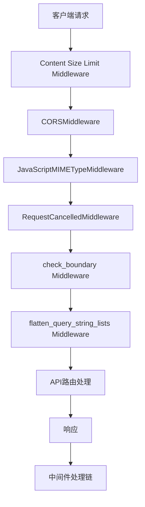
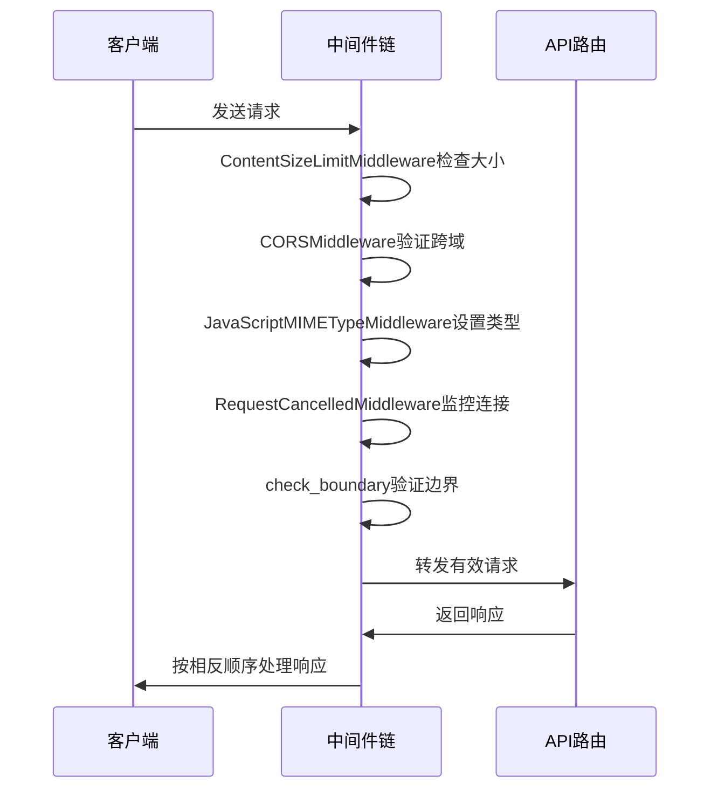

# 中间件

<cite>
**本文档引用的文件**   
- [middleware.py](file://vibe_surf/langflow/middleware.py)
- [main.py](file://vibe_surf/backend/main.py)
- [logger.py](file://vibe_surf/langflow/logging/logger.py)
- [settings.py](file://vibe_surf/langflow/settings.py)
</cite>

## 目录
1. [介绍](#介绍)
2. [中间件架构概述](#中间件架构概述)
3. [核心中间件组件分析](#核心中间件组件分析)
4. [请求处理管道中的执行顺序](#请求处理管道中的执行顺序)
5. [自定义中间件开发与集成](#自定义中间件开发与集成)
6. [安全性、性能和可观测性增强](#安全性性能和可观测性增强)
7. [配置最佳实践与常见问题解决方案](#配置最佳实践与常见问题解决方案)
8. [结论](#结论)

## 介绍
VibeSurf中间件系统为后端API提供了关键的基础设施功能，包括请求日志记录、身份验证、CORS处理、错误处理和文件大小限制等功能。这些中间件组件在请求处理管道中按特定顺序执行，确保了系统的安全性、性能和可观测性。中间件架构基于FastAPI框架构建，利用ASGI中间件模式实现请求和响应的预处理与后处理。

**Section sources**
- [main.py](file://vibe_surf/backend/main.py#L1-L794)

## 中间件架构概述
VibeSurf的中间件架构采用分层设计，将不同功能的中间件按职责分离。主要中间件组件包括内容大小限制中间件、CORS处理中间件、JavaScript MIME类型中间件、请求取消中间件和边界检查中间件。这些中间件通过FastAPI的add_middleware方法注册，形成一个处理链。每个中间件负责特定的横切关注点，如安全、性能或日志记录，而不会干扰核心业务逻辑。

**Diagram sources**
- [middleware.py](file://vibe_surf/langflow/middleware.py#L13-L60)
- [main.py](file://vibe_surf/backend/main.py#L562-L576)

## 核心中间件组件分析
### 内容大小限制中间件
内容大小限制中间件（ContentSizeLimitMiddleware）用于防止过大的文件上传请求。该中间件通过监控请求体的累积大小来实施限制，当超过配置的最大文件大小时抛出MaxFileSizeException异常。中间件从设置服务中动态获取最大文件大小配置，支持运行时调整。

**Section sources**
- [middleware.py](file://vibe_surf/langflow/middleware.py#L13-L60)

### CORS处理中间件
CORS（跨域资源共享）中间件配置了跨域请求的安全策略。系统默认允许所有来源的请求，但在未来版本中将变得更加严格。中间件配置包括允许的来源、凭据、方法和头部，确保前端应用能够安全地与后端API通信。

**Section sources**
- [main.py](file://vibe_surf/backend/main.py#L567-L575)

### JavaScript MIME类型中间件
JavaScript MIME类型中间件确保JavaScript文件响应具有正确的Content-Type头部。该中间件在响应发送前检查请求路径和状态码，对于以.js结尾的路径且状态码为200的响应，将其Content-Type设置为text/javascript。

**Section sources**
- [main.py](file://vibe_surf/backend/main.py#L521-L540)

### 请求取消中间件
请求取消中间件处理客户端提前断开连接的情况。通过监控请求的连接状态，当中断发生时返回499状态码（客户端已关闭请求），避免服务器继续处理无效请求，提高资源利用率。

**Section sources**
- [main.py](file://vibe_surf/langflow/main.py#L64-L87)

### 边界检查中间件
边界检查中间件验证文件上传请求的Content-Type头部是否包含有效的boundary参数。该中间件确保multipart/form-data请求格式正确，防止格式错误的上传请求。

**Section sources**
- [main.py](file://vibe_surf/backend/main.py#L592-L625)

## 请求处理管道中的执行顺序
中间件在请求处理管道中按注册顺序执行。当请求到达时，首先经过内容大小限制中间件，然后依次通过CORS中间件、JavaScript MIME类型中间件、请求取消中间件和边界检查中间件。这种顺序设计确保了安全性和性能相关的检查在早期阶段完成，避免不必要的处理开销。响应则按相反顺序通过中间件链返回给客户端。

**Diagram sources**
- [main.py](file://vibe_surf/backend/main.py#L562-L576)

## 自定义中间件开发与集成
开发自定义中间件需要继承BaseHTTPMiddleware类并实现dispatch方法。新中间件应遵循单一职责原则，专注于特定功能。集成时通过app.add_middleware()方法注册，注意中间件的执行顺序会影响其行为。例如，日志记录中间件通常放在链的末尾以捕获完整的处理信息，而安全检查中间件则放在前面以尽早拦截恶意请求。

**Section sources**
- [main.py](file://vibe_surf/backend/main.py#L521-L540)

## 安全性、性能和可观测性增强
中间件系统显著增强了API的安全性、性能和可观测性。通过CORS配置和内容大小限制，系统防御了常见的Web攻击。请求取消机制提高了服务器资源利用率。日志记录中间件提供详细的请求处理信息，便于问题排查和性能分析。这些功能共同构建了一个健壮、安全且易于维护的API服务。

**Section sources**
- [logger.py](file://vibe_surf/langflow/logging/logger.py#L1-L408)

## 配置最佳实践与常见问题解决方案
配置中间件时，应根据部署环境调整设置。生产环境应指定确切的CORS来源而非使用通配符，提高安全性。文件大小限制应根据实际需求设置，平衡用户体验和服务器资源。常见问题包括CORS错误、文件上传失败和响应类型错误，可通过检查中间件配置和日志来解决。

**Section sources**
- [settings.py](file://vibe_surf/langflow/settings.py#L1-L13)

## 结论
VibeSurf的中间件系统通过模块化设计提供了强大的基础设施功能。各中间件组件协同工作，确保了API的安全性、性能和可观测性。通过合理的配置和扩展，该系统能够满足各种部署需求，为用户提供稳定可靠的服务。