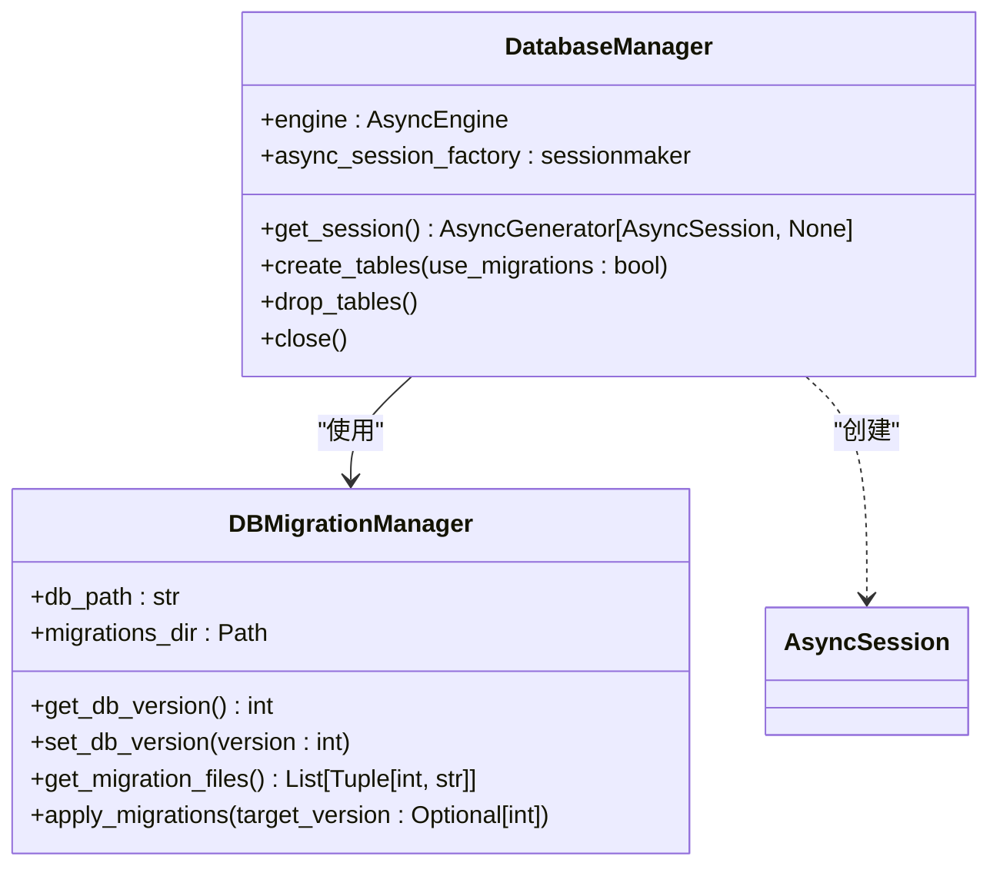

# 后端架构

<cite>
**本文档引用的文件**   
- [main.py](file://vibe_surf/backend/main.py)
- [shared_state.py](file://vibe_surf/backend/shared_state.py)
- [task.py](file://vibe_surf/backend/api/task.py)
- [composio.py](file://vibe_surf/backend/api/composio.py)
- [browser.py](file://vibe_surf/backend/api/browser.py)
- [config.py](file://vibe_surf/backend/api/config.py)
- [models.py](file://vibe_surf/backend/api/models.py)
- [manager.py](file://vibe_surf/backend/database/manager.py)
- [models.py](file://vibe_surf/backend/database/models.py)
- [queries.py](file://vibe_surf/backend/database/queries.py)
- [llm_factory.py](file://vibe_surf/backend/utils/llm_factory.py)
- [encryption.py](file://vibe_surf/backend/utils/encryption.py)
- [utils.py](file://vibe_surf/backend/utils/utils.py)
- [llm_config.py](file://vibe_surf/backend/llm_config.py)
- [voice_model_config.py](file://vibe_surf/backend/voice_model_config.py)
</cite>

## 目录
1. [项目结构](#项目结构)
2. [核心组件](#核心组件)
3. [API端点组织](#api端点组织)
4. [业务逻辑层实现](#业务逻辑层实现)
5. [数据库访问模式](#数据库访问模式)
6. [中间件配置](#中间件配置)
7. [代理系统协调](#代理系统协调)
8. [浏览器管理](#浏览器管理)
9. [LLM调用机制](#llm调用机制)
10. [模块化设计](#模块化设计)
11. [并发请求处理](#并发请求处理)
12. [数据库会话管理](#数据库会话管理)
13. [安全认证机制](#安全认证机制)
14. [性能优化策略](#性能优化策略)
15. [错误处理策略](#错误处理策略)

## 项目结构

VibeSurf后端采用模块化设计，主要目录包括api、database、utils等。api目录包含所有API路由，database目录负责数据库操作，utils目录提供工具函数。后端基于FastAPI框架，实现了单任务执行模型与Langflow集成。


**目录来源**
- [vibe_surf/backend/](file://vibe_surf/backend/)

## 核心组件

后端核心组件包括FastAPI应用、共享状态管理、数据库管理器和各种工具。通过shared_state.py实现全局状态共享，避免循环导入问题。main.py负责应用初始化和生命周期管理。

**核心组件来源**
- [main.py](file://vibe_surf/backend/main.py#L1-L794)
- [shared_state.py](file://vibe_surf/backend/shared_state.py#L1-L800)

## API端点组织

后端API端点按功能组织，每个功能模块有独立的路由文件。所有路由通过main.py统一注册，前缀为/api。

```mermaid
graph TD
api[API端点]
api --> tasks[tasks]
api --> files[files]
api --> activity[activity]
api --> config[config]
api --> browser[browser]
api --> voices[voices]
api --> agent[agent]
api --> composio[composio]
api --> schedule[schedule]
api --> vibesurf[vibesurf]
tasks --> submit[POST /submit]
tasks --> status[GET /status]
tasks --> pause[POST /pause]
tasks --> resume[POST /resume]
tasks --> stop[POST /stop]
browser --> active_tab[GET /active-tab]
browser --> all_tabs[GET /all-tabs]
composio --> status[GET /status]
composio --> verify-key[POST /verify-key]
composio --> toolkits[GET /toolkits]
composio --> toggle[POST /toolkit/{slug}/toggle]
```

**API端点来源**
- [main.py](file://vibe_surf/backend/main.py#L38-L47)
- [task.py](file://vibe_surf/backend/api/task.py)
- [browser.py](file://vibe_surf/backend/api/browser.py)
- [composio.py](file://vibe_surf/backend/api/composio.py)

## 业务逻辑层实现

业务逻辑主要在API路由处理函数中实现，通过依赖注入获取数据库会话。业务逻辑包括任务管理、浏览器操作、Composio集成等。


**业务逻辑来源**
- [task.py](file://vibe_surf/backend/api/task.py)
- [composio.py](file://vibe_surf/backend/api/composio.py)
- [browser.py](file://vibe_surf/backend/api/browser.py)

## 数据库访问模式

后端使用SQLAlchemy异步API进行数据库操作，采用Repository模式封装数据访问逻辑。数据库管理器负责连接池和会话管理。



**数据库访问来源**
- [manager.py](file://vibe_surf/backend/database/manager.py)
- [queries.py](file://vibe_surf/backend/database/queries.py)

## 中间件配置

后端配置了多种中间件，包括CORS、内容大小限制、JavaScript MIME类型处理等。这些中间件在应用启动时注册。


**中间件来源**
- [main.py](file://vibe_surf/backend/main.py#L562-L576)

## 代理系统协调

后端通过VibeSurfAgent协调代理系统，处理任务的执行、暂停、恢复和停止。代理状态通过共享状态管理。


**代理系统来源**
- [task.py](file://vibe_surf/backend/api/task.py)
- [shared_state.py](file://vibe_surf/backend/shared_state.py)

## 浏览器管理

后端通过BrowserManager管理浏览器实例，提供获取活动标签和所有标签的API端点。浏览器管理器确保浏览器连接的稳定性。


**浏览器管理来源**
- [browser.py](file://vibe_surf/backend/api/browser.py)
- [shared_state.py](file://vibe_surf/backend/shared_state.py)

## LLM调用机制

后端通过LLM配置文件和工厂模式管理不同LLM提供商的调用。支持多种LLM提供商，包括OpenAI、Anthropic、Google等。


**LLM调用来源**
- [llm_factory.py](file://vibe_surf/backend/utils/llm_factory.py)
- [llm_config.py](file://vibe_surf/backend/llm_config.py)
- [queries.py](file://vibe_surf/backend/database/queries.py)

## 模块化设计

后端采用清晰的模块化设计，各目录职责分明。api目录处理HTTP请求，database目录管理数据持久化，utils目录提供通用工具。


**模块化设计来源**
- [vibe_surf/backend/](file://vibe_surf/backend/)
- [api/](file://vibe_surf/backend/api/)
- [database/](file://vibe_surf/backend/database/)
- [utils/](file://vibe_surf/backend/utils/)

## 并发请求处理

后端使用FastAPI的异步特性处理并发请求。通过BackgroundTasks处理耗时操作，避免阻塞主线程。


**并发处理来源**
- [main.py](file://vibe_surf/backend/main.py)
- [task.py](file://vibe_surf/backend/api/task.py)

## 数据库会话管理

后端使用依赖注入管理数据库会话，确保每个请求都有独立的会话。会话在请求结束时自动提交或回滚。


**数据库会话来源**
- [manager.py](file://vibe_surf/backend/database/manager.py#L229-L240)
- [main.py](file://vibe_surf/backend/main.py#L277)

## 安全认证机制

后端通过环境变量和加密存储管理API密钥。使用MAC地址派生密钥对敏感数据进行加密。


**安全认证来源**
- [encryption.py](file://vibe_surf/backend/utils/encryption.py)
- [queries.py](file://vibe_surf/backend/database/queries.py)

## 性能优化策略

后端采用多种性能优化策略，包括连接池、异步I/O、缓存等。数据库操作使用异步API，避免阻塞。


**性能优化来源**
- [manager.py](file://vibe_surf/backend/database/manager.py)
- [main.py](file://vibe_surf/backend/main.py)

## 错误处理策略

后端采用分层错误处理策略，包括输入验证、异常捕获、日志记录等。确保系统稳定性和可维护性。


**错误处理来源**
- [main.py](file://vibe_surf/backend/main.py#L696-L724)
- [task.py](file://vibe_surf/backend/api/task.py)
- [composio.py](file://vibe_surf/backend/api/composio.py)