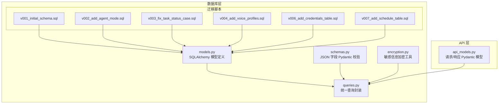
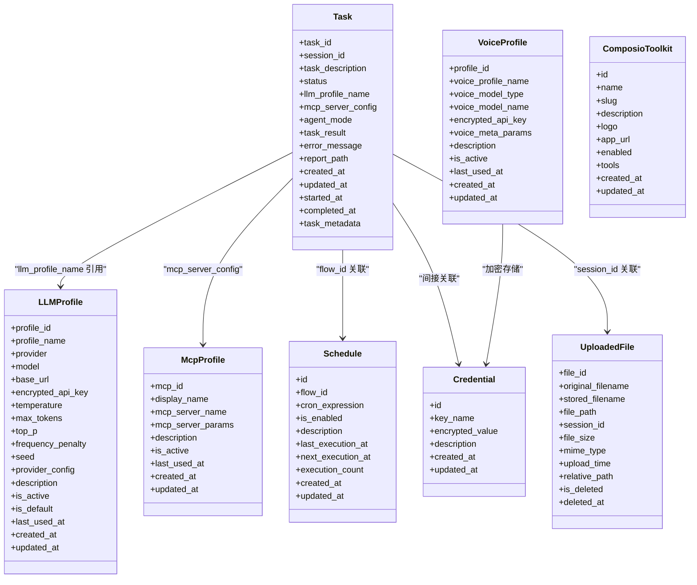
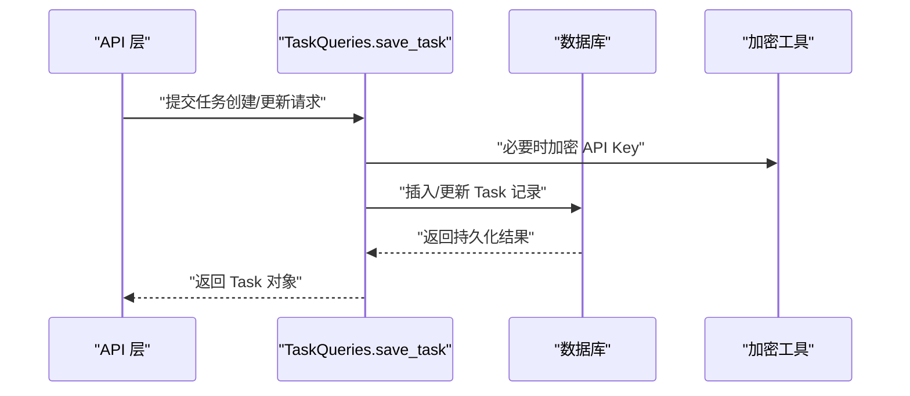
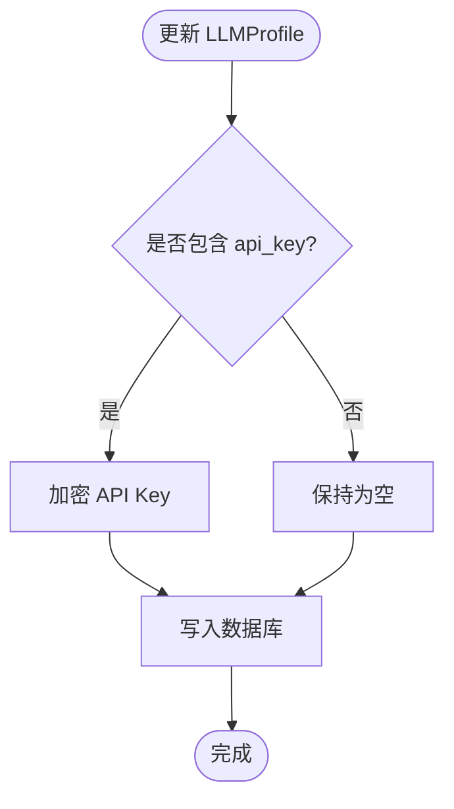
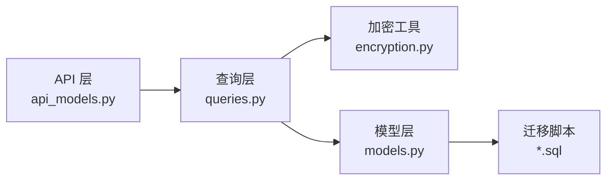

# ORM模型

<cite>
**本文引用的文件**
- [models.py](file://vibe_surf/backend/database/models.py)
- [schemas.py](file://vibe_surf/backend/database/schemas.py)
- [queries.py](file://vibe_surf/backend/database/queries.py)
- [encryption.py](file://vibe_surf/backend/utils/encryption.py)
- [v001_initial_schema.sql](file://vibe_surf/backend/database/migrations/v001_initial_schema.sql)
- [v002_add_agent_mode.sql](file://vibe_surf/backend/database/migrations/v002_add_agent_mode.sql)
- [v003_fix_task_status_case.sql](file://vibe_surf/backend/database/migrations/v003_fix_task_status_case.sql)
- [v004_add_voice_profiles.sql](file://vibe_surf/backend/database/migrations/v004_add_voice_profiles.sql)
- [v006_add_credentials_table.sql](file://vibe_surf/backend/database/migrations/v006_add_credentials_table.sql)
- [v007_add_schedule_table.sql](file://vibe_surf/backend/database/migrations/v007_add_schedule_table.sql)
- [api_models.py](file://vibe_surf/backend/api/models.py)
</cite>

## 目录
1. [简介](#简介)
2. [项目结构](#项目结构)
3. [核心组件](#核心组件)
4. [架构总览](#架构总览)
5. [详细组件分析](#详细组件分析)
6. [依赖关系分析](#依赖关系分析)
7. [性能考量](#性能考量)
8. [故障排查指南](#故障排查指南)
9. [结论](#结论)
10. [附录：使用示例与最佳实践](#附录使用示例与最佳实践)

## 简介
本文件系统性梳理 VibeSurf 后端基于 SQLAlchemy 的 ORM 模型与相关数据层实现，覆盖 Task、Agent（通过任务模型间接体现）、BrowserSession（通过上传文件与工作区路径关联）、Credential、Schedule 等核心实体。文档重点说明：
- 模型字段、关系与约束
- 数据库表映射与索引策略
- 使用 Pydantic 进行数据校验与序列化的流程
- 安全与合规（敏感信息加密）
- 版本控制与向后兼容策略
- 常见增删改查与业务流程的调用链路

## 项目结构
数据库相关代码主要集中在后端数据库层，包含模型定义、查询封装、迁移脚本与加密工具，并通过 API 层的 Pydantic 模型完成请求/响应的序列化与校验。

图表来源
- [models.py](file://vibe_surf/backend/database/models.py#L1-L289)
- [schemas.py](file://vibe_surf/backend/database/schemas.py#L1-L100)
- [queries.py](file://vibe_surf/backend/database/queries.py#L1-L1683)
- [encryption.py](file://vibe_surf/backend/utils/encryption.py#L1-L172)
- [v001_initial_schema.sql](file://vibe_surf/backend/database/migrations/v001_initial_schema.sql#L1-L118)
- [v002_add_agent_mode.sql](file://vibe_surf/backend/database/migrations/v002_add_agent_mode.sql#L1-L6)
- [v003_fix_task_status_case.sql](file://vibe_surf/backend/database/migrations/v003_fix_task_status_case.sql#L1-L11)
- [v004_add_voice_profiles.sql](file://vibe_surf/backend/database/migrations/v004_add_voice_profiles.sql#L1-L35)
- [v006_add_credentials_table.sql](file://vibe_surf/backend/database/migrations/v006_add_credentials_table.sql#L1-L26)
- [v007_add_schedule_table.sql](file://vibe_surf/backend/database/migrations/v007_add_schedule_table.sql#L1-L29)
- [api_models.py](file://vibe_surf/backend/api/models.py#L1-L260)

章节来源
- [models.py](file://vibe_surf/backend/database/models.py#L1-L289)
- [queries.py](file://vibe_surf/backend/database/queries.py#L1-L1683)
- [schemas.py](file://vibe_surf/backend/database/schemas.py#L1-L100)
- [encryption.py](file://vibe_surf/backend/utils/encryption.py#L1-L172)
- [v001_initial_schema.sql](file://vibe_surf/backend/database/migrations/v001_initial_schema.sql#L1-L118)
- [v002_add_agent_mode.sql](file://vibe_surf/backend/database/migrations/v002_add_agent_mode.sql#L1-L6)
- [v003_fix_task_status_case.sql](file://vibe_surf/backend/database/migrations/v003_fix_task_status_case.sql#L1-L11)
- [v004_add_voice_profiles.sql](file://vibe_surf/backend/database/migrations/v004_add_voice_profiles.sql#L1-L35)
- [v006_add_credentials_table.sql](file://vibe_surf/backend/database/migrations/v006_add_credentials_table.sql#L1-L26)
- [v007_add_schedule_table.sql](file://vibe_surf/backend/database/migrations/v007_add_schedule_table.sql#L1-L29)
- [api_models.py](file://vibe_surf/backend/api/models.py#L1-L260)

## 核心组件
本节对关键模型进行逐项说明，包括字段语义、类型、约束与索引策略。

- Task（任务）
  - 主键：task_id（UUID 字符串）
  - 关联：session_id（会话标识），llm_profile_name（引用 LLMProfile.profile_name）
  - 状态：status（枚举，支持 pending/running/paused/completed/failed/stopped）
  - 配置：mcp_server_config（JSON 字符串，存储 MCP 服务器配置）
  - 结果：task_result（最终结果文本）、error_message（错误信息）、report_path（报告文件路径）
  - 时间戳：created_at、updated_at、started_at、completed_at
  - 元数据：task_metadata（JSON，用于记录执行摘要、控制历史、错误上下文等）
  - 索引：按 status/session/llm_profile/created_at 建立复合或单列索引
  - 外键：在迁移脚本中未显式声明外键，但通过 llm_profile_name 引用 LLMProfile 名称；建议在应用层保证引用一致性

- LLMProfile（大模型配置档案）
  - 主键：profile_id（UUID 字符串）
  - 唯一：profile_name（唯一）
  - 配置：provider、model、base_url、temperature/max_tokens/top_p/frequency_penalty/seed、provider_config
  - 加密：encrypted_api_key（通过加密工具存储）
  - 元数据：description、is_active、is_default、last_used_at
  - 时间戳：created_at、updated_at
  - 索引：按 name/active/default/provider 建立索引

- McpProfile（MCP 服务档案）
  - 主键：mcp_id（UUID 字符串）
  - 唯一：display_name、mcp_server_name
  - 配置：mcp_server_params（JSON）
  - 元数据：description、is_active、last_used_at
  - 时间戳：created_at、updated_at
  - 索引：按 display_name/server_name/active 建立索引

- VoiceProfile（语音模型档案）
  - 主键：profile_id（UUID 字符串）
  - 唯一：voice_profile_name
  - 类型：voice_model_type（枚举：ASR/TTS）
  - 配置：voice_model_name、voice_meta_params（JSON）
  - 加密：encrypted_api_key
  - 元数据：description、is_active、last_used_at
  - 时间戳：created_at、updated_at
  - 索引：按 name/type/active 建立索引

- ComposioToolkit（集成工具包）
  - 主键：id（UUID 字符串）
  - 唯一：slug
  - 信息：name、description、logo、app_url
  - 配置：enabled、tools（JSON 字符串，存储工具启用状态）
  - 时间戳：created_at、updated_at
  - 索引：按 name/slug/enabled 建立索引

- Credential（凭证）
  - 主键：id（UUID 字符串）
  - 唯一：key_name
  - 存储：encrypted_value（加密后的值）
  - 元数据：description
  - 时间戳：created_at、updated_at
  - 索引：按 key_name 建立索引

- Schedule（调度）
  - 主键：id（UUID 字符串）
  - 唯一：flow_id
  - 配置：cron_expression（标准 cron 表达式，可空）
  - 元数据：is_enabled、description
  - 执行跟踪：last_execution_at、next_execution_at、execution_count
  - 时间戳：created_at、updated_at
  - 索引：按 flow_id/enabled/next_execution/cron 建立索引

- UploadedFile（上传文件）
  - 主键：file_id（UUID 字符串）
  - 索引：original_filename、session_id、upload_time、is_deleted
  - 软删除：is_deleted、deleted_at
  - 关联：session_id（可空）

章节来源
- [models.py](file://vibe_surf/backend/database/models.py#L1-L289)
- [v001_initial_schema.sql](file://vibe_surf/backend/database/migrations/v001_initial_schema.sql#L1-L118)
- [v002_add_agent_mode.sql](file://vibe_surf/backend/database/migrations/v002_add_agent_mode.sql#L1-L6)
- [v003_fix_task_status_case.sql](file://vibe_surf/backend/database/migrations/v003_fix_task_status_case.sql#L1-L11)
- [v004_add_voice_profiles.sql](file://vibe_surf/backend/database/migrations/v004_add_voice_profiles.sql#L1-L35)
- [v006_add_credentials_table.sql](file://vibe_surf/backend/database/migrations/v006_add_credentials_table.sql#L1-L26)
- [v007_add_schedule_table.sql](file://vibe_surf/backend/database/migrations/v007_add_schedule_table.sql#L1-L29)

## 架构总览
下图展示 ORM 模型之间的关系与典型查询路径。

图表来源
- [models.py](file://vibe_surf/backend/database/models.py#L1-L289)

## 详细组件分析

### Task 模型
- 字段与语义
  - 会话与任务描述：session_id、task_description
  - 状态机：status（枚举，支持 pending/running/paused/completed/failed/stopped）
  - LLM 引用：llm_profile_name（字符串，指向 LLMProfile.profile_name）
  - 工作区与文件：upload_files_path、workspace_dir、task_metadata（JSON）
  - MCP 配置：mcp_server_config（JSON 字符串）
  - 执行模式：agent_mode（默认“thinking”，迁移脚本添加）
  - 结果与时间：task_result、error_message、report_path、started_at、completed_at
  - 时间戳：created_at、updated_at
- 索引策略
  - 按 status、session_id、llm_profile_name、created_at 建立索引，提升查询与聚合效率
- 关系与约束
  - 与 LLMProfile 的引用通过 llm_profile_name 实现；迁移脚本未显式外键，需在应用层保证一致性
  - 与 Schedule 通过 flow_id 关联
  - 与 UploadedFile 通过 session_id 关联
- 查询封装
  - 保存/更新任务：支持状态变更自动设置 started_at/completed_at
  - 按会话、最近任务、运行中任务、按 LLMProfile 统计等查询
  - 统计各状态的任务数量

图表来源
- [queries.py](file://vibe_surf/backend/database/queries.py#L441-L519)
- [encryption.py](file://vibe_surf/backend/utils/encryption.py#L76-L127)

章节来源
- [models.py](file://vibe_surf/backend/database/models.py#L94-L137)
- [queries.py](file://vibe_surf/backend/database/queries.py#L441-L753)
- [v002_add_agent_mode.sql](file://vibe_surf/backend/database/migrations/v002_add_agent_mode.sql#L1-L6)
- [v003_fix_task_status_case.sql](file://vibe_surf/backend/database/migrations/v003_fix_task_status_case.sql#L1-L11)

### LLMProfile 模型
- 字段与语义
  - 基本配置：provider、model、base_url
  - 参数：temperature、max_tokens、top_p、frequency_penalty、seed（JSON 允许空值）
  - 提供商特定配置：provider_config（JSON）
  - 元数据：description、is_active、is_default、last_used_at
  - 加密：encrypted_api_key（通过加密工具存储）
- 索引策略
  - 按 profile_name、is_active、is_default、provider 建立索引，便于筛选与排序
- 查询封装
  - 创建/获取/列表/更新/删除/设默认/更新最后使用时间
  - 更新时自动加密/解密 API Key

图表来源
- [queries.py](file://vibe_surf/backend/database/queries.py#L174-L209)
- [encryption.py](file://vibe_surf/backend/utils/encryption.py#L76-L127)

章节来源
- [models.py](file://vibe_surf/backend/database/models.py#L58-L93)
- [queries.py](file://vibe_surf/backend/database/queries.py#L21-L212)
- [v001_initial_schema.sql](file://vibe_surf/backend/database/migrations/v001_initial_schema.sql#L1-L28)

### McpProfile 模型
- 字段与语义
  - display_name、mcp_server_name（唯一）
  - mcp_server_params（JSON，命令、参数、环境变量、工作目录、超时等）
  - 元数据：description、is_active、last_used_at
- 索引策略
  - 按 display_name、mcp_server_name、is_active 建立索引
- 查询封装
  - 创建/获取/列表/更新/删除/获取活跃配置/更新最后使用时间

章节来源
- [models.py](file://vibe_surf/backend/database/models.py#L169-L191)
- [queries.py](file://vibe_surf/backend/database/queries.py#L266-L439)
- [v001_initial_schema.sql](file://vibe_surf/backend/database/migrations/v001_initial_schema.sql#L66-L77)

### VoiceProfile 模型
- 字段与语义
  - voice_profile_name（唯一）、voice_model_type（枚举：ASR/TTS）、voice_model_name
  - voice_meta_params（JSON）
  - 加密：encrypted_api_key
  - 元数据：description、is_active、last_used_at
- 索引策略
  - 按 name/type/active 建立索引
- 查询封装
  - 创建/获取/列表/更新/删除/获取带解密 API Key 的配置/更新最后使用时间

章节来源
- [models.py](file://vibe_surf/backend/database/models.py#L29-L56)
- [queries.py](file://vibe_surf/backend/database/queries.py#L934-L1120)
- [v004_add_voice_profiles.sql](file://vibe_surf/backend/database/migrations/v004_add_voice_profiles.sql#L1-L35)

### ComposioToolkit 模型
- 字段与语义
  - name、slug（唯一）、description、logo、app_url
  - enabled（布尔）、tools（JSON 字符串，存储工具启用状态）
  - 时间戳：created_at、updated_at
- 索引策略
  - 按 name/slug/enabled 建立索引
- 查询封装
  - 创建/获取/列表/更新/删除/按 slug 获取/启用切换/工具配置更新

章节来源
- [models.py](file://vibe_surf/backend/database/models.py#L192-L216)
- [queries.py](file://vibe_surf/backend/database/queries.py#L1122-L1343)

### Credential 模型
- 字段与语义
  - key_name（唯一）、encrypted_value（加密存储）
  - 元数据：description
  - 时间戳：created_at、updated_at
- 索引策略
  - 按 key_name 建立索引
- 查询封装
  - 获取解密后的凭证值、存储/更新凭证、删除、列出 key 名称

章节来源
- [models.py](file://vibe_surf/backend/database/models.py#L217-L235)
- [queries.py](file://vibe_surf/backend/database/queries.py#L1345-L1430)
- [v006_add_credentials_table.sql](file://vibe_surf/backend/database/migrations/v006_add_credentials_table.sql#L1-L26)

### Schedule 模型
- 字段与语义
  - flow_id（唯一）、cron_expression（可空）、is_enabled、description
  - 执行跟踪：last_execution_at、next_execution_at、execution_count
  - 时间戳：created_at、updated_at
- 索引策略
  - 按 flow_id/enabled/next_execution/cron 建立索引
- 查询封装
  - 创建/获取/按 flow_id 获取/列表/更新（含 cron 校验与下次执行时间计算）/按 flow_id 更新/删除/删除按 flow_id 删除/获取启用的调度/增加执行次数

章节来源
- [models.py](file://vibe_surf/backend/database/models.py#L258-L289)
- [queries.py](file://vibe_surf/backend/database/queries.py#L1432-L1683)
- [v007_add_schedule_table.sql](file://vibe_surf/backend/database/migrations/v007_add_schedule_table.sql#L1-L29)

### UploadedFile 模型
- 字段与语义
  - file_id（主键）、original_filename、stored_filename、file_path、session_id（可空）
  - file_size、mime_type、upload_time、relative_path
  - 软删除：is_deleted、deleted_at
- 索引策略
  - 按 session_id/upload_time、is_deleted/upload_time、original_filename 建立索引
- 查询封装
  - 创建/获取/列表/计数/软删除/硬删除/按会话获取/清理已删除文件

章节来源
- [models.py](file://vibe_surf/backend/database/models.py#L138-L167)
- [queries.py](file://vibe_surf/backend/database/queries.py#L755-L932)

## 依赖关系分析
- 模型到查询
  - 所有模型均通过 queries.py 中对应的查询类进行统一访问，避免直接在业务层操作 ORM
- 模型到加密
  - LLMProfile/VoiceProfile/Credential 在创建/更新时使用加密工具进行敏感信息处理
- 模型到迁移
  - 迁移脚本负责创建表、索引与触发器，确保数据库结构演进与索引优化
- 模型到 API
  - API 层使用 Pydantic 模型进行请求/响应序列化与校验，查询层返回 ORM 对象，再由 API 层转换为 Pydantic 响应

图表来源
- [queries.py](file://vibe_surf/backend/database/queries.py#L1-L1683)
- [encryption.py](file://vibe_surf/backend/utils/encryption.py#L1-L172)
- [models.py](file://vibe_surf/backend/database/models.py#L1-L289)
- [v001_initial_schema.sql](file://vibe_surf/backend/database/migrations/v001_initial_schema.sql#L1-L118)

章节来源
- [queries.py](file://vibe_surf/backend/database/queries.py#L1-L1683)
- [encryption.py](file://vibe_surf/backend/utils/encryption.py#L1-L172)
- [models.py](file://vibe_surf/backend/database/models.py#L1-L289)

## 性能考量
- 索引策略
  - 为高频过滤字段建立单列或复合索引，如 Task.status、Task.session_id、Task.llm_profile_name、Task.created_at
  - 为上传文件建立按 session_id/upload_time、is_deleted/upload_time、original_filename 的索引，支持会话级文件检索与归档清理
  - 为 LLMProfile/McpProfile/VoiceProfile/Credential/Schedule 建立常用过滤字段索引
- 触发器与自动时间戳
  - 迁移脚本为多张表创建更新触发器，自动维护 updated_at，减少应用层重复逻辑
- JSON 字段校验
  - 使用 Pydantic schemas 对 JSON 字段进行结构化校验与规范化，降低后续解析成本
- 异步查询
  - 查询层采用异步会话，配合索引与触发器，提升高并发下的吞吐能力

[本节为通用指导，不直接分析具体文件]

## 故障排查指南
- 任务状态异常
  - 现象：状态大小写不一致导致匹配失败
  - 处理：迁移脚本已修正历史数据大小写；若仍异常，检查应用层状态转换逻辑
- LLMProfile 引用失效
  - 现象：Task.llm_profile_name 指向不存在的 profile
  - 处理：在应用层创建对应 LLMProfile 或更新 Task 的 llm_profile_name
- 凭证无法解密
  - 现象：解密失败或返回空值
  - 处理：确认加密密钥来源（MAC 地址或本地用户 ID）一致；必要时启用备用解密路径
- 文件清理策略
  - 现象：软删除文件长期未清理
  - 处理：调用清理接口按天数阈值批量删除已标记删除的记录

章节来源
- [v003_fix_task_status_case.sql](file://vibe_surf/backend/database/migrations/v003_fix_task_status_case.sql#L1-L11)
- [queries.py](file://vibe_surf/backend/database/queries.py#L1345-L1430)
- [queries.py](file://vibe_surf/backend/database/queries.py#L887-L932)

## 结论
该数据层通过清晰的模型划分、完善的索引策略与统一的查询封装，实现了对任务生命周期、模型配置、文件管理、凭证与调度的全面支撑。结合 Pydantic 的 JSON 校验与加密工具的安全处理，既保证了数据结构的一致性，也提升了系统的安全性与可维护性。建议在后续迭代中逐步引入显式外键约束与更细粒度的权限控制，进一步增强数据完整性与审计能力。

[本节为总结性内容，不直接分析具体文件]

## 附录：使用示例与最佳实践

### 使用示例（基于查询封装）
- 创建任务
  - 路径参考：[queries.py](file://vibe_surf/backend/database/queries.py#L441-L519)
  - 步骤要点：传入 session_id、task_description、llm_profile_name、可选 mcp_server_config、agent_mode；内部自动处理 JSON 序列化与状态时间戳
- 查询任务
  - 路径参考：[queries.py](file://vibe_surf/backend/database/queries.py#L524-L567)
  - 支持按 ID、按会话、最近任务、运行中任务、按 LLMProfile 统计等
- 更新任务状态
  - 路径参考：[queries.py](file://vibe_surf/backend/database/queries.py#L614-L648)
  - 自动设置 started_at/completed_at，避免遗漏
- 创建/获取 LLMProfile
  - 路径参考：[queries.py](file://vibe_surf/backend/database/queries.py#L21-L112)
  - 自动加密/解密 API Key，支持默认配置切换
- 创建/获取 凭证
  - 路径参考：[queries.py](file://vibe_surf/backend/database/queries.py#L1345-L1406)
  - 存储与获取均经过加密处理
- 创建/获取 调度
  - 路径参考：[queries.py](file://vibe_surf/backend/database/queries.py#L1432-L1552)
  - cron 表达式校验与下次执行时间计算

### 最佳实践
- 数据验证与序列化
  - JSON 字段使用 schemas.py 中的 Pydantic 模型进行校验与规范化，避免脏数据进入数据库
  - 路径参考：[schemas.py](file://vibe_surf/backend/database/schemas.py#L1-L100)
- 安全与合规
  - 敏感信息（API Key）仅在内存中解密，落库前必须加密
  - 路径参考：[encryption.py](file://vibe_surf/backend/utils/encryption.py#L76-L127)
- 版本控制与向后兼容
  - 迁移脚本按版本号顺序演进，先创建表与索引，再补充约束与触发器
  - 路径参考：
    - [v001_initial_schema.sql](file://vibe_surf/backend/database/migrations/v001_initial_schema.sql#L1-L118)
    - [v002_add_agent_mode.sql](file://vibe_surf/backend/database/migrations/v002_add_agent_mode.sql#L1-L6)
    - [v003_fix_task_status_case.sql](file://vibe_surf/backend/database/migrations/v003_fix_task_status_case.sql#L1-L11)
    - [v004_add_voice_profiles.sql](file://vibe_surf/backend/database/migrations/v004_add_voice_profiles.sql#L1-L35)
    - [v006_add_credentials_table.sql](file://vibe_surf/backend/database/migrations/v006_add_credentials_table.sql#L1-L26)
    - [v007_add_schedule_table.sql](file://vibe_surf/backend/database/migrations/v007_add_schedule_table.sql#L1-L29)
- 索引优化
  - 针对高频查询字段建立索引，结合触发器自动维护时间戳，减少应用层重复逻辑
- API 层对接
  - 请求/响应模型位于 API 层，查询层返回 ORM 对象，再由 API 层转换为 Pydantic 响应
  - 路径参考：[api_models.py](file://vibe_surf/backend/api/models.py#L1-L260)