# 数据库访问

<cite>
**本文引用的文件**
- [models.py](file://vibe_surf/backend/database/models.py)
- [manager.py](file://vibe_surf/backend/database/manager.py)
- [queries.py](file://vibe_surf/backend/database/queries.py)
- [schemas.py](file://vibe_surf/backend/database/schemas.py)
- [encryption.py](file://vibe_surf/backend/utils/encryption.py)
- [v001_initial_schema.sql](file://vibe_surf/backend/database/migrations/v001_initial_schema.sql)
- [v007_add_schedule_table.sql](file://vibe_surf/backend/database/migrations/v007_add_schedule_table.sql)
- [task.py](file://vibe_surf/backend/api/task.py)
- [activity.py](file://vibe_surf/backend/api/activity.py)
- [models.py（API）](file://vibe_surf/backend/api/models.py)
</cite>

## 目录
1. [简介](#简介)
2. [项目结构](#项目结构)
3. [核心组件](#核心组件)
4. [架构总览](#架构总览)
5. [详细组件分析](#详细组件分析)
6. [依赖关系分析](#依赖关系分析)
7. [性能考量](#性能考量)
8. [故障排查指南](#故障排查指南)
9. [结论](#结论)
10. [附录](#附录)

## 简介
本文件系统性梳理 VibeSurf 后端数据库访问层，围绕基于 SQLAlchemy 的异步 ORM 模式，覆盖以下主题：
- ORM 模型定义与关系
- 数据库会话管理与事务处理
- 查询构建与分页/过滤
- 迁移策略与版本控制
- 性能优化（索引、查询、连接池）
- 安全措施（数据加密、访问控制、备份建议）
- 数据库模式图与关键查询示例

## 项目结构
数据库访问层位于后端模块的 database 子包中，采用“模型-查询-管理器”三层组织方式，并通过 FastAPI 路由暴露 API。

图表来源
- [models.py](file://vibe_surf/backend/database/models.py#L1-L289)
- [queries.py](file://vibe_surf/backend/database/queries.py#L1-L1683)
- [manager.py](file://vibe_surf/backend/database/manager.py#L1-L319)
- [schemas.py](file://vibe_surf/backend/database/schemas.py#L1-L100)
- [encryption.py](file://vibe_surf/backend/utils/encryption.py#L1-L172)
- [v001_initial_schema.sql](file://vibe_surf/backend/database/migrations/v001_initial_schema.sql#L1-L118)
- [v007_add_schedule_table.sql](file://vibe_surf/backend/database/migrations/v007_add_schedule_table.sql#L1-L29)
- [task.py](file://vibe_surf/backend/api/task.py#L1-L379)
- [activity.py](file://vibe_surf/backend/api/activity.py#L1-L59)
- [models.py（API）](file://vibe_surf/backend/api/models.py#L1-L260)

章节来源
- [models.py](file://vibe_surf/backend/database/models.py#L1-L289)
- [manager.py](file://vibe_surf/backend/database/manager.py#L1-L319)
- [queries.py](file://vibe_surf/backend/database/queries.py#L1-L1683)
- [schemas.py](file://vibe_surf/backend/database/schemas.py#L1-L100)
- [encryption.py](file://vibe_surf/backend/utils/encryption.py#L1-L172)
- [v001_initial_schema.sql](file://vibe_surf/backend/database/migrations/v001_initial_schema.sql#L1-L118)
- [v007_add_schedule_table.sql](file://vibe_surf/backend/database/migrations/v007_add_schedule_table.sql#L1-L29)
- [task.py](file://vibe_surf/backend/api/task.py#L1-L379)
- [activity.py](file://vibe_surf/backend/api/activity.py#L1-L59)
- [models.py（API）](file://vibe_surf/backend/api/models.py#L1-L260)

## 核心组件
- ORM 模型：定义表结构、枚举、索引与时间戳字段，涵盖任务、上传文件、LLM/Voice/MCP 凭证、计划等实体。
- 查询操作：集中封装 CRUD、聚合统计、分页过滤、软删除、JSON 字段校验等逻辑。
- 会话管理：统一创建异步引擎、工厂化会话、自动提交/回滚、关闭连接；SQLite 支持迁移。
- 加密工具：基于机器 MAC 或本地用户 ID 衍生对称密钥，加密/解密敏感字段。
- 迁移脚本：SQLite PRAGMA user_version 版本号驱动，按序执行 SQL 文件。
- API 集成：FastAPI 路由通过依赖注入获取会话，调用查询层完成业务操作。

章节来源
- [models.py](file://vibe_surf/backend/database/models.py#L1-L289)
- [queries.py](file://vibe_surf/backend/database/queries.py#L1-L1683)
- [manager.py](file://vibe_surf/backend/database/manager.py#L1-L319)
- [encryption.py](file://vibe_surf/backend/utils/encryption.py#L1-L172)
- [v001_initial_schema.sql](file://vibe_surf/backend/database/migrations/v001_initial_schema.sql#L1-L118)
- [v007_add_schedule_table.sql](file://vibe_surf/backend/database/migrations/v007_add_schedule_table.sql#L1-L29)
- [task.py](file://vibe_surf/backend/api/task.py#L1-L379)
- [activity.py](file://vibe_surf/backend/api/activity.py#L1-L59)
- [models.py（API）](file://vibe_surf/backend/api/models.py#L1-L260)

## 架构总览
数据库访问采用“异步 ORM + 中间层查询类 + 会话工厂 + 迁移管理”的分层架构，API 路由仅负责参数校验与流程编排，具体持久化逻辑集中在查询类中。

图表来源
- [manager.py](file://vibe_surf/backend/database/manager.py#L1-L319)
- [queries.py](file://vibe_surf/backend/database/queries.py#L1-L1683)
- [task.py](file://vibe_surf/backend/api/task.py#L1-L379)
- [activity.py](file://vibe_surf/backend/api/activity.py#L1-L59)

## 详细组件分析

### ORM 模型与关系
- 实体与字段
  - 任务：任务标识、会话标识、状态枚举、LLM 配置引用、工作空间路径、MCP 配置、结果与错误、时间戳、元数据 JSON。
  - 上传文件：文件标识、原始名、存储名、路径、会话、大小、类型、上传时间、相对路径、软删除标记、删除时间。
  - LLM/Voice/MCP 凭证：唯一键名、加密值或配置 JSON、描述、启用/默认标志、时间戳。
  - 计划：工作流标识唯一、Cron 表达式、启用状态、执行计数、下次/上次执行时间、时间戳。
- 关系与外键
  - 任务与 LLM 配置：通过字符串字段引用配置名称，不强制外键约束。
  - 任务与上传文件：通过 session_id 关联，支持按会话检索。
  - 计划与工作流：通过 flow_id 唯一关联。
- 索引
  - 多处复合/单列索引用于高频查询（状态、会话、创建时间、启用状态、Cron 等）。

```mermaid
erDiagram
TASKS {
varchar task_id PK
varchar session_id
enum status
varchar llm_profile_name
varchar workspace_dir
text mcp_server_config
text task_result
text error_message
varchar report_path
datetime created_at
datetime updated_at
datetime started_at
datetime completed_at
json task_metadata
}
UPLOADED_FILES {
varchar file_id PK
varchar original_filename
varchar stored_filename
text file_path
varchar session_id
bigint file_size
varchar mime_type
datetime upload_time
text relative_path
boolean is_deleted
datetime deleted_at
}
LLM_PROFILES {
varchar profile_id PK
varchar profile_name UK
varchar provider
varchar model
varchar base_url
text encrypted_api_key
json temperature
json max_tokens
json top_p
json frequency_penalty
json seed
json provider_config
text description
boolean is_active
boolean is_default
datetime created_at
datetime updated_at
datetime last_used_at
}
VOICE_PROFILES {
varchar profile_id PK
varchar voice_profile_name UK
enum voice_model_type
varchar voice_model_name
text encrypted_api_key
json voice_meta_params
text description
boolean is_active
datetime created_at
datetime updated_at
datetime last_used_at
}
MCP_PROFILES {
varchar mcp_id PK
varchar display_name UK
varchar mcp_server_name UK
json mcp_server_params
text description
boolean is_active
datetime created_at
datetime updated_at
datetime last_used_at
}
CREDENTIALS {
varchar id PK
varchar key_name UK
text encrypted_value
text description
datetime created_at
datetime updated_at
}
SCHEDULES {
varchar id PK
varchar flow_id UK
varchar cron_expression
boolean is_enabled
text description
datetime last_execution_at
datetime next_execution_at
bigint execution_count
datetime created_at
datetime updated_at
}
TASKS }o--|| LLM_PROFILES : "引用配置名称"
TASKS }o--o{ UPLOADED_FILES : "按 session_id 关联"
SCHEDULES }o--|| TASKS : "flow_id 对应工作流"
```

图表来源
- [models.py](file://vibe_surf/backend/database/models.py#L1-L289)
- [v001_initial_schema.sql](file://vibe_surf/backend/database/migrations/v001_initial_schema.sql#L1-L118)
- [v007_add_schedule_table.sql](file://vibe_surf/backend/database/migrations/v007_add_schedule_table.sql#L1-L29)

章节来源
- [models.py](file://vibe_surf/backend/database/models.py#L1-L289)

### 会话管理与事务处理
- 引擎与池化
  - SQLite：开发场景使用静态池，禁用线程检查，设置超时；不支持生产级并发写入。
  - 其他数据库：生产推荐连接池参数（大小、溢出、预检、回收），echo 仅开发调试。
- 会话生命周期
  - 工厂化生成 AsyncSession，自动提交成功事务，异常时回滚并抛出，最终关闭会话。
- 迁移管理
  - 仅 SQLite 支持迁移：扫描 vNNN_*.sql 文件，按版本号顺序执行，维护 PRAGMA user_version。
  - 若迁移失败，回退到直接建表。

图表来源
- [manager.py](file://vibe_surf/backend/database/manager.py#L1-L319)
- [v001_initial_schema.sql](file://vibe_surf/backend/database/migrations/v001_initial_schema.sql#L1-L118)

章节来源
- [manager.py](file://vibe_surf/backend/database/manager.py#L1-L319)

### 查询构建与事务语义
- 事务边界
  - API 路由中显式 commit，确保任务提交后立即可见；查询类内部不强制事务，遵循调用方会话生命周期。
- 常见查询模式
  - 条件过滤：按状态、会话、启用状态、名称等。
  - 分页/排序：limit/offset，按创建时间或最近使用时间倒序。
  - 聚合统计：按状态分组计数。
  - JSON 字段：存储结构化配置，查询类提供序列化/反序列化与校验。
- 软删除
  - 上传文件采用 is_deleted 标记与 deleted_at 时间戳，查询默认隐藏已删除记录。

图表来源
- [queries.py](file://vibe_surf/backend/database/queries.py#L1-L1683)

章节来源
- [queries.py](file://vibe_surf/backend/database/queries.py#L1-L1683)

### 迁移策略与版本控制
- 版本号：SQLite 使用 PRAGMA user_version 维护当前版本。
- 迁移文件：按 vNNN_description.sql 命名，数字前缀决定执行顺序。
- 应用流程：扫描匹配文件，逐个执行 SQL，更新版本号；若失败则抛出错误。
- 初始脚本：v001 创建核心表与索引；v007 新增 schedules 表与索引。

章节来源
- [manager.py](file://vibe_surf/backend/database/manager.py#L1-L319)
- [v001_initial_schema.sql](file://vibe_surf/backend/database/migrations/v001_initial_schema.sql#L1-L118)
- [v007_add_schedule_table.sql](file://vibe_surf/backend/database/migrations/v007_add_schedule_table.sql#L1-L29)

### 安全措施
- 数据加密
  - 敏感字段（API Key）在入库前加密，解密仅在需要时进行（如 LLM 初始化）。
  - 密钥派生：优先使用 MAC 地址，失败则回退到本地用户 ID；迭代次数较高以增强安全性。
- 访问控制
  - API 层对输入参数进行 Pydantic 校验；路由内限制并发任务（单任务模式）。
- 备份策略
  - SQLite 默认文件即数据库；建议定期复制数据库文件进行备份；生产环境建议迁移到 PostgreSQL 并启用 WAL/主从复制。

章节来源
- [encryption.py](file://vibe_surf/backend/utils/encryption.py#L1-L172)
- [queries.py](file://vibe_surf/backend/database/queries.py#L1-L1683)
- [task.py](file://vibe_surf/backend/api/task.py#L1-L379)

### API 集成与关键流程
- 任务提交
  - 校验单任务运行状态，加载 LLM 配置并测试连通性，创建初始任务记录，后台执行实际任务。
- 任务状态查询
  - 提供简要状态与详细状态接口，结合共享状态与数据库记录。
- 活动日志
  - 提供近期任务列表查询，支持 limit/-1 全量。

图表来源
- [task.py](file://vibe_surf/backend/api/task.py#L1-L379)
- [queries.py](file://vibe_surf/backend/database/queries.py#L1-L1683)
- [encryption.py](file://vibe_surf/backend/utils/encryption.py#L1-L172)

章节来源
- [task.py](file://vibe_surf/backend/api/task.py#L1-L379)
- [activity.py](file://vibe_surf/backend/api/activity.py#L1-L59)
- [models.py（API）](file://vibe_surf/backend/api/models.py#L1-L260)

## 依赖关系分析
- 查询类依赖
  - 查询类依赖 SQLAlchemy AsyncSession、select/update/delete/func 等原语。
  - 依赖加密工具进行敏感字段的加解密。
  - 依赖模型类进行 ORM 映射与枚举。
- API 依赖
  - FastAPI 路由通过 get_db_session 依赖注入获取会话。
  - 请求/响应模型来自 API 层 models。
- 迁移依赖
  - 迁移管理器依赖 aiosqlite 与正则匹配迁移文件名。

图表来源
- [queries.py](file://vibe_surf/backend/database/queries.py#L1-L1683)
- [models.py](file://vibe_surf/backend/database/models.py#L1-L289)
- [manager.py](file://vibe_surf/backend/database/manager.py#L1-L319)
- [encryption.py](file://vibe_surf/backend/utils/encryption.py#L1-L172)
- [v001_initial_schema.sql](file://vibe_surf/backend/database/migrations/v001_initial_schema.sql#L1-L118)
- [v007_add_schedule_table.sql](file://vibe_surf/backend/database/migrations/v007_add_schedule_table.sql#L1-L29)

章节来源
- [queries.py](file://vibe_surf/backend/database/queries.py#L1-L1683)
- [manager.py](file://vibe_surf/backend/database/manager.py#L1-L319)

## 性能考量
- 索引策略
  - 任务：按状态、会话、LLM 名称、创建时间建立索引，支撑高频筛选与排序。
  - 上传文件：按会话+时间、删除标记+时间、原始名建立复合/单列索引。
  - 计划：按 flow_id、启用状态、下次执行时间、Cron 表达式建立索引。
- 查询优化
  - 分页使用 limit/offset，避免一次性拉取大量数据；聚合统计使用 group by。
  - JSON 字段尽量只读取必要字段，避免大对象传输。
- 连接池配置
  - 生产环境建议使用连接池（大小、溢出、超时、预检、回收），SQLite 开发环境使用静态池。
- I/O 与并发
  - SQLite 写入并发受限，建议降低并发或迁移到 PostgreSQL；后台任务与查询分离，减少锁竞争。

[本节为通用指导，无需特定文件引用]

## 故障排查指南
- 迁移失败
  - 现象：应用启动时报错，无法初始化数据库。
  - 排查：确认迁移文件命名规范、版本号顺序、SQLite 可写权限；查看迁移管理器日志。
- 会话异常
  - 现象：查询报错或未提交。
  - 排查：确认 API 路由中显式 commit；检查异常捕获与回滚逻辑。
- 加密失败
  - 现象：解密 API Key 报错。
  - 排查：确认机器 MAC/用户 ID 是否可获取；尝试回退到本地用户 ID；检查密文格式。
- 单任务冲突
  - 现象：提交任务被拒绝。
  - 排查：确认当前是否有正在运行的任务；等待任务完成或停止后再提交。

章节来源
- [manager.py](file://vibe_surf/backend/database/manager.py#L1-L319)
- [queries.py](file://vibe_surf/backend/database/queries.py#L1-L1683)
- [encryption.py](file://vibe_surf/backend/utils/encryption.py#L1-L172)
- [task.py](file://vibe_surf/backend/api/task.py#L1-L379)

## 结论
VibeSurf 的数据库访问层以 SQLAlchemy 异步 ORM 为核心，通过查询类集中封装业务逻辑，配合会话工厂与迁移管理器实现清晰的生命周期与演进能力。在开发阶段使用 SQLite 静态池便于快速迭代，在生产阶段建议迁移到 PostgreSQL 并启用连接池与 WAL；同时强化索引与查询优化，确保高并发下的稳定性与性能。

[本节为总结性内容，无需特定文件引用]

## 附录

### 数据库模式图（概览）

图表来源
- [models.py](file://vibe_surf/backend/database/models.py#L1-L289)

### 关键查询示例（路径引用）
- 创建/更新 LLM 配置
  - [LLMProfileQueries.create_profile](file://vibe_surf/backend/database/queries.py#L21-L110)
  - [LLMProfileQueries.update_profile](file://vibe_surf/backend/database/queries.py#L175-L209)
- 保存任务
  - [TaskQueries.save_task](file://vibe_surf/backend/database/queries.py#L445-L519)
- 获取最近任务
  - [TaskQueries.get_recent_tasks](file://vibe_surf/backend/database/queries.py#L556-L567)
- 上传文件记录
  - [UploadedFileQueries.create_file_record](file://vibe_surf/backend/database/queries.py#L759-L787)
- 获取文件列表（分页/过滤）
  - [UploadedFileQueries.list_files](file://vibe_surf/backend/database/queries.py#L806-L838)
- 软删除文件
  - [UploadedFileQueries.delete_file](file://vibe_surf/backend/database/queries.py#L862-L874)
- 创建计划
  - [ScheduleQueries.create_schedule](file://vibe_surf/backend/database/queries.py#L1436-L1484)
- 获取启用计划
  - [ScheduleQueries.get_enabled_schedules](file://vibe_surf/backend/database/queries.py#L1646-L1662)

### API 示例（路径引用）
- 提交任务
  - [POST /tasks/submit](file://vibe_surf/backend/api/task.py#L43-L152)
- 获取任务状态
  - [GET /tasks/status](file://vibe_surf/backend/api/task.py#L34-L41)
  - [GET /tasks/detailed-status](file://vibe_surf/backend/api/task.py#L335-L379)
- 获取近期任务
  - [GET /activity/tasks](file://vibe_surf/backend/api/activity.py#L25-L59)